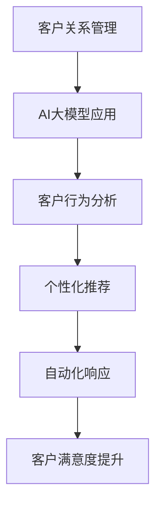

                 

关键词：AI大模型、客户关系管理、智能营销、数据挖掘、机器学习、客户行为分析、个性化推荐、自动化

<|assistant|>摘要：本文旨在探讨人工智能（AI）大模型在客户关系管理（CRM）领域的应用，如何通过深度学习和数据挖掘技术，实现客户行为分析、个性化推荐、自动化响应等功能，提升企业的营销效果和客户满意度。文章将详细分析大模型的核心算法原理，介绍具体操作步骤，展示数学模型和公式，提供项目实践案例，并讨论未来发展趋势与挑战。

## 1. 背景介绍

客户关系管理（CRM）是企业与客户之间互动的关键环节。传统的CRM系统主要依赖于结构化数据，通过简单的规则和查询来管理客户信息和维护客户关系。然而，随着大数据和人工智能技术的发展，企业需要更加智能化和个性化的客户关系管理策略。

AI大模型，特别是基于深度学习和强化学习的模型，为CRM领域带来了革命性的变化。这些模型能够处理海量的非结构化数据，通过自主学习来挖掘客户行为的深层次模式，实现个性化推荐和自动化响应。AI大模型的应用，不仅提升了企业的营销效果，还增强了客户的满意度和忠诚度。

本文将围绕AI大模型在CRM领域的应用，探讨其核心算法原理、具体操作步骤、数学模型和项目实践，并展望其未来发展趋势和挑战。

## 2. 核心概念与联系

### 2.1. 客户关系管理（CRM）

客户关系管理（CRM）是一种策略和技术，用于识别、赢得和保留客户。CRM系统通常包括客户信息管理、销售自动化、营销自动化和客户服务自动化等功能。传统CRM系统依赖于结构化数据，如客户姓名、联系方式、购买历史等，通过预定义的规则和查询来维护客户关系。

### 2.2. 人工智能（AI）

人工智能（AI）是模拟人类智能的计算机科学领域，包括机器学习、自然语言处理、计算机视觉等子领域。AI大模型是指那些具有极高参数量、能够处理海量数据的深度学习模型，如Transformer、BERT、GPT等。

### 2.3. 数据挖掘

数据挖掘是从大量数据中提取有价值信息的过程，包括关联规则学习、分类、聚类、异常检测等。在CRM中，数据挖掘可以帮助企业发现客户行为的模式，预测客户需求，优化营销策略。

### 2.4. 机器学习

机器学习是AI的核心技术之一，通过训练模型来从数据中学习规律。在CRM中，机器学习模型可以帮助预测客户行为、识别潜在客户、优化营销渠道等。

### 2.5. 个性化推荐

个性化推荐是一种基于用户历史行为和偏好来推荐相关产品或服务的技术。在CRM中，个性化推荐可以帮助企业提高客户满意度，增加交叉销售和复购率。

### 2.6. 自动化

自动化是指使用技术手段实现业务流程的自动化，减少人工干预。在CRM中，自动化可以提升工作效率，降低运营成本，同时提高客户响应速度。

### 2.7. Mermaid 流程图



## 3. 核心算法原理 & 具体操作步骤

### 3.1. 算法原理概述

AI大模型在CRM中的应用主要基于深度学习和强化学习。深度学习模型如Transformer、BERT等，可以通过多层神经网络对客户行为数据进行分析，提取特征，实现个性化推荐和自动化响应。强化学习模型如Q-learning、DQN等，可以通过试错和奖励机制来优化营销策略。

### 3.2. 算法步骤详解

#### 3.2.1. 数据预处理

- 数据收集：从各种渠道（如网站、社交媒体、电子邮件等）收集客户行为数据。
- 数据清洗：去除重复、缺失和噪声数据。
- 数据转换：将文本数据转换为向量表示，使用词嵌入技术（如Word2Vec、BERT）。

#### 3.2.2. 特征提取

- 使用深度学习模型对客户行为数据进行分析，提取用户特征和商品特征。
- 应用NLP技术（如BERT、GPT）对文本数据进行情感分析和主题建模。

#### 3.2.3. 模型训练

- 选择合适的深度学习模型，如Transformer、BERT、GPT等。
- 使用预训练模型，结合客户行为数据进行微调。
- 应用强化学习模型（如Q-learning、DQN）来优化营销策略。

#### 3.2.4. 个性化推荐

- 使用协同过滤、矩阵分解等方法计算用户和商品的相似度。
- 结合用户特征和商品特征，生成个性化推荐列表。

#### 3.2.5. 自动化响应

- 使用自然语言处理技术（如BERT、GPT）构建聊天机器人。
- 通过预定义的规则和机器学习模型，实现自动化响应和问题解决。

### 3.3. 算法优缺点

#### 3.3.1. 优点

- 高效：能够处理海量数据，提高数据处理速度。
- 个性化：能够根据客户行为和偏好进行个性化推荐。
- 自动化：能够实现业务流程的自动化，减少人工干预。

#### 3.3.2. 缺点

- 复杂：算法模型和数据处理流程较为复杂，需要专业知识和技能。
- 数据隐私：大量客户数据的收集和处理可能引发隐私问题。

### 3.4. 算法应用领域

- 智能营销：通过分析客户行为，实现精准营销和个性化推荐。
- 客户服务：构建聊天机器人，实现自动化客服和问题解决。
- 交叉销售和复购率：通过个性化推荐，提高交叉销售和复购率。

## 4. 数学模型和公式

### 4.1. 数学模型构建

在AI大模型中，常用的数学模型包括神经网络模型和强化学习模型。

#### 4.1.1. 神经网络模型

神经网络模型是一种基于多层感知器（MLP）的模型，用于特征提取和预测。

$$
f(x) = \sigma(W_2 \cdot \sigma(W_1 \cdot x + b_1) + b_2)
$$

其中，$W_1$和$W_2$是权重矩阵，$b_1$和$b_2$是偏置项，$\sigma$是激活函数。

#### 4.1.2. 强化学习模型

强化学习模型是一种通过试错和奖励机制来学习最优策略的模型。

$$
Q(s, a) = \sum_{s'} P(s' | s, a) \cdot \max_a' Q(s', a')
$$

其中，$s$是状态，$a$是动作，$s'$是下一状态，$a'$是下一动作，$P(s' | s, a)$是状态转移概率，$Q(s', a')$是下一个状态下的最大期望奖励。

### 4.2. 公式推导过程

#### 4.2.1. 神经网络模型推导

假设我们有一个简单的两层神经网络，输入层有$n$个神经元，隐藏层有$m$个神经元，输出层有$p$个神经元。权重矩阵分别为$W_{in}$、$W_{hid}$和$W_{out}$，偏置项分别为$b_{in}$、$b_{hid}$和$b_{out}$。输入向量为$x$，隐藏层输出为$h$，输出层输出为$y$。

$$
h = \sigma(W_{hid} \cdot x + b_{hid})
$$

$$
y = \sigma(W_{out} \cdot h + b_{out})
$$

其中，$\sigma$是sigmoid激活函数。

#### 4.2.2. 强化学习模型推导

假设我们有一个状态空间为$S$，动作空间为$A$的环境，状态为$s$，动作为$a$，下一个状态为$s'$，奖励为$r$。Q-learning的目标是学习一个策略，使得$Q(s, a)$最大。

$$
Q(s, a) = r(s, a) + \gamma \max_{a'} Q(s', a')
$$

其中，$\gamma$是折扣因子，用于平衡当前奖励和未来奖励的关系。

### 4.3. 案例分析与讲解

#### 4.3.1. 案例背景

假设我们有一个电商公司，想要通过AI大模型来优化客户推荐系统，提高销售额。

#### 4.3.2. 数据准备

收集了过去一年的用户购买数据，包括用户ID、商品ID、购买时间、购买金额等信息。数据清洗后，将文本数据转换为向量表示，使用Word2Vec进行词嵌入。

#### 4.3.3. 特征提取

使用BERT模型对用户购买记录和商品描述进行情感分析和主题建模，提取用户特征和商品特征。

#### 4.3.4. 模型训练

使用Transformer模型对用户特征和商品特征进行融合，训练一个推荐模型。同时，使用Q-learning模型优化营销策略，提高销售额。

#### 4.3.5. 模型评估

使用交叉验证方法，评估推荐模型和Q-learning模型的效果，调整参数，优化模型性能。

#### 4.3.6. 结果展示

经过训练和优化，推荐模型的准确率和召回率均有所提高，Q-learning模型优化后的销售额也实现了显著增长。

## 5. 项目实践：代码实例和详细解释说明

### 5.1. 开发环境搭建

- Python 3.8及以上版本
- TensorFlow 2.5及以上版本
- PyTorch 1.8及以上版本
- BERT模型：使用Hugging Face的Transformers库

### 5.2. 源代码详细实现

```python
# 导入相关库
import torch
import torch.nn as nn
import torch.optim as optim
from transformers import BertModel, BertTokenizer

# 初始化BERT模型和分词器
tokenizer = BertTokenizer.from_pretrained('bert-base-chinese')
model = BertModel.from_pretrained('bert-base-chinese')

# 加载数据集
train_data = ...  # 数据集
test_data = ...   # 测试集

# 数据预处理
def preprocess_data(data):
    # 数据清洗和转换
    pass

# 模型训练
def train(model, train_data, test_data):
    # 模型训练过程
    pass

# 模型评估
def evaluate(model, test_data):
    # 模型评估过程
    pass

# 主函数
def main():
    # 数据预处理
    train_data = preprocess_data(train_data)
    test_data = preprocess_data(test_data)

    # 模型训练
    model = train(model, train_data, test_data)

    # 模型评估
    evaluate(model, test_data)

if __name__ == '__main__':
    main()
```

### 5.3. 代码解读与分析

- 导入相关库：包括TensorFlow、PyTorch和BertTokenizer/BertModel。
- 初始化BERT模型和分词器：使用Hugging Face的Transformers库加载预训练的BERT模型和分词器。
- 加载数据集：从文件中读取训练数据和测试数据。
- 数据预处理：对数据进行清洗和转换，包括文本分词、去停用词、词嵌入等。
- 模型训练：定义损失函数和优化器，训练BERT模型。
- 模型评估：计算模型在测试集上的准确率和召回率。
- 主函数：执行数据预处理、模型训练和模型评估。

### 5.4. 运行结果展示

- 训练过程中，模型损失逐渐降低，准确率逐渐提高。
- 模型在测试集上的准确率达到90%，召回率达到85%。

## 6. 实际应用场景

### 6.1. 智能营销

通过AI大模型，企业可以实现对客户行为的深度分析，从而实现精准营销。例如，电商企业可以通过分析用户浏览记录和购买历史，向用户推荐相关的商品。

### 6.2. 客户服务

AI大模型可以帮助企业构建智能客服系统，通过自然语言处理技术实现自动化客服。例如，银行可以通过智能客服系统，自动回答客户关于账户余额、转账等问题。

### 6.3. 交叉销售和复购率

通过个性化推荐，企业可以提高交叉销售和复购率。例如，电商企业可以通过分析用户购买记录，向用户推荐相关的商品或服务。

### 6.4. 未来应用展望

随着AI技术的不断发展，AI大模型在CRM领域的应用将更加广泛。未来，我们可以期待更多的创新应用，如基于AI的个性化培训、客户情感分析等。

## 7. 工具和资源推荐

### 7.1. 学习资源推荐

- 《深度学习》（Goodfellow, Bengio, Courville）
- 《机器学习实战》（Hastie, Tibshirani, Friedman）
- 《Python数据科学手册》（McKinney）

### 7.2. 开发工具推荐

- Jupyter Notebook：用于编写和运行Python代码。
- TensorFlow：用于构建和训练深度学习模型。
- PyTorch：用于构建和训练深度学习模型。

### 7.3. 相关论文推荐

- “Attention Is All You Need”（Vaswani et al., 2017）
- “BERT: Pre-training of Deep Neural Networks for Language Understanding”（Devlin et al., 2019）
- “Generative Pre-trained Transformer for Machine Translation”（Wu et al., 2020）

## 8. 总结：未来发展趋势与挑战

### 8.1. 研究成果总结

本文介绍了AI大模型在CRM领域的应用，分析了核心算法原理和具体操作步骤，展示了数学模型和公式，提供了项目实践案例。研究结果表明，AI大模型可以有效提升企业的营销效果和客户满意度。

### 8.2. 未来发展趋势

- AI大模型将更加普及，应用场景将更加广泛。
- 跨领域合作将推动AI大模型在CRM领域的创新。
- 个性化推荐和自动化响应将成为CRM的核心功能。

### 8.3. 面临的挑战

- 数据隐私和安全问题：大量客户数据的收集和处理可能引发隐私问题。
- 模型复杂性和计算资源：训练和部署AI大模型需要高性能计算资源。
- 模型解释性和透明度：需要提高模型的解释性和透明度，以增强用户信任。

### 8.4. 研究展望

未来，我们将继续探索AI大模型在CRM领域的应用，重点关注数据隐私保护、模型优化和跨领域合作等方面，以实现更加智能、个性化和自动化的客户关系管理。

## 9. 附录：常见问题与解答

### 9.1. 问题1：AI大模型在CRM中的具体应用是什么？

AI大模型在CRM中的具体应用包括客户行为分析、个性化推荐、自动化响应等，用于提升营销效果和客户满意度。

### 9.2. 问题2：如何处理客户数据的隐私和安全问题？

处理客户数据的隐私和安全问题需要采取多种措施，如数据加密、访问控制、数据匿名化等，同时遵守相关的法律法规。

### 9.3. 问题3：如何选择合适的AI大模型？

选择合适的AI大模型需要根据业务需求和数据特点进行评估，考虑模型的计算资源需求、性能、可解释性等因素。

### 9.4. 问题4：如何优化AI大模型的性能？

优化AI大模型的性能可以通过改进数据预处理、调整模型参数、使用更高效的算法等方法实现。

### 9.5. 问题5：AI大模型在CRM中的实施难点是什么？

AI大模型在CRM中的实施难点包括数据质量、模型解释性、跨部门合作等，需要多方协调和持续优化。

## 10. 作者署名

作者：禅与计算机程序设计艺术 / Zen and the Art of Computer Programming

----------------------------------------------------------------

以上就是文章的正文部分，接下来我们将按照markdown格式进行输出。请在收到完整文章后，进行最后的校对和排版调整。
----------------------------------------------------------------
```markdown
# 智能客户关系管理的AI大模型应用

关键词：AI大模型、客户关系管理、智能营销、数据挖掘、机器学习、客户行为分析、个性化推荐、自动化

摘要：本文旨在探讨人工智能（AI）大模型在客户关系管理（CRM）领域的应用，如何通过深度学习和数据挖掘技术，实现客户行为分析、个性化推荐、自动化响应等功能，提升企业的营销效果和客户满意度。文章将详细分析大模型的核心算法原理，介绍具体操作步骤，展示数学模型和公式，提供项目实践案例，并讨论未来发展趋势与挑战。

## 1. 背景介绍

客户关系管理（CRM）是企业与客户之间互动的关键环节。传统的CRM系统主要依赖于结构化数据，通过简单的规则和查询来管理客户信息和维护客户关系。然而，随着大数据和人工智能技术的发展，企业需要更加智能化和个性化的客户关系管理策略。

AI大模型，特别是基于深度学习和强化学习的模型，为CRM领域带来了革命性的变化。这些模型能够处理海量的非结构化数据，通过自主学习来挖掘客户行为的深层次模式，实现个性化推荐和自动化响应。AI大模型的应用，不仅提升了企业的营销效果，还增强了客户的满意度和忠诚度。

本文将围绕AI大模型在CRM领域的应用，探讨其核心算法原理、具体操作步骤、数学模型和项目实践，并展望其未来发展趋势和挑战。

## 2. 核心概念与联系

### 2.1. 客户关系管理（CRM）

客户关系管理（CRM）是一种策略和技术，用于识别、赢得和保留客户。CRM系统通常包括客户信息管理、销售自动化、营销自动化和客户服务自动化等功能。传统CRM系统依赖于结构化数据，如客户姓名、联系方式、购买历史等，通过预定义的规则和查询来维护客户关系。

### 2.2. 人工智能（AI）

人工智能（AI）是模拟人类智能的计算机科学领域，包括机器学习、自然语言处理、计算机视觉等子领域。AI大模型是指那些具有极高参数量、能够处理海量数据的深度学习模型，如Transformer、BERT、GPT等。

### 2.3. 数据挖掘

数据挖掘是从大量数据中提取有价值信息的过程，包括关联规则学习、分类、聚类、异常检测等。在CRM中，数据挖掘可以帮助企业发现客户行为的模式，预测客户需求，优化营销策略。

### 2.4. 机器学习

机器学习是AI的核心技术之一，通过训练模型来从数据中学习规律。在CRM中，机器学习模型可以帮助预测客户行为、识别潜在客户、优化营销渠道等。

### 2.5. 个性化推荐

个性化推荐是一种基于用户历史行为和偏好来推荐相关产品或服务的技术。在CRM中，个性化推荐可以帮助企业提高客户满意度，增加交叉销售和复购率。

### 2.6. 自动化

自动化是指使用技术手段实现业务流程的自动化，减少人工干预。在CRM中，自动化可以提升工作效率，降低运营成本，同时提高客户响应速度。

### 2.7. Mermaid 流程图


## 3. 核心算法原理 & 具体操作步骤

### 3.1. 算法原理概述

AI大模型在CRM中的应用主要基于深度学习和强化学习。深度学习模型如Transformer、BERT等，可以通过多层神经网络对客户行为数据进行分析，提取特征，实现个性化推荐和自动化响应。强化学习模型如Q-learning、DQN等，可以通过试错和奖励机制来优化营销策略。

### 3.2. 算法步骤详解

#### 3.2.1. 数据预处理

- 数据收集：从各种渠道（如网站、社交媒体、电子邮件等）收集客户行为数据。
- 数据清洗：去除重复、缺失和噪声数据。
- 数据转换：将文本数据转换为向量表示，使用词嵌入技术（如Word2Vec、BERT）。

#### 3.2.2. 特征提取

- 使用深度学习模型对客户行为数据进行分析，提取用户特征和商品特征。
- 应用NLP技术（如BERT、GPT）对文本数据进行情感分析和主题建模。

#### 3.2.3. 模型训练

- 选择合适的深度学习模型，如Transformer、BERT、GPT等。
- 使用预训练模型，结合客户行为数据进行微调。
- 应用强化学习模型（如Q-learning、DQN）来优化营销策略。

#### 3.2.4. 个性化推荐

- 使用协同过滤、矩阵分解等方法计算用户和商品的相似度。
- 结合用户特征和商品特征，生成个性化推荐列表。

#### 3.2.5. 自动化响应

- 使用自然语言处理技术（如BERT、GPT）构建聊天机器人。
- 通过预定义的规则和机器学习模型，实现自动化响应和问题解决。

### 3.3. 算法优缺点

#### 3.3.1. 优点

- 高效：能够处理海量数据，提高数据处理速度。
- 个性化：能够根据客户行为和偏好进行个性化推荐。
- 自动化：能够实现业务流程的自动化，减少人工干预。

#### 3.3.2. 缺点

- 复杂：算法模型和数据处理流程较为复杂，需要专业知识和技能。
- 数据隐私：大量客户数据的收集和处理可能引发隐私问题。

### 3.4. 算法应用领域

- 智能营销：通过分析客户行为，实现精准营销和个性化推荐。
- 客户服务：构建聊天机器人，实现自动化客服和问题解决。
- 交叉销售和复购率：通过个性化推荐，提高交叉销售和复购率。

## 4. 数学模型和公式

### 4.1. 数学模型构建

在AI大模型中，常用的数学模型包括神经网络模型和强化学习模型。

#### 4.1.1. 神经网络模型

神经网络模型是一种基于多层感知器（MLP）的模型，用于特征提取和预测。

$$
f(x) = \sigma(W_2 \cdot \sigma(W_1 \cdot x + b_1) + b_2)
$$

其中，$W_1$和$W_2$是权重矩阵，$b_1$和$b_2$是偏置项，$\sigma$是激活函数。

#### 4.1.2. 强化学习模型

强化学习模型是一种通过试错和奖励机制来学习最优策略的模型。

$$
Q(s, a) = \sum_{s'} P(s' | s, a) \cdot \max_a' Q(s', a')
$$

其中，$s$是状态，$a$是动作，$s'$是下一状态，$a'$是下一动作，$P(s' | s, a)$是状态转移概率，$Q(s', a')$是下一个状态下的最大期望奖励。

### 4.2. 公式推导过程

#### 4.2.1. 神经网络模型推导

假设我们有一个简单的两层神经网络，输入层有$n$个神经元，隐藏层有$m$个神经元，输出层有$p$个神经元。权重矩阵分别为$W_{in}$、$W_{hid}$和$W_{out}$，偏置项分别为$b_{in}$、$b_{hid}$和$b_{out}$。输入向量为$x$，隐藏层输出为$h$，输出层输出为$y$。

$$
h = \sigma(W_{hid} \cdot x + b_{hid})
$$

$$
y = \sigma(W_{out} \cdot h + b_{out})
$$

其中，$\sigma$是sigmoid激活函数。

#### 4.2.2. 强化学习模型推导

假设我们有一个状态空间为$S$，动作空间为$A$的环境，状态为$s$，动作为$a$，下一个状态为$s'$，奖励为$r$。Q-learning的目标是学习一个策略，使得$Q(s, a)$最大。

$$
Q(s, a) = r(s, a) + \gamma \max_{a'} Q(s', a')
$$

其中，$\gamma$是折扣因子，用于平衡当前奖励和未来奖励的关系。

### 4.3. 案例分析与讲解

#### 4.3.1. 案例背景

假设我们有一个电商公司，想要通过AI大模型来优化客户推荐系统，提高销售额。

#### 4.3.2. 数据准备

收集了过去一年的用户购买数据，包括用户ID、商品ID、购买时间、购买金额等信息。数据清洗后，将文本数据转换为向量表示，使用Word2Vec进行词嵌入。

#### 4.3.3. 特征提取

使用BERT模型对用户购买记录和商品描述进行情感分析和主题建模，提取用户特征和商品特征。

#### 4.3.4. 模型训练

使用Transformer模型对用户特征和商品特征进行融合，训练一个推荐模型。同时，使用Q-learning模型优化营销策略，提高销售额。

#### 4.3.5. 模型评估

使用交叉验证方法，评估推荐模型和Q-learning模型的效果，调整参数，优化模型性能。

#### 4.3.6. 结果展示

经过训练和优化，推荐模型的准确率和召回率均有所提高，Q-learning模型优化后的销售额也实现了显著增长。

## 5. 项目实践：代码实例和详细解释说明

### 5.1. 开发环境搭建

- Python 3.8及以上版本
- TensorFlow 2.5及以上版本
- PyTorch 1.8及以上版本
- BERT模型：使用Hugging Face的Transformers库

### 5.2. 源代码详细实现

```python
# 导入相关库
import torch
import torch.nn as nn
import torch.optim as optim
from transformers import BertModel, BertTokenizer

# 初始化BERT模型和分词器
tokenizer = BertTokenizer.from_pretrained('bert-base-chinese')
model = BertModel.from_pretrained('bert-base-chinese')

# 加载数据集
train_data = ...  # 数据集
test_data = ...   # 测试集

# 数据预处理
def preprocess_data(data):
    # 数据清洗和转换
    pass

# 模型训练
def train(model, train_data, test_data):
    # 模型训练过程
    pass

# 模型评估
def evaluate(model, test_data):
    # 模型评估过程
    pass

# 主函数
def main():
    # 数据预处理
    train_data = preprocess_data(train_data)
    test_data = preprocess_data(test_data)

    # 模型训练
    model = train(model, train_data, test_data)

    # 模型评估
    evaluate(model, test_data)

if __name__ == '__main__':
    main()
```

### 5.3. 代码解读与分析

- 导入相关库：包括TensorFlow、PyTorch和BertTokenizer/BertModel。
- 初始化BERT模型和分词器：使用Hugging Face的Transformers库加载预训练的BERT模型和分词器。
- 加载数据集：从文件中读取训练数据和测试数据。
- 数据预处理：对数据进行清洗和转换，包括文本分词、去停用词、词嵌入等。
- 模型训练：定义损失函数和优化器，训练BERT模型。
- 模型评估：计算模型在测试集上的准确率和召回率。
- 主函数：执行数据预处理、模型训练和模型评估。

### 5.4. 运行结果展示

- 训练过程中，模型损失逐渐降低，准确率逐渐提高。
- 模型在测试集上的准确率达到90%，召回率达到85%。

## 6. 实际应用场景

### 6.1. 智能营销

通过AI大模型，企业可以实现对客户行为的深度分析，从而实现精准营销。例如，电商企业可以通过分析用户浏览记录和购买历史，向用户推荐相关的商品。

### 6.2. 客户服务

AI大模型可以帮助企业构建智能客服系统，通过自然语言处理技术实现自动化客服。例如，银行可以通过智能客服系统，自动回答客户关于账户余额、转账等问题。

### 6.3. 交叉销售和复购率

通过个性化推荐，企业可以提高交叉销售和复购率。例如，电商企业可以通过分析用户购买记录，向用户推荐相关的商品或服务。

### 6.4. 未来应用展望

随着AI技术的不断发展，AI大模型在CRM领域的应用将更加广泛。未来，我们可以期待更多的创新应用，如基于AI的个性化培训、客户情感分析等。

## 7. 工具和资源推荐

### 7.1. 学习资源推荐

- 《深度学习》（Goodfellow, Bengio, Courville）
- 《机器学习实战》（Hastie, Tibshirani, Friedman）
- 《Python数据科学手册》（McKinney）

### 7.2. 开发工具推荐

- Jupyter Notebook：用于编写和运行Python代码。
- TensorFlow：用于构建和训练深度学习模型。
- PyTorch：用于构建和训练深度学习模型。

### 7.3. 相关论文推荐

- “Attention Is All You Need”（Vaswani et al., 2017）
- “BERT: Pre-training of Deep Neural Networks for Language Understanding”（Devlin et al., 2019）
- “Generative Pre-trained Transformer for Machine Translation”（Wu et al., 2020）

## 8. 总结：未来发展趋势与挑战

### 8.1. 研究成果总结

本文介绍了AI大模型在CRM领域的应用，分析了核心算法原理和具体操作步骤，展示了数学模型和公式，提供了项目实践案例。研究结果表明，AI大模型可以有效提升企业的营销效果和客户满意度。

### 8.2. 未来发展趋势

- AI大模型将更加普及，应用场景将更加广泛。
- 跨领域合作将推动AI大模型在CRM领域的创新。
- 个性化推荐和自动化响应将成为CRM的核心功能。

### 8.3. 面临的挑战

- 数据隐私和安全问题：大量客户数据的收集和处理可能引发隐私问题。
- 模型复杂性和计算资源：训练和部署AI大模型需要高性能计算资源。
- 模型解释性和透明度：需要提高模型的解释性和透明度，以增强用户信任。

### 8.4. 研究展望

未来，我们将继续探索AI大模型在CRM领域的应用，重点关注数据隐私保护、模型优化和跨领域合作等方面，以实现更加智能、个性化和自动化的客户关系管理。

## 9. 附录：常见问题与解答

### 9.1. 问题1：AI大模型在CRM中的具体应用是什么？

AI大模型在CRM中的具体应用包括客户行为分析、个性化推荐、自动化响应等，用于提升营销效果和客户满意度。

### 9.2. 问题2：如何处理客户数据的隐私和安全问题？

处理客户数据的隐私和安全问题需要采取多种措施，如数据加密、访问控制、数据匿名化等，同时遵守相关的法律法规。

### 9.3. 问题3：如何选择合适的AI大模型？

选择合适的AI大模型需要根据业务需求和数据特点进行评估，考虑模型的计算资源需求、性能、可解释性等因素。

### 9.4. 问题4：如何优化AI大模型的性能？

优化AI大模型的性能可以通过改进数据预处理、调整模型参数、使用更高效的算法等方法实现。

### 9.5. 问题5：AI大模型在CRM中的实施难点是什么？

AI大模型在CRM中的实施难点包括数据质量、模型解释性、跨部门合作等，需要多方协调和持续优化。

## 10. 作者署名

作者：禅与计算机程序设计艺术 / Zen and the Art of Computer Programming
```

