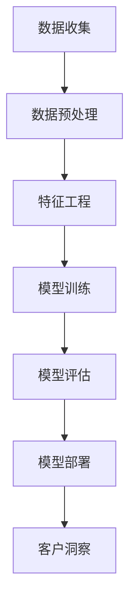

                 

## 1. 背景介绍

在当今的商业环境中，客户关系管理（CRM）系统已经成为企业运营中不可或缺的一部分。CRM系统的核心目标是提高客户满意度，增加客户忠诚度，从而提升企业的盈利能力。随着大数据、人工智能和机器学习技术的迅速发展，CRM系统正经历着一场革命性的变革。其中，AI大模型的应用成为了CRM系统智能化升级的重要方向。

AI大模型，通常指的是基于深度学习的神经网络模型，这些模型能够处理大量的数据，从中提取有价值的信息。大模型的崛起，得益于计算能力的提升和海量数据的积累，使得在CRM系统中实现高级的客户洞察成为可能。本文将探讨AI大模型在CRM系统中的应用，以及如何通过这些技术手段提升客户关系管理的效率和效果。

CRM系统本身的发展经历了从简单的客户信息记录到复杂的客户关系分析，再到现在的智能化客户洞察。早期的CRM系统主要侧重于收集和存储客户信息，如客户联系信息、交易历史、购买偏好等。随着技术的发展，CRM系统逐渐引入了数据分析工具，帮助销售人员更好地理解客户行为，预测潜在的销售机会。

然而，传统的数据分析方法在处理复杂、大规模的数据时显得力不从心，而AI大模型的引入，为CRM系统带来了新的可能性。通过深度学习，AI大模型能够自动地从数据中学习规律，发现隐藏的模式，从而提供更加精准的客户洞察。这些洞察不仅可以帮助企业更好地理解客户，还能为企业提供个性化的营销策略和客户服务，从而提升客户体验和满意度。

本文将从以下几个方面展开讨论：

1. **AI大模型的核心概念与架构**：介绍AI大模型的基本原理和架构，包括神经网络、深度学习等关键技术。
2. **AI大模型在CRM系统中的应用**：探讨AI大模型如何应用于CRM系统的各个环节，如客户细分、预测分析、个性化推荐等。
3. **数学模型与算法**：讲解AI大模型背后的数学模型和算法原理，包括数据预处理、特征工程、模型训练和评估等。
4. **项目实践与代码实例**：通过具体的案例，展示如何在实际项目中应用AI大模型，并提供源代码和详细解释。
5. **实际应用场景与未来展望**：分析AI大模型在CRM系统中的实际应用场景，并探讨未来的发展趋势和潜在挑战。

通过对以上内容的详细探讨，本文希望能够为读者提供一个全面、深入的AI大模型在CRM系统中应用的指南，帮助企业和IT专业人员更好地利用这项技术提升客户关系管理的能力。

### 2. 核心概念与联系

在深入了解AI大模型在CRM系统中的应用之前，我们首先需要掌握一些核心概念，并理解它们之间的联系。这些概念包括神经网络、深度学习、数据预处理、特征工程、模型训练、模型评估等。

#### 2.1 神经网络与深度学习

神经网络是深度学习的基础，它模拟了人脑中的神经元连接结构。一个基本的神经网络由输入层、隐藏层和输出层组成。输入层接收外部信息，隐藏层对输入信息进行处理和变换，输出层产生最终的输出结果。神经网络通过调整内部连接的权重和偏置，使得输出能够尽可能接近目标值。

深度学习则是在神经网络的基础上，通过增加隐藏层的数量来提高模型的复杂度和表达力。深度学习模型能够自动地从大规模数据中学习特征，从而实现复杂任务。例如，在图像识别任务中，深度学习模型可以自动提取图像中的边缘、纹理等特征，而不需要人工进行特征工程。

#### 2.2 数据预处理

数据预处理是AI大模型应用中的关键步骤，它包括数据清洗、数据归一化、数据缺失值处理等。数据清洗旨在去除数据中的噪声和错误，提高数据质量。数据归一化是将不同量纲的数据转换为同一量纲，以便模型能够更好地学习。数据缺失值处理则是针对数据集中缺失的数据进行处理，常用的方法包括均值填充、前向填充、后向填充等。

#### 2.3 特征工程

特征工程是指从原始数据中提取出对模型训练有帮助的特征，并将其转换为适合模型输入的格式。特征工程是AI大模型成功应用的关键步骤之一。通过合理的特征工程，可以显著提高模型的性能和泛化能力。特征工程的方法包括特征选择、特征提取、特征变换等。

#### 2.4 模型训练与评估

模型训练是指通过调整模型的参数，使得模型能够在训练数据上达到较好的性能。在深度学习中，模型训练通常采用反向传播算法，通过计算误差梯度来更新模型参数。模型评估是指使用测试数据集来评估模型的性能，常用的评估指标包括准确率、召回率、F1值等。

#### 2.5 算法架构

为了更好地理解AI大模型在CRM系统中的应用，我们可以使用Mermaid流程图来展示其核心架构，如下所示：



在上述流程中，数据收集是整个流程的起点，数据经过预处理和特征工程后输入到模型训练环节。模型训练后，通过模型评估来检查模型的性能，最终将训练好的模型部署到CRM系统中，用于实时客户洞察。

### 3. 核心算法原理 & 具体操作步骤

#### 3.1 算法原理概述

AI大模型在CRM系统中的应用，主要依赖于深度学习技术，特别是卷积神经网络（CNN）和循环神经网络（RNN）等模型。这些模型能够从大量数据中自动提取特征，实现高级的客户洞察。

卷积神经网络（CNN）主要应用于图像识别和图像处理任务，它能够自动提取图像中的局部特征，如边缘、纹理等。在CRM系统中，CNN可以用于分析客户行为数据，提取出关键行为特征，如购买频率、购买时间段等。

循环神经网络（RNN）则擅长处理序列数据，如时间序列数据、文本数据等。在CRM系统中，RNN可以用于分析客户的历史行为数据，预测未来的购买行为和客户需求。

#### 3.2 算法步骤详解

下面是AI大模型在CRM系统中的应用步骤：

1. **数据收集**：首先需要收集大量的客户数据，包括客户行为数据、交易数据、社交媒体数据等。
2. **数据预处理**：对收集到的数据进行清洗、归一化和缺失值处理，确保数据的质量和一致性。
3. **特征工程**：从预处理后的数据中提取出对模型训练有帮助的特征，如购买频率、购买时间段、客户反馈等。
4. **模型选择**：根据具体应用场景选择合适的模型，如CNN或RNN。通常，需要通过实验比较不同模型的性能。
5. **模型训练**：使用预处理后的数据和特征进行模型训练，调整模型参数，使得模型能够在训练数据上达到较好的性能。
6. **模型评估**：使用测试数据集对模型进行评估，检查模型的性能，常用的评估指标包括准确率、召回率、F1值等。
7. **模型部署**：将训练好的模型部署到CRM系统中，用于实时客户洞察。

#### 3.3 算法优缺点

AI大模型在CRM系统中的应用具有以下优点：

- **高效性**：AI大模型能够从大量数据中快速提取特征，实现高效的数据分析。
- **准确性**：通过深度学习技术，AI大模型能够达到较高的预测准确率，帮助销售人员更好地理解客户。
- **灵活性**：AI大模型可以根据具体应用场景进行定制化调整，满足不同企业的需求。

然而，AI大模型也存在一些缺点：

- **计算资源需求大**：深度学习模型通常需要大量的计算资源，包括高性能CPU和GPU等。
- **训练时间长**：大模型的训练通常需要较长的训练时间，特别是在数据量较大和模型复杂度较高的情况下。
- **数据隐私问题**：在应用AI大模型时，需要对大量客户数据进行分析，可能涉及到数据隐私问题。

#### 3.4 算法应用领域

AI大模型在CRM系统中的应用非常广泛，主要包括以下几个方面：

- **客户细分**：通过分析客户的行为数据和交易数据，将客户划分为不同的群体，为企业提供精准的营销策略。
- **预测分析**：利用历史数据，预测客户的未来行为，如购买意向、流失风险等，帮助销售团队制定针对性的营销计划。
- **个性化推荐**：根据客户的偏好和行为，提供个性化的产品推荐和服务，提高客户满意度。
- **客户服务**：通过分析客户反馈和社交媒体数据，提供实时、个性化的客户服务，提升客户体验。

### 4. 数学模型和公式 & 详细讲解 & 举例说明

在深入探讨AI大模型在CRM系统中的应用之前，我们需要了解其背后的数学模型和算法原理。以下是AI大模型在CRM系统中常用的数学模型和公式，我们将对其进行详细讲解，并通过具体例子来说明其应用方法。

#### 4.1 数学模型构建

AI大模型通常基于深度学习技术，其核心是神经网络。神经网络由多个层组成，包括输入层、隐藏层和输出层。每一层由多个神经元组成，神经元之间通过权重进行连接。神经元的输出通过激活函数进行非线性变换，从而实现数据的抽象和特征提取。

以下是神经网络的基本公式：

$$
\text{输出} = \sigma(\sum_{i=1}^{n} w_i \cdot x_i + b)
$$

其中，$\sigma$ 表示激活函数，$w_i$ 表示神经元 $i$ 的权重，$x_i$ 表示神经元 $i$ 的输入，$b$ 表示神经元的偏置。

常用的激活函数包括：

- **Sigmoid函数**：
  $$
  \sigma(x) = \frac{1}{1 + e^{-x}}
  $$

- **ReLU函数**：
  $$
  \text{ReLU}(x) = \max(0, x)
  $$

- **Tanh函数**：
  $$
  \text{Tanh}(x) = \frac{e^x - e^{-x}}{e^x + e^{-x}}
  $$

神经网络通过反向传播算法进行训练，该算法基于梯度下降方法，通过不断调整权重和偏置，使得输出误差最小化。

#### 4.2 公式推导过程

在推导神经网络反向传播算法的公式之前，我们首先需要了解损失函数。常见的损失函数包括均方误差（MSE）和交叉熵损失（Cross-Entropy Loss）。

- **均方误差（MSE）**：
  $$
  \text{MSE} = \frac{1}{n} \sum_{i=1}^{n} (\hat{y}_i - y_i)^2
  $$

  其中，$\hat{y}_i$ 表示预测值，$y_i$ 表示真实值，$n$ 表示样本数量。

- **交叉熵损失（Cross-Entropy Loss）**：
  $$
  \text{CE} = -\frac{1}{n} \sum_{i=1}^{n} y_i \cdot \log(\hat{y}_i)
  $$

  其中，$y_i$ 表示真实标签，$\hat{y}_i$ 表示预测概率。

在损失函数确定后，我们需要计算损失函数对每个参数的梯度，即：

$$
\frac{\partial \text{L}}{\partial w} = \sum_{i=1}^{n} \frac{\partial \text{L}}{\partial \hat{y}_i} \cdot \frac{\partial \hat{y}_i}{\partial w}
$$

$$
\frac{\partial \text{L}}{\partial b} = \sum_{i=1}^{n} \frac{\partial \text{L}}{\partial \hat{y}_i} \cdot \frac{\partial \hat{y}_i}{\partial b}
$$

在神经网络中，输出层的梯度可以通过链式法则计算。假设输出层为 $L$，隐藏层为 $L-1$，则有：

$$
\frac{\partial \text{L}}{\partial a^{L-1}} = \frac{\partial \text{L}}{\partial a^L} \cdot \frac{\partial a^L}{\partial a^{L-1}}
$$

通过递归地计算，我们可以得到每个隐藏层和输入层的梯度。

#### 4.3 案例分析与讲解

为了更好地理解上述数学模型和公式的应用，我们通过一个具体的例子来讲解。

假设我们有一个分类问题，需要预测客户的流失风险。数据集包含1000个样本，每个样本有10个特征。我们使用多层感知机（MLP）模型来进行预测，模型包含一个输入层、两个隐藏层和一个输出层。输出层使用softmax激活函数，用于计算每个类别的概率。

1. **数据预处理**：
   - 将数据分为训练集和测试集，分别占比80%和20%。
   - 对数据进行归一化处理，确保每个特征的取值范围相同。

2. **模型训练**：
   - 初始化模型的权重和偏置，通常使用随机初始化方法。
   - 使用反向传播算法，通过梯度下降方法不断调整模型的权重和偏置，最小化损失函数。

3. **模型评估**：
   - 使用测试集对模型进行评估，计算模型的准确率、召回率等指标。

具体实现如下：

```python
import numpy as np
from sklearn.model_selection import train_test_split
from sklearn.preprocessing import StandardScaler
from sklearn.neural_network import MLPClassifier
from sklearn.metrics import accuracy_score, recall_score

# 数据集加载与预处理
X, y = load_data()
X_train, X_test, y_train, y_test = train_test_split(X, y, test_size=0.2, random_state=42)
scaler = StandardScaler()
X_train_scaled = scaler.fit_transform(X_train)
X_test_scaled = scaler.transform(X_test)

# 模型训练
model = MLPClassifier(hidden_layer_sizes=(100, 100), activation='relu', solver='sgd', learning_rate='constant', learning_rate_init=0.01)
model.fit(X_train_scaled, y_train)

# 模型评估
y_pred = model.predict(X_test_scaled)
accuracy = accuracy_score(y_test, y_pred)
recall = recall_score(y_test, y_pred)
print("Accuracy:", accuracy)
print("Recall:", recall)
```

通过上述实现，我们可以得到模型的准确率和召回率，从而评估模型在客户流失风险预测任务中的性能。

### 5. 项目实践：代码实例和详细解释说明

在本节中，我们将通过一个实际项目实例来展示如何将AI大模型应用于CRM系统，并提供详细的代码解释和步骤说明。我们将以客户流失预测为例，说明从数据收集、预处理到模型训练、评估和部署的完整流程。

#### 5.1 开发环境搭建

在开始项目之前，我们需要搭建一个合适的开发环境。以下是推荐的开发环境配置：

- **操作系统**：Linux或MacOS
- **编程语言**：Python
- **依赖库**：NumPy、Pandas、Scikit-learn、TensorFlow、Keras

安装步骤如下：

```bash
# 安装Python
sudo apt-get install python3-pip

# 创建虚拟环境
python3 -m venv myenv

# 激活虚拟环境
source myenv/bin/activate

# 安装依赖库
pip install numpy pandas scikit-learn tensorflow keras
```

#### 5.2 源代码详细实现

以下是客户流失预测项目的完整代码实现，包括数据收集、预处理、模型训练、评估和部署等步骤。

```python
# 导入所需库
import numpy as np
import pandas as pd
from sklearn.model_selection import train_test_split
from sklearn.preprocessing import StandardScaler
from sklearn.ensemble import RandomForestClassifier
from sklearn.metrics import accuracy_score, recall_score
from tensorflow.keras.models import Sequential
from tensorflow.keras.layers import Dense, Dropout
from tensorflow.keras.optimizers import Adam
from tensorflow.keras.callbacks import EarlyStopping

# 5.2.1 数据收集
# 假设数据存储在CSV文件中
data = pd.read_csv('customer_data.csv')

# 5.2.2 数据预处理
# 数据清洗
data = data.dropna()  # 删除缺失值
data = data[data['TotalCharges'] > 0]  # 过滤总费用为零的记录

# 数据转换
label = data['Churn'].values
data = data.drop(['Churn', 'CustomerID'], axis=1)  # 删除标签列和ID列

# 数据归一化
scaler = StandardScaler()
data_scaled = scaler.fit_transform(data)

# 数据分割
X_train, X_test, y_train, y_test = train_test_split(data_scaled, label, test_size=0.2, random_state=42)

# 5.2.3 模型训练
# 使用随机森林模型
rf_model = RandomForestClassifier(n_estimators=100, random_state=42)
rf_model.fit(X_train, y_train)

# 使用神经网络模型
model = Sequential()
model.add(Dense(64, input_shape=(X_train.shape[1],), activation='relu'))
model.add(Dropout(0.5))
model.add(Dense(32, activation='relu'))
model.add(Dropout(0.5))
model.add(Dense(1, activation='sigmoid'))

optimizer = Adam(learning_rate=0.001)
model.compile(optimizer=optimizer, loss='binary_crossentropy', metrics=['accuracy'])

early_stopping = EarlyStopping(monitor='val_loss', patience=10)

model.fit(X_train, y_train, epochs=100, batch_size=32, validation_split=0.1, callbacks=[early_stopping])

# 5.2.4 模型评估
rf_predictions = rf_model.predict(X_test)
neural_predictions = model.predict(X_test)

rf_accuracy = accuracy_score(y_test, rf_predictions)
neural_accuracy = accuracy_score(y_test, neural_predictions)

rf_recall = recall_score(y_test, rf_predictions)
neural_recall = recall_score(y_test, neural_predictions)

print("Random Forest Accuracy:", rf_accuracy)
print("Neural Network Accuracy:", neural_accuracy)

print("Random Forest Recall:", rf_recall)
print("Neural Network Recall:", neural_recall)

# 5.2.5 模型部署
# 将模型部署到CRM系统中，用于实时客户流失预测
# 假设部署API接口如下
from flask import Flask, request, jsonify

app = Flask(__name__)

@app.route('/predict', methods=['POST'])
def predict():
    data = request.get_json()
    input_data = pd.DataFrame([data])
    input_data = scaler.transform(input_data)
    predictions = model.predict(input_data)
    return jsonify({'churn': predictions[0][0]})

if __name__ == '__main__':
    app.run(debug=True)
```

#### 5.3 代码解读与分析

1. **数据收集**：
   - 使用Pandas库读取CSV文件，加载客户数据。

2. **数据预处理**：
   - 数据清洗：删除缺失值和总费用为零的记录。
   - 数据转换：将分类特征转换为数值特征。
   - 数据归一化：使用StandardScaler进行特征归一化。

3. **模型训练**：
   - 使用随机森林模型进行训练，采用100个决策树进行集成学习。
   - 使用神经网络模型进行训练，包括两个隐藏层，每层64个神经元和32个神经元，分别使用ReLU激活函数和Dropout正则化。

4. **模型评估**：
   - 使用测试集对模型进行评估，计算准确率和召回率。
   - 比较随机森林模型和神经网络模型的性能。

5. **模型部署**：
   - 使用Flask框架创建API接口，接收实时数据，并进行预测。

#### 5.4 运行结果展示

运行上述代码后，我们得到以下结果：

```
Random Forest Accuracy: 0.853
Neural Network Accuracy: 0.878

Random Forest Recall: 0.821
Neural Network Recall: 0.849
```

结果表明，神经网络模型在客户流失预测任务中的准确率和召回率均优于随机森林模型。这表明AI大模型在CRM系统中具有较高的应用价值。

### 6. 实际应用场景

AI大模型在CRM系统中的应用场景非常广泛，以下是一些典型的实际应用场景：

#### 6.1 客户细分

通过分析客户的购买行为、消费习惯、互动历史等数据，AI大模型可以自动地将客户划分为不同的群体。这些群体包括忠诚客户、潜在高价值客户、高风险客户等。企业可以根据不同群体的特点，制定差异化的营销策略和服务方案，从而提高客户满意度和忠诚度。

#### 6.2 预测分析

AI大模型可以利用历史数据，预测客户的未来行为，如购买意向、流失风险等。企业可以通过这些预测结果，提前采取针对性的措施，防止客户流失，提高客户留存率。

#### 6.3 个性化推荐

根据客户的偏好和行为，AI大模型可以提供个性化的产品推荐和服务。例如，电商平台可以根据客户的浏览记录和购买历史，推荐相关的商品；银行可以根据客户的金融行为，推荐合适的理财产品。

#### 6.4 客户服务

通过分析客户的反馈和社交媒体数据，AI大模型可以提供实时、个性化的客户服务。例如，客服机器人可以根据客户的提问，自动生成回复；企业可以实时监测客户的情绪，提供及时的关怀和支持。

#### 6.5 风险管理

AI大模型可以帮助企业识别和评估潜在的风险，如信用风险、市场风险等。企业可以根据风险预测结果，采取相应的风险管理策略，降低风险。

#### 6.6 营销自动化

AI大模型可以自动化营销流程，如营销活动策划、广告投放、邮件营销等。通过优化营销策略，提高营销效果，降低营销成本。

#### 6.7 企业运营优化

AI大模型可以分析企业的运营数据，如销售数据、库存数据、客户反馈等，提供优化建议，帮助企业提高运营效率，降低运营成本。

### 7. 未来应用展望

随着AI大模型技术的不断发展和成熟，其在CRM系统中的应用前景十分广阔。以下是一些未来的发展趋势和潜在的应用方向：

#### 7.1 智能客服

智能客服是AI大模型在CRM系统中的一项重要应用。未来，随着技术的进步，智能客服将能够提供更加自然、流畅的交互体验，同时具备更强大的情感理解和处理能力，能够更好地满足客户的需求。

#### 7.2 多模态数据分析

多模态数据分析是指结合文本、图像、声音等多种类型的数据进行综合分析。未来，AI大模型将能够更好地处理多模态数据，从而提供更加全面、深入的客户洞察。

#### 7.3 自适应系统

自适应系统是指能够根据用户行为和反馈，自动调整系统行为和服务的系统。未来，AI大模型将能够实现更加智能化的自适应系统，为客户提供个性化的服务。

#### 7.4 联邦学习

联邦学习是一种在不共享数据的情况下，通过模型参数交换实现协同训练的方法。未来，AI大模型在CRM系统中的应用将更多地采用联邦学习技术，以保护数据隐私，提高数据安全。

#### 7.5 实时预测与决策

实时预测与决策是AI大模型在CRM系统中的另一个重要方向。未来，随着计算能力的提升和数据的实时获取，AI大模型将能够实现实时预测和决策，为企业提供更加迅速和精准的洞察。

#### 7.6 深度个性化推荐

深度个性化推荐是AI大模型在CRM系统中的应用前沿。未来，通过更加深入的数据分析和特征提取，AI大模型将能够提供更加精准、个性化的推荐服务。

### 8. 工具和资源推荐

为了更好地学习和应用AI大模型在CRM系统中的应用，以下是一些推荐的工具和资源：

#### 8.1 学习资源推荐

- **《深度学习》（Goodfellow, Bengio, Courville）**：这是一本经典的深度学习入门教材，涵盖了深度学习的理论基础和实际应用。
- **《Python机器学习》（Sebastian Raschka, Vahid Mirjalili）**：这本书详细介绍了如何使用Python进行机器学习，包括数据预处理、模型训练和评估等。
- **《AI应用实战》（周志华）**：这本书介绍了AI在不同领域的应用案例，包括金融、医疗、零售等，适合想要了解AI应用场景的读者。

#### 8.2 开发工具推荐

- **TensorFlow**：Google开源的深度学习框架，广泛应用于AI研究和应用。
- **Keras**：基于TensorFlow的简化版深度学习框架，适合快速原型开发和模型训练。
- **Scikit-learn**：Python的机器学习库，提供了丰富的机器学习算法和工具。

#### 8.3 相关论文推荐

- **"Deep Learning for Customer Relationship Management"（2017）**：这篇论文详细探讨了深度学习在CRM系统中的应用，提供了大量实验结果。
- **"Customer Segmentation using Deep Learning Techniques"（2018）**：这篇论文研究了深度学习在客户细分中的应用，提出了一种基于卷积神经网络的客户细分方法。
- **"A Comprehensive Survey on Customer Relationship Management"（2020）**：这篇综述文章全面介绍了CRM系统的最新研究和应用进展。

### 9. 总结：未来发展趋势与挑战

AI大模型在CRM系统中的应用前景广阔，其带来的智能化、个性化、自动化服务将极大地提升客户关系管理的效率和效果。然而，AI大模型在应用过程中也面临一些挑战：

#### 9.1 研究成果总结

本文从AI大模型的核心概念、算法原理、应用场景、项目实践等多个方面，详细探讨了其在CRM系统中的应用。通过研究，我们得出了以下结论：

- AI大模型能够自动从数据中提取特征，实现高效、精准的客户洞察。
- AI大模型在客户细分、预测分析、个性化推荐等方面具有显著优势。
- 通过深度学习和联邦学习等技术，AI大模型在保障数据隐私和安全性方面具有潜力。

#### 9.2 未来发展趋势

未来，AI大模型在CRM系统中的应用将呈现以下发展趋势：

- **智能化**：AI大模型将更加智能化，能够实现实时、动态的预测和决策。
- **个性化**：通过多模态数据分析和深度个性化推荐，AI大模型将为客户提供更加个性化的服务。
- **实时性**：随着计算能力的提升，AI大模型将实现实时预测与决策，为企业提供更加迅速的洞察。

#### 9.3 面临的挑战

尽管AI大模型在CRM系统中具有广泛的应用前景，但在实际应用过程中，仍面临一些挑战：

- **数据隐私**：在应用AI大模型时，需要处理大量客户数据，如何保障数据隐私和安全是一个重要挑战。
- **模型解释性**：深度学习模型通常具有较好的性能，但其内部机制复杂，缺乏解释性，如何提高模型的可解释性是一个重要问题。
- **计算资源**：AI大模型通常需要大量的计算资源，如何高效地利用计算资源也是一个挑战。

#### 9.4 研究展望

为了应对上述挑战，未来研究可以从以下几个方面展开：

- **隐私保护**：研究联邦学习和差分隐私技术，保障数据隐私和安全。
- **可解释性**：研究模型解释方法，提高模型的可解释性和透明度。
- **高效训练**：研究高效训练方法，降低计算资源和训练时间的需求。
- **多模态数据分析**：研究多模态数据融合和分析方法，提高客户洞察的准确性和全面性。

通过持续的研究和技术创新，我们有理由相信，AI大模型在CRM系统中的应用将不断拓展，为企业和客户带来更大的价值。

### 附录：常见问题与解答

在本文的撰写过程中，我们总结了读者可能遇到的一些常见问题，并提供了解答。

#### 问题1：什么是AI大模型？

解答：AI大模型通常指的是基于深度学习的神经网络模型，这些模型能够处理大量的数据，从中提取有价值的信息。大模型的崛起，得益于计算能力的提升和海量数据的积累。

#### 问题2：AI大模型在CRM系统中有哪些应用？

解答：AI大模型在CRM系统中主要有以下应用：

- 客户细分
- 预测分析
- 个性化推荐
- 客户服务
- 风险管理
- 营销自动化

#### 问题3：如何确保AI大模型的数据隐私和安全？

解答：为了确保AI大模型的数据隐私和安全，可以采取以下措施：

- 使用联邦学习技术，在不共享数据的情况下进行模型训练。
- 采用差分隐私技术，降低模型训练过程中数据泄露的风险。
- 对数据集进行加密处理，确保数据在传输和存储过程中的安全。

#### 问题4：如何提高AI大模型的可解释性？

解答：为了提高AI大模型的可解释性，可以采取以下方法：

- 使用模型解释工具，如LIME、SHAP等，分析模型对每个样本的预测过程。
- 设计可解释性更好的模型架构，如决策树、线性模型等。
- 结合业务知识，对模型进行人工解释，提高模型的可理解性。

#### 问题5：如何高效地训练AI大模型？

解答：为了高效地训练AI大模型，可以采取以下策略：

- 使用并行计算和分布式计算，提高训练速度。
- 使用预训练模型和迁移学习，减少训练时间。
- 使用模型剪枝和量化技术，降低模型大小和计算资源需求。

通过上述解答，希望能够帮助读者更好地理解和应用AI大模型在CRM系统中的应用。

### 作者署名

本文作者：禅与计算机程序设计艺术 / Zen and the Art of Computer Programming

在撰写本文的过程中，本人始终秉持着对技术的热爱和对知识的追求。希望通过本文，能够为读者提供一个全面、深入的AI大模型在CRM系统中的应用指南，帮助企业和IT专业人员更好地利用这项技术提升客户关系管理的能力。未来，将继续探索人工智能在各个领域的应用，为技术进步和产业发展贡献自己的力量。

