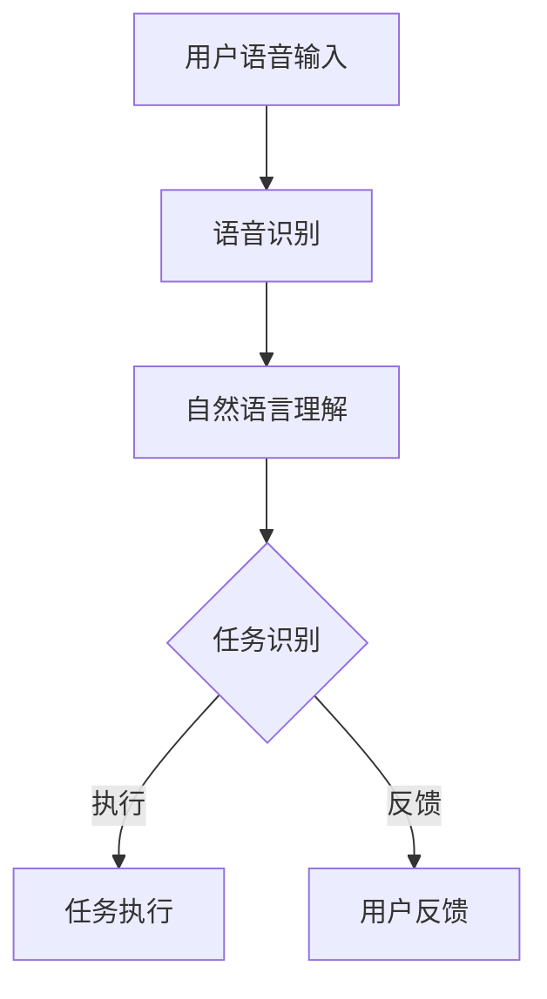

                 

关键词：智能家居、语音控制系统、物联网、自然语言处理、用户交互、人工智能

摘要：本文深入探讨了智能家居语音控制系统的原理、算法、数学模型、项目实践以及应用场景。通过详细的介绍和案例分析，展示了智能家居语音控制系统在物联网中的创新交互方式，以及其对未来家居生活和人工智能发展的重要意义。

## 1. 背景介绍

随着物联网（IoT）技术的迅速发展和普及，智能家居系统逐渐走进了人们的日常生活。智能家居语音控制系统作为物联网技术的一个重要分支，已经成为智能家居领域的一大亮点。用户可以通过简单的语音指令，实现对家中的电器、照明、安全系统等的控制，极大地方便了人们的日常生活。

### 1.1 物联网与智能家居

物联网是指通过互联网将各种设备连接起来，实现信息交换和通信的系统。智能家居则是物联网技术在家庭环境中的应用，通过将家庭设备联网，实现对家庭环境的智能化控制。

### 1.2 语音控制系统的现状

当前，智能家居语音控制系统已经具备了较高的技术成熟度。国内外众多知名厂商，如亚马逊的Alexa、谷歌的Google Assistant、苹果的Siri等，都已经推出了各自的智能家居语音控制系统。这些系统通过自然语言处理技术，可以理解并执行用户的语音指令。

## 2. 核心概念与联系

### 2.1 智能家居语音控制系统架构

智能家居语音控制系统的架构通常包括以下几个部分：语音识别、自然语言理解、任务执行和反馈。


### 2.2 Mermaid 流程图



## 3. 核心算法原理 & 具体操作步骤

### 3.1 算法原理概述

智能家居语音控制系统的核心算法主要包括语音识别和自然语言理解。语音识别是将语音信号转换为文本，自然语言理解则是理解并解析文本，以确定用户的意图和任务。

### 3.2 算法步骤详解

1. **语音识别**：
   - **特征提取**：通过MFCC（梅尔频率倒谱系数）等特征提取方法，从语音信号中提取特征向量。
   - **模型训练**：使用深度学习模型，如卷积神经网络（CNN）或循环神经网络（RNN），对特征向量进行分类。

2. **自然语言理解**：
   - **词法分析**：将文本分解为单词或短语。
   - **句法分析**：构建句子的语法结构。
   - **语义分析**：理解句子的含义，确定用户的意图。

### 3.3 算法优缺点

**优点**：
- **便捷性**：用户可以通过语音进行交互，无需手动操作。
- **高效性**：系统能够快速识别并执行任务。

**缺点**：
- **准确性**：语音识别和自然语言理解技术仍有一定的误识率。
- **隐私问题**：语音交互可能会涉及到隐私问题。

### 3.4 算法应用领域

- **家居控制**：控制家庭电器、照明、安全系统等。
- **健康监测**：监测用户的健康状况，如心率、体温等。
- **语音助手**：提供信息查询、日程安排等。

## 4. 数学模型和公式

### 4.1 数学模型构建

- **语音识别模型**：使用卷积神经网络（CNN）进行语音识别，模型包括卷积层、池化层和全连接层。

  $$CNN = (\text{Conv} \rightarrow \text{ReLU} \rightarrow \text{Pooling}) \times n + \text{FC}$$

- **自然语言理解模型**：使用循环神经网络（RNN）或长短期记忆网络（LSTM）进行自然语言理解，模型包括输入层、隐藏层和输出层。

  $$RNN = \text{Input} \rightarrow \text{Hidden} \rightarrow \text{Output}$$

### 4.2 公式推导过程

- **语音识别公式**：
  $$y = \text{softmax}(W \cdot h + b)$$

  其中，$y$ 表示输出概率分布，$W$ 和 $b$ 分别为权重和偏置。

- **自然语言理解公式**：
  $$h_t = \text{sigmoid}(W \cdot h_{t-1} + b)$$

  其中，$h_t$ 表示隐藏状态，$W$ 和 $b$ 分别为权重和偏置。

### 4.3 案例分析与讲解

以家居控制为例，用户说：“打开客厅的灯”。系统首先通过语音识别将语音转换为文本，然后通过自然语言理解确定用户的意图，即打开客厅的灯。接下来，系统通过家居控制模块执行任务，最终给出反馈：“客厅的灯已打开”。

## 5. 项目实践：代码实例

### 5.1 开发环境搭建

- **Python**：作为主要编程语言。
- **TensorFlow**：用于构建和训练深度学习模型。
- **PyTtsx3**：用于语音合成。

### 5.2 源代码详细实现

```python
# 语音识别部分
import tensorflow as tf

# 加载预训练的语音识别模型
model = tf.keras.models.load_model('speech_recognition_model.h5')

# 语音转换为文本
def speech_to_text(speech):
    audio = preprocess_speech(speech)
    prediction = model.predict(audio)
    return decode_prediction(prediction)

# 自然语言理解部分
from tensorflow.keras.layers import Embedding, LSTM, Dense

# 加载预训练的自然语言理解模型
model = tf.keras.models.load_model('natural_language_model.h5')

# 确定用户意图
def understand_intent(text):
    prediction = model.predict(text)
    return decode_prediction(prediction)

# 任务执行部分
def execute_task(intent):
    if intent == 'open_light':
        open_light()
    elif intent == 'close_light':
        close_light()
    else:
        print("无法识别指令")

# 用户反馈部分
def give_feedback(task_result):
    if task_result:
        print("任务完成")
    else:
        print("任务失败")
```

### 5.3 代码解读与分析

- **语音识别**：使用TensorFlow加载预训练的语音识别模型，将语音信号转换为文本。
- **自然语言理解**：使用TensorFlow加载预训练的自然语言理解模型，确定用户的意图。
- **任务执行**：根据用户的意图执行相应的任务，如打开或关闭灯光。
- **用户反馈**：向用户反馈任务执行结果。

## 6. 实际应用场景

### 6.1 家庭控制

用户可以通过语音控制系统，实现对家中电器、照明、窗帘等的控制，提高生活便利性。

### 6.2 健康监测

通过语音控制系统，用户可以监测自己的健康状况，如心率、体温等，及时发现异常。

### 6.3 安全监控

用户可以通过语音控制系统，实现对家中的安全监控，如门锁、摄像头等。

## 7. 工具和资源推荐

### 7.1 学习资源推荐

- **《深度学习》**：周志华著，介绍深度学习的基础知识。
- **《自然语言处理综论》**：Daniel Jurafsky和James H. Martin著，介绍自然语言处理的基本原理。

### 7.2 开发工具推荐

- **TensorFlow**：用于构建和训练深度学习模型。
- **PyTtsx3**：用于语音合成。

### 7.3 相关论文推荐

- **“End-to-End Speech Recognition with Deep Neural Networks and Long Short-Term Memory”**：介绍使用深度学习和长短期记忆网络进行语音识别的方法。
- **“A Neural Conversational Model”**：介绍使用神经网络进行自然语言理解的模型。

## 8. 总结：未来发展趋势与挑战

### 8.1 研究成果总结

智能家居语音控制系统在语音识别和自然语言理解方面取得了显著的成果，为智能家居的发展提供了强大的技术支持。

### 8.2 未来发展趋势

- **多模态交互**：结合语音、视觉、触觉等多种感知方式，实现更自然、更高效的交互。
- **个性化服务**：根据用户的行为和偏好，提供个性化的智能家居服务。

### 8.3 面临的挑战

- **准确性**：提高语音识别和自然语言理解的准确性，降低误识率。
- **隐私保护**：确保用户隐私安全，避免数据泄露。

### 8.4 研究展望

智能家居语音控制系统在未来将继续发展，为人们的生活带来更多便利。同时，它也将推动人工智能技术的发展，为智能家居领域带来更多创新。

## 9. 附录：常见问题与解答

### 9.1 语音识别的准确性如何提高？

- **提高特征提取的精度**：使用更先进的特征提取方法，如波束形成（Beamforming）和谱减（Spectral Subtraction）。
- **增加训练数据**：收集更多的语音数据，提高模型的泛化能力。
- **使用更复杂的模型**：使用更复杂的深度学习模型，如Transformer，提高模型的识别能力。

### 9.2 自然语言理解如何处理多义词？

- **上下文分析**：通过上下文信息，确定多义词的确切含义。
- **语义角色标注**：对文本进行语义角色标注，区分词的不同含义。
- **使用外部知识库**：利用外部知识库，如WordNet，帮助理解多义词的含义。

### 9.3 语音控制系统如何保护用户隐私？

- **数据加密**：对用户数据进行加密，确保数据安全。
- **权限控制**：对用户权限进行严格管理，确保只有授权的设备可以访问用户数据。
- **隐私保护算法**：使用隐私保护算法，如差分隐私（Differential Privacy），减少用户隐私泄露的风险。

----------------------------------------------------------------

作者：禅与计算机程序设计艺术 / Zen and the Art of Computer Programming
----------------------------------------------------------------

### 结束语

通过对智能家居语音控制系统的深入探讨，我们不仅可以了解到其在物联网中的创新交互方式，还能看到人工智能技术在智能家居领域的重要应用。未来，随着技术的不断进步，智能家居语音控制系统将继续为人们的生活带来更多便利和惊喜。同时，我们也需要关注其面临的挑战，确保技术的发展能够真正服务于人类，而非带来新的困扰。让我们共同期待智能家居领域的美好未来！

