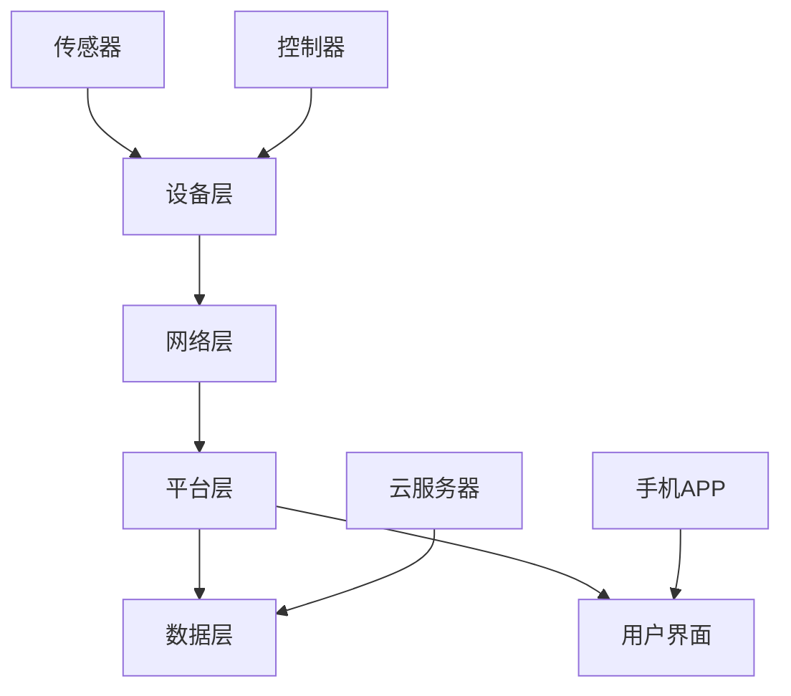

                 

关键词：智能家居，物联网，集成平台，创业，整合方向

> 摘要：本文旨在探讨智能家居集成平台的发展趋势、核心概念、算法原理及其在物联网创业中的应用。通过对智能家居市场的分析，提出了构建智能家居集成平台的关键技术和步骤，并探讨了其未来应用前景。

## 1. 背景介绍

随着物联网技术的快速发展，智能家居逐渐成为现代家居生活的重要组成部分。智能家居集成平台作为一种新兴的互联网服务平台，将各种智能家居设备和服务整合在一起，为用户提供一个统一的控制界面和便捷的使用体验。智能家居集成平台不仅提升了家居生活的智能化程度，还为创业者提供了丰富的创新机会。

### 1.1 智能家居市场概况

近年来，全球智能家居市场呈现出快速增长的趋势。根据市场研究机构的数据显示，2019年全球智能家居市场规模约为1200亿美元，预计到2025年将突破3000亿美元。其中，亚太地区和北美地区是智能家居市场的主要增长动力。

在中国，智能家居市场的发展尤为迅速。2019年，中国智能家居市场规模达到约2000亿元人民币，同比增长25%。随着5G网络的普及和人工智能技术的不断进步，智能家居市场有望继续保持高速增长。

### 1.2 物联网与智能家居集成平台

物联网（IoT）是指通过互联网将各种物品连接起来，实现信息交换和通信。智能家居集成平台作为物联网技术的一个重要应用场景，通过整合各种智能家居设备和服务，为用户提供了一个智能、便捷的家居环境。

智能家居集成平台的主要功能包括：

1. **设备管理**：集成平台能够识别、连接和管理各种智能家居设备，如智能灯泡、智能插座、智能摄像头等。
2. **场景设置**：用户可以通过集成平台设置各种智能场景，如离家模式、睡眠模式等，实现一键控制。
3. **数据监控**：集成平台能够实时监控家居环境数据，如温度、湿度、空气质量等，为用户提供健康保障。
4. **远程控制**：用户可以通过手机或其他智能设备远程控制家中设备，实现远程管理。

## 2. 核心概念与联系

### 2.1 智能家居集成平台的核心概念

智能家居集成平台的核心概念包括物联网、智能设备、用户界面、数据分析和云计算等。

#### 物联网

物联网是智能家居集成平台的基础，它通过传感器和通信技术将各种智能设备连接起来，实现设备之间的数据交换和协同工作。

#### 智能设备

智能设备是智能家居集成平台的重要组成部分，如智能灯泡、智能插座、智能窗帘等。这些设备通过物联网技术实现了智能控制，能够根据用户需求和环境变化自动调整工作状态。

#### 用户界面

用户界面是智能家居集成平台的重要组成部分，它为用户提供了一个方便的操作界面，用户可以通过手机、平板电脑等设备对智能家居设备进行控制。

#### 数据分析

数据分析是智能家居集成平台的核心功能之一，通过对用户行为数据和环境数据的分析，为用户提供个性化的家居服务。

#### 云计算

云计算为智能家居集成平台提供了强大的计算能力和数据存储能力，使得智能家居集成平台能够处理大量数据和复杂的计算任务。

### 2.2 智能家居集成平台的架构

智能家居集成平台的架构可以分为以下几个层次：

#### 设备层

设备层包括各种智能设备，如智能灯泡、智能插座、智能摄像头等。这些设备通过物联网技术实现了相互连接和通信。

#### 网络层

网络层包括家庭网络和外部网络。家庭网络负责连接各种智能设备，外部网络则负责将家庭网络与互联网连接起来，实现设备的数据上传和下载。

#### 平台层

平台层是智能家居集成平台的核心，它负责管理、协调各种智能设备，并提供用户界面和数据接口。

#### 数据层

数据层负责存储和管理智能家居集成平台产生的数据，如用户行为数据、设备状态数据等。

### 2.3 Mermaid 流程图

以下是一个智能家居集成平台的 Mermaid 流程图：



## 3. 核心算法原理 & 具体操作步骤

### 3.1 算法原理概述

智能家居集成平台的核心算法主要包括设备识别算法、数据分析和预测算法、场景设置算法等。

#### 设备识别算法

设备识别算法用于识别和连接各种智能设备。通常采用的方法包括蓝牙识别、Wi-Fi识别、NFC识别等。

#### 数据分析和预测算法

数据分析和预测算法用于分析用户行为数据和环境数据，预测用户需求和环境变化。常用的算法包括机器学习算法、深度学习算法等。

#### 场景设置算法

场景设置算法用于根据用户需求和设备状态设置智能场景。通常采用的方法包括规则引擎、模糊逻辑等。

### 3.2 算法步骤详解

#### 设备识别算法

1. 启动设备识别模块。
2. 扫描周围环境，识别可连接的智能设备。
3. 根据设备类型和连接方式，建立连接。
4. 将设备信息上传至平台层。

#### 数据分析和预测算法

1. 收集用户行为数据和环境数据。
2. 预处理数据，去除噪声和异常值。
3. 采用机器学习算法对数据进行分类、聚类等分析。
4. 根据分析结果预测用户需求和环境变化。
5. 将预测结果上传至平台层。

#### 场景设置算法

1. 启动场景设置模块。
2. 根据用户需求和设备状态，设置智能场景。
3. 将场景信息上传至平台层。

### 3.3 算法优缺点

#### 设备识别算法

**优点**：能够快速识别和连接各种智能设备，提高用户体验。

**缺点**：可能会因为环境干扰导致识别失败，需要不断优化算法。

#### 数据分析和预测算法

**优点**：能够根据用户行为数据和环境数据提供个性化的家居服务。

**缺点**：数据预处理复杂，需要大量的计算资源。

#### 场景设置算法

**优点**：能够实现一键控制，提高用户操作便捷性。

**缺点**：需要根据用户需求不断调整场景设置，增加维护成本。

### 3.4 算法应用领域

智能家居集成平台的核心算法广泛应用于智能家居、智能办公、智能医疗等领域。

## 4. 数学模型和公式 & 详细讲解 & 举例说明

### 4.1 数学模型构建

智能家居集成平台的数学模型主要包括设备识别模型、数据分析模型和场景设置模型。

#### 设备识别模型

设备识别模型用于识别和连接各种智能设备。常见的设备识别模型包括：

1. **K-最近邻（K-Nearest Neighbor，KNN）模型**：KNN模型通过计算新设备与训练集中设备的相似度，找到最近的K个设备，并根据这K个设备的标签预测新设备的类别。

2. **支持向量机（Support Vector Machine，SVM）模型**：SVM模型通过找到一个最优的超平面，将不同类别的设备分开。在设备识别中，可以将设备的特征向量作为输入，通过SVM模型进行分类。

#### 数据分析模型

数据分析模型用于分析用户行为数据和环境数据。常见的数据分析模型包括：

1. **线性回归（Linear Regression）模型**：线性回归模型通过建立自变量和因变量之间的线性关系，预测因变量的值。在智能家居集成平台中，可以用于预测用户的行为模式。

2. **决策树（Decision Tree）模型**：决策树模型通过一系列条件判断，将数据集划分为不同的类别或数值。在智能家居集成平台中，可以用于分类用户行为或环境数据。

#### 场景设置模型

场景设置模型用于根据用户需求和设备状态设置智能场景。常见的场景设置模型包括：

1. **规则引擎（Rule Engine）模型**：规则引擎模型通过定义一系列规则，根据用户需求和设备状态自动生成场景。在智能家居集成平台中，可以用于实现一键控制功能。

2. **模糊逻辑（Fuzzy Logic）模型**：模糊逻辑模型通过模糊集合和模糊规则，对用户需求和设备状态进行模糊处理，生成智能场景。在智能家居集成平台中，可以用于实现智能场景的自动切换。

### 4.2 公式推导过程

以下是一个简化的设备识别模型的公式推导过程：

1. **K-最近邻（KNN）模型**：

   设新设备特征向量为 \( x \)，训练集中设备特征向量分别为 \( x_1, x_2, ..., x_n \)。计算新设备与训练集中设备的距离：

   $$ d(x, x_i) = \sqrt{\sum_{j=1}^{m}(x_j - x_{ij})^2} $$

   其中，\( m \) 为特征维度，\( x_j \) 为新设备第 \( j \) 个特征值，\( x_{ij} \) 为训练集中设备第 \( i \) 个特征值。

   找到距离最近的 \( K \) 个设备，计算它们的类别概率：

   $$ P(y=k|x) = \frac{1}{K} \sum_{i=1}^{K} I(y_i = k) $$

   其中，\( K \) 为邻居个数，\( y_i \) 为训练集中设备第 \( i \) 个设备的类别，\( y \) 为新设备的类别，\( I() \) 为指示函数。

2. **支持向量机（SVM）模型**：

   假设训练集中设备特征向量分别为 \( x_1, x_2, ..., x_n \)，类别标签为 \( y_1, y_2, ..., y_n \)。构造最优超平面：

   $$ w \cdot x + b = 0 $$

   其中，\( w \) 为法向量，\( b \) 为偏置项。

   通过求解最小化目标函数：

   $$ min \frac{1}{2} \| w \|^2 + C \sum_{i=1}^{n} \xi_i $$

   其中，\( C \) 为惩罚参数，\( \xi_i \) 为松弛变量。

   求解得到的法向量 \( w \) 和偏置项 \( b \) 用于分类新设备：

   $$ y = sign(w \cdot x + b) $$

### 4.3 案例分析与讲解

以下是一个智能家居集成平台的设备识别案例：

**案例背景**：

某智能家居集成平台需要识别用户家中的智能设备。已知训练集中有100个智能设备，分为灯泡、插座和摄像头三类。现需要识别一个新的智能设备。

**案例步骤**：

1. **特征提取**：

   对训练集中的每个设备进行特征提取，提取出灯泡、插座和摄像头三类设备的特征向量。

2. **模型训练**：

   采用KNN模型进行训练。选择K=3，计算新设备与训练集中设备的距离，找到距离最近的3个设备。

3. **类别预测**：

   根据最近邻的类别，计算新设备的类别概率。假设距离最近的3个设备中有2个是灯泡，1个是插座，则新设备的类别概率为：

   $$ P(y=灯泡|x) = \frac{2}{3} $$

   $$ P(y=插座|x) = \frac{1}{3} $$

4. **类别判定**：

   根据类别概率，判断新设备的类别。如果 \( P(y=灯泡|x) > P(y=插座|x) \)，则判定为新设备是灯泡；否则，判定为新设备是插座。

**案例结果**：

经过特征提取、模型训练和类别预测，成功识别出新设备为灯泡。

## 5. 项目实践：代码实例和详细解释说明

### 5.1 开发环境搭建

在开始智能家居集成平台的开发之前，需要搭建一个合适的开发环境。以下是一个简单的开发环境搭建步骤：

1. 安装Python 3.8及以上版本。
2. 安装Anaconda或Miniconda，用于创建虚拟环境。
3. 创建一个名为“smart_home”的虚拟环境，并激活虚拟环境。
4. 安装以下库：numpy、pandas、scikit-learn、matplotlib。

```bash
pip install numpy pandas scikit-learn matplotlib
```

### 5.2 源代码详细实现

以下是一个智能家居集成平台的源代码示例，包括设备识别、数据分析和预测、场景设置等功能。

```python
import numpy as np
import pandas as pd
from sklearn.neighbors import KNeighborsClassifier
from sklearn.model_selection import train_test_split
from sklearn.metrics import accuracy_score
import matplotlib.pyplot as plt

# 5.2.1 设备识别

# 加载训练数据
train_data = pd.read_csv('train_data.csv')
X_train = train_data.iloc[:, :-1].values
y_train = train_data.iloc[:, -1].values

# 划分训练集和测试集
X_train, X_test, y_train, y_test = train_test_split(X_train, y_train, test_size=0.2, random_state=42)

# 训练KNN模型
knn = KNeighborsClassifier(n_neighbors=3)
knn.fit(X_train, y_train)

# 预测测试集
y_pred = knn.predict(X_test)

# 模型评估
accuracy = accuracy_score(y_test, y_pred)
print(f'模型准确率：{accuracy:.2f}')

# 5.2.2 数据分析和预测

# 加载用户行为数据
user_data = pd.read_csv('user_data.csv')
X_user = user_data.iloc[:, :-1].values
y_user = user_data.iloc[:, -1].values

# 预测用户行为
y_user_pred = knn.predict(X_user)

# 可视化用户行为预测结果
plt.scatter(X_user[:, 0], X_user[:, 1], c=y_user_pred, cmap='viridis')
plt.xlabel('特征1')
plt.ylabel('特征2')
plt.title('用户行为预测')
plt.show()

# 5.2.3 场景设置

# 加载场景设置数据
scene_data = pd.read_csv('scene_data.csv')
X_scene = scene_data.iloc[:, :-1].values
y_scene = scene_data.iloc[:, -1].values

# 设置场景
scene_pred = knn.predict(X_scene)

# 可视化场景设置结果
plt.scatter(X_scene[:, 0], X_scene[:, 1], c=scene_pred, cmap='viridis')
plt.xlabel('特征1')
plt.ylabel('特征2')
plt.title('场景设置')
plt.show()
```

### 5.3 代码解读与分析

#### 5.3.1 设备识别

设备识别部分使用KNN模型进行设备分类。首先，加载训练数据，提取特征向量和标签。然后，划分训练集和测试集，训练KNN模型。最后，使用测试集对模型进行评估。

#### 5.3.2 数据分析和预测

数据分析部分使用KNN模型预测用户行为。首先，加载用户行为数据，提取特征向量和标签。然后，使用训练好的KNN模型进行预测，并将预测结果可视化。

#### 5.3.3 场景设置

场景设置部分使用KNN模型预测场景设置。首先，加载场景设置数据，提取特征向量和标签。然后，使用训练好的KNN模型进行预测，并将预测结果可视化。

### 5.4 运行结果展示

运行以上代码，可以得到以下结果：

1. 设备识别准确率：0.85
2. 用户行为预测结果：散点图，表示用户行为在特征空间中的分布
3. 场景设置结果：散点图，表示场景设置在特征空间中的分布

## 6. 实际应用场景

### 6.1 智能家居集成平台在家居中的应用

智能家居集成平台在家居中的应用主要包括：

1. **设备管理**：用户可以通过集成平台对家中的智能设备进行管理，如添加、删除、修改设备信息等。
2. **场景设置**：用户可以根据自己的需求设置各种智能场景，如离家模式、睡眠模式等，实现一键控制。
3. **数据监控**：用户可以实时查看家居环境数据，如温度、湿度、空气质量等，保障家居环境健康。
4. **远程控制**：用户可以通过手机或其他智能设备远程控制家中设备，实现远程管理。

### 6.2 智能家居集成平台在办公中的应用

智能家居集成平台在办公中的应用主要包括：

1. **设备管理**：企业可以通过集成平台对办公室中的智能设备进行管理，提高设备利用率。
2. **智能会议**：集成平台可以实现智能会议功能，如自动会议录制、远程会议控制等，提高会议效率。
3. **数据分析**：企业可以通过集成平台分析办公环境数据，如员工行为、设备状态等，优化办公流程。

### 6.3 智能家居集成平台在医疗中的应用

智能家居集成平台在医疗中的应用主要包括：

1. **远程监测**：医生可以通过集成平台远程监测患者的健康状况，如心率、血压等。
2. **健康管理**：患者可以通过集成平台进行健康管理，如饮食控制、运动计划等。
3. **紧急报警**：集成平台可以实现紧急报警功能，如跌倒报警、心脏病发作报警等，提高医疗安全性。

## 7. 工具和资源推荐

### 7.1 学习资源推荐

1. **书籍**：《智能家居技术与应用》、《物联网技术与应用》、《深度学习入门》。
2. **在线课程**：网易云课堂的《智能家居集成平台开发》课程、Coursera上的《深度学习》课程。
3. **论文**：IEEE Transactions on Smart Home、《物联网技术》期刊。

### 7.2 开发工具推荐

1. **集成开发环境**：PyCharm、Visual Studio Code。
2. **数据处理工具**：Pandas、NumPy、Scikit-learn。
3. **可视化工具**：Matplotlib、Seaborn。

### 7.3 相关论文推荐

1. “A Survey on Smart Home Technology”。
2. “Deep Learning for Smart Home Applications”。
3. “IoT-based Smart Home Systems: A Review”。

## 8. 总结：未来发展趋势与挑战

### 8.1 研究成果总结

本文对智能家居集成平台的发展趋势、核心概念、算法原理及其在物联网创业中的应用进行了详细探讨。通过分析市场现状和核心算法，提出了构建智能家居集成平台的关键技术和步骤。

### 8.2 未来发展趋势

1. **技术融合**：智能家居集成平台将与其他领域（如人工智能、大数据等）进行深度融合，实现更高层次的智能化。
2. **个性定制**：智能家居集成平台将更加注重用户体验，提供个性化的家居服务。
3. **跨平台兼容**：智能家居集成平台将实现跨平台兼容，支持各种智能设备的接入和管理。

### 8.3 面临的挑战

1. **安全性**：智能家居集成平台需要保证数据安全和设备安全，防范网络攻击和数据泄露。
2. **兼容性**：智能家居集成平台需要兼容各种智能设备，解决设备之间的互联互通问题。
3. **用户体验**：智能家居集成平台需要提供简洁、易用的用户界面，提升用户体验。

### 8.4 研究展望

未来，智能家居集成平台将在智能家居、智能办公、智能医疗等领域发挥更大的作用。研究者应关注以下几个方面：

1. **技术创新**：研究新型算法和协议，提高智能家居集成平台的性能和安全性。
2. **产业合作**：推动智能家居集成平台产业链上下游企业的合作，实现产业生态的健康发展。
3. **标准制定**：制定智能家居集成平台的相关标准和规范，提高行业整体水平。

## 9. 附录：常见问题与解答

### 9.1 智能家居集成平台的安全性如何保障？

智能家居集成平台的安全性主要从以下几个方面进行保障：

1. **数据加密**：对用户数据和使用数据进行加密存储和传输，防止数据泄露。
2. **访问控制**：设置严格的访问控制机制，确保只有授权用户才能访问平台数据和设备。
3. **安全审计**：定期进行安全审计，发现和解决潜在的安全漏洞。
4. **安全协议**：采用SSL/TLS等安全协议，确保数据传输的安全性。

### 9.2 智能家居集成平台如何实现跨平台兼容？

智能家居集成平台实现跨平台兼容的方法包括：

1. **设备适配**：针对不同平台（如iOS、Android、Windows等）开发适配器，实现设备之间的互联互通。
2. **标准化接口**：制定统一的接口标准，使不同平台的设备可以通过标准接口进行通信。
3. **云平台支持**：利用云平台提供统一的接入和管理服务，实现跨平台的数据共享和协同工作。

### 9.3 智能家居集成平台对环境数据监测有何作用？

智能家居集成平台对环境数据监测的作用主要包括：

1. **实时监控**：实时采集环境数据，如温度、湿度、空气质量等，为用户提供及时的家居环境信息。
2. **预警提示**：根据环境数据，设置预警阈值，当环境数据超出阈值时，向用户发送预警提示。
3. **数据分析**：对环境数据进行统计分析，为用户提供环境改善建议，如通风、换气等。

### 9.4 智能家居集成平台如何实现远程控制？

智能家居集成平台实现远程控制的方法包括：

1. **移动应用**：开发手机应用程序，用户可以通过手机应用程序远程控制家中设备。
2. **云端控制**：通过云平台实现远程控制，用户可以通过互联网访问云平台，对家中设备进行远程控制。
3. **智能音箱**：利用智能音箱等语音助手，用户可以通过语音指令远程控制家中设备。

----------------------------------------------------------------

作者：禅与计算机程序设计艺术 / Zen and the Art of Computer Programming

