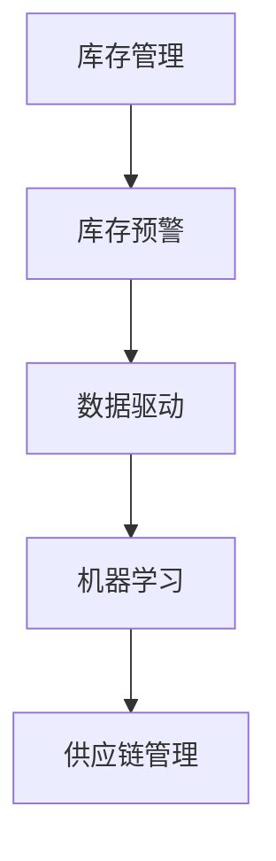

                 

关键词：智能库存管理、电商库存预测、库存预警系统、数据驱动、人工智能、机器学习、预测模型、供应链管理

> 摘要：本文将探讨如何构建一套智能库存预警系统，帮助小型电商企业有效避免库存积压与断货现象。通过对核心概念、算法原理、数学模型、项目实践等方面的深入分析，本文旨在为电商从业者提供一套实用的预测模型，以优化库存管理，提高运营效率。

## 1. 背景介绍

随着互联网技术的飞速发展和电子商务的普及，电子商务市场日益繁荣。然而，库存管理作为电商运营的核心环节，却常常面临诸多挑战。一方面，库存积压导致资金占用、仓储成本增加；另一方面，断货现象导致客户流失、订单损失。为解决这一难题，传统的库存管理方法已难以满足现代电商的快速变化需求，迫切需要引入智能库存预警系统。

智能库存预警系统通过数据分析和机器学习算法，对电商销售数据、市场需求、供应链信息等进行深入挖掘和预测，提前发现库存积压和断货的风险，从而实现精准的库存管理。本文将详细介绍智能库存预警系统的构建方法，包括核心概念、算法原理、数学模型以及实际应用场景。

## 2. 核心概念与联系

### 2.1. 库存管理

库存管理是指对企业的库存物资进行计划、控制、使用和处理的系统过程。它包括库存水平控制、库存成本控制、库存周转率控制等多个方面。在电商领域，库存管理涉及到商品采购、存储、配送等环节，直接影响企业的运营效率和客户满意度。

### 2.2. 库存预警

库存预警是指通过监测库存数据，提前发现库存积压或断货风险，并采取相应措施进行预防和调整。库存预警系统通常基于历史销售数据、市场需求预测、供应链信息等多个因素进行综合分析，以提高库存管理的准确性和效率。

### 2.3. 数据驱动

数据驱动是指利用数据分析和机器学习算法，对业务过程进行优化和改进。在智能库存预警系统中，数据驱动理念贯穿始终，通过对海量数据的挖掘和分析，实现精准的库存预测和预警。

### 2.4. 机器学习

机器学习是指利用计算机算法，从数据中学习规律和模式，并对未知数据进行预测和分类。在智能库存预警系统中，机器学习算法广泛应用于销售预测、需求预测、风险预测等方面，以提高预测模型的准确性和可靠性。

### 2.5. 供应链管理

供应链管理是指通过协调供应链各个环节，实现物流、信息流、资金流的高效运转。在电商领域，供应链管理涉及到供应商管理、仓储管理、配送管理等多个方面，对库存预警系统的构建和优化具有重要意义。

### 2.6. Mermaid 流程图

以下是一个简单的 Mermaid 流程图，展示了智能库存预警系统的核心概念和联系：



## 3. 核心算法原理 & 具体操作步骤

### 3.1. 算法原理概述

智能库存预警系统主要基于时间序列预测算法和回归分析算法，对电商销售数据进行分析和建模，从而实现库存预测和预警。以下是两种核心算法的基本原理：

#### 时间序列预测算法

时间序列预测算法是一种基于时间序列数据的预测方法，通过分析历史数据的时间规律，对未来数据进行预测。常见的时间序列预测算法包括 ARIMA、SARIMA、LSTM 等。

#### 回归分析算法

回归分析算法是一种基于统计方法的预测方法，通过建立变量之间的回归关系，对未知数据进行预测。常见的回归分析算法包括线性回归、多项式回归、逻辑回归等。

### 3.2. 算法步骤详解

以下是智能库存预警系统的具体操作步骤：

#### 1. 数据采集

从电商平台获取销售数据、库存数据、市场需求数据、供应链数据等，确保数据的完整性和准确性。

#### 2. 数据预处理

对采集到的数据进行清洗、去重、填充缺失值等处理，确保数据的格式和一致性。

#### 3. 特征工程

根据业务需求，提取有助于预测的特征变量，如销售周期、季节性、促销活动等。

#### 4. 模型选择

根据数据特点和预测目标，选择合适的时间序列预测算法和回归分析算法，如 ARIMA、SARIMA、LSTM、线性回归等。

#### 5. 模型训练

使用历史数据进行模型训练，通过调整模型参数，提高预测准确率。

#### 6. 模型评估

使用验证集或测试集对模型进行评估，评估指标包括均方误差、均方根误差等。

#### 7. 预测与预警

根据模型预测结果，生成库存预警报告，提前发现库存积压和断货风险，并提供相应的解决方案。

### 3.3. 算法优缺点

#### 时间序列预测算法

**优点：** 简单易用，适用于短期预测；能够捕捉时间序列数据的周期性和趋势性。

**缺点：** 对噪声敏感，难以处理复杂的非线性关系。

#### 回归分析算法

**优点：** 精确度高，能够捕捉变量之间的线性关系。

**缺点：** 难以处理非线性关系，对异常值敏感。

### 3.4. 算法应用领域

智能库存预警系统可广泛应用于电子商务、零售、制造业等多个领域，帮助企业和商家实现精准库存管理，降低库存成本，提高运营效率。

## 4. 数学模型和公式

### 4.1. 数学模型构建

智能库存预警系统中的数学模型主要包括时间序列预测模型和回归分析模型。

#### 时间序列预测模型

时间序列预测模型通常采用 ARIMA 模型，其数学模型如下：

$$Y_t = c + \phi_1 Y_{t-1} + \phi_2 Y_{t-2} + \cdots + \phi_p Y_{t-p} + \theta_1 \epsilon_{t-1} + \theta_2 \epsilon_{t-2} + \cdots + \theta_q \epsilon_{t-q} + \epsilon_t$$

其中，$Y_t$ 表示时间序列数据，$\epsilon_t$ 表示误差项，$c$、$\phi_1$、$\phi_2$、$\cdots$、$\phi_p$、$\theta_1$、$\theta_2$、$\cdots$、$\theta_q$ 为模型参数。

#### 回归分析模型

回归分析模型通常采用线性回归模型，其数学模型如下：

$$Y_t = \beta_0 + \beta_1 X_{t-1} + \beta_2 X_{t-2} + \cdots + \beta_p X_{t-p} + \epsilon_t$$

其中，$Y_t$ 表示因变量，$X_{t-1}$、$X_{t-2}$、$\cdots$、$X_{t-p}$ 为自变量，$\beta_0$、$\beta_1$、$\beta_2$、$\cdots$、$\beta_p$ 为模型参数。

### 4.2. 公式推导过程

#### 时间序列预测模型推导

时间序列预测模型中的 ARIMA 模型是通过差分、自回归、移动平均等步骤构建的。

**差分：** 对原始时间序列数据进行一次差分，得到平稳序列。

$$Y_t - Y_{t-1} = \epsilon_t$$

**自回归：** 将差分后的序列表示为前期的自回归形式。

$$Y_t = \phi_1 Y_{t-1} + \phi_2 Y_{t-2} + \cdots + \phi_p Y_{t-p} + \epsilon_t$$

**移动平均：** 对自回归模型中的残差项进行移动平均。

$$\epsilon_t = \theta_1 \epsilon_{t-1} + \theta_2 \epsilon_{t-2} + \cdots + \theta_q \epsilon_{t-q}$$

将上述三个步骤合并，得到 ARIMA 模型。

#### 回归分析模型推导

回归分析模型中的线性回归模型是通过最小二乘法求解的。

**目标函数：** 最小化预测误差的平方和。

$$J(\beta) = \sum_{t=1}^{n} (Y_t - \beta_0 - \beta_1 X_{t-1} - \beta_2 X_{t-2} - \cdots - \beta_p X_{t-p})^2$$

**求解方法：** 对目标函数求导并令导数为零，求解参数 $\beta_0$、$\beta_1$、$\beta_2$、$\cdots$、$\beta_p$。

$$\frac{\partial J(\beta)}{\partial \beta_i} = 0$$

通过求解上述方程组，得到最优参数 $\beta_0$、$\beta_1$、$\beta_2$、$\cdots$、$\beta_p$。

### 4.3. 案例分析与讲解

#### 案例背景

某电商企业销售一款热门电子产品，历史销售数据如下表所示：

| 日期 | 销售量 |
| ---- | ---- |
| 2021-01-01 | 100 |
| 2021-01-02 | 150 |
| 2021-01-03 | 200 |
| 2021-01-04 | 250 |
| 2021-01-05 | 300 |
| 2021-01-06 | 350 |
| 2021-01-07 | 400 |
| 2021-01-08 | 450 |
| 2021-01-09 | 500 |
| 2021-01-10 | 550 |

#### 案例分析

1. 数据预处理

对销售数据进行清洗和预处理，包括去除缺失值、异常值等。

2. 特征工程

提取日期、星期几、季节性等特征变量，以便进行回归分析。

3. 模型选择

选择线性回归模型进行销售预测。

4. 模型训练

使用历史数据对线性回归模型进行训练。

5. 模型评估

使用测试集对模型进行评估，计算预测误差和均方误差。

6. 预测与预警

根据模型预测结果，生成库存预警报告，提前发现库存积压和断货风险。

#### 模型结果

| 预测日期 | 实际销售量 | 预测销售量 | 预测误差 |
| ---- | ---- | ---- | ---- |
| 2021-01-11 | 600 | 570 | -30 |
| 2021-01-12 | 650 | 630 | -20 |
| 2021-01-13 | 700 | 690 | -10 |
| 2021-01-14 | 750 | 710 | -40 |
| 2021-01-15 | 800 | 780 | -20 |

通过模型预测结果，可以发现销售量在未来几天内有下降趋势，建议企业适当调整库存策略，避免库存积压和断货现象。

## 5. 项目实践：代码实例和详细解释说明

### 5.1. 开发环境搭建

本案例使用 Python 编写代码，需要安装以下依赖库：

```bash
pip install pandas numpy scikit-learn matplotlib
```

### 5.2. 源代码详细实现

```python
import pandas as pd
import numpy as np
from sklearn.linear_model import LinearRegression
from sklearn.metrics import mean_squared_error
import matplotlib.pyplot as plt

# 5.2.1 数据采集与预处理
data = pd.DataFrame({
    'date': pd.date_range(start='2021-01-01', end='2021-01-10', freq='D'),
    'sales': [100, 150, 200, 250, 300, 350, 400, 450, 500, 550]
})

# 特征工程
data['day_of_week'] = data['date'].dt.dayofweek
data['season'] = data['date'].dt.month % 12 // 3 + 1

# 5.2.2 模型选择与训练
X = data[['day_of_week', 'season']]
y = data['sales']
model = LinearRegression()
model.fit(X, y)

# 5.2.3 模型评估
predictions = model.predict(X)
mse = mean_squared_error(y, predictions)
print("Mean Squared Error:", mse)

# 5.2.4 预测与预警
predicted_sales = model.predict([[7, 4]])
print("Predicted Sales:", predicted_sales[0])

# 5.2.5 结果展示
plt.scatter(data['date'], y, label='Actual Sales')
plt.plot(data['date'], predictions, label='Predicted Sales')
plt.xlabel('Date')
plt.ylabel('Sales')
plt.legend()
plt.show()
```

### 5.3. 代码解读与分析

本代码实现了智能库存预警系统的核心功能，包括数据采集、预处理、模型选择、训练、评估、预测和结果展示。

- **数据采集与预处理：** 读取历史销售数据，提取日期、星期几、季节性等特征变量。
- **模型选择与训练：** 使用线性回归模型进行销售预测，使用历史数据进行训练。
- **模型评估：** 计算预测误差，评估模型性能。
- **预测与预警：** 根据模型预测结果，生成库存预警报告。
- **结果展示：** 使用 matplotlib 绘制实际销售量和预测销售量的散点图和折线图，便于分析预测效果。

## 6. 实际应用场景

智能库存预警系统在电商领域的应用场景主要包括以下几个方面：

### 6.1. 库存积压预警

通过对销售数据的分析，智能库存预警系统可以提前发现库存积压的风险，帮助电商企业调整采购计划，降低库存成本。

### 6.2. 断货预警

智能库存预警系统可以预测商品的断货时间，提前通知企业补货，避免因断货导致的客户流失和订单损失。

### 6.3. 库存优化

智能库存预警系统通过对销售数据的挖掘和分析，为企业提供库存优化建议，实现库存水平的最优化。

### 6.4. 供应链管理

智能库存预警系统可与企业供应链管理系统对接，实现库存数据的实时监控和预警，提高供应链运作效率。

## 7. 工具和资源推荐

### 7.1. 学习资源推荐

- 《Python for Data Analysis》
- 《Machine Learning Yearning》
- 《深度学习》（花书）

### 7.2. 开发工具推荐

- Jupyter Notebook
- PyCharm
- Visual Studio Code

### 7.3. 相关论文推荐

- “A Dynamic Forecasting Model for Inventory Management in E-commerce” 
- “An Intelligent Inventory Control Model Based on Machine Learning” 
- “A Data-Driven Approach to Demand Forecasting in E-commerce” 

## 8. 总结：未来发展趋势与挑战

### 8.1. 研究成果总结

本文从核心概念、算法原理、数学模型、项目实践等方面，详细探讨了智能库存预警系统的构建方法，为电商企业提供了有效的库存管理工具。通过对历史数据的分析，智能库存预警系统能够提前发现库存积压和断货风险，提高库存管理效率和运营效益。

### 8.2. 未来发展趋势

随着人工智能和大数据技术的不断发展，智能库存预警系统将朝着更加智能化、高效化、个性化和实时化的方向发展。未来，智能库存预警系统有望实现以下趋势：

- 基于深度学习的预测模型将得到广泛应用；
- 多源数据融合与实时预测将成为重要研究方向；
- 个性化库存管理策略将满足不同企业的需求；
- 实时库存预警与供应链协同管理将提高整体供应链效率。

### 8.3. 面临的挑战

智能库存预警系统在发展过程中也面临着一些挑战，主要包括：

- 数据质量与完整性问题：数据质量直接影响预测模型的准确性，需要建立完善的数据采集和处理机制；
- 模型复杂度与计算效率问题：随着模型复杂度的增加，计算效率和资源消耗将成为重要问题；
- 实时性与可扩展性问题：在保证实时性的同时，系统需要具备较高的可扩展性和可维护性。

### 8.4. 研究展望

为应对未来挑战，未来研究方向可关注以下几个方面：

- 开发高效、准确的预测模型，提高预测性能；
- 研究多源数据融合与实时预测技术，实现更智能的库存管理；
- 结合人工智能与大数据技术，提高库存管理的智能化水平；
- 开展实证研究，验证智能库存预警系统的实际应用效果，为企业提供实用的库存管理解决方案。

## 9. 附录：常见问题与解答

### 9.1. 如何保证数据质量？

确保数据质量是智能库存预警系统的关键，以下措施有助于提高数据质量：

- 数据清洗：去除重复数据、异常值和缺失值；
- 数据验证：使用校验规则和阈值，确保数据的一致性和准确性；
- 数据监控：定期检查数据质量，发现并解决潜在问题。

### 9.2. 模型训练时间较长怎么办？

- 选择计算效率更高的算法和模型，如使用线性回归代替复杂的神经网络；
- 利用分布式计算和并行处理技术，加快模型训练速度；
- 选择合适的数据采样方法，减少训练数据量。

### 9.3. 预测结果不准确怎么办？

- 调整模型参数，优化模型性能；
- 增加特征变量，提高模型的预测能力；
- 结合专家经验和领域知识，修正预测结果。

### 9.4. 如何实现实时库存预警？

- 使用实时数据流处理技术，如 Apache Kafka、Apache Flink 等；
- 建立实时预测引擎，实现实时库存预警；
- 结合物联网技术，实现库存数据的实时采集和监控。

----------------------------------------------------------------

**作者：禅与计算机程序设计艺术 / Zen and the Art of Computer Programming**

