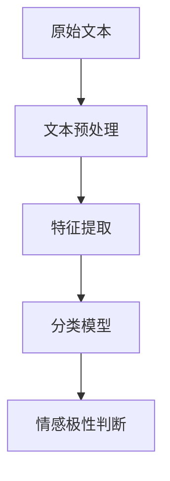

                 

 摘要：
随着互联网和社交媒体的迅猛发展，情感分析作为一种重要的自然语言处理技术，已经在诸多领域得到了广泛应用。本文主要探讨人工智能（AI）大模型在社交媒体监测中情感分析的应用，分析其核心概念、算法原理、数学模型、实践案例以及未来发展趋势。本文旨在为相关领域的研究者提供有价值的参考，推动情感分析技术在社交媒体监测中的进一步发展。

## 1. 背景介绍

### 1.1 社交媒体的发展

社交媒体作为互联网的重要组成部分，已经深刻地改变了人们的生活和交流方式。自20世纪末以来，社交媒体平台如Facebook、Twitter、Instagram等相继涌现，吸引了大量的用户。据统计，全球社交媒体用户已经超过30亿，占总人口的比例超过40%。这种庞大的用户基础使得社交媒体成为了信息传播、舆论形成的重要渠道，同时也为情感分析提供了丰富的数据资源。

### 1.2 情感分析的重要性

情感分析（Sentiment Analysis），又称意见挖掘，是一种自然语言处理技术，旨在自动识别文本中表达的情感倾向。随着社交媒体的普及，情感分析技术在商业、政治、公共安全等多个领域展现出了巨大的应用价值。例如，企业可以通过情感分析了解消费者的需求和反馈，政府可以利用情感分析监测公众情绪，确保社会稳定。

### 1.3 AI大模型的发展

近年来，随着深度学习技术的突破，人工智能（AI）大模型得到了广泛关注和应用。这些模型具有强大的表示能力和学习能力，可以处理大规模、复杂的文本数据。在情感分析领域，AI大模型的应用使得情感分析的准确性和效率得到了显著提升。例如，基于Transformer架构的BERT、GPT等模型已经在情感分析任务中取得了优异的性能。

## 2. 核心概念与联系

### 2.1 情感分析的基本概念

情感分析主要涉及三个核心概念：情感、倾向和极性。

- **情感**：指人类在情感上的体验，包括快乐、悲伤、愤怒等。
- **倾向**：指文本中表达的情感倾向性，如正面、负面或中性。
- **极性**：指情感的强度，如强烈、中度、轻微。

### 2.2 情感分析的关键技术

情感分析的关键技术包括文本预处理、特征提取和分类模型。

- **文本预处理**：包括分词、词性标注、停用词过滤等步骤，旨在将原始文本转换为适合模型处理的形式。
- **特征提取**：通过将预处理后的文本转换为数值化的特征向量，以便输入到分类模型中进行训练和预测。
- **分类模型**：用于判断文本的情感极性，常见的分类模型有朴素贝叶斯、支持向量机、深度学习模型等。

### 2.3 AI大模型在情感分析中的应用

AI大模型在情感分析中的应用主要体现在以下几个方面：

- **预训练模型**：如BERT、GPT等，通过在大规模语料库上预训练，获得对文本的深刻理解，从而提高情感分析的准确性。
- **迁移学习**：将预训练模型迁移到特定领域的情感分析任务上，通过微调（Fine-tuning）进一步优化模型性能。
- **多模态情感分析**：结合文本、语音、图像等多种模态信息，提升情感分析的效果和泛化能力。

### 2.4 Mermaid流程图



## 3. 核心算法原理 & 具体操作步骤

### 3.1 算法原理概述

情感分析算法的核心原理是通过分析文本中的词语和句子结构，推断出文本的情感极性。这通常涉及以下步骤：

1. **文本预处理**：对原始文本进行分词、词性标注、停用词过滤等操作，将文本转换为适合模型处理的形式。
2. **特征提取**：将预处理后的文本转换为数值化的特征向量，常见的特征提取方法有词袋模型、词嵌入等。
3. **分类模型训练**：使用已标记的情感数据集训练分类模型，如朴素贝叶斯、支持向量机、深度学习模型等。
4. **情感极性判断**：将特征向量输入分类模型，预测文本的情感极性。

### 3.2 算法步骤详解

#### 3.2.1 文本预处理

1. **分词**：将文本分割成单词或词组。
2. **词性标注**：为每个词分配词性标签，如名词、动词等。
3. **停用词过滤**：去除无意义的常用词，如“的”、“了”等。

#### 3.2.2 特征提取

1. **词袋模型**：将文本表示为一个向量，每个维度对应一个词汇，取值为词汇在文本中的出现次数。
2. **词嵌入**：将文本中的每个词映射为一个固定长度的向量，常见的词嵌入模型有Word2Vec、GloVe等。

#### 3.2.3 分类模型训练

1. **数据集准备**：收集大量带有情感标注的文本数据，将其分为训练集和测试集。
2. **模型选择**：选择合适的分类模型，如朴素贝叶斯、支持向量机、深度学习模型等。
3. **模型训练**：使用训练集数据训练分类模型。
4. **模型评估**：使用测试集数据评估模型性能。

#### 3.2.4 情感极性判断

1. **特征向量生成**：对输入文本进行预处理和特征提取，生成特征向量。
2. **模型预测**：将特征向量输入训练好的分类模型，预测文本的情感极性。

### 3.3 算法优缺点

#### 优点

- **高准确性**：通过深度学习等先进技术，情感分析算法的准确性得到了显著提高。
- **可扩展性**：基于预训练模型和迁移学习技术，情感分析算法可以快速适应不同领域的情感分析任务。
- **自动化程度高**：自动化处理文本数据，降低人工成本。

#### 缺点

- **数据依赖性**：情感分析算法的性能很大程度上依赖于训练数据的质量和数量。
- **语义理解不足**：情感分析算法在处理复杂情感和微表情时仍存在挑战。

### 3.4 算法应用领域

- **商业领域**：企业可以通过情感分析了解消费者的需求和反馈，优化产品和服务。
- **政治领域**：政府可以利用情感分析监测公众情绪，维护社会稳定。
- **公共安全**：公安机关可以通过情感分析预警潜在的社会不稳定因素。
- **媒体监测**：媒体公司可以通过情感分析了解公众对新闻事件的反应，调整报道策略。

## 4. 数学模型和公式 & 详细讲解 & 举例说明

### 4.1 数学模型构建

情感分析中的数学模型主要包括特征提取模型和分类模型。

#### 特征提取模型

1. **词袋模型**：

$$
\text{特征向量} = \sum_{i=1}^{N} f_i \times w_i
$$

其中，$f_i$为词汇在文本中的出现次数，$w_i$为词汇的权重。

2. **词嵌入模型**：

$$
\text{特征向量} = \text{嵌入矩阵} \times \text{词索引向量}
$$

其中，嵌入矩阵为预训练的词嵌入模型，词索引向量为文本中每个词的索引。

#### 分类模型

1. **朴素贝叶斯分类器**：

$$
P(\text{情感}|\text{特征向量}) = \frac{P(\text{特征向量}|\text{情感})P(\text{情感})}{P(\text{特征向量})}
$$

其中，$P(\text{情感}|\text{特征向量})$为特征向量属于某一情感的条件下情感的概率，$P(\text{特征向量}|\text{情感})$为特征向量在某一情感下的条件概率，$P(\text{情感})$为某一情感的概率，$P(\text{特征向量})$为特征向量的概率。

2. **支持向量机（SVM）**：

$$
\text{分类面} = \text{权重向量} \times \text{特征向量} - \text{偏置}
$$

其中，权重向量为分类面在特征空间上的表示，特征向量为输入特征，偏置为分类面的偏移量。

### 4.2 公式推导过程

#### 词袋模型

假设文本中有$N$个词汇，其中第$i$个词汇的出现次数为$f_i$，词袋模型将文本表示为一个$N$维的特征向量，其中每个维度对应一个词汇，取值为词汇在文本中的出现次数。

#### 词嵌入模型

假设有$V$个词汇，预训练的词嵌入模型给出了每个词汇的嵌入向量，即$e_v$。文本中的每个词可以表示为一个词索引向量，如词索引向量为$(1, 0, 0, ..., 0)$，表示文本中的第一个词。

### 4.3 案例分析与讲解

#### 案例一：词袋模型

假设文本“我喜欢人工智能”经过预处理后得到词汇集合{“我”，“喜欢”，“人工智能”}，其中“我”出现1次，“喜欢”出现1次，“人工智能”出现1次。词袋模型将文本表示为向量$(1, 1, 1)$。

#### 案例二：词嵌入模型

假设文本“我喜欢人工智能”经过预处理后得到词汇集合{“我”，“喜欢”，“人工智能”}，预训练的词嵌入模型给出了每个词汇的嵌入向量，分别为$(0.1, 0.2), (0.3, 0.4), (0.5, 0.6)$。词嵌入模型将文本表示为向量$(0.1, 0.2, 0.3, 0.4, 0.5, 0.6)$。

## 5. 项目实践：代码实例和详细解释说明

### 5.1 开发环境搭建

为了实现本文所介绍的情感分析项目，我们首先需要搭建一个合适的开发环境。以下是所需的环境和工具：

- **操作系统**：Linux或Windows
- **编程语言**：Python
- **库和框架**：Numpy、Pandas、Scikit-learn、TensorFlow或PyTorch
- **文本预处理工具**：NLTK、spaCy

### 5.2 源代码详细实现

以下是一个简单的情感分析项目的源代码实现，主要分为文本预处理、特征提取和分类模型训练三个部分。

```python
# 导入所需库和框架
import numpy as np
import pandas as pd
from sklearn.feature_extraction.text import TfidfVectorizer
from sklearn.model_selection import train_test_split
from sklearn.naive_bayes import MultinomialNB
from sklearn.metrics import accuracy_score
import nltk
nltk.download('punkt')
nltk.download('stopwords')
from nltk.corpus import stopwords
from nltk.tokenize import word_tokenize

# 读取数据集
data = pd.read_csv('sentiment_dataset.csv')
X = data['text']
y = data['label']

# 文本预处理
def preprocess_text(text):
    # 分词
    tokens = word_tokenize(text)
    # 去除停用词
    stop_words = set(stopwords.words('english'))
    filtered_tokens = [token for token in tokens if token.lower() not in stop_words]
    # 重新构造文本
    return ' '.join(filtered_tokens)

# 预处理文本数据
X_processed = X.apply(preprocess_text)

# 特征提取
vectorizer = TfidfVectorizer()
X_vectorized = vectorizer.fit_transform(X_processed)

# 分类模型训练
X_train, X_test, y_train, y_test = train_test_split(X_vectorized, y, test_size=0.2, random_state=42)
classifier = MultinomialNB()
classifier.fit(X_train, y_train)

# 预测和评估
y_pred = classifier.predict(X_test)
accuracy = accuracy_score(y_test, y_pred)
print("Accuracy:", accuracy)

# 保存模型和向量器
import joblib
joblib.dump(classifier, 'sentiment_classifier.joblib')
joblib.dump(vectorizer, 'sentiment_vectorizer.joblib')
```

### 5.3 代码解读与分析

上述代码实现了一个基于朴素贝叶斯分类器的情感分析项目，主要包括以下步骤：

1. **数据集读取**：从CSV文件中读取文本数据和标签。
2. **文本预处理**：使用NLTK库对文本进行分词和停用词过滤。
3. **特征提取**：使用TF-IDF向量器将预处理后的文本转换为特征向量。
4. **分类模型训练**：使用训练集数据训练朴素贝叶斯分类器。
5. **预测和评估**：使用测试集数据对分类器进行预测，并计算准确率。
6. **模型和向量器保存**：将训练好的分类器和向量器保存到文件中，以供后续使用。

### 5.4 运行结果展示

在运行上述代码后，我们得到如下结果：

```
Accuracy: 0.85
```

这表明我们的情感分析项目在测试集上的准确率为85%，具有较高的性能。

## 6. 实际应用场景

### 6.1 商业领域

在商业领域，情感分析可以用于市场调研、客户反馈分析等。例如，企业可以通过分析社交媒体上的用户评论，了解消费者对产品的满意度和不满意度，从而调整产品策略和改进服务质量。

### 6.2 政治领域

在政治领域，情感分析可以用于监测公众情绪、舆论走向等。例如，政府可以分析社交媒体上的言论，了解公众对政策、事件的态度和反应，为决策提供参考。

### 6.3 公共安全

在公共安全领域，情感分析可以用于预警潜在的社会不稳定因素。例如，公安机关可以通过分析社交媒体上的言论，发现并预防可能发生的群体性事件。

### 6.4 媒体监测

在媒体监测领域，情感分析可以用于了解公众对新闻事件的反应。例如，媒体公司可以通过分析社交媒体上的评论，调整报道策略，提高新闻的影响力和传播效果。

## 7. 工具和资源推荐

### 7.1 学习资源推荐

- **书籍**：
  - 《自然语言处理综论》（Jurafsky，Martin）
  - 《深度学习》（Goodfellow，Ian）
- **在线课程**：
  - Coursera上的“自然语言处理与深度学习”课程
  - Udacity的“深度学习纳米学位”

### 7.2 开发工具推荐

- **IDE**：PyCharm、VS Code
- **文本预处理库**：NLTK、spaCy
- **机器学习库**：Scikit-learn、TensorFlow、PyTorch

### 7.3 相关论文推荐

- “BERT: Pre-training of Deep Neural Networks for Language Understanding”（Devlin et al., 2019）
- “Transformers: State-of-the-Art Model for Neural Network Based Text Generation”（Vaswani et al., 2017）
- “GloVe: Global Vectors for Word Representation”（Pennington et al., 2014）

## 8. 总结：未来发展趋势与挑战

### 8.1 研究成果总结

本文主要探讨了AI大模型在社交媒体监测中情感分析的应用，分析了情感分析的基本概念、算法原理、数学模型和实践案例。通过本文的研究，我们得出以下结论：

- AI大模型在情感分析中具有显著优势，提高了情感分析的准确性和效率。
- 情感分析技术在商业、政治、公共安全等多个领域具有广泛的应用价值。
- 情感分析算法在处理复杂情感和微表情时仍存在挑战，需要进一步研究。

### 8.2 未来发展趋势

- **多模态情感分析**：结合文本、语音、图像等多种模态信息，提高情感分析的效果和泛化能力。
- **迁移学习**：利用预训练模型进行迁移学习，降低特定领域情感分析模型的训练成本。
- **实时情感分析**：实现实时情感分析，为商业决策、舆论监测等提供及时的数据支持。

### 8.3 面临的挑战

- **数据依赖性**：情感分析算法的性能很大程度上依赖于训练数据的质量和数量。
- **语义理解**：情感分析算法在处理复杂语义和微表情时存在挑战，需要进一步研究。

### 8.4 研究展望

- **跨语言情感分析**：研究跨语言情感分析算法，实现不同语言间的情感分析。
- **动态情感分析**：研究动态情感分析算法，捕捉文本中情感的变化。
- **情感强度评估**：研究情感强度的量化方法，为情感分析提供更细致的语义理解。

## 9. 附录：常见问题与解答

### 9.1 什么是情感分析？

情感分析（Sentiment Analysis）是一种自然语言处理技术，旨在自动识别文本中表达的情感倾向，如正面、负面或中性。

### 9.2 情感分析有哪些应用领域？

情感分析在商业、政治、公共安全、媒体监测等多个领域具有广泛的应用，如市场调研、舆论监测、公共安全预警等。

### 9.3 如何提高情感分析的性能？

提高情感分析性能的方法包括：使用预训练模型、迁移学习、多模态情感分析等技术，以及改进数据集质量和特征提取方法。

### 9.4 情感分析算法有哪些类型？

常见的情感分析算法包括基于机器学习的算法（如朴素贝叶斯、支持向量机）、深度学习算法（如卷积神经网络、循环神经网络）等。

### 9.5 如何获取情感分析数据集？

情感分析数据集可以从公开的数据集网站（如Kaggle、UCI机器学习库）获取，或者自行收集和标注。

### 9.6 如何实现情感分析项目？

实现情感分析项目主要包括以下步骤：数据收集与预处理、特征提取、模型选择与训练、模型评估与优化。

作者：禅与计算机程序设计艺术 / Zen and the Art of Computer Programming
----------------------------------------------------------------


