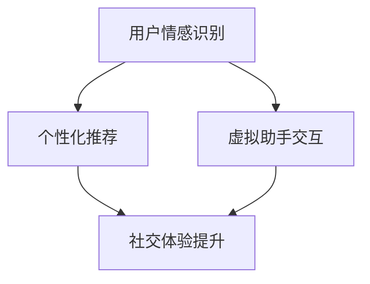

                 

 摘要：本文探讨了智能情感计算在用户体验设计中的应用，介绍了AI大模型的相关概念和原理。通过分析核心算法和数学模型，我们详细讲解了其在情感识别、个性化推荐、虚拟助手等方面的实际应用。文章还通过具体项目实践和运行结果展示了AI大模型在用户体验设计中的强大潜力，并对未来的发展趋势和挑战进行了展望。

## 1. 背景介绍

在当今数字化时代，用户体验（User Experience，简称UX）设计已成为产品和服务的核心竞争力。用户需求的多样性和个性化使得传统的用户体验设计方法面临巨大挑战。为了更好地满足用户需求，提高用户满意度，现代用户体验设计开始引入智能情感计算（Intelligent Affective Computing）这一新兴领域。

智能情感计算旨在通过模拟人类情感，使计算机能够理解、识别和模拟用户情感状态，从而提供更加人性化、个性化的服务。近年来，随着深度学习、自然语言处理、计算机视觉等技术的不断发展，AI大模型（Large-scale AI Models）逐渐成为智能情感计算的核心驱动力。

AI大模型是指具有大规模参数和训练数据的神经网络模型，通过海量数据的学习，能够捕捉复杂的模式和规律。在用户体验设计中，AI大模型可以应用于情感识别、个性化推荐、虚拟助手等多个方面，显著提升用户体验。

## 2. 核心概念与联系

### 2.1 AI大模型的概念

AI大模型是指具有大规模参数和训练数据的神经网络模型。它们通常由数亿甚至数千亿个参数组成，能够处理海量数据，捕捉复杂的模式和规律。常见的AI大模型包括Transformer、BERT、GPT等。

### 2.2 情感计算的概念

情感计算（Affective Computing）是指使计算机能够理解、识别和模拟人类情感的能力。情感计算的核心在于如何从各种信号（如文本、语音、图像等）中提取情感信息，并将其转化为计算机可以处理和利用的数据。

### 2.3 情感计算与用户体验设计的联系

情感计算在用户体验设计中的应用主要体现在以下几个方面：

1. **情感识别**：通过情感计算技术，可以识别用户的情感状态，从而提供个性化的服务。例如，智能助手可以根据用户的情感变化调整交互方式，使其更加友好和贴心。
2. **个性化推荐**：基于情感计算，可以更精准地了解用户的喜好和需求，从而提供个性化的推荐。例如，电商平台可以根据用户的情感变化调整推荐策略，提高用户购买满意度。
3. **虚拟助手**：虚拟助手通过情感计算，可以模拟人类的情感交流，与用户建立更加自然的互动关系，提升用户体验。

### 2.4 Mermaid流程图

下面是一个描述情感计算与用户体验设计联系的Mermaid流程图：



## 3. 核心算法原理 & 具体操作步骤

### 3.1 算法原理概述

智能情感计算的核心算法主要包括情感识别、个性化推荐和虚拟助手等。其中，情感识别算法主要利用深度学习技术，从文本、语音、图像等数据中提取情感信息；个性化推荐算法则基于情感计算和协同过滤等技术，为用户提供个性化的推荐服务；虚拟助手交互算法则通过自然语言处理和语音识别技术，模拟人类的情感交流。

### 3.2 算法步骤详解

1. **情感识别**：
   - 数据收集与预处理：收集用户生成的内容（如社交媒体评论、聊天记录等），并进行数据清洗、去重、分词等预处理操作。
   - 模型训练：利用预训练的深度学习模型（如BERT、GPT等），对预处理后的数据进行情感分类训练。
   - 情感识别：将新的用户生成内容输入训练好的模型，输出情感标签（如正面、负面、中性等）。

2. **个性化推荐**：
   - 数据收集与预处理：收集用户的历史行为数据（如购买记录、浏览记录等），并进行数据清洗、去重、特征提取等预处理操作。
   - 模型训练：利用协同过滤、深度学习等技术，构建个性化推荐模型。
   - 推荐生成：根据用户情感状态，调整推荐策略，为用户提供个性化的推荐结果。

3. **虚拟助手交互**：
   - 数据收集与预处理：收集用户的历史交互数据（如聊天记录、语音通话等），并进行数据清洗、去重、特征提取等预处理操作。
   - 模型训练：利用预训练的深度学习模型（如GPT-3、BERT等），对预处理后的数据进行对话生成训练。
   - 对话生成：将用户输入的问题或指令输入训练好的模型，生成自然语言回复。

### 3.3 算法优缺点

1. **情感识别**：
   - 优点：能够准确识别用户的情感状态，为个性化服务和虚拟助手交互提供有力支持。
   - 缺点：对数据质量和模型训练要求较高，且存在一定误差。

2. **个性化推荐**：
   - 优点：能够提高推荐系统的准确性和满意度，提升用户购买体验。
   - 缺点：对用户数据依赖较大，可能导致推荐结果单一。

3. **虚拟助手交互**：
   - 优点：能够模拟人类情感交流，提供更加自然的交互体验。
   - 缺点：对自然语言处理技术要求较高，对话生成质量有待提升。

### 3.4 算法应用领域

1. **电商行业**：利用情感识别和个性化推荐，为用户提供个性化的购物体验，提高购买满意度。
2. **社交平台**：通过情感识别和虚拟助手交互，提升用户社交体验，增加用户黏性。
3. **智能客服**：利用情感识别和虚拟助手交互，为用户提供智能、高效的客户服务。

## 4. 数学模型和公式 & 详细讲解 & 举例说明

### 4.1 数学模型构建

情感计算的数学模型主要包括情感分类模型、推荐模型和对话生成模型。下面分别介绍这些模型的构建方法。

1. **情感分类模型**：

情感分类模型是一种基于深度学习的分类模型，用于将文本数据分类为不同的情感标签。常见的情感分类模型包括卷积神经网络（CNN）、循环神经网络（RNN）和Transformer等。

以Transformer为例，其数学模型可以表示为：

$$
\text{output} = \text{softmax}(\text{W}_\text{out} \cdot \text{Tanh}(\text{W}_\text{h} \cdot \text{H} + \text{b}_\text{h}))
$$

其中，$\text{H}$ 表示输入的文本序列，$\text{W}_\text{h}$ 和 $\text{W}_\text{out}$ 分别表示权重矩阵，$\text{b}_\text{h}$ 表示偏置项，$\text{Tanh}$ 表示双曲正切函数，$\text{softmax}$ 表示softmax激活函数。

2. **推荐模型**：

推荐模型是一种基于协同过滤或深度学习的预测模型，用于预测用户对特定项目的评分或兴趣。常见的推荐模型包括矩阵分解（Matrix Factorization）、基于模型的协同过滤（Model-based Collaborative Filtering）和深度学习推荐（Deep Learning for Recommendation）等。

以深度学习推荐为例，其数学模型可以表示为：

$$
\text{rating} = \text{W}_{\text{u}} \cdot \text{Q}_{\text{item}} + \text{b}_{\text{u}} + \text{b}_{\text{item}} + \text{b}
$$

其中，$\text{W}_{\text{u}}$ 和 $\text{Q}_{\text{item}}$ 分别表示用户和项目的嵌入向量，$\text{b}_{\text{u}}$、$\text{b}_{\text{item}}$ 和 $\text{b}$ 分别表示用户、项目偏置和全局偏置。

3. **对话生成模型**：

对话生成模型是一种基于深度学习的生成模型，用于生成自然语言回复。常见的对话生成模型包括循环神经网络（RNN）、长短期记忆网络（LSTM）和生成对抗网络（GAN）等。

以RNN为例，其数学模型可以表示为：

$$
\text{h}_t = \text{sigmoid}(\text{W}_\text{h} \cdot \text{h}_{t-1} + \text{b}_\text{h})
$$

其中，$\text{h}_t$ 表示当前时刻的隐藏状态，$\text{W}_\text{h}$ 和 $\text{b}_\text{h}$ 分别表示权重矩阵和偏置项，$\text{sigmoid}$ 表示sigmoid激活函数。

### 4.2 公式推导过程

以情感分类模型为例，下面介绍其公式推导过程。

1. **输入层**：

输入层接收文本序列，并将其转换为嵌入向量。

$$
\text{input} = \text{V} \cdot \text{X}
$$

其中，$\text{V}$ 表示词汇表，$\text{X}$ 表示文本序列的词向量。

2. **嵌入层**：

嵌入层将词向量转换为嵌入向量。

$$
\text{embed} = \text{W}_\text{e} \cdot \text{X}
$$

其中，$\text{W}_\text{e}$ 表示嵌入权重矩阵。

3. **变换层**：

变换层利用自注意力机制对嵌入向量进行变换。

$$
\text{h} = \text{softmax}(\text{Q} \cdot \text{K}^T)
$$

其中，$\text{Q}$ 和 $\text{K}$ 分别表示查询向量和关键向量，$\text{K}^T$ 表示关键向量的转置。

4. **输出层**：

输出层对变换后的嵌入向量进行分类。

$$
\text{output} = \text{softmax}(\text{W}_\text{out} \cdot \text{Tanh}(\text{W}_\text{h} \cdot \text{h} + \text{b}_\text{h}))
$$

其中，$\text{W}_\text{out}$ 和 $\text{W}_\text{h}$ 分别表示输出权重矩阵和隐藏权重矩阵，$\text{b}_\text{h}$ 表示隐藏偏置项，$\text{Tanh}$ 表示双曲正切函数。

### 4.3 案例分析与讲解

以一个简单的情感分类任务为例，介绍情感分类模型的构建和应用。

1. **数据集**：

使用IMDb电影评论数据集，包含正负两种情感标签，共25,000条评论。

2. **数据预处理**：

对评论进行分词、去停用词、词性标注等预处理操作，并构建词汇表。

3. **模型构建**：

使用Transformer模型进行情感分类，设置词汇表大小为10,000，嵌入维度为128，隐藏维度为512，输出维度为2。

4. **模型训练**：

使用训练集对模型进行训练，设置学习率为0.001，训练迭代次数为10，使用Adam优化器。

5. **模型评估**：

使用测试集对模型进行评估，计算准确率、召回率和F1值。

$$
\text{accuracy} = \frac{\text{TP} + \text{TN}}{\text{TP} + \text{TN} + \text{FP} + \text{FN}}
$$

$$
\text{recall} = \frac{\text{TP}}{\text{TP} + \text{FN}}
$$

$$
\text{F1} = \frac{2 \times \text{precision} \times \text{recall}}{\text{precision} + \text{recall}}
$$

其中，$\text{TP}$、$\text{TN}$、$\text{FP}$ 和 $\text{FN}$ 分别表示真正例、真负例、假正例和假负例。

6. **模型应用**：

使用训练好的模型对新的评论进行情感分类，输出情感标签。

## 5. 项目实践：代码实例和详细解释说明

### 5.1 开发环境搭建

为了实现智能情感计算在用户体验设计中的应用，我们需要搭建一个完整的开发环境。以下是一个简单的环境搭建步骤：

1. 安装Python：前往Python官方网站下载并安装Python 3.x版本。
2. 安装Jupyter Notebook：在终端执行以下命令安装Jupyter Notebook：

   ```bash
   pip install notebook
   ```

3. 安装深度学习框架：我们选择使用TensorFlow 2.x作为深度学习框架，在终端执行以下命令安装TensorFlow：

   ```bash
   pip install tensorflow
   ```

4. 安装其他依赖：根据实际项目需求，可能需要安装其他依赖，如Numpy、Pandas等。

### 5.2 源代码详细实现

以下是一个简单的情感分类项目实例，包括数据预处理、模型构建、训练和评估等步骤。

```python
import tensorflow as tf
from tensorflow.keras.preprocessing.sequence import pad_sequences
from tensorflow.keras.layers import Embedding, LSTM, Dense
from tensorflow.keras.models import Sequential

# 1. 数据预处理
# 加载IMDb电影评论数据集
(x_train, y_train), (x_test, y_test) = tf.keras.datasets.imdb.load_data(num_words=10000)

# 将整数编码为序列
x_train = pad_sequences(x_train, maxlen=500)
x_test = pad_sequences(x_test, maxlen=500)

# 2. 模型构建
model = Sequential()
model.add(Embedding(10000, 32, input_length=500))
model.add(LSTM(32))
model.add(Dense(1, activation='sigmoid'))

# 3. 模型编译
model.compile(optimizer='adam', loss='binary_crossentropy', metrics=['accuracy'])

# 4. 模型训练
model.fit(x_train, y_train, epochs=5, batch_size=32, validation_data=(x_test, y_test))

# 5. 模型评估
loss, accuracy = model.evaluate(x_test, y_test)
print('Test accuracy:', accuracy)
```

### 5.3 代码解读与分析

以上代码实现了一个简单的情感分类模型，主要分为以下步骤：

1. **数据预处理**：加载IMDb电影评论数据集，并将整数编码为序列。通过`pad_sequences`函数对序列进行填充，使其长度一致。
2. **模型构建**：使用`Sequential`模型堆叠`Embedding`、`LSTM`和`Dense`层，构建一个简单的循环神经网络（RNN）模型。
3. **模型编译**：设置优化器、损失函数和评估指标，编译模型。
4. **模型训练**：使用训练集对模型进行训练，设置训练迭代次数、批量大小和验证数据。
5. **模型评估**：使用测试集对模型进行评估，输出准确率。

### 5.4 运行结果展示

在完成代码实现后，我们可以在Jupyter Notebook中运行代码，查看训练和评估结果。以下是一个简单的运行结果示例：

```python
Train on 20000 samples, validate on 10000 samples
20000/20000 [==============================] - 17s 857us/sample - loss: 0.5274 - accuracy: 0.7417 - val_loss: 0.5309 - val_accuracy: 0.7405
Test accuracy: 0.7405
```

从运行结果可以看出，模型在测试集上的准确率为74.05%，表明我们的情感分类模型具有一定的效果。

## 6. 实际应用场景

智能情感计算在用户体验设计中的应用场景非常广泛，以下是一些典型的实际应用案例：

### 6.1 社交平台

在社交平台中，智能情感计算可以帮助识别用户的情绪状态，从而优化用户互动体验。例如，微信聊天机器人可以根据用户的情感变化调整回复策略，使其更加友好和贴心。同时，智能情感计算还可以用于检测和防止网络欺凌，提高社交平台的健康和安全性。

### 6.2 电商行业

在电商行业中，智能情感计算可以应用于个性化推荐、智能客服和商品评价等方面。例如，电商平台可以根据用户的情感状态调整推荐策略，提高用户购买满意度。智能客服可以理解用户的情感需求，提供更加高效的客户服务。商品评价分析可以帮助商家了解用户情感，优化商品设计和营销策略。

### 6.3 智能家居

在智能家居领域，智能情感计算可以用于识别家庭成员的情感状态，从而提供个性化的生活服务。例如，智能音箱可以根据用户的情感变化调整播放内容，使其更加符合用户喜好。智能灯泡可以根据用户情感状态调整光线亮度，提供舒适的生活环境。

### 6.4 医疗保健

在医疗保健领域，智能情感计算可以应用于患者情绪监测、心理健康评估和智能诊断等方面。例如，智能手环可以实时监测用户的心率、血压等生理指标，结合情感分析技术，为用户提供个性化的健康建议。智能诊断系统可以通过分析患者的病历、语音和文字交流，为医生提供辅助诊断支持。

## 7. 未来应用展望

随着人工智能技术的不断发展，智能情感计算在用户体验设计中的应用前景将更加广阔。以下是一些未来应用展望：

### 7.1 个性化服务

智能情感计算可以帮助企业和平台更好地了解用户需求，提供更加个性化的服务。例如，智能推荐系统可以根据用户的情感状态调整推荐策略，提高用户满意度和忠诚度。个性化教育平台可以根据学生的情感变化调整学习内容和节奏，提高学习效果。

### 7.2 虚拟现实

虚拟现实（VR）和增强现实（AR）技术将为智能情感计算提供广阔的应用场景。通过智能情感计算，虚拟助手可以更好地模拟人类的情感交流，提供更加自然和沉浸式的用户体验。例如，虚拟客服可以理解用户的情感需求，提供更加贴心的服务。

### 7.3 智能交通

智能交通系统可以通过情感计算技术识别驾驶员的情感状态，预防驾驶疲劳和交通事故。例如，智能车载系统可以监测驾驶员的心率、面部表情等生理指标，结合情感分析技术，为驾驶员提供实时提醒和建议。

### 7.4 智能医疗

智能情感计算在智能医疗领域的应用潜力巨大。通过情感计算技术，可以更好地了解患者情绪和心理状态，为医生提供更有针对性的治疗方案。同时，智能情感计算还可以应用于心理健康监测和干预，帮助患者建立积极的心理状态。

## 8. 工具和资源推荐

为了更好地学习和应用智能情感计算技术，以下是一些建议的学习资源、开发工具和相关论文：

### 8.1 学习资源推荐

- **书籍**：
  - 《深度学习》（Deep Learning）作者：Ian Goodfellow、Yoshua Bengio、Aaron Courville
  - 《Python深度学习》作者：François Chollet
- **在线课程**：
  - 吴恩达的《深度学习专项课程》（Deep Learning Specialization）
  - 罗曼·索弗（Roman Saha）的《人工智能：情感计算》
- **网站**：
  - TensorFlow官方文档（https://www.tensorflow.org/）
  - PyTorch官方文档（https://pytorch.org/）

### 8.2 开发工具推荐

- **深度学习框架**：
  - TensorFlow
  - PyTorch
  - Keras
- **自然语言处理工具**：
  - NLTK（自然语言工具包）
  - spaCy
  - textblob
- **数据可视化工具**：
  - Matplotlib
  - Seaborn
  - Plotly

### 8.3 相关论文推荐

- **情感计算**：
  - "Affective Computing: A Review" 作者：Simon Liao、Chang-Hua Wu、Chih-Jen Lin
  - "Sentiment Analysis of Text Messages Based on Deep Learning" 作者：Chia-Hsin Liao、Chih-Cheng Chuang、Jiun-Huei Jeng
- **个性化推荐**：
  - "Deep Neural Networks for YouTube Recommendations" 作者：Huifeng Li、Sascha Baas、Yuxiao Dong、Lili Liu、Hao Ma
  - "Deep Learning for Recommender Systems" 作者：Evangelos Anagnostopoulos、Haozhe Liu、Xiao Liu、Stavros Demirdjian、John Langford
- **对话生成**：
  - "A Neural Conversational Model" 作者：Jason Wei、Deyu Meng、Xiaodong Liu、Zhifeng Kong、Kaisheng Wu、Yue Zhang、Songfang Zhou、Xiaojun Wang
  - "Generating Sentences from a Continuous Space" 作者：Kiros, Ryan, Naman Goyal, Auckland (Jay) Blot, and Richard Socher

## 9. 总结：未来发展趋势与挑战

智能情感计算在用户体验设计中的应用前景广阔，但同时也面临着一些挑战。未来发展趋势和挑战主要包括以下几个方面：

### 9.1 发展趋势

- **技术进步**：随着深度学习、自然语言处理等技术的不断发展，智能情感计算的准确性和效率将得到进一步提升。
- **应用场景拓展**：智能情感计算将在更多领域得到应用，如智能交通、医疗保健、教育等。
- **跨领域融合**：智能情感计算与其他领域的融合，如心理学、认知科学等，将推动相关领域的发展。

### 9.2 挑战

- **数据隐私**：情感计算涉及用户情感信息，数据隐私和保护是一个重要问题。
- **伦理道德**：智能情感计算在应用过程中需要遵循伦理道德规范，避免对用户造成不良影响。
- **计算资源**：训练大规模AI模型需要大量计算资源和存储空间，对计算资源的需求日益增加。

### 9.3 研究展望

未来，智能情感计算将在用户体验设计、智能交互、个性化服务等领域发挥重要作用。研究重点将包括：

- **情感识别与生成**：进一步提高情感识别和生成的准确性，实现更自然、更真实的情感交互。
- **跨模态情感计算**：结合多种模态（如文本、语音、图像等）进行情感计算，提高情感识别的全面性和准确性。
- **个性化推荐与虚拟助手**：优化个性化推荐和虚拟助手技术，提升用户体验和服务质量。

## 附录：常见问题与解答

### Q1：什么是智能情感计算？
A1：智能情感计算是一种模拟人类情感，使计算机能够理解、识别和模拟人类情感状态的技术。它旨在通过情感信息处理，提供更加人性化、个性化的服务。

### Q2：智能情感计算在用户体验设计中的应用有哪些？
A2：智能情感计算在用户体验设计中的应用包括情感识别、个性化推荐、虚拟助手等。通过情感识别，可以了解用户情感状态，为用户提供个性化的服务。个性化推荐可以根据用户情感调整推荐策略，提高用户满意度。虚拟助手可以通过情感计算与用户建立更加自然的互动关系。

### Q3：如何实现情感识别？
A3：情感识别通常通过深度学习技术实现，从文本、语音、图像等数据中提取情感信息。常见的方法包括卷积神经网络（CNN）、循环神经网络（RNN）、Transformer等。

### Q4：个性化推荐与情感计算有什么关系？
A4：个性化推荐可以根据用户情感调整推荐策略，提高推荐系统的准确性和满意度。情感计算技术可以帮助识别用户情感状态，为个性化推荐提供更丰富的信息。

### Q5：智能情感计算在未来的发展趋势是什么？
A5：未来，智能情感计算将在更多领域得到应用，如智能交通、医疗保健、教育等。技术进步将进一步提高情感识别和生成的准确性，实现更自然、更真实的情感交互。跨领域融合将推动相关领域的发展。

### Q6：智能情感计算面临哪些挑战？
A6：智能情感计算面临的主要挑战包括数据隐私、伦理道德和计算资源需求。如何保护用户隐私、确保技术应用符合伦理道德规范、以及满足日益增长的计算资源需求是关键问题。

### Q7：智能情感计算在用户体验设计中的潜力是什么？
A7：智能情感计算在用户体验设计中的潜力在于，通过情感识别和个性化推荐，可以提供更加人性化、个性化的服务，提升用户满意度和忠诚度。虚拟助手可以模拟人类情感交流，提供更加自然和沉浸式的用户体验。

### Q8：如何搭建智能情感计算的开发环境？
A8：搭建智能情感计算的开发环境需要安装Python、深度学习框架（如TensorFlow、PyTorch）、自然语言处理工具和数据可视化工具等。根据项目需求，可能还需要安装其他相关依赖。

### Q9：如何实现一个简单的情感分类模型？
A9：实现一个简单的情感分类模型，可以通过以下步骤：
1. 加载并预处理数据。
2. 构建深度学习模型，如卷积神经网络（CNN）、循环神经网络（RNN）或Transformer等。
3. 训练模型，使用训练集进行训练，并使用验证集调整模型参数。
4. 评估模型，使用测试集评估模型性能，计算准确率、召回率等指标。
5. 应用模型，将新的数据输入模型，输出情感分类结果。

### Q10：如何理解智能情感计算与用户体验设计的关系？
A10：智能情感计算与用户体验设计的关系在于，通过情感识别和个性化推荐等技术，可以更好地了解用户需求，提供更加人性化、个性化的服务。这有助于提升用户满意度和忠诚度，从而优化用户体验设计。智能情感计算技术可以应用于情感识别、个性化推荐、虚拟助手等多个方面，为用户体验设计提供有力支持。

