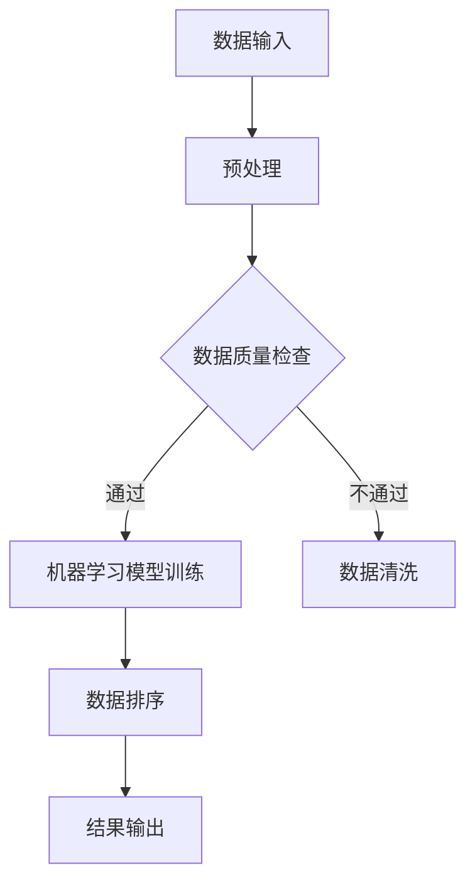
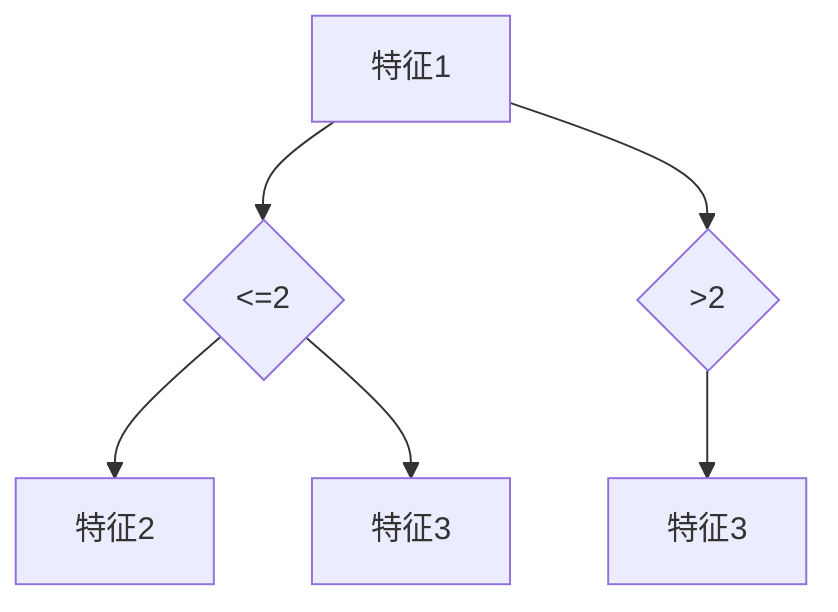

                 

关键词：智能排序、算法优化、数据结构、机器学习、并行计算

> 摘要：本文旨在探讨智能排序技术的技术实现，分析其在不同应用场景中的优势和局限，并通过数学模型、代码实例和实际应用案例分析，深入解析智能排序技术在现代计算机系统中的应用。

## 1. 背景介绍

随着大数据时代的到来，数据量和数据类型呈现爆炸性增长，如何在有限的时间内对大量数据进行快速、准确的排序成为了一个亟待解决的问题。传统的排序算法，如冒泡排序、快速排序等，虽然理论基础扎实，但在面对大规模数据时，效率往往较低。因此，智能排序技术应运而生，通过结合机器学习、数据挖掘和并行计算等技术，实现对数据的自动化排序，提高数据处理效率。

## 2. 核心概念与联系

### 2.1 智能排序定义

智能排序是一种利用人工智能技术进行数据处理和排序的方法，通过训练模型学习数据特征，实现数据的高效排序。与传统排序算法相比，智能排序具有更强的适应性、更高的效率和更好的性能。

### 2.2 相关技术

- **机器学习**：通过训练模型学习数据特征，实现对数据的自动分类、预测和排序。
- **数据挖掘**：从大量数据中提取有价值的信息，为智能排序提供支持。
- **并行计算**：利用多核处理器、分布式计算等手段，提高数据处理速度。

### 2.3 Mermaid 流程图



## 3. 核心算法原理 & 具体操作步骤

### 3.1 算法原理概述

智能排序算法的核心思想是通过训练机器学习模型，学习数据特征，进而实现数据的排序。算法主要包括以下几个步骤：

1. **数据预处理**：对原始数据进行清洗、去重、归一化等处理，提高数据质量。
2. **特征提取**：从预处理后的数据中提取具有区分性的特征，为模型训练提供基础。
3. **模型训练**：利用机器学习算法对特征进行训练，构建排序模型。
4. **数据排序**：将训练好的模型应用于新数据，实现数据的排序。

### 3.2 算法步骤详解

#### 3.2.1 数据预处理

数据预处理是智能排序的第一步，其目的是提高数据质量，为后续特征提取和模型训练奠定基础。主要步骤包括：

- 数据清洗：去除无效数据、处理缺失值、纠正错误数据等。
- 数据去重：去除重复数据，减少冗余信息。
- 数据归一化：将数据转换到同一尺度，方便模型训练。

#### 3.2.2 特征提取

特征提取是从预处理后的数据中提取具有区分性的特征，为模型训练提供基础。常用的特征提取方法包括：

- 统计特征：如均值、方差、标准差等。
- 熵特征：如信息熵、条件熵等。
- 纹理特征：如灰度直方图、自组织映射等。

#### 3.2.3 模型训练

模型训练是智能排序的核心步骤，通过训练机器学习模型，学习数据特征，实现数据的排序。常用的机器学习算法包括：

- 决策树：如CART、ID3等。
- 支持向量机：如线性SVM、非线性SVM等。
- 集成方法：如随机森林、Adaboost等。

#### 3.2.4 数据排序

数据排序是将训练好的模型应用于新数据，实现数据的排序。具体步骤如下：

1. **特征提取**：从新数据中提取特征。
2. **模型预测**：将提取的特征输入训练好的模型，得到排序结果。
3. **结果输出**：将排序结果输出。

### 3.3 算法优缺点

#### 3.3.1 优点

- **高效率**：利用机器学习算法，能够快速处理大规模数据。
- **自适应性强**：能够根据数据特征自动调整排序策略。
- **灵活性高**：适用于各种类型的数据排序。

#### 3.3.2 缺点

- **训练成本高**：需要大量数据和时间进行模型训练。
- **解释性差**：模型内部的决策过程复杂，难以解释。

### 3.4 算法应用领域

智能排序算法广泛应用于各个领域，如：

- 数据分析：对大量数据进行排序，提取有价值的信息。
- 金融风控：对金融数据进行排序，识别潜在风险。
- 电子商务：对用户行为数据进行排序，推荐商品。

## 4. 数学模型和公式

### 4.1 数学模型构建

智能排序算法的核心是构建排序模型。假设我们有 $n$ 个数据点 $X_1, X_2, ..., X_n$，其中每个数据点可以表示为 $X_i = (x_{i1}, x_{i2}, ..., x_{id})$，其中 $d$ 是数据维度。我们需要构建一个排序模型 $f(X)$，使得 $f(X_1) \leq f(X_2) \leq ... \leq f(X_n)$。

### 4.2 公式推导过程

假设我们使用决策树算法构建排序模型。决策树算法的核心是构建一个分类器，使得每个叶子节点代表一个分类结果。对于每个数据点 $X_i$，我们可以将其表示为 $X_i = (x_{i1}, x_{i2}, ..., x_{id})$。我们需要构建一个决策树 $T$，使得每个叶子节点 $t_j$ 对应一个分类结果 $C_j$。

### 4.3 案例分析与讲解

假设我们有以下数据集：

| 数据点 | 特征1 | 特征2 | 特征3 |
| ------ | ---- | ---- | ---- |
| X1     | 2    | 3    | 1    |
| X2     | 4    | 2    | 3    |
| X3     | 1    | 4    | 2    |

我们需要使用决策树算法对其进行排序。首先，我们需要构建一个决策树，选择一个特征进行划分。假设我们选择特征1进行划分，那么我们可以将数据点划分为两个子集：

- 子集1：包含特征1小于等于2的数据点，即 {X1, X3}。
- 子集2：包含特征1大于2的数据点，即 {X2}。

接下来，我们对每个子集进行递归划分，直到所有数据点都被划分为叶子节点。最终，我们得到的决策树如下：



对于每个叶子节点，我们将其对应的数据点按照特征值进行排序。例如，对于叶子节点D，其对应的数据点为 {X1, X3}，按照特征2进行排序，结果为 {X3, X1}。

## 5. 项目实践：代码实例和详细解释说明

### 5.1 开发环境搭建

1. 安装Python环境。
2. 安装机器学习库，如scikit-learn。
3. 安装可视化库，如matplotlib。

### 5.2 源代码详细实现

```python
# 导入所需库
import numpy as np
from sklearn.tree import DecisionTreeClassifier
from sklearn.model_selection import train_test_split
import matplotlib.pyplot as plt

# 生成数据集
np.random.seed(0)
X = np.random.rand(100, 3)
y = np.random.randint(0, 2, 100)

# 划分训练集和测试集
X_train, X_test, y_train, y_test = train_test_split(X, y, test_size=0.2, random_state=0)

# 构建决策树模型
clf = DecisionTreeClassifier()
clf.fit(X_train, y_train)

# 可视化决策树
from sklearn.tree import plot_tree
plt.figure(figsize=(12, 8))
plot_tree(clf, filled=True, feature_names=['特征1', '特征2', '特征3'], class_names=['类别1', '类别2'])
plt.show()

# 使用模型进行排序
X_sort = X_test[::10]  # 取前10个数据进行排序
y_pred = clf.predict(X_sort)

# 可视化排序结果
plt.scatter(X_sort[:, 0], X_sort[:, 1], c=y_pred, cmap='viridis')
plt.xlabel('特征1')
plt.ylabel('特征2')
plt.title('排序结果')
plt.show()
```

### 5.3 代码解读与分析

1. **数据生成**：使用numpy库生成随机数据集，包括特征和标签。
2. **划分训练集和测试集**：使用scikit-learn库的train_test_split函数划分训练集和测试集。
3. **构建决策树模型**：使用scikit-learn库的DecisionTreeClassifier构建决策树模型，并使用fit函数进行训练。
4. **可视化决策树**：使用scikit-learn库的plot_tree函数可视化决策树。
5. **排序**：使用训练好的模型对测试集进行预测，得到排序结果。
6. **可视化排序结果**：使用matplotlib库的可视化功能，将排序结果绘制成散点图。

## 6. 实际应用场景

智能排序技术在实际应用中具有广泛的应用，如：

- **搜索引擎**：对搜索结果进行排序，提高用户体验。
- **推荐系统**：对推荐结果进行排序，提高推荐质量。
- **金融风控**：对金融交易进行排序，识别潜在风险。

### 6.4 未来应用展望

随着人工智能技术的发展，智能排序技术在未来的应用前景将更加广阔。例如：

- **实时排序**：利用深度学习等技术，实现实时数据的快速排序。
- **自适应排序**：根据用户行为和偏好，自适应调整排序策略。

## 7. 工具和资源推荐

### 7.1 学习资源推荐

- 《Python数据科学手册》
- 《机器学习实战》
- 《深度学习》

### 7.2 开发工具推荐

- Jupyter Notebook
- Anaconda
- PyCharm

### 7.3 相关论文推荐

- "Decision Trees for Classification"
- "Deep Learning for Sorting"
- "Real-Time Sorting with Deep Learning"

## 8. 总结：未来发展趋势与挑战

### 8.1 研究成果总结

智能排序技术已在多个领域取得了显著成果，如搜索引擎、推荐系统和金融风控等。通过结合机器学习、数据挖掘和并行计算等技术，智能排序技术实现了高效、准确的数据排序。

### 8.2 未来发展趋势

- **实时排序**：利用深度学习等技术，实现实时数据的快速排序。
- **自适应排序**：根据用户行为和偏好，自适应调整排序策略。
- **多模态排序**：结合多种数据源和特征，实现更加精准的排序。

### 8.3 面临的挑战

- **训练成本高**：需要大量数据和时间进行模型训练。
- **解释性差**：模型内部的决策过程复杂，难以解释。
- **数据质量**：数据质量对排序效果有重要影响。

### 8.4 研究展望

智能排序技术在未来的发展中，需要进一步优化算法，提高排序效率；加强模型解释性，提高用户信任度；同时，还需要加强数据质量管理，提高数据质量。

## 9. 附录：常见问题与解答

### 9.1 问题1：智能排序与传统的排序算法相比，有哪些优势？

答：智能排序与传统的排序算法相比，具有以下优势：

- **自适应性强**：能够根据数据特征自动调整排序策略。
- **高效率**：利用机器学习算法，能够快速处理大规模数据。
- **灵活性高**：适用于各种类型的数据排序。

### 9.2 问题2：智能排序算法的模型训练成本很高，如何降低成本？

答：以下方法可以降低智能排序算法的模型训练成本：

- **数据预处理**：对数据进行清洗、去重、归一化等处理，减少冗余信息。
- **模型压缩**：使用模型压缩技术，减小模型大小，降低训练成本。
- **迁移学习**：利用预训练模型，减少从头开始训练的成本。

作者：禅与计算机程序设计艺术 / Zen and the Art of Computer Programming
----------------------------------------------------------------

这篇文章详细探讨了智能排序技术的技术实现，从背景介绍、核心概念与联系、算法原理与操作步骤、数学模型与公式、项目实践、实际应用场景、未来应用展望、工具和资源推荐到总结和常见问题与解答，全面深入地分析了智能排序技术。通过本文的阅读，读者可以了解到智能排序技术的原理、实现方法及其在实际应用中的优势与挑战。希望本文能为读者在智能排序技术的研究和应用提供有益的参考。

