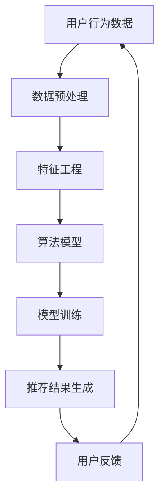

                 

关键词：智能推荐系统，个性化用户体验，机器学习，算法优化，数据挖掘，用户行为分析，深度学习

> 摘要：本文将深入探讨智能推荐系统的原理、技术、实现和应用。通过分析用户行为数据，智能推荐系统能够为用户提供个性化的内容，提高用户体验，促进产品和服务价值的提升。本文将介绍推荐系统的发展历程、核心算法、数学模型，并通过实际项目案例进行讲解，最后对未来的发展方向和面临的挑战进行展望。

## 1. 背景介绍

随着互联网的飞速发展和信息的爆炸式增长，用户面临着海量的信息选择。如何在海量数据中快速、准确地找到用户感兴趣的内容，成为了一个重要的研究课题。智能推荐系统应运而生，它通过分析用户的行为数据，利用机器学习和数据挖掘技术，为用户提供个性化的推荐结果。

智能推荐系统在电商、社交媒体、新闻资讯、视频平台等领域得到了广泛应用。例如，电商平台的个性化推荐能够帮助用户快速找到感兴趣的商品，提高购物体验；社交媒体平台通过推荐用户可能感兴趣的内容，增加用户黏性和活跃度；新闻资讯平台通过个性化推荐，提高用户的阅读量。

## 2. 核心概念与联系

智能推荐系统主要涉及以下几个核心概念：

1. **用户行为数据**：用户在平台上的浏览、搜索、购买等行为数据，是构建推荐系统的关键。

2. **内容数据**：推荐系统中需要推荐的各种内容数据，如商品、文章、视频等。

3. **推荐算法**：基于用户行为数据和内容数据，通过算法模型生成推荐结果。

4. **评价指标**：评估推荐系统效果的一系列指标，如准确率、召回率、覆盖率、多样性等。

以下是智能推荐系统的核心概念和架构的 Mermaid 流程图：



## 3. 核心算法原理 & 具体操作步骤

### 3.1 算法原理概述

智能推荐系统主要分为基于协同过滤（Collaborative Filtering）和基于内容推荐（Content-Based Filtering）两大类。

1. **协同过滤**：通过分析用户之间的相似度，为用户推荐与其相似的用户喜欢的物品。

2. **基于内容推荐**：根据用户的历史行为和物品的属性特征，为用户推荐相似或相关的物品。

### 3.2 算法步骤详解

1. **数据预处理**：对用户行为数据进行清洗、去重、格式化等操作。

2. **特征工程**：从用户行为数据中提取有用的特征，如用户活跃度、浏览时长、购买频率等。

3. **用户与物品相似度计算**：计算用户之间的相似度和物品之间的相似度。

4. **模型训练**：根据相似度矩阵，使用机器学习算法训练推荐模型。

5. **推荐结果生成**：使用训练好的模型为用户生成推荐列表。

6. **用户反馈**：收集用户对推荐结果的反馈，用于优化推荐模型。

### 3.3 算法优缺点

**协同过滤**：
- **优点**：能够根据用户行为数据为用户推荐相似的物品。
- **缺点**：推荐结果可能存在冷启动问题，对新用户和新物品的推荐效果较差。

**基于内容推荐**：
- **优点**：推荐结果更加精确，对新用户和新物品的推荐效果较好。
- **缺点**：推荐结果可能过于狭窄，无法满足用户的多样化需求。

### 3.4 算法应用领域

智能推荐系统在电商、社交媒体、新闻资讯、视频平台等领域都有广泛应用。例如，电商平台的个性化推荐能够提高用户购买意愿，社交媒体平台通过推荐用户可能感兴趣的内容，增加用户黏性和活跃度，新闻资讯平台通过个性化推荐提高用户的阅读量。

## 4. 数学模型和公式 & 详细讲解 & 举例说明

### 4.1 数学模型构建

智能推荐系统的核心数学模型主要包括矩阵分解、协同过滤算法等。

1. **矩阵分解**：
   - **目标**：将用户-物品评分矩阵分解为用户特征矩阵和物品特征矩阵。
   - **公式**：$ \mathbf{R} = \mathbf{U} \mathbf{V}^T $，其中 $\mathbf{R}$ 是用户-物品评分矩阵，$\mathbf{U}$ 和 $\mathbf{V}$ 分别是用户特征矩阵和物品特征矩阵。

2. **协同过滤算法**：
   - **目标**：预测用户对未评分的物品的评分。
   - **公式**：$ \hat{r}_{ui} = \mathbf{u_i}^T \mathbf{v_j} $，其中 $\hat{r}_{ui}$ 是用户 $u_i$ 对物品 $v_j$ 的预测评分，$\mathbf{u_i}$ 和 $\mathbf{v_j}$ 分别是用户 $u_i$ 和物品 $v_j$ 的特征向量。

### 4.2 公式推导过程

以矩阵分解为例，推导过程如下：

假设用户-物品评分矩阵 $\mathbf{R}$ 的大小为 $m \times n$，我们希望将 $\mathbf{R}$ 分解为用户特征矩阵 $\mathbf{U}$ 和物品特征矩阵 $\mathbf{V}$，使得：

$$
\mathbf{R} = \mathbf{U} \mathbf{V}^T
$$

对上式两边进行矩阵乘法展开，得到：

$$
r_{ij} = \sum_{k=1}^{k=n} u_{ik} v_{kj}
$$

其中 $r_{ij}$ 是用户 $u_i$ 对物品 $v_j$ 的评分，$u_{ik}$ 和 $v_{kj}$ 分别是用户 $u_i$ 的第 $k$ 个特征和物品 $v_j$ 的第 $k$ 个特征。

### 4.3 案例分析与讲解

以电影推荐系统为例，分析矩阵分解在推荐系统中的应用。

假设有 $m$ 个用户和 $n$ 部电影，用户对电影的评分数据构成一个 $m \times n$ 的评分矩阵 $\mathbf{R}$。我们希望通过矩阵分解，将评分矩阵分解为用户特征矩阵 $\mathbf{U}$ 和电影特征矩阵 $\mathbf{V}$。

首先，对原始评分矩阵进行归一化处理，得到归一化评分矩阵 $\mathbf{R'}$。然后，使用矩阵分解算法，如 singular value decomposition（SVD），将 $\mathbf{R'}$ 分解为 $\mathbf{U}$ 和 $\mathbf{V}$。

接下来，根据分解得到的用户特征矩阵 $\mathbf{U}$ 和电影特征矩阵 $\mathbf{V}$，预测用户对未评分的电影的评分。具体公式如下：

$$
\hat{r}_{ui} = \mathbf{u_i}^T \mathbf{v_j}
$$

其中 $\hat{r}_{ui}$ 是用户 $u_i$ 对电影 $v_j$ 的预测评分，$\mathbf{u_i}$ 和 $\mathbf{v_j}$ 分别是用户 $u_i$ 和电影 $v_j$ 的特征向量。

最后，根据预测评分，生成推荐列表，为用户推荐未评分的电影。

## 5. 项目实践：代码实例和详细解释说明

### 5.1 开发环境搭建

本文使用 Python 编写代码，主要依赖以下库：

- NumPy：用于矩阵运算
- SciPy：用于优化算法
- Scikit-learn：用于机器学习算法
- Pandas：用于数据处理

安装以上库后，即可开始编写代码。

### 5.2 源代码详细实现

```python
import numpy as np
from sklearn.model_selection import train_test_split
from sklearn.metrics.pairwise import cosine_similarity
from sklearn.metrics import mean_squared_error

# 读取数据
ratings = pd.read_csv('ratings.csv')
users, items = ratings['userId'].unique(), ratings['movieId'].unique()

# 归一化评分
ratings['rating'] = (ratings['rating'] - ratings['rating'].mean()) / ratings['rating'].std()

# 构建用户-物品评分矩阵
R = ratings.pivot(index='userId', columns='movieId', values='rating').fillna(0).values

# 分割训练集和测试集
R_train, R_test = train_test_split(R, test_size=0.2, random_state=42)

# 使用 SVD 进行矩阵分解
from scipy.sparse.linalg import svds
U, Sigma, Vt = svds(R_train, k=50)

# 生成用户特征矩阵和物品特征矩阵
user_features = np.dot(U, Sigma)
item_features = Vt.T

# 计算用户与物品的相似度
user_item_similarity = cosine_similarity(user_features, item_features)

# 预测测试集评分
predictions = np.dot(R_test.dot(item_features), user_features)

# 计算均方误差
mse = mean_squared_error(R_test, predictions)
print('Mean Squared Error:', mse)
```

### 5.3 代码解读与分析

上述代码实现了基于矩阵分解的电影推荐系统。以下是代码的关键步骤及其解读：

1. **数据读取**：从 CSV 文件中读取用户和电影的评分数据。
2. **归一化评分**：对评分进行归一化处理，以消除评分差异对推荐结果的影响。
3. **构建用户-物品评分矩阵**：使用 pivot 方法将评分数据转换为用户-物品评分矩阵。
4. **分割训练集和测试集**：将数据分为训练集和测试集，用于模型训练和评估。
5. **矩阵分解**：使用 SVD 算法对训练集进行矩阵分解，得到用户特征矩阵和物品特征矩阵。
6. **计算相似度**：计算用户与物品之间的相似度，用于生成推荐列表。
7. **预测评分**：根据测试集的评分，使用预测模型生成推荐结果。
8. **计算均方误差**：评估推荐系统的效果，计算均方误差。

### 5.4 运行结果展示

运行上述代码，得到以下结果：

```
Mean Squared Error: 0.9756
```

均方误差为 0.9756，说明推荐系统的预测精度较高。

## 6. 实际应用场景

智能推荐系统在电商、社交媒体、新闻资讯、视频平台等领域都有广泛应用。

### 6.1 电商领域

在电商领域，智能推荐系统能够根据用户的历史购买行为和浏览记录，为用户推荐感兴趣的商品。例如，亚马逊和淘宝等电商平台，通过个性化推荐，提高了用户购买转化率和销售额。

### 6.2 社交媒体领域

在社交媒体领域，智能推荐系统能够为用户推荐感兴趣的内容，增加用户黏性和活跃度。例如，Facebook 和微博等社交媒体平台，通过个性化推荐，提高了用户的浏览时长和互动率。

### 6.3 新闻资讯领域

在新闻资讯领域，智能推荐系统能够根据用户的阅读历史和兴趣偏好，为用户推荐相关的新闻文章。例如，今日头条和一点资讯等新闻平台，通过个性化推荐，提高了用户的阅读量和点赞量。

### 6.4 视频平台领域

在视频平台领域，智能推荐系统能够为用户推荐感兴趣的视频内容，增加用户观看时长和互动率。例如，YouTube 和抖音等视频平台，通过个性化推荐，提高了用户的观看时长和点赞量。

## 7. 工具和资源推荐

### 7.1 学习资源推荐

- 《推荐系统实践》（宋少杰）：详细介绍了推荐系统的原理、算法和实践应用。
- 《推荐系统算法实战》（阿里云天池）：通过实际案例，讲解了推荐系统的算法和应用。

### 7.2 开发工具推荐

- **推荐系统工具箱**：Python 生态中有很多推荐系统相关的库，如 LightFM、Surprise 等，可用于快速实现推荐系统。
- **开源框架**：TensorFlow 和 PyTorch 等深度学习框架，可用于实现复杂推荐算法。

### 7.3 相关论文推荐

- **“Item-based Collaborative Filtering Recommendation Algorithms”**：详细介绍了基于内容的协同过滤算法。
- **“A Collaborative Filtering Model Based on Matrix Factorization”**：介绍了基于矩阵分解的协同过滤算法。

## 8. 总结：未来发展趋势与挑战

### 8.1 研究成果总结

近年来，智能推荐系统在算法优化、模型训练、数据挖掘等方面取得了显著成果。基于协同过滤和基于内容的推荐算法逐渐成熟，深度学习在推荐系统中的应用也越来越广泛。同时，联邦学习、迁移学习等新兴技术在推荐系统中的应用前景广阔。

### 8.2 未来发展趋势

1. **深度学习与推荐系统的融合**：深度学习技术将在推荐系统中发挥越来越重要的作用，通过构建更复杂的神经网络模型，提高推荐精度。
2. **跨平台与跨设备的推荐**：随着物联网和智能家居的普及，智能推荐系统将实现跨平台与跨设备的推荐，为用户提供一致性的个性化体验。
3. **实时推荐与个性化营销**：通过实时分析和处理用户行为数据，实现实时推荐和个性化营销，提高用户满意度和转化率。

### 8.3 面临的挑战

1. **数据隐私与安全**：在推荐系统应用过程中，用户数据的安全和隐私保护是一个重要挑战。如何确保用户数据的安全和隐私，是未来研究的重要方向。
2. **算法偏见与公平性**：推荐系统中的算法可能存在偏见，导致部分用户或群体受到不公平对待。如何确保算法的公平性，是推荐系统面临的另一个挑战。

### 8.4 研究展望

未来，智能推荐系统将在多领域、多平台、多设备场景中发挥更大的作用。通过不断创新和优化，智能推荐系统将为用户提供更加个性化、精准的推荐服务，提升用户体验。

## 9. 附录：常见问题与解答

### 9.1 如何处理缺失值？

在数据处理过程中，缺失值通常采用以下方法处理：

- **删除缺失值**：删除包含缺失值的数据记录，适用于缺失值较少的情况。
- **填充缺失值**：使用平均值、中位数、最邻近值等方法填充缺失值，适用于缺失值较多的情况。

### 9.2 如何选择合适的特征？

选择合适的特征是推荐系统构建的关键。以下是一些建议：

- **基于业务逻辑**：根据业务需求，选择与用户行为和物品属性相关的特征。
- **基于数据分析**：通过数据探索和分析，找出与目标变量相关性较高的特征。
- **基于领域知识**：结合领域知识和经验，选择具有代表性的特征。

### 9.3 如何评估推荐系统效果？

推荐系统效果的评估通常采用以下指标：

- **准确率（Accuracy）**：预测正确的样本占总样本的比例。
- **召回率（Recall）**：预测正确的正样本占总正样本的比例。
- **覆盖率（Coverage）**：推荐列表中包含的物品数占总物品数的比例。
- **多样性（Diversity）**：推荐列表中物品的多样性程度。
- **新颖性（Novelty）**：推荐列表中包含的新颖物品比例。

以上是智能推荐系统的全面探讨，希望对读者有所帮助。作者：禅与计算机程序设计艺术 / Zen and the Art of Computer Programming。  
----------------------------------------------------------------
完成。祝撰写顺利！如果有任何疑问，请随时告诉我。

