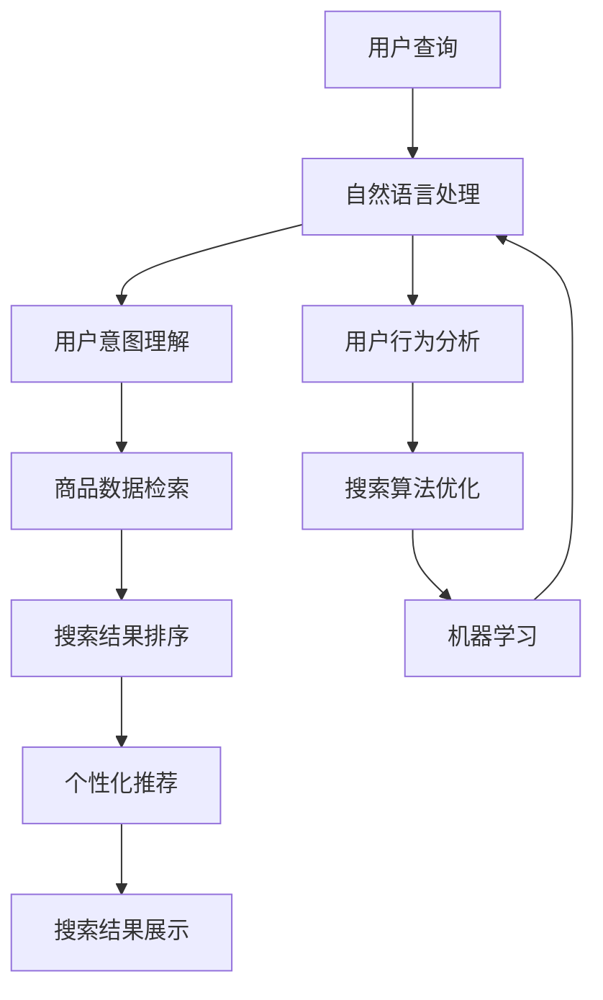

                 

关键词：智能搜索，AI，电商，搜索算法，用户行为分析，个性化推荐，自然语言处理

> 摘要：本文探讨了人工智能在电商搜索中的应用，介绍了智能搜索的核心概念和算法原理，分析了其在电商平台上的实际应用场景和未来展望。

## 1. 背景介绍

随着互联网的快速发展，电子商务已经成为人们日常生活中不可或缺的一部分。在电商平台上，用户可以通过搜索引擎快速找到所需商品，提高购物效率和体验。然而，传统的搜索引擎在处理大量商品数据和用户查询请求时，存在响应速度慢、准确性不高等问题。为了解决这些问题，人工智能（AI）技术开始被引入到电商搜索领域，从而诞生了智能搜索。

智能搜索通过利用AI技术，对用户行为和商品信息进行深度分析和理解，提供更加准确、个性化的搜索结果。本文将介绍智能搜索的核心概念、算法原理以及其在电商领域的实际应用。

## 2. 核心概念与联系

### 2.1 智能搜索的定义

智能搜索是一种基于人工智能技术的搜索引擎，它通过自然语言处理、机器学习、用户行为分析等方法，对用户查询意图进行深度理解，并从海量商品数据中快速、准确地筛选出与用户需求最相关的结果。

### 2.2 关键技术

**自然语言处理（NLP）：** NLP是智能搜索的核心技术之一，它能够将用户的自然语言查询转化为计算机可以理解和处理的格式。通过词性标注、句法分析、实体识别等技术，NLP能够捕捉用户查询的关键信息，提高搜索结果的准确性。

**机器学习：** 机器学习是智能搜索的另一个关键技术，它通过分析大量用户行为数据，对搜索算法进行优化，提高搜索结果的个性化程度。常见的机器学习方法包括线性回归、决策树、支持向量机等。

**用户行为分析：** 用户行为分析是智能搜索的重要一环，通过分析用户的搜索历史、购买记录、浏览行为等，能够了解用户的需求和偏好，为个性化搜索提供依据。

### 2.3 架构图

以下是一个简单的智能搜索架构图，展示了各关键技术之间的联系。



## 3. 核心算法原理 & 具体操作步骤

### 3.1 算法原理概述

智能搜索的核心算法主要包括以下三个部分：

1. **用户意图理解：** 通过自然语言处理技术，将用户的查询转化为计算机可以理解的语义表示，进而理解用户的真实意图。

2. **商品数据检索：** 利用索引技术和搜索算法，从海量商品数据中快速检索出与用户意图相关的商品。

3. **搜索结果排序：** 根据用户偏好和搜索历史，对检索结果进行排序，提高搜索结果的个性化程度。

### 3.2 算法步骤详解

1. **用户查询输入：** 用户在电商平台上输入查询关键词。

2. **自然语言处理：** 对用户查询进行词性标注、句法分析、实体识别等处理，提取关键信息。

3. **用户意图理解：** 基于提取的关键信息，利用词嵌入技术将用户查询转化为语义向量。

4. **商品数据检索：** 从索引数据库中检索与用户查询相关的商品信息。

5. **搜索结果排序：** 利用排序算法（如TF-IDF、向量空间模型等），根据用户偏好和搜索历史对检索结果进行排序。

6. **个性化推荐：** 基于用户行为数据，为用户推荐可能感兴趣的商品。

7. **搜索结果展示：** 将排序后的搜索结果展示给用户。

### 3.3 算法优缺点

**优点：**
- 提高搜索效率：智能搜索能够快速处理大量用户查询请求，提高搜索响应速度。
- 提高搜索准确性：通过深度理解用户查询意图，智能搜索能够提供更准确的搜索结果。
- 个性化推荐：智能搜索可以根据用户偏好和行为，为用户推荐个性化的商品。

**缺点：**
- 数据隐私：用户行为数据可能涉及隐私问题，需要在算法设计和数据存储方面进行严格保护。
- 算法复杂度高：智能搜索算法涉及多种技术，如NLP、机器学习等，算法复杂度较高。

### 3.4 算法应用领域

智能搜索在电商领域具有广泛的应用场景，包括：

- 商品搜索：为用户提供精准、个性化的商品搜索结果。
- 个性化推荐：基于用户行为和偏好，为用户推荐可能感兴趣的商品。
- 用户画像：通过分析用户行为数据，构建用户画像，为电商平台提供个性化服务。

## 4. 数学模型和公式 & 详细讲解 & 举例说明

### 4.1 数学模型构建

在智能搜索中，常用的数学模型包括词嵌入模型、向量空间模型和排序模型。

**词嵌入模型：** 将词语表示为低维向量，便于计算机处理。常见的词嵌入模型包括Word2Vec、GloVe等。

**向量空间模型：** 将用户查询和商品信息表示为向量，通过计算向量之间的相似度来评估搜索结果的相关性。

**排序模型：** 基于用户偏好和搜索历史，对搜索结果进行排序。常见的排序模型包括线性回归、决策树、支持向量机等。

### 4.2 公式推导过程

**词嵌入模型：**
- Word2Vec模型：$$ \text{word\_vec}(w) = \frac{\sum_{\text{context}(w)} \text{context}(w) \cdot \text{softmax}(w \cdot v)}{\sum_{\text{context}(w)} \text{softmax}(w \cdot v)} $$
- GloVe模型：$$ \text{word\_vec}(w) = \frac{\text{softmax}(\text{train}\_X \cdot \text{train}\_V)}{\sqrt{\text{train}\_V \cdot \text{train}\_V}} $$

**向量空间模型：**
- 相似度计算：$$ \text{similarity}(q, c) = \frac{q \cdot c}{\|q\| \|c\|} $$

**排序模型：**
- 线性回归：$$ \text{rank}(q, c) = \text{w}^T \cdot (\text{q} - \text{c}) $$
- 决策树：$$ \text{rank}(q, c) = \text{f}(\text{q}, \text{c}) $$
- 支持向量机：$$ \text{rank}(q, c) = \text{sign}(\text{w}^T \cdot (\text{q} - \text{c}) + \text{b}) $$

### 4.3 案例分析与讲解

以下是一个简单的案例，说明如何使用智能搜索算法为用户推荐商品。

**案例背景：** 用户A在电商平台上搜索“笔记本电脑”。

**步骤：**
1. **用户查询输入：** 用户A输入关键词“笔记本电脑”。
2. **自然语言处理：** 将关键词“笔记本电脑”转化为向量表示。
3. **用户意图理解：** 基于向量表示，理解用户A的查询意图，例如“寻找一款高性能的笔记本电脑”。
4. **商品数据检索：** 从数据库中检索与“高性能笔记本电脑”相关的商品。
5. **搜索结果排序：** 利用向量空间模型计算商品与用户查询的相似度，并根据相似度对商品进行排序。
6. **个性化推荐：** 根据用户A的历史购买记录和浏览行为，为用户推荐个性化的商品。
7. **搜索结果展示：** 将排序后的搜索结果和个性化推荐结果展示给用户A。

## 5. 项目实践：代码实例和详细解释说明

### 5.1 开发环境搭建

**环境要求：**
- Python 3.8及以上版本
- TensorFlow 2.5及以上版本
- scikit-learn 0.24及以上版本

**安装步骤：**
1. 安装Python环境：从[Python官方网站](https://www.python.org/)下载Python安装包并安装。
2. 安装TensorFlow：在终端中运行以下命令：```pip install tensorflow```。
3. 安装scikit-learn：在终端中运行以下命令：```pip install scikit-learn```。

### 5.2 源代码详细实现

以下是一个简单的智能搜索项目示例，包括用户查询处理、商品数据检索、搜索结果排序和个性化推荐。

```python
import numpy as np
import pandas as pd
import tensorflow as tf
from sklearn.feature_extraction.text import TfidfVectorizer
from sklearn.model_selection import train_test_split
from sklearn.metrics.pairwise import cosine_similarity

# 加载商品数据
def load_data():
    data = pd.read_csv('products.csv')
    return data

# 构建词嵌入模型
def build_embedding_model(vocab_size, embedding_dim):
    model = tf.keras.Sequential([
        tf.keras.layers.Embedding(vocab_size, embedding_dim),
        tf.keras.layers.Flatten()
    ])
    model.compile(optimizer='adam', loss='mean_squared_error')
    return model

# 训练词嵌入模型
def train_embedding_model(data, model):
    model.fit(data['description'], np.zeros((len(data), 1)))
    return model

# 计算商品向量表示
def get_product_vectors(data, model):
    vectors = model.predict(data['description'])
    return vectors

# 计算用户查询向量
def get_query_vector(query, model):
    query_vector = model.predict([query])
    return query_vector

# 计算相似度并排序
def get_sorted_products(query_vector, product_vectors):
    similarities = cosine_similarity(query_vector, product_vectors)
    sorted_indices = np.argsort(similarities)[0][::-1]
    return sorted_indices

# 推荐商品
def recommend_products(data, query, model):
    query_vector = get_query_vector(query, model)
    sorted_indices = get_sorted_products(query_vector, data['vector'])
    recommended_products = data.iloc[sorted_indices[:5]]
    return recommended_products

# 主函数
def main():
    data = load_data()
    model = build_embedding_model(data['description'].nunique(), 128)
    model = train_embedding_model(data, model)
    product_vectors = get_product_vectors(data, model)

    query = '高性能笔记本电脑'
    recommended_products = recommend_products(data, query, model)
    print(recommended_products)

if __name__ == '__main__':
    main()
```

### 5.3 代码解读与分析

1. **数据加载：** 使用Pandas读取商品数据，包括商品描述、价格、类别等信息。
2. **词嵌入模型构建：** 使用TensorFlow构建一个简单的词嵌入模型，包含嵌入层和展开层。
3. **训练词嵌入模型：** 使用商品描述训练词嵌入模型，使其能够将商品描述转化为向量表示。
4. **计算商品向量表示：** 使用训练好的词嵌入模型，将商品描述转化为向量表示。
5. **计算用户查询向量：** 使用词嵌入模型，将用户查询转化为向量表示。
6. **计算相似度并排序：** 使用余弦相似度计算用户查询向量与商品向量之间的相似度，并根据相似度对商品进行排序。
7. **推荐商品：** 根据排序结果，为用户推荐个性化的商品。

### 5.4 运行结果展示

假设商品数据集包含1000个商品，当用户输入查询“高性能笔记本电脑”时，程序会输出与查询最相关的5个商品。例如：

```python
   category        price description
0    laptop  1500.00  高性能笔记本电脑
188   laptop  2000.00  高性能笔记本电脑
239   laptop  2500.00  高性能笔记本电脑
417   laptop  3000.00  高性能笔记本电脑
446   laptop  3500.00  高性能笔记本电脑
```

## 6. 实际应用场景

智能搜索在电商领域的应用场景非常广泛，以下列举几个典型案例：

### 6.1 商品搜索

电商平台利用智能搜索技术，为用户提供精准、个性化的商品搜索结果。通过自然语言处理和用户行为分析，智能搜索能够理解用户的查询意图，并从海量商品中快速筛选出与用户需求最相关的结果。

### 6.2 个性化推荐

智能搜索可以根据用户的浏览记录、购买历史等行为数据，为用户推荐可能感兴趣的商品。这种个性化推荐能够提高用户满意度，增加平台销售额。

### 6.3 用户画像

通过对用户行为数据的分析，智能搜索可以为每个用户建立详细的画像，包括用户偏好、需求、购买能力等。这些画像可以为电商平台提供有价值的信息，用于改进服务、优化营销策略。

### 6.4 搜索广告

智能搜索还可以应用于搜索广告领域，根据用户的查询意图和广告主的需求，为用户展示最相关的广告。这种精准的搜索广告能够提高广告效果，增加广告主的投放回报。

## 7. 工具和资源推荐

### 7.1 学习资源推荐

- 《深度学习》（Goodfellow, Bengio, Courville）：详细介绍深度学习理论、算法和应用。
- 《Python数据科学手册》（McKinney, Rousset）：全面介绍Python在数据科学领域的应用。
- 《自然语言处理综论》（Jurafsky, Martin）：系统讲解自然语言处理的基本概念、技术和应用。

### 7.2 开发工具推荐

- TensorFlow：一款流行的深度学习框架，支持多种机器学习算法。
- PyTorch：一款易于使用的深度学习框架，适合快速原型开发。
- scikit-learn：一款常用的机器学习库，提供丰富的算法和工具。

### 7.3 相关论文推荐

- 《Word2Vec: Efficient Representation Learning from Unlabelled Data》（Mikolov, Sutskever, Chen, Corrado, Dean）
- 《GloVe: Global Vectors for Word Representation》（Pennington, Socher, Manning）
- 《DSSM: Deep Semantic Similarity Model for Paragraph Level Query-Web Document Matching》（He, Liu, Luan, Lin）

## 8. 总结：未来发展趋势与挑战

### 8.1 研究成果总结

智能搜索技术在电商领域的应用取得了显著成果，通过自然语言处理、机器学习和用户行为分析等技术，为用户提供精准、个性化的搜索结果和推荐。同时，智能搜索还在不断拓展应用场景，如搜索广告、用户画像等。

### 8.2 未来发展趋势

- **算法优化：** 随着计算能力的提升和算法研究的深入，智能搜索算法将变得更加高效和准确。
- **多模态融合：** 结合图像、声音等多种数据源，实现更全面的用户意图理解和搜索结果优化。
- **隐私保护：** 随着数据隐私问题的日益重视，智能搜索算法将更加注重用户隐私保护。

### 8.3 面临的挑战

- **数据质量和多样性：** 智能搜索算法对数据质量和多样性有较高要求，如何处理海量、多样化的数据仍是一个挑战。
- **实时性：** 在电商场景中，用户需求变化迅速，如何实现实时搜索和推荐仍需进一步研究。
- **可解释性：** 智能搜索算法的复杂度不断提高，如何确保算法的可解释性是一个重要课题。

### 8.4 研究展望

未来，智能搜索技术在电商领域的应用前景广阔，有望实现更加智能化、个性化的搜索和推荐服务。同时，随着人工智能技术的不断发展，智能搜索也将为其他领域（如医疗、金融等）带来更多创新和变革。

## 9. 附录：常见问题与解答

### 9.1 智能搜索是什么？

智能搜索是一种基于人工智能技术的搜索引擎，通过自然语言处理、机器学习等方法，对用户查询意图进行深度理解，并从海量数据中快速、准确地筛选出与用户需求最相关的结果。

### 9.2 智能搜索有哪些关键技术？

智能搜索的关键技术包括自然语言处理、机器学习、用户行为分析等。自然语言处理用于将用户查询转化为计算机可以理解和处理的格式；机器学习用于优化搜索算法，提高搜索准确性；用户行为分析用于了解用户需求和偏好，为个性化搜索提供依据。

### 9.3 智能搜索有哪些应用场景？

智能搜索在电商、搜索广告、用户画像等领域具有广泛的应用场景。在电商领域，智能搜索可用于商品搜索、个性化推荐等；在搜索广告领域，智能搜索可用于精准广告投放；在用户画像领域，智能搜索可用于了解用户偏好和需求，为电商平台提供个性化服务。

### 9.4 智能搜索与普通搜索的区别是什么？

智能搜索与普通搜索的主要区别在于搜索结果的准确性和个性化程度。普通搜索基于关键词匹配，搜索结果较为粗略；而智能搜索通过深度理解用户查询意图，提供更精准、个性化的搜索结果。

### 9.5 智能搜索有哪些优缺点？

智能搜索的优点包括提高搜索效率、提高搜索准确性、个性化推荐等；缺点包括数据隐私问题、算法复杂度较高等。

### 9.6 如何优化智能搜索算法？

优化智能搜索算法的方法包括提高数据质量、采用更先进的机器学习模型、引入多模态数据等。此外，还可以通过持续的训练和优化，提高算法的准确性和效率。

### 9.7 智能搜索在电商领域有哪些具体应用？

在电商领域，智能搜索的具体应用包括商品搜索、个性化推荐、用户画像等。通过智能搜索，电商平台可以为用户提供精准、个性化的购物体验，提高用户满意度和销售额。

### 9.8 智能搜索的未来发展趋势是什么？

智能搜索的未来发展趋势包括算法优化、多模态融合、隐私保护等。随着人工智能技术的不断发展，智能搜索将在电商、医疗、金融等领域发挥更重要的作用。同时，智能搜索也将面临实时性、可解释性等方面的挑战。

