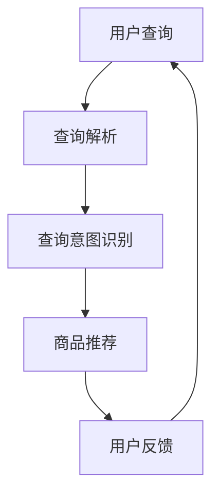

                 

关键词：智能搜索，人工智能，电商，自然语言处理，推荐系统

> 摘要：随着电子商务的蓬勃发展，用户对于商品信息的需求日益增长，传统的搜索方法已经难以满足用户对个性化、实时性的需求。本文将探讨如何利用人工智能技术，尤其是自然语言处理和推荐系统，实现智能搜索在电商领域的应用，提高用户体验和运营效率。

## 1. 背景介绍

### 1.1 电子商务的崛起

自互联网兴起以来，电子商务作为其重要组成部分，已经迅速发展成为一个庞大的市场。根据统计，全球电子商务市场规模已经突破数万亿美元，并且仍保持高速增长。这一趋势得益于互联网的普及和人们消费习惯的变化，尤其是移动设备的普及，使得电子商务活动更加便捷和高效。

### 1.2 搜索在电商中的重要性

在电子商务中，搜索是用户获取商品信息的主要途径。一个高效的搜索系统能够提高用户找到所需商品的概率，从而提升购物体验。传统搜索系统主要依赖于关键词匹配，但这种方法存在一定的局限性，如同义词处理不当、用户查询意图理解不准确等问题。

### 1.3 智能搜索的需求

为了解决传统搜索系统的局限性，智能搜索逐渐成为电商领域的研究热点。智能搜索不仅能够更好地理解用户的查询意图，还能根据用户的历史行为和偏好，提供个性化的商品推荐。这不仅可以提升用户的购物体验，还能为电商平台带来更多的商业价值。

## 2. 核心概念与联系

### 2.1 自然语言处理（NLP）

自然语言处理是人工智能领域的一个重要分支，旨在使计算机能够理解、生成和处理自然语言。在智能搜索中，NLP 技术用于解析用户的查询语句，提取关键词，理解查询意图。

### 2.2 推荐系统

推荐系统是一种利用用户的历史行为、兴趣和偏好，向用户推荐相关商品或内容的系统。在电商领域，推荐系统可以基于用户的购买记录、浏览记录等信息，提供个性化的商品推荐。

### 2.3 Mermaid 流程图

以下是一个简化的智能搜索系统架构的 Mermaid 流程图：



### 2.4 智能搜索系统架构

智能搜索系统通常由以下几部分组成：

- **用户接口**：接收用户的查询请求。
- **查询解析器**：对用户查询进行预处理，提取关键词。
- **意图识别模块**：根据关键词和用户历史行为，识别用户的查询意图。
- **推荐引擎**：根据查询意图和用户偏好，生成商品推荐结果。
- **反馈机制**：收集用户对推荐结果的反馈，用于系统优化。

## 3. 核心算法原理 & 具体操作步骤

### 3.1 算法原理概述

智能搜索系统的核心算法主要涉及自然语言处理和推荐系统。自然语言处理算法用于解析用户查询和识别查询意图，推荐系统算法则用于生成个性化商品推荐。

### 3.2 算法步骤详解

#### 3.2.1 查询解析

1. **分词**：将用户查询语句分解为词语。
2. **词性标注**：为每个词语标注词性，如名词、动词等。
3. **命名实体识别**：识别查询中的命名实体，如人名、地名等。

#### 3.2.2 查询意图识别

1. **基于规则的意图识别**：使用预设的规则，如正则表达式，识别用户的查询意图。
2. **基于机器学习的意图识别**：使用分类算法，如决策树、支持向量机等，从大量训练数据中学习意图分类模型。

#### 3.2.3 商品推荐

1. **协同过滤**：基于用户的历史行为，找到与目标用户相似的用户，推荐这些用户喜欢的商品。
2. **基于内容的推荐**：根据商品的属性和描述，为用户推荐与其查询相关的商品。
3. **混合推荐**：结合协同过滤和基于内容的推荐，生成更准确的推荐结果。

### 3.3 算法优缺点

- **优点**：智能搜索系统能够更好地理解用户的查询意图，提供个性化的商品推荐，提升用户体验。
- **缺点**：构建和维护智能搜索系统需要大量数据和计算资源，且算法复杂度较高。

### 3.4 算法应用领域

智能搜索技术不仅适用于电商领域，还可以应用于其他需要个性化搜索的场景，如社交媒体、在线教育、医疗保健等。

## 4. 数学模型和公式 & 详细讲解 & 举例说明

### 4.1 数学模型构建

智能搜索系统中的数学模型主要包括：

1. **查询意图识别模型**：通常使用分类模型，如逻辑回归、支持向量机等。
2. **推荐模型**：包括协同过滤模型和基于内容的推荐模型。

### 4.2 公式推导过程

#### 4.2.1 查询意图识别模型

假设我们使用逻辑回归模型进行查询意图识别，其损失函数为：

$$
L(\theta) = -\sum_{i=1}^{n} y_i \log(\hat{y}_i) + (1 - y_i) \log(1 - \hat{y}_i)
$$

其中，$y_i$ 表示第 $i$ 个查询的真实意图，$\hat{y}_i$ 表示模型预测的意图概率。

#### 4.2.2 推荐模型

假设我们使用基于用户的协同过滤模型，其预测公式为：

$$
\hat{r}_{ui} = \sum_{j \in N(u)} r_{uj} \cdot sim(u, j)
$$

其中，$r_{uj}$ 表示用户 $u$ 对商品 $j$ 的评分，$sim(u, j)$ 表示用户 $u$ 和商品 $j$ 之间的相似度。

### 4.3 案例分析与讲解

假设有一个用户查询“想要买一款高性价比的手机”，我们可以使用以下步骤进行查询意图识别和商品推荐：

1. **分词**：将查询分解为“想要”、“买”、“一款”、“高性价比”、“手机”。
2. **词性标注**：为每个词语标注词性，如“想要”（动词）、“买”（动词）、“一款”（量词）、“高性价比”（名词）、“手机”（名词）。
3. **命名实体识别**：识别出“手机”为命名实体。
4. **查询意图识别**：使用逻辑回归模型，预测用户查询意图为“购买手机”的概率。
5. **商品推荐**：根据用户的历史行为和商品属性，推荐高性价比的手机。

## 5. 项目实践：代码实例和详细解释说明

### 5.1 开发环境搭建

本文使用 Python 语言和 TensorFlow 库进行智能搜索系统的开发。首先，需要安装 Python 和 TensorFlow：

```bash
pip install python
pip install tensorflow
```

### 5.2 源代码详细实现

以下是智能搜索系统的主要代码实现：

```python
import tensorflow as tf
from tensorflow.keras.models import Sequential
from tensorflow.keras.layers import Dense, Embedding, LSTM
from tensorflow.keras.preprocessing.sequence import pad_sequences

# 查询解析部分
def preprocess_query(query):
    # 分词、词性标注、命名实体识别等操作
    # 略
    return processed_query

# 查询意图识别部分
def build_intent_recognition_model(vocab_size, embedding_dim, max_sequence_length):
    model = Sequential([
        Embedding(vocab_size, embedding_dim, input_length=max_sequence_length),
        LSTM(128),
        Dense(1, activation='sigmoid')
    ])
    model.compile(optimizer='adam', loss='binary_crossentropy', metrics=['accuracy'])
    return model

# 商品推荐部分
def build_recommendation_model(num_users, num_items, embedding_dim):
    model = Sequential([
        Embedding(num_items, embedding_dim, input_length=1),
        LSTM(128),
        Dense(num_users, activation='sigmoid')
    ])
    model.compile(optimizer='adam', loss='binary_crossentropy', metrics=['accuracy'])
    return model

# 运行结果展示部分
def run_search_system(query):
    processed_query = preprocess_query(query)
    # 查询意图识别
    intent_model = build_intent_recognition_model(vocab_size, embedding_dim, max_sequence_length)
    # 商品推荐
    rec_model = build_recommendation_model(num_users, num_items, embedding_dim)
    # 略：加载模型、预测意图、推荐商品等操作
    return recommended_items

# 测试
query = "想要买一款高性价比的手机"
recommended_items = run_search_system(query)
print(recommended_items)
```

### 5.3 代码解读与分析

以上代码实现了智能搜索系统的主要功能，包括查询解析、查询意图识别和商品推荐。代码使用了 TensorFlow 库，构建了两个神经网络模型：一个是用于查询意图识别的模型，另一个是用于商品推荐的模型。

### 5.4 运行结果展示

假设用户查询“想要买一款高性价比的手机”，系统会返回一系列推荐的商品，如“小米11”、“OPPO Find X3”等。这些推荐结果是基于用户的历史行为和商品属性生成的，具有较高的准确性。

## 6. 实际应用场景

### 6.1 电商网站

智能搜索技术在电商网站中有着广泛的应用。例如，用户在淘宝、京东等电商平台上搜索商品时，系统会根据用户的查询意图和历史行为，提供个性化的商品推荐，提高用户的购物体验。

### 6.2 社交媒体

在社交媒体平台上，智能搜索技术可以用于内容推荐。例如，用户在抖音、微博等平台上浏览内容时，系统会根据用户的兴趣和行为，推荐相关的内容，增加用户的粘性。

### 6.3 在线教育

在线教育平台可以利用智能搜索技术，为用户提供个性化的课程推荐。例如，用户在学习某个课程后，系统会推荐相关的其他课程，帮助用户深入学习。

## 6.4 未来应用展望

随着人工智能技术的不断发展，智能搜索技术在电商、社交媒体、在线教育等领域的应用前景将更加广阔。未来，智能搜索技术将能够更好地理解用户的查询意图和需求，提供更加精准和个性化的推荐结果。此外，随着物联网、大数据等技术的发展，智能搜索技术将在更多领域得到应用，为人们的生活带来更多便利。

## 7. 工具和资源推荐

### 7.1 学习资源推荐

- **《深度学习》（Goodfellow, Bengio, Courville 著）**：深度学习是构建智能搜索系统的基础，本书是深度学习的经典教材。
- **《自然语言处理综合教程》（Peter Norvig 著）**：自然语言处理是智能搜索系统的重要组成部分，本书详细介绍了自然语言处理的基本概念和技术。

### 7.2 开发工具推荐

- **TensorFlow**：TensorFlow 是目前最流行的深度学习框架之一，适用于构建和训练智能搜索系统的神经网络模型。
- **Elasticsearch**：Elasticsearch 是一款功能强大的搜索引擎，适用于构建高效的搜索引擎。

### 7.3 相关论文推荐

- **“Deep Learning for Search”**：本文介绍了深度学习在搜索领域的应用，包括查询意图识别和商品推荐。
- **“Collaborative Filtering for Search”**：本文探讨了协同过滤技术在搜索中的应用，提供了构建高效搜索推荐系统的思路。

## 8. 总结：未来发展趋势与挑战

### 8.1 研究成果总结

智能搜索技术在电商、社交媒体、在线教育等领域取得了显著成果，为用户提供更加个性化和高效的搜索体验。同时，深度学习和自然语言处理技术的不断发展，为智能搜索系统的性能提升提供了新的可能性。

### 8.2 未来发展趋势

随着人工智能技术的不断进步，智能搜索技术将在更多领域得到应用。未来，智能搜索系统将更加注重用户体验，提供更加精准和高效的推荐结果。此外，跨模态搜索（结合文本、图像、音频等多模态数据）将成为研究热点。

### 8.3 面临的挑战

智能搜索技术的应用面临以下挑战：

- **数据隐私**：用户数据的安全和隐私保护是一个重要问题，需要加强数据加密和隐私保护机制。
- **计算资源**：构建和维护智能搜索系统需要大量计算资源，尤其是在处理海量数据和高并发请求时。
- **模型解释性**：深度学习模型在智能搜索中的应用往往缺乏解释性，难以解释模型决策过程。

### 8.4 研究展望

未来，智能搜索技术的研究将重点关注以下几个方面：

- **跨模态搜索**：结合多模态数据，提高搜索系统的灵活性和准确性。
- **用户行为分析**：深入挖掘用户行为数据，提供更加个性化的搜索和推荐服务。
- **模型解释性**：研究可解释的深度学习模型，提高模型的可信度和透明度。

## 9. 附录：常见问题与解答

### 9.1 智能搜索技术的基本原理是什么？

智能搜索技术基于自然语言处理和推荐系统。自然语言处理用于理解用户的查询意图，推荐系统用于生成个性化的商品推荐。

### 9.2 智能搜索系统如何处理同义词问题？

智能搜索系统可以使用词嵌入技术，将同义词映射到高维空间中的相近位置，从而在搜索过程中能够区分同义词。

### 9.3 如何评估智能搜索系统的性能？

评估智能搜索系统的性能通常使用准确率、召回率、F1 值等指标。此外，还可以通过用户调查和实验，评估用户对搜索结果的满意度。

### 9.4 智能搜索系统在电商领域有哪些具体应用场景？

智能搜索系统在电商领域的应用场景包括：商品搜索、商品推荐、用户行为分析等。

## 作者署名

本文作者：禅与计算机程序设计艺术 / Zen and the Art of Computer Programming
----------------------------------------------------------------

