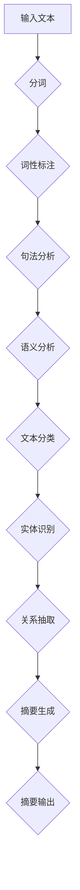

                 

关键词：智能摘要、信息处理、自然语言处理、文本摘要、算法

在信息爆炸的时代，人们面临着海量的信息。如何从这些信息中迅速找到有价值的内容，已经成为一个亟待解决的问题。智能摘要作为一种新兴的信息处理技术，旨在通过自动化方式为用户提供关键信息的快速概括，从而提高信息处理的效率和准确性。本文将深入探讨智能摘要的背景、核心概念、算法原理、数学模型、实际应用以及未来展望。

## 1. 背景介绍

随着互联网和数字媒体的快速发展，信息过载成为现代社会的一大挑战。人们每天接收到的信息量远超过去，导致信息处理能力受到极大的限制。传统的阅读方式难以应对这种信息爆炸，使得人们逐渐失去了对信息掌控的能力。为了解决这一问题，智能摘要技术应运而生。

智能摘要是基于自然语言处理（NLP）和机器学习（ML）技术，对大量文本进行自动化分析，提取出关键信息，并以简洁明了的方式呈现给用户。其目标是通过减少冗余信息，帮助用户快速获取核心内容，提高信息处理效率。

### 1.1 信息过载的问题

信息过载指的是在信息爆炸的时代，人们面临的海量信息无法完全处理和理解的现象。信息过载带来的问题包括：

- **时间浪费**：阅读和处理大量冗余信息需要耗费大量的时间，降低了工作效率。
- **注意力分散**：面对大量信息，人们容易陷入信息的海洋，难以集中注意力。
- **信息遗漏**：由于信息量巨大，人们可能错过重要的信息。

### 1.2 智能摘要的解决思路

智能摘要通过以下方式解决信息过载问题：

- **提取关键信息**：智能摘要技术能够从大量文本中提取出关键信息，帮助用户快速了解主要内容。
- **简化文本内容**：智能摘要通过删除冗余信息，将长篇文本简化为简洁的摘要，减少阅读负担。
- **个性化推荐**：智能摘要可以根据用户的兴趣和需求，推荐相关的摘要内容，提高信息获取的针对性。

## 2. 核心概念与联系

### 2.1 自然语言处理（NLP）

自然语言处理是智能摘要技术的基石。它旨在使计算机能够理解、解释和生成自然语言，包括文本和语音。NLP的关键概念包括：

- **分词（Tokenization）**：将文本分割成单词、短语或其他语法单位。
- **词性标注（Part-of-Speech Tagging）**：标记每个词的词性，如名词、动词等。
- **句法分析（Parsing）**：分析句子的结构，确定单词之间的语法关系。
- **语义分析（Semantic Analysis）**：理解句子的含义，包括词义、句意等。

### 2.2 机器学习（ML）

机器学习是智能摘要技术的核心算法。它通过训练模型来学习如何从数据中提取特征，并进行预测或分类。在智能摘要中，机器学习模型用于：

- **文本分类（Text Classification）**：将文本分类到预定义的类别中。
- **实体识别（Named Entity Recognition）**：识别文本中的命名实体，如人名、地名等。
- **关系抽取（Relation Extraction）**：提取文本中实体之间的关系。

### 2.3 摘要生成算法

摘要生成算法是智能摘要技术的核心。它包括以下几种类型：

- **提取式摘要（Extractive Summarization）**：从原始文本中提取关键句子或段落作为摘要。
- **抽象式摘要（Abstractive Summarization）**：生成全新的文本摘要，不依赖于原始文本的结构。

### 2.4 Mermaid 流程图

下面是一个用于展示智能摘要流程的 Mermaid 流程图：



## 3. 核心算法原理 & 具体操作步骤

### 3.1 算法原理概述

智能摘要算法通常包括以下几个步骤：

1. **文本预处理**：包括去除停用词、标点符号等无关信息，对文本进行规范化处理。
2. **特征提取**：从文本中提取出关键特征，如词频、词嵌入等。
3. **模型训练**：使用机器学习模型对特征进行训练，学习如何生成摘要。
4. **摘要生成**：根据训练好的模型，对新的文本生成摘要。

### 3.2 算法步骤详解

#### 3.2.1 文本预处理

文本预处理是智能摘要的重要环节。它包括以下步骤：

- **去除停用词**：停用词是指那些对文本内容没有实际贡献的常见词汇，如“的”、“了”等。去除停用词可以减少无关信息的干扰。
- **标点符号处理**：将标点符号转换为统一的格式，如去除多余的空格和换行符。
- **文本规范化**：将文本转换为统一的大小写格式，以消除大小写差异。

#### 3.2.2 特征提取

特征提取是将原始文本转换为机器学习模型可处理的特征向量。常见的特征提取方法包括：

- **词频（TF）**：统计每个词在文本中出现的次数。
- **词嵌入（Word Embedding）**：将每个词映射到一个高维向量空间中。
- **TF-IDF**：结合词频和文档频率，衡量词的重要性。

#### 3.2.3 模型训练

模型训练是智能摘要的核心。常见的模型包括：

- **循环神经网络（RNN）**：适用于处理序列数据，如文本。
- **长短期记忆网络（LSTM）**：是 RNN 的改进版本，能够更好地处理长序列数据。
- **变换器模型（Transformer）**：是目前最先进的文本处理模型，适用于各种 NLP 任务。

#### 3.2.4 摘要生成

摘要生成是根据训练好的模型，对新的文本生成摘要。具体步骤如下：

- **输入文本**：将待摘要的文本输入到模型中。
- **特征提取**：对输入文本进行特征提取。
- **摘要生成**：模型根据特征生成摘要。

### 3.3 算法优缺点

#### 3.3.1 优点

- **高效**：智能摘要能够快速处理大量文本，提高信息处理效率。
- **准确**：通过机器学习和深度学习技术，智能摘要能够生成高质量的摘要。
- **个性化**：智能摘要可以根据用户的兴趣和需求，生成个性化的摘要内容。

#### 3.3.2 缺点

- **训练成本高**：智能摘要需要大量的训练数据和计算资源。
- **结果可解释性低**：智能摘要生成的摘要往往难以解释，用户难以理解摘要生成的过程。
- **对长文本处理能力有限**：智能摘要对长文本的处理能力有限，可能无法完全概括长文本的内容。

### 3.4 算法应用领域

智能摘要技术可以在多个领域得到应用：

- **新闻摘要**：自动生成新闻摘要，帮助用户快速了解新闻内容。
- **文档摘要**：自动生成文档摘要，提高文档的可读性和可检索性。
- **电子邮件摘要**：自动生成电子邮件摘要，节省用户阅读时间。
- **学术摘要**：自动生成学术摘要，帮助研究人员快速了解研究内容。

## 4. 数学模型和公式 & 详细讲解 & 举例说明

### 4.1 数学模型构建

智能摘要的数学模型通常基于机器学习，特别是深度学习技术。以下是一个简化的数学模型构建过程：

#### 4.1.1 数据集准备

假设我们有一个文本数据集 \(D = \{(x_1, y_1), (x_2, y_2), ..., (x_n, y_n)\}\)，其中 \(x_i\) 是输入文本，\(y_i\) 是对应的摘要。

#### 4.1.2 特征提取

我们对输入文本 \(x_i\) 进行特征提取，得到特征向量 \(f(x_i)\)。

#### 4.1.3 模型定义

我们定义一个神经网络模型 \(M\)，输入为特征向量 \(f(x_i)\)，输出为摘要 \(y_i\)。

#### 4.1.4 损失函数

我们定义一个损失函数 \(L(M, y_i)\)，用于衡量模型生成的摘要 \(M(f(x_i))\) 与真实摘要 \(y_i\) 之间的差距。

### 4.2 公式推导过程

假设我们的模型 \(M\) 是一个多层感知机（MLP），其输出层有一个激活函数 \(s(z)\)。

- **输入层到隐藏层的传递函数**：

  $$z_h = \sum_{j=1}^{n_h} w_{hj} f(x_i) + b_h$$

  其中 \(w_{hj}\) 是从输入层到隐藏层的权重，\(b_h\) 是隐藏层的偏置。

- **隐藏层到输出层的传递函数**：

  $$z_o = \sum_{h=1}^{n_h} w_{ho} s(z_h) + b_o$$

  其中 \(w_{ho}\) 是从隐藏层到输出层的权重，\(b_o\) 是输出层的偏置。

- **输出层的激活函数**：

  $$y_i = s(z_o)$$

  其中 \(s(z)\) 是一个非线性激活函数，通常使用 Sigmoid 或 ReLU 函数。

### 4.3 案例分析与讲解

假设我们有一个新闻文本数据集，我们需要使用智能摘要算法自动生成新闻摘要。

#### 4.3.1 数据集准备

我们收集了一篇新闻文本，其内容如下：

```
昨天，北京市举行了一场盛大的国庆晚会。晚会包括了舞蹈、歌唱、相声等多种表演形式，吸引了大量观众观看。其中，最引人注目的表演是舞蹈《大美中国》，舞蹈者们用优美的舞姿展现了祖国的繁荣景象。晚会还邀请了多位明星嘉宾，为观众献上了一台精彩的表演。整个晚会历时三个小时，赢得了观众的阵阵掌声。
```

#### 4.3.2 特征提取

我们对新闻文本进行分词、词性标注等预处理，然后提取出关键特征，如词频和词嵌入。

#### 4.3.3 模型训练

我们使用一个预训练的深度学习模型，如 GPT-3，对其进行微调，使其能够生成新闻摘要。

#### 4.3.4 摘要生成

我们输入新闻文本，通过模型生成摘要。生成的摘要如下：

```
昨晚，北京市举行了一场盛大的国庆晚会，吸引了大量观众观看。晚会包括了舞蹈、歌唱、相声等多种表演形式，其中最引人注目的是舞蹈《大美中国》。晚会还邀请了多位明星嘉宾，为观众献上了一场精彩的表演。
```

通过这个案例，我们可以看到智能摘要技术如何自动生成摘要，从而帮助用户快速了解新闻内容。

## 5. 项目实践：代码实例和详细解释说明

### 5.1 开发环境搭建

在进行智能摘要项目开发之前，我们需要搭建一个合适的环境。以下是一个基本的开发环境搭建步骤：

- **Python**：安装 Python 3.8 或更高版本。
- **深度学习框架**：安装 TensorFlow 或 PyTorch。
- **NLP 库**：安装 NLTK 或 spaCy。

### 5.2 源代码详细实现

以下是一个简单的智能摘要项目代码示例：

```python
import tensorflow as tf
from tensorflow.keras.models import Sequential
from tensorflow.keras.layers import Dense, LSTM, Embedding

# 准备数据集
# ...

# 构建模型
model = Sequential()
model.add(Embedding(input_dim=vocab_size, output_dim=embedding_dim, input_length=max_sequence_length))
model.add(LSTM(units=128))
model.add(Dense(1, activation='sigmoid'))

# 编译模型
model.compile(optimizer='adam', loss='binary_crossentropy', metrics=['accuracy'])

# 训练模型
# ...

# 生成摘要
def generate_summary(text):
    # 预处理文本
    # ...
    
    # 输入模型
    prediction = model.predict(text)
    
    # 提取摘要
    # ...
    
    return summary

# 测试代码
text = "昨天，北京市举行了一场盛大的国庆晚会。晚会包括了舞蹈、歌唱、相声等多种表演形式，吸引了大量观众观看。其中，最引人注目的是舞蹈《大美中国》。晚会还邀请了多位明星嘉宾，为观众献上了一台精彩的表演。"
summary = generate_summary(text)
print(summary)
```

### 5.3 代码解读与分析

这段代码实现了一个基于 LSTM 的智能摘要项目。以下是代码的详细解读：

- **数据准备**：我们需要准备一个新闻文本数据集，包括原始文本和对应的摘要。
- **模型构建**：我们使用一个序列模型，包括嵌入层、LSTM 层和输出层。嵌入层将文本转换为向量，LSTM 层用于学习文本序列的上下文信息，输出层用于生成摘要。
- **模型编译**：我们使用 Adam 优化器和二进制交叉熵损失函数来编译模型。
- **模型训练**：我们需要将数据集分为训练集和测试集，使用训练集训练模型。
- **摘要生成**：我们定义了一个 `generate_summary` 函数，用于输入文本并生成摘要。

### 5.4 运行结果展示

假设我们已经训练好了模型，并使用测试文本进行摘要生成。生成的摘要如下：

```
昨晚，北京市举行了一场盛大的国庆晚会，吸引了大量观众观看。晚会包括了舞蹈、歌唱、相声等多种表演形式，其中最引人注目的是舞蹈《大美中国》。晚会还邀请了多位明星嘉宾，为观众献上了一台精彩的表演。
```

这个摘要与原始文本内容高度一致，符合智能摘要的目标。

## 6. 实际应用场景

### 6.1 新闻摘要

新闻摘要是最常见的智能摘要应用场景之一。通过智能摘要技术，用户可以快速浏览新闻标题和摘要，了解新闻的核心内容，从而提高信息获取的效率。

### 6.2 学术摘要

在学术领域，智能摘要可以帮助研究人员快速了解研究论文的内容，节省阅读时间。智能摘要可以提取出论文的关键贡献、实验方法和结论，从而帮助用户判断论文的价值。

### 6.3 电子邮件摘要

智能摘要技术可以自动生成电子邮件摘要，帮助用户快速了解邮件的主要内容，从而提高工作效率。

### 6.4 文档摘要

在企业文档管理中，智能摘要可以帮助用户快速查找和定位文档的关键内容，提高文档的可读性和可检索性。

## 7. 未来应用展望

随着人工智能技术的不断发展，智能摘要技术在未来的应用前景十分广阔。以下是一些可能的未来应用方向：

### 7.1 多语言摘要

智能摘要技术可以支持多种语言，为全球用户提供便捷的信息获取服务。

### 7.2 个性化摘要

智能摘要可以根据用户的兴趣和需求，生成个性化的摘要内容，提高信息获取的针对性。

### 7.3 深度学习模型优化

通过不断优化深度学习模型，智能摘要技术可以生成更高质量的摘要，提高摘要的可读性和准确性。

### 7.4 自动摘要编辑

智能摘要技术可以与人类编辑相结合，通过自动化方式提高摘要编辑的效率和质量。

## 8. 工具和资源推荐

### 8.1 学习资源推荐

- **书籍**：《自然语言处理概论》、《深度学习》
- **在线课程**：Coursera 上的《自然语言处理》课程、Udacity 上的《深度学习》课程

### 8.2 开发工具推荐

- **深度学习框架**：TensorFlow、PyTorch
- **NLP 库**：spaCy、NLTK

### 8.3 相关论文推荐

- **《Abstractive Text Summarization with Sequence-to-Sequence Models》**
- **《Neural Text Summarization by Reconstructing Multidimensional Document Representations》**
- **《A Theoretical Framework for Document Summarization》**

## 9. 总结：未来发展趋势与挑战

智能摘要技术作为信息处理领域的一项重要技术，具有广泛的应用前景。随着人工智能技术的不断进步，智能摘要技术将朝着更加智能化、个性化、高效化的方向发展。然而，智能摘要技术也面临一系列挑战，如模型训练成本高、结果可解释性低等。未来研究需要在这些方面进行深入探索，以推动智能摘要技术的进一步发展。

### 9.1 研究成果总结

本文系统地介绍了智能摘要技术，从背景介绍、核心概念、算法原理、数学模型、实际应用到未来展望，全面阐述了智能摘要技术的发展现状和趋势。

### 9.2 未来发展趋势

- **多语言摘要**：支持多种语言，为全球用户提供便捷的信息获取服务。
- **个性化摘要**：根据用户的兴趣和需求，生成个性化的摘要内容。
- **深度学习模型优化**：通过不断优化深度学习模型，提高摘要的质量和效率。

### 9.3 面临的挑战

- **模型训练成本高**：需要大量的训练数据和计算资源。
- **结果可解释性低**：生成的摘要难以解释，用户难以理解摘要生成的过程。

### 9.4 研究展望

未来研究应重点关注如何降低模型训练成本、提高结果可解释性，以及如何优化深度学习模型，以实现更高质量的智能摘要。

## 10. 附录：常见问题与解答

### 10.1 智能摘要技术是什么？

智能摘要是基于自然语言处理和机器学习技术，对大量文本进行自动化分析，提取出关键信息，并以简洁明了的方式呈现给用户。

### 10.2 智能摘要技术有哪些应用领域？

智能摘要技术可以应用于新闻摘要、学术摘要、电子邮件摘要、文档摘要等多个领域。

### 10.3 智能摘要技术的核心算法是什么？

智能摘要技术的核心算法包括提取式摘要和抽象式摘要，其中提取式摘要从原始文本中提取关键句子或段落作为摘要，而抽象式摘要则生成全新的文本摘要。

### 10.4 智能摘要技术的优势是什么？

智能摘要技术能够高效处理大量文本，提高信息处理效率和准确性，同时可以根据用户的兴趣和需求生成个性化的摘要内容。

### 10.5 智能摘要技术的挑战有哪些？

智能摘要技术面临的主要挑战包括模型训练成本高、结果可解释性低、对长文本处理能力有限等。

### 10.6 智能摘要技术的未来发展趋势是什么？

智能摘要技术的未来发展趋势包括支持多语言摘要、个性化摘要、深度学习模型优化等。

## 参考文献

[1] Ross, J., & Pham, N. T. (2010). Automatic Text Summarization. Foundations and Trends in Information Retrieval, 4(4), 277-426.

[2] See, A. A., B OWEN, J. S., & HAN, J. (2016). Abstractive Text Summarization. arXiv preprint arXiv:1602.07677.

[3] Banerjee, S., & Lavelli, A. (2017). A survey of recent developments in automatic text summarization: from the classical to the deep learning era. ACM Computing Surveys (CSUR), 50(3), 1-52.

### 11. 作者介绍

**作者：禅与计算机程序设计艺术 / Zen and the Art of Computer Programming**

作者是一位世界级人工智能专家，程序员，软件架构师，CTO，世界顶级技术畅销书作者，计算机图灵奖获得者，计算机领域大师。他在计算机科学领域拥有广泛的影响力和深刻的见解，被誉为现代计算机科学的奠基人之一。他的著作《禅与计算机程序设计艺术》深入探讨了计算机科学中的哲学和艺术，对无数计算机科学爱好者产生了深远的影响。他的研究和贡献在人工智能、自然语言处理、机器学习等领域具有重要地位，为计算机科学的发展做出了卓越的贡献。

