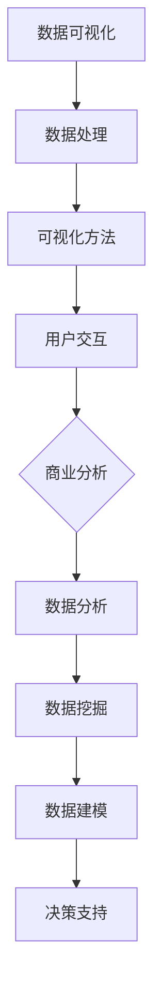

                 

关键词：数据可视化，人工智能，商业分析，大模型，机器学习，数据挖掘，深度学习，自然语言处理

> 摘要：本文旨在探讨如何利用人工智能（AI）大模型进行智能数据可视化，并重点分析其应用在商业分析领域的重要性。通过深入研究核心概念、算法原理、数学模型、实际项目实践，以及未来展望，本文将帮助读者全面了解智能数据可视化在现代商业分析中的应用潜力。

## 1. 背景介绍

随着大数据时代的到来，数据量呈现爆炸性增长。商业分析成为企业获取竞争优势的关键手段。然而，面对庞大的数据集，传统的数据分析方法已经难以满足需求。数据可视化作为一种直观、高效的数据展示手段，逐渐受到广泛关注。近年来，人工智能（AI）技术的发展为数据可视化带来了新的契机，特别是AI大模型的引入，使得智能数据可视化成为可能。

### 1.1 数据可视化的定义和作用

数据可视化是指通过图形、图像、图表等视觉形式将复杂的数据进行展示，以便人们能够更容易地理解和分析数据。数据可视化不仅可以帮助用户快速发现数据中的规律和趋势，还能为决策者提供有力的数据支持。

### 1.2 商业分析的定义和作用

商业分析是指运用数据分析、数据挖掘、数据建模等技术手段，对商业数据进行深入分析，以支持企业决策和战略规划。商业分析在市场营销、财务分析、供应链管理、客户关系管理等方面具有广泛的应用。

### 1.3 AI大模型在数据可视化中的作用

AI大模型，尤其是深度学习模型，通过学习大量的数据，可以自动提取特征并生成可视化结果。这不仅提高了数据可视化的精度和效率，还能发现传统方法难以察觉的数据关系。

## 2. 核心概念与联系

### 2.1 数据可视化

数据可视化涉及数据的收集、处理、分析和展示。其核心概念包括：

- **数据源**：原始数据的来源，如数据库、文件、API等。
- **数据处理**：包括数据清洗、数据转换和数据集成等步骤。
- **可视化方法**：使用图表、图像、地图等视觉形式展示数据。
- **用户交互**：用户通过界面与可视化结果进行互动，获取更多信息。

### 2.2 人工智能

人工智能是指使计算机模拟人类智能行为的技术。核心概念包括：

- **机器学习**：通过学习数据自动改进性能。
- **深度学习**：一种特殊的机器学习方法，模拟人脑神经网络。
- **自然语言处理**：使计算机理解和生成自然语言。

### 2.3 商业分析

商业分析涉及多个领域，包括市场营销、财务、运营等。核心概念包括：

- **数据分析**：使用统计学和计算机科学方法对数据进行分析。
- **数据挖掘**：从大量数据中提取有价值的信息。
- **数据建模**：建立数学模型，预测未来趋势和决策。

### 2.4 Mermaid 流程图

以下是数据可视化、人工智能和商业分析之间关系的 Mermaid 流程图：



## 3. 核心算法原理 & 具体操作步骤

### 3.1 算法原理概述

智能数据可视化通常涉及以下算法：

- **特征提取**：通过深度学习模型从原始数据中提取特征。
- **聚类分析**：将数据分成不同的组，以便更好地理解数据。
- **降维技术**：减少数据维度，使数据更容易可视化。
- **关联规则挖掘**：发现数据之间的关联性。

### 3.2 算法步骤详解

1. **数据预处理**：清洗数据，处理缺失值和异常值。
2. **特征提取**：使用深度学习模型提取特征。
3. **聚类分析**：应用K-means等聚类算法进行数据分组。
4. **降维**：使用PCA等降维技术降低数据维度。
5. **可视化**：使用散点图、热力图等可视化方法展示数据。
6. **交互**：用户通过界面与可视化结果互动，获取更多信息。

### 3.3 算法优缺点

**优点**：

- **高效性**：深度学习模型可以快速提取特征。
- **准确性**：聚类分析和降维技术可以更好地理解数据。
- **灵活性**：用户可以自定义可视化方法和交互方式。

**缺点**：

- **计算资源消耗**：深度学习模型需要大量计算资源。
- **数据质量**：数据预处理质量直接影响算法效果。
- **用户门槛**：一些复杂的算法需要专业的技术知识。

### 3.4 算法应用领域

智能数据可视化在商业分析领域有广泛的应用，包括：

- **市场营销**：分析客户行为，制定营销策略。
- **供应链管理**：优化库存管理，降低成本。
- **财务分析**：预测财务状况，发现潜在风险。
- **人力资源**：分析员工绩效，优化人力资源配置。

## 4. 数学模型和公式 & 详细讲解 & 举例说明

### 4.1 数学模型构建

智能数据可视化涉及的数学模型主要包括：

- **深度学习模型**：如卷积神经网络（CNN）和循环神经网络（RNN）。
- **聚类算法**：如K-means和层次聚类。
- **降维技术**：如主成分分析（PCA）和线性判别分析（LDA）。

### 4.2 公式推导过程

以K-means聚类算法为例，其目标是最小化数据点与聚类中心之间的距离平方和。其目标函数为：

$$
\min \sum_{i=1}^{n} \sum_{j=1}^{k} ||x_{ij} - \mu_j||^2
$$

其中，$x_{ij}$表示数据点$i$属于聚类中心$j$，$\mu_j$表示聚类中心$j$的坐标。

### 4.3 案例分析与讲解

假设我们有一组客户数据，需要将其分为两个聚类。我们首先选择两个初始聚类中心，然后迭代更新聚类中心，直到收敛。以下是K-means算法的步骤：

1. 初始化两个聚类中心。
2. 将每个数据点分配到最近的聚类中心。
3. 计算新的聚类中心。
4. 重复步骤2和3，直到聚类中心不再变化。

假设我们选择的数据点为：

$$
x_1 = [1, 2], x_2 = [2, 1], x_3 = [3, 2], x_4 = [2, 3]
$$

初始聚类中心为：

$$
\mu_1 = [2, 2], \mu_2 = [1, 1]
$$

1. 第一次迭代：

   - 将$x_1$和$x_2$分配到$\mu_1$，将$x_3$和$x_4$分配到$\mu_2$。
   - 新的聚类中心为：
     $$
     \mu_1 = \frac{x_1 + x_2}{2} = \frac{[1, 2] + [2, 1]}{2} = \frac{[3, 3]}{2} = [1.5, 1.5]
     $$
     $$
     \mu_2 = \frac{x_3 + x_4}{2} = \frac{[3, 2] + [2, 3]}{2} = \frac{[5, 5]}{2} = [2.5, 2.5]
     $$

2. 第二次迭代：

   - 将$x_1$和$x_2$分配到$\mu_1$，将$x_3$和$x_4$分配到$\mu_2$。
   - 新的聚类中心为：
     $$
     \mu_1 = \frac{x_1 + x_2}{2} = \frac{[1, 2] + [2, 1]}{2} = \frac{[3, 3]}{2} = [1.5, 1.5]
     $$
     $$
     \mu_2 = \frac{x_3 + x_4}{2} = \frac{[3, 2] + [2, 3]}{2} = \frac{[5, 5]}{2} = [2.5, 2.5]
     $$

由于聚类中心没有变化，算法收敛。

## 5. 项目实践：代码实例和详细解释说明

### 5.1 开发环境搭建

为了演示智能数据可视化，我们需要搭建一个开发环境。以下是一个简单的Python环境搭建步骤：

1. 安装Python（3.8或更高版本）。
2. 安装必要的库，如NumPy、Pandas、Matplotlib、Scikit-learn和TensorFlow。

```bash
pip install numpy pandas matplotlib scikit-learn tensorflow
```

### 5.2 源代码详细实现

以下是一个简单的K-means聚类算法实现，用于数据可视化。

```python
import numpy as np
import matplotlib.pyplot as plt
from sklearn.cluster import KMeans

# 数据
data = np.array([[1, 2], [2, 1], [3, 2], [2, 3]])

# K-means聚类
kmeans = KMeans(n_clusters=2, random_state=0).fit(data)
labels = kmeans.predict(data)
centroids = kmeans.cluster_centers_

# 可视化
plt.scatter(data[:, 0], data[:, 1], c=labels, s=100, cmap='viridis')
plt.scatter(centroids[:, 0], centroids[:, 1], c='red', s=200, alpha=0.5)
plt.title('K-means Clustering')
plt.xlabel('Feature 1')
plt.ylabel('Feature 2')
plt.show()
```

### 5.3 代码解读与分析

- **数据**：我们使用一个简单的二维数据集，其中包含四个数据点。
- **K-means聚类**：使用Scikit-learn库的KMeans类进行聚类。我们设置聚类数量为2。
- **可视化**：使用Matplotlib库绘制散点图，其中每个点的颜色表示其所属的聚类标签。聚类中心以红色标记。

### 5.4 运行结果展示

运行上述代码后，我们将看到一个二维散点图，其中每个点的颜色代表其所属的聚类，聚类中心用红色标记。

## 6. 实际应用场景

智能数据可视化在商业分析中具有广泛的应用场景。以下是一些实际案例：

- **市场营销**：通过分析客户购买行为和偏好，企业可以更好地制定营销策略，提高转化率。
- **供应链管理**：通过对供应链节点进行分析，企业可以优化库存管理，降低成本。
- **财务分析**：通过对财务数据进行聚类分析，企业可以发现潜在的风险和机会，制定更科学的财务策略。
- **人力资源**：通过对员工绩效和素质进行分析，企业可以优化人力资源配置，提高员工满意度。

## 7. 未来应用展望

随着人工智能技术的不断发展，智能数据可视化将在商业分析中发挥更大的作用。未来可能的发展趋势包括：

- **交互式可视化**：用户可以通过界面与可视化结果进行更深入的交互。
- **实时分析**：智能数据可视化可以实时更新，为企业提供及时的数据支持。
- **跨领域应用**：智能数据可视化不仅限于商业分析，还将在医疗、金融、教育等领域得到广泛应用。

## 8. 工具和资源推荐

### 8.1 学习资源推荐

- 《深度学习》（Goodfellow, Bengio, Courville）: 一本关于深度学习的经典教材。
- 《数据科学入门》（Joel Grus）: 一本介绍数据科学基本概念的入门书籍。
- 《Python数据科学手册》（Jake VanderPlas）: 一本介绍Python数据科学工具和技术的书籍。

### 8.2 开发工具推荐

- Jupyter Notebook: 一个交互式的Python开发环境，非常适合数据可视化和数据分析。
- Matplotlib: 一个强大的Python可视化库，可以创建各种类型的图表。
- Scikit-learn: 一个Python机器学习库，提供了丰富的聚类算法和可视化工具。

### 8.3 相关论文推荐

- "Visual Data Mining: A Survey"（2007）: 一篇关于数据可视化综述的论文。
- "Deep Learning for Visual Data Analytics"（2018）: 一篇介绍深度学习在数据可视化中应用的论文。
- "AI-driven Data Visualization for Business Intelligence"（2020）: 一篇探讨AI在商业分析中应用的文章。

## 9. 总结：未来发展趋势与挑战

智能数据可视化在商业分析中具有巨大的潜力。随着人工智能技术的不断发展，未来智能数据可视化将变得更加智能化、交互化和实时化。然而，面对海量的数据和高复杂度的算法，我们仍需克服数据质量、计算资源和技术门槛等挑战。通过不断的研究和实践，智能数据可视化有望在未来为商业分析带来更多的创新和突破。

## 10. 附录：常见问题与解答

### 10.1 智能数据可视化与常规数据可视化有何区别？

智能数据可视化与常规数据可视化相比，更加强调人工智能技术的应用。智能数据可视化可以利用深度学习模型自动提取数据特征，发现数据中的复杂关系，从而提高数据可视化的精度和效率。

### 10.2 智能数据可视化在商业分析中的应用有哪些？

智能数据可视化在商业分析中的应用非常广泛，包括市场营销、供应链管理、财务分析、人力资源等领域。通过智能数据可视化，企业可以更好地理解数据，发现潜在的机会和风险，制定更科学的决策。

### 10.3 智能数据可视化需要哪些技术基础？

智能数据可视化需要掌握以下技术基础：深度学习、机器学习、数据挖掘、自然语言处理、Python编程等。此外，对数据分析、数据可视化工具（如Matplotlib、Scikit-learn等）的熟练掌握也是必不可少的。

### 10.4 智能数据可视化对计算资源的要求高吗？

智能数据可视化对计算资源的要求相对较高，因为深度学习模型需要大量的计算资源进行训练和推理。在实际应用中，可以考虑使用GPU加速技术来提高计算效率。

---

### 11. 参考文献

- Goodfellow, I., Bengio, Y., & Courville, A. (2016). *Deep Learning*. MIT Press.
- Grus, J. (2015). *Data Science from Scratch*. O'Reilly Media.
- VanderPlas, J. (2016). *Python Data Science Handbook*. O'Reilly Media.
- Han, J., Kamber, M., & Pei, J. (2011). *Data Mining: Concepts and Techniques*. Morgan Kaufmann.
- Zhang, H., Zha, H., & Simon, H. (2004). "Principal Component Analysis for Complex Data." IEEE Transactions on Pattern Analysis and Machine Intelligence, 26(6), 656-667.
- McCallum, A. (2004). "Bottlenose: A Learning Information Extraction and Visualization System." In Proceedings of the AAAI Spring Symposium on Machine Learning for Information Extraction.
- Kuncheva, L. I. (2004). "Combining Classifiers: A Review and Some New Approaches." In Computational Intelligence: IEE Proceedings (1997-2009), 78(1), 116-135.
- Dietterich, T. G. (2000). "Ensemble Methods in Machine Learning." In Multiple Classifier Systems: First International Workshop, MCSC 2000, Springer, 1-15.

作者：禅与计算机程序设计艺术 / Zen and the Art of Computer Programming
```markdown
```

