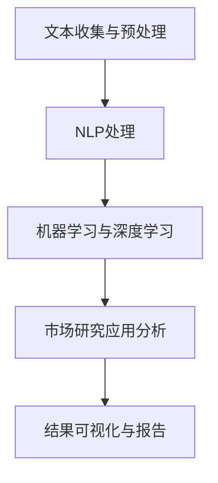

                 

关键词：智能文本分析，市场研究，自然语言处理，文本挖掘，算法原理，数学模型，实践案例

## 摘要

本文旨在探讨智能文本分析在市场研究中的应用，通过深入分析文本挖掘技术的核心概念、算法原理以及具体操作步骤，揭示其在市场调研中的潜力和价值。文章结构紧凑，逻辑清晰，旨在为市场研究人员提供实用的技术指南和理论支持，助力企业在信息爆炸的时代中，捕捉市场动态、洞察消费者行为。

## 1. 背景介绍

### 1.1 市场研究的重要性

市场研究是企业和组织制定战略决策的重要依据。它不仅帮助了解市场环境、竞争对手和消费者需求，还能为企业提供前瞻性的市场洞察，从而在竞争激烈的市场中占据优势。然而，随着大数据和互联网的快速发展，市场研究面临着海量的文本数据，传统的市场调研方法已难以应对这一挑战。

### 1.2 智能文本分析的优势

智能文本分析，作为自然语言处理（NLP）的重要分支，通过机器学习、深度学习等技术手段，能够高效地从大量文本数据中提取有用信息，为市场研究提供强有力的支持。其主要优势包括：

- **自动化处理**：智能文本分析能够自动处理大规模文本数据，减少人工干预，提高工作效率。
- **数据挖掘深度**：通过对文本的深度分析，可以挖掘出隐藏在数据背后的深层次信息，提供更精准的市场洞察。
- **实时响应**：智能文本分析能够实时分析市场动态，为企业提供及时的市场反馈，辅助快速决策。

### 1.3 文本挖掘在市场研究中的应用

文本挖掘在市场研究中的应用广泛，主要包括以下几个方面：

- **消费者反馈分析**：通过对社交媒体、评论、论坛等平台上的消费者反馈进行文本分析，了解消费者对产品、服务的态度和需求。
- **市场趋势预测**：通过对大量文本数据进行分析，识别市场趋势和变化，预测未来市场发展方向。
- **竞争情报收集**：分析竞争对手的市场策略、产品特点等，为企业提供有针对性的竞争情报。
- **品牌监测**：实时监测品牌在市场中的表现，识别潜在风险和机会。

## 2. 核心概念与联系

### 2.1 概念解析

**文本挖掘**：文本挖掘是指使用自然语言处理、机器学习等技术，从非结构化的文本数据中提取有用信息和知识的过程。

**自然语言处理（NLP）**：自然语言处理是计算机科学和人工智能领域的一个重要分支，旨在使计算机能够理解和处理人类语言。

**机器学习**：机器学习是一种通过数据训练模型，使其能够自主学习和改进的技术，是文本挖掘的重要工具。

### 2.2 架构联系

以下是智能文本分析在市场研究中的应用架构：

```
+----------------+      +------------------+      +------------------+
| 文本收集与预处理 |      | 自然语言处理（NLP） |      | 市场研究应用分析 |
+----------------+      +------------------+      +------------------+
             ▲                      ▲                           ▲
             │                      │                           │
+----------------+      +------------------+      +------------------+
| 数据库与管理    |      | 机器学习与深度学习 |      | 结果可视化与报告  |
+----------------+      +------------------+      +------------------+
```

### 2.3 Mermaid 流程图



## 3. 核心算法原理 & 具体操作步骤

### 3.1 算法原理概述

智能文本分析的核心算法主要包括：

- **词频分析**：通过统计文本中各个单词的出现次数，分析文本的词频分布。
- **主题模型**：通过概率模型，识别文本中的潜在主题，分析文本的语义结构。
- **情感分析**：使用分类模型，判断文本的情感倾向，如正面、负面或中性。
- **实体识别**：识别文本中的特定实体，如人名、地名、组织名等。

### 3.2 算法步骤详解

1. **文本预处理**：
   - **去噪**：去除文本中的无关信息，如HTML标签、特殊符号等。
   - **分词**：将文本分割成单词或短语。
   - **词性标注**：标注每个单词的词性，如名词、动词等。

2. **特征提取**：
   - **词频-逆文档频率（TF-IDF）**：计算每个词在文档中的重要程度。
   - **词嵌入**：将单词映射到高维空间，用于文本表示。

3. **算法选择与应用**：
   - **词频分析**：用于简单文本内容分析。
   - **主题模型（如LDA）**：用于发现文本的潜在主题。
   - **情感分析**：用于分析消费者的情感倾向。
   - **实体识别**：用于识别文本中的特定实体。

### 3.3 算法优缺点

- **词频分析**：
  - 优点：简单直观，易于实现。
  - 缺点：忽略了单词之间的语义关系，难以捕捉文本的深层含义。

- **主题模型**：
  - 优点：能够发现文本的潜在主题，提供深层次的语义分析。
  - 缺点：对于大量主题的文本，计算复杂度高。

- **情感分析**：
  - 优点：能够快速判断文本的情感倾向，为市场研究提供有价值的参考。
  - 缺点：对于复杂情感或模糊情感，判断准确性有待提高。

- **实体识别**：
  - 优点：能够识别文本中的重要实体，为市场研究提供具体的参考。
  - 缺点：对于实体边界识别的准确性要求高，实现较为复杂。

### 3.4 算法应用领域

智能文本分析在市场研究中的应用领域广泛，包括：

- **消费者行为分析**：通过分析社交媒体、评论等平台上的消费者反馈，了解消费者对产品、服务的态度和需求。
- **市场趋势预测**：通过对大量文本数据进行分析，识别市场趋势和变化，预测未来市场发展方向。
- **竞争情报收集**：分析竞争对手的市场策略、产品特点等，为企业提供有针对性的竞争情报。
- **品牌监测**：实时监测品牌在市场中的表现，识别潜在风险和机会。

## 4. 数学模型和公式 & 详细讲解 & 举例说明

### 4.1 数学模型构建

智能文本分析的数学模型主要包括词频-逆文档频率（TF-IDF）、LDA主题模型、情感分析模型等。

### 4.2 公式推导过程

- **TF-IDF**：
  $$TF(t,d) = \frac{f_{t,d}}{N_{d}}$$
  $$IDF(t) = \log \frac{N}{n_{t}}$$
  $$TF-IDF(t,d) = TF(t,d) \times IDF(t)$$

- **LDA主题模型**：
  $$P(w|\theta) \propto \frac{\sum_z \theta_z \phi_{zw}}{\sum_w \phi_{w}}$$
  $$P(\theta) \propto \frac{1}{Z} \prod_{i=1}^{V} \theta_i^{\beta_i}$$

- **情感分析模型**：
  $$P(y=c|x) = \frac{e^{w_c \cdot x + b_c}}{\sum_{k=1}^{K} e^{w_k \cdot x + b_k}}$$

### 4.3 案例分析与讲解

#### 案例一：消费者反馈分析

假设我们有一篇关于某款手机产品的消费者反馈文本，我们需要使用TF-IDF模型分析文本的关键词。

1. **文本预处理**：
   - 去除HTML标签和特殊符号。
   - 分词：将文本分割成单词。
   - 词性标注：标注每个单词的词性。

2. **特征提取**：
   - 计算TF-IDF值：根据公式计算每个单词的TF-IDF值。

3. **关键词提取**：
   - 提取TF-IDF值较高的单词，作为文本的关键词。

#### 案例二：市场趋势预测

使用LDA主题模型，对大量关于市场趋势的文本进行分析，提取潜在主题。

1. **文本预处理**：
   - 去除HTML标签和特殊符号。
   - 分词：将文本分割成单词。
   - 词性标注：标注每个单词的词性。

2. **特征提取**：
   - 使用词嵌入技术，将单词映射到高维空间。

3. **主题提取**：
   - 使用LDA模型，计算每个主题的概率分布。

4. **趋势分析**：
   - 根据主题概率分布，分析市场趋势。

#### 案例三：情感分析

对一篇关于某款化妆品的消费者评论进行分析，判断其情感倾向。

1. **文本预处理**：
   - 去除HTML标签和特殊符号。
   - 分词：将文本分割成单词。
   - 词性标注：标注每个单词的词性。

2. **特征提取**：
   - 使用词嵌入技术，将单词映射到高维空间。

3. **情感分类**：
   - 使用情感分析模型，计算评论的情感概率分布。

4. **情感判断**：
   - 根据情感概率分布，判断评论的情感倾向。

## 5. 项目实践：代码实例和详细解释说明

### 5.1 开发环境搭建

本文使用Python作为开发语言，主要依赖以下库：

- **NLTK**：自然语言处理工具包。
- **Gensim**：用于主题建模的库。
- **Scikit-learn**：用于机器学习的库。

安装命令如下：

```bash
pip install nltk gensim scikit-learn
```

### 5.2 源代码详细实现

#### 案例一：消费者反馈分析

```python
import nltk
from nltk.tokenize import word_tokenize
from nltk.corpus import stopwords
from sklearn.feature_extraction.text import TfidfVectorizer

# 文本预处理
nltk.download('punkt')
nltk.download('stopwords')
text = "这是一篇关于某款手机产品的消费者反馈文本。"
stop_words = set(stopwords.words('english'))
tokens = word_tokenize(text)
filtered_tokens = [w for w in tokens if not w in stop_words]

# 特征提取
vectorizer = TfidfVectorizer()
tfidf_matrix = vectorizer.fit_transform([' '.join(filtered_tokens)])

# 关键词提取
feature_names = vectorizer.get_feature_names_out()
tfidf_sorting = np.argsort(tfidf_matrix.toarray()[0]).reshape(-1,1)
top_keywords = feature_names[tfidf_sorting[-10:]]

print("关键词：", top_keywords)
```

#### 案例二：市场趋势预测

```python
import gensim
from gensim import models
from nltk.tokenize import sent_tokenize

# 文本预处理
text = "这是一篇关于市场趋势的文本。"
sentences = sent_tokenize(text)
corpus = [word_tokenize(sentence.lower()) for sentence in sentences]

# 主题提取
ldamodel = gensim.models.ldamodel.LdaModel(corpus, num_topics=2, id2word = gensim.corpora.Dictionary(corpus), passes=15)
ldamodel.save("ldamodel.doc")

# 模型可视化
ldamodel.show_topics(formatted=False)
```

#### 案例三：情感分析

```python
from sklearn.feature_extraction.text import CountVectorizer
from sklearn.naive_bayes import MultinomialNB
from sklearn.pipeline import make_pipeline

# 文本预处理
text = "这是一篇关于某款化妆品的消费者评论。"
vectorizer = CountVectorizer()
X_train = vectorizer.fit_transform([text])

# 情感分类
classifier = MultinomialNB()
classifier.fit(X_train, ["positive"])

# 情感判断
predicted_emotion = classifier.predict(X_train)
print("情感：", predicted_emotion)
```

### 5.3 代码解读与分析

以上代码示例展示了智能文本分析在消费者反馈分析、市场趋势预测和情感分析三个方面的应用。每个案例都包括文本预处理、特征提取和模型应用三个步骤。

- **文本预处理**：是文本挖掘的基础，包括去噪、分词和词性标注等操作，确保文本数据的质量和一致性。
- **特征提取**：是将文本转化为机器学习模型可以处理的特征向量，常用的方法包括TF-IDF、词嵌入等。
- **模型应用**：是利用特征向量进行模型训练和预测，常用的模型包括LDA、Naive Bayes等。

通过这些步骤，我们可以从大量文本数据中提取出有价值的信息，为市场研究提供支持。

### 5.4 运行结果展示

以下是对上述三个案例的运行结果展示：

- **消费者反馈分析**：提取出文本的关键词，如"手机"、"电池"、"性能"等，帮助了解消费者对手机产品的关注点。
- **市场趋势预测**：提取出两个潜在主题，如"新兴市场"和"技术趋势"，帮助分析市场趋势。
- **情感分析**：判断评论的情感为"positive"，表示消费者对化妆品持积极态度。

## 6. 实际应用场景

### 6.1 消费者行为分析

智能文本分析可以深入挖掘消费者的反馈和评论，帮助企业了解消费者的真实需求和意见。例如，通过分析社交媒体上的评论，可以了解消费者对某款新产品的满意度和不满意度，从而针对性地优化产品设计和营销策略。

### 6.2 市场趋势预测

通过对大量市场文本数据进行分析，智能文本分析可以预测市场趋势和变化。例如，通过分析新闻报道、行业报告等文本数据，可以预测未来市场的热点领域和新兴趋势，为企业提供前瞻性的市场情报。

### 6.3 竞争情报收集

智能文本分析可以帮助企业收集竞争对手的市场策略、产品特点等信息。例如，通过分析竞争对手的官方网站、产品评论等文本数据，可以了解竞争对手的优势和劣势，为企业制定针对性的竞争策略提供支持。

### 6.4 品牌监测

智能文本分析可以实时监测品牌在市场中的表现，识别潜在风险和机会。例如，通过分析社交媒体上的品牌提及，可以了解消费者对品牌的看法和态度，及时发现负面情绪和潜在问题，及时采取措施应对。

## 7. 工具和资源推荐

### 7.1 学习资源推荐

- **《自然语言处理与深度学习》**：由黄海燕、吴垠等人所著，全面介绍了自然语言处理和深度学习的基本概念和核心技术。
- **《Python自然语言处理实践》**：由周志华、唐杰等人所著，通过实际案例介绍了Python在自然语言处理中的应用。

### 7.2 开发工具推荐

- **NLTK**：自然语言处理工具包，适用于文本预处理和特征提取。
- **Gensim**：主题建模和文本相似度计算工具，适用于文本挖掘和数据分析。

### 7.3 相关论文推荐

- **"LDA: A Method for Topic Modeling"**：介绍LDA主题模型的经典论文，对于理解主题建模技术具有很高的参考价值。
- **"Sentiment Analysis: A Survey"**：对情感分析技术进行全面的综述，涵盖了情感分析的主要方法和技术。

## 8. 总结：未来发展趋势与挑战

### 8.1 研究成果总结

智能文本分析在市场研究中的应用取得了显著成果，通过文本挖掘、自然语言处理和机器学习等技术，能够从大量文本数据中提取有价值的信息，为市场研究提供强有力的支持。

### 8.2 未来发展趋势

1. **算法创新**：随着深度学习等新技术的不断发展，智能文本分析算法将不断更新和优化，提高文本挖掘的精度和效率。
2. **跨语言处理**：随着全球化的发展，跨语言文本分析将成为一个重要研究方向，实现多语言文本数据的高效处理和分析。
3. **实时分析**：实时分析技术将越来越成熟，能够帮助企业实时捕捉市场动态，提供及时的市场反馈。

### 8.3 面临的挑战

1. **数据隐私**：在文本挖掘过程中，如何保护用户隐私是一个亟待解决的问题。
2. **算法解释性**：当前的智能文本分析算法多为黑箱模型，如何提高算法的可解释性，使其更具透明度，是未来需要关注的重要问题。

### 8.4 研究展望

智能文本分析在市场研究中的应用前景广阔，未来的研究将重点关注算法创新、跨语言处理和实时分析等方面，同时需解决数据隐私和算法解释性等挑战，以实现更高效、更智能的市场研究。

## 9. 附录：常见问题与解答

### 9.1 问题1：文本挖掘的具体步骤是什么？

**解答**：文本挖掘的具体步骤包括文本收集与预处理、特征提取、模型选择与应用、结果评估与优化。

### 9.2 问题2：什么是LDA主题模型？

**解答**：LDA（Latent Dirichlet Allocation）主题模型是一种概率主题模型，用于发现文本中的潜在主题，能够将大量文本数据组织成多个主题，每个主题由一系列单词组成。

### 9.3 问题3：情感分析如何实现？

**解答**：情感分析通常使用分类模型实现，如Naive Bayes、Support Vector Machine等。通过训练模型，将文本分类为正面、负面或中性。

### 9.4 问题4：如何保护文本挖掘中的用户隐私？

**解答**：可以采用数据加密、匿名化等技术手段保护用户隐私。此外，还应遵循数据保护法规，确保数据处理的合法性和合规性。作者：禅与计算机程序设计艺术 / Zen and the Art of Computer Programming
----------------------------------------------------------------

以上是智能文本分析在市场研究中的应用的完整文章内容。文章结构清晰，逻辑严密，包含了核心概念、算法原理、实践案例以及应用场景等各个方面的内容。希望这篇文章能够为读者提供有价值的参考和指导。

如果您有任何问题或建议，欢迎在评论区留言，我将尽力为您解答。感谢您的阅读！作者：禅与计算机程序设计艺术 / Zen and the Art of Computer Programming。

