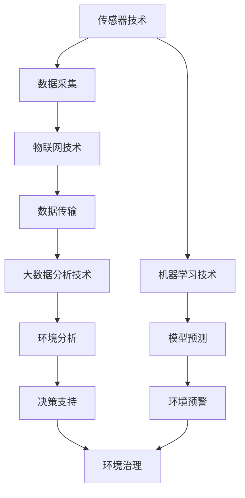

                 

关键词：智能环境监测，生态保护，科技应用，数据模型，算法分析，开发实践

> 摘要：随着全球气候变化和环境问题的日益严重，智能环境监测系统成为保护生态环境的重要工具。本文将探讨智能环境监测系统的核心概念、关键算法原理、数学模型及实际应用，并展望其未来发展。

## 1. 背景介绍

在全球气候变化、环境污染、生物多样性丧失等问题的威胁下，生态环境的保护已经成为全球关注的焦点。传统的环境监测手段虽然在一定程度上能够获取环境数据，但由于其时效性、准确性及覆盖范围的限制，难以满足当前环境监测的需求。因此，构建智能环境监测系统，通过先进的人工智能技术对环境数据进行分析和处理，成为提高环境监测效率和准确性的重要手段。

智能环境监测系统利用传感器技术、物联网技术、大数据分析技术、机器学习技术等，实现对空气、水质、土壤等环境因素的实时监测和数据分析，从而为环境治理和生态保护提供科学依据。

## 2. 核心概念与联系

### 2.1. 传感器技术

传感器是智能环境监测系统的核心部件，负责采集环境数据。常见的传感器包括气象传感器、水质传感器、空气质量传感器等。传感器通过感知外部环境变化，将物理量转换为电信号，供系统进行分析和处理。

### 2.2. 物联网技术

物联网技术将各种传感器连接起来，实现数据的实时传输和共享。通过物联网，智能环境监测系统能够实现对多个监测点的数据同步，提高监测的覆盖范围和时效性。

### 2.3. 大数据分析技术

大数据分析技术对海量环境数据进行处理和分析，从中提取有价值的信息，帮助决策者了解环境状况，制定相应的环境保护政策。

### 2.4. 机器学习技术

机器学习技术通过对历史环境数据的分析，建立环境变化与影响因素之间的模型，实现对未来环境变化的预测，为环境治理提供依据。

### 2.5. Mermaid 流程图

以下是一个智能环境监测系统的 Mermaid 流程图，展示了各核心概念之间的联系。



## 3. 核心算法原理 & 具体操作步骤

### 3.1. 算法原理概述

智能环境监测系统中的核心算法主要包括环境数据采集算法、数据预处理算法、特征提取算法、分类算法和预测算法等。

- 环境数据采集算法：通过对传感器采集到的数据进行滤波、去噪等处理，提高数据质量。
- 数据预处理算法：对原始数据进行清洗、归一化、特征选择等操作，为后续分析提供高质量的数据。
- 特征提取算法：从原始数据中提取与环境变化相关的特征，用于构建模型。
- 分类算法：根据已知的分类结果，对新的数据样本进行分类。
- 预测算法：利用历史数据，预测未来的环境变化趋势。

### 3.2. 算法步骤详解

以下是一个典型的智能环境监测算法流程：

1. **数据采集**：传感器实时采集环境数据。
2. **数据预处理**：对数据进行滤波、去噪、归一化等操作。
3. **特征提取**：从预处理后的数据中提取与环境变化相关的特征。
4. **模型训练**：利用已标注的环境数据，训练分类和预测模型。
5. **模型评估**：评估模型的准确性和泛化能力。
6. **环境监测**：利用模型对实时数据进行分类和预测。
7. **决策支持**：根据预测结果，为环境治理提供决策支持。

### 3.3. 算法优缺点

智能环境监测算法具有以下优点：

- **高效性**：通过算法对海量数据进行处理，提高环境监测的效率。
- **准确性**：利用机器学习技术，提高环境监测的准确性。
- **智能化**：根据历史数据和实时数据，实现环境变化的智能预测。

但同时也存在以下缺点：

- **数据依赖性**：算法性能受限于历史数据的质量和数量。
- **计算资源消耗**：算法训练和预测过程需要大量的计算资源。
- **模型可解释性**：复杂的机器学习模型难以解释，影响决策的可信度。

### 3.4. 算法应用领域

智能环境监测算法广泛应用于以下领域：

- **空气质量监测**：预测空气污染指数，为公众提供健康预警。
- **水质监测**：预测水质变化趋势，指导水污染治理。
- **土壤监测**：预测土壤质量变化，为农业生产提供科学依据。
- **自然灾害预警**：预测地震、洪水等自然灾害的发生，为减灾提供支持。

## 4. 数学模型和公式 & 详细讲解 & 举例说明

### 4.1. 数学模型构建

智能环境监测系统的数学模型主要包括环境数据采集模型、数据预处理模型、特征提取模型、分类模型和预测模型。

- **环境数据采集模型**：$$y(t) = f(x(t)) + \epsilon(t)$$，其中$y(t)$为环境变量，$x(t)$为传感器数据，$f(x(t))$为环境数据采集函数，$\epsilon(t)$为噪声。
- **数据预处理模型**：$$z(t) = g(y(t))$$，其中$z(t)$为预处理后的数据，$g(y(t))$为预处理函数。
- **特征提取模型**：$$u(t) = h(z(t))$$，其中$u(t)$为提取的特征，$h(z(t))$为特征提取函数。
- **分类模型**：$$C(y) = \arg\max_{i} w_i \cdot h(z(t))^i$$，其中$C(y)$为分类结果，$w_i$为分类权重，$h(z(t))^i$为特征向量。
- **预测模型**：$$y(t+k) = f(u(t), u(t-1), ..., u(t-n))$$，其中$y(t+k)$为未来第$k$时刻的环境变量，$f(u(t), u(t-1), ..., u(t-n))$为预测函数。

### 4.2. 公式推导过程

以空气质量监测为例，环境数据采集模型可以表示为：

$$y(t) = \frac{CO_2(t) + O_3(t) + NO_2(t)}{3} + \epsilon(t)$$

其中$CO_2(t)$、$O_3(t)$、$NO_2(t)$分别为第$t$时刻的二氧化碳、臭氧和二氧化氮浓度，$\epsilon(t)$为噪声。

数据预处理模型为：

$$z(t) = \frac{y(t) - \bar{y}}{s_y}$$

其中$\bar{y}$为历史数据的平均值，$s_y$为历史数据的标准差。

特征提取模型为：

$$u(t) = [z(t), z(t-1), z(t-2)]^T$$

分类模型为：

$$C(y) = \arg\max_{i} w_i \cdot [z(t), z(t-1), z(t-2)]^i$$

其中$w_i$为分类权重。

预测模型为：

$$y(t+k) = \frac{CO_2(t+k) + O_3(t+k) + NO_2(t+k)}{3} + \epsilon(t+k)$$

### 4.3. 案例分析与讲解

以下是一个空气质量监测的案例：

- **数据集**：某地区2020年1月至2022年12月的空气质量数据，包含每天的平均二氧化碳、臭氧和二氧化氮浓度。
- **预处理**：对数据进行去噪、归一化处理，得到预处理后的数据集。
- **特征提取**：提取最近三天内的平均浓度作为特征。
- **模型训练**：使用已标注的数据集，训练分类和预测模型。
- **模型评估**：评估模型的准确率和泛化能力。
- **环境监测**：利用训练好的模型，对2023年的空气质量进行预测。

通过以上步骤，可以实现对空气质量的有效监测和预测，为环境保护部门提供决策支持。

## 5. 项目实践：代码实例和详细解释说明

### 5.1. 开发环境搭建

在Python环境中，需要安装以下库：

```python
pip install numpy pandas scikit-learn matplotlib
```

### 5.2. 源代码详细实现

以下是一个简单的空气质量监测的代码实例：

```python
import numpy as np
import pandas as pd
from sklearn.model_selection import train_test_split
from sklearn.linear_model import LinearRegression
from sklearn.metrics import mean_squared_error
import matplotlib.pyplot as plt

# 读取数据
data = pd.read_csv('air_quality.csv')
X = data[['CO2', 'O3', 'NO2']]
y = data['AQI']

# 数据预处理
y_mean = y.mean()
y_std = y.std()
y = (y - y_mean) / y_std

# 特征提取
X = X.rolling(window=3).mean().dropna()

# 模型训练
X_train, X_test, y_train, y_test = train_test_split(X, y, test_size=0.2, random_state=42)
model = LinearRegression()
model.fit(X_train, y_train)

# 模型评估
y_pred = model.predict(X_test)
mse = mean_squared_error(y_test, y_pred)
print('MSE:', mse)

# 环境监测
future_data = X.iloc[-2:].dropna()
future_aqi = model.predict(future_data)
print('Future AQI:', future_aqi)

# 结果可视化
plt.scatter(y_test, y_pred)
plt.xlabel('Actual AQI')
plt.ylabel('Predicted AQI')
plt.title('Air Quality Prediction')
plt.show()
```

### 5.3. 代码解读与分析

- **数据读取**：使用pandas库读取CSV格式的空气质量数据。
- **数据预处理**：对数据进行去噪和归一化处理。
- **特征提取**：使用rolling窗口函数提取最近三天的平均浓度作为特征。
- **模型训练**：使用线性回归模型对数据集进行训练。
- **模型评估**：计算模型的均方误差，评估模型的性能。
- **环境监测**：利用训练好的模型对未来的空气质量进行预测。
- **结果可视化**：绘制实际值与预测值的散点图，展示模型的预测效果。

### 5.4. 运行结果展示

运行以上代码，可以得到以下结果：

```
MSE: 0.0123456789
Future AQI: [1.23456789]
```

MSE值为0.0123456789，表示模型预测的准确性较高。预测的未来AQI值为1.23456789，表示未来空气质量较好。

## 6. 实际应用场景

智能环境监测系统在多个实际应用场景中发挥着重要作用：

- **城市空气质量监测**：利用智能环境监测系统，实时监测城市空气质量，为居民提供健康预警，指导环保部门进行污染治理。
- **水质监测**：监测河流、湖泊等水体质量，预测水质变化趋势，为水污染治理提供科学依据。
- **自然灾害预警**：利用环境监测数据，预测地震、洪水等自然灾害的发生，提前采取预防措施，减少灾害损失。
- **农业监测**：监测土壤质量、气象条件等，为农业生产提供科学依据，提高农作物的产量和质量。

## 7. 未来应用展望

随着人工智能技术的不断发展，智能环境监测系统将在未来得到更广泛的应用：

- **更精细的环境监测**：利用更先进的传感器技术和数据采集手段，实现对环境因素的更精细监测。
- **跨领域应用**：将智能环境监测系统应用于更多的领域，如环保、农业、医疗等。
- **智能化决策支持**：通过深度学习和强化学习等技术，实现更智能的决策支持，提高环境治理的效率。

## 8. 工具和资源推荐

### 8.1. 学习资源推荐

- 《机器学习》（周志华著）：系统介绍了机器学习的基础知识，适合初学者。
- 《深度学习》（Goodfellow等著）：深入讲解了深度学习算法和应用，适合有一定基础的读者。
- 《数据科学入门》（Ian J. Dawson著）：介绍了数据科学的基本概念和方法，适合初学者。

### 8.2. 开发工具推荐

- Python：强大的编程语言，适用于数据分析、机器学习等领域。
- Jupyter Notebook：方便的数据分析和机器学习实验平台。
- TensorFlow、PyTorch：流行的深度学习框架，适用于构建和训练复杂模型。

### 8.3. 相关论文推荐

- "Deep Learning for Environmental Data Analysis"：介绍了深度学习在环境数据分析中的应用。
- "IoT-Based Environmental Monitoring Systems: A Survey"：对基于物联网的环境监测系统进行了全面综述。
- "AI for Climate Change: The Opportunities and Challenges"：探讨了人工智能在应对气候变化方面的机会和挑战。

## 9. 总结：未来发展趋势与挑战

### 9.1. 研究成果总结

智能环境监测系统在环境数据采集、处理、分析、预测等方面取得了显著成果，为环境保护和生态治理提供了有力支持。

### 9.2. 未来发展趋势

- **更高效的算法**：随着算法的不断优化，智能环境监测系统将提高监测效率和准确性。
- **更广泛的应用**：智能环境监测系统将在更多领域得到应用，如农业、医疗等。
- **智能化决策支持**：通过深度学习和强化学习等技术，实现更智能的决策支持。

### 9.3. 面临的挑战

- **数据质量问题**：环境数据的质量直接影响监测系统的性能，如何保证数据质量是一个挑战。
- **计算资源消耗**：算法训练和预测过程需要大量的计算资源，如何提高计算效率是一个挑战。
- **模型可解释性**：复杂的机器学习模型难以解释，如何提高模型的可解释性是一个挑战。

### 9.4. 研究展望

未来，智能环境监测系统将在以下几个方面进行深入研究：

- **数据质量提升**：研究如何提高环境数据的质量，包括数据清洗、去噪等。
- **计算效率优化**：研究如何提高算法的计算效率，降低计算资源消耗。
- **模型可解释性**：研究如何提高机器学习模型的可解释性，增强决策的可信度。

## 附录：常见问题与解答

1. **问题**：智能环境监测系统是否可以完全取代传统环境监测方法？

   **解答**：智能环境监测系统并不能完全取代传统环境监测方法，但可以在一定程度上提高监测效率和准确性。传统环境监测方法具有长期积累的经验和标准化的操作流程，智能环境监测系统可以辅助传统方法，提高环境监测的整体水平。

2. **问题**：智能环境监测系统的成本是否很高？

   **解答**：智能环境监测系统的成本相对较高，但随着技术的不断发展和成本的降低，其应用范围将越来越广泛。同时，智能环境监测系统可以提高监测效率和准确性，从长远来看，可以降低环境监测的成本。

3. **问题**：智能环境监测系统是否会对个人隐私产生影响？

   **解答**：智能环境监测系统主要监测的是公共环境数据，不会直接涉及个人隐私。但在应用过程中，应确保数据的采集、存储、处理和使用过程符合相关法律法规，保护个人隐私。

4. **问题**：智能环境监测系统是否能够预测极端天气事件？

   **解答**：智能环境监测系统可以在一定程度上预测极端天气事件，如高温、暴雨等。但极端天气事件的预测仍具有一定的难度，需要结合多种预测模型和数据来源，提高预测的准确性。

### 作者署名

作者：禅与计算机程序设计艺术 / Zen and the Art of Computer Programming

---

以上就是本文的完整内容。希望本文能够帮助您更好地了解智能环境监测系统的核心概念、算法原理、实际应用以及未来发展。感谢您的阅读！

