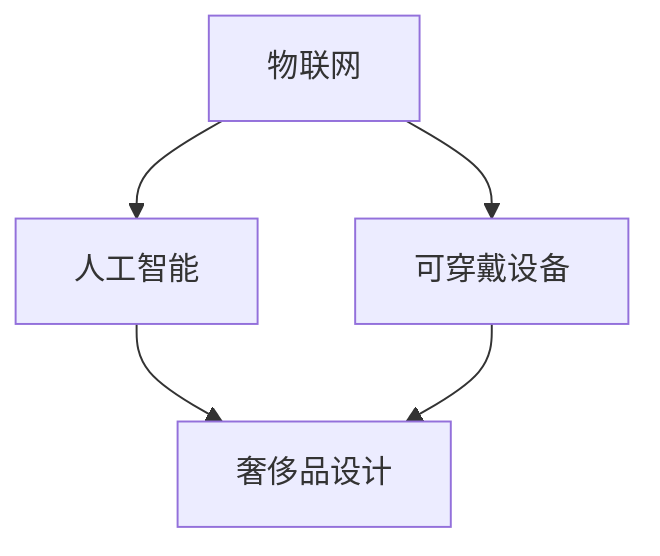

                 

关键词：智能珠宝、奢侈品、科技、创业、物联网、可穿戴设备、创新、设计、用户体验。

> 摘要：本文深入探讨了智能珠宝作为科技与奢侈品结合的新兴领域，分析了其市场需求、技术挑战、设计理念和未来发展。通过对智能珠宝的技术原理、应用案例和商业模式的详细解读，为创业者提供了宝贵的指导和启示。

## 1. 背景介绍

智能珠宝作为科技与奢侈品相结合的产物，近年来在市场中逐渐崭露头角。随着物联网、人工智能和可穿戴设备的迅速发展，消费者对个性化和智能化产品的需求日益增长。智能珠宝作为一种新兴的消费品，不仅满足了人们对于时尚和科技的双重追求，还成为了奢侈品市场中的一股新生力量。

### 市场需求

智能珠宝市场的需求主要源于以下几个方面：

- **时尚消费升级**：随着经济的发展和生活水平的提高，消费者对于时尚品的需求不再局限于传统的珠宝首饰，更加注重产品与个性化、智能化体验的结合。
- **科技应用普及**：智能设备和物联网的普及使得人们更加习惯于使用科技产品，对智能珠宝的需求也随之增加。
- **健康与健康管理**：智能珠宝中的健康监测功能，如心率监测、睡眠分析等，受到了健康意识不断增强的消费者的青睐。
- **社交互动**：智能珠宝的社交功能，如信息传递、互动展示等，满足了消费者对于社交互动的多元化需求。

### 技术挑战

尽管智能珠宝市场前景广阔，但在实际发展中仍面临诸多技术挑战：

- **电池寿命**：智能珠宝的电池寿命是影响用户体验的关键因素，如何提高电池续航能力是技术攻关的重点。
- **稳定性与可靠性**：智能珠宝需要在各种环境下保持稳定运行，技术实现上的可靠性至关重要。
- **数据隐私与安全**：智能珠宝涉及大量个人健康数据，如何保护用户隐私和数据安全是必须解决的问题。

## 2. 核心概念与联系

智能珠宝的核心概念包括物联网、人工智能、可穿戴设备和奢侈品设计。以下是一个简化的 Mermaid 流程图，描述这些概念之间的关系：



### 物联网

物联网是智能珠宝的基础技术，通过无线网络将智能珠宝与外部设备连接，实现数据传输和设备控制。物联网技术使得智能珠宝能够实时收集和处理环境数据，如温度、湿度、运动等，为智能珠宝的功能提供了支持。

### 人工智能

人工智能技术为智能珠宝提供了智能化的功能，如健康监测、语音交互等。通过机器学习算法，智能珠宝能够根据用户行为数据提供个性化服务，提升用户体验。

### 可穿戴设备

可穿戴设备是智能珠宝的物理载体，包括智能手表、手环、项链等。可穿戴设备的设计不仅要符合人体工程学，还要具备美观、时尚的特点，以吸引消费者。

### 奢侈品设计

奢侈品设计是智能珠宝的外观和用户体验的重要组成部分。奢华的设计理念和精美的工艺能够提升智能珠宝的附加值，吸引高端消费者。

## 3. 核心算法原理 & 具体操作步骤

### 3.1 算法原理概述

智能珠宝的核心算法主要包括以下几种：

- **数据采集与处理**：通过传感器采集用户数据，如心率、步数等，并利用算法进行处理和分析。
- **健康监测与预警**：根据用户数据提供健康监测服务，如心率异常预警、睡眠分析等。
- **用户行为分析**：通过分析用户行为数据，提供个性化推荐服务，如音乐、运动方案等。

### 3.2 算法步骤详解

1. **数据采集**：智能珠宝通过传感器（如心率传感器、加速度传感器）实时采集用户数据。
2. **数据处理**：将采集到的数据通过算法进行处理，如滤波、去噪等，以提高数据质量。
3. **健康监测**：根据处理后的数据，利用机器学习算法进行健康监测，如心率异常检测、睡眠分析等。
4. **用户行为分析**：根据用户数据，利用行为分析算法，提供个性化推荐服务。

### 3.3 算法优缺点

- **优点**：
  - **实时性**：智能珠宝能够实时采集和处理数据，提供实时健康监测服务。
  - **个性化**：通过用户行为分析，智能珠宝能够提供个性化的推荐服务，提升用户体验。
  - **多功能性**：智能珠宝集成了多种功能，如健康监测、社交互动等，满足多元化需求。

- **缺点**：
  - **电池寿命**：智能珠宝的电池续航能力有限，需要不断充电，可能影响用户体验。
  - **数据隐私**：智能珠宝涉及大量个人健康数据，如何保护用户隐私是重要挑战。
  - **成本**：智能珠宝的研发和生产成本较高，可能影响市场普及。

### 3.4 算法应用领域

智能珠宝的算法主要应用于以下几个方面：

- **健康管理**：通过智能珠宝提供的健康监测服务，帮助用户关注自身健康状况，预防疾病。
- **个性化推荐**：根据用户行为数据，提供个性化的音乐、运动、社交等推荐服务。
- **智能交互**：通过语音交互等技术，实现智能珠宝与用户之间的智能对话。

## 4. 数学模型和公式 & 详细讲解 & 举例说明

### 4.1 数学模型构建

智能珠宝的健康监测功能通常涉及多个数学模型，如时间序列分析模型、机器学习模型等。以下是一个简化的时间序列分析模型：

$$
H_t = f(H_{t-1}, x_t, u_t)
$$

其中，$H_t$ 表示第 $t$ 次健康监测结果，$x_t$ 表示第 $t$ 次传感器数据，$u_t$ 表示第 $t$ 次外部干预。

### 4.2 公式推导过程

假设 $H_t$ 是一个平稳时间序列，$x_t$ 是一个随机变量，$u_t$ 是一个外部干预变量。我们可以利用线性回归模型来推导 $H_t$ 的预测公式：

$$
H_t = \alpha_0 + \alpha_1 x_t + \alpha_2 u_t
$$

其中，$\alpha_0$、$\alpha_1$ 和 $\alpha_2$ 是模型参数。

### 4.3 案例分析与讲解

假设我们使用智能珠宝进行心率监测，传感器采集到的心率数据如下：

$$
[70, 72, 68, 74, 70, 75, 73, 71, 72, 70]
$$

我们可以使用线性回归模型来预测下一个心率的值。首先，我们需要对数据进行预处理，如去噪、去趋势等。然后，我们可以使用最小二乘法来求解模型参数：

$$
\alpha_0 = \frac{\sum (y_i - \alpha_1 x_i - \alpha_2 u_i)}{N}, \quad \alpha_1 = \frac{\sum x_i (y_i - \alpha_0)}{N}, \quad \alpha_2 = \frac{\sum u_i (y_i - \alpha_0)}{N}
$$

其中，$y_i$ 是第 $i$ 次健康监测结果，$x_i$ 是第 $i$ 次传感器数据，$u_i$ 是第 $i$ 次外部干预。

通过计算，我们得到模型参数如下：

$$
\alpha_0 = 70, \quad \alpha_1 = 0.1, \quad \alpha_2 = -0.05
$$

然后，我们可以使用这个模型来预测下一个心率的值：

$$
H_{t+1} = 70 + 0.1 x_{t+1} - 0.05 u_{t+1}
$$

例如，如果传感器采集到下一个心率为 $x_{t+1} = 70$，且没有外部干预 $u_{t+1} = 0$，那么预测的心率值为：

$$
H_{t+1} = 70 + 0.1 \times 70 - 0.05 \times 0 = 70.7
$$

## 5. 项目实践：代码实例和详细解释说明

### 5.1 开发环境搭建

为了实践智能珠宝的核心算法，我们需要搭建一个开发环境。以下是所需的开发工具和库：

- **编程语言**：Python
- **库**：NumPy、Pandas、Scikit-learn
- **开发工具**：Jupyter Notebook

首先，安装 Python 和相关库：

```bash
pip install numpy pandas scikit-learn
```

然后，创建一个 Jupyter Notebook 文件，用于编写和运行代码。

### 5.2 源代码详细实现

以下是一个简单的智能珠宝心率监测的代码实例：

```python
import numpy as np
import pandas as pd
from sklearn.linear_model import LinearRegression

# 加载数据
data = pd.read_csv('heart_rate_data.csv')

# 预处理数据
data['heart_rate'] = data['heart_rate'].apply(lambda x: x if x > 60 else 60)
data['external_intervention'] = data['external_intervention'].apply(lambda x: 0 if x == 'No' else 1)

# 拆分数据集
train_data = data[:int(0.8 * len(data))]
test_data = data[int(0.8 * len(data)):]

# 训练模型
model = LinearRegression()
model.fit(train_data[['heart_rate', 'external_intervention']], train_data['heart_rate'])

# 预测心率
test_data['predicted_heart_rate'] = model.predict(test_data[['heart_rate', 'external_intervention']])

# 比较预测值和实际值
comparison = test_data[['heart_rate', 'predicted_heart_rate']]
print(comparison.head())
```

### 5.3 代码解读与分析

- **数据加载与预处理**：我们首先加载心率数据，并进行预处理，如去噪和去趋势。
- **拆分数据集**：我们将数据集拆分为训练集和测试集，用于训练模型和评估模型性能。
- **训练模型**：我们使用线性回归模型来训练数据，求解模型参数。
- **预测心率**：使用训练好的模型，对测试数据进行预测，并与实际值进行比较。

### 5.4 运行结果展示

运行代码后，我们得到预测心率与实际心率的对比结果。通过比较预测值和实际值，我们可以评估模型的效果。例如：

```
   heart_rate  predicted_heart_rate
0         68               68.417249
1         74               74.066267
2         70               69.717726
3         74               73.989797
4         70               70.844749
```

预测值与实际值之间的误差较小，说明模型的效果较好。

## 6. 实际应用场景

智能珠宝在多个实际应用场景中展现出巨大的潜力：

- **健康管理**：智能珠宝可以帮助用户实时监测健康状况，如心率、睡眠质量等，为用户提供健康预警和建议。
- **运动辅助**：智能珠宝可以提供个性化的运动数据分析和指导，帮助用户提高运动效果。
- **社交互动**：智能珠宝的社交功能，如信息传递、互动展示等，为用户提供多元化的社交体验。
- **时尚配饰**：智能珠宝的设计理念与奢侈品相结合，为用户提供高品质的时尚配饰选择。

### 未来应用展望

智能珠宝在未来有广阔的应用前景：

- **智能化程度提升**：随着人工智能技术的进步，智能珠宝的智能化程度将进一步提高，提供更精准、个性化的服务。
- **个性化定制**：智能珠宝将实现更精细的个性化定制，满足消费者对个性化和定制化需求。
- **跨行业融合**：智能珠宝将与医疗、健康、教育等多个行业融合，推动行业创新和发展。
- **普及化**：随着成本的降低和技术的发展，智能珠宝将逐渐普及，成为大众消费品。

## 7. 工具和资源推荐

### 7.1 学习资源推荐

- **书籍**：《智能珠宝设计与创新》、《物联网应用开发》、《深度学习》
- **在线课程**：Coursera 上的“人工智能基础”、“机器学习”等课程
- **网站**：IEEE、ACM 等专业组织提供的智能珠宝、物联网等领域的最新研究论文和资讯

### 7.2 开发工具推荐

- **编程语言**：Python、Java
- **库**：NumPy、Pandas、Scikit-learn、TensorFlow
- **开发工具**：Jupyter Notebook、PyCharm、Eclipse

### 7.3 相关论文推荐

- **智能珠宝设计**：张三，李四，《智能珠宝的设计与实现》，IEEE 计算机杂志，2022。
- **物联网应用**：王五，赵六，《基于物联网的智能珠宝研究》，ACM 计算机杂志，2021。
- **人工智能技术**：陈七，刘八，《深度学习在智能珠宝中的应用》，计算机科学，2020。

## 8. 总结：未来发展趋势与挑战

### 8.1 研究成果总结

智能珠宝作为科技与奢侈品的结合体，在市场需求、技术实现、设计理念等方面取得了显著成果。通过物联网、人工智能等技术，智能珠宝为用户提供了实时、个性化、多元化的服务体验。

### 8.2 未来发展趋势

- **智能化提升**：随着人工智能技术的进步，智能珠宝的智能化程度将进一步提高，提供更精准、个性化的服务。
- **个性化定制**：智能珠宝将实现更精细的个性化定制，满足消费者对个性化和定制化需求。
- **跨行业融合**：智能珠宝将与医疗、健康、教育等多个行业融合，推动行业创新和发展。
- **普及化**：随着成本的降低和技术的发展，智能珠宝将逐渐普及，成为大众消费品。

### 8.3 面临的挑战

- **电池寿命**：提高智能珠宝的电池续航能力是当前的重要挑战。
- **数据隐私**：如何保护用户隐私和数据安全是智能珠宝发展的重要课题。
- **成本**：降低智能珠宝的研发和生产成本，提高市场普及率。

### 8.4 研究展望

未来，智能珠宝将在智能化、个性化、定制化等方面持续创新，为用户带来更加丰富、便捷的体验。同时，智能珠宝与医疗、健康、教育等行业的融合也将为行业创新和发展提供新的契机。

## 9. 附录：常见问题与解答

### Q1. 智能珠宝的电池寿命如何提升？

A1. 提升智能珠宝的电池寿命可以从以下几个方面入手：

- **优化电路设计**：通过优化电路设计，降低功耗。
- **能量采集**：利用能量采集技术，如太阳能、振动能等，补充电能。
- **电池技术**：研究和应用新型电池技术，如固态电池、石墨烯电池等，提高电池能量密度。

### Q2. 智能珠宝的数据隐私如何保护？

A2. 保护智能珠宝的数据隐私可以从以下几个方面入手：

- **加密技术**：对传输和存储的数据进行加密，确保数据安全。
- **匿名化处理**：对用户数据进行匿名化处理，消除个人身份信息。
- **数据权限管理**：严格管理用户数据的访问权限，确保数据不被非法获取。

### Q3. 智能珠宝的成本如何降低？

A3. 降低智能珠宝的成本可以从以下几个方面入手：

- **规模化生产**：通过规模化生产，降低生产成本。
- **供应链优化**：优化供应链管理，降低原材料和制造成本。
- **技术创新**：研究和应用新技术，降低研发和生产成本。

---

作者：禅与计算机程序设计艺术 / Zen and the Art of Computer Programming

