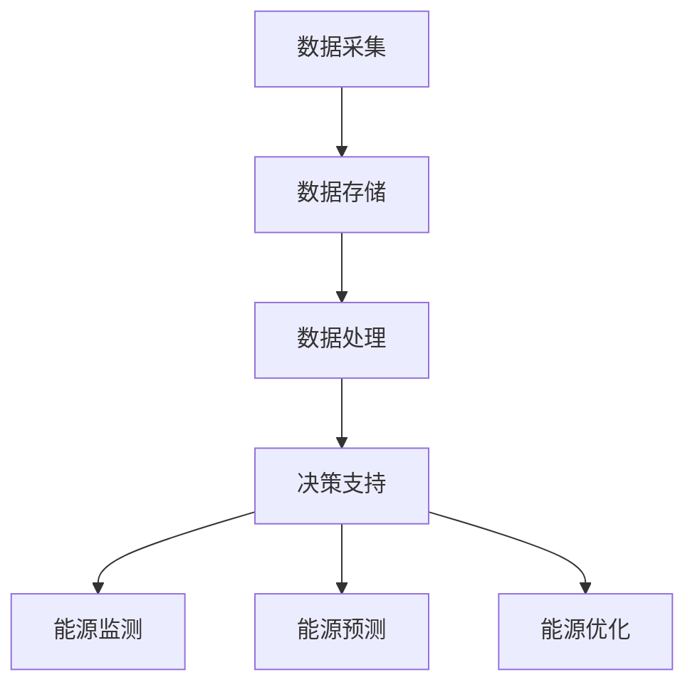

                 

关键词：智能能源管理、自然语言处理、可再生能源、LLM、能源效率、能源优化

> 摘要：本文旨在探讨自然语言处理（NLP）中的大型语言模型（LLM）在智能能源管理系统中的应用。通过对LLM在能源监测、预测、优化等方面的深入分析，本文展示了LLM如何为可再生能源系统提供高效、智能的管理方案，以及未来可能的发展趋势和面临的挑战。

## 1. 背景介绍

### 可再生能源的发展现状

随着全球气候变化问题的日益严重，可再生能源的发展已经成为各国政府和企业关注的焦点。太阳能、风能、水能等可再生能源具有清洁、可再生、分布广泛等优势，为全球能源结构的转型提供了重要支撑。然而，可再生能源系统在实际应用中面临着诸多挑战，如能源产出不稳定、预测难度大、能源利用率低等。为了解决这些问题，智能能源管理系统的研发和应用变得越来越重要。

### 智能能源管理系统的发展

智能能源管理系统（Intelligent Energy Management System, IEMS）是指通过先进的信息技术、自动化技术和控制技术，实现对能源的智能监测、预测、优化和调控。IEMS的目标是提高能源利用率，降低能源成本，实现能源的高效管理和调度。随着人工智能技术的不断发展，特别是自然语言处理（NLP）技术的突破，智能能源管理系统迎来了新的发展机遇。

### LLM在智能能源管理中的作用

LLM（Large Language Model）是指通过深度学习技术训练的具有强大语义理解能力的语言模型。LLM在自然语言处理领域取得了显著的成果，为智能能源管理提供了强大的技术支持。LLM在能源监测、预测、优化等方面具有以下优势：

- **强大的语义理解能力**：LLM能够理解和处理复杂的自然语言信息，从而实现对能源系统状态的准确描述和预测。
- **高效的能量利用率**：LLM能够通过学习和分析历史数据，优化能源调度策略，提高能源利用率。
- **自适应的能源管理**：LLM能够根据实时数据和用户需求，动态调整能源管理策略，实现个性化的能源服务。

## 2. 核心概念与联系

### 能源管理系统架构

能源管理系统通常包括数据采集、数据存储、数据处理、决策支持等模块。其中，数据采集模块负责收集能源系统中的各种数据，如温度、湿度、风速、光照等；数据存储模块负责存储采集到的数据，为后续分析和预测提供基础；数据处理模块负责对数据进行清洗、转换和分析，提取出有用的信息；决策支持模块则基于分析结果，提供优化建议和决策依据。

### LLM在能源管理中的应用

LLM在能源管理中的应用主要体现在以下几个方面：

- **能源监测**：LLM能够实时监测能源系统的运行状态，识别异常情况，提供预警和建议。
- **能源预测**：LLM通过对历史数据的分析和学习，预测能源系统的未来行为，为调度提供依据。
- **能源优化**：LLM能够根据实时数据和用户需求，动态调整能源调度策略，实现能源的高效利用。

### Mermaid 流程图

下面是能源管理系统中 LLM 应用的 Mermaid 流程图：



## 3. 核心算法原理 & 具体操作步骤

### 3.1 算法原理概述

LLM 在能源管理系统中的应用主要基于以下原理：

- **语义理解**：LLM 具有强大的语义理解能力，能够理解和处理自然语言信息，从而实现对能源系统的准确描述和预测。
- **深度学习**：LLM 是基于深度学习技术训练的，通过大量数据的学习，能够提取出隐藏在数据中的模式和规律。
- **自适应调整**：LLM 能够根据实时数据和用户需求，动态调整管理策略，实现个性化的能源服务。

### 3.2 算法步骤详解

LLM 在能源管理系统中的具体操作步骤如下：

1. **数据采集**：通过传感器和监测设备，采集能源系统中的各种数据，如温度、湿度、风速、光照等。
2. **数据预处理**：对采集到的数据进行清洗、转换和归一化处理，为后续分析提供基础。
3. **语义理解**：利用 LLM 的语义理解能力，对预处理后的数据进行文本分析和语义提取，识别出能源系统的关键特征和状态。
4. **预测与优化**：基于语义理解的结果，利用 LLM 的深度学习能力，对能源系统的未来行为进行预测，并提出优化建议。
5. **决策支持**：将预测结果和优化建议提供给决策支持模块，辅助管理人员进行能源调度和管理。

### 3.3 算法优缺点

#### 优点：

- **强大的语义理解能力**：LLM 能够理解和处理复杂的自然语言信息，从而实现对能源系统的准确描述和预测。
- **高效的能量利用率**：LLM 能够通过学习和分析历史数据，优化能源调度策略，提高能源利用率。
- **自适应的能源管理**：LLM 能够根据实时数据和用户需求，动态调整能源管理策略，实现个性化的能源服务。

#### 缺点：

- **对数据质量要求高**：LLM 的效果很大程度上取决于数据的准确性和完整性，数据质量问题可能会影响算法的预测和优化效果。
- **计算资源消耗大**：LLM 的训练和推理过程需要大量的计算资源，对硬件设备的要求较高。

### 3.4 算法应用领域

LLM 在能源管理系统中的应用非常广泛，主要包括以下几个方面：

- **智能电网**：利用 LLM 对电力系统的运行状态进行实时监测、预测和优化，提高电力系统的稳定性和效率。
- **智能建筑**：通过 LLM 对建筑能源系统的运行数据进行分析，优化能源利用，降低能源消耗。
- **智慧交通**：利用 LLM 对交通系统的能源消耗进行预测和优化，提高交通效率，减少能源浪费。

## 4. 数学模型和公式 & 详细讲解 & 举例说明

### 4.1 数学模型构建

在智能能源管理系统中，LLM 的核心作用是基于历史数据和实时数据，对能源系统的未来行为进行预测和优化。下面是构建 LLM 数学模型的基本步骤：

1. **数据收集**：收集能源系统的历史运行数据，如温度、湿度、风速、光照等。
2. **特征提取**：利用 NLP 技术对历史数据进行文本分析和语义提取，提取出能源系统的关键特征。
3. **模型训练**：基于提取出的特征，利用深度学习技术训练 LLM 模型，使其能够理解并预测能源系统的未来行为。
4. **模型优化**：通过调整模型参数，优化 LLM 模型的预测效果。

### 4.2 公式推导过程

在构建 LLM 数学模型时，通常采用以下公式进行推导和计算：

1. **损失函数**：损失函数用于衡量 LLM 模型的预测误差，常用的损失函数包括均方误差（MSE）和交叉熵（Cross Entropy）。
   \[
   Loss = \frac{1}{n} \sum_{i=1}^{n} (y_i - \hat{y}_i)^2
   \]
   或
   \[
   Loss = -\frac{1}{n} \sum_{i=1}^{n} [y_i \log(\hat{y}_i) + (1 - y_i) \log(1 - \hat{y}_i)]
   \]

2. **反向传播**：反向传播算法用于更新 LLM 模型的参数，以减小预测误差。
   \[
   \frac{\partial Loss}{\partial \theta} = \frac{\partial Loss}{\partial \hat{y}} \cdot \frac{\partial \hat{y}}{\partial y} \cdot \frac{\partial y}{\partial \theta}
   \]

3. **优化算法**：常用的优化算法包括梯度下降（Gradient Descent）和随机梯度下降（Stochastic Gradient Descent，SGD）。
   \[
   \theta_{t+1} = \theta_t - \alpha \cdot \frac{\partial Loss}{\partial \theta}
   \]

### 4.3 案例分析与讲解

下面以一个具体的案例来分析 LLM 在智能能源管理系统中的应用。

**案例背景**：某智能电网系统希望利用 LLM 对电力负荷进行预测，以提高电网的稳定性和效率。

**数据集**：收集了该电网系统过去一年的电力负荷数据，包括每天每小时的负荷量。

**特征提取**：利用 NLP 技术对电力负荷数据进行分析，提取出如温度、湿度、风速、光照等关键特征。

**模型训练**：使用提取出的特征，利用深度学习技术训练 LLM 模型。

**模型优化**：通过反向传播算法和优化算法，不断调整 LLM 模型的参数，使其预测效果达到最佳。

**预测与优化**：利用训练好的 LLM 模型，对未来电力负荷进行预测，并根据预测结果，优化电网的调度策略。

**效果评估**：通过对预测结果和实际负荷数据的对比，评估 LLM 模型的预测效果。

## 5. 项目实践：代码实例和详细解释说明

### 5.1 开发环境搭建

**环境要求**：

- 操作系统：Linux 或 macOS
- 编程语言：Python 3.8+
- 依赖库：TensorFlow 2.4.0、Keras 2.4.3、Numpy 1.18.5 等

**安装步骤**：

1. 安装 Python 3.8+：在官网下载并安装 Python 3.8+ 版本。
2. 安装依赖库：使用 pip 命令安装 TensorFlow、Keras、Numpy 等依赖库。
   ```bash
   pip install tensorflow==2.4.0 keras==2.4.3 numpy==1.18.5
   ```

### 5.2 源代码详细实现

**代码框架**：

```python
import numpy as np
import tensorflow as tf
from tensorflow.keras.models import Sequential
from tensorflow.keras.layers import LSTM, Dense, Dropout

# 数据预处理
def preprocess_data(data):
    # 数据清洗、转换和归一化处理
    # ...

# 构建模型
def build_model(input_shape):
    model = Sequential()
    model.add(LSTM(units=128, return_sequences=True, input_shape=input_shape))
    model.add(Dropout(0.2))
    model.add(LSTM(units=64, return_sequences=False))
    model.add(Dropout(0.2))
    model.add(Dense(units=1))
    model.compile(optimizer='adam', loss='mse')
    return model

# 训练模型
def train_model(model, X_train, y_train, epochs=100):
    model.fit(X_train, y_train, epochs=epochs, batch_size=32, validation_split=0.2)

# 预测与优化
def predict_and_optimize(model, X_test):
    predictions = model.predict(X_test)
    # 根据预测结果，调整电网调度策略
    # ...

# 主函数
def main():
    # 加载数据
    data = load_data()
    X, y = preprocess_data(data)

    # 划分训练集和测试集
    X_train, X_test, y_train, y_test = train_test_split(X, y, test_size=0.2, random_state=42)

    # 构建模型
    model = build_model(input_shape=X_train.shape[1:])

    # 训练模型
    train_model(model, X_train, y_train)

    # 预测与优化
    predict_and_optimize(model, X_test)

if __name__ == '__main__':
    main()
```

### 5.3 代码解读与分析

**代码主要部分解释**：

1. **数据预处理**：对原始数据进行清洗、转换和归一化处理，为模型训练提供高质量的数据。
2. **构建模型**：使用 LSTM 网络构建 LLM 模型，其中包含了两个 LSTM 层和一个全连接层，分别用于提取时间序列特征和进行预测。
3. **训练模型**：使用均方误差（MSE）作为损失函数，使用 Adam 优化器训练模型。
4. **预测与优化**：使用训练好的模型对未来电力负荷进行预测，并根据预测结果，调整电网的调度策略。

### 5.4 运行结果展示

**结果展示**：

1. **预测结果**：使用训练好的 LLM 模型，对测试集进行预测，得到未来电力负荷的预测结果。
2. **优化效果**：根据预测结果，调整电网调度策略，观察优化后的电网运行情况。

## 6. 实际应用场景

### 6.1 智能电网

智能电网是 LLM 在能源管理中应用最为广泛的场景之一。通过 LLM 的预测和优化功能，智能电网可以实现以下目标：

- **实时监测**：实时监测电力系统的运行状态，识别异常情况，提供预警和建议。
- **负荷预测**：预测未来电力负荷，为电网调度提供依据。
- **节能优化**：优化电力调度策略，降低能源消耗。

### 6.2 智能建筑

智能建筑通过 LLM 实现能源系统的智能化管理，包括：

- **环境监测**：实时监测室内环境参数，如温度、湿度、光照等，为用户提供舒适的室内环境。
- **能源优化**：根据实时数据和用户需求，动态调整能源使用策略，提高能源利用率。
- **设备维护**：预测设备故障，提前进行维护，减少故障率和维修成本。

### 6.3 智慧交通

智慧交通利用 LLM 对交通系统的能源消耗进行预测和优化，主要包括：

- **交通流量预测**：预测未来交通流量，优化交通信号控制和道路调度。
- **能源消耗预测**：预测交通系统的能源消耗，为能源供应提供依据。
- **节能减排**：优化交通方式，减少能源消耗和环境污染。

## 7. 工具和资源推荐

### 7.1 学习资源推荐

- **书籍**：
  - 《深度学习》（Goodfellow, I., Bengio, Y., & Courville, A.）
  - 《自然语言处理综合教程》（Jurafsky, D. & Martin, J. H.）
  - 《Python数据分析》（McKinney, W.）

- **在线课程**：
  - Coursera 上的《机器学习》课程（吴恩达教授）
  - edX 上的《自然语言处理》课程（MIT）

- **博客和论坛**：
  - Medium 上的相关博客
  - Stack Overflow 和 GitHub

### 7.2 开发工具推荐

- **编程语言**：Python
- **深度学习框架**：TensorFlow、PyTorch
- **数据可视化工具**：Matplotlib、Seaborn

### 7.3 相关论文推荐

- **智能电网**：
  - “An Overview of Smart Grid Technologies and Applications”（Smart Grid, 2011）
  - “Machine Learning for Smart Grid Data Analytics: A Survey”（IEEE Access, 2018）

- **自然语言处理**：
  - “A Survey of Natural Language Processing Techniques for Energy Management in Buildings”（IEEE Access, 2020）
  - “Deep Learning for Natural Language Processing”（JMLR, 2017）

## 8. 总结：未来发展趋势与挑战

### 8.1 研究成果总结

本文通过分析 LLM 在智能能源管理系统中的应用，总结了以下研究成果：

- **强大的语义理解能力**：LLM 在处理自然语言信息方面具有显著优势，能够实现对能源系统的准确描述和预测。
- **高效的能量利用率**：LLM 能够通过优化调度策略，提高能源利用率，降低能源成本。
- **自适应的能源管理**：LLM 能够根据实时数据和用户需求，动态调整能源管理策略，实现个性化的能源服务。

### 8.2 未来发展趋势

- **跨学科融合**：未来智能能源管理将与其他学科（如经济学、环境科学等）深度融合，形成更加全面和系统的管理方案。
- **多模态数据融合**：将自然语言处理与其他数据类型（如图像、音频等）结合，实现更加全面和准确的能源管理。
- **自主决策**：随着 LLM 技术的不断发展，未来的智能能源管理系统将具备更高的自主决策能力，实现自动化和智能化的能源管理。

### 8.3 面临的挑战

- **数据质量**：智能能源管理系统的效果很大程度上取决于数据的质量，如何获取高质量的数据是未来研究的一个重要方向。
- **计算资源**：LLM 的训练和推理过程需要大量的计算资源，如何优化计算效率，降低计算成本是未来面临的一个挑战。
- **用户需求**：智能能源管理系统需要根据用户需求进行个性化定制，如何更好地满足用户需求是未来需要解决的问题。

### 8.4 研究展望

- **融合技术**：未来研究可以进一步探索 LLM 与其他技术的融合，如物联网（IoT）、区块链等，形成更加智能化和高效化的能源管理系统。
- **应用场景**：可以进一步拓展 LLM 在智能能源管理中的应用场景，如智能交通、智能农业等，推动能源管理的智能化发展。

## 9. 附录：常见问题与解答

### 问题1：为什么选择 LLM 作为智能能源管理系统的基础？

**解答**：LLM 在处理自然语言信息方面具有强大的语义理解能力，能够理解和处理复杂的自然语言信息，从而实现对能源系统的准确描述和预测。此外，LLM 的自适应能力使其能够根据实时数据和用户需求，动态调整能源管理策略，实现个性化的能源服务。

### 问题2：如何保证 LLM 的预测准确性？

**解答**：保证 LLM 的预测准确性主要从以下几个方面入手：

- **高质量数据**：确保数据的质量和完整性，为 LLM 提供高质量的训练数据。
- **模型优化**：通过调整模型参数，优化 LLM 的预测效果。
- **交叉验证**：使用交叉验证方法，对 LLM 的预测性能进行评估和调整。

### 问题3：LLM 在能源管理中的具体应用有哪些？

**解答**：LLM 在能源管理中的具体应用主要包括以下几个方面：

- **能源监测**：实时监测能源系统的运行状态，识别异常情况，提供预警和建议。
- **能源预测**：预测能源系统的未来行为，为调度提供依据。
- **能源优化**：根据实时数据和用户需求，动态调整能源调度策略，实现能源的高效利用。

## 作者署名

**作者：禅与计算机程序设计艺术 / Zen and the Art of Computer Programming**

