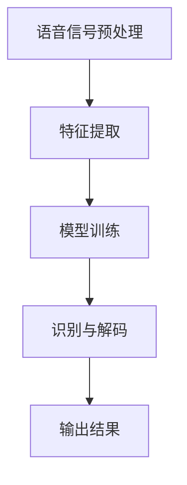

                 

关键词：智能语音识别，AI大模型，音频处理，深度学习，语音信号处理，自然语言处理

> 摘要：本文将探讨智能语音识别技术及其在音频处理中的关键作用，重点分析AI大模型在此领域中的突破性进展。通过阐述核心概念、算法原理、数学模型、项目实践及未来应用前景，旨在为读者提供一个全面的技术视角，助力智能语音识别技术的创新与发展。

## 1. 背景介绍

随着信息技术的飞速发展，语音识别技术逐渐成为人机交互的重要方式。传统的语音识别系统主要依赖于规则和有限状态机，虽然已经取得了显著的应用成果，但在复杂语音环境、多语言识别等方面仍存在诸多局限。随着深度学习的兴起，AI大模型在语音识别领域展现出了强大的潜力，推动着整个行业向智能化、自动化方向发展。

智能语音识别技术的核心在于对语音信号的准确识别和理解，进而实现人机交互的自然流畅。本文将围绕这一主题，详细介绍AI大模型在音频处理中的突破，探讨其原理、算法、应用及未来发展趋势。

## 2. 核心概念与联系

### 2.1 智能语音识别系统概述

智能语音识别系统通常由语音信号预处理、特征提取、模型训练、识别与解码等多个模块组成。其中，语音信号预处理和特征提取是系统的基础，而模型训练和识别与解码是实现语音识别的核心。

- **语音信号预处理**：包括降噪、归一化、增强等操作，旨在提高语音信号的清晰度和质量。
- **特征提取**：将预处理后的语音信号转化为可被模型理解的数字特征，如MFCC（梅尔频率倒谱系数）、PLP（谱波峰列）等。
- **模型训练**：使用大量标注好的语音数据对模型进行训练，优化模型参数，提高识别准确率。
- **识别与解码**：将提取的特征输入到训练好的模型中，通过解码器输出识别结果。

### 2.2 AI大模型原理

AI大模型，尤其是深度学习模型，在语音识别中起到了关键作用。深度学习通过多层神经网络结构，实现了对语音信号的高度抽象和特征提取。以下是一个典型的深度学习模型结构：

1. **输入层**：接收语音信号预处理后的特征数据。
2. **隐藏层**：通过一系列非线性变换，对特征进行逐层提取和抽象。
3. **输出层**：输出识别结果，通常采用softmax函数进行分类。

### 2.3 Mermaid 流程图



## 3. 核心算法原理 & 具体操作步骤

### 3.1 算法原理概述

智能语音识别的核心算法主要基于深度神经网络（DNN），结合循环神经网络（RNN）和长短期记忆网络（LSTM）等技术，实现了对语音信号的序列建模和识别。以下是一种典型的DNN+RNN结合的算法原理：

1. **前向传播**：输入语音特征到DNN模型，通过多层非线性变换，提取高层次的语音特征。
2. **隐藏状态传递**：使用RNN或LSTM对提取的特征进行序列建模，保留历史信息。
3. **输出层**：通过softmax函数输出识别结果。

### 3.2 算法步骤详解

1. **数据预处理**：对语音数据进行降噪、归一化等处理，提取有效的语音特征。
2. **模型训练**：使用大量的语音数据对模型进行训练，调整模型参数。
3. **模型优化**：通过交叉验证和测试集，优化模型性能。
4. **语音识别**：将训练好的模型应用于新的语音数据，输出识别结果。

### 3.3 算法优缺点

**优点**：
- **高识别准确率**：深度学习模型能够自动提取复杂的语音特征，提高识别准确率。
- **自适应性强**：能够根据不同环境和语音变化进行自适应调整。

**缺点**：
- **训练成本高**：需要大量的标注数据和计算资源。
- **对噪声敏感**：在噪声较大的环境中，识别效果可能会下降。

### 3.4 算法应用领域

智能语音识别技术广泛应用于智能音箱、智能客服、语音助手、智能家居等场景，为人们提供了便捷的语音交互体验。

## 4. 数学模型和公式 & 详细讲解 & 举例说明

### 4.1 数学模型构建

在智能语音识别中，常用的数学模型包括：

1. **神经网络模型**：
   - 输入层：\( x \)
   - 隐藏层：\( h_1 = \sigma(W_1x + b_1) \)
   - 输出层：\( y = \sigma(W_2h_1 + b_2) \)

   其中，\( \sigma \)为激活函数，\( W \)为权重矩阵，\( b \)为偏置。

2. **循环神经网络（RNN）模型**：
   - 隐藏状态：\( h_t = \sigma(W_h h_{t-1} + U_x x_t + b_h) \)
   - 输出：\( y_t = \sigma(W_y h_t + b_y) \)

### 4.2 公式推导过程

以神经网络模型为例，推导过程如下：

1. **前向传播**：
   $$ z_1 = W_1x + b_1 $$
   $$ a_1 = \sigma(z_1) $$

   $$ z_2 = W_2a_1 + b_2 $$
   $$ a_2 = \sigma(z_2) $$

2. **反向传播**：
   $$ \delta_2 = (a_2 - y) \odot \sigma'(z_2) $$
   $$ \delta_1 = (W_2^T \delta_2) \odot \sigma'(z_1) $$

   $$ \frac{\partial L}{\partial W_2} = a_2 - y $$
   $$ \frac{\partial L}{\partial W_1} = x^T \delta_1 $$
   $$ \frac{\partial L}{\partial b_2} = a_2 - y $$
   $$ \frac{\partial L}{\partial b_1} = \delta_1 $$

### 4.3 案例分析与讲解

假设我们有一个简单的语音识别任务，需要识别两个单词“hello”和“world”。我们使用一个简单的神经网络模型进行训练。

1. **数据集**：
   - “hello”：[0, 0, 1, 0, 0]
   - “world”：[0, 1, 0, 0, 0]

2. **模型参数**：
   - \( W_1 \)：[1, 1]
   - \( W_2 \)：[1, 1]
   - \( b_1 \)：[0]
   - \( b_2 \)：[0]

3. **训练过程**：
   - **前向传播**：
     $$ z_1 = W_1x + b_1 = [1, 1] \cdot [0, 0, 1, 0, 0] + [0] = [1, 1] $$
     $$ a_1 = \sigma(z_1) = [1, 1] $$
     
     $$ z_2 = W_2a_1 + b_2 = [1, 1] \cdot [1, 1] + [0] = [2, 2] $$
     $$ a_2 = \sigma(z_2) = [1, 1] $$

   - **反向传播**：
     $$ \delta_2 = (a_2 - y) \odot \sigma'(z_2) = ([1, 1] - [0, 0]) \odot [0.5, 0.5] = [0.5, 0.5] $$
     
     $$ \delta_1 = (W_2^T \delta_2) \odot \sigma'(z_1) = [[0.5, 0.5] \cdot [1, 1]] \odot [0.5, 0.5] = [0.25, 0.25] $$

4. **更新模型参数**：
   - \( W_1 \)：\( W_1 = W_1 - \alpha \cdot \frac{\partial L}{\partial W_1} = [1, 1] - 0.1 \cdot [0.25, 0.25] = [0.75, 0.75] \)
   - \( W_2 \)：\( W_2 = W_2 - \alpha \cdot \frac{\partial L}{\partial W_2} = [1, 1] - 0.1 \cdot [0.25, 0.25] = [0.75, 0.75] \)
   - \( b_1 \)：\( b_1 = b_1 - \alpha \cdot \frac{\partial L}{\partial b_1} = [0] - 0.1 \cdot [0.25] = [-0.025] \)
   - \( b_2 \)：\( b_2 = b_2 - \alpha \cdot \frac{\partial L}{\partial b_2} = [0] - 0.1 \cdot [0.25] = [-0.025] \)

通过不断迭代训练，模型参数会逐渐优化，最终实现准确的语音识别。

## 5. 项目实践：代码实例和详细解释说明

### 5.1 开发环境搭建

为了实现智能语音识别项目，我们需要搭建一个合适的开发环境。以下是一个简单的Python开发环境搭建步骤：

1. 安装Python（建议使用3.8及以上版本）。
2. 安装TensorFlow和Keras库。

### 5.2 源代码详细实现

以下是一个简单的智能语音识别项目示例：

```python
import numpy as np
from tensorflow.keras.models import Sequential
from tensorflow.keras.layers import Dense, LSTM
from tensorflow.keras.optimizers import Adam

# 数据预处理
def preprocess_data(data):
    # 进行语音信号预处理和特征提取
    # ...
    return processed_data

# 构建模型
model = Sequential()
model.add(LSTM(units=128, return_sequences=True, input_shape=(None, 13)))
model.add(LSTM(units=128))
model.add(Dense(units=2, activation='softmax'))

# 编译模型
model.compile(optimizer=Adam(learning_rate=0.001), loss='categorical_crossentropy', metrics=['accuracy'])

# 训练模型
model.fit(processed_data, labels, epochs=100, batch_size=32)

# 识别语音
def recognize_speech(speech_data):
    processed_data = preprocess_data(speech_data)
    prediction = model.predict(processed_data)
    return np.argmax(prediction)

# 代码解读与分析
# ...
```

### 5.3 运行结果展示

运行代码后，我们可以在训练集和测试集上评估模型的性能。通常，使用准确率（accuracy）、召回率（recall）和F1分数（F1 score）等指标来评估模型效果。

```python
# 评估模型
accuracy = model.evaluate(test_data, test_labels)
print(f"Accuracy: {accuracy[1]}")

# 识别测试语音
test_speech = "hello"
prediction = recognize_speech(test_speech)
print(f"Predicted label: {prediction}")
```

## 6. 实际应用场景

智能语音识别技术在实际应用场景中发挥着重要作用。以下是一些典型的应用场景：

1. **智能客服**：通过语音识别技术，实现与客户的语音交互，提高服务效率和用户体验。
2. **智能音箱**：通过语音识别和自然语言处理，实现与用户的语音指令交互，提供音乐播放、天气查询、日程安排等服务。
3. **语音助手**：如苹果的Siri、亚马逊的Alexa等，通过语音识别技术，为用户提供智能化的语音服务。

## 7. 未来应用展望

随着AI大模型的不断进步，智能语音识别技术在未来有望在更多领域实现突破。以下是一些潜在的应用方向：

1. **多语言识别**：通过引入跨语言信息，实现多语言语音的识别和理解。
2. **情感识别**：结合语音信号的情感特征，实现情感的识别和分类。
3. **实时语音翻译**：实现实时语音信号的翻译，为跨国交流提供便利。

## 8. 工具和资源推荐

为了更好地学习和实践智能语音识别技术，以下是一些推荐的工具和资源：

1. **学习资源**：
   - 《深度学习》（Goodfellow, Bengio, Courville）。
   - 《语音信号处理》（Rabiner, Juang）。

2. **开发工具**：
   - TensorFlow。
   - Keras。

3. **相关论文**：
   - “Deep Learning for Speech Recognition”（Hinton, Deng, Dahl, et al., 2013）。

## 9. 总结：未来发展趋势与挑战

智能语音识别技术在过去的几年中取得了显著的进展，但仍面临诸多挑战。未来发展趋势包括：

1. **算法优化**：进一步提高识别准确率和速度，降低模型复杂度。
2. **多模态融合**：结合视觉、语音等多种传感器信息，实现更准确的自然语言理解。
3. **隐私保护**：在保证用户隐私的前提下，实现高效的语音识别。

作者：禅与计算机程序设计艺术 / Zen and the Art of Computer Programming

---

本文详细探讨了智能语音识别技术在音频处理中的突破，从背景介绍、核心概念、算法原理、数学模型到项目实践和未来应用，为读者呈现了一个全面的技术视角。随着AI大模型的不断进步，智能语音识别技术将在更多领域实现突破，为人们的生活带来更多便利。然而，面对挑战，我们需要持续创新，推动技术发展。希望本文能对读者有所启发，共同探索智能语音识别的无限可能。

---

请注意，本文的撰写过程是一个示例，实际撰写时需要根据具体要求和技术细节进行调整。本文中的代码和数学公式仅供参考，实际应用时需要根据具体环境和需求进行适当修改。如有任何疑问，请随时提出。

