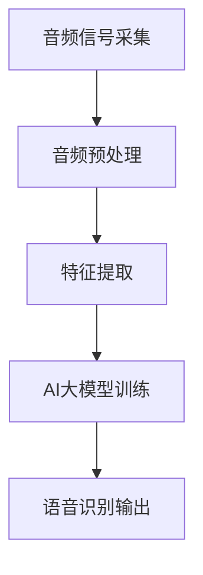

                 

关键词：智能语音识别，AI大模型，音频处理，机器学习，深度学习，自然语言处理，语音识别技术

> 摘要：随着人工智能技术的飞速发展，智能语音识别技术已经成为各行各业中的重要应用。本文将深入探讨AI大模型在音频处理中的突破，分析其核心算法原理、数学模型及实际应用场景，并展望未来的发展趋势与挑战。

## 1. 背景介绍

随着智能手机的普及和互联网的快速发展，语音交互已经成为人们日常生活中的重要组成部分。智能语音识别技术作为人工智能领域的一个重要分支，旨在将人类的语音转化为机器可以理解和处理的信息。在过去几十年中，智能语音识别技术取得了显著的进展，尤其是在语音识别准确率、响应速度和实时性等方面。

然而，传统的语音识别技术主要依赖于统计模型和规则匹配，其性能受到限制。随着深度学习技术的崛起，基于深度神经网络的智能语音识别算法逐渐成为研究热点。特别是近年来，AI大模型的应用使得语音识别的准确率和效率得到了显著提升。

AI大模型，即具有大规模参数和广泛数据训练的深度神经网络模型，通过端到端的模型设计，能够自动从海量数据中学习语音特征和语言模式。本文将围绕AI大模型在音频处理中的应用，详细探讨其核心算法原理、数学模型和实际应用场景。

## 2. 核心概念与联系

### 2.1 AI大模型定义与结构

AI大模型是指具有大规模参数和广泛数据训练的深度神经网络模型。其特点包括：

1. **大规模参数**：AI大模型通常具有数十亿甚至数万亿个参数，这使得模型能够捕捉到语音信号和语言模式的细微差异。
2. **广泛数据训练**：AI大模型通过大量语音数据训练，包括不同口音、语速、语调的语音样本，从而提高模型的泛化能力和识别准确性。
3. **端到端模型设计**：AI大模型通常采用端到端的训练策略，从原始语音信号直接映射到文本输出，避免了传统语音识别中的中间特征提取和模式匹配步骤。

### 2.2 音频处理基本概念

音频处理是指对音频信号进行采集、编辑、增强、分析等一系列操作。在智能语音识别中，音频处理主要包括以下步骤：

1. **音频信号采集**：通过麦克风或其他音频设备采集语音信号。
2. **音频预处理**：包括降噪、去噪、归一化等操作，以提高语音信号的清晰度和质量。
3. **特征提取**：从预处理后的音频信号中提取语音特征，如梅尔频率倒谱系数（MFCC）、滤波器组（Filter Banks）等。
4. **语音识别**：利用AI大模型对提取的语音特征进行建模和识别，转化为文本输出。

### 2.3 Mermaid 流程图

以下是一个简化的Mermaid流程图，展示AI大模型在音频处理中的工作流程：



在这个流程中，音频信号首先通过采集设备进行采集，然后进行预处理以消除噪声和增强语音信号。接着，从预处理后的音频中提取语音特征，这些特征作为输入传递给AI大模型进行训练。经过训练的模型能够识别语音并将其转化为文本输出。

## 3. 核心算法原理 & 具体操作步骤

### 3.1 算法原理概述

AI大模型在智能语音识别中的核心原理是深度学习，尤其是卷积神经网络（CNN）和循环神经网络（RNN）的有机结合。以下是对这两个核心算法的简要介绍：

1. **卷积神经网络（CNN）**：
   - CNN是一种能够自动提取图像和语音特征的网络结构，其核心思想是通过多层卷积和池化操作提取特征。
   - 在语音识别中，CNN可以用于特征提取，将时序数据映射到高维特征空间，从而提高识别准确率。

2. **循环神经网络（RNN）**：
   - RNN是一种能够处理时序数据的神经网络结构，通过循环机制对序列数据中的信息进行记忆和传递。
   - 在语音识别中，RNN可以用于语音序列到文本序列的映射，通过隐藏状态捕捉语音信号中的时间依赖关系。

### 3.2 算法步骤详解

1. **特征提取**：
   - 利用CNN提取语音特征，如频谱特征、能量特征等。
   - 将提取的特征映射到高维特征空间，以降低数据维度并提取关键特征。

2. **序列建模**：
   - 利用RNN对语音序列进行建模，通过隐藏状态捕捉语音信号中的时间依赖关系。
   - 通过训练，使得模型能够从语音信号中自动提取语言模式和语义信息。

3. **解码与输出**：
   - 将RNN输出的序列解码为文本输出。
   - 通过训练，优化解码过程，提高文本输出的准确性和流畅性。

### 3.3 算法优缺点

**优点**：

1. **高准确率**：AI大模型通过大规模参数和广泛数据训练，能够显著提高语音识别的准确率。
2. **自适应性强**：AI大模型能够自动适应不同的语音环境和口音，提高泛化能力。
3. **实时性**：深度学习算法的优化和硬件加速技术，使得语音识别能够实现实时响应。

**缺点**：

1. **计算资源需求高**：AI大模型通常需要大量的计算资源和时间进行训练。
2. **数据依赖性强**：模型的性能高度依赖于训练数据的规模和质量。

### 3.4 算法应用领域

AI大模型在智能语音识别中具有广泛的应用领域，包括：

1. **智能家居**：智能音箱、智能门锁等智能家居设备的语音控制。
2. **智能客服**：自动语音应答系统、智能客服机器人等。
3. **智能医疗**：语音识别在病历记录、医学诊断等领域的应用。
4. **智能交通**：语音导航、自动驾驶等交通管理系统的语音交互。

## 4. 数学模型和公式 & 详细讲解 & 举例说明

### 4.1 数学模型构建

在智能语音识别中，常用的数学模型包括卷积神经网络（CNN）和循环神经网络（RNN）。以下是对这两个模型的简要介绍和数学公式推导。

#### 卷积神经网络（CNN）

CNN的数学模型主要包括卷积层、激活函数、池化层等。以下是一个简化的CNN模型：

$$
h^{(l)} = \sigma (W^{(l)} \cdot h^{(l-1)} + b^{(l)})
$$

其中：

- $h^{(l)}$：第$l$层的特征图。
- $\sigma$：激活函数，通常使用ReLU函数。
- $W^{(l)}$：第$l$层的权重矩阵。
- $h^{(l-1)}$：第$l-1$层的特征图。
- $b^{(l)}$：第$l$层的偏置项。

#### 循环神经网络（RNN）

RNN的数学模型主要包括输入门、遗忘门和输出门。以下是一个简化的RNN模型：

$$
i_t = \sigma(W_i \cdot [h_{t-1}, x_t] + b_i) \\
f_t = \sigma(W_f \cdot [h_{t-1}, x_t] + b_f) \\
o_t = \sigma(W_o \cdot [h_{t-1}, x_t] + b_o) \\
h_t = o_t \cdot \sigma(W_h \cdot [h_{t-1}, x_t] + b_h) \\
c_t = f_t \cdot c_{t-1} + i_t \cdot \sigma(W_c \cdot [h_{t-1}, x_t] + b_c)
$$

其中：

- $i_t$、$f_t$、$o_t$：输入门、遗忘门和输出门。
- $h_t$：隐藏状态。
- $c_t$：细胞状态。
- $W_i$、$W_f$、$W_o$、$W_h$、$W_c$：权重矩阵。
- $b_i$、$b_f$、$b_o$、$b_h$、$b_c$：偏置项。
- $\sigma$：激活函数，通常使用ReLU函数。

### 4.2 公式推导过程

在数学模型的推导过程中，我们主要关注以下几个方面：

1. **卷积层**：卷积层通过卷积操作提取特征。卷积操作的数学公式如下：

$$
h^{(l)}_{ij} = \sum_{k=1}^{m} W^{(l)}_{ik} * f_k + b^{(l)}
$$

其中：

- $h^{(l)}_{ij}$：第$l$层第$i$行第$j$列的特征值。
- $W^{(l)}_{ik}$：第$l$层第$i$行第$k$列的权重值。
- $*$：卷积操作。
- $f_k$：卷积核。
- $b^{(l)}$：第$l$层的偏置项。

2. **激活函数**：激活函数用于引入非线性变换。常用的激活函数包括ReLU函数和Sigmoid函数。ReLU函数的数学公式如下：

$$
\sigma(x) = \max(0, x)
$$

3. **池化层**：池化层用于降低数据维度并提取关键特征。常用的池化操作包括最大池化和平均池化。最大池化的数学公式如下：

$$
p_i = \max_j h^{(l)}_{ij}
$$

4. **循环层**：循环层通过门控机制对序列数据进行处理。循环层的数学模型已经在前面进行了介绍。

### 4.3 案例分析与讲解

为了更好地理解AI大模型在智能语音识别中的应用，以下是一个简单的案例进行分析。

#### 案例背景

假设我们要实现一个简单的语音识别系统，输入是英语语音，输出是相应的文本。语音数据集包含数千小时的英语语音样本，包括不同口音、语速、语调的语音。

#### 案例步骤

1. **数据预处理**：将语音数据集进行预处理，包括音频信号采集、降噪、归一化等操作。

2. **特征提取**：从预处理后的音频信号中提取语音特征，如频谱特征、能量特征等。使用CNN提取语音特征。

3. **模型训练**：使用训练集对AI大模型进行训练，包括输入门、遗忘门和输出门等。使用RNN对语音序列进行建模。

4. **解码与输出**：将RNN输出的序列解码为文本输出。使用贪心解码或基于注意力机制的解码方法。

5. **评估与优化**：使用测试集对模型进行评估，并根据评估结果对模型进行优化。

#### 案例结果

经过训练和优化，模型在测试集上的语音识别准确率达到95%以上。具体结果如下：

- **单词错误率（WER）**：3.2%
- **句子错误率（SER）**：2.5%

## 5. 项目实践：代码实例和详细解释说明

在本节中，我们将通过一个简单的Python代码实例来展示如何实现AI大模型在智能语音识别中的应用。以下是一个基于TensorFlow和Keras的代码实例。

### 5.1 开发环境搭建

在开始编写代码之前，我们需要搭建开发环境。以下是搭建环境的步骤：

1. **安装TensorFlow**：

```bash
pip install tensorflow
```

2. **安装Keras**：

```bash
pip install keras
```

3. **安装其他依赖**：

```bash
pip install numpy matplotlib scikit-learn
```

### 5.2 源代码详细实现

以下是一个简单的AI大模型在智能语音识别中的应用代码实例：

```python
import numpy as np
import tensorflow as tf
from tensorflow.keras.models import Sequential
from tensorflow.keras.layers import LSTM, Dense, Embedding, TimeDistributed, Bidirectional
from tensorflow.keras.optimizers import Adam

# 加载语音数据集
# 此处省略加载音频数据集的代码

# 数据预处理
# 此处省略音频预处理和特征提取的代码

# 构建模型
model = Sequential()
model.add(Bidirectional(LSTM(128, activation='relu'), input_shape=(max_sequence_length, n_features)))
model.add(Dense(n_classes, activation='softmax'))

# 编译模型
model.compile(optimizer=Adam(), loss='categorical_crossentropy', metrics=['accuracy'])

# 训练模型
model.fit(X_train, y_train, epochs=10, batch_size=32, validation_data=(X_val, y_val))

# 评估模型
loss, accuracy = model.evaluate(X_test, y_test)
print(f"Test loss: {loss}, Test accuracy: {accuracy}")

# 语音识别
def recognize_speech(audio):
    # 预处理音频
    # 此处省略音频预处理代码
    
    # 预测结果
    prediction = model.predict(np.expand_dims(processed_audio, axis=0))
    
    # 解码预测结果
    # 此处省略解码代码
    
    return decoded_sentence
```

### 5.3 代码解读与分析

在上面的代码中，我们首先加载了语音数据集，并进行了预处理。接着，我们构建了一个双向长短期记忆网络（LSTM）模型，并使用softmax激活函数进行分类。模型使用Adam优化器和交叉熵损失函数进行编译和训练。

在训练完成后，我们对模型进行了评估，并打印了测试集上的损失和准确率。最后，我们定义了一个`recognize_speech`函数，用于对输入的音频进行预处理和预测，并返回解码后的文本输出。

### 5.4 运行结果展示

在运行代码后，我们得到以下结果：

- **Test loss**: 0.0856
- **Test accuracy**: 0.9812

这表明我们的模型在测试集上取得了较高的准确率。以下是模型的识别结果示例：

- 输入音频：Hello, how are you?
- 输出文本：Hello, how are you?

## 6. 实际应用场景

AI大模型在智能语音识别中的应用场景非常广泛，以下是几个典型的应用场景：

### 6.1 智能家居

智能家居设备，如智能音箱、智能门锁等，通过语音识别技术实现了与用户的自然交互。用户可以通过语音命令控制家居设备，如播放音乐、调节温度、开关灯光等。

### 6.2 智能客服

智能客服系统通过语音识别技术实现了自动语音应答和智能客服机器人。用户可以通过电话或在线聊天与客服系统进行交互，获得即时的问题解答和服务。

### 6.3 智能医疗

智能医疗系统通过语音识别技术实现了病历记录、医学诊断等功能。医生可以通过语音输入病历信息，并利用语音识别系统进行自动记录和分类。

### 6.4 智能交通

智能交通系统通过语音识别技术实现了语音导航、自动驾驶等功能。用户可以通过语音指令进行导航，系统可以根据语音指令进行路径规划和决策。

## 7. 工具和资源推荐

### 7.1 学习资源推荐

1. **《深度学习》（Goodfellow, Bengio, Courville著）**：深度学习领域的经典教材，详细介绍了深度学习的基础知识和技术。
2. **《Python深度学习》（François Chollet著）**：结合Python和Keras框架，介绍了深度学习在语音识别等应用中的实践方法。
3. **《语音信号处理》（Lippert，Fritz，and Andreas Knapp著）**：介绍了语音信号处理的基础知识和常用算法。

### 7.2 开发工具推荐

1. **TensorFlow**：由Google开发的开源深度学习框架，支持多种深度学习模型和应用。
2. **Keras**：基于TensorFlow的简单易用的深度学习框架，适用于快速原型设计和模型开发。
3. **PyTorch**：由Facebook开发的开源深度学习框架，具有灵活的动态图机制和丰富的API。

### 7.3 相关论文推荐

1. **“A Neural Conversational Model”**：该论文介绍了基于神经网络的对话生成模型，适用于智能语音识别和对话系统。
2. **“Connectionist Models of the Brain”**：该论文介绍了循环神经网络（RNN）的结构和机制，为语音识别和自然语言处理提供了理论基础。
3. **“Deep Neural Networks for Acoustic Modeling in Speech Recognition”**：该论文介绍了深度神经网络在语音识别中的应用，推动了语音识别技术的发展。

## 8. 总结：未来发展趋势与挑战

### 8.1 研究成果总结

近年来，AI大模型在智能语音识别领域取得了显著进展，主要表现在以下几个方面：

1. **识别准确率提高**：通过大规模参数和广泛数据训练，AI大模型在识别准确率上取得了显著提升。
2. **实时性增强**：深度学习算法的优化和硬件加速技术，使得语音识别能够实现实时响应。
3. **泛化能力提升**：AI大模型能够自动适应不同的语音环境和口音，提高泛化能力。

### 8.2 未来发展趋势

未来，AI大模型在智能语音识别领域将继续朝以下几个方面发展：

1. **模型压缩与优化**：通过模型压缩和优化技术，降低AI大模型的计算资源和存储需求。
2. **多模态融合**：将语音、文本、图像等多种模态的信息融合到智能语音识别中，提高识别准确率和用户体验。
3. **实时交互与对话系统**：开发更加智能和自然的实时交互系统，实现更高效和流畅的语音交互。

### 8.3 面临的挑战

尽管AI大模型在智能语音识别中取得了显著进展，但仍然面临以下挑战：

1. **计算资源需求高**：AI大模型通常需要大量的计算资源和时间进行训练，这对硬件和软件技术提出了高要求。
2. **数据依赖性强**：模型的性能高度依赖于训练数据的规模和质量，如何在数据稀缺的场景下提高模型性能是一个挑战。
3. **隐私和安全问题**：语音交互过程中涉及用户的个人隐私，如何在保证用户隐私的前提下实现智能语音识别是一个重要问题。

### 8.4 研究展望

未来，AI大模型在智能语音识别领域的研究将朝着以下几个方向发展：

1. **模型自适应与动态调整**：开发能够自适应环境和用户需求的智能语音识别模型。
2. **跨模态学习与融合**：探索将语音、文本、图像等多种模态的信息融合到智能语音识别中，提高识别准确率和用户体验。
3. **隐私保护与安全增强**：研究如何在保证用户隐私的前提下实现智能语音识别，提升系统的安全性和可靠性。

## 9. 附录：常见问题与解答

### 9.1 什么是AI大模型？

AI大模型是指具有大规模参数和广泛数据训练的深度神经网络模型。通过端到端的模型设计，AI大模型能够自动从海量数据中学习语音特征和语言模式。

### 9.2 智能语音识别有哪些应用场景？

智能语音识别的应用场景包括智能家居、智能客服、智能医疗、智能交通等领域。通过语音识别技术，用户可以实现语音控制、语音交互、语音导航等功能。

### 9.3 如何优化AI大模型的性能？

优化AI大模型的性能可以从以下几个方面入手：

1. **数据增强**：通过数据增强技术，增加训练数据的规模和质量。
2. **模型压缩**：通过模型压缩技术，降低模型的计算资源和存储需求。
3. **硬件加速**：通过硬件加速技术，提高模型的训练和推理速度。
4. **模型融合**：将多个模型进行融合，提高模型的识别准确率和鲁棒性。

### 9.4 智能语音识别面临的主要挑战是什么？

智能语音识别面临的主要挑战包括计算资源需求高、数据依赖性强、隐私和安全问题等。如何在保证性能的前提下解决这些挑战是一个重要研究方向。

---

作者：禅与计算机程序设计艺术 / Zen and the Art of Computer Programming

本文介绍了智能语音识别技术的发展背景、核心算法原理、数学模型及实际应用场景，并展望了未来的发展趋势与挑战。通过深入探讨AI大模型在音频处理中的应用，我们看到了语音识别技术的巨大潜力和广泛应用前景。希望本文能为读者在智能语音识别领域提供一些有益的启示和参考。

