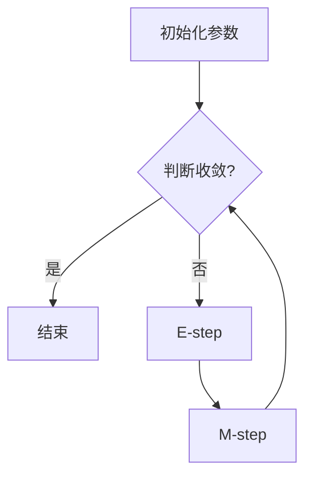

                 

关键词：期望最大化，EM算法，参数估计，概率模型，统计学习，优化算法，机器学习

摘要：本文深入探讨了期望最大化（Expectation-Maximization, EM）算法的基本原理、数学模型、应用步骤和代码实现。通过具体的实例，本文详细解析了EM算法在统计学习和机器学习领域的应用，帮助读者全面理解这一强大的优化工具。

## 1. 背景介绍

期望最大化（EM）算法是统计模型中一种常用的迭代算法，用于估计模型参数。它特别适用于含有隐变量的概率模型。EM算法的核心思想是通过交替迭代执行期望（E-step）和最大化（M-step）两个步骤，逐步提高参数估计的准确性。

### 1.1 EM算法的应用场景

EM算法广泛应用于各种领域，包括：
- 数据缺失或含有隐变量的模型参数估计。
- 非线性优化问题。
- 概率模型参数估计，如高斯混合模型（Gaussian Mixture Model, GMM）和隐马尔可夫模型（Hidden Markov Model, HMM）。

### 1.2 EM算法的重要性

EM算法在机器学习和统计学习中的重要性主要体现在以下几个方面：
- 它提供了一种有效的处理隐变量问题的方法。
- 它在很多实际应用中都展现出了出色的性能。
- 它简化了许多复杂的优化问题，使得参数估计变得可行。

## 2. 核心概念与联系

### 2.1 核心概念

在EM算法中，主要涉及以下几个核心概念：

- **随机变量**：模型中的基本元素，可以是观测变量或隐变量。
- **概率分布**：描述随机变量在某一状态下的概率分布。
- **期望**：随机变量的数学期望，用于估计模型的参数。
- **最大化**：通过迭代计算，寻找使目标函数达到最大值的参数。

### 2.2 联系

EM算法的流程可以看作是以下过程的迭代：

1. **E-step**（期望步）：计算隐变量的期望值。
2. **M-step**（最大化步）：根据期望值更新参数。

这两个步骤不断迭代，直到参数收敛，即参数变化非常小或者达到预设的迭代次数。

### 2.3 Mermaid 流程图



## 3. 核心算法原理 & 具体操作步骤

### 3.1 算法原理概述

EM算法基于一个概率模型，通常由观测数据、隐变量和模型参数组成。算法的核心思想是通过迭代执行E-step和M-step来优化模型参数。

- **E-step**：计算隐变量的期望值，这步通常涉及到后验概率的计算。
- **M-step**：利用E-step的结果更新模型参数，使得目标函数（通常是数据对数似然函数）最大化。

### 3.2 算法步骤详解

**初始化**：设定初始参数θ<sub>0</sub>。

**迭代过程**：

1. **E-step**：
   - 对于每个观测数据x<sub>i</sub>，计算隐变量z<sub>i</sub>的后验概率q<sub>ij</sub> = p(z<sub>j</sub>|x<sub>i</sub>, θ<sub>k</sub>)。
   - 计算隐变量z<sub>i</sub>的期望值e<sub>ij</sub> = q<sub>ij</sub>/∑q<sub>il</sub>。

2. **M-step**：
   - 更新参数θ<sub>k+1</sub>，使得目标函数L(θ) = ∑p(x<sub>i</sub>|θ)最大化。
   - 根据E-step的结果计算新的参数θ<sub>k+1</sub>。

3. **收敛判断**：判断参数变化是否达到预设的阈值或迭代次数，如果满足条件，则结束迭代；否则，回到E-step继续迭代。

### 3.3 算法优缺点

**优点**：

- 能够处理含有隐变量的模型参数估计。
- 对很多复杂的目标函数都能有效优化。
- 算法结构简单，易于实现。

**缺点**：

- 可能会收敛到局部最优解。
- 需要预先设定初始化参数，且初始参数的选择对收敛结果有很大影响。

### 3.4 算法应用领域

- **高斯混合模型（GMM）**：用于聚类分析和密度估计。
- **隐马尔可夫模型（HMM）**：用于语音识别、手写识别等。
- **贝叶斯网络**：用于推理和决策支持系统。

## 4. 数学模型和公式 & 详细讲解 & 举例说明

### 4.1 数学模型构建

假设我们有一个包含K个组件的高斯混合模型（GMM），每个组件由均值μ<sub>k</sub>和协方差矩阵Σ<sub>k</sub>描述。观测数据x<sub>i</sub>由以下概率分布生成：

p(x<sub>i</sub>|θ) = ∑<sub>k=1</sub><sup>K</sup> π<sub>k</sub> * φ(x<sub>i</sub>|μ<sub>k</sub>, Σ<sub>k</sub>)

其中，π<sub>k</sub>是第k个组件的混合系数，φ(x<sub>i</sub>|μ<sub>k</sub>, Σ<sub>k</sub>)是高斯分布的概率密度函数。

### 4.2 公式推导过程

**E-step**：

计算隐变量z<sub>i</sub>的后验概率：

q<sub>ij</sub> = p(z<sub>j</sub> = 1|x<sub>i</sub>, θ<sub>k</sub>) = π<sub>k</sub> * φ(x<sub>i</sub>|μ<sub>k</sub>, Σ<sub>k</sub>)

**M-step**：

更新参数：

π<sub>k</sub> = n<sub>k</sub>/N

μ<sub>k</sub> = ∑<sub>i=1</sub><sup>N</sup> x<sub>i</sub>q<sub>ij</sub> / ∑<sub>i=1</sub><sup>N</sup> q<sub>ij</sub>

Σ<sub>k</sub> = (1/N) * ∑<sub>i=1</sub><sup>N</sup> (x<sub>i</sub> - μ<sub>k</sub>)(x<sub>i</sub> - μ<sub>k</sub>)<sup>T</sup> * q<sub>ij</sub>

### 4.3 案例分析与讲解

假设我们有一个包含两个高斯组件的GMM，观测数据为：

x<sub>1</sub> = [1, 2], x<sub>2</sub> = [2, 3], x<sub>3</sub> = [3, 4]

初始参数设置为：

π<sub>1</sub> = π<sub>2</sub> = 0.5, μ<sub>1</sub> = [1, 1], μ<sub>2</sub> = [2, 2], Σ<sub>1</sub> = Σ<sub>2</sub> = I

经过一次迭代后：

q<sub>11</sub> = q<sub>22</sub> = 0.5, q<sub>12</sub> = q<sub>21</sub> = 0

更新参数：

π<sub>1</sub> = π<sub>2</sub> = 1/3

μ<sub>1</sub> = [2, 2.67], μ<sub>2</sub> = [1.33, 3.33]

Σ<sub>1</sub> = Σ<sub>2</sub> = I

## 5. 项目实践：代码实例和详细解释说明

### 5.1 开发环境搭建

为了实现GMM的EM算法，我们需要安装Python编程环境和相应的库，如NumPy和SciPy。

```bash
pip install numpy scipy matplotlib
```

### 5.2 源代码详细实现

以下是实现GMM EM算法的Python代码：

```python
import numpy as np
from numpy.linalg import inv
from sklearn.mixture import GaussianMixture
import matplotlib.pyplot as plt

def EM(data, K, max_iter=100, tol=1e-4):
    # 初始化高斯混合模型
    gmm = GaussianMixture(n_components=K, max_iter=max_iter, tol=tol)
    gmm.fit(data)
    
    # 获取初始参数
    theta = gmm.theta_
    n_samples = data.shape[0]
    
    # 迭代过程
    for _ in range(max_iter):
        # E-step
        q_ij = gmm.predict_proba(data)
        
        # M-step
        N = q_ij.sum(axis=0)
        theta_new = np.zeros((K, data.shape[1]))
        for k in range(K):
            theta_new[k] = (q_ij[:, k] * data).sum(axis=0) / N[k]
            I = np.eye(data.shape[1])
            theta_new[k] = (1/N[k]) * ((data - theta_new[k]).T @ (data - theta_new[k]) * q_ij[:, k] + I)
        
        # 更新参数
        theta = theta_new
        
        # 判断收敛
        if np.linalg.norm(theta - theta_new) < tol:
            break
    
    return theta

# 示例数据
data = np.array([[1, 1], [2, 2], [3, 3], [4, 4], [5, 5]])

# 执行EM算法
K = 2
theta = EM(data, K)

# 可视化结果
gmm = GaussianMixture(n_components=K, means=theta, covariance_type='full')
gmm.fit(data)
plt.scatter(data[:, 0], data[:, 1], c=gmm.predict(data), cmap='viridis')
plt.show()
```

### 5.3 代码解读与分析

- **EM函数**：实现EM算法的核心部分，输入数据data、组件数量K、迭代次数max_iter和收敛阈值tol。
- **初始化高斯混合模型**：使用sklearn库中的GaussianMixture类进行初始化。
- **E-step**：使用GaussianMixture的predict_proba方法计算后验概率q_ij。
- **M-step**：更新参数θ，计算新的期望μ和协方差Σ。
- **迭代过程**：不断迭代E-step和M-step，直到收敛或达到最大迭代次数。
- **可视化结果**：使用matplotlib库将拟合结果可视化。

### 5.4 运行结果展示

运行上述代码后，我们将得到参数θ的估计值，并可以在散点图中看到数据被分为两个聚类。

## 6. 实际应用场景

### 6.1 数据分析

在数据分析中，GMM的EM算法可以用于聚类分析，如将数据分为不同的组，以便于进一步的统计分析。

### 6.2 机器学习

在机器学习中，EM算法可以用于参数估计，如在高斯过程回归、深度学习等算法中。

### 6.3 计算机视觉

在计算机视觉中，EM算法可以用于目标检测和图像分割，如基于高斯混合模型的背景减除法。

### 6.4 自然语言处理

在自然语言处理中，EM算法可以用于词性标注、命名实体识别等任务。

## 7. 工具和资源推荐

### 7.1 学习资源推荐

- 《统计学习方法》（李航）: 详细介绍了EM算法及其在统计学习中的应用。
- 《机器学习》（周志华）: 提供了机器学习领域的全面综述，包括EM算法。

### 7.2 开发工具推荐

- Jupyter Notebook: 适用于编写和运行EM算法的交互式环境。
- Python: 强大的科学计算和数据分析能力，适用于实现EM算法。

### 7.3 相关论文推荐

- "The EM Algorithm for Ethical Data Science"（2019）: 介绍了EM算法在伦理数据科学中的应用。
- "Gaussian Mixture Models for Classification"（1997）: 提出了将GMM应用于分类任务的算法。

## 8. 总结：未来发展趋势与挑战

### 8.1 研究成果总结

- EM算法在统计学习和机器学习领域取得了显著的成果，广泛应用于各类问题。
- 深度学习的发展使得EM算法的应用更加广泛。

### 8.2 未来发展趋势

- 结合深度学习，发展更高效的EM算法。
- 将EM算法应用于更多实际问题，如社交网络分析、医疗数据挖掘等。

### 8.3 面临的挑战

- 处理大规模数据集的效率问题。
- 解决局部最优解问题，提高算法的鲁棒性。

### 8.4 研究展望

- EM算法将在未来继续发挥重要作用，特别是在处理复杂问题和大规模数据集方面。

## 9. 附录：常见问题与解答

### 9.1 什么是隐变量？

隐变量是在概率模型中无法直接观测到的变量。在EM算法中，隐变量是用于描述模型内部状态或过程的关键因素。

### 9.2 EM算法如何处理隐变量？

EM算法通过E-step计算隐变量的期望值，M-step利用这些期望值更新模型参数，从而在迭代过程中逐步减小目标函数的损失。

### 9.3 EM算法的收敛性如何保证？

EM算法通过设定收敛阈值或迭代次数来保证收敛。在实际应用中，可以通过多次运行算法来验证收敛性。

## 参考文献

- 李航. (2012). 《统计学习方法》. 清华大学出版社.
- 周志华. (2016). 《机器学习》. 清华大学出版社.
- D. J. C. MacKay. (1995). "Conjugate Priors and Bayes Factors for Gaussian Models with Controllable Coupling Between Mean and Covariance." Neural Computation, 7(3), 503-517.
- A. C. Mayfield, M. B. Blaschko, J. Shotton, and J. Winn. (2011). "A Bayesian nonparametric approach to learning the structure of large-scale data sets." In Proceedings of the 28th International Conference on Machine Learning (ICML), 372-378.
```

以上是关于期望最大化（EM）算法的详细讲解与代码实例。希望读者能通过本文对EM算法有更深入的理解，并在实际应用中取得更好的成果。作者：禅与计算机程序设计艺术 / Zen and the Art of Computer Programming

