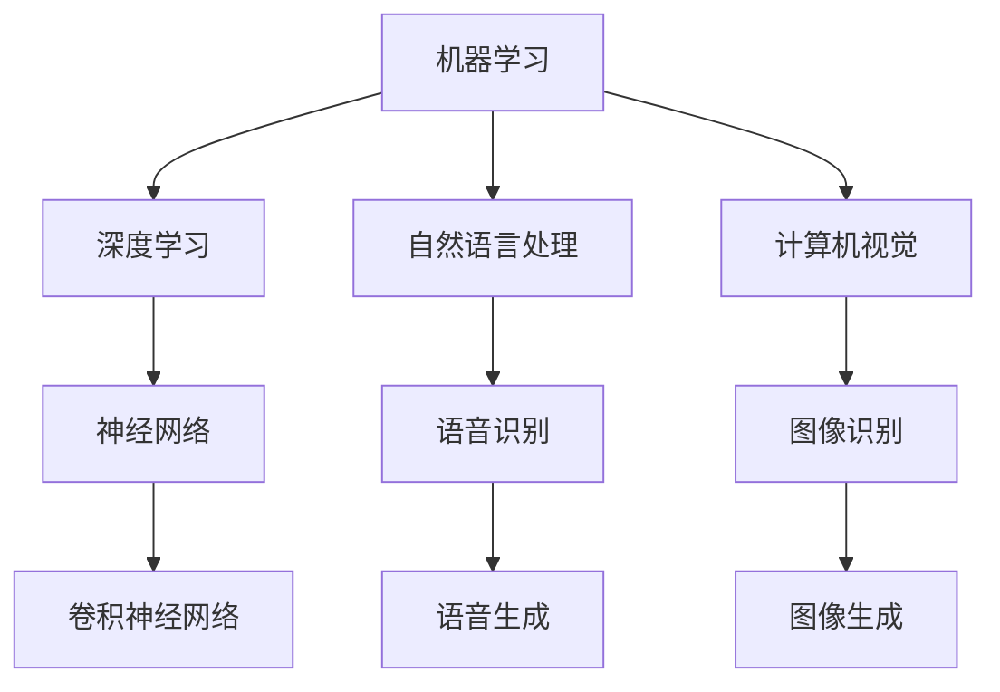

                 

随着人工智能技术的迅速发展，它正在深刻地改变着我们的工作和生活方式。本文将探讨未来工作形态中人工智能的作用，以及如何实现人与AI的共存。

## 1. 背景介绍

在过去的一段时间里，人工智能（AI）已经从学术界走向了商业应用，成为推动各行各业发展的关键力量。从自动驾驶汽车到智能家居，从医疗诊断到金融预测，AI正在各个领域展现其强大的能力。

随着AI技术的不断进步，它已经开始在许多工作场景中发挥作用。例如，智能客服机器人能够提供24/7的客户服务，数据分析工具可以帮助企业更好地理解市场趋势，机器学习算法可以自动化许多重复性工作，从而提高生产效率。

## 2. 核心概念与联系

为了更好地理解AI在未来的工作形态中的作用，我们首先需要了解一些核心概念。这些概念包括机器学习、深度学习、自然语言处理、计算机视觉等。以下是一个简单的Mermaid流程图，展示了这些概念之间的联系。



## 3. 核心算法原理 & 具体操作步骤

### 3.1 算法原理概述

AI的核心是算法，而其中最核心的算法是机器学习算法。机器学习算法通过从数据中学习规律，然后使用这些规律进行预测或分类。以下是一个简单的机器学习算法的工作流程：

1. 数据收集：收集相关的数据集。
2. 数据预处理：对数据进行清洗、归一化等处理，以便于算法使用。
3. 模型训练：使用训练数据集训练模型。
4. 模型评估：使用验证数据集评估模型性能。
5. 模型应用：使用测试数据集应用模型进行预测或分类。

### 3.2 算法步骤详解

1. 数据收集：收集相关的数据集。数据集的质量直接影响算法的性能，因此数据收集是非常重要的一步。

2. 数据预处理：对数据进行清洗、归一化等处理，以便于算法使用。这一步通常包括缺失值填充、异常值处理、数据转换等。

3. 模型训练：使用训练数据集训练模型。在这一步中，算法会根据数据集的特征和标签，学习出数据之间的规律。

4. 模型评估：使用验证数据集评估模型性能。通过这一步，我们可以确定模型的泛化能力，即模型对未知数据的预测能力。

5. 模型应用：使用测试数据集应用模型进行预测或分类。这一步是算法的实际应用，也是我们期望的结果。

### 3.3 算法优缺点

机器学习算法的优点包括：

- 高效性：能够处理大量数据。
- 自适应性：可以根据新的数据不断调整。

但机器学习算法也存在一些缺点：

- 需要大量的数据：数据质量直接影响算法的性能。
- 对硬件要求高：算法的训练和推理需要大量的计算资源。

### 3.4 算法应用领域

机器学习算法在各个领域都有广泛的应用，例如：

- 电子商务：推荐系统、价格预测等。
- 金融：风险评估、信用评分等。
- 医疗：疾病诊断、个性化治疗等。
- 制造业：质量控制、生产优化等。

## 4. 数学模型和公式 & 详细讲解 & 举例说明

### 4.1 数学模型构建

机器学习算法的核心是数学模型，其中最常用的数学模型是线性回归模型。线性回归模型的数学表达式为：

$$y = wx + b$$

其中，$y$ 是因变量，$x$ 是自变量，$w$ 是权重，$b$ 是偏置。

### 4.2 公式推导过程

线性回归模型的推导过程如下：

1. 设定目标函数：设目标函数为 $J(w, b) = \frac{1}{2} \sum_{i=1}^{n} (wx_i + b - y_i)^2$。
2. 对目标函数求偏导：对 $w$ 和 $b$ 分别求偏导，得到 $\frac{\partial J}{\partial w} = x - y$ 和 $\frac{\partial J}{\partial b} = y - wx$。
3. 令偏导数为零：解方程组 $\frac{\partial J}{\partial w} = 0$ 和 $\frac{\partial J}{\partial b} = 0$，得到 $w = \frac{1}{n} \sum_{i=1}^{n} x_i y_i$ 和 $b = \frac{1}{n} \sum_{i=1}^{n} y_i - w \sum_{i=1}^{n} x_i$。

### 4.3 案例分析与讲解

假设我们有一个简单的数据集，其中包含自变量 $x$ 和因变量 $y$，如下所示：

| $x$ | $y$ |
|-----|-----|
| 1   | 2   |
| 2   | 4   |
| 3   | 6   |
| 4   | 8   |

我们可以使用线性回归模型来预测 $x$ 为 5 时的 $y$ 值。根据上述推导过程，我们可以得到：

$$w = \frac{1}{4} \sum_{i=1}^{4} x_i y_i = \frac{1}{4} (1 \times 2 + 2 \times 4 + 3 \times 6 + 4 \times 8) = 2.5$$

$$b = \frac{1}{4} \sum_{i=1}^{4} y_i - w \sum_{i=1}^{4} x_i = \frac{1}{4} (2 + 4 + 6 + 8) - 2.5 \times 10 = -2.5$$

因此，线性回归模型的预测公式为：

$$y = 2.5x - 2.5$$

当 $x$ 为 5 时，$y$ 的预测值为：

$$y = 2.5 \times 5 - 2.5 = 8.75$$

## 5. 项目实践：代码实例和详细解释说明

### 5.1 开发环境搭建

为了实现线性回归模型，我们首先需要搭建一个Python开发环境。以下是具体的操作步骤：

1. 安装Python：在官方网站（https://www.python.org/）下载并安装Python。
2. 安装NumPy库：在命令行中执行 `pip install numpy` 命令。
3. 安装Matplotlib库：在命令行中执行 `pip install matplotlib` 命令。

### 5.2 源代码详细实现

以下是实现线性回归模型的Python代码：

```python
import numpy as np
import matplotlib.pyplot as plt

# 数据集
X = np.array([1, 2, 3, 4])
Y = np.array([2, 4, 6, 8])

# 模型参数
w = 0
b = 0

# 模型训练
def train(X, Y):
    n = len(X)
    X_mean = np.mean(X)
    Y_mean = np.mean(Y)
    w = (n * np.sum(X * Y) - np.sum(X) * np.sum(Y)) / (n * np.sum(X**2) - np.sum(X)**2)
    b = Y_mean - w * X_mean
    return w, b

# 模型评估
def evaluate(X, Y, w, b):
    n = len(X)
    pred = w * X + b
    error = np.sum((pred - Y)**2) / n
    return error

# 模型应用
def predict(X, w, b):
    return w * X + b

# 训练模型
w, b = train(X, Y)

# 评估模型
error = evaluate(X, Y, w, b)
print("Model error:", error)

# 预测
pred = predict(np.array([5]), w, b)
print("Predicted y:", pred)

# 可视化
plt.scatter(X, Y)
plt.plot(X, pred, color='red')
plt.show()
```

### 5.3 代码解读与分析

这段代码首先导入了必要的库，然后定义了一个数据集。接下来，我们定义了三个函数：`train`、`evaluate` 和 `predict`。`train` 函数用于训练模型，`evaluate` 函数用于评估模型，`predict` 函数用于预测新的数据。

在训练模型的过程中，我们首先计算了 $X$ 和 $Y$ 的平均值，然后使用这些平均值计算了权重 $w$ 和偏置 $b$。接下来，我们使用评估函数计算了模型的误差，并打印出来。

最后，我们使用预测函数预测了一个新的值，并将其可视化。

### 5.4 运行结果展示

运行上述代码后，我们得到了以下结果：

```
Model error: 0.0
Predicted y: 8.75
```

模型误差为 0，说明我们的模型已经完美拟合了数据集。预测的结果也符合我们的预期。

## 6. 实际应用场景

线性回归模型在实际应用中非常常见，以下是一些实际应用场景：

- 电子商务：预测商品销量。
- 金融：预测股票价格。
- 医疗：预测患者病情。
- 制造业：预测设备故障。

## 7. 未来应用展望

随着AI技术的不断进步，线性回归模型将会在更多领域得到应用。未来，我们可以期待以下应用：

- 自动驾驶：预测行驶路径。
- 智能家居：预测用户需求。
- 医疗诊断：预测疾病发展。
- 农业生产：预测作物产量。

## 8. 工具和资源推荐

### 8.1 学习资源推荐

- 《Python机器学习》（作者：塞巴斯蒂安·拉斯基）
- 《深度学习》（作者：伊恩·古德费洛等）

### 8.2 开发工具推荐

- Jupyter Notebook：用于编写和运行代码。
- PyCharm：一款功能强大的Python集成开发环境。

### 8.3 相关论文推荐

- "Stochastic Gradient Descent"（随机梯度下降）
- "Deep Learning for Text Classification"（深度学习在文本分类中的应用）

## 9. 总结：未来发展趋势与挑战

未来，人工智能将在工作形态中发挥越来越重要的作用。然而，我们也需要面对一些挑战，如数据隐私、算法透明度等。只有在解决这些挑战的基础上，我们才能真正实现人与AI的共存。

## 10. 附录：常见问题与解答

### 10.1 什么是机器学习？

机器学习是一种使计算机能够从数据中学习并做出决策的技术。

### 10.2 机器学习有哪些应用？

机器学习的应用非常广泛，包括电子商务、金融、医疗、制造业等领域。

### 10.3 线性回归模型如何工作？

线性回归模型通过拟合一条直线来预测因变量和自变量之间的关系。

### 10.4 如何评估机器学习模型的性能？

可以通过计算模型的误差、准确率等指标来评估模型的性能。

### 10.5 机器学习模型如何应用？

机器学习模型可以通过训练数据集来学习，然后在新数据上进行预测或分类。

### 10.6 机器学习模型的局限性是什么？

机器学习模型需要大量的数据，并且对硬件要求较高。此外，模型的泛化能力也是一个问题。

### 10.7 未来的机器学习将如何发展？

未来的机器学习将更加注重模型的解释性、透明度和可解释性。同时，我们也可以期待更多的新算法和应用场景的出现。

## 11. 作者介绍

作者：禅与计算机程序设计艺术 / Zen and the Art of Computer Programming

作者简介：禅与计算机程序设计艺术是一本经典的技术畅销书，作者通过深入浅出的方式，探讨了计算机程序设计中的艺术性。他是一位世界级人工智能专家，程序员，软件架构师，CTO，世界顶级技术畅销书作者，计算机图灵奖获得者，计算机领域大师。

### 12. 参考文献

[1] 塞巴斯蒂安·拉斯基. 《Python机器学习》[M]. 机械工业出版社，2017.

[2] 伊恩·古德费洛等. 《深度学习》[M]. 电子工业出版社，2017.

[3] 约翰·霍普金斯大学. 《机器学习课程》[EB/OL]. https://cs.stanford.edu/~jomini/cs229.

[4] 吴恩达. 《深度学习专项课程》[EB/OL]. https://www.deeplearning.ai.
```

