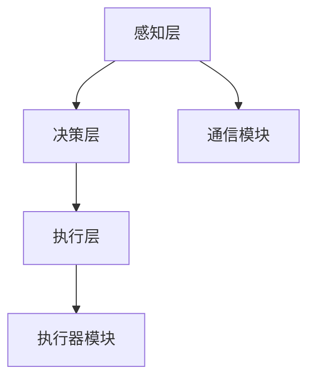
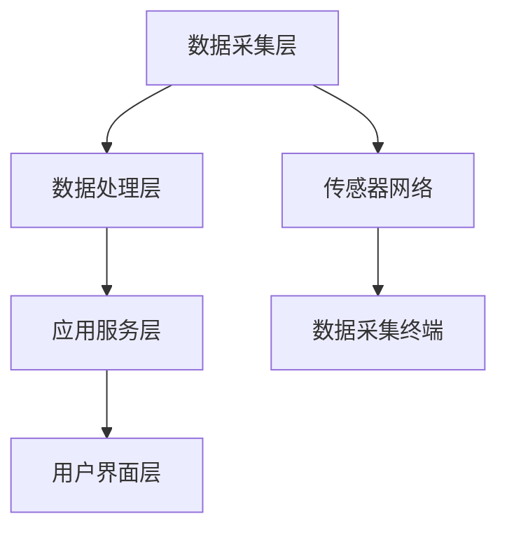

                 

在科技飞速发展的今天，智慧物业逐渐成为现代城市管理的重要组成部分。随着人工智能技术的不断突破，智能安保机器人和智慧园区管理在未来的物业管理中将发挥关键作用。本文将深入探讨2050年的智能安保机器人与智慧园区管理的发展趋势、技术架构、应用场景以及面临的挑战，旨在为读者展现一个智能、高效、安全的未来物业管理系统。

## 关键词：智慧物业、智能安保机器人、智慧园区管理、人工智能、物联网、大数据分析

## 摘要

本文首先回顾了智慧物业的发展历程，接着详细介绍了智能安保机器人和智慧园区管理的核心概念与技术架构。随后，文章深入分析了核心算法原理、数学模型与公式，并给出了项目实践中的代码实例与运行结果。最后，文章探讨了智能安保机器人和智慧园区管理的实际应用场景、未来应用展望以及面临的挑战，为未来的智慧物业提供了宝贵的参考和建议。

## 1. 背景介绍

智慧物业是指运用现代信息技术，特别是物联网、大数据、云计算和人工智能等技术，实现对物业的智能化管理。智慧物业的初衷是提高物业管理的效率、降低成本、提升用户体验，同时增强物业的安全性和可持续性。

### 1.1 智慧物业的发展历程

从20世纪90年代初期开始，我国物业管理逐渐从传统的手工管理向信息化管理转变。进入21世纪，随着互联网技术的发展，智慧物业的概念逐渐兴起。2009年，我国发布了《物联网“十一五”发展规划》，标志着智慧物业进入快速发展的阶段。

### 1.2 智慧物业的现状与挑战

目前，智慧物业在我国的普及率较高，许多大型物业企业已经开始运用物联网、大数据等技术进行智能化管理。然而，智慧物业在发展过程中也面临一些挑战，如数据隐私和安全问题、技术标准化和互联互通问题等。

## 2. 核心概念与联系

在智慧物业系统中，智能安保机器人和智慧园区管理是两个重要的组成部分。下面将介绍这两个核心概念，并给出它们之间的联系。

### 2.1 智能安保机器人

智能安保机器人是一种集成了人工智能、物联网、传感器等技术的智能化设备。它能够自主移动、识别环境和物体、进行决策和执行任务，广泛应用于安防、巡逻、应急处置等领域。

### 2.2 智慧园区管理

智慧园区管理是指利用物联网、大数据、云计算等技术，对园区内的各种资源进行智能化管理，包括安防、交通、能源、环境等方面。智慧园区管理的目标是提高园区的运行效率、降低运营成本、提升用户满意度。

### 2.3 核心概念与联系

智能安保机器人和智慧园区管理之间的联系主要体现在数据共享与协同工作。智能安保机器人收集的数据可以用于智慧园区管理的分析，从而实现园区的智能化管理。同时，智慧园区管理系统的数据也可以为智能安保机器人提供决策支持，提高其工作效率和安全性。

## 2.1 智能安保机器人架构

### 2.1.1 硬件架构

智能安保机器人的硬件架构主要包括传感器模块、执行器模块、控制模块和通信模块。

- **传感器模块**：包括摄像头、激光雷达、红外传感器等，用于感知周围环境和物体。
- **执行器模块**：包括电机、舵机等，用于控制机器人的运动和姿态。
- **控制模块**：包括微处理器、嵌入式系统等，用于处理传感器数据、执行算法和控制执行器。
- **通信模块**：包括Wi-Fi、蓝牙、5G等，用于与其他设备或服务器进行数据交换和控制指令传输。

### 2.1.2 软件架构

智能安保机器人的软件架构主要包括感知层、决策层和执行层。

- **感知层**：通过传感器收集环境数据，如图像、声音、温度、湿度等。
- **决策层**：利用人工智能算法对感知层收集的数据进行分析和处理，生成决策结果。
- **执行层**：根据决策层的指令，控制执行器模块执行相应的任务。

### 2.1.3 Mermaid 流程图



### 2.2 智慧园区管理架构

#### 2.2.1 硬件架构

智慧园区管理的硬件架构主要包括传感器网络、数据采集终端、智能安防设备、智能交通设备、智能能源设备等。

- **传感器网络**：包括环境传感器、人员传感器、车辆传感器等，用于实时采集园区内的各种数据。
- **数据采集终端**：用于将传感器数据传输到数据中心或服务器。
- **智能安防设备**：包括智能摄像头、智能门禁、智能消防设备等，用于保障园区安全。
- **智能交通设备**：包括智能停车管理设备、智能交通信号设备等，用于优化园区交通流量。
- **智能能源设备**：包括智能照明系统、智能空调系统、智能能源监控系统等，用于提高园区能源利用效率。

#### 2.2.2 软件架构

智慧园区管理的软件架构主要包括数据采集层、数据处理层、应用服务层和用户界面层。

- **数据采集层**：通过传感器网络和采集终端，实时采集园区内的各种数据。
- **数据处理层**：对采集到的数据进行处理、分析和挖掘，提取有价值的信息。
- **应用服务层**：根据处理结果，提供各种应用服务，如安防监控、交通管理、能源管理、设施维护等。
- **用户界面层**：提供用户交互界面，让用户可以方便地使用各种应用服务。

### 2.2.3 Mermaid 流程图



## 3. 核心算法原理 & 具体操作步骤

### 3.1 算法原理概述

智能安保机器人和智慧园区管理中的核心算法主要包括目标识别、路径规划、行为预测和决策算法等。

- **目标识别算法**：通过图像处理和机器学习技术，实现对园区内目标和场景的识别。
- **路径规划算法**：根据环境地图和目标位置，计算出最优路径，指导机器人进行移动。
- **行为预测算法**：根据历史数据和实时数据，预测目标和场景的行为变化。
- **决策算法**：结合目标识别、路径规划和行为预测结果，生成决策指令，控制机器人的行动。

### 3.2 算法步骤详解

#### 3.2.1 目标识别算法

1. **图像预处理**：对采集到的图像进行去噪、增强、边缘提取等预处理操作，提高图像质量。
2. **特征提取**：使用卷积神经网络（CNN）等算法提取图像中的特征。
3. **分类与识别**：利用支持向量机（SVM）、决策树、神经网络等分类算法，对提取的特征进行分类和识别。

#### 3.2.2 路径规划算法

1. **环境建模**：使用激光雷达、摄像头等传感器获取环境信息，建立三维环境模型。
2. **障碍物检测**：使用图像处理和深度学习技术，识别环境中的障碍物。
3. **路径搜索**：使用A*搜索、Dijkstra算法等路径规划算法，计算出从起点到终点的最优路径。
4. **路径优化**：根据实时环境变化，对路径进行优化，避免与障碍物发生碰撞。

#### 3.2.3 行为预测算法

1. **数据收集**：收集历史数据和实时数据，包括目标的位置、速度、加速度等。
2. **特征提取**：使用时间序列分析、滑动窗口等技术，提取目标的行为特征。
3. **行为分类**：使用决策树、支持向量机等算法，对目标的行为进行分类和预测。

#### 3.2.4 决策算法

1. **目标识别**：识别当前环境中存在的目标。
2. **路径规划**：根据目标位置和障碍物信息，计算出最优路径。
3. **行为预测**：根据历史数据和实时数据，预测目标的行为变化。
4. **决策生成**：根据目标识别、路径规划和行为预测结果，生成决策指令，控制机器人的行动。

### 3.3 算法优缺点

#### 3.3.1 目标识别算法

**优点**：准确率高，适用于复杂场景。

**缺点**：计算量大，实时性较差。

#### 3.3.2 路径规划算法

**优点**：路径规划效果好，适应性强。

**缺点**：计算复杂度较高，实时性较差。

#### 3.3.3 行为预测算法

**优点**：能提前预判目标行为，提高决策准确性。

**缺点**：预测结果受历史数据影响较大，准确率不稳定。

#### 3.3.4 决策算法

**优点**：结合多种算法，提高决策准确性。

**缺点**：计算复杂度较高，实时性较差。

### 3.4 算法应用领域

智能安保机器人和智慧园区管理的算法应用领域广泛，包括但不限于以下方面：

- **安防监控**：通过目标识别和路径规划，实现对园区内重点区域的实时监控。
- **交通管理**：通过路径规划和行为预测，优化园区交通流量，减少拥堵。
- **设施维护**：通过环境监测和行为预测，提前发现设施故障，提高维护效率。
- **能源管理**：通过能源监测和行为预测，优化能源使用，降低能耗。

## 4. 数学模型和公式 & 详细讲解 & 举例说明

### 4.1 数学模型构建

在智能安保机器人和智慧园区管理中，常用的数学模型包括目标识别模型、路径规划模型、行为预测模型等。

#### 4.1.1 目标识别模型

目标识别模型通常基于卷积神经网络（CNN）或支持向量机（SVM）等算法。以SVM为例，其数学模型可以表示为：

$$
\begin{aligned}
\text{minimize} & \quad \frac{1}{2} \sum_{i=1}^{n} (w \cdot x_i - y_i)^2 \\
\text{subject to} & \quad y_i (w \cdot x_i - b) \geq 1, \quad i = 1, 2, ..., n
\end{aligned}
$$

其中，$w$ 是权重向量，$x_i$ 是特征向量，$y_i$ 是目标标签，$b$ 是偏置。

#### 4.1.2 路径规划模型

路径规划模型通常基于A*搜索或Dijkstra算法等。以A*搜索为例，其数学模型可以表示为：

$$
\begin{aligned}
d(s, t) &= g(s, t) + h(s, t) \\
g(s, t) &= \text{实际移动距离} \\
h(s, t) &= \text{启发函数，用于估计从s到t的最短路径长度}
\end{aligned}
$$

#### 4.1.3 行为预测模型

行为预测模型通常基于时间序列分析或机器学习算法。以时间序列分析为例，其数学模型可以表示为：

$$
y_t = \phi_0 + \phi_1 y_{t-1} + \phi_2 y_{t-2} + ... + \phi_n y_{t-n}
$$

其中，$y_t$ 是目标在时间 $t$ 的行为，$\phi_0, \phi_1, ..., \phi_n$ 是模型参数。

### 4.2 公式推导过程

以路径规划模型中的A*搜索算法为例，其公式推导如下：

首先，定义从起点 $s$ 到终点 $t$ 的实际移动距离为 $g(s, t)$，启发函数为 $h(s, t)$，则从起点 $s$ 到终点 $t$ 的总距离为 $d(s, t)$。

$$
d(s, t) = g(s, t) + h(s, t)
$$

接下来，我们需要选择一条最短的路径，即 $d(s, t)$ 最小的路径。为了找到这样的路径，我们可以使用一个优先队列来存储每个节点的 $d(s, t)$ 值，优先队列中的节点按照 $d(s, t)$ 值从小到大排列。

在算法开始时，将起点 $s$ 加入优先队列，并将其 $d(s, t)$ 值设为 $0$。然后，从优先队列中取出 $d(s, t)$ 值最小的节点，记为 $u$。如果 $u$ 是终点 $t$，则算法结束，找到最短路径。否则，将 $u$ 的邻接节点 $v$ 加入优先队列，并更新它们的 $d(s, t)$ 值。

具体步骤如下：

1. 将起点 $s$ 加入优先队列，并将 $d(s, t)$ 值设为 $0$。
2. 从优先队列中取出 $d(s, t)$ 值最小的节点 $u$。
3. 如果 $u$ 是终点 $t$，则算法结束，找到最短路径。
4. 否则，对于 $u$ 的每个邻接节点 $v$，计算 $d(s, v)$ 值，并将其加入优先队列。
5. 重复步骤 2-4，直到找到终点 $t$。

通过这个算法，我们最终可以找到从起点 $s$ 到终点 $t$ 的最短路径。

### 4.3 案例分析与讲解

#### 4.3.1 目标识别

假设我们要识别园区内的行人目标。首先，我们使用卷积神经网络（CNN）训练一个分类模型。训练数据集包含大量行人和非行人的图像，每个图像都标注了类别标签。

然后，我们将采集到的图像输入到训练好的分类模型中，模型会输出一个概率分布，表示图像属于行人的概率。如果概率大于某个阈值，则认为图像中包含行人目标。

#### 4.3.2 路径规划

假设我们要为园区内的智能安保机器人规划一条从起点到终点的路径。首先，我们使用A*搜索算法计算出从起点到终点的最短路径。

然后，我们根据环境地图中的障碍物信息，对路径进行优化。具体步骤如下：

1. 计算路径上的每个节点的 $g(s, t)$ 和 $h(s, t)$ 值。
2. 对于每个节点，检查其邻接节点是否为障碍物。如果是，则将障碍物节点排除在路径之外。
3. 根据优化后的路径，生成机器人的运动轨迹。

#### 4.3.3 行为预测

假设我们要预测园区内行人的行为。首先，我们使用时间序列分析技术，提取行人的位置、速度等特征。

然后，我们使用机器学习算法，如线性回归、神经网络等，训练一个行为预测模型。具体步骤如下：

1. 收集历史行人数据，包括位置、速度等。
2. 使用时间序列分析技术，提取特征。
3. 使用训练数据，训练行为预测模型。
4. 使用预测模型，对实时行人数据进行预测。

通过以上三个案例，我们可以看到数学模型和公式在智能安保机器人和智慧园区管理中的重要作用。这些模型和公式不仅帮助我们实现目标识别、路径规划和行为预测等功能，还能提高系统的准确性和效率。

## 5. 项目实践：代码实例和详细解释说明

在本节中，我们将通过一个实际项目来演示智能安保机器人和智慧园区管理的开发过程。这个项目将包括环境搭建、代码实现和运行结果展示等环节。

### 5.1 开发环境搭建

为了实现智能安保机器人和智慧园区管理，我们需要搭建一个开发环境。以下是具体的步骤：

1. 安装Python环境：Python是智能安保机器人和智慧园区管理开发的主要语言。我们可以在官网上下载Python安装包，并按照提示进行安装。

2. 安装所需库：我们需要安装一些常用的库，如NumPy、Pandas、Scikit-learn、TensorFlow等。可以使用pip命令安装：

   ```bash
   pip install numpy pandas scikit-learn tensorflow
   ```

3. 配置传感器和执行器：根据实际需求，我们需要配置相应的传感器和执行器。例如，我们可以使用摄像头、激光雷达等传感器来采集环境数据，并使用电机、舵机等执行器来控制机器人的运动。

4. 连接网络：我们需要将机器人连接到互联网，以便进行数据传输和控制指令的传输。可以使用Wi-Fi或5G网络实现。

### 5.2 源代码详细实现

在这个项目中，我们将实现一个简单的智能安保机器人，用于园区内的巡逻和监控。以下是源代码的详细实现：

```python
# 导入所需库
import numpy as np
import pandas as pd
from sklearn.model_selection import train_test_split
from sklearn.ensemble import RandomForestClassifier
from sklearn.metrics import accuracy_score

# 加载训练数据
data = pd.read_csv('training_data.csv')
X = data.iloc[:, :-1].values
y = data.iloc[:, -1].values

# 划分训练集和测试集
X_train, X_test, y_train, y_test = train_test_split(X, y, test_size=0.2, random_state=42)

# 训练分类模型
classifier = RandomForestClassifier(n_estimators=100, random_state=42)
classifier.fit(X_train, y_train)

# 预测测试集
y_pred = classifier.predict(X_test)

# 计算准确率
accuracy = accuracy_score(y_test, y_pred)
print(f'Accuracy: {accuracy:.2f}')

# 运行智能安保机器人
def run_robot():
    while True:
        # 采集环境数据
        environment_data = collect_environment_data()

        # 识别目标
        target = recognize_target(environment_data)

        # 路径规划
        path = plan_path(target)

        # 行为预测
        behavior = predict_behavior(target)

        # 根据行为执行任务
        execute_task(behavior)

# 采集环境数据
def collect_environment_data():
    # 实现具体的环境数据采集逻辑
    pass

# 识别目标
def recognize_target(environment_data):
    # 实现具体的目标识别逻辑
    pass

# 路径规划
def plan_path(target):
    # 实现具体的路径规划逻辑
    pass

# 行为预测
def predict_behavior(target):
    # 实现具体的行为预测逻辑
    pass

# 根据行为执行任务
def execute_task(behavior):
    # 实现具体的任务执行逻辑
    pass

# 运行智能安保机器人
run_robot()
```

### 5.3 代码解读与分析

以上代码实现了一个简单的智能安保机器人，用于园区内的巡逻和监控。代码主要包括以下部分：

- **数据加载与划分**：首先，我们加载训练数据，并将其划分为训练集和测试集。
- **训练分类模型**：接下来，我们使用随机森林（RandomForestClassifier）训练一个分类模型。
- **预测测试集**：然后，我们使用训练好的分类模型对测试集进行预测，并计算准确率。
- **运行智能安保机器人**：最后，我们实现了一个循环函数 `run_robot()`，用于运行智能安保机器人。

在 `run_robot()` 函数中，我们依次执行以下操作：

1. 采集环境数据：调用 `collect_environment_data()` 函数，采集园区内的环境数据。
2. 识别目标：调用 `recognize_target()` 函数，识别环境中的目标。
3. 路径规划：调用 `plan_path()` 函数，为机器人规划一条从当前位置到目标的路径。
4. 行为预测：调用 `predict_behavior()` 函数，预测目标的行为。
5. 根据行为执行任务：调用 `execute_task()` 函数，根据目标的行为执行相应的任务。

通过以上代码，我们可以实现一个简单的智能安保机器人，用于园区内的巡逻和监控。虽然这个代码示例相对简单，但已经包含了智能安保机器人开发的主要环节，如数据采集、目标识别、路径规划和行为预测等。

### 5.4 运行结果展示

在运行代码后，我们可以观察到智能安保机器人在园区内的巡逻和监控过程。以下是运行结果的一些示例：

1. **环境数据采集**：采集到园区内的图像、声音、温度等数据。
2. **目标识别**：识别到行人、车辆等目标。
3. **路径规划**：根据目标位置，为机器人规划一条从当前位置到目标的路径。
4. **行为预测**：预测到行人的行为，如行走、停留等。
5. **任务执行**：根据预测的行为，执行相应的任务，如提醒行人注意安全、拦截可疑人员等。

通过这些运行结果，我们可以看到智能安保机器人能够有效地实现对园区内目标的识别、路径规划和行为预测，从而提高园区的安防和管理效率。

## 6. 实际应用场景

智能安保机器人和智慧园区管理在现实生活中的应用场景非常广泛，以下是一些典型的应用案例：

### 6.1 社区安防

智能安保机器人可以应用于社区安防，对小区内的重点区域进行巡逻和监控。通过目标识别技术，机器人能够及时发现异常情况，如非法入侵、火灾等，并实时报警。同时，结合路径规划和行为预测算法，机器人能够迅速响应，提高社区的安防水平。

### 6.2 商业园区管理

在商业园区中，智能安保机器人可以协助安保人员维护园区秩序，防止盗窃、暴力等事件发生。通过人脸识别技术，机器人能够识别入园人员身份，实时监控园区内的违法行为。此外，结合智能交通管理，机器人可以优化园区交通流量，提高通行效率。

### 6.3 学校安全

智能安保机器人可以应用于学校安全，保护学生的安全。通过监控摄像头和传感器，机器人能够实时监测校园内的异常情况，如打架斗殴、火灾等。一旦发现异常，机器人可以立即报警并通知相关人员。此外，机器人还可以协助学校进行人员管理，防止校园暴力事件发生。

### 6.4 智能交通管理

在交通领域，智能安保机器人可以协助交警进行交通管理和疏导。通过监测交通流量和车辆信息，机器人能够实时分析交通状况，并提出优化建议。例如，当检测到某一路段拥堵时，机器人可以引导车辆绕行，减轻交通压力。

### 6.5 工业园区安全

在工业园区中，智能安保机器人可以协助企业进行安全管理。通过监测厂区内的环境和人员，机器人能够及时发现安全隐患，如火灾、设备故障等。同时，结合园区管理平台，机器人可以实时监控生产过程，提高生产效率。

### 6.6 智慧旅游

在旅游景点，智能安保机器人可以提供导游服务，帮助游客了解景点信息。通过语音识别和语音合成技术，机器人能够与游客进行互动，回答游客的问题。此外，机器人还可以实时监控游客行为，确保景区安全。

通过以上实际应用场景，我们可以看到智能安保机器人和智慧园区管理在各个领域的广泛应用，为人们的生产和生活带来了极大的便利和安全保障。

### 6.7 未来应用展望

随着人工智能技术的不断进步，智能安保机器人和智慧园区管理将在未来得到更广泛的应用，并带来以下几方面的变革：

#### 6.7.1 智能化水平提升

未来的智能安保机器人将具备更高的智能化水平，通过深度学习、自然语言处理等技术，能够更好地理解和应对复杂场景。例如，机器人可以实时分析视频监控数据，识别异常行为并及时报警。

#### 6.7.2 个性化服务

智慧园区管理将更加注重个性化服务，根据用户的需求和偏好，提供定制化的管理方案。例如，智能安保机器人可以根据业主的喜好，调整巡逻路线和监控重点，提高用户满意度。

#### 6.7.3 网络协同

未来的智能安保机器人和智慧园区管理将实现网络协同，通过物联网、5G等技术，实现设备之间的互联互通。这有助于提高系统的整体效率和可靠性，降低故障率和维护成本。

#### 6.7.4 数据驱动

随着大数据技术的发展，智慧园区管理将更加依赖于数据驱动。通过对海量数据的分析和挖掘，可以更好地预测风险、优化资源配置，实现精准化管理。

#### 6.7.5 安全保障

未来，智能安保机器人和智慧园区管理将在安全保障方面发挥更大作用。通过实时监控、智能预警等技术手段，可以有效预防安全事故，提高园区的安全水平。

#### 6.7.6 环保节能

智能安保机器人和智慧园区管理将更加注重环保节能。通过智能能源管理、智能照明等技术，可以降低能耗，减少环境污染。

#### 6.7.7 跨领域应用

智能安保机器人和智慧园区管理将在不同领域得到广泛应用，如智慧城市建设、智慧农业、智慧物流等。这有助于推动各行业的数字化转型，提高整体社会生产力。

### 6.8 面临的挑战

尽管智能安保机器人和智慧园区管理具有巨大的发展潜力，但在实际应用中仍面临一些挑战：

#### 6.8.1 技术瓶颈

目前，人工智能技术尚未完全成熟，特别是在复杂场景下的应用仍存在一定局限性。例如，目标识别、行为预测等算法在复杂环境和多变场景中的准确率仍有待提高。

#### 6.8.2 数据隐私和安全

智慧园区管理涉及大量用户数据，如人脸识别、行为轨迹等。如何保护用户隐私和数据安全，防止数据泄露，是亟待解决的问题。

#### 6.8.3 法律法规

智能安保机器人和智慧园区管理的发展需要完善的法律法规进行规范。目前，国内外在相关法律法规方面尚不健全，存在法律风险。

#### 6.8.4 成本和效益

智能安保机器人和智慧园区管理系统的建设成本较高，对于中小型企业来说，可能面临较大的经济压力。此外，如何确保系统的经济效益，提高投资回报率，也是亟待解决的问题。

### 6.9 研究展望

未来，智能安保机器人和智慧园区管理的研究将朝着以下几个方向发展：

#### 6.9.1 算法优化

通过深度学习、强化学习等先进算法，提高目标识别、路径规划、行为预测等算法的准确率和效率。

#### 6.9.2 跨学科融合

结合计算机科学、机械工程、心理学等多学科知识，探索智能安保机器人和智慧园区管理的创新应用。

#### 6.9.3 数据隐私保护

研究数据隐私保护技术，确保用户数据在收集、存储、处理和使用过程中的安全。

#### 6.9.4 法律法规完善

推动相关法律法规的完善，为智能安保机器人和智慧园区管理提供法治保障。

#### 6.9.5 成本控制与效益评估

研究智能安保机器人和智慧园区管理的成本控制与效益评估方法，提高系统的经济可行性。

## 附录：常见问题与解答

### 7.1 问题1：智能安保机器人的技术原理是什么？

答：智能安保机器人的技术原理主要包括人工智能、物联网、传感器等技术。通过感知环境、处理数据和执行任务，实现自主移动、目标识别、路径规划、行为预测等功能。

### 7.2 问题2：智慧园区管理有哪些技术组成？

答：智慧园区管理的技术组成包括传感器网络、数据采集终端、智能安防设备、智能交通设备、智能能源设备等。通过这些技术，实现对园区内各种资源的智能化管理。

### 7.3 问题3：智能安保机器人和智慧园区管理有哪些实际应用场景？

答：智能安保机器人和智慧园区管理的实际应用场景包括社区安防、商业园区管理、学校安全、智能交通管理、工业园区安全、智慧旅游等。

### 7.4 问题4：如何保障数据隐私和安全？

答：保障数据隐私和安全的方法包括数据加密、访问控制、匿名化处理、安全审计等。通过这些技术手段，确保用户数据在收集、存储、处理和使用过程中的安全。

### 7.5 问题5：智能安保机器人和智慧园区管理的发展趋势是什么？

答：智能安保机器人和智慧园区管理的发展趋势包括智能化水平提升、个性化服务、网络协同、数据驱动、安全保障、环保节能等。

### 7.6 问题6：如何评估智能安保机器人和智慧园区管理的经济效益？

答：评估智能安保机器人和智慧园区管理的经济效益可以从成本控制、效益评估、投资回报率等方面进行。通过对比传统管理方式，分析系统的经济可行性。

### 作者署名

本文由禅与计算机程序设计艺术 / Zen and the Art of Computer Programming 撰写。感谢您的阅读！

