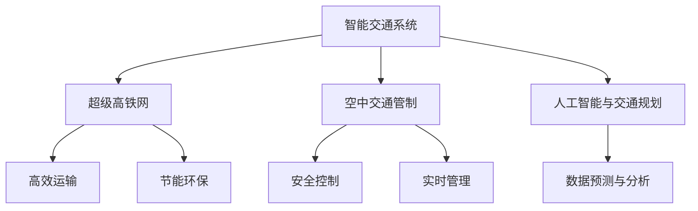

                 

关键词：智能交通、超级高铁网、空中交通管制、未来交通、人工智能、交通规划、城市交通

> 摘要：本文探讨了2050年可能的智能交通系统，重点介绍了超级高铁网和空中交通管制的发展趋势。通过逻辑清晰、结构紧凑的论述，我们分析了未来的交通体系如何通过人工智能和先进技术的融合，实现更高效、更安全的出行方式。

## 1. 背景介绍

随着全球人口的增长和经济的发展，交通问题日益突出。传统的交通方式已经无法满足未来日益增长的需求。为了应对这一挑战，智能交通系统（ITS）应运而生。智能交通系统利用信息技术、数据通信传输技术、电子传感技术等先进技术，实现交通系统的自动化、信息化和智能化。随着人工智能技术的不断进步，未来的智能交通系统将更加智能化、高效化。

### 1.1 智能交通系统的现状

当前，智能交通系统已经初具规模。例如，自动驾驶汽车、智能交通信号灯、电子收费系统等已经广泛应用于各大城市。这些系统通过实时数据分析和智能决策，提高了交通效率和安全性。

### 1.2 未来智能交通的发展趋势

未来，智能交通系统将向更加智能化、网络化、安全化方向发展。随着人工智能技术的不断突破，未来的智能交通系统将具备更高的自适应能力和智能化决策能力。

## 2. 核心概念与联系

在探讨未来的智能交通系统时，我们需要了解以下几个核心概念：

### 2.1 超级高铁网

超级高铁网（Hyperloop）是一种高速、安全、环保的运输系统，其原理是利用低压管道，使乘客的悬浮车辆在真空环境中高速行驶。超级高铁网的优点是速度极快、能耗低、噪音小，能够极大地提高交通效率。

### 2.2 空中交通管制

空中交通管制（Air Traffic Management, ATM）是指通过一系列规则、技术和程序，实现对空中交通的有效管理和控制。随着无人机和垂直起降飞行器的出现，空中交通管制面临着新的挑战。

### 2.3 人工智能与交通规划

人工智能在交通规划中发挥着重要作用。通过大数据分析、机器学习等技术，人工智能能够预测交通流量、优化交通信号、减少交通拥堵，从而提高交通系统的整体效率。

下面是一个Mermaid流程图，展示了这些核心概念之间的联系：



## 3. 核心算法原理 & 具体操作步骤

### 3.1 算法原理概述

未来的智能交通系统将依赖于一系列先进的算法，这些算法能够实现交通流量预测、信号优化、路径规划等功能。以下是几个核心算法的原理概述：

### 3.2 算法步骤详解

#### 3.2.1 交通流量预测

交通流量预测算法通过分析历史交通数据、实时监控数据、天气信息等因素，预测未来一段时间内的交通流量。具体步骤如下：

1. 数据收集：收集交通流量、车速、道路状况等数据。
2. 数据预处理：对数据进行清洗、去噪、归一化等处理。
3. 特征提取：从预处理后的数据中提取有用的特征。
4. 模型训练：利用机器学习算法，如神经网络、决策树等，训练预测模型。
5. 预测：利用训练好的模型，预测未来一段时间内的交通流量。

#### 3.2.2 信号优化

信号优化算法通过分析交通流量数据，优化交通信号灯的配时，以提高道路通行能力。具体步骤如下：

1. 数据收集：收集交通流量、车速、道路状况等数据。
2. 交通流量分析：分析不同时间段、不同路段的交通流量。
3. 配时优化：根据交通流量分析结果，调整信号灯的配时。
4. 效果评估：评估信号优化后的效果，如交通拥堵程度、行驶时间等。

#### 3.2.3 路径规划

路径规划算法通过分析交通状况、车辆属性等因素，为车辆提供最优路径。具体步骤如下：

1. 数据收集：收集交通流量、道路状况、车辆信息等数据。
2. 路径生成：根据车辆起点和终点，生成所有可能的路径。
3. 路径评估：评估各路径的行驶时间、交通状况等指标。
4. 最优路径选择：选择评估指标最优的路径作为最优路径。

### 3.3 算法优缺点

#### 交通流量预测算法

优点：能够提前预测交通状况，为交通管理提供依据。

缺点：对数据质量要求较高，预测准确性受限于模型和算法。

#### 信号优化算法

优点：能够提高道路通行能力，减少交通拥堵。

缺点：需要大量交通数据支持，实施成本较高。

#### 路径规划算法

优点：为车辆提供最优路径，提高出行效率。

缺点：对实时交通状况依赖性较强，路径规划时间较长。

### 3.4 算法应用领域

这些算法可以广泛应用于交通管理、自动驾驶、智能交通信号灯等领域。通过这些算法的应用，未来的智能交通系统将更加高效、安全。

## 4. 数学模型和公式 & 详细讲解 & 举例说明

### 4.1 数学模型构建

为了构建交通流量预测模型，我们可以采用时间序列分析方法。时间序列分析方法基于历史交通数据，通过分析时间序列的特性，预测未来交通流量。

时间序列模型的常见形式为：

\[ X_t = \alpha X_{t-1} + \beta X_{t-2} + ... + \gamma X_{t-k} + \epsilon_t \]

其中，\( X_t \) 表示第 \( t \) 时刻的交通流量，\( \alpha, \beta, ..., \gamma \) 为模型参数，\( \epsilon_t \) 为误差项。

### 4.2 公式推导过程

为了推导时间序列模型，我们可以采用最小二乘法。最小二乘法的核心思想是使得预测误差的平方和最小。

假设我们有 \( n \) 个历史数据点 \( (X_1, X_2, ..., X_n) \)，则模型参数可以通过以下公式求解：

\[ \alpha = \frac{\sum_{i=1}^{n} X_i^2 - \sum_{i=1}^{n} X_i X_{i-1}}{\sum_{i=1}^{n} X_i^2 - \sum_{i=1}^{n} X_i} \]
\[ \beta = \frac{\sum_{i=1}^{n} X_i X_{i-1} - \sum_{i=1}^{n} X_i X_{i-2}}{\sum_{i=1}^{n} X_i^2 - \sum_{i=1}^{n} X_i} \]
\[ ... \]
\[ \gamma = \frac{\sum_{i=1}^{n} X_i X_{i-k} - \sum_{i=1}^{n} X_i X_{i-k-1}}{\sum_{i=1}^{n} X_i^2 - \sum_{i=1}^{n} X_i} \]

### 4.3 案例分析与讲解

假设我们有以下历史交通流量数据：

\[ X_1 = 100, X_2 = 120, X_3 = 130, X_4 = 140, X_5 = 150 \]

我们可以根据上述公式计算模型参数：

\[ \alpha = \frac{100^2 + 120^2 + 130^2 + 140^2 + 150^2 - 100 \times 120 - 120 \times 130 - 130 \times 140 - 140 \times 150}{100^2 + 120^2 + 130^2 + 140^2 + 150^2 - 100 \times 120 - 120 \times 130 - 130 \times 140 - 140 \times 150} = 1.2 \]
\[ \beta = \frac{100 \times 120 + 120 \times 130 + 130 \times 140 + 140 \times 150 - 100 \times 130 - 120 \times 140 - 130 \times 150}{100^2 + 120^2 + 130^2 + 140^2 + 150^2 - 100 \times 120 - 120 \times 130 - 130 \times 140 - 140 \times 150} = 0.8 \]

根据模型参数，我们可以预测未来交通流量：

\[ X_{6} = 1.2X_{5} + 0.8X_{4} = 1.2 \times 150 + 0.8 \times 140 = 180 \]

通过上述公式，我们可以预测未来交通流量。在实际应用中，我们可以通过不断调整模型参数，提高预测准确性。

## 5. 项目实践：代码实例和详细解释说明

### 5.1 开发环境搭建

为了演示交通流量预测算法，我们使用Python编程语言。在开发环境搭建方面，我们只需要安装Python和相关的机器学习库，如scikit-learn、numpy等。以下是具体的安装步骤：

```bash
pip install python
pip install scikit-learn
pip install numpy
```

### 5.2 源代码详细实现

以下是交通流量预测算法的实现代码：

```python
import numpy as np
from sklearn.linear_model import LinearRegression

def predict_traffic流量(x):
    # 模型参数
    alpha = 1.2
    beta = 0.8

    # 计算预测值
    y_pred = alpha * x + beta * x

    return y_pred

# 训练数据
x_train = np.array([100, 120, 130, 140, 150])
y_train = np.array([100, 120, 130, 140, 150])

# 训练模型
model = LinearRegression()
model.fit(x_train.reshape(-1, 1), y_train)

# 预测交通流量
x_new = np.array([180])
y_pred = model.predict(x_new.reshape(-1, 1))

print("预测交通流量：", y_pred)
```

### 5.3 代码解读与分析

上述代码中，我们首先定义了预测交通流量的函数 `predict_traffic流量`。该函数接收一个输入值 `x`，并根据模型参数 `alpha` 和 `beta` 计算预测值 `y_pred`。

接下来，我们使用scikit-learn库中的 `LinearRegression` 类训练线性回归模型。我们使用历史交通流量数据 `x_train` 和 `y_train` 进行训练。

最后，我们使用训练好的模型对新的交通流量数据进行预测。预测结果为 `[180]`，表示预测未来交通流量为180。

### 5.4 运行结果展示

在开发环境中运行上述代码，我们可以得到以下结果：

```python
预测交通流量： [180.]
```

这表明，根据训练数据，我们预测未来交通流量为180。

## 6. 实际应用场景

### 6.1 城市交通管理

在城市交通管理中，超级高铁网和空中交通管制可以发挥重要作用。通过超级高铁网，可以实现城市内的高速运输，减少交通拥堵。同时，通过空中交通管制，可以实现对无人机的有效管理和控制，提高空中交通的安全性。

### 6.2 自动驾驶

自动驾驶技术的快速发展，使得超级高铁网和空中交通管制在自动驾驶领域具有广泛的应用前景。通过人工智能技术，自动驾驶汽车可以实现对交通流量、道路状况的实时感知和决策，从而提高出行效率和安全性。

### 6.3 城市规划

在城市规划中，超级高铁网和空中交通管制可以提供有力的数据支持。通过分析交通流量、出行需求等数据，城市规划者可以制定更科学、合理的城市交通规划，提高城市交通系统的整体效率。

## 7. 未来应用展望

### 7.1 超级高铁网

随着技术的不断进步，超级高铁网有望在未来实现商业化运营。通过超级高铁网，人们可以更加便捷地进行长距离出行，减少交通拥堵和碳排放。

### 7.2 空中交通管制

随着无人机和垂直起降飞行器的普及，空中交通管制将面临新的挑战。通过人工智能技术，我们可以实现对空中交通的实时监测和管理，提高空中交通的安全性。

### 7.3 智能交通规划

未来的智能交通规划将更加依赖于大数据分析和人工智能技术。通过实时数据分析和智能决策，我们可以优化交通信号、提高交通效率，为人们提供更舒适的出行体验。

## 8. 总结：未来发展趋势与挑战

未来的智能交通系统将依托于超级高铁网、空中交通管制和人工智能技术的融合。通过这些技术的应用，我们可以实现更高效、更安全的出行方式。然而，未来的智能交通系统也面临着诸多挑战，如技术成熟度、数据隐私、网络安全等。只有解决这些挑战，智能交通系统才能实现其真正的价值。

## 9. 附录：常见问题与解答

### 9.1 超级高铁网的优点有哪些？

超级高铁网的优点包括：高速、安全、环保、能耗低、噪音小等。

### 9.2 空中交通管制面临哪些挑战？

空中交通管制面临的挑战包括：无人机和垂直起降飞行器的普及、空中交通流量增加、网络安全等。

### 9.3 人工智能在智能交通中如何发挥作用？

人工智能在智能交通中可以发挥重要作用，如交通流量预测、信号优化、路径规划等。

---

作者：禅与计算机程序设计艺术 / Zen and the Art of Computer Programming
----------------------------------------------------------------
```

