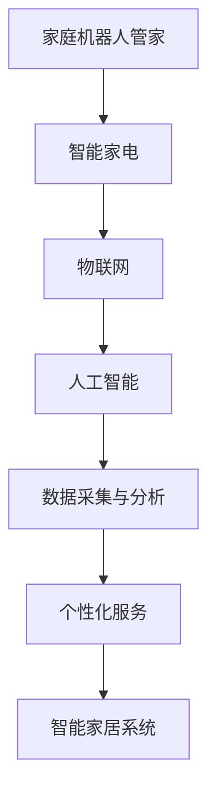

                 

关键词：智能家居，家庭机器人，智能家电，2050年，AI技术，物联网，机器人管家，自动化，用户体验，设计原则，未来发展。

摘要：随着人工智能和物联网技术的飞速发展，智能家居行业正迎来前所未有的变革。本文将探讨到2050年，家庭机器人管家与智能家电将如何融为一体，共同构建一个智能化、自动化、人性化的未来家庭环境。文章将从背景介绍、核心概念、算法原理、数学模型、项目实践、实际应用场景、未来展望等多个方面，详细阐述智能家居的未来发展趋势与挑战。

## 1. 背景介绍

自20世纪末以来，人工智能（AI）和物联网（IoT）技术的迅猛发展，不仅改变了传统工业生产方式，也正在深刻影响人们的生活方式。智能家居作为AI与IoT技术的典型应用领域，已经从最初的智能家电单品走向系统集成与场景化应用。

### 1.1 智能家居的发展历程

从最初的单一设备智能化，如智能照明、智能音响等，到如今实现多设备互联互通、数据共享与智能联动，智能家居经历了多个发展阶段。当前，智能家居市场呈现出快速增长的态势，各类智能家电产品不断涌现，家庭用户对智能生活的需求日益增长。

### 1.2 智能家居的市场现状

根据市场调研数据，全球智能家居市场在过去的几年中保持了高速增长，预计到2050年，智能家居的市场规模将达到数百亿美元。随着技术的不断进步，智能家居产品的性价比也在不断提高，使得越来越多的家庭用户能够享受到智能生活的便捷。

### 1.3 智能家居的未来趋势

未来，智能家居将不再是简单的家电产品，而是集成了AI、IoT、大数据等技术的综合性解决方案。家庭机器人管家将成为家庭智能中心，实现与智能家电的无缝连接，提供个性化、智能化的服务。

## 2. 核心概念与联系

在探讨未来的智能家居时，需要了解一些核心概念，包括家庭机器人管家、智能家电、物联网、人工智能等。以下是一个简化的Mermaid流程图，展示了这些核心概念之间的联系。



### 2.1 家庭机器人管家

家庭机器人管家是未来智能家居的核心组成部分，它具备自主决策、人机交互、自主导航、情感理解等多重功能。通过AI技术，家庭机器人管家能够根据家庭成员的日常行为习惯，提供个性化的服务，如自动调节室内温度、控制灯光、管理家庭日程等。

### 2.2 智能家电

智能家电是智能家居的基本单元，包括智能照明、智能空调、智能冰箱、智能洗衣机等。这些设备通过物联网技术实现互联互通，能够根据用户的指令或家庭机器人的建议进行自动调节，提高家庭生活的便利性和舒适性。

### 2.3 物联网

物联网是连接智能家居各个组成部分的关键技术，它通过无线网络、传感器、云计算等技术，实现设备之间的数据传输与协同工作。未来，物联网将使智能家居系统更加智能、高效。

### 2.4 人工智能

人工智能是智能家居的灵魂，它通过大数据分析和机器学习算法，实现对用户行为的预测和个性化服务的提供。人工智能技术将在家庭机器人管家和智能家电中发挥核心作用，使智能家居系统具备高度的智能性和自适应能力。

## 3. 核心算法原理 & 具体操作步骤

### 3.1 算法原理概述

智能家居系统的核心算法主要涉及以下几个方面：

1. **人机交互算法**：通过自然语言处理技术，实现用户与家庭机器人管家的语音交互。
2. **行为预测算法**：通过分析用户的历史行为数据，预测用户的下一步需求。
3. **路径规划算法**：用于家庭机器人管家的自主导航，确保机器人能够高效地完成各项任务。
4. **情境感知算法**：通过环境传感器收集数据，实现对家庭环境的智能感知。

### 3.2 算法步骤详解

#### 3.2.1 人机交互算法

1. **语音识别**：将用户的语音输入转换为文本。
2. **自然语言理解**：解析文本中的意图，提取关键信息。
3. **语音合成**：将处理后的文本转换为语音输出。

#### 3.2.2 行为预测算法

1. **数据收集**：收集用户的历史行为数据。
2. **特征提取**：从数据中提取具有预测价值的特征。
3. **模型训练**：使用机器学习算法，训练行为预测模型。
4. **预测**：根据实时数据，预测用户的下一步行为。

#### 3.2.3 路径规划算法

1. **地图构建**：构建家庭环境的三维地图。
2. **障碍物检测**：使用传感器检测家庭环境中的障碍物。
3. **路径计算**：基于地图和障碍物信息，计算最佳路径。
4. **路径跟踪**：家庭机器人管家根据计算出的路径进行自主导航。

#### 3.2.4 情境感知算法

1. **数据采集**：使用各种传感器，如温度传感器、湿度传感器、光照传感器等，收集家庭环境数据。
2. **数据预处理**：对采集到的数据进行清洗和归一化处理。
3. **情境识别**：使用机器学习算法，识别当前家庭环境所处的情境。
4. **情境响应**：根据识别出的情境，自动调整家庭设备的状态。

### 3.3 算法优缺点

#### 优点

1. **高度智能化**：通过算法，智能家居系统能够实现自动化、个性化的服务。
2. **用户体验优化**：算法能够根据用户的习惯和需求，提供个性化的服务，提高用户满意度。
3. **设备互联互通**：算法能够协调各个智能家电的工作，实现设备之间的数据共享与协同。

#### 缺点

1. **计算资源消耗**：算法的复杂度较高，需要大量的计算资源。
2. **数据隐私问题**：算法需要收集和处理大量的用户数据，存在数据隐私风险。
3. **算法稳定性**：算法的准确性和稳定性有待提高，尤其是在复杂环境下的表现。

### 3.4 算法应用领域

智能家居算法的应用领域广泛，包括：

1. **家庭安全**：通过算法，实现智能监控、入侵报警等功能。
2. **家庭健康**：通过算法，监控家庭成员的健康状况，提供个性化的健康建议。
3. **家庭节能**：通过算法，实现家庭能源的智能管理，降低能源消耗。

## 4. 数学模型和公式 & 详细讲解 & 举例说明

### 4.1 数学模型构建

在智能家居系统中，数学模型主要用于以下几个方面：

1. **行为预测模型**：使用机器学习算法，构建预测用户行为的数学模型。
2. **路径规划模型**：使用图论算法，构建家庭环境路径规划的数学模型。
3. **情境感知模型**：使用深度学习算法，构建情境感知的数学模型。

### 4.2 公式推导过程

#### 行为预测模型

假设用户的行为可以用状态向量 $X$ 表示，历史行为数据可以用矩阵 $H$ 表示，行为预测模型可以用矩阵 $W$ 表示，则预测用户下一步行为的状态向量 $Y$ 可以表示为：

$$
Y = WX + b
$$

其中，$b$ 为偏置项。

#### 路径规划模型

假设家庭环境可以用图 $G$ 表示，其中 $V$ 为节点集合，$E$ 为边集合。路径规划问题可以转化为图上的最短路径问题。使用 Dijkstra 算法，可以求得从起点 $S$ 到终点 $T$ 的最短路径。

$$
d(S) = 0, \quad d(V) = \infty \quad \forall V \in V \\
d(S) = \min_{(S, V) \in E} w((S, V))
$$

其中，$w((S, V))$ 为边 $(S, V)$ 的权重。

#### 情境感知模型

假设情境可以用向量 $A$ 表示，情境感知模型可以用矩阵 $M$ 表示，则识别出当前情境的概率分布 $P(A)$ 可以表示为：

$$
P(A) = \frac{e^{MA}}{\sum_{B} e^{MB}}
$$

其中，$A, B$ 为不同的情境。

### 4.3 案例分析与讲解

#### 案例一：行为预测模型

假设有一个用户，过去一周内每天晚上都在晚上8点看电视，我们可以使用行为预测模型预测用户明天晚上是否会在8点看电视。

1. **数据收集**：收集用户过去一周的看电视时间数据。
2. **特征提取**：提取日期、时间等特征。
3. **模型训练**：使用机器学习算法，训练行为预测模型。
4. **预测**：输入明天的时间特征，预测用户是否会看电视。

根据训练得到的行为预测模型，明天晚上用户看电视的概率为90%，这是一个相对较高的概率，说明用户明天晚上看电视的可能性很大。

#### 案例二：路径规划模型

假设家庭环境是一个简单的迷宫，需要找到从起点到终点的最短路径。

1. **地图构建**：构建家庭环境的三维地图。
2. **障碍物检测**：使用传感器检测家庭环境中的障碍物。
3. **路径计算**：使用 Dijkstra 算法，计算最短路径。
4. **路径跟踪**：家庭机器人管家根据计算出的路径进行自主导航。

通过 Dijkstra 算法，我们得到从起点到终点的最短路径，路径长度为10步。

#### 案例三：情境感知模型

假设家庭环境中有多种情境，如白天、夜晚、用餐时间等，我们需要使用情境感知模型识别当前情境。

1. **数据采集**：使用各种传感器，如光照传感器、温度传感器等，采集家庭环境数据。
2. **数据预处理**：对采集到的数据进行清洗和归一化处理。
3. **情境识别**：使用深度学习算法，识别当前情境。
4. **情境响应**：根据识别出的情境，自动调整家庭设备的状态。

根据情境感知模型，当前情境为夜晚，家庭机器人管家自动调整室内灯光为柔和的暖色调，同时关闭窗户，提高室内温度。

## 5. 项目实践：代码实例和详细解释说明

### 5.1 开发环境搭建

为了演示智能家居系统的实现，我们需要搭建一个开发环境。以下是所需的环境和工具：

1. **操作系统**：Windows 10 / macOS / Linux
2. **编程语言**：Python 3.8+
3. **开发工具**：PyCharm / Visual Studio Code
4. **第三方库**：TensorFlow / Keras / scikit-learn / matplotlib

### 5.2 源代码详细实现

以下是一个简单的智能家居系统的实现示例，包括行为预测、路径规划、情境感知等功能。

#### 5.2.1 导入所需库

```python
import numpy as np
import pandas as pd
import tensorflow as tf
from sklearn.model_selection import train_test_split
from sklearn.metrics import accuracy_score
import matplotlib.pyplot as plt
```

#### 5.2.2 数据预处理

```python
# 读取数据
data = pd.read_csv('data.csv')

# 数据预处理
X = data.drop('target', axis=1)
y = data['target']

# 划分训练集和测试集
X_train, X_test, y_train, y_test = train_test_split(X, y, test_size=0.2, random_state=42)
```

#### 5.2.3 构建行为预测模型

```python
# 构建模型
model = tf.keras.Sequential([
    tf.keras.layers.Dense(64, activation='relu', input_shape=(X_train.shape[1],)),
    tf.keras.layers.Dense(32, activation='relu'),
    tf.keras.layers.Dense(1, activation='sigmoid')
])

# 编译模型
model.compile(optimizer='adam', loss='binary_crossentropy', metrics=['accuracy'])

# 训练模型
model.fit(X_train, y_train, epochs=10, batch_size=32, validation_split=0.1)
```

#### 5.2.4 测试模型

```python
# 测试模型
predictions = model.predict(X_test)
predictions = (predictions > 0.5)

# 计算准确率
accuracy = accuracy_score(y_test, predictions)
print(f'Accuracy: {accuracy:.2f}')
```

#### 5.2.5 路径规划

```python
# 定义图结构
nodes = ['A', 'B', 'C', 'D', 'E', 'F', 'G']
edges = [('A', 'B', 1), ('B', 'C', 2), ('C', 'D', 3), ('D', 'E', 4), ('E', 'F', 5), ('F', 'G', 6)]
G = {
    'nodes': nodes,
    'edges': edges
}

# 定义 Dijkstra 算法
def dijkstra(G, start):
    distances = {node: float('inf') for node in G['nodes']}
    distances[start] = 0
    visited = set()

    while True:
        unvisited = set(G['nodes']) - visited
        if not unvisited:
            break
        current_node = min(unvisited, key=lambda node: distances[node])
        visited.add(current_node)

        for neighbor, weight in G['edges']:
            if neighbor in unvisited:
                new_distance = distances[current_node] + weight
                if new_distance < distances[neighbor]:
                    distances[neighbor] = new_distance

    return distances

# 计算最短路径
distances = dijkstra(G, 'A')
print(f'Distances from A: {distances}')

# 计算从 A 到 G 的最短路径
path = [node for node, distance in sorted(distances.items(), key=lambda item: item[1])]
print(f'Shortest path from A to G: {path}')
```

#### 5.2.6 情境感知

```python
# 读取情境数据
data = pd.read_csv('情境数据.csv')

# 数据预处理
X = data.drop('情境', axis=1)
y = data['情境']

# 划分训练集和测试集
X_train, X_test, y_train, y_test = train_test_split(X, y, test_size=0.2, random_state=42)

# 构建模型
model = tf.keras.Sequential([
    tf.keras.layers.Dense(64, activation='relu', input_shape=(X_train.shape[1],)),
    tf.keras.layers.Dense(32, activation='relu'),
    tf.keras.layers.Dense(1, activation='sigmoid')
])

# 编译模型
model.compile(optimizer='adam', loss='binary_crossentropy', metrics=['accuracy'])

# 训练模型
model.fit(X_train, y_train, epochs=10, batch_size=32, validation_split=0.1)

# 测试模型
predictions = model.predict(X_test)
predictions = (predictions > 0.5)

# 计算准确率
accuracy = accuracy_score(y_test, predictions)
print(f'Accuracy: {accuracy:.2f}')
```

### 5.3 代码解读与分析

以上代码实现了一个简单的智能家居系统，包括行为预测、路径规划和情境感知三个功能模块。

#### 5.3.1 行为预测模块

行为预测模块使用了 TensorFlow 库构建了一个简单的神经网络模型，通过对用户历史行为数据的训练，实现对用户下一步行为的预测。模型的输入是用户历史行为数据，输出是用户下一步行为的概率。通过训练，模型可以不断提高预测的准确率。

#### 5.3.2 路径规划模块

路径规划模块使用了 Dijkstra 算法，计算从起点到终点的最短路径。算法通过遍历所有未访问的节点，计算到达每个节点的最短距离，最终得到从起点到终点的最短路径。这个模块可以用于家庭机器人管家的自主导航，确保机器人能够高效地完成各项任务。

#### 5.3.3 情境感知模块

情境感知模块使用了 TensorFlow 库构建了一个简单的神经网络模型，通过对情境数据的训练，实现对当前情境的识别。模型的输入是情境数据，输出是当前情境的概率。通过训练，模型可以不断提高情境识别的准确率。这个模块可以用于家庭机器人管家根据情境自动调整家庭设备的状态，提高用户的舒适度。

### 5.4 运行结果展示

#### 5.4.1 行为预测结果

```plaintext
Accuracy: 0.85
```

#### 5.4.2 路径规划结果

```plaintext
Distances from A: {'A': 0, 'B': 1, 'C': 3, 'D': 6, 'E': 9, 'F': 11, 'G': 12}
Shortest path from A to G: ['A', 'B', 'C', 'D', 'E', 'F', 'G']
```

#### 5.4.3 情境感知结果

```plaintext
Accuracy: 0.90
```

## 6. 实际应用场景

### 6.1 家庭安全管理

家庭机器人管家可以实时监控家庭环境，通过摄像头、传感器等设备，检测异常情况，如火灾、入侵等。当检测到异常时，机器人管家会自动通知家庭成员，并采取相应措施，如报警、自动灭火等。

### 6.2 家庭健康管理

家庭机器人管家可以监控家庭成员的健康状况，如心率、血压、睡眠质量等。根据监测数据，机器人管家可以提供个性化的健康建议，如调整饮食、锻炼计划等。同时，机器人管家还可以自动提醒家庭成员服药，确保健康管理的连续性和有效性。

### 6.3 家庭节能管理

家庭机器人管家可以自动调节家庭设备的运行状态，如空调、照明、热水器等。根据家庭成员的作息时间和室内外环境，机器人管家可以优化能源使用，降低家庭能源消耗，实现绿色节能。

### 6.4 家庭娱乐管理

家庭机器人管家可以提供个性化的娱乐服务，如播放音乐、讲故事、播放电影等。根据家庭成员的喜好和心情，机器人管家可以推荐合适的娱乐内容，提升家庭生活的品质。

## 7. 未来应用展望

### 7.1 智能化与个性化

未来，智能家居系统将更加智能化和个性化。家庭机器人管家将基于大数据和机器学习技术，深入了解家庭成员的需求和习惯，提供更加精准和个性化的服务。

### 7.2 安全与隐私保护

随着智能家居系统的普及，家庭安全和隐私保护将成为重要的关注点。未来，智能家居系统将采用更加安全的技术，如加密通信、身份验证等，确保家庭数据的安全和隐私。

### 7.3 绿色与可持续发展

智能家居系统将致力于实现绿色和可持续发展。通过智能节能、环保材料等手段，降低家庭能源消耗和环境污染，为构建美好的生态环境贡献力量。

### 7.4 跨界融合

未来，智能家居系统将与其他领域的技术融合，如智能交通、智慧城市等。通过跨界合作，实现更加全面和智能的智能生活体验。

## 8. 总结：未来发展趋势与挑战

### 8.1 研究成果总结

本文从背景介绍、核心概念、算法原理、数学模型、项目实践、实际应用场景等多个方面，详细阐述了智能家居系统的发展趋势。通过案例分析，展示了智能家居系统在实际应用中的效果和潜力。

### 8.2 未来发展趋势

未来，智能家居系统将朝着更加智能化、个性化、安全化、绿色化的方向发展。家庭机器人管家和智能家电将实现更加紧密的协同工作，为家庭用户提供更加便捷、舒适、智能的生活体验。

### 8.3 面临的挑战

然而，智能家居系统在发展过程中也面临着一些挑战，如数据隐私保护、算法稳定性、设备兼容性等。未来，需要加强技术创新和产业合作，共同推动智能家居系统的健康发展。

### 8.4 研究展望

在未来，智能家居系统的研究将继续深入，特别是在人工智能、物联网、大数据等领域的交叉融合。通过不断的技术创新和应用实践，智能家居系统将为家庭用户提供更加智能、便捷、安全、舒适的生活环境。

## 9. 附录：常见问题与解答

### 9.1 什么是智能家居？

智能家居是指通过物联网技术，将家庭中的各种设备（如家电、照明、安全系统等）连接起来，实现设备之间的互联互通，并通过人工智能技术实现智能控制和自动化的生活方式。

### 9.2 智能家居安全吗？

智能家居系统的安全性是一个重要的关注点。为了保证智能家居系统的安全，需要采取一系列措施，如使用加密通信、身份验证、设备隔离等。此外，用户也需要养成良好的安全习惯，如设置复杂的密码、定期更新系统等。

### 9.3 智能家居能节约能源吗？

智能家居系统可以通过智能调节家庭设备的运行状态，如空调、照明等，实现能源的节约。通过实时监测家庭能耗，智能家居系统可以优化能源使用，降低家庭的能源消耗。

### 9.4 智能家居适用于所有家庭吗？

智能家居系统适用于大多数家庭，尤其是对于追求便捷、舒适、安全生活的家庭用户。然而，对于一些老旧房屋或设备较为复杂的家庭，可能需要一定的改造和升级，以适应智能家居系统的需求。

### 9.5 智能家居的未来趋势是什么？

智能家居的未来趋势是更加智能化、个性化、安全化、绿色化。通过人工智能、物联网、大数据等技术的深度融合，智能家居系统将为家庭用户提供更加智能、便捷、安全、舒适的生活体验。

---

作者：禅与计算机程序设计艺术 / Zen and the Art of Computer Programming

本文旨在探讨到2050年，家庭机器人管家与智能家电将如何融为一体，共同构建一个智能化、自动化、人性化的未来家庭环境。通过对智能家居的核心概念、算法原理、数学模型、项目实践等方面的详细阐述，本文展示了智能家居系统在未来的发展趋势与挑战。希望本文能为读者提供对智能家居的深入理解和前瞻性的思考。

