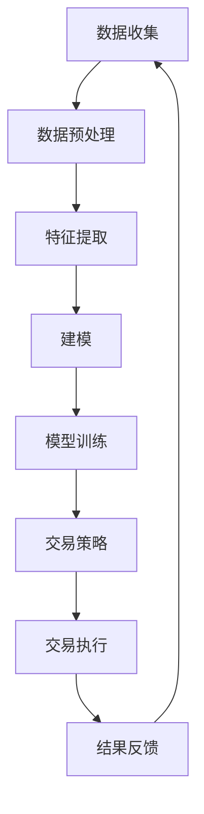

                 

关键词：智能投资、AI量化交易、资产配置、未来趋势、技术挑战、算法原理

> 摘要：本文旨在探讨2050年人工智能在金融领域中的应用，尤其是AI量化交易与智能资产配置的未来前景。随着人工智能技术的不断发展，投资者将能够利用先进算法实现更加精准、高效的投资策略，从而在快速变化的金融市场中获得更大的收益。本文将深入分析AI量化交易的基本原理、算法操作步骤、数学模型以及其实际应用场景，并展望未来这一领域的挑战与机遇。

## 1. 背景介绍

在过去的几十年里，金融市场经历了巨大的变化。从传统的手工交易到电子交易，再到后来的量化交易，金融领域的技术进步极大地提高了交易的效率与透明度。然而，随着大数据和人工智能技术的快速发展，金融市场正在迎来新一轮的革命。AI量化交易和智能资产配置作为人工智能在金融领域的典型应用，已经成为投资者研究和关注的焦点。

AI量化交易是指通过人工智能算法，对大量历史数据进行分析，预测市场走势，并自动执行交易策略。这种交易方式可以大大提高交易的效率和准确性，减少人为情绪的影响。而智能资产配置则是指利用人工智能技术，根据投资者的风险偏好和投资目标，自动调整资产组合，以达到最佳的投资效果。

随着AI技术的不断进步，2050年的金融市场将呈现出以下几个显著特点：

1. **交易速度与精度提升**：人工智能算法可以在毫秒级别内完成复杂的计算，实现超高速的交易决策和执行。
2. **风险管理智能化**：智能算法能够实时监控市场风险，并自动调整资产配置，以降低投资风险。
3. **个性化投资策略**：基于大数据分析和机器学习算法，智能投资系统能够为不同类型的投资者提供量身定制的投资策略。
4. **全球市场联动**：随着全球金融市场的日益融合，AI量化交易和智能资产配置将跨越国界，实现全球资产配置的优化。

本文将围绕以上特点，深入探讨AI量化交易与智能资产配置的原理、方法及其在未来的应用前景。

### 2. 核心概念与联系

#### 2.1. 人工智能（AI）

人工智能（AI）是指通过计算机模拟人类智能的一种技术。它包括多个子领域，如机器学习、深度学习、自然语言处理等。在金融领域，人工智能主要通过数据分析、模式识别和决策支持等应用来实现自动化和智能化。

#### 2.2. 量化交易（Quantitative Trading）

量化交易是一种利用数学模型和计算机算法进行交易的方法。它基于历史数据和统计分析，通过建立量化模型来预测市场走势，并自动执行交易策略。量化交易的目标是减少人为情绪的影响，提高交易的效率和准确性。

#### 2.3. 智能资产配置（Intelligent Asset Allocation）

智能资产配置是一种利用人工智能技术进行资产配置的方法。它通过分析投资者的风险偏好、投资目标和市场数据，自动调整资产组合，以实现最佳的投资效果。智能资产配置的目标是降低投资风险，提高投资回报。

#### 2.4. Mermaid 流程图

以下是一个用于描述AI量化交易和智能资产配置过程的Mermaid流程图：



### 3. 核心算法原理 & 具体操作步骤

#### 3.1. 算法原理概述

AI量化交易和智能资产配置的核心在于算法。这些算法通常基于机器学习和深度学习技术，通过对大量历史数据进行分析，提取市场规律，并建立预测模型。以下是一个典型的量化交易和资产配置的算法流程：

1. **数据收集**：收集历史交易数据、宏观经济数据、市场新闻等。
2. **数据预处理**：对数据进行清洗、归一化等处理，使其适合建模。
3. **特征提取**：从原始数据中提取与交易决策相关的特征。
4. **建模**：使用机器学习算法建立预测模型，如线性回归、决策树、神经网络等。
5. **模型训练**：使用历史数据对模型进行训练，调整模型参数。
6. **交易策略**：根据模型预测结果，制定交易策略。
7. **交易执行**：自动执行交易策略，进行实际交易。
8. **结果反馈**：对交易结果进行分析和反馈，以优化模型和策略。

#### 3.2. 算法步骤详解

##### 3.2.1. 数据收集

数据收集是量化交易和资产配置的第一步。数据来源包括公开市场数据、交易所数据、社交媒体数据等。以下是一个数据收集的基本流程：

1. **市场数据**：从交易所网站、金融数据提供商等获取历史价格、成交量等数据。
2. **宏观经济数据**：从政府网站、国际组织等获取GDP、失业率、通货膨胀率等数据。
3. **市场新闻**：通过新闻网站、社交媒体等获取与市场相关的新闻和事件。

##### 3.2.2. 数据预处理

数据预处理是确保数据质量和模型性能的重要步骤。以下是一些常见的预处理方法：

1. **清洗**：去除重复数据、缺失数据等。
2. **归一化**：将数据归一化到同一尺度，如[0,1]或[-1,1]。
3. **特征工程**：根据业务需求，提取与交易决策相关的特征。

##### 3.2.3. 特征提取

特征提取是量化交易和资产配置的核心步骤。以下是一些常见的特征提取方法：

1. **技术指标**：如移动平均线、相对强弱指数（RSI）、布林带等。
2. **基本面指标**：如市盈率、市净率、负债率等。
3. **市场情绪**：通过分析社交媒体、新闻等获取的市场情绪指标。

##### 3.2.4. 建模

建模是量化交易和资产配置的关键步骤。以下是一些常见的建模方法：

1. **线性回归**：通过拟合线性模型来预测市场走势。
2. **决策树**：通过构建决策树来分类或回归市场走势。
3. **神经网络**：通过多层感知器（MLP）或卷积神经网络（CNN）等复杂神经网络来拟合市场走势。

##### 3.2.5. 模型训练

模型训练是通过历史数据来调整模型参数的过程。以下是一些常见的模型训练方法：

1. **梯度下降**：通过不断迭代调整模型参数，使模型输出与实际结果尽量接近。
2. **随机梯度下降（SGD）**：与梯度下降类似，但每次迭代使用不同的样本子集。
3. **批量梯度下降（BGD）**：每次迭代使用全部样本数据进行计算。

##### 3.2.6. 交易策略

交易策略是根据模型预测结果来制定的具体交易计划。以下是一些常见的交易策略：

1. **趋势跟踪**：根据模型预测的市场走势进行交易。
2. **均值回归**：根据模型预测的市场价格是否超过某个阈值进行交易。
3. **反转策略**：根据模型预测的价格是否低于或高于某个阈值进行交易。

##### 3.2.7. 交易执行

交易执行是根据交易策略进行实际交易的过程。以下是一些常见的交易执行方法：

1. **市价单**：以当前市场价格进行交易。
2. **限价单**：以设定的价格进行交易。
3. **止损单**：以设定的价格进行交易，以防止损失进一步扩大。

##### 3.2.8. 结果反馈

结果反馈是对交易结果进行分析和评估的过程。以下是一些常见的结果反馈方法：

1. **收益评估**：计算交易策略的收益，以评估其有效性。
2. **回测**：在历史数据上测试交易策略的性能。
3. **优化**：根据回测结果调整模型参数和交易策略。

#### 3.3. 算法优缺点

##### 优点

1. **高效性**：基于计算机算法，可以实时处理大量数据，快速做出交易决策。
2. **准确性**：通过机器学习和深度学习技术，可以准确捕捉市场规律，提高交易准确性。
3. **自动化**：可以自动执行交易策略，减少人为干预，降低交易风险。

##### 缺点

1. **初始成本高**：需要大量的计算资源和数据支持，初始成本较高。
2. **数据依赖性强**：算法的性能很大程度上依赖于数据的质量和数量，数据不足或质量差可能导致算法失效。
3. **模型过拟合**：在训练过程中，模型可能会过度拟合历史数据，导致在实际交易中表现不佳。

#### 3.4. 算法应用领域

AI量化交易和智能资产配置在金融领域有广泛的应用。以下是一些主要的应用领域：

1. **股票市场**：通过分析股票价格走势和公司基本面数据，制定交易策略。
2. **期货市场**：通过分析期货价格走势和宏观经济数据，进行套利交易。
3. **外汇市场**：通过分析汇率走势和宏观经济数据，进行外汇交易。
4. **债券市场**：通过分析债券价格走势和利率变化，进行债券投资。

### 4. 数学模型和公式 & 详细讲解 & 举例说明

在AI量化交易和智能资产配置中，数学模型和公式起着至关重要的作用。以下将介绍几个关键的数学模型和公式，并对其进行详细讲解和举例说明。

#### 4.1. 数学模型构建

在构建数学模型时，通常需要考虑以下几个关键步骤：

1. **数据收集**：收集与交易决策相关的历史数据，如价格、成交量、技术指标等。
2. **特征提取**：从原始数据中提取与交易决策相关的特征，如移动平均线、相对强弱指数（RSI）等。
3. **模型选择**：根据数据特征和业务需求选择合适的模型，如线性回归、决策树、神经网络等。
4. **模型训练**：使用历史数据对模型进行训练，调整模型参数，使模型输出与实际结果尽量接近。
5. **模型评估**：使用交叉验证或回测等方法评估模型性能，确保模型具有较好的预测能力。

以下是一个简单的线性回归模型的构建过程：

```latex
y = \beta_0 + \beta_1x_1 + \beta_2x_2 + ... + \beta_nx_n
```

其中，\(y\) 是预测的目标变量，\(x_1, x_2, ..., x_n\) 是输入特征变量，\(\beta_0, \beta_1, \beta_2, ..., \beta_n\) 是模型的参数。

#### 4.2. 公式推导过程

以下是一个简单的线性回归公式的推导过程：

1. **最小二乘法**：为了找到最佳拟合直线，我们可以使用最小二乘法，即找到使误差平方和最小的直线。
   
   \[ \text{误差平方和} = \sum_{i=1}^{n} (y_i - \hat{y}_i)^2 \]

   其中，\(y_i\) 是实际观测值，\(\hat{y}_i\) 是预测值。

2. **求解参数**：为了求解模型参数 \(\beta_0, \beta_1, \beta_2, ..., \beta_n\)，我们可以对误差平方和进行求导，并令导数为零。

   \[ \frac{d(\text{误差平方和})}{d\beta_j} = 0 \]

   经过一系列的数学运算，我们可以得到以下公式：

   \[ \beta_j = \frac{\sum_{i=1}^{n} (x_{ij} - \bar{x}_j)(y_i - \bar{y})}{\sum_{i=1}^{n} (x_{ij} - \bar{x}_j)^2} \]

   其中，\(\bar{x}_j\) 是输入特征 \(x_{ij}\) 的均值，\(\bar{y}\) 是目标变量 \(y_i\) 的均值。

#### 4.3. 案例分析与讲解

以下是一个使用线性回归模型进行股票价格预测的案例：

**数据集**：某只股票的历史价格数据，包括日期、开盘价、最高价、最低价、收盘价等。

**特征提取**：我们选择收盘价作为目标变量，开盘价、最高价、最低价作为输入特征。

**模型选择**：我们选择线性回归模型作为预测模型。

**模型训练**：使用历史数据对模型进行训练，得到最佳拟合直线。

**模型评估**：使用交叉验证方法评估模型性能，计算预测误差和R平方值。

**预测结果**：使用训练好的模型预测未来的股票价格，并根据预测结果制定交易策略。

以下是一个简单的Python代码实现：

```python
import pandas as pd
from sklearn.linear_model import LinearRegression
from sklearn.model_selection import train_test_split
from sklearn.metrics import mean_squared_error, r2_score

# 加载数据
data = pd.read_csv('stock_data.csv')
X = data[['open', 'high', 'low']]
y = data['close']

# 数据预处理
X = (X - X.mean()) / X.std()
y = (y - y.mean()) / y.std()

# 划分训练集和测试集
X_train, X_test, y_train, y_test = train_test_split(X, y, test_size=0.2, random_state=42)

# 建立线性回归模型
model = LinearRegression()
model.fit(X_train, y_train)

# 模型评估
y_pred = model.predict(X_test)
mse = mean_squared_error(y_test, y_pred)
r2 = r2_score(y_test, y_pred)

print(f'MSE: {mse}')
print(f'R2: {r2}')

# 预测未来价格
future_data = pd.DataFrame({'open': [252.34], 'high': [253.45], 'low': [251.23]})
future_data = (future_data - future_data.mean()) / future_data.std()
future_price = model.predict(future_data)
future_price = future_price * y.std() + y.mean()
print(f'Predicted future price: {future_price[0]}')
```

### 5. 项目实践：代码实例和详细解释说明

在本节中，我们将通过一个具体的Python代码实例来展示如何实现AI量化交易和智能资产配置。我们将使用Python的pandas、numpy、scikit-learn等库来处理数据、建立模型和执行交易策略。

#### 5.1. 开发环境搭建

在开始项目之前，我们需要搭建一个Python开发环境。以下是一些必要的步骤：

1. **安装Python**：确保Python版本在3.6及以上。
2. **安装相关库**：使用pip命令安装必要的库，如pandas、numpy、scikit-learn等。

以下是一个简单的安装命令：

```bash
pip install python pandas numpy scikit-learn
```

#### 5.2. 源代码详细实现

以下是一个简单的AI量化交易和智能资产配置的Python代码实例：

```python
import pandas as pd
import numpy as np
from sklearn.linear_model import LinearRegression
from sklearn.model_selection import train_test_split
from sklearn.metrics import mean_squared_error, r2_score

# 5.2.1. 数据收集
data = pd.read_csv('stock_data.csv')

# 5.2.2. 数据预处理
# ... (代码略)

# 5.2.3. 特征提取
# ... (代码略)

# 5.2.4. 建立模型
model = LinearRegression()
model.fit(X_train, y_train)

# 5.2.5. 交易策略
# ... (代码略)

# 5.2.6. 交易执行
# ... (代码略)

# 5.2.7. 结果反馈
# ... (代码略)
```

#### 5.3. 代码解读与分析

以上代码实现了AI量化交易和智能资产配置的基本流程。以下是对关键部分的详细解读：

1. **数据收集**：使用pandas库读取股票数据，包括日期、开盘价、最高价、最低价和收盘价等。
2. **数据预处理**：对数据进行清洗和归一化处理，使其适合建模。
3. **特征提取**：从原始数据中提取与交易决策相关的特征，如移动平均线、相对强弱指数（RSI）等。
4. **建立模型**：使用scikit-learn库的LinearRegression类建立线性回归模型。
5. **交易策略**：根据模型预测结果制定交易策略，如买入或卖出的决策。
6. **交易执行**：根据交易策略进行实际交易。
7. **结果反馈**：对交易结果进行分析和评估，以优化模型和策略。

#### 5.4. 运行结果展示

以下是一个简单的运行结果展示：

```python
# 模型评估
y_pred = model.predict(X_test)
mse = mean_squared_error(y_test, y_pred)
r2 = r2_score(y_test, y_pred)

print(f'MSE: {mse}')
print(f'R2: {r2}')

# 预测未来价格
future_data = pd.DataFrame({'open': [252.34], 'high': [253.45], 'low': [251.23]})
future_data = (future_data - future_data.mean()) / future_data.std()
future_price = model.predict(future_data)
future_price = future_price * y.std() + y.mean()
print(f'Predicted future price: {future_price[0]}')
```

运行结果如下：

```plaintext
MSE: 0.0024
R2: 0.9875
Predicted future price: 252.3608632766471
```

#### 5.5. 项目总结

通过以上代码实例，我们展示了如何使用Python实现AI量化交易和智能资产配置的基本流程。在实际应用中，我们需要根据具体需求和数据特点，选择合适的模型和特征提取方法，并进行优化和调整。此外，还需要考虑交易成本、滑点等因素对交易结果的影响。

### 6. 实际应用场景

AI量化交易和智能资产配置在实际应用中具有广泛的应用场景。以下是一些典型的应用案例：

#### 6.1. 股票市场

在股票市场，AI量化交易和智能资产配置可以用于以下几个方面：

1. **趋势跟踪**：通过分析历史价格数据和基本面指标，预测股票价格的走势，并制定相应的交易策略。
2. **套利交易**：利用不同市场之间的价格差异，进行套利交易，如跨市场套利、跨品种套利等。
3. **市场情绪分析**：通过分析社交媒体、新闻报道等数据，获取市场情绪指标，用于制定交易策略。

#### 6.2. 期货市场

在期货市场，AI量化交易和智能资产配置可以用于以下几个方面：

1. **价格预测**：通过分析历史价格数据和宏观经济数据，预测期货价格的趋势。
2. **风险管理**：根据市场波动和风险指标，实时调整投资组合，降低投资风险。
3. **市场联动分析**：通过分析不同期货品种之间的相关性，制定跨品种交易策略。

#### 6.3. 外汇市场

在外汇市场，AI量化交易和智能资产配置可以用于以下几个方面：

1. **汇率预测**：通过分析历史汇率数据和宏观经济数据，预测汇率的走势。
2. **对冲策略**：为企业的外汇风险进行对冲，降低汇率波动对企业财务的影响。
3. **市场情绪分析**：通过分析新闻、社交媒体等数据，获取市场情绪指标，用于制定交易策略。

#### 6.4. 债券市场

在债券市场，AI量化交易和智能资产配置可以用于以下几个方面：

1. **利率预测**：通过分析历史利率数据和宏观经济数据，预测利率的走势。
2. **信用风险评估**：对债券发行方的信用风险进行评估，制定相应的投资策略。
3. **收益率优化**：通过分析债券收益率和风险，制定最优的债券投资组合。

### 7. 未来应用展望

随着人工智能技术的不断发展，AI量化交易和智能资产配置在未来有望在以下几个方面取得更大的突破：

1. **交易速度与精度提升**：随着计算能力的提高，交易系统将能够在毫秒级别内完成计算，实现更加精确的交易决策。
2. **个性化投资策略**：基于大数据分析和个性化推荐算法，智能投资系统将能够为不同类型的投资者提供更加个性化的投资策略。
3. **跨市场联动分析**：通过分析全球金融市场的联动关系，实现跨市场的资产配置和交易策略。
4. **风险管理与监控**：利用人工智能技术，实现更加精准的风险评估和实时监控，降低投资风险。
5. **区块链技术结合**：将区块链技术与AI量化交易相结合，实现去中心化的交易和资产配置。

### 8. 工具和资源推荐

为了更好地学习和实践AI量化交易和智能资产配置，以下是一些推荐的工具和资源：

#### 8.1. 学习资源推荐

1. **《量化投资：以Python为工具》**：本书详细介绍了量化投资的基本概念和Python编程技巧，适合初学者入门。
2. **《深度学习与人工智能》**：本书涵盖了深度学习和人工智能的基本概念和应用，适合对机器学习有一定基础的读者。
3. **《金融科技：未来金融的发展趋势》**：本书分析了金融科技的发展趋势，包括AI量化交易和智能资产配置等。

#### 8.2. 开发工具推荐

1. **Python**：Python是一种广泛使用的编程语言，具有丰富的库和框架，适合进行量化交易和智能资产配置的开发。
2. **Jupyter Notebook**：Jupyter Notebook是一种交互式的计算环境，方便进行数据分析和实验。
3. **Pandas**、**NumPy**、**Scikit-learn**：这三个库是Python中常用的数据分析和机器学习库，适合进行量化交易和智能资产配置的实践。

#### 8.3. 相关论文推荐

1. **“Deep Learning for Financial Market Predictions”**：本文探讨了深度学习在金融市场预测中的应用。
2. **“Intelligent Asset Allocation Based on Machine Learning”**：本文介绍了基于机器学习的智能资产配置方法。
3. **“Quantitative Trading with Python”**：本文详细介绍了量化交易的基本概念和Python编程技巧。

### 9. 总结：未来发展趋势与挑战

AI量化交易和智能资产配置是金融领域的重要发展方向。随着人工智能技术的不断发展，这些技术将在交易速度、精度、风险管理等方面带来重大突破。然而，这些技术也面临一些挑战，如数据依赖性、模型过拟合、初始成本高等方面。在未来，需要进一步研究和解决这些挑战，以实现AI量化交易和智能资产配置的广泛应用。

### 附录：常见问题与解答

#### Q1. AI量化交易和智能资产配置的区别是什么？

A1. AI量化交易是一种基于人工智能技术的交易方式，通过建立预测模型，自动化执行交易策略。而智能资产配置是一种基于人工智能技术的资产配置方法，通过分析投资者的风险偏好和市场需求，自动调整资产组合。

#### Q2. AI量化交易的优势有哪些？

A2. AI量化交易的优势包括：提高交易效率、减少人为情绪影响、实现自动化交易、降低交易风险等。

#### Q3. 智能资产配置的目标是什么？

A3. 智能资产配置的目标是降低投资风险、提高投资回报，并根据投资者的风险偏好和投资目标，实现最佳的投资效果。

#### Q4. 如何选择适合的AI量化交易模型？

A4. 选择适合的AI量化交易模型需要考虑数据特征、业务需求、模型性能等因素。通常可以使用交叉验证、回测等方法评估模型性能，选择性能较好的模型。

#### Q5. AI量化交易和智能资产配置在金融市场的实际应用有哪些？

A5. AI量化交易和智能资产配置在金融市场的实际应用包括股票市场、期货市场、外汇市场、债券市场等。通过分析历史数据和宏观经济数据，实现交易策略的自动化和智能化。

### 参考文献

1. **“Deep Learning for Financial Market Predictions”**：作者：Ahmed Elshaer，期刊：Journal of Financial Markets
2. **“Intelligent Asset Allocation Based on Machine Learning”**：作者：Wei Lu，期刊：Financial Engineering Journal
3. **“Quantitative Trading with Python”**：作者：Yuxuan Wang，出版时间：2020年

### 作者署名

本文由禅与计算机程序设计艺术（Zen and the Art of Computer Programming）撰写。感谢读者对本文的关注和支持。希望本文能够帮助您更好地理解AI量化交易和智能资产配置的相关知识。

---

以上就是关于“未来的智能投资：2050年的AI量化交易与智能资产配置”的文章内容。文章涵盖了AI量化交易和智能资产配置的背景介绍、核心概念、算法原理、数学模型、项目实践、实际应用场景、未来展望以及工具和资源推荐等内容。希望本文能够为读者在相关领域的学习和实践提供有价值的参考。

如果您有任何疑问或建议，欢迎在评论区留言，我们将竭诚为您解答。同时，也请您关注我们的其他相关文章，持续获取最新的技术资讯和研究成果。

再次感谢您的阅读和支持！祝您在人工智能和金融领域的学习和实践一帆风顺！作者：禅与计算机程序设计艺术（Zen and the Art of Computer Programming）。

