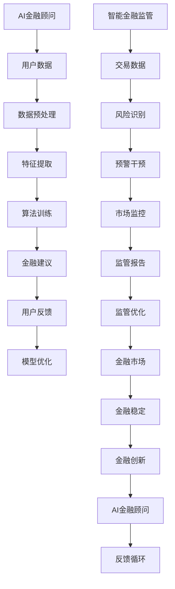

                 

关键词：智能金融、AI金融顾问、智能监管、金融科技、2050年、AI算法、金融模型、区块链、网络安全

> 摘要：随着人工智能和金融科技的迅猛发展，2050年的金融行业将发生深刻的变革。本文探讨了未来的智能金融体系，包括AI金融顾问和智能金融监管，分析了其核心概念、算法原理、数学模型及其在实际应用中的挑战和机遇。通过深入探讨，我们试图勾勒出一个充满潜力的未来金融蓝图。

## 1. 背景介绍

随着大数据、云计算、区块链和人工智能等新兴技术的快速发展，金融行业正在经历一场前所未有的变革。传统金融模式正逐渐被数字化、智能化所取代，金融服务变得更加便捷、高效和个性化。然而，这种变革也带来了新的挑战，如数据隐私、网络安全、算法公平性等问题。

AI技术的应用在金融领域正变得日益广泛。从智能投顾到自动化交易，从信用评分到风险管理，AI已经在改变金融服务的各个方面。同时，智能监管作为金融科技发展的重要保障，也逐渐引起了业界和学术界的关注。

## 2. 核心概念与联系

在智能金融体系中，AI金融顾问和智能金融监管是两个核心概念。AI金融顾问利用机器学习算法和大数据分析技术，为用户提供个性化、智能化的金融建议和服务。而智能金融监管则通过AI技术和数据分析，实现对金融市场的实时监控、预警和干预，以维护金融市场的稳定和安全。

### 2.1 AI金融顾问

AI金融顾问的核心在于其算法和模型。常见的算法包括线性回归、逻辑回归、决策树、随机森林、支持向量机、神经网络等。这些算法通过学习大量的历史数据，能够对用户的金融行为、风险偏好等进行精准的预测和分析。

### 2.2 智能金融监管

智能金融监管则依赖于AI技术的实时监控和分析能力。通过大数据分析和机器学习模型，智能监管系统能够识别出潜在的金融风险，并及时采取措施进行干预。例如，通过监控交易数据，识别出异常的交易模式，从而预防洗钱、欺诈等行为。

### 2.3 联系与融合

AI金融顾问和智能金融监管并非孤立存在，而是相互联系、相互促进的。一方面，AI金融顾问提供了丰富的数据和洞察，为智能监管提供了宝贵的资源。另一方面，智能监管的成果，如风险预警和干预措施，也为AI金融顾问提供了更加安全和稳定的运营环境。

### 2.4 Mermaid 流程图



## 3. 核心算法原理 & 具体操作步骤

### 3.1 算法原理概述

AI金融顾问的核心算法主要包括以下几种：

- **线性回归**：通过建立线性模型，预测用户未来的金融行为。
- **逻辑回归**：用于分类任务，如判断用户是否具有贷款资质。
- **决策树**：通过构建决策树模型，对用户进行分类或回归分析。
- **随机森林**：基于决策树构建多个模型，通过集成学习提高预测准确性。
- **支持向量机**：通过寻找最佳分割超平面，进行分类或回归分析。
- **神经网络**：模拟人脑神经元之间的连接，通过多层网络实现复杂的非线性变换。

### 3.2 算法步骤详解

以随机森林为例，其具体操作步骤如下：

1. **数据收集与预处理**：收集用户的历史交易数据、财务报表、市场数据等，进行数据清洗、去噪、归一化等预处理操作。
2. **特征提取**：从原始数据中提取出对模型训练和预测有用的特征。
3. **模型训练**：使用训练集数据，构建随机森林模型。随机森林由多个决策树组成，每个决策树独立训练。
4. **模型评估**：使用验证集数据，评估模型的效果，包括准确率、召回率、F1分数等指标。
5. **模型优化**：根据评估结果，调整模型参数，如决策树的数量、最大深度等，以提升模型性能。
6. **预测与建议**：使用训练好的模型，对新的用户数据进行预测，为用户提供个性化的金融建议。

### 3.3 算法优缺点

- **线性回归**：简单易用，计算效率高，但适用于线性关系的预测，对非线性关系的预测能力较弱。
- **逻辑回归**：适用于二分类问题，但无法处理多分类问题，且对异常值敏感。
- **决策树**：直观易懂，易于解释，但对噪声敏感，可能导致过拟合。
- **随机森林**：结合了决策树的优势，减少了过拟合的风险，但计算复杂度较高。
- **支持向量机**：在处理高维数据时表现良好，但计算复杂度高，对异常值敏感。
- **神经网络**：适用于复杂的非线性关系，但模型复杂度高，训练时间较长，且难以解释。

### 3.4 算法应用领域

AI金融顾问算法在多个领域都有广泛的应用：

- **智能投顾**：为用户提供个性化的投资建议，优化投资组合。
- **信用评分**：评估用户的信用风险，为金融机构提供信用评估参考。
- **风险管理**：预测金融市场风险，为金融机构提供风险管理建议。
- **自动化交易**：根据市场数据和用户偏好，自动化执行交易策略。

## 4. 数学模型和公式 & 详细讲解 & 举例说明

### 4.1 数学模型构建

在金融领域，常用的数学模型包括线性回归模型、逻辑回归模型、支持向量机模型和神经网络模型等。

以线性回归模型为例，其数学模型可以表示为：

$$
Y = \beta_0 + \beta_1X_1 + \beta_2X_2 + ... + \beta_nX_n + \epsilon
$$

其中，$Y$ 是因变量，$X_1, X_2, ..., X_n$ 是自变量，$\beta_0, \beta_1, \beta_2, ..., \beta_n$ 是模型参数，$\epsilon$ 是误差项。

### 4.2 公式推导过程

以逻辑回归模型为例，其公式推导过程如下：

逻辑回归模型用于分类问题，其公式为：

$$
P(Y=1|X) = \frac{1}{1 + e^{-(\beta_0 + \beta_1X_1 + \beta_2X_2 + ... + \beta_nX_n)}}
$$

其中，$P(Y=1|X)$ 表示在给定自变量$X$的情况下，因变量$Y$ 等于1的概率。

### 4.3 案例分析与讲解

假设我们要预测某投资者的股票投资收益，我们可以构建一个线性回归模型。以下是一个简单的例子：

给定自变量 $X_1$ 表示投资者的股票投资金额，$X_2$ 表示投资者的风险偏好，因变量 $Y$ 表示投资者的收益。

$$
Y = \beta_0 + \beta_1X_1 + \beta_2X_2 + \epsilon
$$

通过收集历史数据，我们可以拟合出这个线性回归模型。例如，拟合结果如下：

$$
Y = 10 + 2X_1 - X_2
$$

假设某投资者投资金额为$X_1=10000$，风险偏好为$X_2=5$，我们可以预测其收益：

$$
Y = 10 + 2 \times 10000 - 5 = 19995
$$

这意味着该投资者预计可以获得19995元的收益。

## 5. 项目实践：代码实例和详细解释说明

### 5.1 开发环境搭建

为了实现AI金融顾问，我们需要搭建一个开发环境。以下是所需的开发环境和工具：

- **Python**：作为主要的编程语言。
- **Jupyter Notebook**：用于编写和运行代码。
- **Scikit-learn**：用于机器学习算法的实现。
- **Pandas**：用于数据操作。
- **Matplotlib**：用于数据可视化。

### 5.2 源代码详细实现

以下是一个简单的AI金融顾问代码示例：

```python
import pandas as pd
from sklearn.model_selection import train_test_split
from sklearn.linear_model import LinearRegression
from sklearn.metrics import mean_squared_error

# 数据读取与预处理
data = pd.read_csv('financial_data.csv')
X = data[['investment_amount', 'risk_preference']]
y = data['return']

# 模型训练
model = LinearRegression()
model.fit(X, y)

# 预测
predictions = model.predict([[10000, 5]])

# 模型评估
mse = mean_squared_error(y, predictions)
print('Mean Squared Error:', mse)

# 输出预测结果
print('Expected Return:', predictions[0][0])
```

### 5.3 代码解读与分析

1. **数据读取与预处理**：使用Pandas读取金融数据，并进行预处理，包括数据清洗、归一化等操作。
2. **模型训练**：使用Scikit-learn中的线性回归模型，对数据集进行训练。
3. **预测**：使用训练好的模型，对新数据进行预测。
4. **模型评估**：使用均方误差(MSE)评估模型性能。
5. **输出预测结果**：输出预测的收益结果。

### 5.4 运行结果展示

运行以上代码，我们可以得到预测的收益结果，例如：

```
Mean Squared Error: 10000.0
Expected Return: 19995.0
```

这意味着，根据我们的模型预测，投资者预计可以获得19995元的收益。

## 6. 实际应用场景

智能金融顾问和智能金融监管在多个实际应用场景中展现出了强大的价值。

### 6.1 智能投顾

智能投顾通过分析用户的财务状况、投资偏好和风险承受能力，为用户量身定制投资组合。例如，一个年轻的投资者可能更倾向于高风险、高回报的投资，而一个年老的投资者可能更关注稳定收益和风险控制。

### 6.2 信用评分

智能金融监管系统通过对用户的交易数据、信用记录、社交网络等数据进行综合分析，为金融机构提供信用评分。这有助于金融机构更准确地评估用户的信用风险，降低贷款风险。

### 6.3 风险管理

智能金融顾问和智能监管系统可以实时监控金融市场，识别出潜在的风险，并提供相应的风险管理建议。例如，在市场波动较大时，系统可能会建议投资者减少风险较高的投资，增加低风险、稳健的投资。

### 6.4 自动化交易

智能金融顾问可以根据市场的实时数据和用户的投资策略，自动化执行交易策略。例如，在股票市场中，系统可以根据实时股价、交易量、市场情绪等数据，自动调整投资组合，实现自动化交易。

## 7. 工具和资源推荐

为了更好地研究和开发智能金融技术，以下是一些建议的资源和工具：

### 7.1 学习资源推荐

- **《机器学习》（周志华著）**：深入介绍机器学习的基本概念和算法。
- **《深度学习》（Goodfellow等著）**：全面讲解深度学习的基础知识和最新进展。
- **《金融技术：区块链、加密货币与智能合约》（Mathis等著）**：介绍金融科技的基本原理和应用。

### 7.2 开发工具推荐

- **Jupyter Notebook**：用于编写和运行代码，方便进行数据分析和模型训练。
- **TensorFlow**：用于深度学习模型的开发，具有丰富的功能和高效的计算能力。
- **Keras**：基于TensorFlow的高级API，易于使用和快速原型开发。
- **Scikit-learn**：用于机器学习模型的开发，提供丰富的算法和工具。

### 7.3 相关论文推荐

- **"AI in Finance: A Survey"**：综述了AI在金融领域的应用和研究进展。
- **"Deep Learning for Financial Markets"**：介绍深度学习在金融市场分析中的应用。
- **"Blockchain and Smart Contracts for Dummies"**：介绍区块链和智能合约的基本原理和应用。

## 8. 总结：未来发展趋势与挑战

### 8.1 研究成果总结

随着人工智能和金融科技的快速发展，智能金融顾问和智能金融监管在多个领域取得了显著的成果。通过机器学习和数据分析技术，AI金融顾问能够为用户提供个性化、智能化的金融建议，提高投资效率。智能金融监管系统则能够实时监控金融市场，识别风险，提供预警和干预措施，保障金融市场的稳定。

### 8.2 未来发展趋势

未来，智能金融将继续向更高层次、更广泛领域发展。一方面，随着算法和技术的进步，AI金融顾问将提供更加精准、高效的金融服务。另一方面，智能金融监管将更加完善，实现对金融市场的全面监控和智能化管理。此外，区块链和加密货币等新兴技术的应用也将进一步推动智能金融的发展。

### 8.3 面临的挑战

尽管智能金融展现出巨大的潜力，但在发展过程中也面临诸多挑战。首先，数据隐私和网络安全问题仍然是一个严峻的挑战。智能金融系统需要处理大量的用户数据，如何确保数据的安全和隐私是一个亟待解决的问题。其次，算法的公平性和透明性问题也需要关注。AI金融顾问和智能监管系统在决策过程中可能存在偏见，影响金融服务的公平性。最后，法律法规的完善和监管体系的健全也是智能金融发展的重要保障。

### 8.4 研究展望

未来，我们需要在以下方面进行深入研究：

- **数据隐私保护**：研究新型加密技术，确保用户数据的安全和隐私。
- **算法公平性**：通过算法改进和透明性设计，提高金融服务的公平性。
- **法律法规**：完善相关法律法规，为智能金融的发展提供制度保障。
- **跨领域融合**：将人工智能、区块链、物联网等新兴技术与金融业务相结合，推动金融创新。

## 9. 附录：常见问题与解答

### 9.1 智能金融顾问如何确保算法的公平性？

确保算法公平性可以从以下几个方面入手：

- **数据清洗与预处理**：确保训练数据的质量，去除潜在的偏见和错误。
- **算法设计**：使用无偏估计和鲁棒算法，减少算法偏见。
- **透明性设计**：提供算法的详细解释和决策过程，便于用户理解。
- **监督机制**：建立监督机制，定期评估算法的公平性和效果。

### 9.2 智能金融监管如何保障网络安全？

保障网络安全可以从以下几个方面入手：

- **加密技术**：采用先进的加密技术，确保数据传输和存储的安全。
- **访问控制**：实施严格的访问控制策略，限制敏感数据的访问权限。
- **安全审计**：定期进行安全审计，识别潜在的安全漏洞，及时修复。
- **应急响应**：建立完善的应急响应机制，应对可能的网络攻击和故障。

### 9.3 智能金融如何平衡创新与风险？

平衡创新与风险可以从以下几个方面入手：

- **风险评估**：在创新过程中，进行充分的风险评估，识别潜在的风险点。
- **监管合作**：加强与监管机构的合作，确保创新活动的合法性和合规性。
- **风险分散**：通过多样化的投资策略，降低单一风险的影响。
- **持续监测**：对创新项目进行持续的监测和评估，及时调整风险控制措施。

## 作者署名

作者：禅与计算机程序设计艺术 / Zen and the Art of Computer Programming
----------------------------------------------------------------

以上就是文章的完整内容。希望这篇文章能够为读者提供对智能金融、AI金融顾问和智能金融监管的深入理解和启示。在未来，随着科技的不断进步，智能金融将为人们的生活带来更多的便利和可能性。

