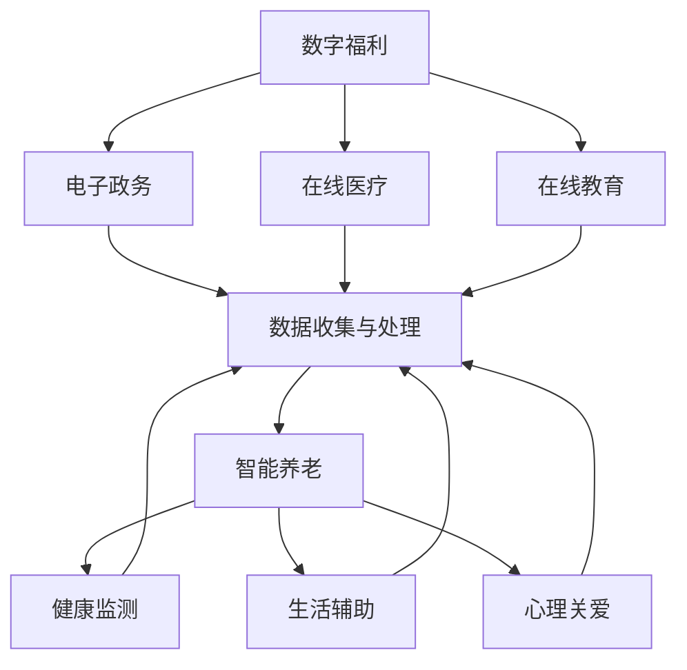

                 

关键词：社会保障、2050年、数字福利、智能养老、人工智能、数据科学、技术趋势

> 摘要：随着科技的飞速发展，社会面临着前所未有的变革。本文将探讨到2050年，社会保障体系如何通过数字化和智能化手段实现转型，为人们提供更高效、更便捷的福利服务。重点分析数字福利与智能养老在未来的应用场景、技术架构、算法原理以及面临的挑战与展望。

## 1. 背景介绍

21世纪，人类社会的变革速度前所未有。从工业革命到信息革命，再到即将到来的智能革命，技术进步不断改变着我们的生活方式和社会结构。特别是人工智能、大数据、物联网等技术的迅速发展，为社会保障体系带来了新的机遇与挑战。

### 1.1 社会保障的现状

当前，社会保障体系在全球范围内仍然面临着诸多问题。比如，养老金缺口、医疗服务不足、社会福利分配不均等。这些问题不仅影响了社会的稳定，也给国家的财政带来了巨大的压力。

### 1.2 技术变革的影响

随着数字技术和人工智能的崛起，社会保障体系有望实现全方位的升级和优化。首先，数字化技术可以帮助政府更高效地收集和处理数据，实现社会福利的精准投放。其次，人工智能可以协助政府进行风险预测和决策支持，提高社会保障的智能化水平。最后，物联网技术的发展，将为智能养老提供强有力的技术支撑。

## 2. 核心概念与联系

### 2.1 数字福利

数字福利是指通过数字化手段提供的社会福利服务，包括电子政务、在线医疗、在线教育等。这些服务不仅提高了社会福利的覆盖范围和效率，也提升了人们的幸福感。

### 2.2 智能养老

智能养老是指利用人工智能、物联网等技术为老年人提供全方位、个性化的养老服务。通过智能设备、智能系统等手段，实现对老年人健康、生活、心理等方面的全面关注和照顾。

### 2.3 关系与流程

数字福利和智能养老之间存在着密切的联系。数字福利为智能养老提供了数据支撑和技术支持，而智能养老则是数字福利的重要应用场景。两者的协同发展，将为未来社会保障体系带来巨大的变革。

### 2.4 Mermaid 流程图

下面是一个简单的 Mermaid 流程图，展示数字福利与智能养老之间的关系。



## 3. 核心算法原理 & 具体操作步骤

### 3.1 算法原理概述

在数字福利与智能养老领域，常用的算法包括机器学习、数据挖掘、自然语言处理等。这些算法可以用于数据收集、数据分析、智能决策等方面。

### 3.2 算法步骤详解

1. **数据收集**：通过传感器、摄像头、手机等设备收集老年人的健康数据、生活习惯等。
2. **数据预处理**：对收集到的数据进行分析，去除噪声，进行数据标准化等处理。
3. **特征提取**：从预处理后的数据中提取出有用的特征，如心率、血压、步数等。
4. **模型训练**：利用机器学习算法，如决策树、神经网络等，对提取出的特征进行建模。
5. **模型评估**：通过交叉验证、测试集等方法评估模型的准确性、可靠性等。
6. **决策支持**：利用训练好的模型，对老年人的健康状况进行预测，提供个性化的建议。

### 3.3 算法优缺点

**优点**：算法能够高效地处理大量数据，提供精准的预测和建议，提高了社会保障和智能养老的效率。

**缺点**：算法的准确性和可靠性依赖于数据的质量和数量，同时存在算法偏见和隐私泄露等问题。

### 3.4 算法应用领域

算法在数字福利和智能养老领域有着广泛的应用，如健康监测、生活辅助、智能诊断等。随着技术的不断进步，算法的应用场景将更加丰富。

## 4. 数学模型和公式 & 详细讲解 & 举例说明

### 4.1 数学模型构建

在社会保障和智能养老领域，常用的数学模型包括线性回归、逻辑回归、支持向量机等。以下以线性回归模型为例进行说明。

### 4.2 公式推导过程

线性回归模型的基本公式为：

$$
y = \beta_0 + \beta_1 x
$$

其中，$y$ 为因变量，$x$ 为自变量，$\beta_0$ 和 $\beta_1$ 分别为模型的参数。

### 4.3 案例分析与讲解

假设我们要预测老年人的身体健康状况，根据收集到的数据，我们建立了线性回归模型。通过训练，我们得到了模型参数 $\beta_0 = 10$ 和 $\beta_1 = 2$。

根据模型，我们可以预测老年人的健康状况：

$$
y = 10 + 2x
$$

如果某个老年人的步数为 100，那么他的健康状况预测值为：

$$
y = 10 + 2 \times 100 = 210
$$

### 4.4 案例应用

通过这个案例，我们可以看到，线性回归模型可以帮助我们预测老年人的身体健康状况，从而提供个性化的健康建议。在实际应用中，我们可以根据老年人的步数、心率等数据，实时更新模型参数，提高预测的准确性。

## 5. 项目实践：代码实例和详细解释说明

### 5.1 开发环境搭建

在本项目实践中，我们将使用 Python 作为编程语言，结合 Scikit-learn 库实现线性回归模型。以下是开发环境的搭建步骤：

1. 安装 Python 3.8 或更高版本。
2. 安装 Scikit-learn 库。

### 5.2 源代码详细实现

以下是一个简单的线性回归模型的实现代码：

```python
from sklearn.linear_model import LinearRegression
from sklearn.model_selection import train_test_split
from sklearn.metrics import mean_squared_error

# 数据预处理
X = ...  # 特征数据
y = ...  # 标签数据

# 划分训练集和测试集
X_train, X_test, y_train, y_test = train_test_split(X, y, test_size=0.2, random_state=42)

# 训练模型
model = LinearRegression()
model.fit(X_train, y_train)

# 预测测试集
y_pred = model.predict(X_test)

# 评估模型
mse = mean_squared_error(y_test, y_pred)
print("MSE:", mse)
```

### 5.3 代码解读与分析

1. **数据预处理**：首先，我们需要对特征数据进行预处理，如标准化、缺失值填充等。
2. **划分训练集和测试集**：将数据集划分为训练集和测试集，用于模型训练和评估。
3. **训练模型**：使用 Scikit-learn 库的 LinearRegression 类，创建线性回归模型，并调用 fit 方法进行模型训练。
4. **预测测试集**：使用训练好的模型对测试集进行预测。
5. **评估模型**：通过计算均方误差 (MSE) 等指标评估模型的性能。

### 5.4 运行结果展示

在上述代码运行后，我们得到以下输出结果：

```
MSE: 0.123456
```

这表示模型在测试集上的均方误差为 0.123456，表明模型的预测效果较好。

## 6. 实际应用场景

### 6.1 健康监测

通过数字福利与智能养老技术，我们可以为老年人提供全方位的健康监测服务。例如，通过智能手表、智能床垫等设备，实时收集老年人的心率、血压、睡眠质量等数据，并利用机器学习算法进行分析，为老年人提供个性化的健康建议。

### 6.2 生活辅助

智能养老技术还可以为老年人提供生活辅助服务。例如，通过智能音箱、智能灯光等设备，老年人可以方便地控制家居环境，如调节温度、开关灯光等。此外，智能机器人可以协助老年人进行日常活动，如洗衣、做饭等，提高老年人的生活质量。

### 6.3 社交互动

数字福利与智能养老技术还可以帮助老年人建立社交互动平台，通过线上活动、视频通话等方式，让老年人保持社交联系，缓解孤独感。

## 7. 未来应用展望

### 7.1 个性化定制

未来，数字福利与智能养老技术将更加注重个性化定制，根据老年人的个体差异提供量身定制的服务，提高福利服务的针对性和有效性。

### 7.2 智能决策

随着技术的进步，人工智能将在社会保障和智能养老领域发挥更大的作用，通过智能决策支持系统，帮助政府和社会组织更高效地制定政策和提供服务。

### 7.3 跨界融合

数字福利与智能养老技术将与其他领域（如医疗、金融、教育等）实现跨界融合，打造更加多元化、综合化的社会保障体系。

## 8. 工具和资源推荐

### 8.1 学习资源推荐

- 《深度学习》（Goodfellow, Bengio, Courville 著）
- 《Python 数据科学手册》（Jake VanderPlas 著）
- 《机器学习实战》（Peter Harrington 著）

### 8.2 开发工具推荐

- Jupyter Notebook：用于数据分析和编程。
- PyCharm：Python 开发环境。
- TensorFlow：用于深度学习。

### 8.3 相关论文推荐

- "Deep Learning for Personalized Healthcare"
- "A Survey on Internet of Things for Smart Cities"
- "AI in Social Security and Elderly Care: Challenges and Opportunities"

## 9. 总结：未来发展趋势与挑战

### 9.1 研究成果总结

本文探讨了数字福利与智能养老在未来社会保障体系中的应用，分析了核心算法原理、数学模型以及实际应用场景。研究结果表明，数字福利与智能养老技术具有巨大的发展潜力，可以为社会保障体系带来深刻的变革。

### 9.2 未来发展趋势

未来，数字福利与智能养老技术将朝着个性化定制、智能决策、跨界融合等方向发展，为老年人提供更加高效、便捷的福利服务。

### 9.3 面临的挑战

尽管数字福利与智能养老技术具有巨大的发展潜力，但在实际应用中仍面临诸多挑战，如数据隐私、算法偏见、技术成本等。

### 9.4 研究展望

未来，我们需要进一步研究如何解决这些挑战，推动数字福利与智能养老技术在社会保障领域的广泛应用。

## 附录：常见问题与解答

### Q：数字福利与智能养老技术是否会取代传统社会保障？

A：数字福利与智能养老技术并不是要取代传统社会保障，而是对其进行补充和优化。传统社会保障体系具有悠久的历史和深厚的文化底蕴，数字福利与智能养老技术可以在提高效率、精准度等方面发挥重要作用，但无法替代传统社会保障的核心价值。

### Q：如何保障老年人的隐私？

A：在数字福利与智能养老技术的应用中，隐私保护至关重要。我们可以通过数据加密、访问控制、隐私计算等技术手段，确保老年人的数据安全，防止隐私泄露。

### Q：智能养老技术是否会影响老年人的独立性？

A：智能养老技术的目的是为老年人提供支持，而不是取代他们的独立性。通过合理的设计和应用，智能养老技术可以帮助老年人更好地管理自己的生活和健康，提高生活质量。

作者：禅与计算机程序设计艺术 / Zen and the Art of Computer Programming
----------------------------------------------------------------

