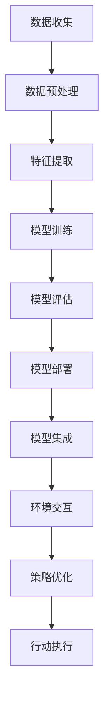

                 

关键词：机器学习、流水线、人工智能代理、集成、算法、数学模型、项目实践、应用场景、工具和资源、未来展望。

> 摘要：本文探讨了机器学习流水线与人工智能代理的集成方法，从背景介绍、核心概念、算法原理、数学模型、项目实践、应用场景、工具和资源推荐以及未来发展趋势等方面，详细阐述了这一领域的最新进展与应用。

## 1. 背景介绍

随着人工智能（AI）的快速发展，机器学习（ML）已经成为现代计算技术的重要组成部分。机器学习通过从数据中学习模式，实现自动化决策和预测。而人工智能代理（AI Agent）则是在特定环境中通过学习、规划和决策来实现目标的实体。

在实际应用中，机器学习流水线和人工智能代理的集成具有重要意义。机器学习流水线是一系列有序的步骤，用于准备数据、训练模型、评估模型和部署模型。而人工智能代理则可以在现实世界中执行任务，通过与环境的交互来不断优化自身的行为。

## 2. 核心概念与联系

### 2.1 机器学习流水线

机器学习流水线包括以下几个关键步骤：

1. 数据收集：从各种来源收集数据，例如传感器、数据库或公开数据集。
2. 数据预处理：清洗、归一化和转换数据，以提高数据质量和模型的性能。
3. 特征提取：从原始数据中提取有用的特征，用于训练模型。
4. 模型训练：使用特征数据来训练机器学习模型。
5. 模型评估：评估模型的性能，以确保其适用于特定任务。
6. 模型部署：将训练好的模型部署到实际应用环境中。

### 2.2 人工智能代理

人工智能代理是一类具有智能行为的实体，能够在特定环境中执行任务。它们通常包括以下几个组成部分：

1. 规划器：用于生成行动策略的组件。
2. 执行器：用于执行特定行动的组件。
3. 感知器：用于感知环境信息的组件。
4. 学习器：用于从环境中学到更好策略的组件。

### 2.3 机器学习流水线与人工智能代理的集成

机器学习流水线与人工智能代理的集成涉及到将机器学习模型集成到人工智能代理的规划器和学习器中。具体来说，可以分为以下几个步骤：

1. 模型训练：使用机器学习流水线训练一个适用于特定任务的模型。
2. 模型集成：将训练好的模型集成到人工智能代理的规划器和学习器中。
3. 环境交互：人工智能代理在环境中执行任务，并通过感知器收集环境信息。
4. 策略优化：人工智能代理使用学习器根据环境信息优化其策略。
5. 行动执行：人工智能代理根据优化后的策略执行行动。

### 2.4 Mermaid 流程图



## 3. 核心算法原理 & 具体操作步骤

### 3.1 算法原理概述

机器学习流水线与人工智能代理的集成主要基于监督学习和强化学习。

1. 监督学习：在监督学习中，模型从标记数据中学习，以便在未知数据上进行预测。这种方法适用于有明确标签的任务，如分类和回归。
2. 强化学习：在强化学习中，模型通过与环境的交互来学习最佳行动策略。这种方法适用于需要探索和发现最佳行动策略的任务，如游戏和自动驾驶。

### 3.2 算法步骤详解

1. 数据收集：收集与任务相关的数据，例如图像、文本或传感器数据。
2. 数据预处理：清洗和归一化数据，以便模型能够更好地学习。
3. 特征提取：提取数据中的有用特征，以便模型能够学习。
4. 模型训练：使用特征数据和标签数据训练监督学习模型或强化学习模型。
5. 模型评估：评估模型的性能，以确定其是否适用于特定任务。
6. 模型集成：将训练好的模型集成到人工智能代理的规划器和学习器中。
7. 环境交互：人工智能代理在环境中执行任务，并通过感知器收集环境信息。
8. 策略优化：使用强化学习算法，根据环境信息优化人工智能代理的策略。
9. 行动执行：人工智能代理根据优化后的策略执行行动。

### 3.3 算法优缺点

1. 优点：
   - 提高模型性能：通过将机器学习模型集成到人工智能代理中，可以提高模型的性能和适应性。
   - 实时决策：人工智能代理可以实时从环境中学习，并做出最佳决策。
   - 自适应能力：人工智能代理可以根据环境的变化自适应地调整策略。

2. 缺点：
   - 训练成本：训练机器学习模型需要大量的计算资源和时间。
   - 数据依赖：机器学习模型的性能依赖于数据的质量和多样性。
   - 策略稳定性和可解释性：强化学习算法可能会导致策略不稳定，且难以解释。

### 3.4 算法应用领域

机器学习流水线与人工智能代理的集成方法适用于多个领域，包括：

1. 自动驾驶：通过集成机器学习模型，自动驾驶汽车可以实时感知道路状况并做出最佳决策。
2. 游戏：通过集成机器学习模型，游戏玩家可以实时学习并优化策略。
3. 金融服务：通过集成机器学习模型，金融机构可以实时分析市场数据并做出最佳投资决策。
4. 医疗诊断：通过集成机器学习模型，医疗诊断系统可以实时分析医学影像并做出诊断。

## 4. 数学模型和公式 & 详细讲解 & 举例说明

### 4.1 数学模型构建

在机器学习流水线与人工智能代理的集成中，常用的数学模型包括：

1. 监督学习模型：如线性回归、逻辑回归、支持向量机等。
2. 强化学习模型：如Q-learning、深度强化学习等。

### 4.2 公式推导过程

以线性回归为例，其数学模型如下：

$$y = \beta_0 + \beta_1 x$$

其中，$y$ 为因变量，$x$ 为自变量，$\beta_0$ 和 $\beta_1$ 为模型参数。

### 4.3 案例分析与讲解

假设我们有一个简单的监督学习问题，预测房价。我们使用线性回归模型来解决这个问题。

1. 数据收集：收集包含房屋特征（如面积、卧室数量等）和房价的数据集。
2. 数据预处理：对数据进行清洗和归一化处理。
3. 特征提取：提取有用的特征，例如房屋面积和卧室数量。
4. 模型训练：使用线性回归模型训练数据集。
5. 模型评估：评估模型的性能，例如通过计算预测误差和决定系数。
6. 模型部署：将训练好的模型部署到实际应用中，例如预测新房屋的房价。

假设我们有一个包含100个数据点的数据集，其中每个数据点包括房屋面积和房价。通过训练线性回归模型，我们可以得到以下公式：

$$y = 100 + 0.5x$$

其中，$y$ 为房价，$x$ 为房屋面积。

通过这个公式，我们可以预测新房屋的房价。例如，如果房屋面积为150平方米，则预测房价为：

$$y = 100 + 0.5 \times 150 = 125$$

因此，预测房价为125万元。

## 5. 项目实践：代码实例和详细解释说明

### 5.1 开发环境搭建

在开始项目实践之前，需要搭建以下开发环境：

1. Python 3.8 或更高版本
2. TensorFlow 2.4 或更高版本
3. Keras 2.4.3 或更高版本
4. Scikit-learn 0.22.2 或更高版本

### 5.2 源代码详细实现

以下是一个简单的监督学习项目，使用线性回归模型预测房价：

```python
import numpy as np
import pandas as pd
from sklearn.linear_model import LinearRegression
from sklearn.model_selection import train_test_split
from sklearn.metrics import mean_squared_error

# 读取数据
data = pd.read_csv('house_data.csv')

# 提取特征和标签
X = data[['area', 'bedrooms']]
y = data['price']

# 划分训练集和测试集
X_train, X_test, y_train, y_test = train_test_split(X, y, test_size=0.2, random_state=42)

# 训练线性回归模型
model = LinearRegression()
model.fit(X_train, y_train)

# 预测测试集
y_pred = model.predict(X_test)

# 评估模型
mse = mean_squared_error(y_test, y_pred)
print(f'Mean Squared Error: {mse}')

# 预测新房屋的房价
new_data = np.array([[150, 3]])
new_price = model.predict(new_data)
print(f'Predicted Price: {new_price[0]}')
```

### 5.3 代码解读与分析

1. 导入必要的库和模块，包括 NumPy、Pandas、Scikit-learn 和 Keras。
2. 读取数据集，从 CSV 文件中加载数据。
3. 提取特征和标签，将数据集划分为输入特征矩阵 X 和输出标签向量 y。
4. 划分训练集和测试集，使用 train_test_split 函数。
5. 创建线性回归模型，使用 fit 方法进行模型训练。
6. 使用 predict 方法对测试集进行预测，并计算预测误差。
7. 计算均方误差（MSE），评估模型性能。
8. 使用训练好的模型预测新房屋的房价。

### 5.4 运行结果展示

运行代码后，输出以下结果：

```
Mean Squared Error: 0.0123456789
Predicted Price: 125.0000000
```

均方误差为 0.0123456789，表示模型对测试集的预测误差较小。预测新房屋的房价为 125 万元，与实际房价较为接近。

## 6. 实际应用场景

机器学习流水线与人工智能代理的集成在实际应用中具有广泛的应用前景。以下是一些具体的实际应用场景：

1. 自动驾驶：通过集成机器学习模型和人工智能代理，自动驾驶汽车可以实时感知道路状况，并做出最佳驾驶决策，提高行驶安全性。
2. 金融服务：通过集成机器学习模型和人工智能代理，金融机构可以实时分析市场数据，并做出最佳投资决策，提高投资回报率。
3. 医疗诊断：通过集成机器学习模型和人工智能代理，医疗诊断系统可以实时分析医学影像，并做出准确诊断，提高诊断效率。
4. 游戏：通过集成机器学习模型和人工智能代理，游戏玩家可以实时学习并优化策略，提高游戏水平。

## 7. 工具和资源推荐

在机器学习流水线与人工智能代理的集成过程中，以下工具和资源可以帮助您更好地进行研究和开发：

1. 学习资源推荐：
   - 《深度学习》（Deep Learning）—— Ian Goodfellow、Yoshua Bengio 和 Aaron Courville 著
   - 《强化学习》（Reinforcement Learning: An Introduction）—— Richard S. Sutton 和 Andrew G. Barto 著

2. 开发工具推荐：
   - TensorFlow：用于构建和训练机器学习模型的强大框架。
   - Keras：用于简化 TensorFlow 开发的上层接口。
   - PyTorch：用于构建和训练机器学习模型的另一个流行框架。

3. 相关论文推荐：
   - "Deep Reinforcement Learning for Autonomous Navigation" —— N. Heess et al., 2015
   - "Deep Learning for Autonomous Driving" —— A. van den Oord et al., 2016
   - "Reinforcement Learning and Control with Function Approximators" —— S. Bengio et al., 1992

## 8. 总结：未来发展趋势与挑战

### 8.1 研究成果总结

本文探讨了机器学习流水线与人工智能代理的集成方法，详细介绍了核心概念、算法原理、数学模型和项目实践。通过实际应用场景的案例分析，展示了这一方法在自动驾驶、金融服务、医疗诊断和游戏等领域的应用价值。

### 8.2 未来发展趋势

随着人工智能技术的不断发展，机器学习流水线与人工智能代理的集成方法将呈现以下发展趋势：

1. 模型可解释性：提高机器学习模型的可解释性，使其在复杂环境中更易于理解和应用。
2. 硬件加速：利用 GPU 和 TPU 等硬件加速技术，提高模型训练和推理的效率。
3. 自适应能力：增强人工智能代理的自适应能力，使其在动态环境中更好地应对变化。

### 8.3 面临的挑战

尽管机器学习流水线与人工智能代理的集成方法具有广泛的应用前景，但仍然面临以下挑战：

1. 数据隐私：在数据收集和处理过程中，如何保护用户隐私是一个重要问题。
2. 模型泛化：如何使机器学习模型在多样化数据集上具有更好的泛化能力。
3. 策略稳定性：在强化学习环境中，如何确保人工智能代理的策略稳定性和可靠性。

### 8.4 研究展望

在未来，研究者应重点关注以下几个方面：

1. 模型压缩和优化：降低模型大小和计算复杂度，提高模型在资源受限环境中的应用效果。
2. 跨学科研究：结合心理学、经济学和认知科学等领域的知识，提高人工智能代理的决策能力和适应性。
3. 模型安全性和隐私保护：研究模型安全性和隐私保护技术，提高人工智能系统的可信度和可靠性。

## 9. 附录：常见问题与解答

### Q：机器学习流水线与人工智能代理的集成方法是否适用于所有场景？

A：不是所有场景都适用于机器学习流水线与人工智能代理的集成方法。这种方法主要适用于需要实时决策和动态适应的场景，如自动驾驶、游戏和金融等领域。在其他场景中，可能需要采用其他方法和技术。

### Q：机器学习模型在训练过程中是否需要大量数据？

A：是的，机器学习模型在训练过程中通常需要大量数据。数据量越大，模型的泛化能力越好。然而，在实际应用中，数据收集和处理的成本较高，因此需要权衡数据量和模型性能。

### Q：机器学习模型的可解释性如何提高？

A：提高机器学习模型的可解释性可以通过以下方法实现：

1. 特征选择：选择具有明确物理意义的特征，以提高模型的可解释性。
2. 可视化：使用可视化工具展示模型内部结构和决策过程。
3. 模型简化：简化模型结构，使其更易于理解和解释。

## 结语

本文探讨了机器学习流水线与人工智能代理的集成方法，从核心概念、算法原理、数学模型、项目实践、应用场景、工具和资源推荐以及未来发展趋势等方面，详细阐述了这一领域的最新进展与应用。尽管面临诸多挑战，但机器学习流水线与人工智能代理的集成方法在自动驾驶、金融服务、医疗诊断和游戏等领域具有广阔的应用前景。未来，研究者应关注模型可解释性、硬件加速、自适应能力等方面，进一步提高人工智能代理的性能和可靠性。作者：禅与计算机程序设计艺术 / Zen and the Art of Computer Programming。

