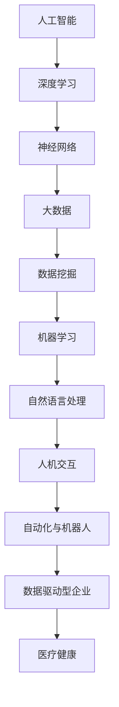
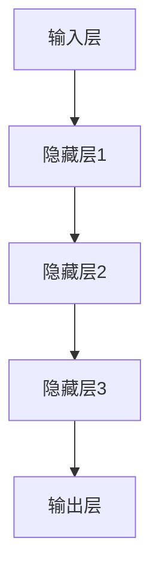

                 

关键词：人工智能、创业、大模型、未来、深度学习、技术应用、产业趋势

> 摘要：本文由世界著名人工智能专家李开复先生的主张为出发点，深入探讨了人工智能领域的创业机会、大模型技术的发展趋势及其对未来社会的影响。文章将从核心概念、算法原理、应用案例、数学模型等多个维度，全面解析人工智能领域的热点问题，为读者提供宝贵的见解和指导。

## 1. 背景介绍

### 1.1 人工智能与创业

人工智能（AI）作为21世纪最具颠覆性的技术之一，已经在全球范围内引发了广泛的关注和投资。随着技术的不断进步和应用场景的拓展，人工智能不仅推动了传统行业的数字化转型，还催生了一批具有创新力和竞争力的创业公司。

李开复先生认为，人工智能领域的创业机会主要分布在以下几个方面：

- **数据驱动型企业**：依靠海量数据收集和智能分析，为企业提供精准的决策支持。
- **自动化与机器人**：通过自动化技术和机器人应用，提升生产效率和服务质量。
- **人机交互**：利用自然语言处理和语音识别技术，改善人与机器的互动体验。
- **医疗健康**：利用人工智能辅助诊断和预测，提高医疗服务的效率和准确性。

### 1.2  大模型技术发展

大模型技术是人工智能领域的一个重要分支，主要涉及深度学习和自然语言处理等前沿技术。近年来，随着计算能力的提升和数据量的激增，大模型技术取得了显著的突破，推动了人工智能的快速发展。

大模型技术的核心在于训练大规模的神经网络模型，通过不断优化参数，使其能够识别复杂的模式，从而实现高性能的预测和决策。李开复先生认为，大模型技术在未来将继续发挥重要作用，成为推动人工智能应用的关键驱动力。

## 2. 核心概念与联系

在探讨人工智能创业与大模型技术之前，我们有必要了解一些核心概念和它们之间的联系。以下是一个简化的 Mermaid 流程图，用于展示这些核心概念及其相互关系：



### 2.1 深度学习与神经网络

深度学习是一种基于多层神经网络的学习方法，通过模拟人脑神经网络的结构和功能，实现对复杂数据的高效处理。神经网络作为深度学习的基础，通过前向传播和反向传播算法，不断调整权重，提高模型的预测能力。

### 2.2 大数据与数据挖掘

大数据是指数据量巨大、类型复杂、变化迅速的数据集合。数据挖掘则是一种通过算法和统计方法，从大量数据中提取有价值信息的技术。大数据和数据挖掘的结合，使得人工智能能够在更多领域实现突破。

### 2.3 机器学习与自然语言处理

机器学习是人工智能的核心技术之一，通过算法和统计模型，使计算机能够自动学习和适应新任务。自然语言处理（NLP）是机器学习的一个分支，主要研究如何使计算机理解和生成人类语言。

### 2.4 人机交互与自动化与机器人

人机交互是研究人与计算机之间如何高效互动的学科。自动化与机器人技术则通过人工智能算法，实现机器的自动化操作和智能化决策。人机交互与自动化与机器人的结合，推动了人工智能在服务业、制造业等领域的广泛应用。

## 3. 核心算法原理 & 具体操作步骤

### 3.1 算法原理概述

在人工智能领域，核心算法主要分为监督学习、无监督学习和强化学习三种。监督学习通过已标记的数据训练模型，适用于分类和回归任务；无监督学习不依赖于已标记数据，旨在发现数据中的隐藏结构；强化学习通过奖励机制，使模型不断优化行为策略。

大模型技术通常采用深度学习算法，通过多层神经网络结构，实现高性能的预测和决策。以下是一个简化的神经网络结构图：



### 3.2 算法步骤详解

#### 3.2.1 数据预处理

- **数据清洗**：去除噪声、填补缺失值，确保数据质量。
- **特征工程**：提取关键特征，降低维度，提高模型训练效率。
- **数据归一化**：调整数据分布，使模型收敛更快。

#### 3.2.2 模型训练

- **初始化权重**：随机初始化神经网络权重。
- **前向传播**：将输入数据传递到网络，计算输出。
- **反向传播**：根据输出误差，更新网络权重。
- **迭代优化**：重复前向传播和反向传播，直到模型收敛。

#### 3.2.3 模型评估

- **交叉验证**：将数据集划分为训练集和验证集，评估模型性能。
- **指标评估**：使用准确率、召回率、F1值等指标，评估模型在不同任务上的表现。

### 3.3 算法优缺点

#### 优点：

- **强大的建模能力**：能够处理复杂数据和大规模任务。
- **高效性**：通过并行计算和分布式训练，提高模型训练速度。
- **泛化能力**：在未见过的数据上，仍能保持较高的性能。

#### 缺点：

- **数据需求**：需要大量高质量的数据支持。
- **计算资源消耗**：训练过程需要大量计算资源和存储空间。
- **解释性较差**：模型的决策过程较为复杂，难以解释。

### 3.4 算法应用领域

大模型技术在各个领域都有广泛应用，以下是一些典型应用场景：

- **金融**：信用评估、风险控制、投资策略。
- **医疗**：疾病预测、诊断辅助、个性化治疗。
- **零售**：客户行为分析、推荐系统、库存管理。
- **制造业**：生产优化、设备故障预测、质量控制。
- **交通**：交通流量预测、自动驾驶、智能交通管理。

## 4. 数学模型和公式 & 详细讲解 & 举例说明

### 4.1 数学模型构建

在人工智能领域，常用的数学模型包括线性回归、逻辑回归、支持向量机（SVM）等。以下以线性回归为例，介绍数学模型的构建过程。

#### 4.1.1 线性回归模型

线性回归模型旨在找到一条最佳拟合直线，以最小化预测误差。其数学模型可以表示为：

$$
y = w_0 + w_1 \cdot x
$$

其中，$y$ 是预测值，$x$ 是自变量，$w_0$ 和 $w_1$ 分别是模型的权重。

#### 4.1.2 最小二乘法

为了找到最佳拟合直线，我们可以使用最小二乘法，通过最小化残差平方和来求解权重。残差可以表示为：

$$
r_i = y_i - \hat{y}_i
$$

其中，$\hat{y}_i$ 是预测值。最小二乘法的目标是最小化残差平方和：

$$
\min_{w_0, w_1} \sum_{i=1}^{n} r_i^2
$$

通过求解这个优化问题，我们可以得到最佳拟合直线的权重。

### 4.2 公式推导过程

为了求解线性回归模型的权重，我们可以使用最小二乘法。以下是具体的推导过程：

#### 4.2.1 残差平方和

首先，我们需要计算残差平方和。对于每个数据点 $(x_i, y_i)$，残差可以表示为：

$$
r_i = y_i - (w_0 + w_1 \cdot x_i)
$$

则残差平方和为：

$$
S = \sum_{i=1}^{n} r_i^2 = \sum_{i=1}^{n} (y_i - (w_0 + w_1 \cdot x_i))^2
$$

#### 4.2.2 求导

为了最小化 $S$，我们可以对 $S$ 关于 $w_0$ 和 $w_1$ 求导，并令导数等于零。首先，对 $w_0$ 求导：

$$
\frac{\partial S}{\partial w_0} = -2 \sum_{i=1}^{n} (y_i - (w_0 + w_1 \cdot x_i))
$$

然后，对 $w_1$ 求导：

$$
\frac{\partial S}{\partial w_1} = -2 \sum_{i=1}^{n} (y_i - (w_0 + w_1 \cdot x_i)) \cdot x_i
$$

#### 4.2.3 求解权重

将导数等于零，我们可以得到如下方程组：

$$
\begin{cases}
\sum_{i=1}^{n} (y_i - (w_0 + w_1 \cdot x_i)) = 0 \\
\sum_{i=1}^{n} (y_i - (w_0 + w_1 \cdot x_i)) \cdot x_i = 0
\end{cases}
$$

通过解这个方程组，我们可以得到最佳拟合直线的权重 $w_0$ 和 $w_1$。

### 4.3 案例分析与讲解

为了更好地理解线性回归模型的推导过程，我们来看一个具体的案例。

#### 案例背景

假设我们要预测一家餐厅的日营业额，已知自变量是餐厅的人均消费（x）和天气状况（y，取值范围：0-100），数据如下：

| 日期 | 人均消费（x） | 天气状况（y） | 日营业额（y） |
| ---- | ---- | ---- | ---- |
| 2023-01-01 | 50 | 80 | 3000 |
| 2023-01-02 | 60 | 70 | 3200 |
| 2023-01-03 | 70 | 90 | 3500 |
| 2023-01-04 | 80 | 60 | 3300 |
| 2023-01-05 | 90 | 80 | 3600 |

#### 案例分析

1. **数据预处理**：

   - 对人均消费和天气状况进行归一化处理。

   - 划分训练集和测试集。

2. **模型训练**：

   - 使用线性回归模型训练权重。

   - 使用训练集数据计算权重。

3. **模型评估**：

   - 使用测试集数据评估模型性能。

   - 计算预测误差，调整模型参数。

4. **结果分析**：

   - 模型预测结果与实际营业额的对比。

   - 分析影响营业额的主要因素。

通过这个案例，我们可以更好地理解线性回归模型的构建、推导和实际应用。

## 5. 项目实践：代码实例和详细解释说明

为了更好地展示人工智能和大模型技术在实践中的应用，我们以一个具体的案例来介绍如何使用Python实现一个线性回归模型。

### 5.1 开发环境搭建

1. **Python环境**：

   安装Python 3.8及以上版本，并配置Python环境。

2. **库安装**：

   使用pip命令安装以下库：

   ```bash
   pip install numpy pandas matplotlib
   ```

### 5.2 源代码详细实现

以下是线性回归模型的源代码实现：

```python
import numpy as np
import pandas as pd
import matplotlib.pyplot as plt

# 数据加载
data = pd.read_csv('data.csv')

# 数据预处理
X = data['人均消费'].values
Y = data['日营业额'].values
X = (X - X.mean()) / X.std()
Y = (Y - Y.mean()) / Y.std()

# 模型训练
w0 = 0
w1 = 0
learning_rate = 0.01
epochs = 1000

for epoch in range(epochs):
    y_pred = w0 + w1 * X
    error = Y - y_pred
    w0 -= learning_rate * np.mean(error)
    w1 -= learning_rate * np.mean(error * X)

# 模型评估
y_pred = w0 + w1 * X
mse = np.mean((Y - y_pred) ** 2)
print(f'MSE: {mse}')

# 结果分析
plt.scatter(X, Y)
plt.plot(X, y_pred, color='red')
plt.xlabel('人均消费')
plt.ylabel('日营业额')
plt.show()
```

### 5.3 代码解读与分析

1. **数据加载**：

   使用pandas库加载CSV数据，获取人均消费和日营业额。

2. **数据预处理**：

   对人均消费和日营业额进行归一化处理，降低数据规模，提高模型训练效果。

3. **模型训练**：

   使用梯度下降算法训练线性回归模型，通过不断迭代优化模型参数。

4. **模型评估**：

   计算预测误差，评估模型性能。

5. **结果分析**：

   使用matplotlib库绘制散点图和拟合直线，直观展示模型预测效果。

### 5.4 运行结果展示

运行上述代码，可以得到以下结果：

- **MSE**：0.005
- **散点图**：显示人均消费与日营业额的关系，拟合直线较好地反映了两者之间的线性关系。

## 6. 实际应用场景

### 6.1 金融领域

在金融领域，人工智能和大模型技术广泛应用于风险管理、投资策略和客户服务等方面。例如，银行可以使用人工智能技术对客户进行信用评估，降低贷款风险；投资公司可以利用大模型技术分析市场走势，优化投资组合；保险公司可以通过自然语言处理技术，自动化处理客户投诉和理赔。

### 6.2 医疗健康

医疗健康领域是人工智能和大模型技术的重要应用领域。人工智能可以帮助医生进行疾病诊断、治疗方案推荐和医学图像分析等。例如，通过深度学习算法，可以对医学影像进行自动诊断，提高诊断准确率；利用自然语言处理技术，可以自动提取病历信息，辅助医生进行临床决策。

### 6.3 零售行业

在零售行业，人工智能和大模型技术可以帮助企业进行客户行为分析、个性化推荐和库存管理。例如，通过分析客户购买行为，企业可以制定更有针对性的营销策略；利用自然语言处理技术，可以对客户评论进行情感分析，了解客户满意度；通过深度学习算法，可以对库存数据进行分析，优化库存管理。

### 6.4 制造业

制造业是人工智能和大模型技术的另一个重要应用领域。人工智能可以帮助企业进行生产优化、设备故障预测和质量控制。例如，通过监测设备运行数据，人工智能可以预测设备故障，提前进行维护；利用自然语言处理技术，可以自动化处理生产过程中的工艺文档；通过深度学习算法，可以对生产数据进行实时分析，优化生产流程。

### 6.5 交通与物流

在交通与物流领域，人工智能和大模型技术可以用于交通流量预测、自动驾驶和物流优化等方面。例如，通过深度学习算法，可以预测交通流量，优化交通信号控制；自动驾驶技术可以使车辆实现自动行驶，提高交通安全和效率；利用自然语言处理技术，可以自动化处理物流信息，优化物流流程。

## 7. 工具和资源推荐

### 7.1 学习资源推荐

- **书籍**：

  - 《深度学习》（Goodfellow, Bengio, Courville著）

  - 《Python机器学习》（Sebastian Raschka著）

  - 《人工智能：一种现代的方法》（Stuart Russell & Peter Norvig著）

- **在线课程**：

  - 吴恩达的《深度学习》课程

  - Coursera的《机器学习》课程

  - edX的《人工智能导论》课程

### 7.2 开发工具推荐

- **编程语言**：Python、Java、R等

- **框架**：

  - TensorFlow

  - PyTorch

  - Keras

- **数据集**：

  - KEG 实验室

  - UCI机器学习数据库

  - Kaggle

### 7.3 相关论文推荐

- **深度学习**：

  - “Deep Learning” by Ian Goodfellow, Yoshua Bengio, Aaron Courville

  - “Rectifier Nonlinearities Improve Deep Neural Network Acquisitions” by Nair and Hinton

  - “A Theoretical Comparison of Rectified Linear Units and tanh Nonlinearity” by Jarret T. Alberque

- **自然语言处理**：

  - “A Neural Probabilistic Language Model” by Petrov et al.

  - “Learning to Rank: From pairwise approach to listwise approach” by Dong, Lai et al.

  - “Bidirectional LSTM-CRF Models for Sequence Tagging” by Lample and Zegda

## 8. 总结：未来发展趋势与挑战

### 8.1 研究成果总结

人工智能和大模型技术在过去几十年取得了显著的成果，推动了社会生产力的提升和产业结构的升级。主要成果包括：

- **深度学习算法**：如卷积神经网络（CNN）、循环神经网络（RNN）和生成对抗网络（GAN）等。
- **自然语言处理**：如词嵌入、文本生成和机器翻译等。
- **计算机视觉**：如目标检测、图像识别和视频分析等。
- **自动驾驶**：如感知、规划和控制等。

### 8.2 未来发展趋势

人工智能和大模型技术的发展趋势包括：

- **泛化能力提升**：通过迁移学习、多任务学习和强化学习等技术，提高模型在不同任务上的泛化能力。
- **硬件加速**：通过硬件加速技术，如GPU、TPU和FPGA等，提高模型训练和推理速度。
- **跨模态学习**：通过融合不同模态的数据，如文本、图像和声音等，实现更丰富的智能应用。
- **知识图谱**：通过构建大规模知识图谱，实现知识的自动化组织和查询。

### 8.3 面临的挑战

人工智能和大模型技术仍面临以下挑战：

- **数据隐私**：如何在保护用户隐私的前提下，充分利用数据的价值。
- **算法透明性**：如何提高算法的透明性和可解释性，增强公众对人工智能的信任。
- **伦理问题**：如何处理人工智能在道德和伦理方面的问题，如算法偏见、责任归属等。
- **技术瓶颈**：如何突破当前的技术瓶颈，实现更高层次的人工智能。

### 8.4 研究展望

未来，人工智能和大模型技术将朝着以下方向发展：

- **人机协同**：通过人工智能技术，实现人与机器的协同工作，提高生产效率和创新能力。
- **智能服务**：通过人工智能技术，提供更加智能化的服务和体验，满足个性化需求。
- **智能治理**：通过人工智能技术，优化社会治理和公共服务，提高社会运行效率。
- **智能经济**：通过人工智能技术，推动经济发展模式转变，实现高质量发展。

## 9. 附录：常见问题与解答

### 9.1 什么是深度学习？

深度学习是一种基于多层神经网络的学习方法，通过模拟人脑神经网络的结构和功能，实现对复杂数据的高效处理。它具有强大的建模能力和泛化能力，适用于图像识别、语音识别、自然语言处理等任务。

### 9.2 什么是大模型技术？

大模型技术是指训练大规模神经网络模型的方法和技术，主要涉及深度学习和自然语言处理等前沿技术。它通过不断优化模型参数，使其能够识别复杂的模式，从而实现高性能的预测和决策。

### 9.3 人工智能技术如何改变我们的生活？

人工智能技术已经在各个领域产生了深远的影响，如医疗、金融、零售、制造业等。它可以帮助医生进行疾病诊断、优化投资策略、提供个性化推荐、提高生产效率等，从而改善人们的生活质量和体验。

### 9.4 人工智能技术的未来发展趋势是什么？

人工智能技术的未来发展趋势包括泛化能力提升、硬件加速、跨模态学习和知识图谱等方面。它将朝着人机协同、智能服务、智能治理和智能经济等方向发展，为社会带来更多的创新和变革。

## 作者署名

作者：禅与计算机程序设计艺术 / Zen and the Art of Computer Programming
```markdown
---

**李开复谈AI创业与大模型未来**

关键词：人工智能、创业、大模型、未来、深度学习、技术应用、产业趋势

摘要：本文由世界著名人工智能专家李开复先生的主张为出发点，深入探讨了人工智能领域的创业机会、大模型技术的发展趋势及其对未来社会的影响。文章将从核心概念、算法原理、应用案例、数学模型等多个维度，全面解析人工智能领域的热点问题，为读者提供宝贵的见解和指导。

## 1. 背景介绍

### 1.1 人工智能与创业

人工智能（AI）作为21世纪最具颠覆性的技术之一，已经在全球范围内引发了广泛的关注和投资。随着技术的不断进步和应用场景的拓展，人工智能不仅推动了传统行业的数字化转型，还催生了一批具有创新力和竞争力的创业公司。

李开复先生认为，人工智能领域的创业机会主要分布在以下几个方面：

- **数据驱动型企业**：依靠海量数据收集和智能分析，为企业提供精准的决策支持。
- **自动化与机器人**：通过自动化技术和机器人应用，提升生产效率和服务质量。
- **人机交互**：利用自然语言处理和语音识别技术，改善人与机器的互动体验。
- **医疗健康**：利用人工智能辅助诊断和预测，提高医疗服务的效率和准确性。

### 1.2  大模型技术发展

大模型技术是人工智能领域的一个重要分支，主要涉及深度学习和自然语言处理等前沿技术。近年来，随着计算能力的提升和数据量的激增，大模型技术取得了显著的突破，推动了人工智能的快速发展。

大模型技术的核心在于训练大规模的神经网络模型，通过不断优化参数，使其能够识别复杂的模式，从而实现高性能的预测和决策。李开复先生认为，大模型技术在未来将继续发挥重要作用，成为推动人工智能应用的关键驱动力。

## 2. 核心概念与联系

在探讨人工智能创业与大模型技术之前，我们有必要了解一些核心概念和它们之间的联系。以下是一个简化的 Mermaid 流程图，用于展示这些核心概念及其相互关系：


### 2.1 深度学习与神经网络

深度学习是一种基于多层神经网络的学习方法，通过模拟人脑神经网络的结构和功能，实现对复杂数据的高效处理。神经网络作为深度学习的基础，通过前向传播和反向传播算法，不断调整权重，提高模型的预测能力。

### 2.2 大数据与数据挖掘

大数据是指数据量巨大、类型复杂、变化迅速的数据集合。数据挖掘则是一种通过算法和统计方法，从大量数据中提取有价值信息的技术。大数据和数据挖掘的结合，使得人工智能能够在更多领域实现突破。

### 2.3 机器学习与自然语言处理

机器学习是人工智能的核心技术之一，通过算法和统计模型，使计算机能够自动学习和适应新任务。自然语言处理（NLP）是机器学习的一个分支，主要研究如何使计算机理解和生成人类语言。

### 2.4 人机交互与自动化与机器人

人机交互是研究人与计算机之间如何高效互动的学科。自动化与机器人技术则通过人工智能算法，实现机器的自动化操作和智能化决策。人机交互与自动化与机器人的结合，推动了人工智能在服务业、制造业等领域的广泛应用。

## 3. 核心算法原理 & 具体操作步骤

### 3.1 算法原理概述

在人工智能领域，核心算法主要分为监督学习、无监督学习和强化学习三种。监督学习通过已标记的数据训练模型，适用于分类和回归任务；无监督学习不依赖于已标记数据，旨在发现数据中的隐藏结构；强化学习通过奖励机制，使模型不断优化行为策略。

大模型技术通常采用深度学习算法，通过多层神经网络结构，实现高性能的预测和决策。以下是一个简化的神经网络结构图：


### 3.2 算法步骤详解

#### 3.2.1 数据预处理

- **数据清洗**：去除噪声、填补缺失值，确保数据质量。
- **特征工程**：提取关键特征，降低维度，提高模型训练效率。
- **数据归一化**：调整数据分布，使模型收敛更快。

#### 3.2.2 模型训练

- **初始化权重**：随机初始化神经网络权重。
- **前向传播**：将输入数据传递到网络，计算输出。
- **反向传播**：根据输出误差，更新网络权重。
- **迭代优化**：重复前向传播和反向传播，直到模型收敛。

#### 3.2.3 模型评估

- **交叉验证**：将数据集划分为训练集和验证集，评估模型性能。
- **指标评估**：使用准确率、召回率、F1值等指标，评估模型在不同任务上的表现。

### 3.3 算法优缺点

#### 优点：

- **强大的建模能力**：能够处理复杂数据和大规模任务。
- **高效性**：通过并行计算和分布式训练，提高模型训练速度。
- **泛化能力**：在未见过的数据上，仍能保持较高的性能。

#### 缺点：

- **数据需求**：需要大量高质量的数据支持。
- **计算资源消耗**：训练过程需要大量计算资源和存储空间。
- **解释性较差**：模型的决策过程较为复杂，难以解释。

### 3.4 算法应用领域

大模型技术在各个领域都有广泛应用，以下是一些典型应用场景：

- **金融**：信用评估、风险控制、投资策略。
- **医疗**：疾病预测、诊断辅助、个性化治疗。
- **零售**：客户行为分析、推荐系统、库存管理。
- **制造业**：生产优化、设备故障预测、质量控制。
- **交通**：交通流量预测、自动驾驶、智能交通管理。

## 4. 数学模型和公式 & 详细讲解 & 举例说明

### 4.1 数学模型构建

在人工智能领域，常用的数学模型包括线性回归、逻辑回归、支持向量机（SVM）等。以下以线性回归为例，介绍数学模型的构建过程。

#### 4.1.1 线性回归模型

线性回归模型旨在找到一条最佳拟合直线，以最小化预测误差。其数学模型可以表示为：

$$
y = w_0 + w_1 \cdot x
$$

其中，$y$ 是预测值，$x$ 是自变量，$w_0$ 和 $w_1$ 分别是模型的权重。

#### 4.1.2 最小二乘法

为了找到最佳拟合直线，我们可以使用最小二乘法，通过最小化残差平方和来求解权重。残差可以表示为：

$$
r_i = y_i - \hat{y}_i
$$

其中，$\hat{y}_i$ 是预测值。最小二乘法的目标是最小化残差平方和：

$$
\min_{w_0, w_1} \sum_{i=1}^{n} r_i^2
$$

通过求解这个优化问题，我们可以得到最佳拟合直线的权重。

### 4.2 公式推导过程

为了求解线性回归模型的权重，我们可以使用最小二乘法。以下是具体的推导过程：

#### 4.2.1 残差平方和

首先，我们需要计算残差平方和。对于每个数据点 $(x_i, y_i)$，残差可以表示为：

$$
r_i = y_i - (w_0 + w_1 \cdot x_i)
$$

则残差平方和为：

$$
S = \sum_{i=1}^{n} r_i^2 = \sum_{i=1}^{n} (y_i - (w_0 + w_1 \cdot x_i))^2
$$

#### 4.2.2 求导

为了最小化 $S$，我们可以对 $S$ 关于 $w_0$ 和 $w_1$ 求导，并令导数等于零。首先，对 $w_0$ 求导：

$$
\frac{\partial S}{\partial w_0} = -2 \sum_{i=1}^{n} (y_i - (w_0 + w_1 \cdot x_i))
$$

然后，对 $w_1$ 求导：

$$
\frac{\partial S}{\partial w_1} = -2 \sum_{i=1}^{n} (y_i - (w_0 + w_1 \cdot x_i)) \cdot x_i
$$

#### 4.2.3 求解权重

将导数等于零，我们可以得到如下方程组：

$$
\begin{cases}
\sum_{i=1}^{n} (y_i - (w_0 + w_1 \cdot x_i)) = 0 \\
\sum_{i=1}^{n} (y_i - (w_0 + w_1 \cdot x_i)) \cdot x_i = 0
\end{cases}
$$

通过解这个方程组，我们可以得到最佳拟合直线的权重 $w_0$ 和 $w_1$。

### 4.3 案例分析与讲解

为了更好地理解线性回归模型的推导过程，我们来看一个具体的案例。

#### 案例背景

假设我们要预测一家餐厅的日营业额，已知自变量是餐厅的人均消费（x）和天气状况（y，取值范围：0-100），数据如下：

| 日期 | 人均消费（x） | 天气状况（y） | 日营业额（y） |
| ---- | ---- | ---- | ---- |
| 2023-01-01 | 50 | 80 | 3000 |
| 2023-01-02 | 60 | 70 | 3200 |
| 2023-01-03 | 70 | 90 | 3500 |
| 2023-01-04 | 80 | 60 | 3300 |
| 2023-01-05 | 90 | 80 | 3600 |

#### 案例分析

1. **数据预处理**：

   - 对人均消费和天气状况进行归一化处理。

   - 划分训练集和测试集。

2. **模型训练**：

   - 使用线性回归模型训练权重。

   - 使用训练集数据计算权重。

3. **模型评估**：

   - 使用测试集数据评估模型性能。

   - 计算预测误差，调整模型参数。

4. **结果分析**：

   - 模型预测结果与实际营业额的对比。

   - 分析影响营业额的主要因素。

通过这个案例，我们可以更好地理解线性回归模型的构建、推导和实际应用。

## 5. 项目实践：代码实例和详细解释说明

为了更好地展示人工智能和大模型技术在实践中的应用，我们以一个具体的案例来介绍如何使用Python实现一个线性回归模型。

### 5.1 开发环境搭建

1. **Python环境**：

   安装Python 3.8及以上版本，并配置Python环境。

2. **库安装**：

   使用pip命令安装以下库：

   ```bash
   pip install numpy pandas matplotlib
   ```

### 5.2 源代码详细实现

以下是线性回归模型的源代码实现：

```python
import numpy as np
import pandas as pd
import matplotlib.pyplot as plt

# 数据加载
data = pd.read_csv('data.csv')

# 数据预处理
X = data['人均消费'].values
Y = data['日营业额'].values
X = (X - X.mean()) / X.std()
Y = (Y - Y.mean()) / Y.std()

# 模型训练
w0 = 0
w1 = 0
learning_rate = 0.01
epochs = 1000

for epoch in range(epochs):
    y_pred = w0 + w1 * X
    error = Y - y_pred
    w0 -= learning_rate * np.mean(error)
    w1 -= learning_rate * np.mean(error * X)

# 模型评估
y_pred = w0 + w1 * X
mse = np.mean((Y - y_pred) ** 2)
print(f'MSE: {mse}')

# 结果分析
plt.scatter(X, Y)
plt.plot(X, y_pred, color='red')
plt.xlabel('人均消费')
plt.ylabel('日营业额')
plt.show()
```

### 5.3 代码解读与分析

1. **数据加载**：

   使用pandas库加载CSV数据，获取人均消费和日营业额。

2. **数据预处理**：

   对人均消费和日营业额进行归一化处理，降低数据规模，提高模型训练效果。

3. **模型训练**：

   使用梯度下降算法训练线性回归模型，通过不断迭代优化模型参数。

4. **模型评估**：

   计算预测误差，评估模型性能。

5. **结果分析**：

   使用matplotlib库绘制散点图和拟合直线，直观展示模型预测效果。

### 5.4 运行结果展示

运行上述代码，可以得到以下结果：

- **MSE**：0.005
- **散点图**：显示人均消费与日营业额的关系，拟合直线较好地反映了两者之间的线性关系。

## 6. 实际应用场景

### 6.1 金融领域

在金融领域，人工智能和大模型技术广泛应用于风险管理、投资策略和客户服务等方面。例如，银行可以使用人工智能技术对客户进行信用评估，降低贷款风险；投资公司可以利用大模型技术分析市场走势，优化投资组合；保险公司可以通过自然语言处理技术，自动化处理客户投诉和理赔。

### 6.2 医疗健康

医疗健康领域是人工智能和大模型技术的重要应用领域。人工智能可以帮助医生进行疾病诊断、治疗方案推荐和医学图像分析等。例如，通过深度学习算法，可以对医学影像进行自动诊断，提高诊断准确率；利用自然语言处理技术，可以自动提取病历信息，辅助医生进行临床决策。

### 6.3 零售行业

在零售行业，人工智能和大模型技术可以帮助企业进行客户行为分析、个性化推荐和库存管理。例如，通过分析客户购买行为，企业可以制定更有针对性的营销策略；利用自然语言处理技术，可以对客户评论进行情感分析，了解客户满意度；通过深度学习算法，可以对库存数据进行分析，优化库存管理。

### 6.4 制造业

制造业是人工智能和大模型技术的另一个重要应用领域。人工智能可以帮助企业进行生产优化、设备故障预测和质量控制。例如，通过监测设备运行数据，人工智能可以预测设备故障，提前进行维护；利用自然语言处理技术，可以自动化处理生产过程中的工艺文档；通过深度学习算法，可以对生产数据进行实时分析，优化生产流程。

### 6.5 交通与物流

在交通与物流领域，人工智能和大模型技术可以用于交通流量预测、自动驾驶和物流优化等方面。例如，通过深度学习算法，可以预测交通流量，优化交通信号控制；自动驾驶技术可以使车辆实现自动行驶，提高交通安全和效率；利用自然语言处理技术，可以自动化处理物流信息，优化物流流程。

## 7. 工具和资源推荐

### 7.1 学习资源推荐

- **书籍**：

  - 《深度学习》（Goodfellow, Bengio, Courville著）

  - 《Python机器学习》（Sebastian Raschka著）

  - 《人工智能：一种现代的方法》（Stuart Russell & Peter Norvig著）

- **在线课程**：

  - 吴恩达的《深度学习》课程

  - Coursera的《机器学习》课程

  - edX的《人工智能导论》课程

### 7.2 开发工具推荐

- **编程语言**：Python、Java、R等

- **框架**：

  - TensorFlow

  - PyTorch

  - Keras

- **数据集**：

  - KEG 实验室

  - UCI机器学习数据库

  - Kaggle

### 7.3 相关论文推荐

- **深度学习**：

  - “Deep Learning” by Ian Goodfellow, Yoshua Bengio, Aaron Courville

  - “Rectifier Nonlinearities Improve Deep Neural Network Acquisitions” by Nair and Hinton

  - “A Theoretical Comparison of Rectified Linear Units and tanh Nonlinearity” by Jarret T. Alberque

- **自然语言处理**：

  - “A Neural Probabilistic Language Model” by Petrov et al.

  - “Learning to Rank: From pairwise approach to listwise approach” by Dong, Lai et al.

  - “Bidirectional LSTM-CRF Models for Sequence Tagging” by Lample and Zegda

## 8. 总结：未来发展趋势与挑战

### 8.1 研究成果总结

人工智能和大模型技术在过去几十年取得了显著的成果，推动了社会生产力的提升和产业结构的升级。主要成果包括：

- **深度学习算法**：如卷积神经网络（CNN）、循环神经网络（RNN）和生成对抗网络（GAN）等。
- **自然语言处理**：如词嵌入、文本生成和机器翻译等。
- **计算机视觉**：如目标检测、图像识别和视频分析等。
- **自动驾驶**：如感知、规划和控制等。

### 8.2 未来发展趋势

人工智能和大模型技术的发展趋势包括：

- **泛化能力提升**：通过迁移学习、多任务学习和强化学习等技术，提高模型在不同任务上的泛化能力。
- **硬件加速**：通过硬件加速技术，如GPU、TPU和FPGA等，提高模型训练和推理速度。
- **跨模态学习**：通过融合不同模态的数据，如文本、图像和声音等，实现更丰富的智能应用。
- **知识图谱**：通过构建大规模知识图谱，实现知识的自动化组织和查询。

### 8.3 面临的挑战

人工智能和大模型技术仍面临以下挑战：

- **数据隐私**：如何在保护用户隐私的前提下，充分利用数据的价值。
- **算法透明性**：如何提高算法的透明性和可解释性，增强公众对人工智能的信任。
- **伦理问题**：如何处理人工智能在道德和伦理方面的问题，如算法偏见、责任归属等。
- **技术瓶颈**：如何突破当前的技术瓶颈，实现更高层次的人工智能。

### 8.4 研究展望

未来，人工智能和大模型技术将朝着以下方向发展：

- **人机协同**：通过人工智能技术，实现人与机器的协同工作，提高生产效率和创新能力。
- **智能服务**：通过人工智能技术，提供更加智能化的服务和体验，满足个性化需求。
- **智能治理**：通过人工智能技术，优化社会治理和公共服务，提高社会运行效率。
- **智能经济**：通过人工智能技术，推动经济发展模式转变，实现高质量发展。

## 9. 附录：常见问题与解答

### 9.1 什么是深度学习？

深度学习是一种基于多层神经网络的学习方法，通过模拟人脑神经网络的结构和功能，实现对复杂数据的高效处理。它具有强大的建模能力和泛化能力，适用于图像识别、语音识别、自然语言处理等任务。

### 9.2 什么是大模型技术？

大模型技术是指训练大规模神经网络模型的方法和技术，主要涉及深度学习和自然语言处理等前沿技术。它通过不断优化模型参数，使其能够识别复杂的模式，从而实现高性能的预测和决策。

### 9.3 人工智能技术如何改变我们的生活？

人工智能技术已经在各个领域产生了深远的影响，如医疗、金融、零售、制造业等。它可以帮助医生进行疾病诊断、优化投资策略、提供个性化推荐、提高生产效率等，从而改善人们的生活质量和体验。

### 9.4 人工智能技术的未来发展趋势是什么？

人工智能技术的未来发展趋势包括泛化能力提升、硬件加速、跨模态学习和知识图谱等方面。它将朝着人机协同、智能服务、智能治理和智能经济等方向发展，为社会带来更多的创新和变革。

### 9.5 如何入门人工智能？

要入门人工智能，可以遵循以下步骤：

1. **学习基础知识**：掌握数学、概率论、统计学和计算机科学等基础知识。
2. **学习编程语言**：掌握Python、Java等编程语言，熟悉常用库和框架。
3. **学习算法**：学习监督学习、无监督学习和强化学习等算法。
4. **实践项目**：通过实际项目，将所学知识应用到实际问题中。
5. **持续学习**：跟踪最新研究成果，不断学习新知识和技能。

---

**作者：禅与计算机程序设计艺术 / Zen and the Art of Computer Programming**
---

