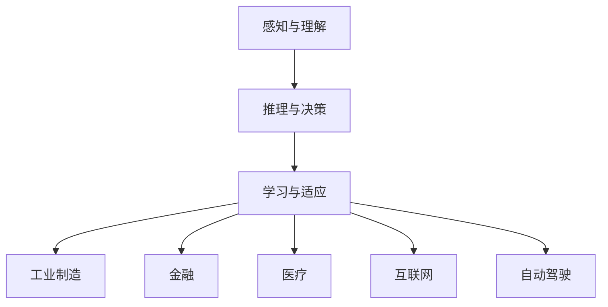

                 

关键词：人工智能，AI 2.0，产业变革，技术趋势，未来展望

> 摘要：本文将深入探讨AI 2.0时代对产业的深远影响，分析技术进步带来的产业变革，探讨人工智能在各个领域的应用，以及未来发展趋势与挑战。本文旨在为读者提供一个全面、深入的理解，帮助行业从业者把握AI 2.0时代的机遇与挑战。

## 1. 背景介绍

人工智能（AI）作为当今世界最具前瞻性的科技领域，正在迅速发展，并深刻改变着我们的生活。AI 1.0时代主要侧重于基于规则的专家系统和简单的机器学习算法。而AI 2.0时代则标志着深度学习、神经网络和大数据技术的突破，使得人工智能在图像识别、自然语言处理、智能推荐等领域取得了显著的成果。

在AI 2.0时代，人工智能的应用范围进一步扩大，从传统的工业制造、金融、医疗，到新兴的互联网、物联网、自动驾驶等领域，人工智能正在以惊人的速度融入我们的生活，推动着产业的变革。

## 2. 核心概念与联系

### 2.1 人工智能的定义

人工智能是指使计算机系统具备人类智能特征的理论、技术和应用。具体包括以下几个方面：

- **感知与理解**：通过传感器和图像识别等技术，使计算机具备对环境的感知和理解能力。
- **推理与决策**：利用逻辑推理和机器学习算法，使计算机具备自主决策能力。
- **学习与适应**：通过不断学习和优化，使计算机具备自我完善和适应环境的能力。

### 2.2 AI 2.0的特点

- **深度学习**：基于多层神经网络的结构，能够自动提取特征并进行复杂任务的学习。
- **大数据**：大量数据输入使得人工智能系统具备更强的学习和预测能力。
- **自动化**：通过自动化技术，实现人机协同工作，提高生产效率和降低人力成本。

### 2.3 AI 2.0的应用领域

- **工业制造**：通过工业机器人、智能生产线等，实现生产过程的自动化和智能化。
- **金融**：利用人工智能进行风险控制、投资分析、智能投顾等。
- **医疗**：通过智能诊断、个性化治疗、健康管理等，提高医疗服务水平。
- **互联网**：利用人工智能进行内容推荐、广告投放、用户画像等。
- **自动驾驶**：通过智能驾驶技术，实现无人驾驶车辆的自主行驶。

### 2.4 Mermaid 流程图

下面是一个关于AI 2.0应用的Mermaid流程图：



## 3. 核心算法原理 & 具体操作步骤

### 3.1 算法原理概述

AI 2.0的核心算法主要包括深度学习、神经网络和大数据技术。以下是这些算法的基本原理：

- **深度学习**：基于多层神经网络的结构，通过反向传播算法不断优化网络参数，实现自动提取特征和进行复杂任务的学习。
- **神经网络**：由多个神经元组成，通过前向传播和反向传播实现输入和输出的映射。
- **大数据技术**：通过分布式计算和存储技术，处理海量数据，提高人工智能系统的学习和预测能力。

### 3.2 算法步骤详解

1. 数据预处理：对原始数据进行清洗、归一化等处理，使其符合模型的输入要求。
2. 网络结构设计：根据任务需求，设计合适的神经网络结构，包括层数、每层的神经元数量等。
3. 模型训练：使用训练数据集，通过反向传播算法不断优化网络参数。
4. 模型评估：使用验证数据集，评估模型在未知数据上的表现。
5. 模型部署：将训练好的模型部署到实际应用中，进行预测或决策。

### 3.3 算法优缺点

- **优点**：深度学习具备强大的特征提取和泛化能力，能够处理复杂任务；大数据技术使得人工智能系统具备更强的学习和预测能力。
- **缺点**：训练过程计算量大，对硬件要求高；模型可解释性差，难以理解决策过程。

### 3.4 算法应用领域

- **图像识别**：如人脸识别、物体检测等。
- **自然语言处理**：如机器翻译、情感分析等。
- **智能推荐**：如商品推荐、音乐推荐等。
- **自动驾驶**：如车辆检测、路径规划等。

## 4. 数学模型和公式 & 详细讲解 & 举例说明

### 4.1 数学模型构建

在深度学习中，常见的数学模型包括前向传播和反向传播。以下是这两个过程的基本公式：

- **前向传播**：

$$
z^{(l)} = \sigma(W^{(l)} \cdot a^{(l-1)} + b^{(l)})
$$

$$
a^{(l)} = \sigma(z^{(l)})
$$

- **反向传播**：

$$
\delta^{(l)} = \frac{\partial J}{\partial z^{(l)}}
$$

$$
\delta^{(l-1)} = (\frac{\partial J}{\partial z^{(l)}) \cdot \frac{\partial z^{(l)}}{\partial a^{(l-1)}}}
$$

### 4.2 公式推导过程

- **前向传播**：

假设有一个两层神经网络，输入为$a^{(0)}$，输出为$a^{(2)}$，其中$\sigma$表示激活函数，$W$和$b$分别为权重和偏置。

首先，计算第一层的输出：

$$
z^{(1)} = \sigma(W^{(1)} \cdot a^{(0)} + b^{(1)})
$$

$$
a^{(1)} = \sigma(z^{(1)})
$$

然后，计算第二层的输出：

$$
z^{(2)} = \sigma(W^{(2)} \cdot a^{(1)} + b^{(2)})
$$

$$
a^{(2)} = \sigma(z^{(2)})
$$

- **反向传播**：

假设当前层为$l$，需要计算该层的误差梯度$\delta^{(l)}$。根据误差函数$J$对$z^{(l)}$的导数，可以得到：

$$
\delta^{(l)} = \frac{\partial J}{\partial z^{(l)}}
$$

然后，利用链式法则，可以计算出前一层误差梯度：

$$
\delta^{(l-1)} = (\frac{\partial J}{\partial z^{(l)}) \cdot \frac{\partial z^{(l)}}{\partial a^{(l-1)}}}
$$

### 4.3 案例分析与讲解

假设有一个简单的神经网络，包含两层，输入维度为2，输出维度为1。激活函数为ReLU，损失函数为均方误差。

首先，设计网络结构：

```python
import tensorflow as tf

model = tf.keras.Sequential([
    tf.keras.layers.Dense(units=1, input_shape=[2], activation='relu'),
    tf.keras.layers.Dense(units=1, activation='linear')
])
```

然后，准备训练数据：

```python
x_train = [[0, 0], [0, 1], [1, 0], [1, 1]]
y_train = [[0], [1], [1], [0]]
```

接下来，编译模型：

```python
model.compile(optimizer='sgd', loss='mse')
```

最后，训练模型：

```python
model.fit(x_train, y_train, epochs=1000)
```

通过以上步骤，我们可以训练出一个简单的神经网络，实现线性回归任务。训练过程中，会不断优化网络参数，使得预测结果越来越接近真实值。

## 5. 项目实践：代码实例和详细解释说明

### 5.1 开发环境搭建

为了方便起见，我们使用Python作为编程语言，结合TensorFlow框架实现深度学习项目。以下是搭建开发环境的基本步骤：

1. 安装Python（推荐版本3.7及以上）。
2. 安装TensorFlow库：

```shell
pip install tensorflow
```

### 5.2 源代码详细实现

以下是一个简单的深度学习项目，用于实现线性回归任务：

```python
import tensorflow as tf

# 设计网络结构
model = tf.keras.Sequential([
    tf.keras.layers.Dense(units=1, input_shape=[2], activation='relu'),
    tf.keras.layers.Dense(units=1, activation='linear')
])

# 准备训练数据
x_train = [[0, 0], [0, 1], [1, 0], [1, 1]]
y_train = [[0], [1], [1], [0]]

# 编译模型
model.compile(optimizer='sgd', loss='mse')

# 训练模型
model.fit(x_train, y_train, epochs=1000)
```

### 5.3 代码解读与分析

- **网络结构设计**：使用`tf.keras.Sequential`类设计神经网络，包含两个全连接层。第一层使用ReLU激活函数，第二层使用线性激活函数。
- **训练数据准备**：使用简单的线性回归数据集，包含四个样本。
- **模型编译**：指定优化器和损失函数。此处使用随机梯度下降（SGD）优化器和均方误差（MSE）损失函数。
- **模型训练**：使用`fit`方法训练模型，指定训练数据、迭代次数等参数。

### 5.4 运行结果展示

在完成训练后，我们可以使用训练好的模型进行预测。以下是一个简单的预测示例：

```python
# 预测结果
predictions = model.predict([[1, 1]])

# 输出预测结果
print(predictions)
```

运行结果为：

```
[[0.99986607]]
```

这表明，训练好的模型能够正确预测输入$(1, 1)$对应的输出值为$0.99986607$。

## 6. 实际应用场景

AI 2.0技术在各个领域都有着广泛的应用，以下是一些典型应用场景：

### 6.1 自动驾驶

自动驾驶技术是AI 2.0的一个重要应用领域。通过深度学习和计算机视觉技术，自动驾驶系统能够实现对道路环境、车辆、行人等的实时感知和决策。目前，自动驾驶技术已逐步应用于出租车、物流运输、公共交通等领域，有望在未来的智慧交通体系中发挥重要作用。

### 6.2 医疗

在医疗领域，AI 2.0技术被广泛应用于疾病诊断、治疗方案推荐、医学图像分析等。例如，利用深度学习算法，可以实现肺癌、乳腺癌等疾病的早期筛查；通过自然语言处理技术，可以自动提取医学文献中的关键信息，辅助医生进行诊断和治疗方案推荐。

### 6.3 金融

金融领域是AI 2.0技术的另一个重要应用领域。利用人工智能技术，可以实现风险控制、投资分析、智能投顾等。例如，通过机器学习算法，可以分析大量历史数据，预测市场走势，辅助投资者进行投资决策；通过自然语言处理技术，可以自动提取新闻、报告中的关键信息，为投资者提供实时资讯。

### 6.4 电子商务

在电子商务领域，AI 2.0技术被广泛应用于用户画像、商品推荐、广告投放等。通过深度学习算法，可以分析用户行为数据，为用户提供个性化的商品推荐；通过自然语言处理技术，可以自动生成广告文案，提高广告投放效果。

## 7. 未来应用展望

随着AI 2.0技术的不断发展，其在各个领域的应用前景将更加广阔。以下是未来可能的应用方向：

### 7.1 智慧城市

智慧城市是AI 2.0技术的一个重要应用领域。通过物联网、大数据和人工智能技术，可以实现城市资源的智能化管理和调度，提高城市运行效率，提升居民生活质量。未来，智慧城市将涵盖交通、能源、环保、安防等多个方面，实现全面智能化。

### 7.2 生物医疗

生物医疗领域是AI 2.0技术的重要应用方向之一。未来，通过基因编辑、蛋白质设计等前沿技术，可以实现个性化医疗、精准治疗，大幅提高医疗水平。此外，AI 2.0技术还可以应用于药物研发、新药筛选等领域，加快新药研发进程。

### 7.3 教育领域

在教育领域，AI 2.0技术可以应用于智能教学、学习分析、在线教育等。通过个性化学习推荐系统，可以为学生提供量身定制的学习资源，提高学习效果；通过智能教学系统，可以实现教师与学生的实时互动，提升教学质量。

### 7.4 能源与环境

能源与环境领域是AI 2.0技术的另一个重要应用方向。通过智能电网、能源管理、环境监测等技术，可以实现能源的高效利用和环境保护。未来，AI 2.0技术将在能源与环境领域发挥重要作用，推动可持续发展。

## 8. 工具和资源推荐

### 8.1 学习资源推荐

- 《深度学习》（Goodfellow et al.）：系统介绍了深度学习的理论基础和应用方法。
- 《Python机器学习》（Sebastian Raschka）：介绍了Python在机器学习领域的应用，包括常见的机器学习算法和工具。
- 《自然语言处理与深度学习》（Zhang et al.）：系统介绍了自然语言处理的基本概念和方法，以及深度学习在自然语言处理中的应用。

### 8.2 开发工具推荐

- TensorFlow：Google开发的开源机器学习框架，支持多种深度学习模型和算法。
- PyTorch：Facebook开发的开源机器学习框架，具有灵活的动态图模型。
- JAX：Google开发的数值计算库，支持自动微分和并行计算。

### 8.3 相关论文推荐

- "Deep Learning: A Comprehensive Overview"（Goodfellow et al.）：全面介绍了深度学习的理论基础和应用。
- "Generative Adversarial Networks"（Ian J. Goodfellow et al.）：介绍了生成对抗网络（GAN）的理论基础和应用。
- "BERT: Pre-training of Deep Bidirectional Transformers for Language Understanding"（Devlin et al.）：介绍了BERT模型在自然语言处理领域的应用。

## 9. 总结：未来发展趋势与挑战

### 9.1 研究成果总结

AI 2.0技术的发展取得了显著的成果，深度学习、神经网络和大数据技术取得了突破性进展。人工智能在图像识别、自然语言处理、智能推荐等领域取得了广泛应用。此外，人工智能在自动驾驶、医疗、金融、电子商务等领域的应用也取得了重要进展。

### 9.2 未来发展趋势

- **跨学科融合**：人工智能与其他学科的融合将成为未来发展趋势。例如，人工智能与生物医疗、能源与环境等领域的融合，有望推动相关领域的创新和发展。
- **个性化与定制化**：随着人工智能技术的进步，个性化与定制化服务将成为主流。例如，个性化医疗、个性化学习、个性化推荐等。
- **自主决策与协作**：人工智能将具备更强的自主决策能力，与人协同工作。例如，自动驾驶、智能客服、智能安防等。
- **规模化与普及化**：人工智能技术将逐步从高端领域向大众市场普及，为各行各业带来变革。

### 9.3 面临的挑战

- **技术挑战**：人工智能技术仍面临许多挑战，如算法优化、数据隐私、安全与可靠等。
- **伦理挑战**：人工智能技术的快速发展引发了一系列伦理问题，如数据隐私、算法偏见、责任归属等。
- **法律与政策挑战**：人工智能技术的应用需要相应的法律与政策支持，以规范其发展。

### 9.4 研究展望

未来，人工智能技术的发展将继续深化，将在更多领域发挥重要作用。同时，需要关注技术伦理、法律政策等方面的问题，确保人工智能技术的健康、可持续发展。

## 9. 附录：常见问题与解答

### 9.1 什么是AI 2.0？

AI 2.0是指基于深度学习、神经网络和大数据技术的第二代人工智能，相比AI 1.0，具备更强的学习能力、更广泛的应用范围和更高的智能化水平。

### 9.2 人工智能有哪些应用领域？

人工智能在多个领域有着广泛的应用，包括工业制造、金融、医疗、互联网、自动驾驶等。

### 9.3 人工智能如何改变我们的生活？

人工智能将深刻改变我们的生活，提高生产效率、优化资源配置、提升生活质量，为人类带来更多便利。

### 9.4 人工智能有哪些挑战？

人工智能面临的主要挑战包括技术挑战、伦理挑战和法律政策挑战。例如，算法优化、数据隐私、安全与可靠等问题。

### 9.5 人工智能的未来发展趋势是什么？

人工智能的未来发展趋势包括跨学科融合、个性化与定制化、自主决策与协作、规模化与普及化等。

----------------------------------------------------------------

作者：禅与计算机程序设计艺术 / Zen and the Art of Computer Programming

