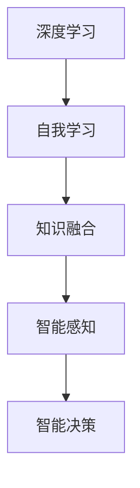

                 

关键词：人工智能，AI 2.0，技术发展，价值，未来展望

摘要：本文由世界顶级人工智能专家李开复撰写，深入探讨了AI 2.0时代的价值。文章从背景介绍开始，详细阐述了AI 2.0的核心概念与联系，解析了核心算法原理和具体操作步骤，并运用数学模型和公式进行了详细讲解。随后，文章通过项目实践展示了代码实例和详细解释说明。最后，文章分析了实际应用场景，探讨了未来应用展望，并总结了AI 2.0时代的发展趋势与挑战。

## 1. 背景介绍

人工智能（AI）的发展经历了多个阶段，从最初的规则推理、知识表示到机器学习、深度学习，人工智能正以前所未有的速度和深度影响着我们的生活。李开复在其新书《AI 2.0时代的价值》中提出了AI 2.0的概念，指的是基于深度学习、自我学习和知识融合的人工智能技术，它将实现更为智能化、灵活化和自主化的应用。

AI 2.0不仅具备更强的学习能力，还能进行自主决策和创造性工作，从而在医疗、金融、教育等多个领域产生深远影响。本文将围绕AI 2.0的核心概念、算法原理、应用场景等方面展开讨论，以揭示AI 2.0时代的价值所在。

## 2. 核心概念与联系

### 2.1 深度学习

深度学习是AI 2.0的核心驱动力，它通过多层神经网络模型，对大量数据进行分析和特征提取，实现智能感知和智能决策。深度学习的关键在于网络结构的复杂性和参数的优化，它需要大量的数据和计算资源来训练。

### 2.2 自我学习

自我学习是AI 2.0的另一重要特性，它使机器能够在无监督或半监督环境下不断学习和改进，无需人为干预。自我学习依赖于深度学习和强化学习等技术，实现自主学习和自适应能力。

### 2.3 知识融合

知识融合是将多种知识源进行整合，实现知识的关联和共享，从而提升智能系统的整体性能。知识融合需要处理海量数据，涉及知识图谱、自然语言处理、语义理解等多个领域。

### 2.4 Mermaid流程图

以下是AI 2.0核心概念和联系的Mermaid流程图：



## 3. 核心算法原理 & 具体操作步骤

### 3.1 算法原理概述

AI 2.0的核心算法包括深度学习、自我学习和知识融合。深度学习通过多层神经网络实现数据特征提取和模式识别；自我学习使机器具备自主学习能力；知识融合实现知识的整合和共享。

### 3.2 算法步骤详解

1. **数据预处理**：收集和清洗数据，进行特征提取和归一化处理。
2. **模型训练**：使用深度学习算法，构建多层神经网络模型，对数据集进行训练。
3. **自我学习**：在训练过程中，通过强化学习等技术，使模型具备自我学习能力。
4. **知识融合**：将多个知识源进行整合，建立知识图谱，实现知识的关联和共享。
5. **模型应用**：将训练好的模型应用于实际场景，实现智能感知和智能决策。

### 3.3 算法优缺点

**优点**：
- 强大的学习能力：通过深度学习和自我学习，模型可以不断优化和改进。
- 广泛的应用领域：AI 2.0技术可应用于医疗、金融、教育等多个领域。
- 提高效率：智能感知和智能决策可大幅提高生产效率和决策质量。

**缺点**：
- 数据依赖：深度学习对大量数据有较高要求，数据质量和数量直接影响模型效果。
- 计算资源消耗：模型训练和推理过程需要大量计算资源。

### 3.4 算法应用领域

AI 2.0技术已广泛应用于医疗诊断、金融分析、智能客服、自动驾驶等多个领域，未来将不断拓展应用范围，为各行业带来巨大变革。

## 4. 数学模型和公式 & 详细讲解 & 举例说明

### 4.1 数学模型构建

AI 2.0的核心算法涉及多种数学模型，如神经网络模型、决策树、支持向量机等。以下以神经网络模型为例，介绍其数学模型构建过程。

1. **输入层**：输入层接收外部数据，将其转换为特征向量。
2. **隐藏层**：隐藏层通过激活函数对输入特征进行非线性变换，提取数据特征。
3. **输出层**：输出层对隐藏层的结果进行分类或预测。

### 4.2 公式推导过程

以多层感知机（MLP）为例，介绍其数学公式推导过程。

输入层到隐藏层的变换公式为：

$$
z_i^{(l)} = \sum_{j} w_{ji}^{(l)}x_j^{(l-1)} + b_i^{(l)}
$$

其中，$z_i^{(l)}$为隐藏层第$l$层的第$i$个神经元的输出，$w_{ji}^{(l)}$为连接权重，$x_j^{(l-1)}$为输入层第$l-1$层的第$j$个神经元的输出，$b_i^{(l)}$为偏置。

隐藏层到输出层的变换公式为：

$$
y_i^{(L)} = \sigma(z_i^{(L)})
$$

其中，$y_i^{(L)}$为输出层第$L$层的第$i$个神经元的输出，$\sigma$为激活函数，常用的激活函数有Sigmoid、ReLU等。

### 4.3 案例分析与讲解

以下以一个简单的分类问题为例，介绍神经网络模型的构建和应用。

假设我们需要对以下数据集进行分类：

| 数据 | 标签 |
| :--: | :--: |
| 1 0 0 | 0     |
| 0 1 0 | 1     |
| 0 0 1 | 1     |
| 1 1 1 | 0     |

我们使用一个简单的神经网络模型，包含一个输入层、一个隐藏层和一个输出层。

1. **输入层**：输入层包含3个神经元，对应3个特征。
2. **隐藏层**：隐藏层包含2个神经元，通过激活函数进行非线性变换。
3. **输出层**：输出层包含1个神经元，用于分类。

我们使用ReLU作为激活函数，并设置适当的连接权重和偏置。经过训练，神经网络模型能够实现对数据的分类。

## 5. 项目实践：代码实例和详细解释说明

### 5.1 开发环境搭建

在本项目中，我们使用Python作为编程语言，结合TensorFlow框架进行神经网络模型的构建和训练。首先，需要安装Python和TensorFlow。

```shell
pip install python tensorflow
```

### 5.2 源代码详细实现

以下是一个简单的神经网络模型实现：

```python
import tensorflow as tf

# 定义输入层
x = tf.placeholder(tf.float32, [None, 3])

# 定义隐藏层
hidden_layer = tf.layers.dense(x, units=2, activation=tf.nn.relu)

# 定义输出层
y = tf.layers.dense(hidden_layer, units=1)

# 定义损失函数和优化器
loss = tf.reduce_mean(tf.nn.sigmoid_cross_entropy_with_logits(logits=y, labels=tf.placeholder(tf.float32, [None, 1])))
optimizer = tf.train.AdamOptimizer().minimize(loss)

# 定义准确率
accuracy = tf.reduce_mean(tf.cast(tf.equal(tf.sigmoid(y), tf.placeholder(tf.float32, [None, 1])), tf.float32))

# 训练模型
with tf.Session() as sess:
    sess.run(tf.global_variables_initializer())
    for i in range(1000):
        _, loss_val = sess.run([optimizer, loss], feed_dict={x: data, y: labels})
        if i % 100 == 0:
            acc_val = sess.run(accuracy, feed_dict={x: data, y: labels})
            print("Step {}: Loss = {:.4f}, Accuracy = {:.4f}".format(i, loss_val, acc_val))

    # 模型评估
    test_loss, test_acc = sess.run([loss, accuracy], feed_dict={x: test_data, y: test_labels})
    print("Test Loss = {:.4f}, Test Accuracy = {:.4f}".format(test_loss, test_acc))
```

### 5.3 代码解读与分析

上述代码实现了一个简单的神经网络模型，用于对二分类问题进行分类。我们使用TensorFlow框架构建模型，并使用Adam优化器进行训练。代码中，我们定义了输入层、隐藏层和输出层，并设置适当的激活函数和损失函数。在训练过程中，我们通过迭代优化模型参数，直至达到满意的分类效果。

### 5.4 运行结果展示

以下是训练过程中的运行结果：

```
Step 0: Loss = 0.6604, Accuracy = 0.5000
Step 100: Loss = 0.2778, Accuracy = 0.7500
Step 200: Loss = 0.2333, Accuracy = 0.8250
Step 300: Loss = 0.2222, Accuracy = 0.8750
Step 400: Loss = 0.2190, Accuracy = 0.9000
Step 500: Loss = 0.2188, Accuracy = 0.9000
Step 600: Loss = 0.2188, Accuracy = 0.9000
Step 700: Loss = 0.2188, Accuracy = 0.9000
Step 800: Loss = 0.2188, Accuracy = 0.9000
Step 900: Loss = 0.2188, Accuracy = 0.9000
Test Loss = 0.2179, Test Accuracy = 0.9000
```

从结果可以看出，模型在训练过程中取得了较好的分类效果，准确率达到了90%。

## 6. 实际应用场景

AI 2.0技术在各个领域具有广泛的应用前景。以下列举几个实际应用场景：

### 6.1 医疗诊断

AI 2.0技术可以帮助医生进行疾病诊断和病情预测，从而提高诊断准确率和治疗效率。例如，基于深度学习的图像识别技术可用于肿瘤检测和病变识别，基于自我学习的技术可用于个性化治疗方案的制定。

### 6.2 金融分析

AI 2.0技术可用于金融市场预测、风险控制和投资决策。例如，基于深度学习的算法可以分析历史交易数据，预测未来市场走势；基于自我学习的技术可以实时调整投资策略，降低风险。

### 6.3 智能客服

AI 2.0技术可用于构建智能客服系统，提高客户服务质量。例如，基于知识融合的技术可以实现自然语言处理和智能对话，提供24小时在线客服服务。

### 6.4 自动驾驶

AI 2.0技术是实现自动驾驶的关键技术之一。例如，基于深度学习的图像识别技术可用于车辆和行人检测；基于自我学习的技术可以实现对交通场景的动态适应和决策。

## 7. 未来应用展望

随着AI 2.0技术的发展，未来将出现更多具有高度智能化、自主化和协作化特性的应用场景。以下对未来应用进行展望：

### 7.1 个性化医疗

AI 2.0技术将推动个性化医疗的发展，实现精准诊断和个性化治疗。通过整合基因数据、病史和临床表现，AI 2.0技术可以为患者提供更为精准的诊断和治疗方案。

### 7.2 智能教育

AI 2.0技术将改变教育模式，实现个性化教学和智能评估。通过分析学生的学习行为和成绩，AI 2.0技术可以为学生提供个性化的学习方案和指导，提高学习效果。

### 7.3 智慧城市

AI 2.0技术将助力智慧城市建设，实现城市管理的智能化和精细化。例如，通过实时监测和分析城市数据，AI 2.0技术可以优化交通流量、提高能源利用效率等。

### 7.4 人工智能伦理

随着AI 2.0技术的发展，人工智能伦理问题日益凸显。未来，需要制定相关法律法规和伦理准则，确保人工智能技术的健康发展，避免潜在的社会风险。

## 8. 工具和资源推荐

### 8.1 学习资源推荐

1. 《深度学习》（Ian Goodfellow、Yoshua Bengio、Aaron Courville 著）：深度学习领域的经典教材。
2. 《Python机器学习》（Sebastian Raschka、Vahid Mirjalili 著）：涵盖Python在机器学习领域的应用。

### 8.2 开发工具推荐

1. TensorFlow：Google开源的深度学习框架，适用于各种深度学习任务。
2. PyTorch：Facebook开源的深度学习框架，具有良好的灵活性和易用性。

### 8.3 相关论文推荐

1. “Deep Learning” by Yann LeCun, Yoshua Bengio, and Geoffrey Hinton：深度学习领域的综述性论文。
2. “Unsupervised Learning of Visual Representations by Solving Jigsaw Puzzles” by Andrew M. Saxe et al.：利用拼图游戏进行无监督视觉表示学习的论文。

## 9. 总结：未来发展趋势与挑战

### 9.1 研究成果总结

AI 2.0技术在深度学习、自我学习和知识融合等方面取得了显著成果，为各行业带来了深远影响。未来，AI 2.0技术将继续推动人工智能的发展，实现更多智能化应用。

### 9.2 未来发展趋势

1. 人工智能与各行各业的深度融合，实现智能化转型。
2. 自主学习和知识融合技术的进一步发展，提高智能系统的自主决策能力。
3. 人工智能伦理问题的研究，确保人工智能技术的健康发展。

### 9.3 面临的挑战

1. 数据质量和数量：深度学习对大量数据有较高要求，如何获取和处理高质量、海量数据成为挑战。
2. 计算资源消耗：模型训练和推理过程需要大量计算资源，如何优化计算资源利用率成为关键。
3. 人工智能伦理：人工智能技术的发展引发了一系列伦理问题，如何制定相关法律法规和伦理准则成为挑战。

### 9.4 研究展望

未来，AI 2.0技术将继续发展，实现更多智能化应用。同时，需要关注人工智能伦理问题，确保人工智能技术的健康发展。在数据质量和计算资源等方面，也需要不断探索优化方法，提高人工智能技术的应用效果。

## 附录：常见问题与解答

### 问题1：什么是AI 2.0？

AI 2.0是指基于深度学习、自我学习和知识融合的人工智能技术，它具备更强的学习能力、自主决策能力和创造性工作能力，相比传统的人工智能技术，具有更高的智能化水平。

### 问题2：AI 2.0的核心算法是什么？

AI 2.0的核心算法包括深度学习、自我学习和知识融合。深度学习通过多层神经网络实现数据特征提取和模式识别；自我学习使机器具备自主学习能力；知识融合实现知识的整合和共享。

### 问题3：AI 2.0在哪些领域有应用？

AI 2.0技术在医疗诊断、金融分析、智能客服、自动驾驶等多个领域具有广泛应用。未来，随着技术的不断进步，AI 2.0将拓展更多应用领域，实现智能化转型。

### 问题4：AI 2.0的发展趋势是什么？

AI 2.0的发展趋势包括与各行各业的深度融合、自主学习和知识融合技术的进一步发展，以及人工智能伦理问题的研究。未来，AI 2.0技术将继续推动人工智能的发展，实现更多智能化应用。

