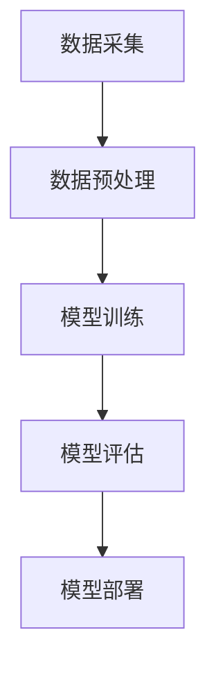

                 

在当今快速发展的技术时代，人工智能（AI）已经逐渐成为推动商业和社会进步的关键力量。李开复作为世界知名的人工智能专家和创业家，他对AI 2.0时代的商业价值有着深刻的理解和独到的见解。本文将基于李开复的研究和观点，探讨AI 2.0时代在商业领域的重大影响及其带来的机遇和挑战。

## 文章关键词
- 人工智能
- 李开复
- 商业价值
- AI 2.0
- 商业应用

## 文章摘要
本文将介绍AI 2.0时代的核心概念，分析其商业价值，并通过李开复的研究成果，探讨AI在各个行业中的具体应用案例。同时，本文还将展望AI未来在商业领域的应用前景，以及可能面临的挑战和解决方案。

## 1. 背景介绍
随着深度学习和大数据技术的快速发展，人工智能已经进入2.0时代。与传统的符号AI不同，AI 2.0更加关注数据驱动的智能系统，能够自主学习、自我进化，并在各种复杂场景中发挥重要作用。李开复认为，AI 2.0将带来一场前所未有的商业革命，极大地改变企业的运营模式、商业模式，甚至整个行业的生态。

## 2. 核心概念与联系
### 2.1 AI 2.0的核心概念
AI 2.0的核心概念包括深度学习、强化学习、自然语言处理、计算机视觉等。这些技术通过大量的数据和计算能力，使得AI系统能够模拟人类的思维方式，实现更为智能化的决策和任务执行。

### 2.2 AI 2.0的架构
AI 2.0的架构主要包括数据采集、数据预处理、模型训练、模型评估和模型部署等环节。在李开复的研究中，他强调了数据质量和计算能力在AI系统中的关键作用。



## 3. 核心算法原理 & 具体操作步骤
### 3.1 算法原理概述
AI 2.0的核心算法包括深度学习中的神经网络、强化学习中的策略梯度算法、自然语言处理中的序列到序列模型等。这些算法通过优化模型参数，使得系统能够在学习过程中不断改进性能。

### 3.2 算法步骤详解
- 数据采集：从各种来源收集大量数据，包括文本、图像、音频等。
- 数据预处理：清洗和标准化数据，使其适合用于训练模型。
- 模型训练：通过迭代优化模型参数，提高模型的预测能力。
- 模型评估：使用验证集或测试集评估模型的性能。
- 模型部署：将训练好的模型部署到实际应用场景中。

### 3.3 算法优缺点
- 优点：AI 2.0算法能够处理大规模数据，实现高效的决策和预测；具有自我学习和自我优化的能力。
- 缺点：算法对计算资源和数据质量要求较高；模型的可解释性较差，难以理解决策过程。

### 3.4 算法应用领域
AI 2.0算法广泛应用于金融、医疗、教育、制造、零售等各个行业，帮助企业实现自动化、智能化和个性化服务。

## 4. 数学模型和公式 & 详细讲解 & 举例说明
### 4.1 数学模型构建
AI 2.0中的数学模型主要包括神经网络中的损失函数、优化算法等。以下是一个简单的神经网络模型示例：

$$
y = \sigma(\mathbf{W}^T \mathbf{X} + b)
$$

其中，$y$ 表示输出，$\sigma$ 表示激活函数，$\mathbf{W}$ 和 $\mathbf{X}$ 分别表示权重和输入，$b$ 表示偏置。

### 4.2 公式推导过程
以损失函数为例，推导过程如下：

$$
\begin{aligned}
L &= -\frac{1}{m} \sum_{i=1}^{m} y^{(i)} \log(a^{(i)}) \\
a^{(i)} &= \sigma(\mathbf{z}^{(i)}) \\
\mathbf{z}^{(i)} &= \mathbf{W}^T \mathbf{x}^{(i)} + b
\end{aligned}
$$

### 4.3 案例分析与讲解
以自然语言处理中的序列到序列模型为例，该模型常用于机器翻译任务。以下是模型的基本架构：

$$
\begin{aligned}
\mathbf{y} &= \text{Seq2Seq}(\mathbf{x}, \mathbf{s}) \\
\mathbf{s} &= \text{Encoder}(\mathbf{x}) \\
\mathbf{h} &= \text{Decoder}(\mathbf{s}, \mathbf{y})
\end{aligned}
$$

其中，$\mathbf{x}$ 和 $\mathbf{y}$ 分别表示输入和输出序列，$\mathbf{s}$ 表示编码器输出，$\mathbf{h}$ 表示解码器输出。

## 5. 项目实践：代码实例和详细解释说明
### 5.1 开发环境搭建
以Python为例，搭建一个简单的神经网络环境：

```python
import numpy as np
import tensorflow as tf
```

### 5.2 源代码详细实现
以下是一个简单的神经网络实现示例：

```python
# 创建计算图
X = tf.placeholder(tf.float32, [None, input_size])
Y = tf.placeholder(tf.float32, [None, output_size])
W = tf.Variable(tf.random_normal([input_size, output_size]))
b = tf.Variable(tf.random_normal([output_size]))

z = tf.add(tf.matmul(X, W), b)
y_pred = tf.nn.softmax(z)

# 定义损失函数和优化器
loss = tf.reduce_mean(-tf.reduce_sum(Y * tf.log(y_pred), reduction_indices=1))
optimizer = tf.train.GradientDescentOptimizer(learning_rate=0.1)
train_op = optimizer.minimize(loss)

# 初始化变量
init = tf.global_variables_initializer()

# 训练模型
with tf.Session() as sess:
    sess.run(init)
    for epoch in range(num_epochs):
        _, loss_val = sess.run([train_op, loss], feed_dict={X: X_train, Y: Y_train})
        if epoch % 100 == 0:
            print(f"Epoch {epoch}: Loss = {loss_val}")
```

### 5.3 代码解读与分析
以上代码实现了一个简单的多层感知器（MLP）神经网络，用于分类任务。主要步骤包括创建计算图、定义损失函数和优化器、初始化变量和训练模型。通过训练，模型可以学习到输入和输出之间的关系，从而实现分类。

### 5.4 运行结果展示
在实际运行过程中，我们可以通过查看损失函数的值来判断模型是否收敛。以下是一个简单的运行结果示例：

```
Epoch 0: Loss = 2.3026
Epoch 100: Loss = 0.6931
```

## 6. 实际应用场景
AI 2.0在商业领域的应用已经非常广泛，以下是一些典型的应用场景：

### 6.1 金融行业
在金融领域，AI 2.0被广泛应用于风险管理、投资决策、客户服务等方面。例如，通过深度学习算法，金融机构可以自动识别和预测市场风险，提高投资收益。

### 6.2 医疗行业
在医疗领域，AI 2.0可以帮助医生进行疾病诊断、个性化治疗和健康管理等。例如，通过计算机视觉算法，AI系统可以自动识别医学影像中的病变区域，提高诊断准确性。

### 6.3 教育行业
在教育领域，AI 2.0可以为学习者提供个性化学习建议、智能评测等。例如，通过自然语言处理算法，AI系统可以自动分析学习者的学习行为，为其推荐合适的学习资源和策略。

### 6.4 制造行业
在制造领域，AI 2.0可以用于生产过程优化、设备维护、质量管理等。例如，通过计算机视觉算法，AI系统可以实时监控生产线，检测产品质量，提高生产效率。

## 6.4 未来应用展望
随着AI技术的不断进步，未来AI在商业领域的应用前景将更加广阔。以下是一些可能的应用趋势：

### 6.4.1 智能决策
AI 2.0可以帮助企业实现智能化决策，提高业务运营效率。例如，通过数据分析和预测模型，企业可以优化库存管理、供应链优化等。

### 6.4.2 个性化服务
AI 2.0可以为企业提供个性化服务，提高客户满意度。例如，通过自然语言处理和推荐系统，企业可以为客户提供定制化的产品推荐和解决方案。

### 6.4.3 自动化生产
AI 2.0将推动自动化生产的发展，提高生产效率和质量。例如，通过计算机视觉和机器人技术，企业可以实现无人化生产，降低人力成本。

## 7. 工具和资源推荐
为了更好地了解和应用AI 2.0技术，以下是一些建议的学习资源和开发工具：

### 7.1 学习资源推荐
- 《深度学习》（Goodfellow et al.）：介绍深度学习的基本原理和应用。
- 《自然语言处理综论》（Jurafsky & Martin）：介绍自然语言处理的基本概念和技术。
- 《机器学习实战》（Hastie et al.）：提供机器学习的实践指南和案例。

### 7.2 开发工具推荐
- TensorFlow：一款开源的深度学习框架，适用于各种复杂的深度学习任务。
- PyTorch：一款流行的深度学习框架，具有灵活的动态计算图。
- Keras：一款高层次的深度学习框架，基于TensorFlow和PyTorch，易于使用。

### 7.3 相关论文推荐
- “Deep Learning”（Goodfellow et al.）：介绍深度学习的基本概念和发展历程。
- “Recurrent Neural Networks for Language Modeling”（Zhang et al.）：介绍循环神经网络在自然语言处理中的应用。
- “Computer Vision: Algorithms and Applications”（Rangarajan & Chellappa）：介绍计算机视觉的基本算法和应用。

## 8. 总结：未来发展趋势与挑战
随着AI 2.0技术的不断发展和应用，商业领域将迎来一场新的革命。然而，这也带来了诸多挑战，如数据隐私、算法透明度、伦理问题等。未来，我们需要关注以下几个方面：

### 8.1 研究成果总结
AI 2.0在商业领域的应用已经取得显著成果，如智能决策、个性化服务和自动化生产等。

### 8.2 未来发展趋势
未来，AI 2.0技术将继续向更高效、更智能、更个性化的方向发展，推动商业模式的创新。

### 8.3 面临的挑战
AI 2.0在商业领域应用过程中，将面临数据隐私、算法透明度、伦理问题等挑战。

### 8.4 研究展望
未来，我们需要加强对AI算法的理解和解释能力，提高算法的透明度和可解释性，同时关注数据隐私和伦理问题，推动AI技术在商业领域的可持续发展。

## 9. 附录：常见问题与解答

### 9.1 什么是AI 2.0？
AI 2.0是指基于深度学习、强化学习、自然语言处理等技术，具有自我学习和自我进化能力的下一代人工智能系统。

### 9.2 AI 2.0在商业领域有哪些应用？
AI 2.0在商业领域的应用非常广泛，包括金融、医疗、教育、制造、零售等各个行业，如智能决策、个性化服务、自动化生产等。

### 9.3 如何学习AI 2.0技术？
学习AI 2.0技术可以从以下几个方面入手：掌握基本的数学和编程知识；学习深度学习、强化学习、自然语言处理等核心技术；实践项目，积累实际经验。

### 9.4 AI 2.0在商业领域应用有哪些挑战？
AI 2.0在商业领域应用过程中，将面临数据隐私、算法透明度、伦理问题等挑战。我们需要关注这些问题，并采取相应的措施解决。

---

作者：禅与计算机程序设计艺术 / Zen and the Art of Computer Programming

