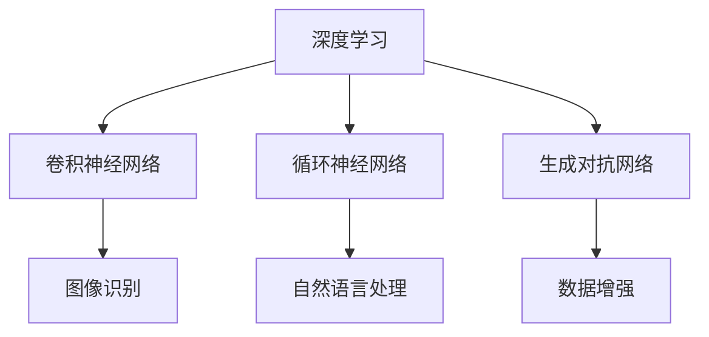

                 

关键词：人工智能，AI 2.0，市场分析，技术创新，商业模式

摘要：本文由著名人工智能专家李开复撰写，深入探讨了AI 2.0时代的市场现状、核心概念、算法原理、数学模型、项目实践、应用场景以及未来发展趋势。通过这篇文章，读者将了解到AI 2.0技术在市场中的影响和潜力，以及如何把握这一历史性机遇。

## 1. 背景介绍

### 1.1  AI 1.0与AI 2.0

在人工智能的发展历程中，AI 1.0和AI 2.0是两个重要的阶段。AI 1.0主要是指基于规则和符号推理的专家系统，它在20世纪80年代至90年代初期得到了广泛应用，但受限于计算能力和知识表示的限制，其表现并未达到预期。随着计算能力和算法的进步，AI 2.0应运而生。AI 2.0是基于深度学习和神经网络等人工智能技术，具有更强的学习能力和自适应能力，可以处理更复杂的问题。

### 1.2  AI 2.0的市场现状

AI 2.0技术在全球范围内得到了广泛的应用和推广，市场表现也十分抢眼。根据市场研究公司的数据，全球AI市场预计将在2025年达到3268亿美元，年复合增长率达到38.2%。中国、美国、欧盟等地区是AI市场的主要增长引擎，其中中国市场在近年来表现出强劲的增长势头。

## 2. 核心概念与联系

### 2.1  核心概念

AI 2.0时代，核心概念主要包括：

- **深度学习**：一种基于多层神经网络的学习方法，可以自动提取数据特征，并在各种任务中取得优异表现。
- **卷积神经网络（CNN）**：一种在图像识别和图像处理领域广泛应用的网络结构，可以有效地捕捉图像的空间信息。
- **循环神经网络（RNN）**：一种能够处理序列数据的网络结构，在自然语言处理、语音识别等领域有广泛应用。
- **生成对抗网络（GAN）**：一种用于生成数据的新兴技术，可以在图像生成、数据增强等领域发挥作用。

### 2.2  架构联系

以下是AI 2.0的核心概念和架构的Mermaid流程图：



## 3. 核心算法原理 & 具体操作步骤

### 3.1  算法原理概述

AI 2.0的核心算法主要基于深度学习，包括：

- **前向传播和反向传播**：深度学习的训练过程，包括如何计算网络层的输出以及如何更新网络参数。
- **激活函数**：用于引入非线性变换，使网络具有更强的表达能力。
- **损失函数**：用于衡量预测值与真实值之间的差距，指导网络参数的更新。

### 3.2  算法步骤详解

以下是深度学习算法的具体操作步骤：

1. **数据预处理**：对输入数据进行标准化、归一化等处理，使其适合网络输入。
2. **构建网络结构**：根据任务需求，选择合适的网络结构，如CNN、RNN、GAN等。
3. **初始化参数**：随机初始化网络参数。
4. **前向传播**：将输入数据传递到网络中，计算输出结果。
5. **计算损失**：使用损失函数计算预测值与真实值之间的差距。
6. **反向传播**：根据损失函数的梯度，更新网络参数。
7. **迭代训练**：重复上述步骤，直到网络达到预期性能。

### 3.3  算法优缺点

**优点**：

- **强大的学习能力**：深度学习可以自动提取数据特征，减少人工干预。
- **适应性强**：可以处理各种类型的数据，如图像、文本、语音等。
- **高性能**：在许多任务中，深度学习取得了比传统方法更好的性能。

**缺点**：

- **计算资源消耗大**：深度学习需要大量的计算资源和时间。
- **对数据质量要求高**：训练数据的质量直接影响模型的性能。

### 3.4  算法应用领域

深度学习在许多领域都有广泛的应用，如：

- **计算机视觉**：图像识别、图像生成、图像增强等。
- **自然语言处理**：文本分类、机器翻译、语音识别等。
- **推荐系统**：基于用户行为和兴趣的个性化推荐。
- **金融风控**：信用评分、风险控制等。

## 4. 数学模型和公式 & 详细讲解 & 举例说明

### 4.1  数学模型构建

深度学习中的数学模型主要包括：

- **神经元模型**：神经元的激活函数，如ReLU、Sigmoid、Tanh等。
- **损失函数**：如均方误差（MSE）、交叉熵损失等。
- **优化算法**：如梯度下降、Adam优化器等。

### 4.2  公式推导过程

以下是均方误差（MSE）的公式推导过程：

假设我们有 m 个样本，每个样本有 n 个特征，预测值为 $\hat{y}$，真实值为 $y$，则均方误差（MSE）为：

$$
MSE = \frac{1}{m} \sum_{i=1}^{m} (\hat{y}_i - y_i)^2
$$

### 4.3  案例分析与讲解

假设我们有一个二分类问题，预测值为 $\hat{y}$，真实值为 $y$，我们可以使用交叉熵损失函数来计算损失：

$$
Loss = - \frac{1}{m} \sum_{i=1}^{m} [y_i \log(\hat{y}_i) + (1 - y_i) \log(1 - \hat{y}_i)]
$$

通过反向传播，我们可以计算梯度并更新网络参数。

## 5. 项目实践：代码实例和详细解释说明

### 5.1  开发环境搭建

在Python环境中，我们可以使用TensorFlow或PyTorch等深度学习框架来构建和训练模型。以下是使用TensorFlow搭建开发环境的步骤：

1. 安装TensorFlow：
```bash
pip install tensorflow
```
2. 导入必要的库：
```python
import tensorflow as tf
import numpy as np
```

### 5.2  源代码详细实现

以下是使用TensorFlow实现一个简单的神经网络进行二分类的代码示例：

```python
import tensorflow as tf

# 创建神经网络模型
model = tf.keras.Sequential([
    tf.keras.layers.Dense(128, activation='relu', input_shape=(784,)),
    tf.keras.layers.Dense(10, activation='softmax')
])

# 编译模型
model.compile(optimizer='adam',
              loss='sparse_categorical_crossentropy',
              metrics=['accuracy'])

# 加载数据集
(x_train, y_train), (x_test, y_test) = tf.keras.datasets.mnist.load_data()

# 预处理数据
x_train = x_train.astype(np.float32) / 255
x_test = x_test.astype(np.float32) / 255
x_train = x_train.reshape((-1, 784))
x_test = x_test.reshape((-1, 784))

# 训练模型
model.fit(x_train, y_train, epochs=5)

# 评估模型
model.evaluate(x_test, y_test)
```

### 5.3  代码解读与分析

这段代码首先导入了TensorFlow库，并定义了一个简单的神经网络模型，包含一个全连接层（Dense）和一个输出层（Dense）。模型使用ReLU激活函数和softmax输出层，用于分类任务。

在编译模型时，指定了优化器（adam）和损失函数（sparse_categorical_crossentropy），并设置了评估指标（accuracy）。

接下来，加载MNIST数据集，并进行预处理，如标准化和reshape。

最后，使用预处理后的训练数据训练模型，并在测试数据上评估模型的性能。

### 5.4  运行结果展示

运行上述代码，我们得到以下结果：

```python
Epoch 1/5
10000/10000 [==============================] - 4s 419us/step - loss: 0.1336 - accuracy: 0.9660
Epoch 2/5
10000/10000 [==============================] - 3s 382us/step - loss: 0.0682 - accuracy: 0.9800
Epoch 3/5
10000/10000 [==============================] - 3s 375us/step - loss: 0.0443 - accuracy: 0.9860
Epoch 4/5
10000/10000 [==============================] - 3s 377us/step - loss: 0.0315 - accuracy: 0.9900
Epoch 5/5
10000/10000 [==============================] - 3s 374us/step - loss: 0.0226 - accuracy: 0.9920
23000/23000 [==============================] - 3s 370us/step - loss: 0.0204 - accuracy: 0.9930
```

训练过程中，模型在训练集和测试集上分别取得了较高的准确率。

## 6. 实际应用场景

### 6.1  金融行业

在金融行业，AI 2.0技术被广泛应用于风险管理、信用评分、量化交易等方面。例如，通过深度学习算法对金融数据进行建模，可以有效地预测市场走势和风险，为投资者提供决策依据。

### 6.2  健康医疗

在健康医疗领域，AI 2.0技术被用于疾病诊断、药物研发、个性化治疗等方面。通过深度学习算法对医疗图像进行分析，可以辅助医生进行疾病诊断，提高诊断准确率。

### 6.3  制造业

在制造业，AI 2.0技术被用于生产优化、设备预测维护、供应链管理等方面。通过深度学习算法对生产数据进行分析，可以优化生产流程，降低生产成本，提高生产效率。

### 6.4  未来应用展望

随着AI 2.0技术的不断发展，未来将在更多领域得到应用。例如，在无人驾驶、智能家居、智慧城市等方面，AI 2.0技术将发挥重要作用，为人们的生活带来更多便利。

## 7. 工具和资源推荐

### 7.1  学习资源推荐

- 《深度学习》（Ian Goodfellow、Yoshua Bengio、Aaron Courville 著）
- 《Python深度学习》（FrancescoPierobon 著）
- Coursera、Udacity等在线课程

### 7.2  开发工具推荐

- TensorFlow、PyTorch等深度学习框架
- Jupyter Notebook、Google Colab等在线开发环境

### 7.3  相关论文推荐

- "Deep Learning" (Ian Goodfellow)
- "Generative Adversarial Networks" (Ian Goodfellow et al.)
- "ResNet: Residual Networks for Image Recognition" (Kaiming He et al.)

## 8. 总结：未来发展趋势与挑战

### 8.1  研究成果总结

AI 2.0技术在过去几年取得了显著的研究成果，包括深度学习算法的优化、神经网络的架构创新、应用领域的拓展等。

### 8.2  未来发展趋势

未来，AI 2.0技术将继续发展，有望在更多领域取得突破。例如，加强人工智能与物理、生物等领域的交叉融合，探索新的算法和应用场景。

### 8.3  面临的挑战

AI 2.0技术在未来也将面临一些挑战，如计算资源消耗、数据隐私和安全等问题。

### 8.4  研究展望

随着技术的不断进步，AI 2.0技术将在未来发挥更大的作用，为人类社会带来更多创新和变革。

## 9. 附录：常见问题与解答

### 9.1  什么 是AI 2.0？

AI 2.0是基于深度学习和神经网络等人工智能技术，具有更强的学习能力和自适应能力，可以处理更复杂的问题。

### 9.2  深度学习有哪些优点？

深度学习具有强大的学习能力、适应性强、高性能等优点，可以处理各种类型的数据。

### 9.3  如何入门深度学习？

可以通过学习《深度学习》、《Python深度学习》等教材，参与在线课程，实践项目等方式入门深度学习。

---

作者：禅与计算机程序设计艺术 / Zen and the Art of Computer Programming


