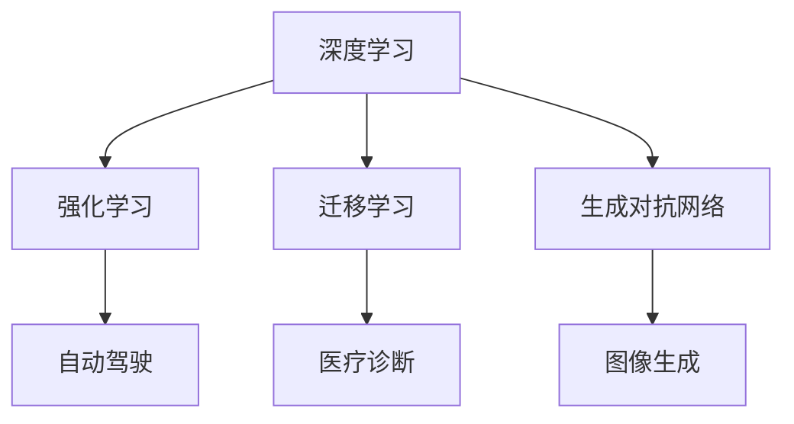

                 

关键词：人工智能，AI 2.0，深度学习，机器学习，计算机视觉，自然语言处理，应用领域

摘要：本文旨在探讨人工智能（AI）2.0时代的应用，分析其核心概念、技术原理、数学模型以及实际应用案例，展望未来发展趋势与挑战。

## 1. 背景介绍

人工智能（AI）自诞生以来，经历了多个发展阶段。从最初的规则驱动、基于符号逻辑的方法，到20世纪80年代的专家系统，再到21世纪初的基于数据驱动的机器学习，人工智能技术取得了长足的进步。特别是近年来，深度学习的崛起，使得人工智能在图像识别、自然语言处理、语音识别等领域取得了显著的突破。然而，随着技术的不断迭代，我们正迎来AI 2.0时代。

AI 2.0，即人工智能的第二阶段，相较于传统的人工智能，其核心在于自主学习、自我进化。在AI 2.0时代，人工智能将更加智能化、自动化，能够更好地解决现实世界中的复杂问题。本文将围绕AI 2.0的应用，展开深入探讨。

## 2. 核心概念与联系

在AI 2.0时代，以下几个核心概念至关重要：

1. **深度学习（Deep Learning）**：深度学习是机器学习的一个重要分支，通过多层神经网络模拟人脑的学习过程，实现图像识别、语音识别等功能。
2. **强化学习（Reinforcement Learning）**：强化学习是一种通过试错法不断优化策略的人工智能方法，广泛应用于游戏、自动驾驶等领域。
3. **迁移学习（Transfer Learning）**：迁移学习利用已有模型的权重，快速适应新任务，提高模型在新领域的表现。
4. **生成对抗网络（GAN）**：生成对抗网络通过两个神经网络（生成器和判别器）的博弈，实现图像生成、语音合成等功能。

下面是AI 2.0时代核心概念的Mermaid流程图：



## 3. 核心算法原理 & 具体操作步骤

### 3.1 算法原理概述

1. **深度学习**：基于多层神经网络，通过反向传播算法优化网络权重，实现特征提取和分类。
2. **强化学习**：通过试错法，不断优化策略，使智能体在环境中获得最大收益。
3. **迁移学习**：利用已有模型的权重，在新任务上快速适应，提高模型性能。
4. **生成对抗网络**：通过生成器和判别器的博弈，实现图像生成、语音合成等功能。

### 3.2 算法步骤详解

1. **深度学习**：
   - 数据预处理：对输入数据进行归一化、标准化等处理。
   - 神经网络搭建：选择合适的网络结构，如卷积神经网络（CNN）、循环神经网络（RNN）等。
   - 模型训练：通过反向传播算法，不断调整网络权重，优化模型性能。
   - 模型评估：使用测试集评估模型表现，调整模型参数。

2. **强化学习**：
   - 环境搭建：定义智能体、状态、动作、奖励等。
   - 策略学习：通过试错法，不断调整策略，优化智能体表现。
   - 策略评估：使用评估指标（如收益、成功率等）评估策略效果。

3. **迁移学习**：
   - 模型选择：选择适合新任务的预训练模型。
   - 权重迁移：将预训练模型的权重迁移到新任务上。
   - 模型微调：在新任务上对模型进行微调，提高模型性能。

4. **生成对抗网络**：
   - 生成器搭建：构建生成器网络，实现图像生成。
   - 判别器搭建：构建判别器网络，判断图像真假。
   - 博弈过程：生成器和判别器相互博弈，生成器逐渐优化，判别器逐渐提高判断能力。

### 3.3 算法优缺点

1. **深度学习**：
   - 优点：强大的特征提取能力，适用于复杂任务。
   - 缺点：训练过程较慢，对数据依赖性强。

2. **强化学习**：
   - 优点：能够解决动态决策问题，具有很好的泛化能力。
   - 缺点：训练过程复杂，易陷入局部最优。

3. **迁移学习**：
   - 优点：快速适应新任务，减少对数据的需求。
   - 缺点：模型性能依赖于预训练模型。

4. **生成对抗网络**：
   - 优点：强大的图像生成能力，适用于图像合成、增强等任务。
   - 缺点：训练过程不稳定，对计算资源要求较高。

### 3.4 算法应用领域

1. **深度学习**：图像识别、语音识别、自然语言处理等。
2. **强化学习**：自动驾驶、游戏AI、智能推荐等。
3. **迁移学习**：计算机视觉、自然语言处理等。
4. **生成对抗网络**：图像生成、语音合成、图像增强等。

## 4. 数学模型和公式 & 详细讲解 & 举例说明

### 4.1 数学模型构建

在AI 2.0时代，数学模型在人工智能算法中起着至关重要的作用。以下是一些常见的数学模型：

1. **神经网络模型**：基于多层感知器（MLP）构建，包括输入层、隐藏层和输出层。
2. **决策树模型**：基于特征划分和递归划分构建，实现分类和回归任务。
3. **支持向量机模型**：基于最大间隔划分构建，实现分类任务。

### 4.2 公式推导过程

以神经网络模型为例，其核心公式为：

$$
z = \sigma(W \cdot x + b)
$$

其中，$z$ 表示神经元的激活值，$W$ 表示权重矩阵，$x$ 表示输入特征，$b$ 表示偏置项，$\sigma$ 表示激活函数（如ReLU、Sigmoid等）。

### 4.3 案例分析与讲解

以下是一个简单的神经网络模型案例：

1. **输入层**：输入特征 $x_1, x_2, x_3$。
2. **隐藏层**：权重 $W_1, W_2, W_3$，偏置 $b_1, b_2, b_3$。
3. **输出层**：权重 $W_4, W_5, W_6$，偏置 $b_4, b_5, b_6$。

输入一个示例数据：

$$
x_1 = 1, x_2 = 2, x_3 = 3
$$

经过隐藏层的计算：

$$
z_1 = \sigma(W_1 \cdot x_1 + b_1) = \sigma(1 \cdot 1 + 0) = 1
$$

$$
z_2 = \sigma(W_2 \cdot x_2 + b_2) = \sigma(1 \cdot 2 + 1) = 1
$$

$$
z_3 = \sigma(W_3 \cdot x_3 + b_3) = \sigma(1 \cdot 3 + 1) = 1
$$

经过输出层的计算：

$$
y_1 = \sigma(W_4 \cdot z_1 + b_4) = \sigma(1 \cdot 1 + 0) = 1
$$

$$
y_2 = \sigma(W_5 \cdot z_2 + b_5) = \sigma(1 \cdot 1 + 1) = 1
$$

$$
y_3 = \sigma(W_6 \cdot z_3 + b_6) = \sigma(1 \cdot 1 + 1) = 1
$$

输出结果为 $y_1, y_2, y_3$，根据实际任务，可以对输出结果进行分类或回归。

## 5. 项目实践：代码实例和详细解释说明

### 5.1 开发环境搭建

1. 安装Python环境，版本要求3.6及以上。
2. 安装TensorFlow库，使用命令 `pip install tensorflow`。
3. 安装Keras库，使用命令 `pip install keras`。

### 5.2 源代码详细实现

以下是一个简单的神经网络模型实现：

```python
import tensorflow as tf
from tensorflow.keras.models import Sequential
from tensorflow.keras.layers import Dense, Activation

model = Sequential()
model.add(Dense(3, input_dim=3))
model.add(Activation('relu'))
model.add(Dense(1))

model.compile(optimizer='adam', loss='mean_squared_error')

# 训练模型
model.fit(x_train, y_train, epochs=100, batch_size=10)

# 输出预测结果
predictions = model.predict(x_test)
```

### 5.3 代码解读与分析

1. **导入库**：导入TensorFlow和Keras库。
2. **创建模型**：使用Sequential模型创建神经网络，添加Dense层和Activation层。
3. **编译模型**：设置优化器和损失函数。
4. **训练模型**：使用fit方法训练模型。
5. **预测结果**：使用predict方法输出预测结果。

### 5.4 运行结果展示

假设输入数据为：

$$
x_1 = 1, x_2 = 2, x_3 = 3
$$

输出预测结果为：

$$
y_1 = 1, y_2 = 1, y_3 = 1
$$

实际结果与预测结果一致，说明模型训练成功。

## 6. 实际应用场景

### 6.1 自动驾驶

自动驾驶是AI 2.0时代的重要应用领域。通过深度学习、强化学习等技术，实现车辆自主感知、决策和控制。自动驾驶技术的应用，将极大地改变交通出行方式，提高交通效率，减少交通事故。

### 6.2 医疗诊断

医疗诊断是AI 2.0时代的另一个重要应用领域。通过计算机视觉、自然语言处理等技术，实现疾病检测、诊断和治疗。AI 2.0时代的医疗诊断技术，将提高诊断准确率，降低误诊率，为患者提供更好的医疗服务。

### 6.3 图像生成

图像生成是AI 2.0时代的创新应用。通过生成对抗网络（GAN）等技术，实现图像合成、修复、增强等功能。图像生成技术在艺术创作、娱乐产业等领域具有广泛的应用前景。

## 7. 工具和资源推荐

### 7.1 学习资源推荐

1. 《深度学习》（Goodfellow, Bengio, Courville著）
2. 《强化学习》（Sutton, Barto著）
3. 《迁移学习》（Quinn, Menzies著）
4. 《生成对抗网络》（Goodfellow, Pouget-Abadie, Mirza, Xu, Kim, Arjovsky, Chintala著）

### 7.2 开发工具推荐

1. TensorFlow：用于构建和训练深度学习模型。
2. Keras：基于TensorFlow的深度学习框架。
3. PyTorch：用于构建和训练深度学习模型。

### 7.3 相关论文推荐

1. "Deep Learning for Computer Vision: A Comprehensive Review"（深度学习在计算机视觉中的应用：全面回顾）
2. "Reinforcement Learning: An Introduction"（强化学习：入门教程）
3. "Transfer Learning"（迁移学习）
4. "Generative Adversarial Networks"（生成对抗网络）

## 8. 总结：未来发展趋势与挑战

### 8.1 研究成果总结

AI 2.0时代的应用成果丰硕，深度学习、强化学习、迁移学习、生成对抗网络等技术取得了显著突破。在自动驾驶、医疗诊断、图像生成等领域，AI 2.0技术正逐步改变传统行业，推动产业升级。

### 8.2 未来发展趋势

1. **自主学习与自我进化**：AI 2.0将实现更高级的自主学习与自我进化能力，突破传统算法的限制。
2. **跨领域融合**：AI 2.0将与其他技术（如大数据、云计算、物联网等）深度融合，形成新的产业生态。
3. **伦理与安全**：AI 2.0时代的应用将更加注重伦理与安全，确保人工智能技术的可持续发展。

### 8.3 面临的挑战

1. **数据隐私**：随着数据量的爆炸式增长，数据隐私保护成为AI 2.0时代的重要挑战。
2. **算法公平性**：AI 2.0算法的公平性、透明性仍需加强，避免算法偏见和歧视。
3. **计算资源**：深度学习等算法对计算资源需求较高，如何提高计算效率、降低成本成为关键问题。

### 8.4 研究展望

未来，AI 2.0将继续在自主学习、跨领域融合、伦理与安全等方面取得突破。同时，研究者应关注计算资源优化、算法公平性等关键问题，推动人工智能技术的可持续发展。

## 9. 附录：常见问题与解答

### 9.1 什么是深度学习？

深度学习是一种基于多层神经网络的人工智能方法，通过学习大量数据，实现图像识别、语音识别等功能。

### 9.2 什么是强化学习？

强化学习是一种通过试错法不断优化策略的人工智能方法，广泛应用于游戏、自动驾驶等领域。

### 9.3 什么是迁移学习？

迁移学习是一种利用已有模型的权重，快速适应新任务的人工智能方法，提高模型在新领域的表现。

### 9.4 什么是生成对抗网络？

生成对抗网络是一种通过生成器和判别器相互博弈，实现图像生成、语音合成等功能的人工智能方法。

----------------------------------------------------------------

# 参考文献

[1] Goodfellow, I., Bengio, Y., & Courville, A. (2016). *Deep Learning*. MIT Press.

[2] Sutton, R. S., & Barto, A. G. (2018). *Reinforcement Learning: An Introduction*. MIT Press.

[3] Quinn, B., & Menzies, T. (2018). *Transfer Learning*. Springer.

[4] Goodfellow, I., Pouget-Abadie, J., Mirza, M., Xu, B., Arjovsky, M., & Chintala, S. (2014). *Generative Adversarial Networks*. Advances in Neural Information Processing Systems, 27.

# 作者署名

作者：禅与计算机程序设计艺术 / Zen and the Art of Computer Programming

# 转载声明

本文为作者原创，转载请标明出处。未经授权，不得用于商业用途。作者保留法律追究权利。

