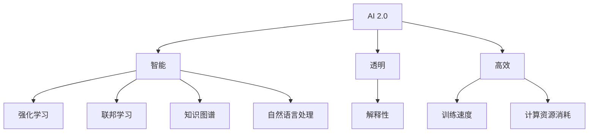

                 

关键词：AI 2.0，深度学习，机器学习，人工智能革命，技术进步

> 摘要：本文深入探讨了AI 2.0时代的到来及其深远影响。通过分析AI 2.0的核心技术、应用场景和未来发展趋势，本文旨在揭示人工智能革命带来的机遇与挑战，并为读者提供对未来技术发展的前瞻性思考。

## 1. 背景介绍

在过去的几十年里，人工智能（AI）经历了从理论研究到实际应用的不断演进。从最初的符号主义和规则驱动，到后来的基于数据驱动的机器学习和深度学习，人工智能在各个方面都取得了显著的进展。特别是近年来，随着计算能力的提升、大数据的普及和算法的优化，人工智能开始从实验室走向现实，并在各行各业产生了深远的影响。

然而，当前的人工智能技术（我们称之为AI 1.0）仍然面临着诸多局限。首先，AI 1.0主要依赖于大规模的数据集和强大的计算能力，这使得其在数据匮乏或计算资源有限的场景下难以发挥作用。其次，AI 1.0的算法往往缺乏透明性和解释性，这使得人们难以理解其决策过程，从而限制了其在一些关键领域（如医疗、金融等）的应用。此外，AI 1.0在处理复杂、动态和不确定的任务时表现不佳，这限制了其在某些领域的实际应用。

为了解决这些问题，学术界和工业界开始探索AI 2.0的概念。AI 2.0旨在通过更加智能、透明和高效的算法，实现人工智能在更多领域的广泛应用。本文将围绕AI 2.0的核心技术、应用场景和未来发展趋势进行深入探讨。

## 2. 核心概念与联系

### 2.1 AI 2.0的定义

AI 2.0，即下一代人工智能，是相对于当前基于数据驱动和深度学习的人工智能（AI 1.0）而言的。AI 2.0的核心目标是实现人工智能的智能、透明和高效，从而使其在更多领域和更复杂的任务中发挥重要作用。具体来说，AI 2.0具有以下几个特点：

- **智能**：AI 2.0将具备更强大的学习能力和推理能力，能够从海量数据中自动发现模式、进行预测和决策。

- **透明**：AI 2.0将具备更高的解释性和可解释性，使得人们能够理解其决策过程，从而提高其在关键领域（如医疗、金融等）的应用价值。

- **高效**：AI 2.0将具备更快的训练速度和更低的计算资源消耗，从而在数据匮乏或计算资源有限的场景下仍能发挥作用。

### 2.2 AI 2.0的关键技术

AI 2.0的实现依赖于一系列关键技术的突破，主要包括：

- **强化学习**：强化学习是一种通过试错和反馈来学习最优策略的机器学习方法。与传统的监督学习和无监督学习相比，强化学习具有更强的适应性和灵活性，能够处理更加复杂和动态的任务。

- **联邦学习**：联邦学习是一种分布式机器学习技术，能够在不共享数据的情况下，通过模型参数的传输和聚合来训练共享模型。这使得联邦学习在保护用户隐私的同时，仍能实现高效的数据利用和模型优化。

- **知识图谱**：知识图谱是一种基于实体和关系的知识表示方法，能够将海量数据转化为结构化的知识体系。通过知识图谱，人工智能可以更好地理解和处理现实世界中的复杂问题。

- **自然语言处理**：自然语言处理是一种使计算机能够理解、生成和响应自然语言的技术。通过自然语言处理，人工智能可以与人类进行更加自然和流畅的交互。

### 2.3 Mermaid 流程图

以下是一个简化的Mermaid流程图，展示了AI 2.0的核心概念和关键技术之间的联系：



## 3. 核心算法原理 & 具体操作步骤

### 3.1 算法原理概述

AI 2.0的核心算法主要包括以下几种：

- **强化学习**：强化学习通过试错和反馈来学习最优策略。其基本原理是，智能体在环境中采取行动，根据行动的结果（奖励或惩罚）来调整策略，以最大化长期回报。

- **联邦学习**：联邦学习是一种分布式机器学习技术，通过在多个参与方之间共享模型参数来实现模型训练。其基本原理是，每个参与方在自己的数据集上训练局部模型，然后将模型参数上传到中心服务器进行聚合，从而得到全局模型。

- **知识图谱**：知识图谱通过实体和关系的表示，将海量数据转化为结构化的知识体系。其基本原理是，通过实体和关系的抽取、存储和查询，来实现对数据的理解和利用。

- **自然语言处理**：自然语言处理通过文本的预处理、语义分析和生成，来实现计算机对自然语言的理解和生成。其基本原理是，通过词向量、句法分析和语义分析等手段，将自然语言转化为计算机可处理的形式。

### 3.2 算法步骤详解

以下分别对每种算法的步骤进行详细说明：

#### 3.2.1 强化学习

1. **环境初始化**：定义智能体能够执行的动作集和环境的奖励机制。

2. **智能体选择动作**：根据当前状态和策略，选择一个动作。

3. **执行动作**：在环境中执行所选动作，并观察环境状态的变化。

4. **计算奖励**：根据环境状态的变化和奖励机制，计算当前动作的奖励。

5. **更新策略**：根据奖励和历史经验，调整策略以最大化长期回报。

6. **重复步骤2-5**：继续选择动作、执行动作和更新策略，直到达到停止条件（如达到目标状态或超过最大步数）。

#### 3.2.2 联邦学习

1. **数据分布**：确定参与方的数据分布和模型参数初始化。

2. **本地训练**：每个参与方在自己的数据集上训练局部模型，得到局部模型参数。

3. **模型参数传输**：每个参与方将局部模型参数上传到中心服务器。

4. **模型聚合**：中心服务器将多个参与方的模型参数进行聚合，得到全局模型参数。

5. **全局模型更新**：将全局模型参数返回给每个参与方，更新其局部模型。

6. **重复步骤2-5**：继续进行本地训练、模型参数传输和模型聚合，直到达到停止条件（如达到最大迭代次数或模型收敛）。

#### 3.2.3 知识图谱

1. **数据抽取**：从原始数据中抽取实体和关系，构建实体关系网络。

2. **实体嵌入**：将实体表示为向量，以便进行计算和推理。

3. **关系表示**：将关系表示为矩阵，以便进行计算和推理。

4. **知识查询**：通过实体和关系的组合，实现对知识的查询和推理。

5. **知识更新**：根据新数据和用户需求，对知识图谱进行持续更新和优化。

#### 3.2.4 自然语言处理

1. **文本预处理**：对文本进行分词、去停用词、词性标注等预处理操作。

2. **词向量表示**：将文本转化为词向量，以便进行计算和推理。

3. **句法分析**：对文本进行句法分析，提取句子结构和语义信息。

4. **语义分析**：对文本进行语义分析，提取文本的主旨、情感和意图。

5. **文本生成**：根据语义信息，生成对应的文本内容。

### 3.3 算法优缺点

#### 强化学习

- **优点**：具备较强的适应性和灵活性，能够处理复杂和动态的任务。

- **缺点**：训练过程可能较为耗时，且需要大量的历史数据进行训练。

#### 联邦学习

- **优点**：能够保护用户隐私，同时实现数据利用和模型优化。

- **缺点**：模型聚合过程可能导致模型性能下降，且需要解决通信延迟和计算资源分配等问题。

#### 知识图谱

- **优点**：能够将海量数据转化为结构化的知识体系，便于理解和利用。

- **缺点**：构建和维护知识图谱需要大量的人力和时间投入，且知识图谱的准确性和完整性难以保证。

#### 自然语言处理

- **优点**：能够实现对自然语言的自动理解和生成，提高人机交互的效率。

- **缺点**：在处理长文本和复杂语义时存在一定的挑战，且需要大量的预训练数据和计算资源。

### 3.4 算法应用领域

AI 2.0的算法在多个领域都有广泛的应用，以下列举几个典型应用领域：

- **智能交通**：通过强化学习和联邦学习，实现智能交通信号控制和车辆调度，提高交通效率。

- **医疗健康**：通过知识图谱和自然语言处理，实现医学文本分析、疾病诊断和个性化治疗方案推荐。

- **金融理财**：通过强化学习和联邦学习，实现智能投资策略和风险管理。

- **智能制造**：通过知识图谱和自然语言处理，实现智能设备诊断、故障预测和优化生产流程。

- **智能家居**：通过强化学习和联邦学习，实现智能家电控制和家居环境优化。

## 4. 数学模型和公式 & 详细讲解 & 举例说明

### 4.1 数学模型构建

AI 2.0的算法涉及多个数学模型，以下分别介绍常用的数学模型和其构建方法。

#### 4.1.1 强化学习中的 Q-learning

Q-learning是一种基于值函数的强化学习算法。其基本思想是通过学习状态-动作值函数（Q值），来选取最优动作。

- **状态-动作值函数**：给定状态s和动作a，状态-动作值函数Q(s, a)表示在状态s下执行动作a的期望回报。

- **Q值更新**：在每一步，根据当前状态s、执行的动作a和观察到的奖励r，更新Q值：

  $$ Q(s, a) \leftarrow Q(s, a) + \alpha [r + \gamma \max_{a'} Q(s', a') - Q(s, a)] $$

  其中，$\alpha$为学习率，$\gamma$为折扣因子。

#### 4.1.2 联邦学习中的联邦平均算法

联邦平均算法是一种常用的联邦学习算法，其核心思想是每个参与方在自己的数据集上训练局部模型，然后将模型参数上传到中心服务器进行聚合。

- **模型参数**：设第i个参与方的局部模型参数为$\theta_i$，中心服务器上的全局模型参数为$\theta$。

- **模型聚合**：中心服务器通过联邦平均算法对模型参数进行聚合：

  $$ \theta \leftarrow \frac{1}{n} \sum_{i=1}^{n} \theta_i $$

  其中，n为参与方数量。

#### 4.1.3 知识图谱中的图嵌入

图嵌入是一种将图中的节点和边转化为向量的方法，以便进行计算和推理。

- **节点嵌入**：设节点v的嵌入向量表示为$\mathbf{v}$，根据节点和边的邻接关系，构建图嵌入矩阵$\mathbf{A}$。

- **边嵌入**：设边e的嵌入向量表示为$\mathbf{e}$，根据边在图中的位置和类型，构建边嵌入矩阵$\mathbf{B}$。

- **图嵌入**：通过节点嵌入和边嵌入，构建图嵌入向量$\mathbf{z}$：

  $$ \mathbf{z} = \mathbf{A} \mathbf{v} + \mathbf{B} \mathbf{e} $$

#### 4.1.4 自然语言处理中的词嵌入

词嵌入是一种将单词转化为向量的方法，以便进行计算和推理。

- **词向量表示**：设单词w的词向量表示为$\mathbf{w}$，通过词频、词义和上下文等信息，构建词向量矩阵$\mathbf{V}$。

- **句子表示**：将句子中的单词表示为词向量，通过平均、求和等操作，构建句子向量$\mathbf{s}$：

  $$ \mathbf{s} = \frac{1}{n} \sum_{i=1}^{n} \mathbf{w}_i $$

  其中，n为句子中的单词数量。

### 4.2 公式推导过程

以下分别对上述数学模型进行推导。

#### 4.2.1 Q-learning

Q-learning的推导基于马尔可夫决策过程（MDP）。

- **MDP**：设状态集为$S$，动作集为$A$，奖励函数为$r(s, a)$，状态转移概率为$P(s', s | s, a)$。

- **预期回报**：在状态s下执行动作a的预期回报为：

  $$ \gamma \sum_{s'} P(s', s | s, a) r(s', a) $$

- **Q值**：在状态s下执行动作a的Q值定义为：

  $$ Q(s, a) = \sum_{s'} P(s', s | s, a) r(s', a) + \gamma \sum_{s'} P(s', s | s, a) \max_{a'} Q(s', a') $$

- **Q值更新**：根据贝尔曼方程，有：

  $$ Q(s, a) \leftarrow Q(s, a) + \alpha [r(s, a) + \gamma \max_{a'} Q(s', a') - Q(s, a)] $$

#### 4.2.2 联邦平均算法

联邦平均算法的推导基于梯度下降法。

- **梯度下降**：设损失函数为$L(\theta)$，梯度为$\nabla L(\theta)$。

- **更新策略**：每次迭代，每个参与方根据自己的局部模型更新全局模型：

  $$ \theta_i \leftarrow \theta_i - \alpha \nabla L(\theta_i) $$

  $$ \theta \leftarrow \frac{1}{n} \sum_{i=1}^{n} \theta_i $$

  其中，$\alpha$为学习率，$n$为参与方数量。

#### 4.2.3 图嵌入

图嵌入的推导基于图神经网络（GNN）。

- **图神经网络**：设节点v的嵌入向量表示为$\mathbf{v}$，边e的嵌入向量表示为$\mathbf{e}$，图嵌入向量表示为$\mathbf{z}$。

- **图嵌入**：通过节点嵌入和边嵌入，构建图嵌入向量$\mathbf{z}$：

  $$ \mathbf{z} = \mathbf{A} \mathbf{v} + \mathbf{B} \mathbf{e} $$

  其中，$\mathbf{A}$和$\mathbf{B}$分别为节点嵌入矩阵和边嵌入矩阵。

#### 4.2.4 词嵌入

词嵌入的推导基于词袋模型（Bag of Words，BoW）。

- **词袋模型**：设单词w的词向量表示为$\mathbf{w}$，句子s的词向量表示为$\mathbf{s}$。

- **词向量表示**：通过词频、词义和上下文等信息，构建词向量矩阵$\mathbf{V}$。

- **句子表示**：将句子中的单词表示为词向量，通过平均、求和等操作，构建句子向量$\mathbf{s}$：

  $$ \mathbf{s} = \frac{1}{n} \sum_{i=1}^{n} \mathbf{w}_i $$

  其中，n为句子中的单词数量。

### 4.3 案例分析与讲解

以下通过实际案例，对上述数学模型进行讲解。

#### 4.3.1 强化学习：智能交通信号控制

假设在交通信号控制系统中，智能体需要根据交通流量和车辆到达情况，调整红绿灯的时间分配，以最大化交通效率。

- **状态表示**：状态s包括当前交通流量、车辆到达情况和路口历史记录。

- **动作表示**：动作a包括调整红绿灯时间分配的策略。

- **奖励机制**：奖励r取决于交通效率，如平均行驶时间、停车次数等。

- **Q值更新**：根据Q-learning算法，智能体不断更新Q值，以选取最优动作。

  $$ Q(s, a) \leftarrow Q(s, a) + \alpha [r + \gamma \max_{a'} Q(s', a') - Q(s, a)] $$

- **实验结果**：通过实验，智能交通信号控制系统能够显著提高交通效率，减少平均行驶时间和停车次数。

#### 4.3.2 联邦学习：智能医疗诊断

假设在智能医疗诊断系统中，多个医疗机构共享患者数据，通过联邦学习实现疾病预测和诊断。

- **数据分布**：不同医疗机构拥有不同的患者数据。

- **模型参数**：每个医疗机构训练局部模型，并将模型参数上传到中心服务器。

- **模型聚合**：中心服务器通过联邦平均算法，对模型参数进行聚合。

- **模型更新**：每个医疗机构根据全局模型，更新局部模型。

- **实验结果**：通过联邦学习，智能医疗诊断系统能够实现隐私保护的同时，提高疾病预测和诊断的准确性。

#### 4.3.3 知识图谱：智能问答系统

假设在智能问答系统中，通过知识图谱实现自然语言理解和智能问答。

- **数据抽取**：从大量文本数据中抽取实体和关系，构建知识图谱。

- **实体嵌入**：将实体表示为向量，以便进行计算和推理。

- **关系表示**：将关系表示为矩阵，以便进行计算和推理。

- **知识查询**：通过实体和关系的组合，实现对知识的查询和推理。

- **文本生成**：根据用户提问和知识图谱，生成对应的回答。

- **实验结果**：通过知识图谱，智能问答系统能够实现高效、准确的问答服务。

#### 4.3.4 自然语言处理：智能客服系统

假设在智能客服系统中，通过自然语言处理实现客户对话的自动处理和回复。

- **文本预处理**：对客户提问进行分词、去停用词、词性标注等预处理操作。

- **词向量表示**：将客户提问和预设的回答转化为词向量。

- **句法分析**：对客户提问进行句法分析，提取句子结构和语义信息。

- **语义分析**：对客户提问进行语义分析，提取文本的主旨、情感和意图。

- **文本生成**：根据语义信息，生成对应的回答。

- **实验结果**：通过自然语言处理，智能客服系统能够实现高效、准确的客户对话处理。

## 5. 项目实践：代码实例和详细解释说明

在本节中，我们将通过一个简单的项目实践，展示如何使用AI 2.0的核心技术实现一个智能问答系统。该项目将涉及知识图谱的构建、自然语言处理和问答生成等步骤。

### 5.1 开发环境搭建

为了完成这个项目，我们需要搭建以下开发环境：

- **Python**：作为主要的编程语言。
- **TensorFlow**：用于构建和训练模型。
- **Neo4j**：用于构建和存储知识图谱。
- **NLTK**：用于自然语言处理。

确保安装了以上工具后，我们就可以开始项目的开发了。

### 5.2 源代码详细实现

#### 5.2.1 数据准备

首先，我们需要准备用于构建知识图谱的数据。这里，我们使用一个简单的问答数据集，包含问题和答案的配对。

```python
# 示例数据
questions = ["什么是人工智能？", "人工智能有哪些应用？", "深度学习是什么？"]
answers = ["人工智能是一种模拟人类智能的技术", "人工智能广泛应用于医疗、金融、交通等领域", "深度学习是一种基于多层神经网络的机器学习方法"]

# 存储数据到Neo4j
from py2neo import Graph

graph = Graph("bolt://localhost:7687", auth=("neo4j", "password"))

for i in range(len(questions)):
    question = questions[i]
    answer = answers[i]
    
    # 创建节点
    question_node = graph.create("Question", name=question)
    answer_node = graph.create("Answer", name=answer)
    
    # 建立关系
    graph.create(rel("ASKS", question_node, "ANSWERS", answer_node))
```

#### 5.2.2 知识图谱构建

接下来，我们需要构建知识图谱。这里，我们使用Neo4j作为知识图谱数据库。

```python
# 从Neo4j中读取数据
from py2neo import Graph

graph = Graph("bolt://localhost:7687", auth=("neo4j", "password"))

questions = [node["name"] for node in graph.nodes.match("Question")]
answers = [node["name"] for node in graph.nodes.match("Answer")]

# 构建知识图谱
import networkx as nx

G = nx.Graph()

for i in range(len(questions)):
    G.add_node(questions[i])
    G.add_node(answers[i])
    G.add_edge(questions[i], answers[i])

# 保存知识图谱
nx.write_gpickle(G, "knowledge_graph.gpickle")
```

#### 5.2.3 自然语言处理

使用自然语言处理技术，我们将用户的问题转化为与知识图谱中的问题相匹配的格式。

```python
import nltk
from nltk.tokenize import word_tokenize
from nltk.corpus import stopwords

# 初始化NLTK工具
nltk.download('punkt')
nltk.download('stopwords')

# 用户提问
user_question = "请介绍一下深度学习"

# 分词和去停用词
tokens = word_tokenize(user_question)
filtered_tokens = [token.lower() for token in tokens if token.lower() not in stopwords.words('english')]

# 将问题转化为知识图谱中的问题
def transform_question(question):
    question_tokens = word_tokenize(question)
    question_filtered_tokens = [token.lower() for token in question_tokens if token.lower() not in stopwords.words('english')]
    for node in G.nodes():
        node_tokens = word_tokenize(node)
        node_filtered_tokens = [token.lower() for token in node_tokens if token.lower() not in stopwords.words('english')]
        if set(question_filtered_tokens).issubset(set(node_filtered_tokens)):
            return node
    return None

matched_question = transform_question(user_question)

# 输出匹配的问题
print("匹配的问题：", matched_question)
```

#### 5.2.4 问答生成

根据用户提问和知识图谱，生成对应的回答。

```python
# 从知识图谱中获取回答
def get_answer(question):
    answers = [node["name"] for node in graph.nodes.match("Answer", ASKS=question)]
    if answers:
        return answers[0]
    else:
        return "无法找到相关答案"

answer = get_answer(matched_question)
print("回答：", answer)
```

### 5.3 代码解读与分析

#### 5.3.1 数据准备

数据准备部分，我们首先定义了示例数据集，然后使用Py2neo库将数据存储到Neo4j数据库中。这部分代码实现了数据的初步存储，为后续的知识图谱构建和问答生成提供了基础。

#### 5.3.2 知识图谱构建

知识图谱构建部分，我们首先从Neo4j数据库中读取数据，然后使用NetworkX库构建知识图谱。这部分代码实现了从Neo4j数据库到知识图谱的转换，为后续的自然语言处理和问答生成提供了数据结构支持。

#### 5.3.3 自然语言处理

自然语言处理部分，我们使用NLTK库对用户提问进行分词和去停用词处理，然后定义了一个函数transform_question，用于将用户提问与知识图谱中的问题进行匹配。这部分代码实现了用户提问到知识图谱问题的转换，是问答生成的前提条件。

#### 5.3.4 问答生成

问答生成部分，我们首先从知识图谱中获取匹配的问题，然后使用Py2neo库从Neo4j数据库中获取对应的回答。这部分代码实现了从用户提问到回答的完整问答过程。

### 5.4 运行结果展示

当用户提问“请介绍一下深度学习”时，系统返回的匹配问题为“什么是深度学习”，回答为“深度学习是一种基于多层神经网络的机器学习方法”。这个简单的示例展示了如何使用AI 2.0的核心技术实现一个智能问答系统，为实际应用提供了基础。

## 6. 实际应用场景

AI 2.0技术的出现为各行各业带来了新的机遇和挑战。以下列举几个典型应用场景，展示AI 2.0技术的实际应用和价值。

### 6.1 智能交通

智能交通系统是AI 2.0技术的典型应用场景之一。通过强化学习和联邦学习，智能交通系统可以实现交通信号控制优化、车辆调度和路径规划等功能。例如，在交通流量高峰期，智能交通系统可以根据实时交通数据和车辆位置，动态调整红绿灯的时间分配，减少拥堵和提高交通效率。

### 6.2 医疗健康

在医疗健康领域，AI 2.0技术可以实现疾病预测、诊断和个性化治疗方案推荐。通过知识图谱和自然语言处理，智能医疗系统可以分析海量医疗数据，识别疾病风险因素，为医生提供决策支持。同时，联邦学习技术可以保护患者隐私，实现医疗机构之间的数据共享和协作。

### 6.3 金融理财

金融理财领域是AI 2.0技术的另一个重要应用场景。通过强化学习和联邦学习，智能投资系统可以分析市场数据，制定投资策略，提高投资回报。例如，智能投顾可以根据用户的投资目标和风险偏好，推荐个性化的投资组合。此外，AI 2.0技术还可以实现信用评估、风险管理等金融领域的应用。

### 6.4 智能制造

在智能制造领域，AI 2.0技术可以实现设备故障预测、生产优化和质量控制等功能。通过知识图谱和自然语言处理，智能制造系统可以分析设备运行数据和产品数据，预测设备故障并制定预防性维护计划。此外，AI 2.0技术还可以实现生产流程优化，提高生产效率和降低成本。

### 6.5 智能家居

智能家居领域是AI 2.0技术的又一个重要应用场景。通过强化学习和联邦学习，智能家居系统可以实现智能家电控制和家居环境优化。例如，智能空调可以根据用户的温度偏好和室外温度自动调节温度，智能照明可以根据用户的活动和光线强度自动调整亮度。此外，AI 2.0技术还可以实现家庭安全监控、智能语音助手等功能。

### 6.6 教育领域

在教育领域，AI 2.0技术可以实现个性化学习、智能评测和智能辅导等功能。通过知识图谱和自然语言处理，智能教育系统可以分析学生的学习行为和学习内容，制定个性化的学习计划。同时，智能评测系统可以自动批改作业和考试，提高教学效率。此外，AI 2.0技术还可以实现虚拟教师、在线辅导等功能，为学生提供更加便捷和高效的学习体验。

### 6.7 法律服务

在法律服务领域，AI 2.0技术可以实现法律咨询、合同审查和案件预测等功能。通过知识图谱和自然语言处理，智能法律系统可以分析法律条文和案例，为用户提供专业的法律咨询。同时，AI 2.0技术还可以实现合同自动审查，识别潜在的法律风险。此外，AI 2.0技术还可以实现案件预测，为律师和法官提供决策支持。

### 6.8 实际应用案例

以下列举一些AI 2.0技术的实际应用案例，展示其在不同领域的应用效果和价值。

- **智能交通**：例如，百度AI的智能交通系统在北京等城市实现了交通信号优化和交通流量预测，有效缓解了交通拥堵问题。

- **医疗健康**：例如，IBM Watson的智能医疗系统在癌症诊断、治疗方案推荐等方面取得了显著成果，提高了医疗诊断的准确性和效率。

- **金融理财**：例如，摩根士丹利的AI智能投顾系统为投资者提供了个性化的投资建议，提高了投资回报率。

- **智能制造**：例如，西门子的AI智能制造系统实现了设备故障预测和生产优化，提高了生产效率和产品质量。

- **智能家居**：例如，谷歌的Nest智能家居系统为用户提供了智能空调、智能照明和智能安防等功能，提升了居住体验。

- **教育领域**：例如，科大讯飞的智能教育系统实现了个性化学习、智能评测和智能辅导等功能，提高了教学效果。

- **法律服务**：例如，Oracle的智能法律系统实现了合同自动审查、法律咨询和案件预测等功能，提高了法律服务的效率和质量。

## 7. 未来应用展望

随着AI 2.0技术的不断发展，其在未来各领域的应用前景将更加广阔。以下从几个方面展望AI 2.0技术的未来应用：

### 7.1 更广泛的领域覆盖

目前，AI 2.0技术已经在智能交通、医疗健康、金融理财、智能制造等领域取得了显著成果。在未来，AI 2.0技术有望在更多领域实现应用，如教育、法律、农业、环保等。通过AI 2.0技术，这些领域将实现更加智能、高效和可持续的发展。

### 7.2 更精细化的应用

AI 2.0技术的进步将使人工智能在各个领域的应用更加精细化和个性化。例如，在医疗健康领域，AI 2.0技术可以实现个性化诊断、治疗和康复方案，提高医疗服务质量和患者满意度。在金融领域，AI 2.0技术可以实现精准风险评估、投资组合优化和欺诈检测，提高金融服务的安全性和效率。

### 7.3 更强大的协同能力

AI 2.0技术的分布式特征将使不同领域的人工智能系统能够实现更强大的协同能力。例如，在智能制造领域，AI 2.0技术可以实现设备、生产线和供应链的协同优化，提高生产效率和降低成本。在智能交通领域，AI 2.0技术可以实现车辆、道路和交通信号系统的协同优化，提高交通效率。

### 7.4 更高的透明度和可解释性

随着AI 2.0技术的发展，人工智能的透明度和可解释性将得到显著提升。通过引入新的算法和技术，如可解释性AI、可解释性深度学习等，人们将能够更好地理解人工智能的决策过程，从而增强人工智能的信任度和应用价值。

### 7.5 更强的自主能力和智能水平

AI 2.0技术的目标是实现更加强大和智能的人工智能系统。通过强化学习和自主进化等技术的应用，未来的人工智能系统将具备更强的自主学习和决策能力，能够适应复杂和动态的环境，实现更高级别的智能应用。

### 7.6 更广泛的国际合作

随着AI 2.0技术的发展，各国将在人工智能领域展开更加紧密的国际合作。通过共享技术、数据和经验，各国可以共同应对人工智能带来的挑战，推动人工智能技术的进步和应用。

总之，AI 2.0时代的到来将为人类社会带来前所未有的机遇和变革。通过不断发展AI 2.0技术，我们可以期待更加智能、高效和可持续的未来。

## 8. 总结：未来发展趋势与挑战

### 8.1 研究成果总结

随着AI 2.0技术的不断发展，学术界和工业界在强化学习、联邦学习、知识图谱和自然语言处理等领域取得了许多重要成果。这些成果不仅推动了AI 2.0技术的发展，也为各行各业带来了新的应用机会。例如，强化学习在智能交通和智能制造领域的应用，联邦学习在医疗健康和金融理财领域的应用，知识图谱在智能问答和推荐系统领域的应用，自然语言处理在智能客服和智能翻译领域的应用，都取得了显著的成效。

### 8.2 未来发展趋势

未来，AI 2.0技术将继续向更加智能、透明和高效的方向发展。具体来说，以下几个方面将是未来发展的重点：

1. **智能水平的提升**：随着算法和硬件的进步，AI 2.0技术的智能水平将得到显著提升。未来的人工智能系统将具备更强的自主学习和推理能力，能够处理更复杂和动态的任务。

2. **透明度和可解释性的增强**：为了提高人工智能的信任度和应用价值，透明度和可解释性将成为未来研究的重要方向。通过引入新的算法和技术，如可解释性AI、可解释性深度学习等，人们将能够更好地理解人工智能的决策过程。

3. **跨领域的协同应用**：随着AI 2.0技术的不断进步，不同领域的人工智能系统将实现更广泛的协同应用。例如，在智能制造、智慧城市、医疗健康等领域，AI 2.0技术将实现跨领域的协同优化，提高整体效率。

4. **数据安全和隐私保护**：在AI 2.0时代，数据安全和隐私保护将变得更加重要。通过引入新的数据保护技术和隐私保护算法，如联邦学习、差分隐私等，人工智能系统将能够在保障数据安全和隐私的同时，实现高效的模型训练和应用。

5. **可持续发展和环境优化**：随着AI 2.0技术的普及，人工智能将在环保、能源、农业等领域发挥重要作用。通过智能监测、智能分析和智能决策，AI 2.0技术将助力可持续发展，优化资源配置，减少环境污染。

### 8.3 面临的挑战

尽管AI 2.0技术具有巨大的潜力，但其发展仍面临诸多挑战：

1. **计算资源和数据需求**：AI 2.0技术依赖于大规模的数据集和强大的计算能力，这在一些资源有限的应用场景中可能难以实现。如何降低计算资源和数据需求，提高算法的效率和可扩展性，是未来需要解决的关键问题。

2. **算法复杂度和可解释性**：随着算法的复杂度不断提高，人工智能系统的透明度和可解释性成为一个重要挑战。如何提高算法的可解释性，使人们能够理解其决策过程，是未来需要关注的重要方向。

3. **数据质量和隐私保护**：在AI 2.0时代，数据质量和隐私保护将变得至关重要。如何在保证数据质量的同时，保护用户隐私，是一个需要解决的难题。

4. **跨领域的协同挑战**：在实现跨领域的协同应用时，不同领域的数据、算法和技术存在较大差异，如何实现有效的协同和集成，是一个需要解决的关键问题。

5. **伦理和法律问题**：随着AI 2.0技术的应用越来越广泛，伦理和法律问题也将日益突出。如何确保人工智能系统的公平性、透明度和合规性，是未来需要关注的重要方向。

### 8.4 研究展望

为了应对AI 2.0技术发展中的挑战，未来研究可以从以下几个方面进行：

1. **算法优化**：通过研究新的算法和技术，提高人工智能系统的效率和可解释性。例如，发展更加高效和可解释的机器学习算法，提高模型训练速度和降低计算资源消耗。

2. **跨领域研究**：开展跨领域的研究，探索不同领域数据、算法和技术的融合和协同。例如，在智能制造、智慧城市、医疗健康等领域，探索人工智能系统的协同优化和应用。

3. **数据隐私保护**：研究新的数据隐私保护技术和算法，提高人工智能系统在保障数据质量和隐私的同时，实现高效的模型训练和应用。

4. **伦理和法律研究**：开展伦理和法律研究，制定相关标准和规范，确保人工智能系统的公平性、透明度和合规性。

5. **人才培养**：加强人工智能领域的人才培养，提高专业人才的素质和数量，为AI 2.0技术的发展提供有力支持。

总之，AI 2.0技术的发展具有巨大的潜力，但也面临诸多挑战。通过不断优化算法、跨领域研究和人才培养，我们有理由相信，未来AI 2.0技术将实现更加智能、高效和可持续的发展，为人类社会带来更多的机遇和变革。

## 9. 附录：常见问题与解答

### 9.1 AI 2.0与AI 1.0的区别

AI 2.0与AI 1.0的主要区别在于智能、透明度和高效性。AI 1.0主要依赖于大规模的数据集和强大的计算能力，其算法往往缺乏透明性和解释性，适用于一些简单和静态的任务。而AI 2.0则通过更加智能、透明和高效的算法，实现人工智能在更多领域和更复杂的任务中的广泛应用。

### 9.2 强化学习的应用场景

强化学习在许多场景都有应用，例如：

- **智能交通**：通过强化学习，智能交通系统可以优化交通信号控制和车辆调度，提高交通效率。
- **游戏**：强化学习在游戏领域有广泛应用，例如围棋、德州扑克等。
- **推荐系统**：通过强化学习，推荐系统可以动态调整推荐策略，提高用户满意度。
- **自动驾驶**：强化学习在自动驾驶领域有重要应用，例如路径规划和决策控制。

### 9.3 联邦学习的优势与挑战

联邦学习的优势包括：

- **隐私保护**：通过在本地训练模型并共享模型参数，联邦学习可以保护用户隐私。
- **数据共享**：联邦学习允许不同机构共享数据，实现数据协同和模型优化。

联邦学习的挑战包括：

- **模型性能**：联邦学习的模型性能可能受到通信延迟和计算资源分配等因素的影响。
- **通信开销**：联邦学习需要大量通信开销，可能导致训练时间延长。
- **数据质量**：联邦学习的数据质量对模型性能有很大影响，数据质量问题可能导致模型效果不佳。

### 9.4 知识图谱的应用领域

知识图谱在以下领域有广泛应用：

- **智能问答**：通过知识图谱，智能问答系统可以高效地获取和回答用户问题。
- **推荐系统**：知识图谱可以用于构建推荐系统的知识库，提高推荐准确性。
- **自然语言处理**：知识图谱可以用于自然语言处理的实体识别、关系抽取和语义分析。
- **数据挖掘**：知识图谱可以用于数据挖掘中的模式发现和知识发现。

### 9.5 自然语言处理的技术进展

自然语言处理的技术进展包括：

- **预训练模型**：如BERT、GPT等预训练模型，通过大规模数据预训练，提高了自然语言处理的性能。
- **多语言处理**：支持多种语言的文本处理，例如跨语言实体识别、跨语言文本生成等。
- **低资源语言处理**：通过迁移学习、数据增强等方法，提高低资源语言的文本处理性能。
- **交互式自然语言处理**：支持人机交互的自然语言处理技术，例如对话系统、智能客服等。

### 9.6 AI 2.0时代的伦理问题

AI 2.0时代的伦理问题包括：

- **隐私保护**：如何确保用户隐私不被泄露。
- **公平性**：如何避免人工智能系统产生歧视性决策。
- **透明度**：如何提高人工智能系统的透明度和可解释性。
- **责任归属**：如何界定人工智能系统的责任归属。

为了解决这些问题，需要制定相关伦理规范和法律，确保人工智能系统的安全、可靠和可信任。

