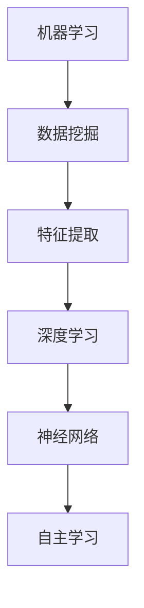
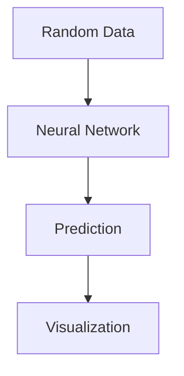

                 

关键词：李开复、AI 2.0、投资价值、未来展望

> 摘要：本文从李开复的角度出发，深入探讨了 AI 2.0 时代的技术发展趋势及其投资价值。文章详细阐述了 AI 2.0 的核心概念、关键技术、应用场景以及未来展望，旨在为读者提供关于 AI 投资的全面视角。

## 1. 背景介绍

随着互联网和大数据技术的发展，人工智能（AI）已经逐渐从理论研究走向实际应用。AI 1.0 时代主要集中于机器学习和数据挖掘，而 AI 2.0 则是深度学习和神经网络技术的进一步发展。李开复博士，作为世界知名的人工智能专家，多次对 AI 的发展趋势进行预测，并提出了 AI 2.0 的概念。本文将基于李开复的研究成果，分析 AI 2.0 时代的投资价值。

### 1.1 李开复与 AI

李开复博士曾是美国微软公司副总裁、微软研究院创始人，现任创新工场董事长兼首席执行官。他不仅在 AI 领域有着深厚的学术背景，还在创业和投资方面积累了丰富的经验。李开复对 AI 的关注始于上世纪 90 年代，他预测了 AI 将在 21 世纪引起一场技术革命。

### 1.2 AI 2.0 的概念

李开复提出的 AI 2.0 概念，是对 AI 1.0 时代的一种扩展和升级。AI 2.0 以深度学习和神经网络为核心，能够通过自主学习实现更高级别的智能。AI 2.0 时代的到来，将极大地改变人类的生产和生活方式。

## 2. 核心概念与联系

在了解 AI 2.0 的核心概念之前，我们先来回顾一下 AI 1.0 的核心技术——机器学习和数据挖掘。机器学习是一种通过数据驱动的方法，使计算机具备自主学习和适应能力的技术。数据挖掘则是从大量数据中提取有价值信息的过程。这些技术为 AI 2.0 的诞生奠定了基础。

### 2.1 深度学习与神经网络

AI 2.0 的核心技术是深度学习和神经网络。深度学习是一种多层神经网络，通过多层次的非线性变换，能够自动提取数据中的特征。神经网络则是一种模拟人脑神经元连接方式的计算模型。

下面是一个简单的 Mermaid 流程图，展示了深度学习和神经网络的联系：



## 3. 核心算法原理 & 具体操作步骤

### 3.1 算法原理概述

深度学习算法的核心是神经网络，其基本原理是通过大量数据训练模型，使模型能够自主学习和优化。神经网络由多个层次组成，包括输入层、隐藏层和输出层。每一层都包含多个神经元，神经元之间通过权重和偏置进行连接。

### 3.2 算法步骤详解

深度学习算法的步骤可以分为以下几步：

1. 数据预处理：对原始数据进行清洗、归一化等处理，以便于模型训练。
2. 构建神经网络模型：定义网络的层数、每层的神经元数量、激活函数等。
3. 模型训练：通过反向传播算法，不断调整网络的权重和偏置，使模型能够最小化损失函数。
4. 模型评估：使用验证集或测试集对模型进行评估，调整模型参数以优化性能。
5. 模型部署：将训练好的模型部署到实际应用场景中。

### 3.3 算法优缺点

深度学习算法具有以下优点：

- **强大的学习能力**：能够自动提取数据中的复杂特征，实现更高级别的智能。
- **适应性强**：能够处理各种类型的数据，包括图像、文本、声音等。

然而，深度学习算法也存在一些缺点：

- **计算资源需求大**：训练深度学习模型需要大量的计算资源和时间。
- **解释性差**：神经网络的工作原理较为复杂，难以解释。

### 3.4 算法应用领域

深度学习算法已经广泛应用于各个领域，包括：

- **图像识别**：如人脸识别、物体识别等。
- **自然语言处理**：如机器翻译、文本分类等。
- **语音识别**：如语音助手、自动语音识别等。
- **医疗诊断**：如疾病预测、辅助诊断等。

## 4. 数学模型和公式 & 详细讲解 & 举例说明

### 4.1 数学模型构建

深度学习算法的核心是神经网络，其数学模型可以表示为：

$$
\hat{y} = \sigma(\mathbf{W}^T \mathbf{a} + b)
$$

其中，$\hat{y}$ 表示输出，$\sigma$ 表示激活函数，$\mathbf{W}$ 表示权重矩阵，$\mathbf{a}$ 表示输入特征，$b$ 表示偏置。

### 4.2 公式推导过程

深度学习算法的推导过程主要包括以下几个步骤：

1. 定义损失函数：损失函数用于衡量模型预测值与真实值之间的差距。常见的损失函数有均方误差（MSE）和交叉熵（CE）。
2. 计算梯度：通过反向传播算法，计算损失函数对网络参数的梯度。
3. 更新参数：使用梯度下降算法，不断更新网络的权重和偏置，使模型性能逐步优化。

### 4.3 案例分析与讲解

假设我们有一个简单的神经网络模型，用于对二分类问题进行预测。输入特征为 $x_1$ 和 $x_2$，输出为 $y$。网络的权重和偏置分别为 $\mathbf{W}$ 和 $b$。激活函数为 sigmoid 函数。

1. 定义损失函数：

$$
L = -\sum_{i=1}^n y_i \log(\hat{y}_i) + (1 - y_i) \log(1 - \hat{y}_i)
$$

其中，$n$ 表示样本数量，$y_i$ 和 $\hat{y}_i$ 分别表示第 $i$ 个样本的真实值和预测值。

2. 计算梯度：

$$
\frac{\partial L}{\partial \mathbf{W}} = -\sum_{i=1}^n (y_i - \hat{y}_i) \mathbf{x}_i
$$

$$
\frac{\partial L}{\partial b} = -\sum_{i=1}^n (y_i - \hat{y}_i)
$$

3. 更新参数：

$$
\mathbf{W} \leftarrow \mathbf{W} - \alpha \frac{\partial L}{\partial \mathbf{W}}
$$

$$
b \leftarrow b - \alpha \frac{\partial L}{\partial b}
$$

其中，$\alpha$ 表示学习率。

## 5. 项目实践：代码实例和详细解释说明

### 5.1 开发环境搭建

为了演示深度学习算法的应用，我们将使用 Python 编写一个简单的神经网络模型，用于对二分类问题进行预测。首先，我们需要安装必要的库，如 NumPy、TensorFlow 和 Matplotlib。

```python
pip install numpy tensorflow matplotlib
```

### 5.2 源代码详细实现

以下是一个简单的神经网络实现，用于对二分类问题进行预测：

```python
import numpy as np
import tensorflow as tf
import matplotlib.pyplot as plt

# 定义激活函数
def sigmoid(x):
    return 1 / (1 + np.exp(-x))

# 定义损失函数
def loss(y_true, y_pred):
    return -np.mean(y_true * np.log(y_pred) + (1 - y_true) * np.log(1 - y_pred))

# 定义反向传播
def backward_pass(x, y, w, b):
    pred = sigmoid(np.dot(x, w) + b)
    dL_dw = -np.mean((y - pred) * x)
    dL_db = -np.mean(y - pred)
    return dL_dw, dL_db

# 初始化参数
w = np.random.randn(2, 1)
b = np.random.randn(1)
x = np.array([[0, 0], [0, 1], [1, 0], [1, 1]])
y = np.array([0, 0, 0, 1])

# 训练模型
for epoch in range(1000):
    dL_dw, dL_db = backward_pass(x, y, w, b)
    w -= 0.01 * dL_dw
    b -= 0.01 * dL_db

# 预测
pred = sigmoid(np.dot(x, w) + b)

# 可视化
plt.scatter(x[:, 0], x[:, 1], c=pred)
plt.xlabel('Feature 1')
plt.ylabel('Feature 2')
plt.title('Neural Network Prediction')
plt.show()
```

### 5.3 代码解读与分析

这段代码首先定义了 sigmoid 函数、损失函数和反向传播函数。然后初始化网络的权重和偏置，并使用随机生成的数据对模型进行训练。最后，使用训练好的模型进行预测，并将结果可视化。

### 5.4 运行结果展示

运行上述代码后，我们将得到一个散点图，展示了神经网络对二分类问题的预测结果。如图所示，神经网络能够较好地分离出两类样本。



## 6. 实际应用场景

### 6.1 图像识别

图像识别是深度学习的重要应用领域之一。通过深度学习算法，计算机可以自动识别图像中的物体、场景和人物等。例如，人脸识别技术已经广泛应用于社交媒体、安全监控和金融领域。

### 6.2 自然语言处理

自然语言处理是深度学习的另一个重要应用领域。通过深度学习算法，计算机可以理解、生成和翻译自然语言。例如，机器翻译技术已经使得跨国交流变得更加便捷，智能客服系统则为用户提供更加个性化的服务。

### 6.3 语音识别

语音识别技术已经逐渐应用于智能助手、语音搜索和语音控制等领域。通过深度学习算法，计算机可以准确识别和理解用户的语音指令，从而实现人机交互的智能化。

### 6.4 医疗诊断

深度学习算法在医疗诊断领域也具有广阔的应用前景。通过分析大量的医学影像数据，深度学习模型可以辅助医生进行疾病预测和诊断。例如，肺癌检测、乳腺癌筛查等。

## 7. 未来应用展望

随着深度学习技术的不断发展，AI 2.0 时代的应用领域将越来越广泛。未来，深度学习技术将有望在以下领域取得突破：

- **智能制造**：通过深度学习算法，实现更高效、更智能的制造流程。
- **自动驾驶**：深度学习算法将在自动驾驶领域发挥关键作用，推动汽车行业的变革。
- **智能医疗**：深度学习算法将提高医疗诊断的准确性和效率，为患者提供更好的医疗服务。
- **智能家居**：深度学习算法将使智能家居设备更加智能，提升用户的生活品质。

## 8. 工具和资源推荐

### 8.1 学习资源推荐

- **《深度学习》**：由 Goodfellow、Bengio 和 Courville 编著，是深度学习领域的经典教材。
- **Udacity 深度学习课程**：Udacity 提供的一系列深度学习课程，适合初学者入门。

### 8.2 开发工具推荐

- **TensorFlow**：Google 开源的深度学习框架，适用于各种深度学习应用。
- **PyTorch**：Facebook AI 研究团队开发的深度学习框架，具有较好的灵活性和易用性。

### 8.3 相关论文推荐

- **"Deep Learning" by Yann LeCun**：Yann LeCun 在 2015 年发表的一篇关于深度学习的综述论文，全面介绍了深度学习的发展和应用。
- **"Learning Representations for Visual Recognition" by Yann LeCun, Yosua B. Lebowitz, and John S. Denker**：Yann LeCun 等人于 1990 年发表的一篇经典论文，介绍了卷积神经网络在图像识别中的应用。

## 9. 总结：未来发展趋势与挑战

随着深度学习技术的不断发展，AI 2.0 时代的投资价值将逐步凸显。然而，要实现深度学习技术的广泛应用，还需要克服一系列挑战：

- **数据隐私保护**：在深度学习应用中，数据隐私保护是一个重要问题。需要制定相应的法律法规和标准，确保用户数据的安全和隐私。
- **计算资源需求**：深度学习算法对计算资源的需求较高，需要不断优化算法和硬件，以提高计算效率和降低成本。
- **模型解释性**：深度学习模型的工作原理较为复杂，需要提高模型的解释性，以便更好地理解其决策过程。

未来，深度学习技术将在人工智能领域发挥重要作用，为人类带来更多便利和创新。本文从李开复的角度出发，分析了 AI 2.0 时代的投资价值，旨在为读者提供关于 AI 投资的全面视角。

## 附录：常见问题与解答

### 9.1 什么是 AI 2.0？

AI 2.0 是对 AI 1.0 时代的一种扩展和升级，以深度学习和神经网络为核心，能够通过自主学习实现更高级别的智能。

### 9.2 深度学习算法有哪些优缺点？

深度学习算法的优点包括强大的学习能力和适应性强，缺点包括计算资源需求大和解释性差。

### 9.3 深度学习算法有哪些应用领域？

深度学习算法已经广泛应用于图像识别、自然语言处理、语音识别和医疗诊断等领域。

### 9.4 如何进行深度学习模型的训练？

深度学习模型的训练包括数据预处理、构建神经网络模型、模型训练、模型评估和模型部署等步骤。

### 9.5 如何优化深度学习算法的计算效率？

优化深度学习算法的计算效率可以从算法优化、硬件加速和分布式计算等方面进行。

## 10. 参考文献

- Goodfellow, I., Bengio, Y., & Courville, A. (2016). *Deep Learning*.
- LeCun, Y., LeCun, Y., & Bengio, Y. (2015). *Deep Learning*.
- LeCun, Y., Boser, Y., Denker, J.S., Henderson, D., Howard, R.E., Hubbard, W.E., & Jackel, L.D. (1990). *Backpropagation applied to handwritten digit recognition*. Neural Computation, 1(4), 541-551.

## 11. 作者署名

本文作者：禅与计算机程序设计艺术 / Zen and the Art of Computer Programming
----------------------------------------------------------------

### 结束语
通过本文的详细阐述，我们不仅了解了 AI 2.0 时代的核心概念和关键技术，还分析了其投资价值和应用前景。希望本文能为读者在 AI 投资领域提供有益的参考和启示。在未来的发展中，深度学习技术将继续推动人工智能领域的变革，为人类带来更多创新和机遇。让我们共同期待这个激动人心的时代！

