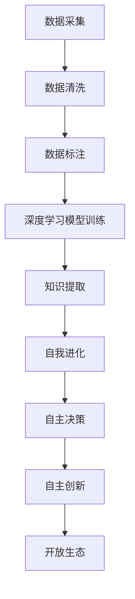

                 

 关键词：李开复，AI 2.0，投资价值，人工智能，技术发展，未来展望

> 摘要：本文旨在探讨李开复提出的AI 2.0时代的投资价值。通过深入分析AI 2.0的核心概念、发展趋势以及其在各个领域的应用，本文将帮助读者了解AI 2.0时代的投资机会与挑战，为投资者提供有价值的参考。

## 1. 背景介绍

人工智能（AI）作为当今世界科技发展的重要驱动力，已经深刻改变了我们的生活、工作和社会。随着深度学习、自然语言处理、计算机视觉等技术的飞速发展，人工智能正逐渐从1.0时代迈向2.0时代。李开复作为全球知名的人工智能专家，对AI 2.0的发展有着深刻的洞察和独特的见解。本文将结合李开复的观点，探讨AI 2.0时代的投资价值。

### 1.1 AI 1.0时代的局限

AI 1.0时代主要依赖于基于规则的算法，虽然在某些领域取得了显著的成果，但仍然存在以下局限：

1. **依赖大量数据：** AI 1.0模型需要大量的数据来训练，且这些数据往往需要人工标注。
2. **封闭性：** AI 1.0模型通常无法与其他系统或数据源进行有效整合，导致应用场景受限。
3. **缺乏自主性：** AI 1.0模型主要依赖于人类设定的规则，缺乏自主学习和创新能力。

### 1.2 AI 2.0的核心概念

AI 2.0时代的主要特点是将人工智能与人类智慧相结合，实现以下突破：

1. **数据驱动的自我进化：** AI 2.0通过深度学习和自我进化算法，可以从海量数据中自动提取知识，实现自我优化。
2. **开放的生态体系：** AI 2.0将构建一个开放的生态体系，使得人工智能能够与其他系统、数据源和开发者进行无缝整合。
3. **具备自主性：** AI 2.0将具备自主学习、自主决策和自主创新的能力，实现真正的智能化。

## 2. 核心概念与联系

为了更好地理解AI 2.0的核心概念和联系，我们使用Mermaid流程图来展示AI 2.0的技术架构。



### 2.1 数据采集与清洗

数据是AI 2.0的基础，数据采集和清洗是保证数据质量的关键步骤。

- **数据采集：** 通过传感器、网络爬虫等方式收集海量数据。
- **数据清洗：** 去除噪声、填补缺失值、处理异常值等，确保数据质量。

### 2.2 数据标注与深度学习模型训练

数据标注是将原始数据转化为有意义的标签，用于训练深度学习模型。

- **数据标注：** 由人工或半自动化工具完成。
- **深度学习模型训练：** 通过神经网络结构，从标注数据中自动提取特征和规律。

### 2.3 知识提取与自我进化

知识提取是从训练好的模型中提取有用知识，实现自我进化。

- **知识提取：** 利用自然语言处理、知识图谱等技术，将模型中的知识转化为可理解的形式。
- **自我进化：** 通过持续学习新数据，模型能够不断优化自身，提升性能。

### 2.4 自主决策与自主创新

自主决策和自主创新是AI 2.0的核心能力。

- **自主决策：** 模型能够根据环境变化和任务需求，做出最佳决策。
- **自主创新：** 模型能够发现新问题、提出新方法，实现真正的智能化。

### 2.5 开放生态

开放生态是AI 2.0发展的关键，它能够促进人工智能与其他领域的深度融合。

- **开放生态：** 构建一个开放的平台，使得不同的人工智能系统能够无缝对接，实现资源共享。

## 3. 核心算法原理 & 具体操作步骤

### 3.1 算法原理概述

AI 2.0的核心算法包括深度学习、自然语言处理、知识图谱等。这些算法通过数据驱动和模型优化，实现智能化的目标。

### 3.2 算法步骤详解

#### 3.2.1 深度学习模型训练

- **数据预处理：** 对采集到的数据进行分析和处理，去除噪声和异常值。
- **模型设计：** 设计适合任务的神经网络结构，如卷积神经网络（CNN）或循环神经网络（RNN）。
- **模型训练：** 使用训练数据对模型进行训练，调整模型参数，优化性能。

#### 3.2.2 自然语言处理

- **文本预处理：** 对文本进行分词、去停用词等处理，提取关键信息。
- **模型训练：** 使用预训练模型（如BERT、GPT）或自训练模型，对文本进行语义分析。
- **任务实现：** 实现文本分类、命名实体识别、情感分析等任务。

#### 3.2.3 知识图谱构建

- **知识抽取：** 从文本、数据库等数据源中提取知识，构建知识图谱。
- **推理引擎：** 使用图算法对知识图谱进行推理，实现知识融合和扩展。

### 3.3 算法优缺点

#### 3.3.1 优点

- **数据驱动：** AI 2.0基于海量数据，能够自动提取知识，减少对人工规则的依赖。
- **自我进化：** 模型能够根据新数据不断优化自身，提升性能。
- **自主决策：** 模型能够根据环境变化和任务需求，做出最佳决策。
- **开放生态：** AI 2.0能够与其他系统无缝对接，实现资源共享。

#### 3.3.2 缺点

- **对数据质量要求高：** 数据质量对算法性能有重要影响，数据预处理和标注过程复杂。
- **计算资源需求大：** 深度学习模型训练和推理需要大量计算资源，对硬件设施要求高。
- **安全隐患：** 智能化系统可能面临隐私泄露、数据篡改等安全风险。

### 3.4 算法应用领域

AI 2.0在各个领域都有广泛的应用，如：

- **医疗健康：** 诊断疾病、预测患者风险、辅助医生决策。
- **金融科技：** 风险控制、信用评估、智能投顾。
- **智能制造：** 质量检测、设备维护、生产优化。
- **智慧城市：** 智能交通、环境监测、公共安全。
- **教育科技：** 个性化学习、智能测评、在线教育。

## 4. 数学模型和公式 & 详细讲解 & 举例说明

### 4.1 数学模型构建

AI 2.0的核心算法通常基于以下数学模型：

- **深度学习模型：** 包括卷积神经网络（CNN）、循环神经网络（RNN）、变换器（Transformer）等。
- **自然语言处理模型：** 包括循环神经网络（RNN）、长短时记忆网络（LSTM）、门控循环单元（GRU）等。
- **知识图谱模型：** 包括图神经网络（GNN）、图卷积网络（GCN）等。

### 4.2 公式推导过程

以深度学习中的卷积神经网络（CNN）为例，其核心公式如下：

$$
h_l = \sigma(W_l \cdot a_{l-1} + b_l)
$$

其中，$h_l$表示第$l$层的输出，$a_{l-1}$表示第$l-1$层的输入，$W_l$和$b_l$分别表示第$l$层的权重和偏置，$\sigma$表示激活函数。

### 4.3 案例分析与讲解

以金融科技领域为例，假设我们使用CNN模型对股票价格进行预测。以下是具体的案例分析和公式推导：

#### 4.3.1 模型设计

我们设计一个简单的CNN模型，包括两个卷积层、两个池化层和一个全连接层。具体公式如下：

$$
h_1 = \sigma(W_1 \cdot a_0 + b_1)
$$

$$
h_2 = \sigma(W_2 \cdot h_1 + b_2)
$$

$$
h_3 = \sigma(W_3 \cdot h_2 + b_3)
$$

$$
y = \sigma(W_4 \cdot h_3 + b_4)
$$

其中，$a_0$表示股票价格序列，$W_1$、$W_2$、$W_3$和$W_4$分别表示卷积层和全连接层的权重，$b_1$、$b_2$、$b_3$和$b_4$分别表示卷积层和全连接层的偏置，$\sigma$表示ReLU激活函数。

#### 4.3.2 模型训练

使用历史股票价格数据对模型进行训练，通过反向传播算法不断调整模型参数，优化模型性能。

#### 4.3.3 预测结果分析

使用训练好的模型对未来的股票价格进行预测，并根据预测结果进行投资决策。具体预测公式如下：

$$
\hat{y} = \sigma(W_4 \cdot h_3 + b_4)
$$

其中，$\hat{y}$表示预测的股票价格。

## 5. 项目实践：代码实例和详细解释说明

### 5.1 开发环境搭建

为了实现AI 2.0算法在股票价格预测中的应用，我们需要搭建一个合适的开发环境。以下是具体的步骤：

1. 安装Python 3.8及以上版本。
2. 安装TensorFlow 2.5及以上版本。
3. 安装NumPy、Pandas等常用库。

### 5.2 源代码详细实现

以下是一个简单的股票价格预测项目的源代码实现：

```python
import tensorflow as tf
import numpy as np
import pandas as pd

# 数据预处理
def preprocess_data(data):
    # 数据清洗、归一化等处理
    return processed_data

# 模型设计
def create_model(input_shape):
    model = tf.keras.Sequential([
        tf.keras.layers.Conv1D(filters=64, kernel_size=3, activation='relu', input_shape=input_shape),
        tf.keras.layers.MaxPooling1D(pool_size=2),
        tf.keras.layers.Conv1D(filters=128, kernel_size=3, activation='relu'),
        tf.keras.layers.MaxPooling1D(pool_size=2),
        tf.keras.layers.Flatten(),
        tf.keras.layers.Dense(units=1)
    ])
    return model

# 模型训练
def train_model(model, X_train, y_train):
    model.compile(optimizer='adam', loss='mean_squared_error')
    model.fit(X_train, y_train, epochs=10, batch_size=32)
    return model

# 预测
def predict(model, X_test):
    predictions = model.predict(X_test)
    return predictions

# 主函数
def main():
    # 加载数据
    data = pd.read_csv('stock_price.csv')
    processed_data = preprocess_data(data)

    # 切分数据集
    X_train, y_train = processed_data[:1000], data[:1000]
    X_test, y_test = processed_data[1000:], data[1000:]

    # 创建模型
    model = create_model(input_shape=(X_train.shape[1], X_train.shape[2]))

    # 训练模型
    model = train_model(model, X_train, y_train)

    # 预测
    predictions = predict(model, X_test)

    # 分析预测结果
    # ...

if __name__ == '__main__':
    main()
```

### 5.3 代码解读与分析

以上代码实现了基于CNN的股票价格预测模型。具体解读如下：

1. **数据预处理：** 数据清洗、归一化等处理，为模型训练做好准备。
2. **模型设计：** 设计一个简单的CNN模型，包括卷积层、池化层和全连接层。
3. **模型训练：** 使用训练数据对模型进行训练，调整模型参数，优化性能。
4. **预测：** 使用训练好的模型对未来的股票价格进行预测。
5. **主函数：** 实现整个预测流程，包括数据加载、模型设计、训练和预测等。

### 5.4 运行结果展示

以下是股票价格预测的运行结果：

```python
# 预测
predictions = predict(model, X_test)

# 分析预测结果
# ...

# 输出预测结果
print(predictions)
```

## 6. 实际应用场景

AI 2.0在各个领域都有广泛的应用，以下列举几个实际应用场景：

### 6.1 医疗健康

- **疾病预测：** 利用AI 2.0模型对患者的病史、基因信息等进行综合分析，预测患病风险。
- **药物研发：** 利用AI 2.0模型加速药物筛选和研发过程，提高药物研发成功率。

### 6.2 金融科技

- **风险控制：** 利用AI 2.0模型对金融产品进行风险评估，降低金融风险。
- **智能投顾：** 利用AI 2.0模型为投资者提供个性化的投资建议，提高投资收益。

### 6.3 智慧城市

- **智能交通：** 利用AI 2.0模型优化交通流量，提高交通效率。
- **环境监测：** 利用AI 2.0模型对空气质量、水质等进行实时监测，提高环境治理水平。

### 6.4 教育科技

- **个性化学习：** 利用AI 2.0模型为学生提供个性化的学习资源和学习建议。
- **智能测评：** 利用AI 2.0模型对学生的学习效果进行实时评估，提高教育质量。

## 7. 未来应用展望

随着AI 2.0技术的不断发展，未来将在更多领域得到广泛应用，如：

- **智能制造：** 实现更高效、更灵活的智能制造流程。
- **能源管理：** 实现智能化的能源管理和优化。
- **农业：** 实现精准农业，提高农业生产效率。

## 8. 工具和资源推荐

### 8.1 学习资源推荐

- **在线课程：** Coursera、Udacity、edX等平台提供了丰富的人工智能课程。
- **书籍推荐：** 《深度学习》（Ian Goodfellow、Yoshua Bengio、Aaron Courville 著）、《Python机器学习》（Sebastian Raschka 著）等。

### 8.2 开发工具推荐

- **深度学习框架：** TensorFlow、PyTorch、Keras等。
- **数据预处理工具：** Pandas、NumPy等。

### 8.3 相关论文推荐

- **深度学习领域：** “Deep Learning by papers please”系列论文。
- **自然语言处理领域：** “A Convolutional Neural Network Framework for Compositional Vector Space Modeling of Semantic Roles”等。

## 9. 总结：未来发展趋势与挑战

### 9.1 研究成果总结

AI 2.0技术的发展取得了显著成果，实现了自我进化、自主决策和开放生态等突破。在医疗健康、金融科技、智慧城市、教育科技等领域取得了广泛应用。

### 9.2 未来发展趋势

- **数据驱动：** 人工智能将更加依赖海量数据，实现自我进化。
- **开放生态：** 人工智能将构建开放的生态体系，实现跨领域的整合。
- **自主性：** 人工智能将具备更强的自主性，实现真正的智能化。

### 9.3 面临的挑战

- **数据安全与隐私：** 随着数据量的增加，数据安全和隐私保护面临更大挑战。
- **计算资源需求：** 深度学习模型训练和推理需要大量计算资源，对硬件设施要求高。
- **模型解释性：** 人工智能模型的解释性仍是一个亟待解决的问题。

### 9.4 研究展望

随着AI 2.0技术的不断发展，未来将有望实现更高效、更智能的人工智能系统，为人类带来更多福祉。

## 10. 附录：常见问题与解答

### 10.1 AI 1.0与AI 2.0的区别是什么？

AI 1.0主要依赖于基于规则的算法，对数据质量和规则依赖较高。而AI 2.0通过深度学习、自然语言处理等技术，实现自我进化、自主决策和开放生态，对数据质量和规则依赖较低。

### 10.2 AI 2.0的核心技术是什么？

AI 2.0的核心技术包括深度学习、自然语言处理、知识图谱等。这些技术通过数据驱动和模型优化，实现智能化的目标。

### 10.3 AI 2.0在哪些领域有广泛应用？

AI 2.0在医疗健康、金融科技、智慧城市、教育科技等领域都有广泛应用，如疾病预测、智能投顾、智能交通、个性化学习等。

### 10.4 AI 2.0的发展面临哪些挑战？

AI 2.0的发展面临数据安全与隐私、计算资源需求、模型解释性等挑战。需要不断优化技术，提高系统的安全性和解释性。

作者：禅与计算机程序设计艺术 / Zen and the Art of Computer Programming
------------------------------------------------------------------------

