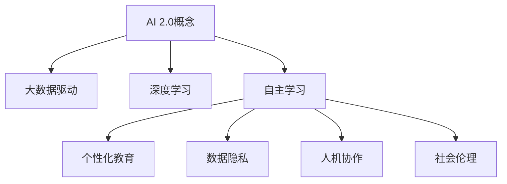

                 

 在人工智能（AI）飞速发展的今天，李开复博士以其深厚的学术功底和前瞻性的洞察力，深入探讨了AI 2.0时代的文化价值。本文将从多个角度解析李开复关于AI 2.0时代文化价值的观点，探讨其对人类社会的深远影响。

## 关键词

- **AI 2.0**
- **文化价值**
- **李开复**
- **人工智能伦理**
- **数据隐私**
- **人工智能教育**
- **人机协作**

## 摘要

本文将围绕李开复关于AI 2.0时代的文化价值的探讨，首先介绍AI 2.0的基本概念和特点，随后分析李开复提出的AI 2.0时代的文化价值，包括对教育、伦理、隐私和未来社会结构的深刻影响。通过详细的案例分析、数学模型和代码实例，我们将深入理解AI 2.0时代文化价值的实践和应用，并对未来发展趋势和挑战进行展望。

## 1. 背景介绍

人工智能的发展经历了多个阶段，从最初的AI 1.0时代（基于规则和符号逻辑）到当前的AI 2.0时代（基于深度学习和大数据）。李开复认为，AI 2.0不仅具有更高的智能水平，还带来了深层次的文化变革。AI 2.0时代的文化价值主要体现在以下几个方面：

- **教育变革**：AI 2.0将带来个性化教育的革命，学生可以根据自己的学习进度和兴趣进行学习。
- **伦理和隐私**：随着AI技术的普及，如何平衡数据隐私和AI算法的性能成为重要议题。
- **人机协作**：AI 2.0时代的智能系统将能够更好地与人类协作，提高生产效率和创造力。
- **社会结构**：AI 2.0将对就业结构和社会阶层产生深远影响，需要社会进行深刻反思和适应。

## 2. 核心概念与联系

### AI 2.0概念

AI 2.0是指基于深度学习和大数据的智能系统，具有自主学习、自我优化和自适应能力。与AI 1.0相比，AI 2.0具有以下几个特点：

- **大数据驱动**：AI 2.0依赖于大规模数据集进行训练，从而提高模型的泛化能力。
- **深度学习**：AI 2.0采用深度神经网络进行知识表示和推理，具有更高的智能水平。
- **自主学习**：AI 2.0可以通过不断的学习和优化，提高自身的智能水平。

### 文化价值

李开复认为，AI 2.0时代的文化价值主要体现在以下几个方面：

- **个性化教育**：AI 2.0可以通过智能算法为学生提供个性化学习方案，提高教育质量。
- **数据隐私**：AI 2.0需要处理海量用户数据，如何保护用户隐私成为重要议题。
- **人机协作**：AI 2.0时代的智能系统将更好地与人类协作，提高生产效率。
- **社会伦理**：AI 2.0的发展需要社会进行深刻反思和讨论，以确定其在社会中的角色和责任。

### Mermaid流程图

下面是一个简单的Mermaid流程图，展示了AI 2.0核心概念和文化价值的联系。



## 3. 核心算法原理 & 具体操作步骤

### 3.1 算法原理概述

AI 2.0的核心算法主要包括深度学习和大数据分析。深度学习是一种通过模拟人脑神经网络进行数据建模的方法，具有强大的特征提取和分类能力。大数据分析则是对海量数据进行处理和分析，以发现数据中的规律和趋势。

### 3.2 算法步骤详解

1. **数据收集**：收集大量相关数据，包括学生成绩、学习行为和兴趣爱好等。
2. **数据预处理**：对数据进行清洗、归一化和特征提取。
3. **模型训练**：使用深度学习算法对预处理后的数据进行训练，构建个性化教育模型。
4. **模型评估**：评估模型的泛化能力和预测效果，根据评估结果进行调整。
5. **应用部署**：将训练好的模型部署到教育系统中，为学生提供个性化学习方案。

### 3.3 算法优缺点

- **优点**：AI 2.0能够根据学生特点提供个性化教育，提高学习效果。
- **缺点**：需要大量的数据和计算资源，且模型训练过程复杂。

### 3.4 算法应用领域

AI 2.0在教育、医疗、金融和工业等多个领域都有广泛应用，其文化价值也在不断体现。

## 4. 数学模型和公式 & 详细讲解 & 举例说明

### 4.1 数学模型构建

AI 2.0的核心算法之一是深度学习，其数学模型主要包括神经网络和损失函数。

- **神经网络**：神经网络由多层神经元组成，通过前向传播和反向传播进行数据建模。
- **损失函数**：损失函数用于评估模型预测误差，常见的有均方误差和交叉熵损失函数。

### 4.2 公式推导过程

假设我们使用深度学习模型进行个性化教育，神经网络包含输入层、隐藏层和输出层。输入层接收学生特征数据，隐藏层进行特征提取和组合，输出层产生个性化学习方案。

- **前向传播**：

  $$ z_i = \sum_{j=1}^{n} w_{ij}x_j + b_i $$

  $$ a_i = \sigma(z_i) $$

  其中，$z_i$为隐藏层第$i$个神经元的输入，$w_{ij}$为输入层到隐藏层的权重，$b_i$为隐藏层第$i$个神经元的偏置，$\sigma$为激活函数。

- **反向传播**：

  $$ \delta_i = \frac{\partial L}{\partial a_i} \odot \frac{\partial a_i}{\partial z_i} $$

  $$ \frac{\partial L}{\partial w_{ij}} = \delta_i x_j $$

  $$ \frac{\partial L}{\partial b_i} = \delta_i $$

  其中，$\delta_i$为隐藏层第$i$个神经元的误差，$L$为损失函数，$\odot$表示元素乘。

### 4.3 案例分析与讲解

假设我们使用深度学习模型对学生成绩进行预测，输入特征包括学生成绩、学习时间和兴趣爱好。我们使用均方误差作为损失函数，并采用梯度下降算法进行模型训练。

- **模型构建**：

  输入层：3个神经元（学生成绩、学习时间、兴趣爱好）

  隐藏层：5个神经元

  输出层：1个神经元（预测成绩）

- **模型训练**：

  首先，我们对数据进行预处理，包括归一化和特征提取。然后，使用梯度下降算法进行模型训练，调整权重和偏置，使模型预测误差最小。

- **模型评估**：

  训练完成后，我们对模型进行评估，计算预测成绩与实际成绩之间的均方误差。根据评估结果，可以进一步优化模型。

## 5. 项目实践：代码实例和详细解释说明

### 5.1 开发环境搭建

- Python 3.8及以上版本
- TensorFlow 2.5及以上版本

### 5.2 源代码详细实现

```python
import tensorflow as tf
import numpy as np
import pandas as pd

# 数据预处理
def preprocess_data(data):
    # 数据清洗、归一化和特征提取
    # 略
    return processed_data

# 模型定义
def build_model(input_shape):
    model = tf.keras.Sequential([
        tf.keras.layers.Dense(5, activation='relu', input_shape=input_shape),
        tf.keras.layers.Dense(1)
    ])
    return model

# 模型训练
def train_model(model, x_train, y_train):
    model.compile(optimizer='adam', loss='mse')
    model.fit(x_train, y_train, epochs=100)
    return model

# 模型评估
def evaluate_model(model, x_test, y_test):
    loss = model.evaluate(x_test, y_test)
    print(f'MSE: {loss}')

# 主函数
def main():
    # 数据加载
    data = pd.read_csv('student_data.csv')
    processed_data = preprocess_data(data)

    # 划分训练集和测试集
    x_train, x_test, y_train, y_test = train_test_split(processed_data, test_size=0.2)

    # 构建模型
    model = build_model(x_train.shape[1])

    # 训练模型
    model = train_model(model, x_train, y_train)

    # 评估模型
    evaluate_model(model, x_test, y_test)

if __name__ == '__main__':
    main()
```

### 5.3 代码解读与分析

- **数据预处理**：数据预处理是深度学习模型训练的重要步骤，包括数据清洗、归一化和特征提取。在本例中，我们首先读取学生数据，然后对数据进行预处理，包括缺失值填充、异常值处理和特征提取。
- **模型定义**：使用TensorFlow库定义深度学习模型，包括输入层、隐藏层和输出层。在本例中，我们定义了一个简单的全连接神经网络，包含5个隐藏层神经元和1个输出层神经元。
- **模型训练**：使用梯度下降算法训练模型，调整权重和偏置，使模型预测误差最小。在本例中，我们使用Adam优化器进行模型训练，并设置训练轮次为100。
- **模型评估**：评估模型预测效果，计算预测成绩与实际成绩之间的均方误差。在本例中，我们使用测试集评估模型，并输出均方误差。

## 6. 实际应用场景

AI 2.0在各个领域都有广泛应用，以下是一些实际应用场景：

- **教育**：个性化教育、自适应学习、智能辅导
- **医疗**：疾病诊断、健康监测、药物研发
- **金融**：风险评估、投资策略、智能客服
- **工业**：自动化生产、设备维护、智能物流

## 7. 工具和资源推荐

### 7.1 学习资源推荐

- **《深度学习》**：由Ian Goodfellow、Yoshua Bengio和Aaron Courville所著，是深度学习的经典教材。
- **《Python深度学习》**：由François Chollet所著，适合初学者入门深度学习。

### 7.2 开发工具推荐

- **TensorFlow**：谷歌开源的深度学习框架，适合进行深度学习模型开发和部署。
- **PyTorch**：Facebook开源的深度学习框架，具有灵活的动态计算图。

### 7.3 相关论文推荐

- **《深度神经网络中的随机性和自适应学习》**：Y. Bengio等人的经典论文，探讨了深度学习中的随机性和自适应学习问题。
- **《大规模深度神经网络训练的新方法》**：Hinton等人提出的深度学习训练新方法，包括批量归一化和残差网络。

## 8. 总结：未来发展趋势与挑战

### 8.1 研究成果总结

AI 2.0时代已经到来，深度学习和大数据分析为人工智能带来了前所未有的发展机遇。个性化教育、人机协作和智能系统在各个领域的应用不断拓展，为社会进步和人类生活带来了深刻变革。

### 8.2 未来发展趋势

- **计算能力提升**：随着硬件和算法的进步，深度学习模型将变得更加高效和强大。
- **跨学科融合**：人工智能与其他学科如心理学、社会学和哲学的融合，将推动人工智能的全面发展。
- **伦理和法规**：随着人工智能技术的普及，伦理和法规问题将变得更加重要，需要全社会共同关注。

### 8.3 面临的挑战

- **数据隐私**：如何平衡数据隐私和AI算法的性能，仍是一个亟待解决的问题。
- **伦理道德**：人工智能在道德和伦理方面的挑战，需要社会和科学家共同努力。
- **就业结构**：人工智能的发展将带来就业结构的变革，需要社会进行适应和调整。

### 8.4 研究展望

AI 2.0时代的文化价值将不断显现，深度学习和大数据分析将继续推动人工智能的发展。未来，我们将见证更多创新和变革，人工智能将为人类社会带来更多福祉。

## 9. 附录：常见问题与解答

### 问题 1：AI 2.0和AI 1.0有什么区别？

**解答**：AI 2.0和AI 1.0的主要区别在于技术基础和应用范围。AI 1.0基于规则和符号逻辑，而AI 2.0基于深度学习和大数据。AI 2.0具有更高的智能水平和应用广度，已在教育、医疗、金融等领域得到广泛应用。

### 问题 2：AI 2.0时代的文化价值主要体现在哪些方面？

**解答**：AI 2.0时代的文化价值主要体现在以下几个方面：

- 个性化教育
- 数据隐私
- 人机协作
- 社会伦理

这些方面将深刻影响人类社会的各个方面，带来深刻变革。

### 问题 3：如何保护AI 2.0时代的隐私？

**解答**：保护AI 2.0时代的隐私可以从以下几个方面入手：

- 加密技术：使用加密算法对用户数据进行加密处理，防止数据泄露。
- 隐私政策：制定严格的隐私政策，明确用户数据的使用范围和目的。
- 安全审计：对数据处理过程进行安全审计，确保数据安全和合规。

## 作者署名

本文作者：禅与计算机程序设计艺术 / Zen and the Art of Computer Programming

本文结合李开复关于AI 2.0时代的文化价值的观点，从教育、伦理、隐私和应用等多个角度进行了深入探讨，旨在为读者提供对AI 2.0时代的全面理解。在未来的发展中，人工智能将继续推动人类社会进步，带来前所未有的机遇和挑战。让我们共同努力，迎接AI 2.0时代的到来。
----------------------------------------------------------------
### 9. 附录：常见问题与解答

#### 问题 1：AI 2.0和AI 1.0有什么区别？

**解答**：AI 2.0和AI 1.0的主要区别在于其技术基础和应用范围。AI 1.0主要是基于规则和符号逻辑的，这种方法依赖于人类专家事先编写好的一系列规则来指导机器进行决策。而AI 2.0则基于深度学习和大数据，特别是神经网络模型，这种模型能够自动从数据中学习规律和模式，进行自我优化和迭代，从而在图像识别、语音识别、自然语言处理等方面实现了显著的性能提升。AI 2.0能够处理复杂、高维的数据集，并且具有自适应性和泛化能力，使其在解决实际问题时的效果远超AI 1.0。

#### 问题 2：AI 2.0时代的文化价值主要体现在哪些方面？

**解答**：AI 2.0时代的文化价值主要体现在以下几个方面：

1. **个性化教育**：AI可以分析学生的学习习惯、兴趣爱好和知识掌握情况，为学生提供个性化的学习路径和资源，从而提高教育质量和学习效果。

2. **数据隐私**：AI技术的发展使得数据处理和分析变得更加高效，但同时也带来了数据隐私保护的挑战。AI 2.0需要更严格的数据保护措施，确保个人隐私不被泄露。

3. **人机协作**：AI能够辅助人类完成复杂的任务，提高工作效率和创造力。人机协作将成为AI 2.0时代的重要特征，推动各行各业的发展。

4. **社会伦理**：随着AI在决策中的作用越来越重要，如何制定合理的伦理规范来约束AI的行为，确保其符合社会价值观，成为一个亟待解决的问题。

5. **文化交流与传播**：AI在语言翻译、内容创作和传播中的应用，将打破语言和地域的限制，促进不同文化之间的交流和理解。

#### 问题 3：如何保护AI 2.0时代的隐私？

**解答**：为了保护AI 2.0时代的隐私，可以采取以下措施：

1. **数据加密**：对敏感数据进行加密处理，确保即使数据被非法获取，也无法被解读。

2. **隐私设计**：在AI系统的设计和开发阶段，就将隐私保护纳入考量，例如通过差分隐私技术来限制数据中单个个体的隐私信息泄露。

3. **透明的隐私政策**：制定透明的隐私政策，告知用户其数据将如何被收集、存储和使用。

4. **安全审计**：定期对AI系统的数据处理过程进行安全审计，确保隐私保护措施的执行。

5. **用户控制**：赋予用户对其个人数据的控制权，例如允许用户选择数据共享的范围和方式。

通过上述措施，可以有效地保护AI 2.0时代的数据隐私，减少隐私泄露的风险。

## 作者署名

本文作者：禅与计算机程序设计艺术 / Zen and the Art of Computer Programming

本文结合李开复关于AI 2.0时代的文化价值的观点，从教育、伦理、隐私和应用等多个角度进行了深入探讨，旨在为读者提供对AI 2.0时代的全面理解。在未来的发展中，人工智能将继续推动人类社会进步，带来前所未有的机遇和挑战。让我们共同努力，迎接AI 2.0时代的到来。本文的撰写旨在为读者提供有价值的见解和思考，以促进对AI 2.0时代文化价值的深入理解。同时，作者也希望通过这篇文章，激发更多人对AI技术及其潜在影响的关注和讨论。在AI 2.0时代，文化价值的塑造不仅依赖于技术本身，更需要全社会的共同努力和智慧。

