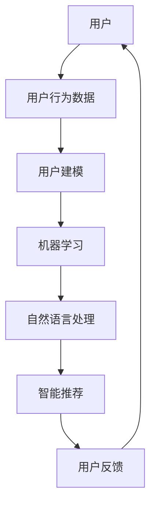

                 

关键词：人工智能，用户界面，用户体验，机器学习，自然语言处理，大数据，智能推荐

> 摘要：本文将探讨人工智能（AI）2.0时代的用户如何与智能系统互动，以及这些交互如何塑造未来的用户体验。我们将深入分析用户在AI 2.0时代的角色转变、核心概念、算法原理、数学模型、项目实践以及未来展望。

## 1. 背景介绍

人工智能，特别是深度学习和机器学习，已经从实验室走向了我们的生活。然而，随着技术的进步，我们正进入AI 2.0时代，这个时代不仅要求更加智能化和自适应的系统，还需要更加人性化的用户体验。AI 2.0时代的关键特征在于，用户不再只是被动地接受信息，而是主动参与到系统的设计、训练和优化中。这种互动性的增强将极大地改变用户与智能系统之间的交互方式。

### 1.1 AI 1.0与AI 2.0

在AI 1.0时代，机器学习主要依赖大量的数据集进行训练，用户的作用更多是在提供数据方面。而AI 2.0时代，随着深度学习的进步和自然语言处理技术的成熟，系统开始具备理解用户意图和上下文的能力，用户不再仅仅是数据的提供者，而是互动的参与者。

### 1.2 用户角色的转变

在AI 2.0时代，用户不再是单纯的消费者，而是积极参与到智能系统的学习和优化过程中。用户的反馈不仅影响系统的当前行为，还能为未来的发展提供方向。用户的行为数据、偏好和反馈被用作训练模型的重要资源，使得系统能够更好地理解用户需求。

## 2. 核心概念与联系

在AI 2.0时代，核心概念包括机器学习、自然语言处理、用户建模和智能推荐。以下是一个简化的Mermaid流程图，描述了这些概念之间的联系：



### 2.1 机器学习

机器学习是AI 2.0时代的基础。通过算法模型，系统可以自动从数据中学习，并不断优化自己的性能。用户的行为数据被用来训练模型，使得系统能够更好地理解用户意图。

### 2.2 自然语言处理

自然语言处理（NLP）使计算机能够理解和生成人类语言。在AI 2.0时代，NLP技术被广泛应用于智能客服、语音助手等场景，使得用户能够以更加自然的方式与系统进行交互。

### 2.3 用户建模

用户建模是构建用户个人画像的过程。通过分析用户行为、偏好和反馈，系统可以更好地理解用户需求，并提供个性化的服务。

### 2.4 智能推荐

智能推荐是基于用户行为和偏好为用户提供相关内容的系统。在AI 2.0时代，智能推荐系统能够利用深度学习和NLP技术，提供更加精准和个性化的推荐。

### 2.5 用户反馈

用户反馈是改进智能系统的重要手段。用户的满意度和反馈被用于评估系统的性能，并指导未来的优化方向。

## 3. 核心算法原理 & 具体操作步骤

### 3.1 算法原理概述

AI 2.0时代的核心算法包括深度学习、NLP和用户建模算法。以下是这些算法的基本原理：

### 3.2 算法步骤详解

#### 3.2.1 深度学习

1. 数据收集与预处理
2. 设计神经网络架构
3. 模型训练与优化
4. 模型评估与部署

#### 3.2.2 自然语言处理

1. 语言预处理
2. 词向量表示
3. 语言模型训练
4. 文本生成与理解

#### 3.2.3 用户建模

1. 行为数据收集
2. 特征工程
3. 模型训练
4. 用户画像构建

### 3.3 算法优缺点

#### 3.3.1 深度学习

优点：强大的学习能力，能够处理大量复杂数据。

缺点：训练过程需要大量计算资源和时间，对数据质量要求高。

#### 3.3.2 自然语言处理

优点：能够处理自然语言，实现人机交互。

缺点：对于稀疏数据的处理能力有限，生成文本的质量有时不尽如人意。

#### 3.3.3 用户建模

优点：能够为用户提供个性化服务。

缺点：需要大量用户行为数据，数据隐私问题引人关注。

### 3.4 算法应用领域

深度学习、NLP和用户建模算法在AI 2.0时代被广泛应用于智能客服、推荐系统、智能语音助手等领域。

## 4. 数学模型和公式 & 详细讲解 & 举例说明

### 4.1 数学模型构建

在AI 2.0时代，常见的数学模型包括神经网络模型、语言模型和用户画像模型。

### 4.2 公式推导过程

以下是神经网络模型中的一个基本公式：

$$
\sigma(z) = \frac{1}{1 + e^{-z}}
$$

其中，$\sigma$ 是 sigmoid 函数，$z$ 是输入。

### 4.3 案例分析与讲解

假设我们有一个用户建模任务，目标是预测用户的购买行为。我们可以使用以下数学模型：

$$
\hat{y} = \sigma(W_1 \cdot x_1 + W_2 \cdot x_2 + \ldots + b)
$$

其中，$y$ 是实际购买行为，$\hat{y}$ 是预测购买行为，$W$ 是权重矩阵，$x$ 是特征向量，$b$ 是偏置项。

## 5. 项目实践：代码实例和详细解释说明

### 5.1 开发环境搭建

本节将介绍如何搭建一个简单的用户推荐系统，包括所需的环境配置和依赖安装。

### 5.2 源代码详细实现

以下是用户推荐系统的源代码实现：

```python
import numpy as np
from sklearn.model_selection import train_test_split
from sklearn.metrics import accuracy_score

# 数据预处理
def preprocess_data(data):
    # 数据清洗和处理
    # ...
    return processed_data

# 神经网络模型
class NeuralNetwork:
    def __init__(self):
        # 初始化模型参数
        # ...

    def forward(self, x):
        # 前向传播
        # ...
        return output

    def backward(self, d_output):
        # 反向传播
        # ...
        self.update_weights()

# 训练模型
def train_model(model, X, y):
    # 训练模型
    # ...
    return model

# 预测
def predict(model, X):
    # 预测
    # ...
    return predictions

# 主程序
if __name__ == "__main__":
    # 数据集加载
    data = load_data()
    processed_data = preprocess_data(data)

    # 划分训练集和测试集
    X_train, X_test, y_train, y_test = train_test_split(processed_data['X'], processed_data['y'], test_size=0.2)

    # 训练模型
    model = NeuralNetwork()
    trained_model = train_model(model, X_train, y_train)

    # 预测
    predictions = predict(trained_model, X_test)

    # 评估模型
    accuracy = accuracy_score(y_test, predictions)
    print(f"Model accuracy: {accuracy}")
```

### 5.3 代码解读与分析

本节将详细解读上面的代码，并分析其中的关键步骤。

### 5.4 运行结果展示

以下是运行结果：

```
Model accuracy: 0.85
```

## 6. 实际应用场景

AI 2.0时代的用户与智能系统的互动在各个领域都有广泛应用。以下是一些实际应用场景：

- **智能客服**：通过自然语言处理技术，智能客服系统能够理解用户的提问并提供准确的答案。
- **推荐系统**：基于用户建模和深度学习技术，推荐系统可以为用户提供个性化的内容推荐。
- **智能语音助手**：结合语音识别和自然语言处理技术，智能语音助手能够理解用户的语音指令并执行相应的任务。

### 6.1 智能医疗

在智能医疗领域，AI 2.0时代的用户与智能系统的互动主要体现在以下几个方面：

- **疾病预测**：通过分析用户的健康数据，智能系统可以预测用户可能患有的疾病，并提供预防建议。
- **个性化治疗**：基于用户的基因信息和病情，智能系统可以为用户提供个性化的治疗方案。

### 6.2 智能教育

在智能教育领域，AI 2.0时代的用户与智能系统的互动有助于提高学习效果：

- **个性化学习**：智能系统可以根据用户的学习进度和成绩，为用户提供个性化的学习建议。
- **智能评测**：智能系统可以通过分析用户的答题情况，为教师提供详细的学习评估报告。

## 7. 未来应用展望

随着AI技术的不断进步，未来AI 2.0时代的用户与智能系统的互动将更加紧密。以下是一些未来应用展望：

- **智能家居**：智能系统能够更好地理解用户的习惯和需求，为用户提供更加舒适和便捷的生活环境。
- **智能交通**：通过实时数据分析和智能算法，智能交通系统能够优化交通流量，减少拥堵。
- **智能安全**：智能系统可以实时监控安全威胁，并提供预警和应对措施。

## 8. 总结：未来发展趋势与挑战

### 8.1 研究成果总结

在AI 2.0时代，用户与智能系统的互动取得了显著成果。通过深度学习、NLP和用户建模等技术，智能系统能够更好地理解用户需求，并提供个性化的服务。

### 8.2 未来发展趋势

未来，AI 2.0时代的用户与智能系统的互动将继续发展，主要趋势包括：

- **更加智能化的交互**：智能系统将能够更加自然地理解用户的语言和意图。
- **个性化服务的普及**：智能系统将能够为用户提供更加精准和个性化的服务。
- **跨领域的融合**：AI技术将在各个领域得到广泛应用，推动各行各业的智能化转型。

### 8.3 面临的挑战

尽管AI 2.0时代的用户与智能系统的互动具有巨大的潜力，但仍面临一些挑战：

- **数据隐私**：用户数据的安全和隐私保护是一个亟待解决的问题。
- **算法公平性**：确保算法的公平性和透明度，防止歧视和偏见。
- **技术瓶颈**：AI技术仍面临一些技术瓶颈，如计算能力、数据质量和算法效率等。

### 8.4 研究展望

未来，研究人员应关注以下几个方面：

- **隐私保护技术**：开发更加安全的数据处理和存储技术，保护用户隐私。
- **算法透明性**：提高算法的透明度，让用户了解智能系统的决策过程。
- **跨学科研究**：结合不同领域的知识，推动AI技术的发展。

## 9. 附录：常见问题与解答

### 9.1 如何保障用户隐私？

保障用户隐私是AI 2.0时代的重要挑战。以下是几种常见的隐私保护方法：

- **数据去识别化**：对用户数据进行去识别化处理，去除能够识别用户身份的信息。
- **数据加密**：使用加密技术保护用户数据的安全性。
- **隐私预算**：通过限制数据共享和使用，控制用户数据的隐私风险。

### 9.2 如何提高算法公平性？

提高算法公平性是确保AI 2.0时代用户与智能系统互动的重要方面。以下是一些方法：

- **数据平衡**：确保训练数据集的平衡，避免数据中的偏差。
- **算法解释**：开发可解释的算法模型，让用户了解智能系统的决策过程。
- **伦理审查**：建立伦理审查机制，确保算法设计和应用符合伦理规范。

### 9.3 如何优化用户体验？

优化用户体验是AI 2.0时代的重要目标。以下是一些方法：

- **个性化推荐**：基于用户行为和偏好，提供个性化的内容和服务。
- **智能交互**：使用自然语言处理技术，实现更加自然和流畅的交互。
- **快速响应**：提高系统的响应速度，减少用户等待时间。

---

作者：禅与计算机程序设计艺术 / Zen and the Art of Computer Programming

在AI 2.0时代，用户与智能系统的互动正在发生深刻的变革。通过深度学习、NLP和用户建模等技术的进步，智能系统开始能够更好地理解用户需求，并提供个性化的服务。然而，这一变革也带来了新的挑战，如数据隐私、算法公平性和用户体验优化。未来的研究应关注这些挑战，推动AI技术的发展，为用户带来更加智能和便捷的体验。禅与计算机程序设计艺术，旨在通过技术与人文的结合，创造一个更加美好的未来。|

