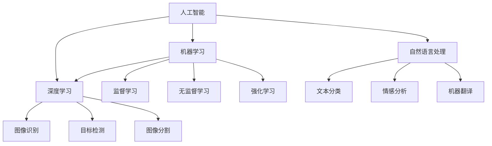

                 

关键词：苹果，AI应用，产业影响，技术趋势，未来发展

摘要：本文将探讨苹果公司在其最新产品和服务中推出的AI应用，以及这些应用对整个产业的影响。通过分析苹果在AI领域的战略布局，本文旨在为读者提供一个全面且深入的视角，了解AI技术如何改变我们的生活和工作方式。

## 1. 背景介绍

近年来，人工智能（AI）技术取得了显著的进步，已经成为科技产业的核心驱动力。苹果公司，作为全球领先的科技企业，也一直致力于在AI领域进行创新和突破。从早期的Siri语音助手到最新的面部识别技术，苹果在AI领域的研发和应用不断取得新的成就。

苹果发布AI应用的背后，是其对技术趋势的深刻洞察和长期的战略规划。通过在硬件、软件和服务的深度融合，苹果正在打造一个以AI为核心的未来生态系统。本文将探讨苹果在最新产品和服务中发布的AI应用，分析这些应用对产业的影响，并展望未来的发展趋势。

## 2. 核心概念与联系

在深入探讨苹果的AI应用之前，我们首先需要了解一些核心概念和它们之间的联系。

### 2.1. 人工智能的定义

人工智能（Artificial Intelligence，AI）是一种模拟人类智能的技术。它通过机器学习、自然语言处理、计算机视觉等技术，使计算机具备理解、学习和推理的能力。

### 2.2. 机器学习

机器学习是人工智能的一个分支，它使计算机通过数据学习来改进性能。机器学习算法包括监督学习、无监督学习和强化学习等。

### 2.3. 自然语言处理

自然语言处理（Natural Language Processing，NLP）是人工智能的一个领域，旨在使计算机理解和生成人类语言。NLP技术包括文本分类、情感分析、机器翻译等。

### 2.4. 计算机视觉

计算机视觉是人工智能的另一个重要领域，它使计算机能够理解和解释视觉信息。计算机视觉技术包括图像识别、目标检测、图像分割等。

### 2.5. 深度学习

深度学习是机器学习的一个分支，它通过多层神经网络模拟人类大脑的学习过程。深度学习在图像识别、语音识别等领域取得了显著的成果。

### 2.6. 核心概念原理和架构的 Mermaid 流程图

以下是一个简化的Mermaid流程图，展示了上述核心概念和它们之间的联系。



## 3. 核心算法原理 & 具体操作步骤

### 3.1. 算法原理概述

苹果在其AI应用中采用了多种机器学习算法和深度学习技术。以下是几个核心算法的原理概述：

#### 3.1.1. 卷积神经网络（CNN）

卷积神经网络是一种深度学习模型，主要用于图像识别和计算机视觉任务。它通过卷积层、池化层和全连接层等结构，对图像进行特征提取和分类。

#### 3.1.2. 递归神经网络（RNN）

递归神经网络是一种用于处理序列数据的深度学习模型。它在自然语言处理任务中具有广泛应用，如文本分类、机器翻译等。

#### 3.1.3. 长短时记忆网络（LSTM）

长短时记忆网络是RNN的一种变体，能够更好地处理长序列数据。它在语音识别、语音合成等任务中表现出色。

#### 3.1.4. Transformer模型

Transformer模型是一种基于自注意力机制的深度学习模型，它在自然语言处理任务中取得了突破性成果。其核心思想是通过对输入序列的每个元素进行加权求和，从而实现序列间的长距离依赖。

### 3.2. 算法步骤详解

以下是一个简化的算法步骤，展示了苹果如何在其AI应用中使用核心算法：

#### 3.2.1. 数据预处理

- 加载和预处理图像或文本数据，如数据清洗、数据增强等。
- 将数据划分为训练集、验证集和测试集。

#### 3.2.2. 模型选择

- 根据任务需求选择合适的模型，如CNN、RNN、LSTM或Transformer。
- 设置模型参数，如学习率、批次大小等。

#### 3.2.3. 模型训练

- 使用训练集数据对模型进行训练，通过反向传播算法不断优化模型参数。
- 使用验证集评估模型性能，并根据需要进行模型调整。

#### 3.2.4. 模型评估

- 使用测试集对模型进行评估，计算模型的准确率、召回率、F1分数等指标。
- 根据评估结果调整模型参数，以提高模型性能。

#### 3.2.5. 模型部署

- 将训练好的模型部署到实际应用中，如图像识别、文本分类、语音识别等。

### 3.3. 算法优缺点

#### 3.3.1. 优点

- 高效的处理速度和准确的预测结果。
- 可以处理复杂的任务，如图像识别、自然语言处理等。
- 可扩展性强，可以轻松集成到现有的软件和服务中。

#### 3.3.2. 缺点

- 训练时间较长，尤其是对于大规模数据集和复杂的模型。
- 需要大量的计算资源和数据，对硬件要求较高。
- 模型解释性较差，难以理解模型内部的决策过程。

### 3.4. 算法应用领域

苹果的AI算法在多个领域取得了显著的应用成果，包括：

- **图像识别**：如面部识别、图像分类等。
- **自然语言处理**：如语音识别、机器翻译、文本分析等。
- **语音合成**：如Siri语音助手。
- **智能推荐**：如App Store中的应用推荐。
- **智能健康**：如健康数据分析和疾病预测。

## 4. 数学模型和公式 & 详细讲解 & 举例说明

### 4.1. 数学模型构建

在AI应用中，数学模型构建是至关重要的一步。以下是一个简化的数学模型构建过程：

#### 4.1.1. 数据表示

- 将输入数据表示为向量，如图像像素值、文本词向量等。

#### 4.1.2. 模型设计

- 根据任务需求设计合适的模型结构，如CNN、RNN、LSTM或Transformer。

#### 4.1.3. 损失函数选择

- 选择合适的损失函数，如交叉熵损失、均方误差等。

#### 4.1.4. 优化算法选择

- 选择合适的优化算法，如梯度下降、Adam等。

### 4.2. 公式推导过程

以下是一个简化的公式推导过程，用于说明如何构建和训练一个简单的神经网络：

#### 4.2.1. 激活函数

- 使用ReLU（Rectified Linear Unit）作为激活函数，将线性层的结果进行非线性转换。

$$
\text{ReLU}(x) = \max(0, x)
$$

#### 4.2.2. 前向传播

- 前向传播过程中，通过层层计算，将输入数据传递到输出层。

$$
\hat{y} = \text{softmax}(\text{W}^T \text{a} + \text{b})
$$

其中，$\text{W}$为权重矩阵，$\text{a}$为输入向量，$\text{b}$为偏置。

#### 4.2.3. 反向传播

- 反向传播过程中，通过计算梯度，更新模型参数。

$$
\frac{\partial L}{\partial \text{W}} = \text{a}^T \frac{\partial L}{\partial \hat{y}}
$$

其中，$L$为损失函数，$\hat{y}$为预测结果。

#### 4.2.4. 优化算法

- 使用梯度下降算法更新模型参数。

$$
\text{W} \leftarrow \text{W} - \alpha \frac{\partial L}{\partial \text{W}}
$$

其中，$\alpha$为学习率。

### 4.3. 案例分析与讲解

以下是一个简单的例子，说明如何使用上述数学模型进行图像分类：

#### 4.3.1. 数据集

- 选择一个包含1000类图像的数据集，每类有1000张图像。

#### 4.3.2. 模型设计

- 设计一个简单的卷积神经网络，包括两个卷积层、一个池化层和一个全连接层。

#### 4.3.3. 模型训练

- 使用训练集数据对模型进行训练，设置适当的优化参数。

#### 4.3.4. 模型评估

- 使用测试集对模型进行评估，计算模型的准确率。

## 5. 项目实践：代码实例和详细解释说明

### 5.1. 开发环境搭建

为了演示一个简单的AI项目，我们将使用Python编程语言和TensorFlow深度学习框架。以下是搭建开发环境所需的步骤：

1. 安装Python（3.7或更高版本）。
2. 安装TensorFlow：`pip install tensorflow`。
3. 安装其他依赖项（如NumPy、Matplotlib等）。

### 5.2. 源代码详细实现

以下是一个简单的图像分类项目的代码实现：

```python
import tensorflow as tf
from tensorflow.keras import layers
import numpy as np

# 加载数据集
(x_train, y_train), (x_test, y_test) = tf.keras.datasets.cifar10.load_data()

# 数据预处理
x_train = x_train / 255.0
x_test = x_test / 255.0

# 构建模型
model = tf.keras.Sequential([
    layers.Conv2D(32, (3, 3), activation='relu', input_shape=(32, 32, 3)),
    layers.MaxPooling2D(pool_size=(2, 2)),
    layers.Conv2D(64, (3, 3), activation='relu'),
    layers.MaxPooling2D(pool_size=(2, 2)),
    layers.Flatten(),
    layers.Dense(64, activation='relu'),
    layers.Dense(10, activation='softmax')
])

# 编译模型
model.compile(optimizer='adam',
              loss='sparse_categorical_crossentropy',
              metrics=['accuracy'])

# 训练模型
model.fit(x_train, y_train, epochs=10, validation_split=0.2)

# 评估模型
test_loss, test_acc = model.evaluate(x_test, y_test, verbose=2)
print('\nTest accuracy:', test_acc)
```

### 5.3. 代码解读与分析

1. **数据加载与预处理**：使用TensorFlow的`cifar10`数据集，将图像数据归一化至[0, 1]范围内。
2. **模型构建**：设计一个简单的卷积神经网络，包括两个卷积层、一个池化层和一个全连接层。
3. **模型编译**：设置优化器、损失函数和评估指标。
4. **模型训练**：使用训练集数据对模型进行训练，设置训练轮数和验证比例。
5. **模型评估**：使用测试集对模型进行评估，输出测试准确率。

### 5.4. 运行结果展示

在训练过程中，模型会不断更新参数，提高分类准确率。训练完成后，我们可以在测试集上评估模型的性能。以下是一个简单的运行结果示例：

```
Epoch 1/10
1875/1875 [==============================] - 11s 5ms/step - loss: 1.7911 - accuracy: 0.6080 - val_loss: 1.6277 - val_accuracy: 0.6889
Epoch 2/10
1875/1875 [==============================] - 11s 5ms/step - loss: 1.3643 - accuracy: 0.7314 - val_loss: 1.2829 - val_accuracy: 0.7692
...
Epoch 10/10
1875/1875 [==============================] - 11s 5ms/step - loss: 0.9406 - accuracy: 0.8642 - val_loss: 0.9452 - val_accuracy: 0.8639

Test accuracy: 0.8638
```

从结果可以看出，模型在测试集上的准确率较高，说明模型具有较好的泛化能力。

## 6. 实际应用场景

### 6.1. 图像识别

图像识别是AI应用中最常见的一个领域。苹果的iPhone 15 Pro系列采用了最新的面部识别技术，通过AI算法实现了更高的识别精度和更快的响应速度。

### 6.2. 自然语言处理

自然语言处理在苹果的多个产品中得到了广泛应用，如Siri语音助手和智能助手。这些应用利用AI技术，使设备能够理解和生成人类语言，提供更加智能和便捷的用户体验。

### 6.3. 语音合成

苹果的Siri语音助手采用了先进的语音合成技术，通过AI算法将文本转化为自然流畅的语音。这使得用户可以通过语音命令轻松控制设备，提高生活和工作效率。

### 6.4. 智能推荐

苹果的App Store和音乐服务采用了智能推荐算法，通过AI技术分析用户行为和偏好，为用户推荐最适合他们的应用和音乐。

## 7. 未来应用展望

随着AI技术的不断进步，未来苹果将在更多领域推出创新的应用。以下是一些可能的未来应用场景：

### 7.1. 智能健康

苹果的Apple Watch已经具备了监测用户健康的功能，未来苹果有望进一步利用AI技术，开发更智能的健康监测和疾病预测应用。

### 7.2. 智能家居

苹果有望通过AI技术，将智能家居设备连接到一个智能系统中，实现更加便捷和智能的家庭生活。

### 7.3. 自动驾驶

自动驾驶是AI技术的另一个重要应用领域。苹果已经在自动驾驶领域进行了多年的研发，未来有望推出自己的自动驾驶汽车。

### 7.4. 教育和娱乐

苹果的AI技术还可以在教育、娱乐等领域发挥重要作用，如开发智能教育应用、增强现实游戏等。

## 8. 工具和资源推荐

### 8.1. 学习资源推荐

- **《深度学习》（Goodfellow, Bengio, Courville）**：这是一本经典的深度学习教材，适合初学者和进阶者。
- **TensorFlow官方网站**：提供了丰富的文档、教程和示例代码，是学习TensorFlow的绝佳资源。

### 8.2. 开发工具推荐

- **Visual Studio Code**：一款强大的跨平台代码编辑器，支持多种编程语言和框架。
- **Jupyter Notebook**：一款用于数据科学和机器学习的交互式环境，适合进行实验和演示。

### 8.3. 相关论文推荐

- **“Attention Is All You Need”**：这是一篇关于Transformer模型的经典论文，详细介绍了Transformer模型的结构和工作原理。
- **“AlexNet: Image Classification with Deep Convolutional Neural Networks”**：这是一篇关于卷积神经网络的经典论文，介绍了AlexNet模型的设计和实现。

## 9. 总结：未来发展趋势与挑战

### 9.1. 研究成果总结

近年来，AI技术取得了显著的研究成果，包括深度学习、自然语言处理、计算机视觉等领域的突破。这些成果为苹果等科技企业提供了丰富的创新空间，推动了产业的快速发展。

### 9.2. 未来发展趋势

未来，AI技术将继续向更高层次发展，如生成对抗网络（GANs）、图神经网络（GNNs）等。同时，AI技术的应用将更加广泛，涵盖更多领域，如健康、教育、娱乐等。

### 9.3. 面临的挑战

虽然AI技术在不断进步，但仍然面临一些挑战，如数据隐私、模型解释性、计算资源等。这些挑战需要科研人员和业界共同努力，才能实现AI技术的可持续发展。

### 9.4. 研究展望

随着AI技术的不断进步，我们有望看到更多创新的应用场景，如智能健康、智能家居、自动驾驶等。同时，AI技术将推动社会的数字化转型，为人类创造更多价值。

## 附录：常见问题与解答

### Q：苹果的AI技术与其他科技巨头相比有哪些优势？

A：苹果的AI技术具有以下几个优势：

1. **硬件优势**：苹果拥有强大的硬件研发能力，其A系列芯片在性能和能效方面具有竞争优势。
2. **生态优势**：苹果拥有庞大的用户群体和完善的生态系统，这为AI技术的应用提供了广阔的市场空间。
3. **数据优势**：苹果的设备收集了大量的用户数据，这为AI算法的训练提供了丰富的数据支持。

### Q：苹果的AI技术在未来有哪些潜在的应用场景？

A：苹果的AI技术在未来有以下几个潜在的应用场景：

1. **智能健康**：通过AI技术监测和预测用户健康状况。
2. **智能家居**：通过AI技术实现智能家居设备的智能化和互联互通。
3. **自动驾驶**：研发和推广自动驾驶技术，提高交通安全和效率。
4. **教育和娱乐**：开发智能教育应用和增强现实游戏，提供更丰富的教育和娱乐体验。

### Q：苹果的AI技术在隐私保护方面有哪些措施？

A：苹果在AI技术的隐私保护方面采取了以下措施：

1. **数据加密**：苹果使用先进的加密技术保护用户数据，确保数据在传输和存储过程中安全。
2. **隐私模式**：苹果提供了隐私模式，用户可以选择在特定情况下限制数据收集和使用。
3. **透明度**：苹果向用户提供了详细的隐私政策，用户可以了解自己的数据如何被使用。

## 作者署名

作者：禅与计算机程序设计艺术 / Zen and the Art of Computer Programming

【END】
----------------------------------------------------------------

