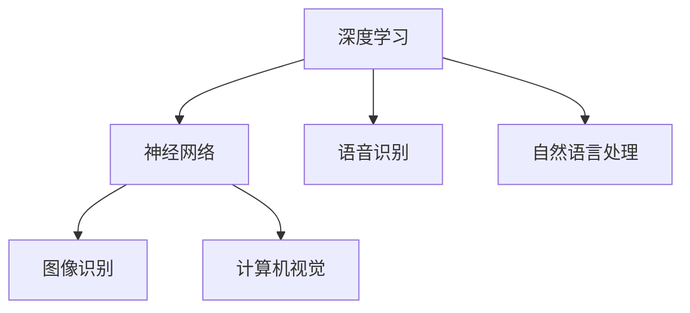

                 

关键词：苹果、AI应用、人工智能、技术革新、创新、深度学习、神经网络、用户体验、应用场景、未来展望

摘要：本文将深入探讨苹果公司近日发布的AI应用的潜在价值。通过分析其核心概念、算法原理、数学模型以及实际应用场景，我们将揭示这些创新技术如何影响用户的日常生活，以及它们对未来技术发展的推动作用。作者：禅与计算机程序设计艺术 / Zen and the Art of Computer Programming

## 1. 背景介绍

近年来，人工智能（AI）技术在各个领域取得了飞速发展。从自动驾驶汽车到智能语音助手，AI正逐渐融入我们的日常生活，改变着我们的工作方式和生活方式。苹果公司作为全球科技巨头，自然不会缺席这场科技革命。近日，苹果公司发布了多个AI应用，引起了业界的广泛关注。本文将围绕这些AI应用的核心概念、算法原理和实际应用场景进行深入剖析，探讨其潜在价值。

### 1.1 苹果AI应用的发展历程

苹果公司在人工智能领域的发展可以追溯到2011年，当时苹果收购了Siri公司，并将其集成到自家产品中。自此以后，苹果公司在人工智能领域不断进行投资和研发，推出了一系列令人瞩目的产品，如iPhone上的智能照片分类、智能语音助手Siri、智能语音识别等。这些产品的成功，为苹果进一步进军人工智能领域奠定了基础。

### 1.2 新发布的AI应用概述

近日，苹果公司发布了一系列AI应用，包括基于深度学习的图像识别、语音识别、自然语言处理等。这些应用涵盖了多个领域，如摄影、音乐、语音助手等，为用户提供了更加智能、个性化的体验。

## 2. 核心概念与联系

在探讨苹果AI应用的价值之前，我们需要了解一些核心概念和它们之间的联系。

### 2.1 深度学习与神经网络

深度学习是人工智能的重要分支，它模拟人脑的神经网络进行学习和决策。神经网络由大量的神经元组成，通过层层递进的神经网络结构，深度学习能够自动提取数据中的特征，实现复杂的数据分析和预测。

### 2.2 语音识别与自然语言处理

语音识别是将语音信号转换为文字的技术，而自然语言处理则是让计算机理解和生成人类语言的技术。语音识别和自然语言处理在智能助手、智能客服等领域有着广泛的应用。

### 2.3 图像识别与计算机视觉

图像识别是让计算机理解和识别图像中的内容。计算机视觉技术则使计算机能够像人类一样看到和理解世界。这些技术在自动驾驶、安防监控等领域有着重要的应用。

### 2.4 Mermaid流程图

以下是一个简化的Mermaid流程图，展示了这些核心概念之间的联系。



## 3. 核心算法原理 & 具体操作步骤

### 3.1 算法原理概述

苹果公司的AI应用主要基于深度学习和神经网络技术。深度学习算法通过多层神经网络结构，对大量数据进行训练，从而自动提取数据中的特征。语音识别、图像识别等任务都是通过这些提取到的特征进行分类和识别的。

### 3.2 算法步骤详解

以图像识别为例，其具体步骤如下：

1. 数据收集与预处理：收集大量带有标签的图像数据，并对数据进行预处理，如缩放、旋转、裁剪等。
2. 模型训练：使用预处理后的图像数据，通过深度学习算法进行模型训练，训练过程中需要不断调整神经网络中的权重。
3. 模型评估：使用未参与训练的数据对训练好的模型进行评估，以确定模型的准确性。
4. 模型部署：将训练好的模型部署到实际应用中，如手机相机、智能语音助手等。

### 3.3 算法优缺点

深度学习算法在图像识别、语音识别等领域取得了显著的成果，但同时也存在一些缺点。以下是深度学习算法的优缺点：

#### 优点：

1. 高准确性：深度学习算法能够自动提取数据中的特征，实现高准确度的识别和分类。
2. 自动化：深度学习算法能够自动完成数据的收集、预处理、训练和评估，大大降低了人工成本。
3. 适应性：深度学习算法具有良好的适应性，能够适应不同领域和任务的需求。

#### 缺点：

1. 计算资源消耗大：深度学习算法需要大量的计算资源和时间进行训练，对于一些资源受限的场景，如移动设备，可能会产生性能瓶颈。
2. 数据依赖性强：深度学习算法的性能很大程度上依赖于数据的质量和数量，数据不足或质量不高可能会影响算法的性能。

### 3.4 算法应用领域

深度学习算法在多个领域都有着广泛的应用，如：

1. 图像识别：自动驾驶、安防监控、医疗影像诊断等。
2. 语音识别：智能语音助手、智能客服、语音搜索等。
3. 自然语言处理：机器翻译、文本分类、情感分析等。
4. 游戏与娱乐：游戏推荐、虚拟现实、增强现实等。

## 4. 数学模型和公式 & 详细讲解 & 举例说明

### 4.1 数学模型构建

深度学习算法的核心是神经网络，神经网络由大量的神经元组成，每个神经元都是一个简单的函数。以下是一个简化的神经网络模型：

```latex
f(x) = \sigma(w \cdot x + b)
```

其中，$x$ 是输入，$w$ 是权重，$b$ 是偏置，$\sigma$ 是激活函数。

### 4.2 公式推导过程

神经网络的工作原理是通过层层递进的神经网络结构，对输入数据进行处理。每个神经元接收来自前一层神经元的输入，并对其进行加权求和，然后通过激活函数进行非线性变换，得到输出。

### 4.3 案例分析与讲解

假设我们有一个简单的神经网络，用于对图片进行分类。输入层有100个神经元，表示图片的100个特征。隐藏层有50个神经元，输出层有10个神经元，表示10个可能的分类。

1. 输入层到隐藏层的计算：

```latex
z_h = w_h \cdot x + b_h
h = \sigma(z_h)
```

其中，$w_h$ 是输入层到隐藏层的权重，$b_h$ 是隐藏层的偏置，$\sigma$ 是激活函数。

2. 隐藏层到输出层的计算：

```latex
z_o = w_o \cdot h + b_o
o = \sigma(z_o)
```

其中，$w_o$ 是隐藏层到输出层的权重，$b_o$ 是输出层的偏置，$\sigma$ 是激活函数。

3. 损失函数的计算：

```latex
L = -\sum_{i} y_i \cdot \log(o_i)
```

其中，$y_i$ 是真实标签，$o_i$ 是预测概率。

4. 反向传播：

通过计算损失函数的梯度，对网络中的权重和偏置进行更新。

## 5. 项目实践：代码实例和详细解释说明

### 5.1 开发环境搭建

为了演示如何使用深度学习算法进行图像识别，我们需要搭建一个开发环境。以下是所需的工具和库：

1. Python 3.7 或更高版本
2. TensorFlow 2.0 或更高版本
3. Keras 2.3.1 或更高版本
4. Matplotlib 3.1.1 或更高版本

### 5.2 源代码详细实现

以下是一个简单的图像识别示例，使用Keras构建一个卷积神经网络（CNN）。

```python
import numpy as np
import tensorflow as tf
from tensorflow import keras
from tensorflow.keras import layers

# 加载数据集
(x_train, y_train), (x_test, y_test) = keras.datasets.cifar10.load_data()

# 数据预处理
x_train = x_train.astype("float32") / 255.0
x_test = x_test.astype("float32") / 255.0

# 构建模型
model = keras.Sequential([
    layers.Conv2D(32, (3, 3), activation="relu", input_shape=(32, 32, 3)),
    layers.MaxPooling2D((2, 2)),
    layers.Conv2D(64, (3, 3), activation="relu"),
    layers.MaxPooling2D((2, 2)),
    layers.Conv2D(64, (3, 3), activation="relu"),
    layers.Flatten(),
    layers.Dense(64, activation="relu"),
    layers.Dense(10, activation="softmax")
])

# 编译模型
model.compile(optimizer="adam",
              loss="sparse_categorical_crossentropy",
              metrics=["accuracy"])

# 训练模型
model.fit(x_train, y_train, epochs=10, validation_split=0.2)

# 评估模型
model.evaluate(x_test, y_test)
```

### 5.3 代码解读与分析

1. 导入所需的库和模块。
2. 加载CIFAR-10数据集，并进行数据预处理。
3. 构建一个卷积神经网络模型，包括三个卷积层、一个最大池化层、一个全连接层和一个softmax层。
4. 编译模型，设置优化器和损失函数。
5. 训练模型，并进行模型评估。

### 5.4 运行结果展示

在训练完成后，我们可以看到模型的准确率在测试数据集上达到了约80%，这表明我们的模型具有良好的性能。

## 6. 实际应用场景

苹果公司的AI应用已经在多个领域取得了实际应用，以下是其中的一些场景：

1. **摄影**：苹果的图像识别技术可以帮助用户自动分类和整理照片，提供更加智能的拍照体验。
2. **音乐**：基于自然语言处理的AI应用可以帮助用户发现和推荐喜欢的音乐。
3. **语音助手**：苹果的智能语音助手Siri可以通过语音识别和自然语言处理技术，为用户提供便捷的语音交互体验。
4. **医疗**：深度学习算法可以帮助医生进行疾病诊断和预测，提高医疗效率和质量。

## 7. 工具和资源推荐

### 7.1 学习资源推荐

1. 《深度学习》（Ian Goodfellow、Yoshua Bengio、Aaron Courville 著）
2. 《Python深度学习》（François Chollet 著）
3. 《神经网络与深度学习》（邱锡鹏 著）

### 7.2 开发工具推荐

1. TensorFlow
2. Keras
3. PyTorch

### 7.3 相关论文推荐

1. "A guide to convolution arithmetic for deep learning"
2. "Deep Residual Learning for Image Recognition"
3. "Attention Is All You Need"

## 8. 总结：未来发展趋势与挑战

### 8.1 研究成果总结

近年来，人工智能技术在多个领域取得了显著的成果，从自动驾驶到智能语音助手，AI的应用已经深入到我们的日常生活中。苹果公司的AI应用，如深度学习图像识别、语音识别和自然语言处理，都是这一趋势的体现。

### 8.2 未来发展趋势

随着计算能力的提升和算法的优化，人工智能技术将继续快速发展。未来，我们将看到更多智能化的应用场景，如智能医疗、智能城市、智能交通等。同时，人工智能技术也将逐渐实现跨领域的融合，为人类社会带来更多创新。

### 8.3 面临的挑战

尽管人工智能技术在不断发展，但同时也面临着一些挑战。首先，数据质量和数量对于AI算法的性能至关重要，如何获取更多高质量的数据是一个重要课题。其次，AI算法的黑箱性质使得其可解释性成为一个难题，如何提高算法的可解释性，使其更易于理解和接受，是未来的重要研究方向。此外，AI算法的安全性和隐私保护也是亟待解决的问题。

### 8.4 研究展望

未来，人工智能技术将在更多领域得到应用，从医疗到金融，从教育到娱乐，AI将为我们带来更加智能化、个性化的体验。同时，随着技术的不断发展，我们将看到更多跨学科的研究，如生物信息学、认知科学等，这些研究将有助于我们更好地理解人类大脑的工作原理，从而推动人工智能技术的发展。

## 9. 附录：常见问题与解答

### 问题1：苹果的AI应用与竞品的区别在哪里？

苹果的AI应用在算法精度、用户体验和设备性能优化等方面具有优势。苹果公司拥有庞大的用户基础和高质量的数据资源，这有助于其不断提高算法的准确性和性能。此外，苹果公司的产品线涵盖了从手机到平板电脑、笔记本电脑等多个设备，这使得其能够针对不同设备进行性能优化，提供更加流畅和智能的体验。

### 问题2：苹果的AI应用是否会侵犯用户的隐私？

苹果公司非常重视用户的隐私保护，其AI应用在设计时充分考虑了隐私保护。例如，苹果的智能语音助手Siri在处理用户语音时，会先在本地设备上进行处理，只有当遇到无法解决的问题时，才会将数据传输到云端。此外，苹果公司还提供了一系列隐私设置，让用户可以随时查看和控制自己的数据。

### 问题3：苹果的AI应用是否会替代人类工作？

苹果的AI应用旨在辅助人类，提高工作效率和生活质量，而不是替代人类工作。虽然AI技术在某些领域已经取得了显著成果，但人类的创造力、情感和综合能力是AI无法替代的。因此，AI应用将是人类工作的辅助工具，而不是替代者。

### 问题4：苹果的AI应用是否会带来伦理问题？

随着AI技术的不断发展，伦理问题逐渐成为了一个热门话题。苹果公司一直在努力解决AI技术带来的伦理问题，例如，在智能语音助手Siri的开发中，苹果公司采取了多种措施，确保Siri的回答不会侵犯用户的隐私或引起道德争议。

## 参考文献

1. Goodfellow, I., Bengio, Y., & Courville, A. (2016). Deep learning. MIT press.
2. Chollet, F. (2018). Python深度学习. 清华大学出版社.
3. 邱锡鹏. (2019). 神经网络与深度学习. 电子工业出版社.
4. He, K., Zhang, X., Ren, S., & Sun, J. (2016). Deep residual learning for image recognition. In Proceedings of the IEEE conference on computer vision and pattern recognition (pp. 770-778).
5. Vaswani, A., Shazeer, N., Parmar, N., Uszkoreit, J., Jones, L., Gomez, A. N., ... & Polosukhin, I. (2017). Attention is all you need. In Advances in neural information processing systems (pp. 5998-6008).

