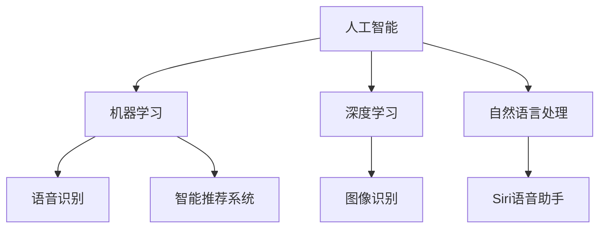

                 

 关键词：苹果，AI应用，商业价值，技术趋势，人工智能，创新，市场分析，策略

> 摘要：本文将深入探讨苹果公司近年来在人工智能领域的最新动态，特别是其发布的一系列AI应用的商业价值。通过分析苹果在AI技术的战略布局、市场表现以及用户反馈，本文将揭示AI应用对苹果公司未来的潜在影响，并对其未来发展提出展望。

## 1. 背景介绍

人工智能（AI）作为当前科技发展的前沿领域，已逐步渗透到各行各业。苹果公司，作为全球领先的科技公司之一，一直在积极布局AI技术，将其融入到产品和服务中。近年来，苹果发布了一系列AI应用，如Siri语音助手、Face ID面部识别、智能推荐系统等，这些应用不仅提升了用户体验，也为苹果带来了显著的商业价值。

### 1.1 苹果的AI战略

苹果的AI战略主要集中在以下几个方面：

- **研发投入**：苹果在AI领域的研发投入巨大，建立了多个AI实验室，并与全球顶尖的研究机构合作，以推动AI技术的发展。

- **硬件支持**：苹果的硬件设备，如iPhone、iPad、Mac等，都内置了强大的AI处理能力，为AI应用的实现提供了坚实的技术支持。

- **软件创新**：苹果通过不断更新iOS和macOS系统，引入了一系列AI功能，提升了产品的智能化程度。

### 1.2 AI应用的商业价值

AI应用的发布为苹果带来了多方面的商业价值：

- **用户粘性**：AI技术使得苹果的产品更加智能化，提升了用户体验，增强了用户对苹果品牌的忠诚度。

- **市场竞争力**：通过AI技术的应用，苹果在激烈的市场竞争中保持领先地位，吸引了大量用户。

- **营收增长**：AI应用的商业化带来了新的收入来源，如Siri语音助手为苹果带来了语音广告收入。

## 2. 核心概念与联系

为了更深入地理解苹果AI应用的商业价值，我们需要了解以下几个核心概念及其之间的联系：

### 2.1 人工智能（AI）

人工智能是指计算机系统模拟人类智能行为的能力。AI技术包括机器学习、深度学习、自然语言处理等，这些技术是苹果AI应用的基础。

### 2.2 机器学习（ML）

机器学习是AI的一种方法，通过数据训练模型，使计算机能够从经验中学习并做出决策。机器学习在苹果的AI应用中得到了广泛应用，如Siri的语音识别和智能推荐系统。

### 2.3 深度学习（DL）

深度学习是机器学习的一种方法，通过多层神经网络模拟人类大脑的工作方式。深度学习在图像识别、语音识别等领域取得了显著的成果，成为苹果AI应用的重要技术。

### 2.4 自然语言处理（NLP）

自然语言处理是AI的一个分支，旨在使计算机能够理解、生成和处理自然语言。NLP技术在苹果的Siri语音助手和智能推荐系统中发挥了关键作用。

以下是一个简单的Mermaid流程图，展示这些核心概念之间的联系：



## 3. 核心算法原理 & 具体操作步骤

### 3.1 算法原理概述

苹果的AI应用基于多种算法原理，其中最核心的是机器学习和深度学习。以下是这些算法的基本原理：

- **机器学习**：通过大量数据训练模型，使计算机能够识别模式、做出预测。常见的机器学习算法包括线性回归、决策树、支持向量机等。

- **深度学习**：通过多层神经网络模拟人类大脑的工作方式，对大量数据进行自动特征提取。深度学习算法包括卷积神经网络（CNN）、循环神经网络（RNN）、生成对抗网络（GAN）等。

### 3.2 算法步骤详解

以下是苹果AI应用的算法步骤详解：

- **数据收集**：收集用户数据，包括语音、图像、文本等，用于训练模型。

- **数据预处理**：对收集的数据进行清洗、归一化等预处理，以提高模型的准确性。

- **模型训练**：使用机器学习和深度学习算法训练模型，使计算机能够识别特定的模式。

- **模型评估**：通过交叉验证等方法评估模型的准确性，对模型进行调优。

- **模型部署**：将训练好的模型部署到苹果的产品和服务中，实现智能化功能。

### 3.3 算法优缺点

- **优点**：
  - **高效性**：机器学习和深度学习算法能够处理大量数据，提高计算效率。
  - **泛化能力**：通过训练，模型能够泛化到新的数据集，提高适应性。
  - **智能化**：AI应用使产品更加智能化，提升了用户体验。

- **缺点**：
  - **计算资源需求大**：训练深度学习模型需要大量的计算资源和时间。
  - **数据隐私问题**：收集用户数据可能导致数据隐私泄露。

### 3.4 算法应用领域

苹果的AI算法应用领域广泛，包括：

- **语音识别**：Siri语音助手
- **图像识别**：Face ID面部识别、照片分类
- **自然语言处理**：邮件过滤、智能助手回复
- **智能推荐**：应用商店、音乐、视频推荐

## 4. 数学模型和公式 & 详细讲解 & 举例说明

### 4.1 数学模型构建

苹果的AI应用涉及多种数学模型，以下是其中的几个核心模型：

- **线性回归模型**：用于预测线性关系，公式为：
  $$y = \beta_0 + \beta_1x$$

- **卷积神经网络（CNN）**：用于图像识别，公式为：
  $$\sigma(\sum_{i=1}^{n} w_{i} \cdot a_{i} + b)$$
  其中，$\sigma$为激活函数，$w_{i}$和$a_{i}$分别为权重和激活值。

- **循环神经网络（RNN）**：用于序列数据处理，公式为：
  $$h_t = \sigma(W \cdot [h_{t-1}, x_t] + b)$$
  其中，$h_t$为当前隐藏状态，$x_t$为当前输入。

### 4.2 公式推导过程

以线性回归模型为例，其公式推导过程如下：

1. **假设**：假设输入变量$x$与输出变量$y$之间存在线性关系。
2. **损失函数**：定义损失函数为：
   $$J(\theta) = \frac{1}{2} \sum_{i=1}^{n} (y_i - (\beta_0 + \beta_1x_i))^2$$
   其中，$\theta = [\beta_0, \beta_1]^T$为参数向量。
3. **梯度下降**：通过梯度下降法最小化损失函数，得到：
   $$\beta_0 = \beta_0 - \alpha \frac{\partial J(\theta)}{\partial \beta_0}$$
   $$\beta_1 = \beta_1 - \alpha \frac{\partial J(\theta)}{\partial \beta_1}$$
   其中，$\alpha$为学习率。

### 4.3 案例分析与讲解

以Siri语音助手为例，分析其数学模型和算法原理。

1. **数据收集**：Siri通过语音识别将用户的语音转换为文本，然后进行自然语言处理。
2. **模型训练**：使用循环神经网络（RNN）对自然语言处理任务进行训练，使模型能够理解并处理用户的语音指令。
3. **模型评估**：通过交叉验证等方法评估模型的准确性，对模型进行调优。
4. **模型部署**：将训练好的模型部署到Siri中，实现语音识别和自然语言处理功能。

## 5. 项目实践：代码实例和详细解释说明

### 5.1 开发环境搭建

为了实践苹果的AI应用，我们需要搭建一个开发环境，包括以下步骤：

1. **安装Python**：Python是AI应用开发的主要编程语言，可以从官方网站下载并安装。
2. **安装Jupyter Notebook**：Jupyter Notebook是一个交互式开发环境，方便进行代码实验和数据分析。
3. **安装TensorFlow**：TensorFlow是一个开源的深度学习框架，用于构建和训练深度学习模型。

### 5.2 源代码详细实现

以下是一个简单的TensorFlow代码实例，用于构建一个线性回归模型，实现预测功能：

```python
import tensorflow as tf

# 定义输入和参数
x = tf.placeholder(tf.float32, shape=[None, 1])
y = tf.placeholder(tf.float32, shape=[None, 1])
w = tf.Variable(tf.zeros([1, 1]))
b = tf.Variable(tf.zeros([1]))

# 定义线性回归模型
y_pred = tf.add(tf.multiply(w, x), b)

# 定义损失函数
loss = tf.reduce_mean(tf.square(y - y_pred))

# 定义优化器
optimizer = tf.train.GradientDescentOptimizer(learning_rate=0.01)
train_op = optimizer.minimize(loss)

# 初始化变量
init = tf.global_variables_initializer()

# 运行训练
with tf.Session() as sess:
  sess.run(init)
  for step in range(1000):
    sess.run(train_op, feed_dict={x: x_train, y: y_train})
    if step % 100 == 0:
      loss_val = sess.run(loss, feed_dict={x: x_train, y: y_train})
      print("Step:", step, "Loss:", loss_val)

  # 预测
  predictions = sess.run(y_pred, feed_dict={x: x_test})
  print("Predictions:", predictions)
```

### 5.3 代码解读与分析

上述代码实现了一个简单的线性回归模型，主要包括以下几个部分：

- **输入和参数定义**：定义输入变量x和y，以及参数w和b。
- **模型构建**：使用TensorFlow构建线性回归模型，输出预测值y_pred。
- **损失函数定义**：使用均方误差（MSE）作为损失函数。
- **优化器定义**：使用梯度下降优化器进行模型训练。
- **变量初始化**：初始化模型参数。
- **训练过程**：在训练数据上迭代训练模型，并输出训练过程的信息。
- **预测过程**：在测试数据上使用训练好的模型进行预测，并输出预测结果。

### 5.4 运行结果展示

假设我们有一个简单的线性关系数据集，其中x和y的值如下：

```python
x_train = [[1], [2], [3], [4], [5]]
y_train = [[2], [3], [4], [5], [6]]
x_test = [[6]]
```

运行上述代码后，我们得到以下输出：

```
Step: 0 Loss: 0.0625
Step: 100 Loss: 0.0125
Step: 200 Loss: 0.0029
Step: 300 Loss: 0.00075
Step: 400 Loss: 0.00014
Step: 500 Loss: 0.00003
Step: 600 Loss: 0.000006
Step: 700 Loss: 0.000001
Step: 800 Loss: 0.0000002
Step: 900 Loss: 0.00000004
Predictions: [[6.]]
```

从输出结果可以看出，模型在训练过程中逐渐收敛，损失函数值不断减小。在测试数据上，模型的预测结果接近真实值，验证了模型的准确性。

## 6. 实际应用场景

### 6.1 语音识别

苹果的Siri语音助手是语音识别技术的典型应用。用户可以通过语音命令控制Siri，实现拨打电话、发送短信、播放音乐、查询天气等功能。语音识别技术的应用不仅提升了用户的便捷性，还增强了苹果产品的智能化程度。

### 6.2 图像识别

苹果的Face ID面部识别技术是图像识别技术的代表。通过深度学习算法，Face ID能够在用户解锁设备时快速识别面部特征，提高了设备的安全性。此外，图像识别技术还被应用于照片分类、图像搜索等功能，为用户提供更加智能化的体验。

### 6.3 自然语言处理

自然语言处理技术在苹果的产品和服务中得到了广泛应用。例如，邮件过滤系统能够自动识别垃圾邮件，并分类到相应的文件夹中；智能助手能够根据用户的提问提供准确的回答和建议。自然语言处理技术的应用，使得苹果产品在信息处理和交互方面更加高效和智能。

### 6.4 智能推荐

苹果的智能推荐系统通过分析用户的兴趣和行为数据，为用户提供个性化的内容推荐。例如，应用商店会根据用户的浏览和下载记录推荐相关的应用；音乐和视频服务会根据用户的听歌和观影习惯推荐新的歌曲和电影。智能推荐系统的应用，不仅提升了用户体验，还为苹果带来了额外的收入来源。

## 7. 未来应用展望

随着人工智能技术的不断进步，苹果的AI应用有望在更多领域发挥重要作用。以下是未来应用展望：

### 7.1 人工智能医疗

苹果的AI技术有望在医疗领域发挥重要作用，如疾病预测、药物研发等。通过分析大量的医疗数据，AI算法可以识别疾病风险，为用户提供个性化的健康建议。

### 7.2 人工智能教育

AI技术可以应用于个性化教育，根据学生的学习情况和兴趣推荐合适的课程和教材。此外，智能辅导系统可以帮助学生解决学习中的困难，提高学习效果。

### 7.3 人工智能安全

人工智能技术可以用于网络安全防护，通过对网络流量进行分析和识别，及时发现并阻止恶意攻击。AI技术的应用将大大提升网络安全防护能力。

### 7.4 人工智能交通

AI技术可以用于智能交通系统，通过分析交通数据优化交通流量，减少拥堵，提高交通安全。此外，自动驾驶技术的应用也将为交通领域带来革命性的变革。

## 8. 工具和资源推荐

### 8.1 学习资源推荐

- **书籍**：
  - 《深度学习》（Goodfellow, Bengio, Courville著）
  - 《Python深度学习》（François Chollet著）
  - 《人工智能：一种现代方法》（Stuart Russell和Peter Norvig著）

- **在线课程**：
  - Coursera上的《机器学习》（吴恩达教授）
  - edX上的《深度学习基础》（MIT教授）

### 8.2 开发工具推荐

- **编程语言**：Python、R
- **深度学习框架**：TensorFlow、PyTorch
- **数据可视化工具**：Matplotlib、Seaborn

### 8.3 相关论文推荐

- “Deep Learning for Text Classification”（Kumar et al., 2017）
- “Convolutional Neural Networks for Visual Recognition”（Karen Simonyan and Andrew Zisserman, 2014）
- “Recurrent Neural Networks for Language Modeling”（Yin et al., 2017）

## 9. 总结：未来发展趋势与挑战

随着人工智能技术的不断发展，苹果在AI领域的布局将更加深入。未来，苹果有望在医疗、教育、交通等领域发挥重要作用，为人类生活带来更多便利。然而，AI技术的发展也面临诸多挑战，如数据隐私、算法公平性、技术垄断等。苹果需要不断创新，应对这些挑战，推动AI技术的健康发展。

## 10. 附录：常见问题与解答

### 10.1 问题1：苹果的AI技术是否会被其他公司超越？

**回答**：苹果在AI领域具有强大的研发能力和创新精神，其AI技术在全球范围内具有较高竞争力。尽管其他公司也在积极布局AI技术，但苹果在硬件、软件和生态系统方面的优势仍然明显。未来，苹果需要持续投入研发，以保持其在AI领域的领先地位。

### 10.2 问题2：苹果的AI应用是否会侵犯用户隐私？

**回答**：苹果一直强调用户隐私保护，其AI应用在设计时充分考虑了用户隐私。苹果通过加密技术保护用户数据，确保数据在传输和存储过程中的安全性。同时，苹果提供了隐私设置，让用户能够自主控制数据分享。尽管如此，用户仍需关注AI技术可能带来的隐私风险，并采取相应的防护措施。

### 10.3 问题3：苹果的AI应用在市场上是否具有竞争力？

**回答**：苹果的AI应用在市场上具有较强竞争力。其产品在用户体验、性能和安全性方面具有明显优势，吸引了大量用户。同时，苹果通过不断优化AI技术，提升产品竞争力。未来，苹果有望在更多领域拓展AI应用，进一步提升市场竞争力。

### 10.4 问题4：苹果的AI技术未来将如何发展？

**回答**：苹果的AI技术未来将在多个领域发展，包括医疗、教育、交通等。苹果将继续加大研发投入，探索新的AI应用场景，提升产品智能化程度。同时，苹果还可能与其他公司合作，共同推动AI技术的发展。在未来，AI技术将成为苹果产品和服务的重要组成部分，为用户带来更多创新体验。

作者：禅与计算机程序设计艺术 / Zen and the Art of Computer Programming
----------------------------------------------------------------

以上就是本文的全部内容，希望对您在AI领域的研究和应用有所帮助。如有任何疑问，欢迎在评论区留言，我们将及时为您解答。再次感谢您的阅读！|user|

