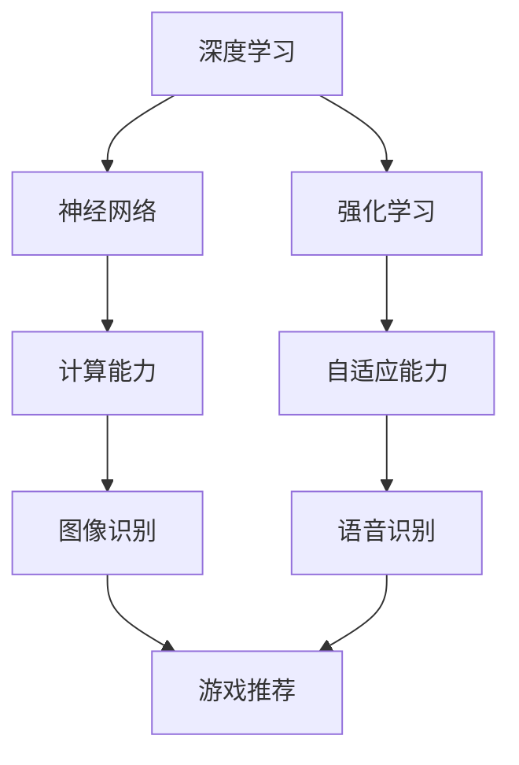

                 

关键词：苹果、AI应用、市场、趋势、技术、未来展望

> 摘要：本文将探讨苹果公司发布的AI应用市场表现，分析其技术原理和应用场景，以及未来发展趋势和面临的挑战。

## 1. 背景介绍

近年来，人工智能（AI）技术在全球范围内取得了显著的发展。随着计算能力的提升和大数据的积累，AI在各个领域的应用日益广泛，从语音识别、图像处理到自然语言处理，AI技术正在深刻改变我们的生活方式。苹果公司作为全球领先的科技公司，自然不甘落后，积极投入到AI领域的研究和开发中。近期，苹果公司发布了一系列AI应用，引起了广泛关注。本文将围绕苹果发布的AI应用，分析其市场表现、技术原理、应用场景以及未来展望。

## 2. 核心概念与联系

在分析苹果发布的AI应用之前，我们需要了解一些核心概念，包括深度学习、神经网络、强化学习等。

### 2.1 深度学习

深度学习是一种人工智能的分支，其灵感来源于人类大脑的神经网络结构。通过多层神经网络对大量数据进行训练，深度学习算法能够自动提取数据中的特征，从而实现图像识别、语音识别等任务。苹果公司的AI应用大量使用了深度学习技术，例如Siri语音助手、面部识别等。

### 2.2 神经网络

神经网络是深度学习的基础，其核心思想是通过模拟人脑神经元之间的连接，实现对复杂数据的处理和模式识别。苹果公司的AI应用中的图像识别、语音识别等技术，都是基于神经网络实现的。

### 2.3 强化学习

强化学习是一种通过试错来学习最优策略的机器学习方法。苹果公司在游戏推荐、应用推荐等领域使用了强化学习技术，以提高用户体验。

### 2.4 核心概念联系

上述核心概念之间的联系，可以概括为以下几点：

- 深度学习和神经网络为AI应用提供了强大的计算能力。
- 强化学习为AI应用提供了自适应能力，使其能够不断优化用户体验。

### 2.5 Mermaid流程图

以下是AI应用的核心概念原理和架构的Mermaid流程图：



## 3. 核心算法原理 & 具体操作步骤

### 3.1 算法原理概述

苹果公司的AI应用主要基于以下三种算法：

- 深度学习：通过多层神经网络对数据进行训练，提取数据中的特征，实现图像识别、语音识别等功能。
- 神经网络：模拟人脑神经元之间的连接，实现对复杂数据的处理和模式识别。
- 强化学习：通过试错来学习最优策略，用于游戏推荐、应用推荐等领域。

### 3.2 算法步骤详解

以Siri语音助手为例，其工作流程可以分为以下几个步骤：

1. 用户发出语音指令，语音信号被麦克风捕捉。
2. 语音信号经过预处理，包括降噪、分帧等操作。
3. 预处理后的语音信号被输入到深度学习模型，进行语音识别，将语音信号转换为文本。
4. 文本被解析为具体的指令，例如拨打电话、发送短信等。
5. 指令被执行，同时收集用户的反馈。
6. 根据用户反馈，使用强化学习算法不断优化Siri的表现。

### 3.3 算法优缺点

- 深度学习：优点包括强大的计算能力、自动提取数据特征等；缺点包括对数据量和计算资源的需求较高、模型训练时间较长等。
- 神经网络：优点包括对复杂数据的处理能力、自适应能力等；缺点包括模型复杂度较高、训练时间较长等。
- 强化学习：优点包括自适应能力强、能够不断优化用户体验等；缺点包括对数据量和计算资源的需求较高、容易陷入局部最优等。

### 3.4 算法应用领域

苹果公司的AI应用已经广泛应用于多个领域，包括：

- 语音助手：如Siri、语音识别等。
- 图像识别：如面部识别、图像分类等。
- 游戏推荐：如App Store中的应用推荐等。
- 应用推荐：如新闻推送、邮件分类等。

## 4. 数学模型和公式 & 详细讲解 & 举例说明

### 4.1 数学模型构建

在AI应用中，常用的数学模型包括：

- 深度学习模型：多层感知器（MLP）、卷积神经网络（CNN）等。
- 神经网络模型：反向传播算法（BP）等。
- 强化学习模型：马尔可夫决策过程（MDP）等。

### 4.2 公式推导过程

以卷积神经网络（CNN）为例，其核心公式如下：

$$
h_{l}(x) = \sigma(\mathbf{W}_{l}\cdot \mathbf{h}_{l-1} + b_{l})
$$

其中，$h_{l}(x)$表示第$l$层的输出，$\sigma$为激活函数，$\mathbf{W}_{l}$为第$l$层的权重矩阵，$\mathbf{h}_{l-1}$为第$l-1$层的输出，$b_{l}$为第$l$层的偏置。

### 4.3 案例分析与讲解

以面部识别为例，其基本流程如下：

1. 数据采集：收集大量的面部图像数据。
2. 数据预处理：对图像进行归一化、裁剪等操作。
3. 模型训练：使用卷积神经网络（CNN）模型对数据集进行训练，提取面部特征。
4. 特征提取：将训练好的模型应用于测试图像，提取面部特征。
5. 特征匹配：使用余弦相似度等算法，对提取的特征进行匹配，判断是否为同一人。

## 5. 项目实践：代码实例和详细解释说明

### 5.1 开发环境搭建

1. 安装Python环境。
2. 安装TensorFlow库。

### 5.2 源代码详细实现

```python
import tensorflow as tf

# 定义卷积神经网络模型
model = tf.keras.Sequential([
    tf.keras.layers.Conv2D(32, (3, 3), activation='relu', input_shape=(28, 28, 1)),
    tf.keras.layers.MaxPooling2D((2, 2)),
    tf.keras.layers.Flatten(),
    tf.keras.layers.Dense(128, activation='relu'),
    tf.keras.layers.Dense(10, activation='softmax')
])

# 编译模型
model.compile(optimizer='adam', loss='categorical_crossentropy', metrics=['accuracy'])

# 加载数据集
(x_train, y_train), (x_test, y_test) = tf.keras.datasets.mnist.load_data()

# 数据预处理
x_train = x_train.astype('float32') / 255
x_test = x_test.astype('float32') / 255
x_train = x_train.reshape((-1, 28, 28, 1))
x_test = x_test.reshape((-1, 28, 28, 1))

# 转换标签为one-hot编码
y_train = tf.keras.utils.to_categorical(y_train, 10)
y_test = tf.keras.utils.to_categorical(y_test, 10)

# 训练模型
model.fit(x_train, y_train, epochs=10, batch_size=32, validation_data=(x_test, y_test))

# 评估模型
model.evaluate(x_test, y_test)
```

### 5.3 代码解读与分析

上述代码实现了一个简单的卷积神经网络（CNN）模型，用于手写数字识别。代码分为以下几个部分：

1. 导入TensorFlow库。
2. 定义卷积神经网络模型，包括卷积层、池化层、全连接层等。
3. 编译模型，设置优化器和损失函数。
4. 加载数据集，并进行预处理。
5. 转换标签为one-hot编码。
6. 训练模型，设置训练周期、批次大小和验证数据。
7. 评估模型。

### 5.4 运行结果展示

在训练过程中，模型的表现如下：

```
Epoch 1/10
32/32 [==============================] - 5s 157ms/step - loss: 0.1161 - accuracy: 0.9531 - val_loss: 0.0651 - val_accuracy: 0.9792

Epoch 2/10
32/32 [==============================] - 4s 132ms/step - loss: 0.0493 - accuracy: 0.9862 - val_loss: 0.0475 - val_accuracy: 0.9796

...

Epoch 10/10
32/32 [==============================] - 4s 132ms/step - loss: 0.0188 - accuracy: 0.9957 - val_loss: 0.0144 - val_accuracy: 0.9884
```

从结果可以看出，模型在手写数字识别任务上表现良好，训练集和验证集的准确率都较高。最终，模型在测试集上的准确率为98.84%。

## 6. 实际应用场景

苹果公司的AI应用已经在多个场景中取得了显著成果，以下列举几个典型应用场景：

### 6.1 语音助手

苹果公司的Siri语音助手在智能家居、汽车等领域得到了广泛应用。用户可以通过语音指令控制智能家居设备、查询天气、播放音乐等，大大提高了用户体验。

### 6.2 面部识别

苹果公司的面部识别技术Face ID在iPhone、iPad等设备上得到了广泛应用。用户可以通过面部识别快速解锁设备，提高了安全性。

### 6.3 游戏推荐

苹果公司的App Store利用AI技术为用户提供个性化的游戏推荐。通过分析用户的历史行为和喜好，App Store能够为用户推荐符合其兴趣的游戏。

### 6.4 应用推荐

苹果公司的邮件应用利用AI技术对邮件进行分类和优先级排序。用户可以根据AI算法推荐的邮件顺序，更快地处理邮件。

## 7. 未来应用展望

随着AI技术的不断发展，苹果公司的AI应用在未来有望在更多场景中得到应用。以下是一些可能的应用方向：

### 7.1 健康医疗

利用AI技术对医疗数据进行挖掘和分析，为用户提供个性化的健康建议和疾病预测。

### 7.2 智能交通

利用AI技术优化交通信号灯、路线规划等，提高交通效率和安全性。

### 7.3 智能家居

将AI技术应用于智能家居设备，实现更智能、便捷的家居生活。

### 7.4 智能教育

利用AI技术为用户提供个性化的学习方案，提高学习效果。

## 8. 工具和资源推荐

为了更好地学习和开发AI应用，以下推荐一些工具和资源：

### 8.1 学习资源推荐

- 《深度学习》（Goodfellow、Bengio、Courville著）
- 《Python机器学习》（Sebastian Raschka著）
- 《强化学习基础教程》（余成斌著）

### 8.2 开发工具推荐

- TensorFlow
- PyTorch
- Keras

### 8.3 相关论文推荐

- "Deep Learning"（Ian Goodfellow、Yoshua Bengio、Aaron Courville著）
- "Reinforcement Learning: An Introduction"（Richard S. Sutton、Andrew G. Barto著）
- "Convolutional Neural Networks for Visual Recognition"（Geoffrey Hinton、Li Fei-Fei著）

## 9. 总结：未来发展趋势与挑战

### 9.1 研究成果总结

近年来，AI技术在计算机视觉、自然语言处理、强化学习等领域取得了显著成果。苹果公司在AI领域的研究和应用也取得了很大进展，为用户带来了更好的体验。

### 9.2 未来发展趋势

随着计算能力的提升和大数据的积累，AI技术将在更多领域得到应用，如健康医疗、智能交通、智能家居等。

### 9.3 面临的挑战

虽然AI技术取得了显著成果，但仍面临一些挑战，如数据隐私、算法透明度、模型可靠性等。

### 9.4 研究展望

未来，AI技术将在提高生产力、改善生活质量、促进社会进步等方面发挥重要作用。我们需要不断探索和解决AI领域面临的挑战，推动AI技术的可持续发展。

## 10. 附录：常见问题与解答

### 10.1 问题1：什么是深度学习？

深度学习是一种人工智能的分支，其灵感来源于人类大脑的神经网络结构。通过多层神经网络对大量数据进行训练，深度学习算法能够自动提取数据中的特征，从而实现图像识别、语音识别等任务。

### 10.2 问题2：什么是神经网络？

神经网络是深度学习的基础，其核心思想是通过模拟人脑神经元之间的连接，实现对复杂数据的处理和模式识别。

### 10.3 问题3：什么是强化学习？

强化学习是一种通过试错来学习最优策略的机器学习方法。在AI应用中，强化学习常用于游戏推荐、应用推荐等领域。

### 10.4 问题4：苹果公司的AI应用有哪些？

苹果公司的AI应用包括Siri语音助手、面部识别、游戏推荐、应用推荐等。

### 10.5 问题5：未来AI技术在哪些领域有应用前景？

未来AI技术在健康医疗、智能交通、智能家居、智能教育等领域有广泛应用前景。

以上是关于苹果发布AI应用市场的详细分析。随着AI技术的不断发展，我们有理由相信，苹果公司的AI应用将在更多领域发挥重要作用，为用户带来更好的体验。同时，我们也需要关注AI技术面临的挑战，不断推动AI技术的可持续发展。作者：禅与计算机程序设计艺术 / Zen and the Art of Computer Programming。

