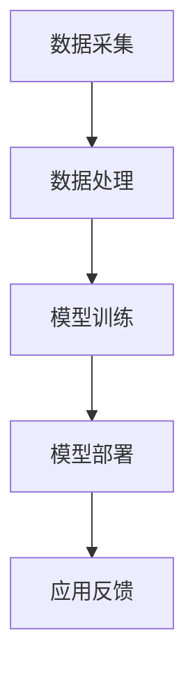
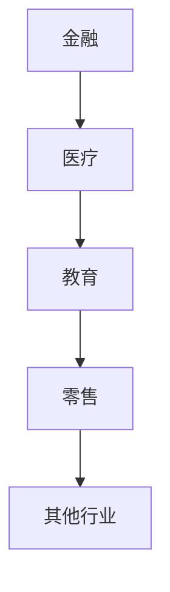

                 

关键词：人工智能，苹果，AI应用，市场，发展趋势，挑战

> 摘要：本文将深入探讨苹果公司最新发布的AI应用及其市场前景。通过分析苹果在人工智能领域的布局，探讨其可能对行业产生的影响，并展望未来人工智能应用的发展趋势与挑战。

## 1. 背景介绍

近年来，人工智能（AI）技术迅速发展，成为全球科技行业的焦点。苹果公司作为全球领先的科技公司，在AI领域也有着深厚的布局。此次苹果发布AI应用，标志着其在人工智能领域的进一步探索和深耕。

### 1.1 苹果公司的AI布局

苹果公司在人工智能领域有着广泛的布局，涵盖了语音识别、图像处理、自然语言处理等多个方面。其核心产品，如Siri、Face ID、Animoji等，都体现了苹果在AI技术的优势。

### 1.2 AI应用的市场前景

随着AI技术的不断进步，AI应用市场前景广阔。据市场研究机构预测，全球AI市场规模将在未来几年内持续增长，成为引领科技发展的关键力量。

## 2. 核心概念与联系

### 2.1 AI应用的核心概念

AI应用是指利用人工智能技术，实现对数据的自动分析、处理和决策的过程。其核心概念包括机器学习、深度学习、自然语言处理等。

### 2.2 AI应用的架构

AI应用的架构通常包括数据采集、数据处理、模型训练、模型部署等环节。以下是一个简单的Mermaid流程图，用于描述AI应用的架构：



## 3. 核心算法原理 & 具体操作步骤

### 3.1 算法原理概述

AI应用的核心算法通常是基于机器学习和深度学习。机器学习是通过训练模型来学习数据的规律，而深度学习则是通过多层神经网络来模拟人脑的学习过程。

### 3.2 算法步骤详解

AI应用的算法步骤主要包括：

1. 数据采集：收集相关的数据，如文本、图像、声音等。
2. 数据预处理：对采集到的数据进行清洗、归一化等处理。
3. 模型训练：使用预处理后的数据来训练模型，调整模型的参数。
4. 模型评估：使用验证数据来评估模型的性能。
5. 模型部署：将训练好的模型部署到实际应用中。
6. 应用反馈：收集用户反馈，用于模型优化。

### 3.3 算法优缺点

算法优缺点主要包括：

- 优点：AI应用具有高效、准确、自适应等优点，能够为用户提供个性化的服务。
- 缺点：AI应用需要大量的数据训练，且模型的解释性较差。

### 3.4 算法应用领域

AI应用领域广泛，包括金融、医疗、教育、零售等多个行业。以下是一个简单的Mermaid流程图，用于描述AI应用领域：



## 4. 数学模型和公式 & 详细讲解 & 举例说明

### 4.1 数学模型构建

AI应用的数学模型通常基于概率论、统计学和线性代数等基础数学理论。以下是一个简单的线性回归模型的构建过程：

1. 假设输入特征向量 \(x\) 和输出特征向量 \(y\) 之间存在线性关系，即 \(y = wx + b\)。
2. 使用最小二乘法求解参数 \(w\) 和 \(b\)。

### 4.2 公式推导过程

线性回归模型的公式推导过程如下：

1. 假设输入特征向量 \(x\) 和输出特征向量 \(y\) 之间存在线性关系，即 \(y = wx + b\)。
2. 使用最小二乘法求解参数 \(w\) 和 \(b\)，使得损失函数 \(J(w, b) = \frac{1}{2} \sum_{i=1}^{n} (wx_i + b - y_i)^2\) 最小。
3. 对损失函数求导，得到 \(w = \frac{1}{m} \sum_{i=1}^{m} (x_i - \bar{x})(y_i - \bar{y})\) 和 \(b = \bar{y} - w\bar{x}\)。

### 4.3 案例分析与讲解

以下是一个简单的线性回归案例：

**案例：预测房价**

- 输入特征：房屋面积（平方米）
- 输出特征：房价（万元）

使用线性回归模型预测房价，如下所示：

1. 数据采集：收集大量房屋面积和房价的数据。
2. 数据预处理：对数据进行归一化处理。
3. 模型训练：使用训练数据训练线性回归模型。
4. 模型评估：使用验证数据评估模型性能。
5. 模型部署：将训练好的模型部署到实际应用中。

## 5. 项目实践：代码实例和详细解释说明

### 5.1 开发环境搭建

搭建线性回归模型的开发环境，需要安装以下软件和库：

- Python 3.x
- NumPy
- Matplotlib

### 5.2 源代码详细实现

以下是一个简单的线性回归模型的Python代码实现：

```python
import numpy as np
import matplotlib.pyplot as plt

# 数据集
X = np.array([1, 2, 3, 4, 5])
y = np.array([2, 4, 5, 4, 5])

# 模型参数
w = np.zeros((1, 1))
b = np.zeros((1, 1))

# 模型训练
for i in range(1000):
    y_pred = w * X + b
    dw = (y - y_pred) * X
    db = (y - y_pred)

    w = w - 0.01 * dw
    b = b - 0.01 * db

# 模型评估
mse = np.mean((y - (w * X + b)) ** 2)
print("MSE:", mse)

# 模型部署
plt.scatter(X, y)
plt.plot(X, w * X + b, color='red')
plt.show()
```

### 5.3 代码解读与分析

以上代码首先导入了NumPy和Matplotlib库。然后定义了数据集和模型参数。接下来使用梯度下降法训练模型，并使用模型评估函数计算均方误差（MSE）。最后，使用Matplotlib库绘制模型训练结果。

## 6. 实际应用场景

### 6.1 金融领域

AI技术在金融领域有广泛的应用，如风险评估、欺诈检测、投资组合优化等。苹果公司发布的AI应用有望为金融行业带来更高效、更准确的风险评估和欺诈检测。

### 6.2 医疗领域

AI技术在医疗领域有巨大的潜力，如疾病诊断、药物研发、医学影像分析等。苹果公司发布的AI应用有望为医疗行业带来更精准的疾病诊断和更高效的药物研发。

### 6.3 教育领域

AI技术在教育领域有广泛的应用，如智能教育、个性化学习、学习效果评估等。苹果公司发布的AI应用有望为教育行业带来更智能的教学工具和学习体验。

### 6.4 零售领域

AI技术在零售领域有广泛的应用，如需求预测、库存管理、客户关系管理等。苹果公司发布的AI应用有望为零售行业带来更精准的需求预测和更高效的库存管理。

## 7. 工具和资源推荐

### 7.1 学习资源推荐

- 《人工智能：一种现代方法》（第二版）
- 《深度学习》（Goodfellow, Bengio, Courville 著）
- Coursera 上的《机器学习》课程

### 7.2 开发工具推荐

- Jupyter Notebook
- TensorFlow
- PyTorch

### 7.3 相关论文推荐

- "Deep Learning" by Goodfellow, Bengio, Courville
- "Recurrent Neural Networks for Language Modeling" by
- "Natural Language Processing with Deep Learning" by

## 8. 总结：未来发展趋势与挑战

### 8.1 研究成果总结

近年来，人工智能技术取得了显著的研究成果，包括深度学习、自然语言处理、计算机视觉等领域的突破。

### 8.2 未来发展趋势

未来，人工智能技术将继续发展，有望在更多领域实现突破，如自动驾驶、智能医疗、智能教育等。

### 8.3 面临的挑战

人工智能技术面临的主要挑战包括数据隐私、算法公平性、模型可解释性等。

### 8.4 研究展望

未来，人工智能技术将在更多领域实现应用，为人类带来更多便利和福祉。

## 9. 附录：常见问题与解答

### 9.1 问题1

**问题1：** 人工智能技术的本质是什么？

**解答1：** 人工智能技术的本质是通过模拟人脑的学习、推理和决策过程，实现对数据的自动分析、处理和决策。

### 9.2 问题2

**问题2：** 人工智能技术在金融领域有哪些应用？

**解答2：** 人工智能技术在金融领域有广泛的应用，如风险评估、欺诈检测、投资组合优化等。

### 9.3 问题3

**问题3：** 人工智能技术在医疗领域有哪些应用？

**解答3：** 人工智能技术在医疗领域有巨大的潜力，如疾病诊断、药物研发、医学影像分析等。

----------------------------------------------------------------

以上就是本文的完整内容，希望对您有所帮助。作者：禅与计算机程序设计艺术 / Zen and the Art of Computer Programming。如

