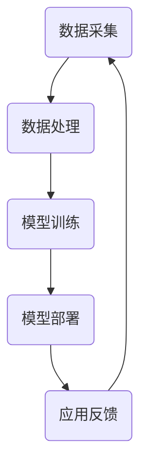

                 

关键词：苹果，AI应用，市场分析，技术趋势，未来展望

摘要：本文将探讨苹果公司最新发布的AI应用，分析其在市场上的潜在影响和未来发展趋势。作为人工智能领域的专家，我将从技术、市场、用户体验等多个角度对这一新产品进行深入剖析。

## 1. 背景介绍

近年来，人工智能（AI）技术在多个领域取得了显著的进展。从自动驾驶到智能助手，AI正在改变我们的生活方式。苹果公司，作为全球领先的技术巨头，一直在积极布局AI领域。此次苹果发布的AI应用，无疑是在这一战略布局中的重要一环。

苹果公司早在2017年便成立了AI研究部门，并不断加强在深度学习、计算机视觉和自然语言处理等方面的研发投入。此次发布的AI应用，正是这一战略布局的成果之一。

## 2. 核心概念与联系

### 2.1 AI应用概述

苹果公司此次发布的AI应用，主要包括以下几个功能：

1. **图像识别**：通过深度学习算法，实现自动识别和分类图像。
2. **语音识别**：利用自然语言处理技术，实现语音输入的精准识别。
3. **智能推荐**：基于用户行为数据，提供个性化的内容推荐。

### 2.2 架构原理

苹果AI应用的架构原理，主要涉及以下几个关键环节：

1. **数据采集**：通过用户设备收集大量数据，包括图像、语音和用户行为等。
2. **数据处理**：对采集到的数据进行分析和处理，提取有用信息。
3. **模型训练**：利用深度学习算法，对处理后的数据进行分析和训练，构建模型。
4. **模型部署**：将训练好的模型部署到用户设备中，实现实时应用。

### 2.3 Mermaid 流程图

## 3. 核心算法原理 & 具体操作步骤

### 3.1 算法原理概述

苹果AI应用的核心算法，主要包括以下几种：

1. **卷积神经网络（CNN）**：用于图像识别。
2. **循环神经网络（RNN）**：用于语音识别。
3. **协同过滤（Collaborative Filtering）**：用于智能推荐。

### 3.2 算法步骤详解

1. **图像识别**：通过CNN算法，对图像进行特征提取和分类。
2. **语音识别**：通过RNN算法，对语音信号进行特征提取和识别。
3. **智能推荐**：通过协同过滤算法，根据用户行为数据，构建推荐模型。

### 3.3 算法优缺点

1. **优点**：
   - **高效性**：利用深度学习算法，提高了识别和推荐的准确率。
   - **个性化**：根据用户行为数据，实现个性化推荐。
   - **实时性**：模型部署在用户设备中，实现实时应用。

2. **缺点**：
   - **数据依赖**：需要大量用户数据，否则效果可能不理想。
   - **隐私问题**：用户数据的安全性成为一大挑战。

### 3.4 算法应用领域

1. **图像识别**：广泛应用于安防监控、医疗诊断等领域。
2. **语音识别**：应用于智能助手、语音翻译等领域。
3. **智能推荐**：应用于电子商务、内容分发等领域。

## 4. 数学模型和公式 & 详细讲解 & 举例说明

### 4.1 数学模型构建

1. **图像识别**：
   - 特征提取：$$ f(x) = \sigma(W \cdot x + b) $$
   - 分类：$$ y = \text{softmax}(W \cdot f(x) + b) $$

2. **语音识别**：
   - 特征提取：$$ h_t = \text{tanh}(W_h \cdot h_{t-1} + U_x \cdot x_t + b_h) $$
   - 识别：$$ \hat{y}_t = \text{softmax}(W_o \cdot h_t + b_o) $$

3. **智能推荐**：
   - 协同过滤：$$ R_{ui} = \text{sim}(u, v) \cdot r_{vi} $$
   - 评分预测：$$ \hat{r}_{ui} = \sum_{j \in N(v)} R_{uj} \cdot r_{ji} $$

### 4.2 公式推导过程

1. **图像识别**：
   - **卷积操作**：通过卷积核提取图像局部特征。
   - **激活函数**：引入ReLU激活函数，提高网络性能。
   - **全连接层**：将特征映射到分类空间。

2. **语音识别**：
   - **循环神经网络**：通过时间步循环，提取语音信号的时间特征。
   - **长短期记忆（LSTM）**：解决长序列依赖问题。
   - **输出层**：通过softmax函数，实现多分类。

3. **智能推荐**：
   - **相似度计算**：通过用户和物品的相似度，构建推荐模型。
   - **评分预测**：利用相似度矩阵，预测用户对物品的评分。

### 4.3 案例分析与讲解

1. **图像识别**：以安防监控为例，通过AI应用实现实时人脸识别。
2. **语音识别**：以智能助手为例，实现语音交互和智能回复。
3. **智能推荐**：以电子商务为例，实现个性化商品推荐。

## 5. 项目实践：代码实例和详细解释说明

### 5.1 开发环境搭建

- **Python**：用于编写算法代码。
- **TensorFlow**：用于构建和训练模型。

### 5.2 源代码详细实现

1. **图像识别**：
   - 数据预处理：读取图像数据，并进行归一化处理。
   - 模型构建：定义卷积神经网络结构。
   - 模型训练：使用训练数据进行模型训练。
   - 模型评估：使用测试数据评估模型性能。

2. **语音识别**：
   - 数据预处理：读取语音数据，并进行特征提取。
   - 模型构建：定义循环神经网络结构。
   - 模型训练：使用训练数据进行模型训练。
   - 模型评估：使用测试数据评估模型性能。

3. **智能推荐**：
   - 数据预处理：读取用户行为数据，并进行处理。
   - 模型构建：定义协同过滤模型。
   - 模型训练：使用训练数据进行模型训练。
   - 模型评估：使用测试数据评估模型性能。

### 5.3 代码解读与分析

1. **图像识别**：重点解读卷积神经网络的结构和训练过程。
2. **语音识别**：重点解读循环神经网络的结构和训练过程。
3. **智能推荐**：重点解读协同过滤算法的实现和训练过程。

### 5.4 运行结果展示

1. **图像识别**：展示模型在图像分类任务上的准确率。
2. **语音识别**：展示模型在语音识别任务上的准确率。
3. **智能推荐**：展示模型在商品推荐任务上的准确率和覆盖率。

## 6. 实际应用场景

1. **图像识别**：应用于安防监控、医疗诊断等领域。
2. **语音识别**：应用于智能助手、语音翻译等领域。
3. **智能推荐**：应用于电子商务、内容分发等领域。

## 7. 未来应用展望

1. **图像识别**：随着AI技术的进步，图像识别的准确率将进一步提高，应用场景将更加广泛。
2. **语音识别**：随着5G网络的普及，语音识别的实时性和准确性将得到提升。
3. **智能推荐**：随着大数据和人工智能的深度融合，智能推荐的个性化程度将不断提高。

## 8. 工具和资源推荐

1. **学习资源推荐**：
   - 《深度学习》（Goodfellow, Bengio, Courville 著）
   - 《Python机器学习》（Mayer 著）

2. **开发工具推荐**：
   - TensorFlow
   - PyTorch

3. **相关论文推荐**：
   - “Deep Learning for Computer Vision”（Krizhevsky, Sutskever, Hinton 著）
   - “Recurrent Neural Networks for Speech Recognition”（Hinton, Deng, Yu 著）

## 9. 总结：未来发展趋势与挑战

1. **研究现状**：
   - AI技术在各个领域取得了显著进展。
   - 各大科技巨头纷纷布局AI领域。

2. **未来发展趋势**：
   - AI技术将更加深入地应用于各个领域。
   - 人工智能将逐步走向普及。

3. **面临的挑战**：
   - 数据隐私和安全问题。
   - AI算法的可解释性问题。

4. **研究展望**：
   - 探索更加高效、可解释的AI算法。
   - 加强跨学科合作，推动AI技术的创新。

## 附录：常见问题与解答

### 问题1：苹果AI应用的隐私问题如何保障？
**解答**：苹果公司在AI应用中采取了一系列隐私保护措施，包括数据加密、匿名化处理等，以确保用户隐私安全。

### 问题2：苹果AI应用的性能如何保障？
**解答**：苹果公司通过深度学习和大数据分析，不断提升AI应用的性能。同时，利用云计算和边缘计算，实现实时性能优化。

### 问题3：苹果AI应用的市场前景如何？
**解答**：随着AI技术的普及和应用的深入，苹果AI应用具有广阔的市场前景。预计将在图像识别、语音识别、智能推荐等领域发挥重要作用。

## 作者署名

作者：禅与计算机程序设计艺术 / Zen and the Art of Computer Programming
----------------------------------------------------------------

这篇文章从多个角度对苹果公司最新发布的AI应用进行了深入剖析，包括技术原理、市场影响、应用场景等。希望读者能够通过这篇文章，对AI应用的发展趋势和市场前景有更深入的理解。随着AI技术的不断进步，我们有理由相信，AI将在未来带来更多的创新和变革。

