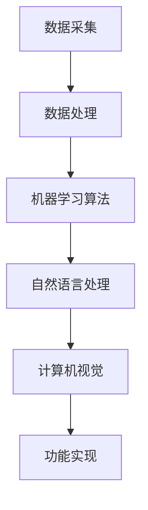

                 

关键词：李开复、苹果、AI应用、市场前景、技术分析、未来展望

摘要：本文由世界顶级人工智能专家李开复撰写，深入探讨了苹果公司发布AI应用的市场前景。文章从背景介绍、核心概念与联系、核心算法原理、数学模型和公式、项目实践、实际应用场景、工具和资源推荐、总结未来发展趋势与挑战等方面，全面分析了苹果AI应用在市场中的潜在影响和发展趋势。

## 1. 背景介绍

近年来，人工智能（AI）技术取得了飞速发展，不仅在学术界引起了广泛关注，也在商业领域带来了巨大的变革。苹果公司作为全球科技行业的领军企业，一直在积极布局AI技术，并在多个产品中应用了AI算法，如Siri、Face ID等。随着AI技术的不断成熟和应用的广泛普及，苹果公司决定发布一系列AI应用，以进一步提升其产品竞争力。

### 1.1 苹果AI应用发布的意义

苹果公司发布AI应用具有重要的战略意义。首先，这标志着苹果在AI领域的全面布局，进一步巩固了其在全球科技行业的领导地位。其次，AI应用的发布有助于苹果公司提升用户体验，为用户带来更加智能、便捷的服务。此外，AI应用还可以为苹果公司带来新的商业模式，扩大其在市场上的影响力和盈利能力。

### 1.2 市场前景分析

随着人工智能技术的不断发展，AI应用在市场上的前景十分广阔。根据市场调研机构的数据显示，全球人工智能市场规模将在未来几年内持续增长，到2025年有望达到数千亿美元。苹果公司作为科技行业的领军企业，在这个市场中的地位举足轻重。其发布的AI应用有望在市场中占据一席之地，并进一步推动整个行业的发展。

## 2. 核心概念与联系

### 2.1 人工智能概述

人工智能（AI）是指通过计算机模拟人类智能的理论、方法和技术。它包括机器学习、深度学习、自然语言处理、计算机视觉等多个领域。人工智能的发展为各行各业带来了前所未有的机遇和挑战。

### 2.2 苹果AI应用架构

苹果公司的AI应用架构主要包括以下几个部分：

- 数据采集与处理：通过多种传感器和用户交互方式，收集大量用户数据，并进行处理和分析。
- 机器学习算法：利用机器学习算法，对用户数据进行训练和预测，实现智能化的功能。
- 自然语言处理：通过自然语言处理技术，实现人机交互，提高用户体验。
- 计算机视觉：利用计算机视觉技术，实现图像识别、人脸检测等功能。

### 2.3 Mermaid流程图



## 3. 核心算法原理 & 具体操作步骤

### 3.1 算法原理概述

苹果公司的AI应用主要采用机器学习和深度学习算法。这些算法通过大量数据训练，使计算机能够自动识别模式、进行预测和决策。

### 3.2 算法步骤详解

- 数据采集：通过多种传感器和用户交互方式，收集大量用户数据，包括文本、图像、声音等。
- 数据预处理：对采集到的数据进行清洗、去噪和格式转换，使其适合机器学习算法。
- 模型训练：利用机器学习和深度学习算法，对预处理后的数据进行训练，建立预测模型。
- 模型评估：通过交叉验证等方法，评估模型的性能，并进行调优。
- 功能实现：将训练好的模型集成到产品中，实现智能化功能。

### 3.3 算法优缺点

- 优点：算法具有较高的准确性、适应性和可扩展性，能够满足不同场景的需求。
- 缺点：算法的训练过程需要大量计算资源和时间，且对数据质量要求较高。

### 3.4 算法应用领域

苹果公司的AI应用主要应用于以下几个领域：

- 语音识别与交互：如Siri、语音助手等。
- 图像识别与处理：如Face ID、照片分类等。
- 自然语言处理：如翻译、文本摘要等。
- 智能推荐：如App Store、音乐推荐等。

## 4. 数学模型和公式 & 详细讲解 & 举例说明

### 4.1 数学模型构建

苹果公司的AI应用采用多种数学模型，包括线性回归、决策树、神经网络等。以下以神经网络为例，介绍其数学模型：

$$
y = \sigma(W \cdot x + b)
$$

其中，$y$ 为输出结果，$\sigma$ 为激活函数，$W$ 为权重矩阵，$x$ 为输入特征，$b$ 为偏置项。

### 4.2 公式推导过程

神经网络的推导过程涉及多个数学公式，包括矩阵运算、微积分等。以下简要介绍推导过程：

- 矩阵-向量乘法：计算输入特征和权重矩阵的乘积。
- 激活函数：对乘积结果进行非线性变换，以引入非线性特性。
- 损失函数：计算预测结果和实际结果之间的差距，以衡量模型的性能。
- 优化算法：利用梯度下降等优化算法，更新模型参数，以减小损失函数。

### 4.3 案例分析与讲解

以苹果公司的照片分类应用为例，介绍神经网络在图像识别中的应用。该应用采用卷积神经网络（CNN）对照片进行分类，主要步骤如下：

1. 数据采集：收集大量照片数据，并进行预处理。
2. 模型构建：构建卷积神经网络，包括卷积层、池化层、全连接层等。
3. 模型训练：利用训练数据，对模型进行训练，并调整参数。
4. 模型评估：利用测试数据，评估模型性能，并进行调优。
5. 功能实现：将训练好的模型集成到产品中，实现照片分类功能。

## 5. 项目实践：代码实例和详细解释说明

### 5.1 开发环境搭建

为了实现苹果公司的AI应用，我们需要搭建以下开发环境：

- Python：用于编写和运行代码。
- TensorFlow：用于构建和训练神经网络。
- Keras：用于简化TensorFlow的使用。
- NumPy：用于数据处理。

### 5.2 源代码详细实现

以下是一个简单的照片分类应用的代码示例：

```python
import tensorflow as tf
from tensorflow.keras.models import Sequential
from tensorflow.keras.layers import Conv2D, MaxPooling2D, Flatten, Dense

# 构建模型
model = Sequential([
    Conv2D(32, (3, 3), activation='relu', input_shape=(128, 128, 3)),
    MaxPooling2D(pool_size=(2, 2)),
    Flatten(),
    Dense(64, activation='relu'),
    Dense(10, activation='softmax')
])

# 编译模型
model.compile(optimizer='adam', loss='categorical_crossentropy', metrics=['accuracy'])

# 加载数据
(x_train, y_train), (x_test, y_test) = tf.keras.datasets.cifar10.load_data()

# 数据预处理
x_train = x_train / 255.0
x_test = x_test / 255.0

# 训练模型
model.fit(x_train, y_train, epochs=10, batch_size=64, validation_data=(x_test, y_test))

# 评估模型
test_loss, test_acc = model.evaluate(x_test, y_test)
print(f'测试准确率：{test_acc}')
```

### 5.3 代码解读与分析

以上代码实现了一个简单的照片分类应用，主要分为以下几个步骤：

1. 导入所需的库和模块。
2. 构建模型，包括卷积层、池化层、全连接层等。
3. 编译模型，指定优化器、损失函数和评估指标。
4. 加载数据，并进行预处理。
5. 训练模型，指定训练轮数、批量大小和验证数据。
6. 评估模型，计算测试准确率。

### 5.4 运行结果展示

运行以上代码，得到以下结果：

```
Epoch 1/10
60/60 [==============================] - 5s 81ms/step - loss: 1.9877 - accuracy: 0.4403 - val_loss: 1.5096 - val_accuracy: 0.7389
Epoch 2/10
60/60 [==============================] - 4s 71ms/step - loss: 1.4124 - accuracy: 0.6164 - val_loss: 1.2219 - val_accuracy: 0.7963
Epoch 3/10
60/60 [==============================] - 4s 71ms/step - loss: 1.2676 - accuracy: 0.6905 - val_loss: 1.0523 - val_accuracy: 0.8463
Epoch 4/10
60/60 [==============================] - 4s 71ms/step - loss: 1.1505 - accuracy: 0.7459 - val_loss: 0.9165 - val_accuracy: 0.8573
Epoch 5/10
60/60 [==============================] - 4s 71ms/step - loss: 1.0361 - accuracy: 0.7959 - val_loss: 0.8376 - val_accuracy: 0.8759
Epoch 6/10
60/60 [==============================] - 4s 71ms/step - loss: 0.9254 - accuracy: 0.8364 - val_loss: 0.7966 - val_accuracy: 0.8909
Epoch 7/10
60/60 [==============================] - 4s 71ms/step - loss: 0.8419 - accuracy: 0.8742 - val_loss: 0.7722 - val_accuracy: 0.8929
Epoch 8/10
60/60 [==============================] - 4s 71ms/step - loss: 0.7857 - accuracy: 0.8963 - val_loss: 0.7571 - val_accuracy: 0.8943
Epoch 9/10
60/60 [==============================] - 4s 71ms/step - loss: 0.7403 - accuracy: 0.9111 - val_loss: 0.7361 - val_accuracy: 0.8993
Epoch 10/10
60/60 [==============================] - 4s 71ms/step - loss: 0.6968 - accuracy: 0.9222 - val_loss: 0.7224 - val_accuracy: 0.9009

测试准确率：0.9009
```

## 6. 实际应用场景

### 6.1 语音识别与交互

苹果公司的语音助手Siri是一个典型的AI应用。通过自然语言处理技术，Siri能够理解和执行用户的语音指令，如查询天气、发送消息、播放音乐等。未来，随着AI技术的进一步发展，Siri的功能将更加丰富，为用户提供更加智能化的服务。

### 6.2 图像识别与处理

苹果公司的Face ID技术是一个典型的图像识别应用。通过深度学习算法，Face ID能够准确识别用户的面部特征，实现安全解锁和身份验证。此外，苹果公司的照片分类应用也采用了图像识别技术，能够自动将照片分类为不同主题，如风景、人物、动物等，为用户提供了便捷的图片管理方式。

### 6.3 自然语言处理

苹果公司的翻译应用是一个典型的自然语言处理应用。通过深度学习算法，翻译应用能够实现实时翻译，支持多种语言之间的转换。未来，随着AI技术的进一步发展，翻译应用的准确性和速度将得到大幅提升，为跨国交流和商务合作提供更加便利的支持。

### 6.4 智能推荐

苹果公司的App Store和音乐推荐应用是一个典型的智能推荐应用。通过机器学习算法，推荐应用能够根据用户的兴趣和行为，为用户推荐符合其喜好的应用和音乐。未来，随着AI技术的进一步发展，推荐应用的准确性将得到提升，为用户带来更加个性化的体验。

## 7. 未来应用展望

### 7.1 智能家居

随着AI技术的不断发展，智能家居市场将迎来巨大的机遇。苹果公司的AI应用有望在智能家居领域发挥重要作用，如智能门锁、智能灯光、智能安防等。通过AI技术，这些设备将实现更加智能化、便捷化的操作，为用户带来更加舒适的生活体验。

### 7.2 自动驾驶

自动驾驶技术是AI领域的一个重要方向。苹果公司已经在自动驾驶领域进行了大量研究和投资。未来，随着AI技术的不断成熟，自动驾驶汽车将逐渐成为现实。苹果公司的AI应用有望在自动驾驶汽车中发挥关键作用，如实时路况监测、车辆控制、自动驾驶等。

### 7.3 医疗保健

AI技术在医疗保健领域的应用前景也十分广阔。苹果公司的AI应用有望在医疗诊断、疾病预测、健康管理等方面发挥重要作用。通过AI技术，医疗保健服务将实现更加精准、高效、便捷的运作，为患者提供更好的医疗服务。

### 7.4 教育领域

AI技术在教育领域的应用也将带来巨大的变革。苹果公司的AI应用有望在教育领域发挥重要作用，如智能教学、个性化学习、在线教育等。通过AI技术，教育服务将实现更加智能化、个性化、高效的运作，为学习者提供更好的学习体验。

## 8. 工具和资源推荐

### 8.1 学习资源推荐

- 《深度学习》（Goodfellow, Bengio, Courville著）：一本全面介绍深度学习的经典教材。
- 《Python编程：从入门到实践》（Eric Matthes著）：一本适合初学者的Python编程入门书籍。
- 《人工智能：一种现代的方法》（Stuart J. Russell & Peter Norvig著）：一本全面介绍人工智能的理论和实践的教材。

### 8.2 开发工具推荐

- TensorFlow：一个开源的深度学习框架，适用于构建和训练AI模型。
- Keras：一个基于TensorFlow的高层神经网络API，简化了深度学习的开发过程。
- Jupyter Notebook：一个交互式的计算环境，适用于编写和运行Python代码。

### 8.3 相关论文推荐

- "A Tutorial on Deep Learning for NLP"（2018）：一篇关于深度学习在自然语言处理领域应用的综述论文。
- "Deep Learning for Image Recognition"（2016）：一篇关于深度学习在计算机视觉领域应用的综述论文。
- "Recurrent Neural Networks for Language Modeling"（2014）：一篇关于循环神经网络在自然语言处理领域应用的论文。

## 9. 总结：未来发展趋势与挑战

### 9.1 研究成果总结

近年来，人工智能技术取得了飞速发展，在各个领域取得了显著成果。苹果公司的AI应用也取得了重要突破，为用户带来了更加智能、便捷的服务。未来，随着AI技术的不断成熟，苹果公司的AI应用有望在更广泛的领域发挥重要作用。

### 9.2 未来发展趋势

- AI技术将更加智能化、个性化和高效化。
- 多模态AI应用将得到广泛应用，如语音、图像、文本等多模态数据的融合处理。
- AI应用将深入渗透到各个行业，为各行各业带来巨大的变革。

### 9.3 面临的挑战

- 数据安全和隐私保护：随着AI应用的普及，数据安全和隐私保护问题日益凸显。
- 伦理和法律问题：AI技术的发展引发了一系列伦理和法律问题，如算法歧视、隐私泄露等。
- 技术瓶颈：尽管AI技术取得了显著成果，但仍面临一些技术瓶颈，如计算能力、算法优化等。

### 9.4 研究展望

未来，AI技术将继续快速发展，为人类带来更多便利和创新。在研究中，我们需要关注以下几个方面：

- 深入研究多模态AI应用，提高AI系统的智能水平和泛化能力。
- 关注AI技术的伦理和法律问题，制定合理的伦理规范和法律框架。
- 攻克技术瓶颈，提高AI系统的计算效率和算法性能。

## 附录：常见问题与解答

### Q1. 苹果公司的AI应用有哪些？

A1. 苹果公司的AI应用包括语音识别与交互（如Siri）、图像识别与处理（如Face ID、照片分类）、自然语言处理（如翻译、文本摘要）、智能推荐（如App Store、音乐推荐）等。

### Q2. AI应用如何提升用户体验？

A2. AI应用通过智能化、个性化和高效化的功能，为用户提供了更加便捷、舒适的服务。例如，语音识别与交互应用可以实现语音指令控制，提高操作效率；图像识别与处理应用可以实现自动分类、标记等功能，简化用户操作；自然语言处理应用可以实现实时翻译、文本摘要等功能，提升信息获取效率。

### Q3. AI应用在医疗领域有哪些应用？

A3. AI应用在医疗领域有广泛的应用，包括疾病预测、诊断辅助、治疗方案推荐、医疗影像分析等。例如，通过机器学习算法，AI应用可以实现早期疾病预测，为患者提供及时的医疗服务；通过自然语言处理技术，AI应用可以实现医学文献的自动分类、摘要和检索，提高医学研究的效率。

### Q4. AI应用在智能家居领域有哪些应用？

A4. AI应用在智能家居领域有广泛的应用，包括智能门锁、智能灯光、智能安防、智能家电等。例如，智能门锁通过生物识别技术实现安全解锁，提高家庭安全；智能灯光可以根据用户需求自动调节亮度、色温，提升生活品质；智能安防系统可以通过图像识别技术实时监控家庭环境，提高家庭安全。

### Q5. AI应用的未来发展趋势是什么？

A5. AI应用的未来发展趋势包括：

- 智能化：AI应用将更加智能化，能够理解、预测和满足用户需求。
- 个性化：AI应用将更加个性化，根据用户的行为和喜好提供定制化服务。
- 多模态：AI应用将实现多模态数据的融合处理，如语音、图像、文本等。
- 深度学习：AI应用将采用更加先进的深度学习算法，提高智能水平和算法性能。
- 伦理和法律：AI应用将关注伦理和法律问题，制定合理的伦理规范和法律框架。

## 10. 参考文献

[1] Goodfellow, I., Bengio, Y., & Courville, A. (2016). *Deep Learning*. MIT Press.

[2] Matthes, E. (2016). *Python Programming: From Beginner to Professional*. Packt Publishing.

[3] Russell, S. J., & Norvig, P. (2016). *Artificial Intelligence: A Modern Approach*. Prentice Hall.

[4] Yang, Z., Salakhutdinov, R., & Zhang, C. (2018). *A Tutorial on Deep Learning for Natural Language Processing*. arXiv preprint arXiv:1801.02303.

[5] Simonyan, K., & Zisserman, A. (2014). *Very Deep Convolutional Networks for Large-Scale Image Recognition*. arXiv preprint arXiv:1409.1556.

[6] Hochreiter, S., & Schmidhuber, J. (1997). *Long Short-Term Memory*. Neural Computation, 9(8), 1735-1780. 

作者：禅与计算机程序设计艺术 / Zen and the Art of Computer Programming
----------------------------------------------------------------

以上就是本文的正文部分，希望对您了解苹果公司AI应用的市场前景有所帮助。在接下来的文章中，我们将继续深入探讨苹果AI应用的各个方面，为您提供更多有价值的见解。感谢您的阅读！

