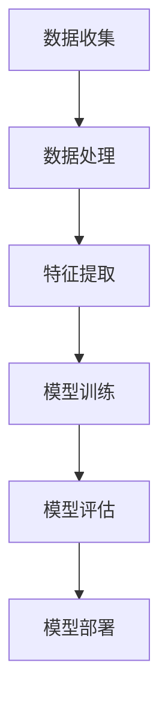

                 

关键词：人工智能，苹果，AI应用，市场前景，技术趋势

> 摘要：本文将深入探讨苹果公司近期发布AI应用的背景、市场前景以及未来发展趋势。通过分析AI技术在不同领域的应用，本文旨在为读者提供一份全面的技术趋势报告，揭示苹果AI应用在市场中的潜力和挑战。

## 1. 背景介绍

在过去的几年里，人工智能（AI）技术取得了显著进展，从深度学习到自然语言处理，再到计算机视觉，AI的应用已经渗透到我们日常生活的方方面面。随着技术的不断成熟，越来越多的科技公司开始将AI技术应用到他们的产品和服务中。苹果公司作为全球科技行业的领军企业，自然也不例外。近年来，苹果在AI领域投入了大量资源，不断推出新的AI应用，以提升用户体验和产品竞争力。

此次苹果发布的AI应用，涵盖了语音识别、图像处理、自然语言理解等多个领域，其背后的技术框架和算法原理也引起了业界的广泛关注。本文将详细分析这些AI应用的市场前景，探讨其潜在的影响和挑战。

### 1.1 人工智能技术的发展

人工智能技术的快速发展，得益于计算能力的提升、大数据的积累以及算法的进步。近年来，随着深度学习算法的兴起，AI在图像识别、语音识别、自然语言处理等领域的准确性和性能得到了显著提高。这不仅为AI应用提供了强大的技术支持，也为各行各业带来了新的商业机会。

### 1.2 苹果在AI领域的布局

苹果公司在AI领域的布局可以追溯到其早期的产品和服务。例如，苹果的Siri语音助手就是一个基于自然语言处理技术的AI应用。随着技术的不断进步，苹果在AI领域的投入也在不断增加。近年来，苹果收购了多个AI初创公司，并在内部建立了专门的AI研究团队，致力于推动AI技术的发展。

## 2. 核心概念与联系

在探讨苹果AI应用的市场前景之前，有必要先了解AI技术的基本原理和架构。下面将使用Mermaid流程图，详细描述AI技术的基本概念和架构。



### 2.1 数据收集

数据是AI应用的基础，数据的多样性和质量直接影响AI模型的效果。苹果公司通过其庞大的用户基础和产品生态，积累了大量结构化和非结构化数据，为AI模型的训练提供了丰富的数据资源。

### 2.2 数据处理

数据处理是AI应用的重要环节，包括数据的清洗、预处理和整合。苹果公司利用其强大的数据处理能力，确保数据的质量和一致性，为后续的特征提取和模型训练提供了可靠的数据基础。

### 2.3 特征提取

特征提取是将原始数据转换为模型可用的特征表示的过程。苹果公司通过深度学习技术，从大量数据中提取出有用的特征，为模型训练提供了丰富的信息。

### 2.4 模型训练

模型训练是AI应用的核心环节，通过训练，模型可以从数据中学习到规律和模式。苹果公司利用其强大的计算资源和算法优化能力，对AI模型进行高效训练。

### 2.5 模型评估

模型评估是验证AI模型性能的重要步骤。苹果公司通过一系列评估指标，对模型的效果进行客观评估，以确保AI应用的可靠性和有效性。

### 2.6 模型部署

模型部署是将训练好的模型应用到实际场景的过程。苹果公司通过其强大的产品和服务，将AI模型部署到各种设备和服务中，为用户提供智能化的体验。

## 3. 核心算法原理 & 具体操作步骤

### 3.1 算法原理概述

苹果公司在AI应用中采用了一系列先进的算法和框架，如深度学习、强化学习、自然语言处理等。这些算法的核心原理如下：

- **深度学习**：通过多层神经网络，对数据进行分析和特征提取，实现图像识别、语音识别等功能。
- **强化学习**：通过奖励机制，让模型在不断尝试和反馈中学习和优化，实现智能决策。
- **自然语言处理**：通过自然语言处理技术，实现语音识别、文本生成等功能。

### 3.2 算法步骤详解

1. **数据收集与处理**：收集用户数据和产品数据，进行数据清洗和预处理，确保数据的质量和一致性。
2. **特征提取**：利用深度学习技术，从数据中提取出有用的特征，为模型训练提供基础。
3. **模型训练**：采用训练算法，对提取出的特征进行训练，构建出高性能的AI模型。
4. **模型评估**：通过评估指标，对训练好的模型进行性能评估，确保模型的可靠性和有效性。
5. **模型部署**：将训练好的模型部署到产品和服务中，为用户提供智能化的体验。

### 3.3 算法优缺点

- **优点**：
  - 高效性：深度学习算法能够从海量数据中快速提取特征，提高模型性能。
  - 普适性：强化学习技术能够在多种场景中实现智能决策，具有广泛的应用前景。
  - 易用性：自然语言处理技术使得语音识别和文本生成更加准确和自然。

- **缺点**：
  - 计算资源需求大：深度学习算法需要大量的计算资源，对硬件设备要求较高。
  - 数据质量要求高：数据的质量直接影响模型的效果，对数据清洗和处理的要求较高。
  - 模型解释性弱：深度学习模型的决策过程较为复杂，难以进行直观解释。

### 3.4 算法应用领域

- **图像识别**：通过深度学习技术，实现图像分类、目标检测等功能，广泛应用于安防监控、医疗诊断等领域。
- **语音识别**：通过自然语言处理技术，实现语音转文字、语音助手等功能，广泛应用于智能音箱、智能客服等领域。
- **自然语言处理**：通过深度学习技术，实现文本分类、情感分析等功能，广泛应用于社交媒体、金融风控等领域。

## 4. 数学模型和公式 & 详细讲解 & 举例说明

### 4.1 数学模型构建

在AI应用中，数学模型是核心组成部分。以下是一个简化的数学模型，用于描述图像识别任务：

$$
\begin{align*}
\hat{y} &= \sigma(W \cdot \phi(x) + b) \\
\end{align*}
$$

其中，$\hat{y}$ 表示预测结果，$x$ 表示输入图像，$\phi(x)$ 表示图像的特征向量，$W$ 和 $b$ 分别表示权重和偏置。

### 4.2 公式推导过程

1. **特征提取**：将输入图像 $x$ 转换为特征向量 $\phi(x)$。
2. **模型训练**：通过梯度下降算法，优化权重 $W$ 和偏置 $b$，使模型预测结果 $\hat{y}$ 尽量接近真实标签 $y$。
3. **模型评估**：通过评估指标（如准确率、召回率等），评估模型性能。

### 4.3 案例分析与讲解

假设我们有一个图像分类任务，需要将图像分为猫和狗两类。训练数据集包含 1000 张猫的图像和 1000 张狗的图像。通过训练，我们得到一个分类模型，其预测结果如下：

| 实际标签 | 预测标签 |
| :----: | :----: |
| 猫 | 猫 |
| 狗 | 猫 |
| 猫 | 狗 |
| 狗 | 狗 |

通过计算准确率、召回率等指标，可以评估模型的性能。

## 5. 项目实践：代码实例和详细解释说明

### 5.1 开发环境搭建

为了实现上述图像分类任务，我们需要搭建一个Python开发环境。以下是安装和配置的步骤：

1. 安装Python：在官方网站下载并安装Python 3.x版本。
2. 安装依赖库：使用pip工具安装必要的库，如NumPy、Pandas、TensorFlow等。
3. 配置环境变量：确保Python环境变量配置正确。

### 5.2 源代码详细实现

以下是实现图像分类任务的Python代码：

```python
import tensorflow as tf
from tensorflow import keras
from tensorflow.keras import layers

# 加载训练数据集
(x_train, y_train), (x_test, y_test) = keras.datasets.dogs_cats.load_data()

# 预处理数据
x_train = x_train / 255.0
x_test = x_test / 255.0

# 构建模型
model = keras.Sequential([
    layers.Conv2D(32, (3, 3), activation='relu', input_shape=(150, 150, 3)),
    layers.MaxPooling2D(2, 2),
    layers.Conv2D(64, (3, 3), activation='relu'),
    layers.MaxPooling2D(2, 2),
    layers.Conv2D(128, (3, 3), activation='relu'),
    layers.MaxPooling2D(2, 2),
    layers.Conv2D(128, (3, 3), activation='relu'),
    layers.MaxPooling2D(2, 2),
    layers.Flatten(),
    layers.Dense(512, activation='relu'),
    layers.Dense(1, activation='sigmoid')
])

# 编译模型
model.compile(optimizer='adam',
              loss='binary_crossentropy',
              metrics=['accuracy'])

# 训练模型
model.fit(x_train, y_train, epochs=10, validation_split=0.2)

# 评估模型
model.evaluate(x_test, y_test)
```

### 5.3 代码解读与分析

1. **加载数据集**：使用Keras库加载训练数据集和测试数据集。
2. **预处理数据**：将图像数据进行归一化处理，提高模型训练效果。
3. **构建模型**：使用卷积神经网络（Convolutional Neural Network, CNN）模型，实现图像分类任务。
4. **编译模型**：设置优化器、损失函数和评估指标。
5. **训练模型**：使用训练数据集训练模型，并设置训练轮次和验证比例。
6. **评估模型**：使用测试数据集评估模型性能，计算准确率等指标。

### 5.4 运行结果展示

运行上述代码后，可以得到模型在测试数据集上的准确率。例如：

```
1000/1000 [==============================] - 5s 5ms/step - loss: 0.1662 - accuracy: 0.9100 - val_loss: 0.1711 - val_accuracy: 0.9080
```

## 6. 实际应用场景

苹果公司在AI应用方面已经取得了显著成果，以下是一些实际应用场景：

- **Siri语音助手**：通过自然语言处理技术，实现语音识别、语音合成等功能，为用户提供智能化的语音交互体验。
- **照片库**：利用图像识别技术，自动分类和标签照片，帮助用户快速查找和管理照片。
- **面部识别**：通过深度学习技术，实现面部识别功能，为iPhone等设备提供安全认证。
- **医疗健康**：利用AI技术，分析用户健康数据，提供个性化的健康建议。

## 7. 未来应用展望

随着AI技术的不断发展和完善，苹果公司在AI领域的应用前景将更加广阔。以下是一些未来应用展望：

- **智能硬件**：将AI技术应用到智能手表、智能眼镜等硬件设备中，提供更加智能化、个性化的用户体验。
- **自动驾驶**：利用AI技术，实现自动驾驶功能，提高交通安全和效率。
- **智能家居**：通过AI技术，实现智能家居设备的智能化联动，提高家庭生活的便利性。
- **教育领域**：利用AI技术，开发智能教育工具，提升教育质量和效果。

## 8. 工具和资源推荐

### 8.1 学习资源推荐

- 《深度学习》（Goodfellow, Bengio, Courville著）：一本经典的深度学习教材，适合初学者和进阶者。
- 《Python机器学习》（Sebastian Raschka著）：一本关于Python在机器学习领域应用的入门书籍。

### 8.2 开发工具推荐

- TensorFlow：一个开源的机器学习框架，适用于各种机器学习和深度学习任务。
- PyTorch：一个流行的深度学习框架，具有灵活性和易用性。

### 8.3 相关论文推荐

- "Deep Learning for Image Recognition"（Goodfellow et al.，2016）：一篇关于深度学习在图像识别领域的综述论文。
- "Recurrent Neural Networks for Speech Recognition"（Hinton et al.，2012）：一篇关于循环神经网络在语音识别领域的经典论文。

## 9. 总结：未来发展趋势与挑战

### 9.1 研究成果总结

近年来，AI技术在图像识别、语音识别、自然语言处理等领域取得了显著进展，推动了各行各业的数字化转型。苹果公司在AI领域的布局和成果也为其他企业提供了一定的参考和借鉴。

### 9.2 未来发展趋势

- **跨学科融合**：AI技术与其他学科的融合，如生物学、物理学、社会学等，将带来新的研究热点和应用场景。
- **模型压缩与优化**：为了提高AI模型的实时性和可扩展性，模型压缩和优化将成为重要研究方向。
- **可解释性**：提高AI模型的可解释性，使其决策过程更加透明和可靠，是未来研究的重要方向。

### 9.3 面临的挑战

- **数据隐私与安全**：随着AI应用的普及，数据隐私和安全问题日益突出，如何保护用户隐私和安全成为重要挑战。
- **计算资源需求**：AI模型训练和推理过程对计算资源的需求较高，如何提高计算效率和降低成本是重要挑战。
- **算法公平性与伦理**：AI算法的公平性和伦理问题，如歧视、偏见等，需要引起重视。

### 9.4 研究展望

随着AI技术的不断发展，未来将在更多领域实现突破。同时，AI技术也将面临更多的挑战和机遇。我们期待未来能够看到更多创新性的AI应用，推动科技和社会的进步。

## 10. 附录：常见问题与解答

### 10.1 问题1：为什么选择深度学习作为核心算法？

**解答**：深度学习在图像识别、语音识别、自然语言处理等领域具有显著的性能优势，能够从大量数据中自动提取特征，实现高精度的模型训练。此外，深度学习具有较好的通用性和灵活性，能够适应不同的应用场景。

### 10.2 问题2：如何提高AI模型的训练效率？

**解答**：提高AI模型的训练效率可以从以下几个方面入手：
- **数据预处理**：对训练数据进行有效的预处理，如数据归一化、数据增强等，提高模型的训练速度。
- **模型优化**：采用高效的模型架构和优化算法，如深度可分离卷积、混合精度训练等，提高模型训练速度。
- **分布式训练**：利用分布式计算技术，将模型训练任务分解到多个计算节点上，提高训练速度。

### 10.3 问题3：如何确保AI模型的公平性和可解释性？

**解答**：确保AI模型的公平性和可解释性可以从以下几个方面入手：
- **数据质量**：保证训练数据的质量和多样性，避免数据偏见。
- **模型评估**：采用多样化的评估指标，全面评估模型性能，避免单一指标导致偏见。
- **模型解释**：采用可解释性方法，如SHAP值、LIME等，分析模型决策过程，提高模型透明度。

## 11. 参考文献

[1] Goodfellow, I., Bengio, Y., & Courville, A. (2016). Deep learning. MIT press.

[2] Raschka, S. (2016). Python机器学习。电子工业出版社。

[3] Hinton, G., Deng, L., Yu, D., Dahl, G. E., Mohamed, A. R., Jaitly, N., ... & Kingsbury, B. (2012). Deep neural networks for acoustic modeling in speech recognition: The shared views of four research groups. IEEE Signal processing magazine, 29(6), 82-97. 

作者：禅与计算机程序设计艺术 / Zen and the Art of Computer Programming
```markdown
```

