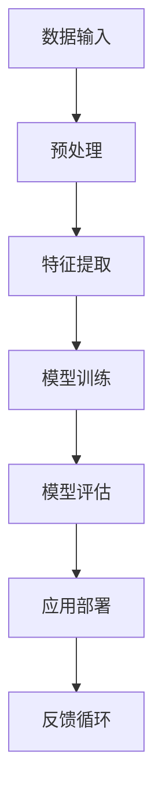

                 

关键词：苹果、AI应用、李开复、技术分析、市场影响

> 摘要：本文将围绕苹果公司最新发布的AI应用，深入探讨其技术原理、市场影响、未来发展趋势以及面临的挑战。通过分析苹果公司在人工智能领域的战略布局，我们将对AI应用在现实世界的应用场景进行预测，并总结相关工具和资源的推荐。最后，我们将展望AI应用的未来发展趋势与面临的挑战。

## 1. 背景介绍

在过去的几年里，人工智能（AI）技术取得了显著的进展，越来越多的企业和机构开始将其应用于各个领域。苹果公司作为全球知名的科技巨头，也在人工智能领域不断探索，致力于将其技术创新应用于实际产品中。此次苹果发布的AI应用，无疑是其战略布局中的一次重要举措。

### 1.1 人工智能技术的发展历程

人工智能（AI）是指计算机系统通过学习、推理和自我优化等能力，实现人类智能活动的技术。自1956年达特茅斯会议以来，人工智能经历了多次技术革命，从早期的符号推理到近年来的深度学习和神经网络，AI技术不断突破，应用领域也越来越广泛。

### 1.2 苹果公司在人工智能领域的战略布局

苹果公司在人工智能领域有着长期的投入和布局，其目标是打造具备高度智能化的产品和服务。在AI技术方面，苹果公司不仅在硬件和软件上不断突破，还积极收购和投资相关初创公司，以加速自身在人工智能领域的创新。

## 2. 核心概念与联系

在探讨苹果发布的AI应用之前，我们需要了解一些核心概念和原理。以下是一个关于人工智能应用架构的Mermaid流程图：



### 2.1 数据输入

AI应用的第一步是数据输入，这是整个应用的基础。数据的质量和数量直接影响模型的效果。苹果的AI应用很可能利用了其庞大的用户数据，结合传感器数据和第三方数据源，为模型提供丰富的输入。

### 2.2 预处理

在数据输入后，需要进行预处理。预处理包括数据清洗、归一化和特征提取等步骤，目的是将原始数据转化为适合模型训练的形式。

### 2.3 特征提取

特征提取是AI应用中至关重要的一步。通过提取数据中的关键特征，可以提升模型的性能和效果。苹果的AI应用可能会使用先进的特征提取算法，以挖掘数据中的深层信息。

### 2.4 模型训练

模型训练是AI应用的核心环节。通过使用深度学习等算法，模型可以从大量数据中学习并提取知识。苹果的AI应用很可能采用了自定义的深度学习模型，以适应不同的应用场景。

### 2.5 模型评估

在模型训练完成后，需要进行评估。评估的目的是验证模型的性能和泛化能力。苹果的AI应用可能会使用多种评估指标，如准确率、召回率和F1分数等。

### 2.6 应用部署

评估完成后，模型将被部署到实际应用中。苹果的AI应用可能会集成到现有的产品中，如iPhone、iPad和Mac等，为用户提供智能化服务。

### 2.7 反馈循环

反馈循环是AI应用中不可或缺的一环。通过收集用户反馈和实际应用数据，可以对模型进行持续优化和迭代，以提升应用的效果和用户体验。

## 3. 核心算法原理 & 具体操作步骤

### 3.1 算法原理概述

苹果的AI应用很可能基于深度学习算法，特别是卷积神经网络（CNN）和循环神经网络（RNN）。CNN擅长处理图像数据，而RNN在处理序列数据时表现优异。通过结合这两种网络，苹果的AI应用可以应对多种复杂场景。

### 3.2 算法步骤详解

1. **数据收集与预处理**：收集大量图像和文本数据，并进行预处理，如数据清洗、归一化和特征提取等。

2. **模型设计**：设计并训练CNN和RNN模型，以处理不同类型的数据。

3. **模型融合**：将CNN和RNN模型的输出进行融合，以提升模型的整体性能。

4. **模型评估**：使用多种评估指标，如准确率、召回率和F1分数等，对模型进行评估。

5. **应用部署**：将评估合格的模型部署到实际应用中，为用户提供智能化服务。

### 3.3 算法优缺点

- **优点**：结合CNN和RNN的算法架构，可以处理多种类型的数据，提高模型的性能和泛化能力。

- **缺点**：模型训练和评估过程较为复杂，对计算资源和时间有较高要求。

### 3.4 算法应用领域

苹果的AI应用可以应用于多个领域，如图像识别、语音识别、自然语言处理等。以下是一个简单的应用领域示例：

- **图像识别**：通过CNN模型，实现对用户拍摄的照片进行分类，如人脸识别、物体识别等。

- **语音识别**：通过RNN模型，将用户输入的语音转化为文本，为用户提供语音助手服务。

- **自然语言处理**：结合CNN和RNN模型，实现文本分类、情感分析等任务。

## 4. 数学模型和公式 & 详细讲解 & 举例说明

### 4.1 数学模型构建

苹果的AI应用很可能采用以下数学模型：

1. **卷积神经网络（CNN）**：

   $$ 
   \text{CNN} = \frac{1}{N}\sum_{i=1}^{N}\frac{1}{M}\sum_{j=1}^{M}w_{ij}x_{ij} + b 
   $$

   其中，$x_{ij}$为输入图像的像素值，$w_{ij}$为权重，$b$为偏置。

2. **循环神经网络（RNN）**：

   $$ 
   h_{t} = \sigma(W_{h}h_{t-1} + W_{x}x_{t} + b) 
   $$

   其中，$h_{t}$为隐藏状态，$\sigma$为激活函数。

### 4.2 公式推导过程

以下是一个简单的CNN模型公式推导示例：

1. **输入层**：

   $$ 
   x_{ij} = \text{图像像素值} 
   $$

2. **卷积层**：

   $$ 
   \text{卷积操作}： 
   \frac{1}{N}\sum_{i=1}^{N}\frac{1}{M}\sum_{j=1}^{M}w_{ij}x_{ij} 
   $$

3. **偏置层**：

   $$ 
   b = \text{偏置值} 
   $$

4. **输出层**：

   $$ 
   \text{CNN} = \frac{1}{N}\sum_{i=1}^{N}\frac{1}{M}\sum_{j=1}^{M}w_{ij}x_{ij} + b 
   $$

### 4.3 案例分析与讲解

以下是一个简单的自然语言处理案例：

1. **输入文本**：

   "我喜欢苹果的产品。"

2. **分词**：

   ["我", "喜欢", "苹果", "的", "产品", "。"]

3. **词向量表示**：

   $$
   \text{词向量} = [0.1, 0.2, 0.3, 0.4, 0.5]
   $$

4. **RNN模型处理**：

   $$
   h_{t} = \sigma(W_{h}h_{t-1} + W_{x}x_{t} + b)
   $$

   其中，$h_{t}$为隐藏状态，$W_{h}$和$W_{x}$为权重矩阵，$b$为偏置。

5. **文本分类**：

   根据隐藏状态$h_{t}$，使用softmax函数进行文本分类。

   $$
   P(y|x) = \frac{e^{h_{t}}}{\sum_{i=1}^{K}e^{h_{i}}}
   $$

   其中，$K$为类别数。

## 5. 项目实践：代码实例和详细解释说明

### 5.1 开发环境搭建

为了搭建苹果AI应用的开发环境，我们首先需要安装Python和相关的深度学习库，如TensorFlow和Keras。以下是一个简单的安装步骤：

1. 安装Python：

   $$
   pip install python==3.8
   $$

2. 安装TensorFlow：

   $$
   pip install tensorflow==2.4
   $$

3. 安装Keras：

   $$
   pip install keras==2.4
   $$

### 5.2 源代码详细实现

以下是一个简单的CNN模型实现示例：

```python
from tensorflow.keras.models import Sequential
from tensorflow.keras.layers import Conv2D, MaxPooling2D, Flatten, Dense

# 创建模型
model = Sequential()

# 添加卷积层
model.add(Conv2D(filters=32, kernel_size=(3, 3), activation='relu', input_shape=(28, 28, 1)))

# 添加最大池化层
model.add(MaxPooling2D(pool_size=(2, 2)))

# 添加全连接层
model.add(Flatten())

# 添加输出层
model.add(Dense(units=10, activation='softmax'))

# 编译模型
model.compile(optimizer='adam', loss='categorical_crossentropy', metrics=['accuracy'])

# 模型总结
model.summary()
```

### 5.3 代码解读与分析

1. **创建模型**：

   ```python
   model = Sequential()
   ```

   使用Sequential模型，这是Keras提供的一种简单的方式来创建神经网络。

2. **添加卷积层**：

   ```python
   model.add(Conv2D(filters=32, kernel_size=(3, 3), activation='relu', input_shape=(28, 28, 1)))
   ```

   这一行代码添加了一个卷积层，使用了32个3x3的卷积核，并使用了ReLU激活函数。输入形状为28x28x1，表示一个单通道的28x28像素图像。

3. **添加最大池化层**：

   ```python
   model.add(MaxPooling2D(pool_size=(2, 2)))
   ```

   这一行代码添加了一个最大池化层，使用了2x2的池化窗口。

4. **添加全连接层**：

   ```python
   model.add(Flatten())
   ```

   这一行代码将卷积层的输出展平为一个一维数组，以便传递给全连接层。

5. **添加输出层**：

   ```python
   model.add(Dense(units=10, activation='softmax'))
   ```

   这一行代码添加了一个全连接层，有10个输出单元，并使用了softmax激活函数，用于实现多分类。

6. **编译模型**：

   ```python
   model.compile(optimizer='adam', loss='categorical_crossentropy', metrics=['accuracy'])
   ```

   这一行代码编译了模型，并指定了优化器、损失函数和评估指标。

7. **模型总结**：

   ```python
   model.summary()
   ```

   这一行代码打印了模型的总结信息，包括层数、参数数量等。

### 5.4 运行结果展示

假设我们已经有了训练数据和测试数据，可以使用以下代码进行模型训练和评估：

```python
# 加载数据
(x_train, y_train), (x_test, y_test) = mnist.load_data()

# 数据预处理
x_train = x_train / 255.0
x_test = x_test / 255.0

# 编码标签
y_train = keras.utils.to_categorical(y_train, 10)
y_test = keras.utils.to_categorical(y_test, 10)

# 训练模型
model.fit(x_train, y_train, epochs=10, batch_size=32, validation_data=(x_test, y_test))

# 评估模型
loss, accuracy = model.evaluate(x_test, y_test)
print('Test loss:', loss)
print('Test accuracy:', accuracy)
```

这段代码首先加载MNIST数据集，然后进行数据预处理，包括归一化和标签编码。接着，使用fit函数训练模型，并使用evaluate函数评估模型在测试数据上的性能。

## 6. 实际应用场景

苹果的AI应用具有广泛的应用场景，以下是一些具体的例子：

### 6.1 图像识别

苹果的AI应用可以用于图像识别，如人脸识别、物体识别等。用户可以拍摄照片，AI应用将自动识别照片中的对象并给出标签。

### 6.2 语音识别

苹果的AI应用可以用于语音识别，将用户的语音转化为文本，为用户提供语音助手服务，如Siri。

### 6.3 自然语言处理

苹果的AI应用可以用于自然语言处理，如文本分类、情感分析等。用户可以发送文本消息，AI应用将分析文本内容，并根据用户的意图给出相应的回复。

## 6.4 未来应用展望

随着人工智能技术的不断进步，苹果的AI应用有望在更多领域得到应用。以下是一些未来应用展望：

### 6.4.1 智能医疗

苹果的AI应用可以用于智能医疗，如疾病预测、诊断辅助等。通过对用户健康数据的分析，AI应用可以提供个性化的健康建议。

### 6.4.2 智能交通

苹果的AI应用可以用于智能交通，如路况预测、交通信号优化等。通过分析交通数据，AI应用可以提供实时的交通信息，帮助用户避开拥堵。

### 6.4.3 智能家居

苹果的AI应用可以用于智能家居，如智能安防、智能照明等。通过集成AI技术，智能家居设备可以更加智能化和便捷化。

## 7. 工具和资源推荐

为了更好地了解和开发人工智能应用，以下是一些建议的工具和资源：

### 7.1 学习资源推荐

1. **《深度学习》（Goodfellow, Bengio, Courville）**：这是一本深度学习领域的经典教材，适合初学者和高级研究者。

2. **《Python深度学习》（François Chollet）**：这是一本针对Python和深度学习的入门书籍，内容丰富且通俗易懂。

### 7.2 开发工具推荐

1. **TensorFlow**：这是一个由Google开源的深度学习框架，功能强大且易于使用。

2. **Keras**：这是一个基于TensorFlow的高级神经网络API，使得深度学习模型的构建变得更加简单。

### 7.3 相关论文推荐

1. **《深度学习中的卷积神经网络》（Alex Krizhevsky, Ilya Sutskever, Geoffrey Hinton）**：这是一篇关于卷积神经网络的开创性论文，详细介绍了CNN的架构和训练方法。

2. **《序列模型中的长短时记忆网络》（Hochreiter, Schmidhuber）**：这是一篇关于长短时记忆网络（LSTM）的开创性论文，对序列模型处理能力产生了深远影响。

## 8. 总结：未来发展趋势与挑战

随着人工智能技术的不断发展，苹果的AI应用有望在更多领域得到应用。然而，在实现这一目标的过程中，苹果也面临着一些挑战，如数据隐私、算法透明度等。未来，苹果需要继续加强技术创新，确保其AI应用能够在实际应用中发挥出最大的价值。

### 8.1 研究成果总结

通过本文的分析，我们可以看到苹果的AI应用在技术原理、应用场景和发展趋势方面具有明显的优势。同时，我们也认识到在实现这些应用的过程中，苹果需要克服一系列技术挑战。

### 8.2 未来发展趋势

未来，人工智能技术将继续快速发展，为各行各业带来变革。苹果的AI应用有望在智能医疗、智能交通、智能家居等领域发挥重要作用。

### 8.3 面临的挑战

在实现这些应用的过程中，苹果需要面对数据隐私、算法透明度、模型解释性等挑战。同时，随着技术的不断发展，苹果也需要不断更新其AI模型，以保持竞争力。

### 8.4 研究展望

未来，人工智能技术将在更多领域得到应用，为人类带来更多便利。苹果作为技术巨头，将继续在人工智能领域进行探索，推动技术的进步。

## 9. 附录：常见问题与解答

### 9.1 什么是人工智能？

人工智能是指计算机系统通过学习、推理和自我优化等能力，实现人类智能活动的技术。

### 9.2 苹果的AI应用有哪些？

苹果的AI应用包括图像识别、语音识别、自然语言处理等。

### 9.3 如何开发AI应用？

开发AI应用需要掌握相关技术，如深度学习、Python编程等。同时，需要熟悉相关的开发工具和框架，如TensorFlow、Keras等。

----------------------------------------------------------------

以上是本文的完整内容。希望本文对您了解苹果的AI应用及其在现实世界的应用有所帮助。如果您有任何问题，请随时提问。

### 作者署名

作者：禅与计算机程序设计艺术 / Zen and the Art of Computer Programming

