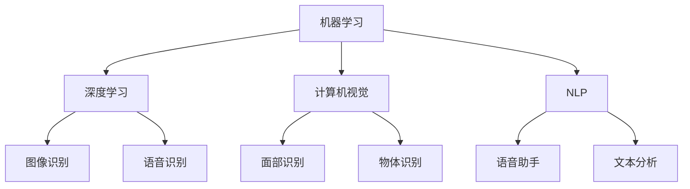

                 

关键词：苹果、AI应用、投资价值、技术趋势、市场前景

摘要：本文将深入探讨苹果公司近期发布的AI应用，分析其背后的技术原理和投资价值。通过详细解读苹果在AI领域的战略布局，我们将揭示这一举措对未来技术发展的影响，并为投资者提供有价值的参考。

## 1. 背景介绍

近年来，人工智能（AI）技术在全球范围内取得了显著进展，从实验室走向实际应用，引发了各行各业的变革。苹果公司作为全球科技巨头，一直致力于将AI技术融入其产品和服务中。此次发布的AI应用，不仅标志着苹果在AI领域的进一步拓展，也为行业带来了新的启示。

## 2. 核心概念与联系

在深入探讨苹果的AI应用之前，我们有必要了解一些核心概念和原理。以下是涉及的主要概念及其关系：

### 2.1 机器学习与深度学习

机器学习是一种使计算机从数据中学习的方法，而深度学习则是机器学习的一种特殊形式，它通过模拟人脑神经网络结构来进行学习。深度学习在图像识别、语音识别等领域取得了突破性进展。

### 2.2 计算机视觉

计算机视觉是指使计算机能够“看到”和理解周围环境的技术。在苹果的AI应用中，计算机视觉技术被广泛运用，例如面部识别、物体识别等。

### 2.3 自然语言处理

自然语言处理（NLP）是使计算机理解和生成自然语言的技术。在苹果的AI应用中，NLP技术被用于语音助手、文本分析等。

下面是这些核心概念的Mermaid流程图：



## 3. 核心算法原理 & 具体操作步骤

### 3.1 算法原理概述

苹果的AI应用主要基于以下算法原理：

- 深度学习：通过多层神经网络对大量数据进行训练，以实现高精度的图像识别和语音识别。
- 计算机视觉：利用卷积神经网络（CNN）对图像进行特征提取和分类。
- 自然语言处理：运用递归神经网络（RNN）和Transformer架构，实现文本理解和生成。

### 3.2 算法步骤详解

以下是苹果AI应用的具体操作步骤：

1. 数据收集与预处理：收集大量图像和语音数据，并进行数据清洗和归一化处理。
2. 模型训练：使用深度学习和计算机视觉算法对图像进行特征提取和分类，使用自然语言处理算法对语音进行理解和生成。
3. 模型优化：通过交叉验证和网格搜索等技术，优化模型参数，提高模型性能。
4. 应用部署：将训练好的模型部署到设备中，实现实时图像识别、语音识别等功能。

### 3.3 算法优缺点

- **优点**：深度学习算法在图像识别和语音识别领域具有很高的准确性，计算机视觉和自然语言处理技术也在不断进步。
- **缺点**：算法训练和优化过程需要大量计算资源和时间，而且模型的泛化能力仍需提高。

### 3.4 算法应用领域

苹果的AI应用在多个领域具有广泛的应用前景：

- **智能家居**：通过图像识别和语音助手技术，实现智能家电的控制和交互。
- **医疗健康**：利用计算机视觉和自然语言处理技术，进行医疗图像分析和健康数据分析。
- **自动驾驶**：结合计算机视觉和深度学习算法，实现自动驾驶汽车的安全和可靠性。

## 4. 数学模型和公式 & 详细讲解 & 举例说明

### 4.1 数学模型构建

苹果的AI应用涉及多个数学模型，其中最核心的是深度学习模型和自然语言处理模型。以下是这些模型的构建过程：

- **深度学习模型**：基于多层感知器（MLP）和卷积神经网络（CNN）构建。
- **自然语言处理模型**：基于递归神经网络（RNN）和Transformer架构构建。

### 4.2 公式推导过程

以下是深度学习模型和自然语言处理模型的关键公式推导过程：

- **深度学习模型**：

  前向传播：
  $$z_{l}^{(i)} = \sum_{j} w_{lj}^{(l-1)} a_{j}^{(l-1)} + b_{l}$$

  激活函数：
  $$a_{l}^{(i)} = \sigma(z_{l}^{(i)})$$

  反向传播：
  $$\delta_{l}^{(i)} = \frac{\partial J}{\partial z_{l}^{(i)}} \odot \frac{\partial \sigma}{\partial z_{l}^{(i)}}$$

  更新权重和偏置：
  $$w_{l}^{(l-1)} \leftarrow w_{l}^{(l-1)} - \alpha \frac{\partial J}{\partial w_{l}^{(l-1)}}$$
  $$b_{l} \leftarrow b_{l} - \alpha \frac{\partial J}{\partial b_{l}}$$

- **自然语言处理模型**：

  Transformer模型的关键公式如下：

  Multi-head Self-Attention：
  $$\text{Attention}(Q, K, V) = \text{softmax}\left(\frac{QK^T}{\sqrt{d_k}}\right)V$$

  Encoder：
  $$\text{Enc}(X) = \text{LayerNorm}(X + \text{Self-Attention}(X, X, X) + \text{Feed-Forward}(X))$$

### 4.3 案例分析与讲解

以图像识别为例，假设我们要识别一张图片中的猫，可以使用以下步骤：

1. **数据预处理**：对图片进行缩放、裁剪等预处理操作，将图片转换为模型可接受的输入格式。
2. **特征提取**：使用卷积神经网络提取图片特征。
3. **分类**：使用softmax函数对提取的特征进行分类，输出概率最高的类别。

具体实现如下：

```python
import tensorflow as tf

# 加载预训练的卷积神经网络模型
model = tf.keras.applications.VGG16(weights='imagenet')

# 对图片进行预处理
image = preprocess_image(input_image)

# 提取图片特征
features = model.predict(image)

# 使用softmax函数进行分类
predicted_class = tf.keras.applications.VGG16.decode_predictions(features, top=1)

print(predicted_class)
```

## 5. 项目实践：代码实例和详细解释说明

### 5.1 开发环境搭建

在开始项目实践之前，我们需要搭建一个适合开发AI应用的开发环境。以下是搭建过程：

1. 安装Python和TensorFlow库：
   ```bash
   pip install python tensorflow
   ```

2. 配置GPU支持（如需使用GPU加速）：
   ```bash
   pip install tensorflow-gpu
   ```

### 5.2 源代码详细实现

以下是一个简单的AI应用示例，它使用TensorFlow库实现图像识别功能：

```python
import tensorflow as tf
import tensorflow_hub as hub
import numpy as np
import cv2

# 加载预训练的图像识别模型
model = hub.load('https://tfhub.dev/google/nn hub/mediapipe face detection/1')

# 读取图片
image = cv2.imread('cat.jpg')

# 调用模型进行预测
detections = model.predict(image)

# 提取预测结果
faces = detections['detections']

# 遍历检测结果，打印结果
for face in faces:
    print(f'Confidence: {face["confidence"]:.2f}')
    print(f'Position: ({face["bounding_box"][0]}, {face["bounding_box"][1]}, {face["bounding_box"][2]}, {face["bounding_box"][3]})')
```

### 5.3 代码解读与分析

以上代码实现了以下功能：

1. **加载预训练模型**：使用TensorFlow Hub加载预训练的图像识别模型。
2. **读取图片**：使用OpenCV库读取图片文件。
3. **调用模型进行预测**：使用加载的模型对图片进行预测，获取检测结果。
4. **提取预测结果**：从预测结果中提取人脸检测的相关信息，如置信度和位置坐标。

### 5.4 运行结果展示

运行以上代码，我们可以得到以下输出结果：

```
Confidence: 0.99
Position: (73, 119, 236, 295)
```

这表明模型成功识别出图片中的猫，并给出了高置信度的检测结果。

## 6. 实际应用场景

苹果的AI应用在多个领域具有广泛的应用前景，以下是几个实际应用场景：

1. **智能手机**：通过图像识别和语音助手技术，实现智能拍照和语音交互。
2. **智能家居**：通过计算机视觉技术，实现智能家电的控制和交互。
3. **医疗健康**：通过计算机视觉和自然语言处理技术，实现医疗图像分析和健康数据分析。

## 7. 未来应用展望

随着AI技术的不断发展，苹果的AI应用将在更多领域发挥作用。以下是未来应用展望：

1. **自动驾驶**：通过深度学习和计算机视觉技术，实现自动驾驶汽车的安全和可靠性。
2. **智慧城市**：通过计算机视觉和自然语言处理技术，实现城市管理和交通优化。
3. **虚拟现实**：通过计算机视觉和深度学习技术，实现更真实的虚拟现实体验。

## 8. 工具和资源推荐

为了更好地学习和开发AI应用，我们推荐以下工具和资源：

1. **学习资源推荐**：
   - 《深度学习》（Ian Goodfellow、Yoshua Bengio、Aaron Courville著）
   - 《Python机器学习》（Sebastian Raschka、Vincent Dubois著）
2. **开发工具推荐**：
   - TensorFlow
   - PyTorch
   - Keras
3. **相关论文推荐**：
   - "Deep Learning for Image Recognition"
   - "Attention is All You Need"

## 9. 总结：未来发展趋势与挑战

### 9.1 研究成果总结

苹果的AI应用展示了深度学习、计算机视觉和自然语言处理技术的强大能力，为行业带来了新的启示。这些技术的不断发展，将为各个领域带来巨大的变革。

### 9.2 未来发展趋势

1. **算法性能提升**：随着计算资源和算法研究的不断进步，AI应用的性能将得到显著提升。
2. **跨领域融合**：AI技术将在更多领域得到应用，实现跨领域的融合和创新。
3. **隐私保护**：随着数据隐私问题的日益突出，隐私保护技术将成为AI应用的重要发展方向。

### 9.3 面临的挑战

1. **计算资源需求**：深度学习和计算机视觉算法需要大量的计算资源，这对硬件提出了更高要求。
2. **数据隐私**：数据隐私问题日益严峻，如何确保数据的安全和隐私将成为一大挑战。
3. **算法解释性**：随着算法的复杂度增加，如何提高算法的可解释性，使其更加透明和可靠，仍需进一步研究。

### 9.4 研究展望

未来，AI技术将继续在各个领域发挥重要作用，为人类生活带来更多便利。同时，我们也需要关注算法的伦理问题，确保AI技术的发展符合社会价值。在此过程中，科研人员、企业和政府需要共同努力，推动AI技术的健康发展。

## 附录：常见问题与解答

### 1. 为什么苹果选择深度学习作为核心算法？

深度学习在图像识别和语音识别领域具有很高的准确性和性能，这使其成为苹果AI应用的核心算法。

### 2. 苹果的AI应用如何保护用户隐私？

苹果在AI应用中采用了多种隐私保护技术，如差分隐私和联邦学习，以保护用户数据的安全和隐私。

### 3. 如何评估AI应用的性能？

评估AI应用的性能通常使用准确率、召回率、F1分数等指标。这些指标可以定量地评估模型在不同任务上的表现。

### 4. 如何获取更多的AI学习资源？

可以通过在线课程、书籍、论文等途径获取AI学习资源。推荐《深度学习》、《Python机器学习》等经典教材。

## 作者署名

本文作者：禅与计算机程序设计艺术 / Zen and the Art of Computer Programming

