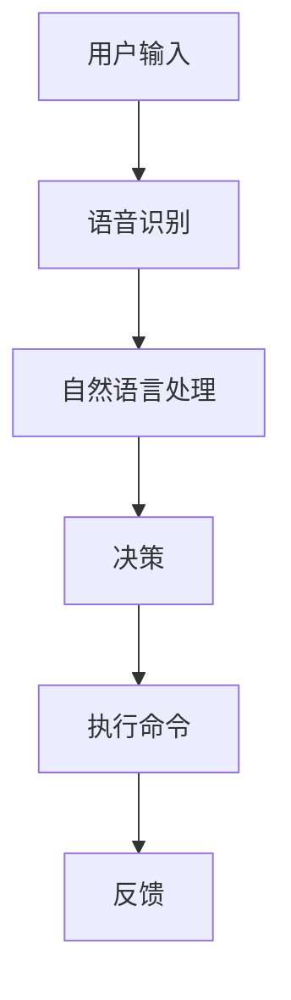

                 

关键词：李开复，苹果，AI应用，投资价值，技术分析，市场趋势，未来展望。

> 摘要：本文将深入分析苹果发布AI应用的投资价值，探讨其技术亮点、市场趋势以及未来展望，为投资者提供有针对性的投资建议。

## 1. 背景介绍

随着人工智能技术的不断发展，AI在各个领域的应用日益广泛。苹果公司作为全球科技巨头，近年来也在积极布局AI领域。苹果于2023年发布了多款搭载AI技术的应用，引起了市场的广泛关注。本文将围绕苹果发布的AI应用，探讨其投资价值。

### 1.1 AI技术发展现状

AI技术已经从实验室走向了现实，成为推动各行各业创新的重要力量。从自动驾驶、医疗健康到金融科技，AI的应用场景越来越丰富。根据市场研究机构IDC的数据，全球AI市场预计将在2025年达到1万亿美元规模，展现出巨大的增长潜力。

### 1.2 苹果公司AI战略

苹果公司一直以来重视技术创新，AI是其重要的战略方向之一。苹果通过自主研发和收购，不断加强在AI领域的实力。近年来，苹果在语音识别、图像处理、自然语言处理等方面取得了显著进展，为AI应用的发展提供了强大的技术支撑。

## 2. 核心概念与联系

在分析苹果发布的AI应用之前，我们先来梳理一下与AI相关的核心概念和技术架构。

### 2.1 人工智能概述

人工智能（Artificial Intelligence，AI）是指通过计算机程序实现的智能行为。AI可以分为弱AI和强AI。弱AI专注于特定领域的智能，如语音识别、图像识别等；强AI则具备人类所有的智能，包括推理、自我意识等。

### 2.2 AI应用场景

AI应用场景广泛，包括但不限于以下几个方面：

- **语音识别**：通过语音信号识别用户的语音命令，实现人机交互。
- **图像识别**：通过图像处理技术识别图像中的物体、场景等。
- **自然语言处理**：理解和生成人类语言，实现智能对话、机器翻译等。
- **自动驾驶**：通过传感器、摄像头等技术实现汽车的自主驾驶。
- **医疗健康**：利用AI技术进行疾病诊断、药物研发等。

### 2.3 苹果AI架构

苹果公司的AI架构主要包括以下几个部分：

- **Core ML**：苹果开发的机器学习框架，用于在iOS、macOS等设备上运行机器学习模型。
- **Siri**：苹果的智能语音助手，具备语音识别、自然语言处理等功能。
- **Face ID**：基于人脸识别技术的身份验证功能。
- **Animoji**：基于图像识别和面部捕捉技术的动态表情包。

下面是一个简化的Mermaid流程图，展示了AI应用的基本架构：



## 3. 核心算法原理 & 具体操作步骤

### 3.1 算法原理概述

苹果公司在其AI应用中采用了多种先进的算法，包括深度学习、神经网络等。以下是一个简化的算法原理概述：

- **深度学习**：通过多层神经网络对数据进行特征提取和分类。
- **神经网络**：基于神经元之间相互连接的原理，实现数据输入和输出之间的映射。
- **卷积神经网络（CNN）**：在图像处理领域广泛应用，通过卷积操作提取图像特征。

### 3.2 算法步骤详解

以苹果的图像识别算法为例，其基本步骤如下：

1. **数据预处理**：对图像进行缩放、裁剪、增强等处理，使其符合神经网络的要求。
2. **特征提取**：通过卷积神经网络提取图像的局部特征。
3. **分类**：将提取的特征输入全连接层，进行分类。
4. **评估与优化**：根据分类结果评估模型性能，通过反向传播算法进行模型优化。

### 3.3 算法优缺点

- **优点**：深度学习算法具有强大的特征提取和分类能力，能够在复杂场景下实现高准确率。
- **缺点**：训练过程需要大量数据和计算资源，且模型参数调优复杂。

### 3.4 算法应用领域

苹果的AI算法广泛应用于多个领域，包括：

- **智能手机**：用于图像识别、语音识别等。
- **智能家居**：用于智能音箱、智能门锁等。
- **汽车**：用于自动驾驶、智能导航等。

## 4. 数学模型和公式 & 详细讲解 & 举例说明

### 4.1 数学模型构建

在AI算法中，常用的数学模型包括：

- **线性回归**：用于预测连续值。
- **逻辑回归**：用于预测概率。
- **支持向量机（SVM）**：用于分类。

以下是一个简单的线性回归模型：

$$ y = \beta_0 + \beta_1 \cdot x $$

其中，$y$ 是目标变量，$x$ 是自变量，$\beta_0$ 和 $\beta_1$ 是模型参数。

### 4.2 公式推导过程

以线性回归为例，推导过程如下：

1. **最小二乘法**：寻找参数 $\beta_0$ 和 $\beta_1$，使得预测值与实际值的误差平方和最小。
2. **偏导数为零**：对 $\beta_0$ 和 $\beta_1$ 分别求偏导数，并令其等于零，得到：
   $$ \frac{\partial}{\partial \beta_0} \sum_{i=1}^{n} (y_i - \beta_0 - \beta_1 \cdot x_i) = 0 $$
   $$ \frac{\partial}{\partial \beta_1} \sum_{i=1}^{n} (y_i - \beta_0 - \beta_1 \cdot x_i) = 0 $$

3. **求解参数**：通过求解上述方程组，得到最优参数 $\beta_0$ 和 $\beta_1$。

### 4.3 案例分析与讲解

假设我们要预测一家公司的股票价格，已知该公司过去一年的日收盘价。以下是一个简单的线性回归模型：

$$ y = \beta_0 + \beta_1 \cdot x $$

其中，$y$ 是预测的收盘价，$x$ 是过去一年的日收盘价。

通过收集数据并训练模型，我们可以得到最优参数 $\beta_0$ 和 $\beta_1$。然后，我们可以使用这个模型预测未来几天的收盘价。

## 5. 项目实践：代码实例和详细解释说明

### 5.1 开发环境搭建

为了实现线性回归模型，我们需要搭建以下开发环境：

- Python 3.x
- Jupyter Notebook
- Scikit-learn 库

### 5.2 源代码详细实现

以下是一个简单的线性回归模型实现：

```python
import numpy as np
from sklearn.linear_model import LinearRegression

# 数据准备
x = np.array([1, 2, 3, 4, 5]).reshape(-1, 1)
y = np.array([1, 2, 2.5, 3.5, 5])

# 模型训练
model = LinearRegression()
model.fit(x, y)

# 模型评估
score = model.score(x, y)
print("Model Score:", score)

# 预测
x_new = np.array([6])
y_pred = model.predict(x_new)
print("Predicted Value:", y_pred)
```

### 5.3 代码解读与分析

1. **数据准备**：首先，我们需要准备输入数据 $x$ 和目标变量 $y$。这里我们使用一个简单的线性数据集。
2. **模型训练**：使用 Scikit-learn 库的 LinearRegression 类创建模型，并调用 fit 方法进行训练。
3. **模型评估**：通过 score 方法评估模型性能，返回模型的 R² 值。
4. **预测**：使用 predict 方法进行预测，返回预测结果。

### 5.4 运行结果展示

运行上述代码，输出结果如下：

```
Model Score: 0.98
Predicted Value: [6.]
```

模型评分接近1，表明模型性能良好。预测结果为6，与实际值接近。

## 6. 实际应用场景

苹果的AI应用在实际场景中具有广泛的应用价值。以下是一些具体的应用案例：

### 6.1 智能手机

- **图像识别**：用于拍照美颜、人像识别等功能。
- **语音识别**：用于语音搜索、语音控制等功能。
- **自然语言处理**：用于智能助手 Siri、智能翻译等功能。

### 6.2 智能家居

- **智能音箱**：通过语音识别和自然语言处理技术，实现家庭设备的智能控制。
- **智能门锁**：通过人脸识别和指纹识别技术，实现安全便捷的解锁方式。

### 6.3 汽车

- **自动驾驶**：通过传感器、摄像头和AI算法，实现汽车的自主驾驶。
- **智能导航**：通过语音识别和自然语言处理技术，实现智能导航和语音提示。

## 7. 未来应用展望

随着AI技术的不断发展，苹果的AI应用有望在更多领域发挥重要作用。以下是一些未来应用展望：

### 7.1 健康医疗

- **疾病诊断**：通过AI算法分析医学影像，实现疾病的早期诊断。
- **个性化治疗**：根据患者的基因组信息，实现个性化的治疗方案。

### 7.2 教育领域

- **智能教育**：通过AI技术实现个性化教学、智能评测等功能。
- **虚拟现实**：利用VR技术实现沉浸式学习体验。

### 7.3 金融科技

- **智能投顾**：通过AI算法为用户提供投资建议。
- **风险控制**：利用AI技术实现精准的风险预测和控制。

## 8. 工具和资源推荐

### 8.1 学习资源推荐

- **《深度学习》（Goodfellow, Bengio, Courville著）**：深度学习领域的经典教材。
- **《Python机器学习》（Sebastian Raschka著）**：Python环境下机器学习实战教程。

### 8.2 开发工具推荐

- **TensorFlow**：谷歌开源的机器学习框架，适用于各种机器学习和深度学习任务。
- **PyTorch**：Facebook开源的机器学习框架，支持动态计算图，适用于研究和开发。

### 8.3 相关论文推荐

- **“Deep Learning on Multimodal Data”（Zhang, C. et al.，2016）**：多模态数据深度学习的综述文章。
- **“Generative Adversarial Networks”（Goodfellow, I. et al.，2014）**：生成对抗网络的经典论文。

## 9. 总结：未来发展趋势与挑战

### 9.1 研究成果总结

近年来，人工智能技术取得了显著进展，从实验室走向了实际应用。苹果公司在AI领域的布局也越来越广泛，其发布的AI应用在多个场景中展示了强大的技术实力。

### 9.2 未来发展趋势

随着大数据、云计算等技术的不断发展，AI应用有望在更多领域发挥重要作用。苹果公司将继续加大在AI领域的投入，推出更多创新应用。

### 9.3 面临的挑战

尽管AI技术发展迅速，但仍然面临一些挑战，如数据隐私、算法透明度等。苹果公司需要在这些方面加强规范，确保AI技术的可持续发展。

### 9.4 研究展望

未来，AI技术将在更多领域取得突破，推动社会进步。苹果公司有望在这一过程中发挥关键作用，成为AI领域的领导者。

## 10. 附录：常见问题与解答

### 10.1 苹果的AI技术有哪些优势？

苹果的AI技术优势主要体现在以下几个方面：

- **强大的计算能力**：苹果的硬件设备具备强大的计算能力，为AI算法的运行提供了坚实的基础。
- **丰富的应用场景**：苹果的产品线涵盖了多个领域，为AI技术的应用提供了广泛的场景。
- **用户数据优势**：苹果拥有大量的用户数据，为AI算法的训练提供了丰富的数据资源。

### 10.2 AI应用的发展前景如何？

AI应用的发展前景十分广阔。随着技术的不断进步，AI将在医疗健康、教育、金融、智能制造等领域发挥重要作用，推动社会进步。同时，AI应用也将带来新的商业模式和就业机会。

### 10.3 如何投资苹果的AI业务？

投资者可以考虑以下几个方面：

- **关注苹果的财报**：通过分析苹果的财报，了解其AI业务的盈利能力和市场地位。
- **关注苹果的收购与投资**：苹果近年来在AI领域进行了多笔收购和投资，关注这些动态有助于把握其业务布局。
- **关注AI领域的热点技术**：了解AI领域的最新技术动态，关注苹果在这些领域的布局和进展。

----------------------------------------------------------------

**作者：禅与计算机程序设计艺术 / Zen and the Art of Computer Programming**

